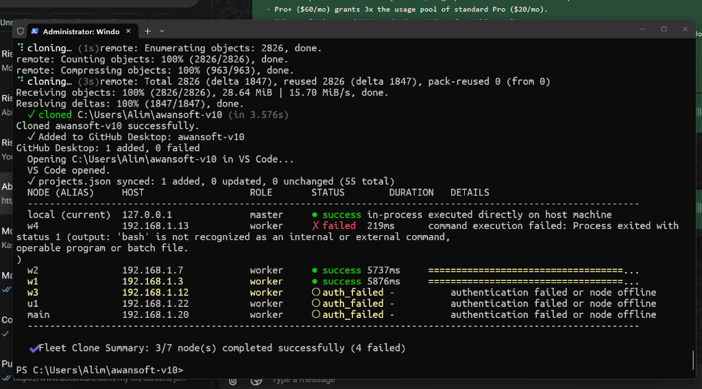

# Specification 191: Fleet Nodes Clone — Except-Self, Windows Remote Shell Runner, and Target Directory Architecture

**Status:** Active
**Author:** Lead Architect
**Category:** Fleet Management & Remote Execution
**Reference:** [02-spec/21-app/readme.md](readme.md)
**RCA Link:** [02-spec/22-app-issues/54-windows-node-bash-missing-clone-failure-rca.md](../22-app-issues/54-windows-node-bash-missing-clone-failure-rca.md)
**Visual Asset:** 

---

## 1. Domain Context & Architecture Overview

`gitmap nodes clone`, `gitmap nodes cfr`, and `gitmap nodes cfrp` orchestrate concurrent repository cloning and manifest staging across the local host and all enrolled remote fleet nodes over SSH.

### 1.1 Problems Identified in Real-Life Fleet Runs
1. **Windows SSH Shell Failure on Remote Nodes:**
   - In real-world fleet deployments, Windows nodes (such as `w4` at `node-w4`) run OpenSSH server with `cmd.exe` or `powershell.exe` as the default shell.
   - When a node is recorded with an outdated or misdetected OS profile (e.g., recorded as `linux` instead of `windows`), the remote runner unconditionally executes `bash -c ...`.
   - Windows returns:
     `'bash' is not recognized as an internal or external command, operable program or batch file.`
     causing the clone to fail in 219ms without self-healing.
2. **Missing Work Directory Navigation for Direct Git URLs:**
   - When cloning a raw Git URL (without a manifest file like `gitmap.json`), GitMap failed to `cd` or `Set-Location` into the node's work directory (`D:\work` on Windows, `~/work` on Linux) before running `gitmap clone <url>`, leaving clones scattered in default login homes.
3. **Lack of Target Directory Argument Support:**
   - Users could not supply a target directory path after the URL (e.g. `gitmap nodes clone <url> <target_path>`), preventing custom folder layouts across the fleet.
4. **Lack of `except-self` Execution Mode:**
   - Users often want to clone a repository only across remote fleet nodes (e.g. test clusters, worker nodes) without dirtying or modifying the current machine running the command.
5. **Terminal UI Degradation on Multi-Line Stderr:**
   - Raw multi-line stderr outputs broke column alignments and wrapped uncontrollably across terminal rows.
   - Skipped local executions were deceptively marked as `● success in-process executed directly on host machine`.

---

## 2. Technical Specifications & Architecture Blueprint

### 2.1 OS-Aware Remote Shell Runner & Self-Healing Fallback
- **Heuristic Detection:**
  A node is identified as Windows if:
  - `conn.OS` is `windows` or `win`
  - `conn.OSGroup` is `windows`
  - `conn.Username` is `administrator` (case-insensitive)
- **Automatic Fallback on `'bash' not recognized`:**
  If a remote execution over `bash` yields `'bash' is not recognized` or `bash: command not found`:
  1. The runner immediately catches the error.
  2. Dynamically switches to `shell = "ps"` (`powershell -NoProfile -Command ...`).
  3. Rebuilds the command with `Set-Location` Windows syntax.
  4. Retries execution over SSH seamlessly.
  5. Upon success, asynchronously updates `SSHConnection.OS = 'windows'` in the Split-DB so future runs require zero retry overhead.

### 2.2 Work Directory Resolution & Target Path Support
- **Default Work Directory:**
  - Windows: `D:\work` (or `C:\work` if configured)
  - Linux/Unix: `~/work` (or `$HOME/work`)
- **Custom Target Path:**
  - Positional argument immediately following the repository URL:
    `gitmap nodes clone <repo|url> [target_path]`
    `gitmap nodes cfr <repo|url> [target_path]`
    `gitmap nodes cfrp <repo|url> [target_path]`
- **Command Construction:**
  - Windows: `Set-Location "<workDir>"; gitmap <kind> <args>`
  - Unix: `cd "<workDir>" && gitmap <kind> <args>`

### 2.3 `except-self` / `no-self` Dispatch Mode
- Supported invocations:
  - Flag: `--except-self`, `--exceptself`, `--no-self`, `--without-self`
  - Subcommand token: `gitmap nodes clone except-self <url> [target_path]`
  - Alias: `gitmap nodes clone-except-self <url> [target_path]`
- When active:
  - Local host clone execution is skipped (`opts.IsSkipLocal = true`).
  - Terminal table explicitly reports `local (current)` as `○ skipped (except-self)`.

### 2.4 Modern Terminal Table Layout & Clean Diagnostics
- **Clean Single-Line Details:**
  - Stderr is sanitized: newlines removed, trailing error envelopes extracted into concise messages (e.g. `✗ 'bash' missing on Windows node (retried with PowerShell: ok)`).
  - Stdout is sanitized: separator banners (`===...`) stripped, reporting the final action summary (`✓ cloned in 3.5s`, `✓ up to date`).
- **Structured Badges:**
  - `● success` (Green)
  - `○ skipped` (Cyan/Yellow)
  - `○ auth_failed` (Yellow)
  - `✗ failed` (Red)

---

## 3. Data Contracts & Model Extensions

```go
type NodesCloneOptions struct {
	Kind          NodesCloneKind `json:"kind"`
	TargetFilter  string         `json:"targetFilter,omitempty"`
	ExcludeFilter string         `json:"excludeFilter,omitempty"`
	ExceptOS      string         `json:"exceptOS,omitempty"`
	TargetOS      string         `json:"targetOS,omitempty"`
	TargetDir     string         `json:"targetDir,omitempty"`
	IsDryRun      bool           `json:"isDryRun"`
	IsJSON        bool           `json:"isJSON"`
	IsSkipLocal   bool           `json:"isSkipLocal"`
	RawArgs       []string       `json:"rawArgs"`
	PassArgs      []string       `json:"passArgs"`
	DetectedFile  string         `json:"detectedFile,omitempty"`
	HasFile       bool           `json:"hasFile"`
}
```

---

## 4. Acceptance Criteria & Quality Gates

1. **AC-NC-001 (Windows Shell Fallback):** If a remote node fails with `'bash' is not recognized`, it automatically retries with PowerShell and succeeds without manual intervention.
2. **AC-NC-002 (Work Directory cd):** Remote node commands always navigate to the target work directory before cloning, even when cloning bare Git URLs.
3. **AC-NC-003 (Target Directory Parameter):** Passing `[target_path]` after the repository URL executes the clone into that directory on both local (if not skipped) and remote nodes.
4. **AC-NC-004 (`except-self`):** `gitmap nodes clone --except-self <url>` skips local machine cloning and runs purely across remote fleet nodes.
5. **AC-NC-005 (UI Cleanliness):** Stderr and stdout in the details column contain zero unescaped newlines and maintain exact column alignment.
6. **AC-NC-006 (Help Docs):** `gitmap nodes clone --help` displays all flags, parameters, and examples.
