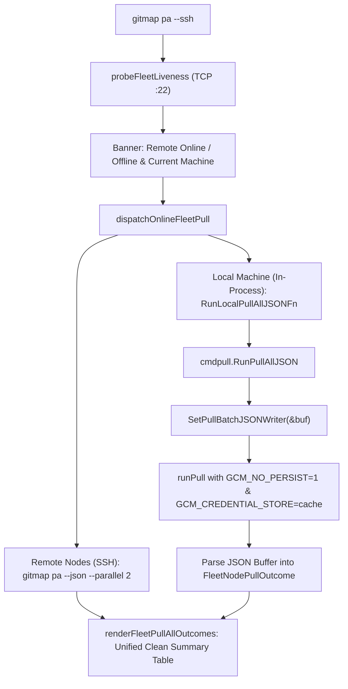

# 193. In-Process Fleet Pull JSON Delegation and Wincredman Concurrency Isolation

## 1. Executive Summary & Architectural Overview

When users invoke SSH fleet synchronization (`gitmap pa --ssh` / `gitmap pull-all --ssh`), GitMap orchestrates concurrent repository synchronization across remote SSH fleet nodes and the local machine. This specification formalizes the in-process execution model for local fleet tasks and guarantees Git Credential Manager isolation on Windows.

1. **In-Process Local Task Delegation:**
   - In `cli/cmdssh/ssh_pull_fleet.go`, `executeLocalVMPull` delegates directly in-process via `cmdpull.RunPullAllJSON` using the wired `RunLocalPullAllJSONFn` callback hook.
   - External OS subprocess spawning (`exec.Command("gitmap", "pa", "--json")`) is strictly eliminated from normal execution, preventing binary mismatch, PATH resolution divergence, and subshell overhead.
   - Batch pull output is captured into an in-memory buffer via `SetPullBatchJSONWriter` without mutating OS stdout pipes.

2. **Windows Credential Manager (`wincredman`) Concurrency Isolation:**
   - All automated and batch Git commands (`cloner.SafePullOneWithProgress`, `executeGitPullCommand`, `runGitPush`, `runGitPullRebase`, `runClone`) inject `GCM_NO_PERSIST=1` and `GCM_CREDENTIAL_STORE=cache` into the subprocess execution environment.
   - This prevents Git Credential Manager from attempting concurrent disk writes to Windows Credential Manager (`CredWriteW`), eliminating `fatal: Unable to persist credentials with the 'wincredman' credential store.` failures across parallel workers.

3. **Core Command Alias Recognition:**
   - `isGitmapCoreCommand` in `cli/cmdssh/ssh_exec_command.go` recognizes `pa`, `pae`, `paet`, `ca`, `cfr`, `cfrp`, and `sa` as first-class GitMap verbs, delegating remote invocations to `gitmap <verb>` seamlessly.

---

## 2. Data Contracts & Architecture



### 2.1 In-Process Pull JSON API

In `cli/cmdpull/pullall.go`:
```go
func RunPullAllJSON(args []string) (string, error)
```

In `cli/cmdpull/pull_batch_json.go`:
```go
func SetPullBatchJSONWriter(w io.Writer)
func ResetPullBatchJSONWriter()
```

In `cli/cmdssh/ssh_pull_fleet.go`:
```go
var RunLocalPullAllJSONFn func(args []string) (string, error)
```

Wired in `cli/cmd/clihelpers.go`:
```go
cmdssh.RunLocalPullAllJSONFn = cmdpull.RunPullAllJSON
```
