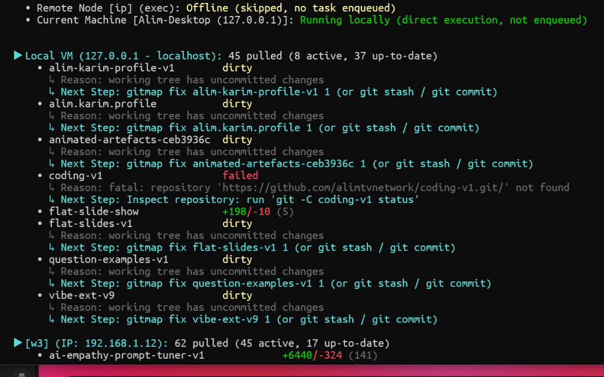
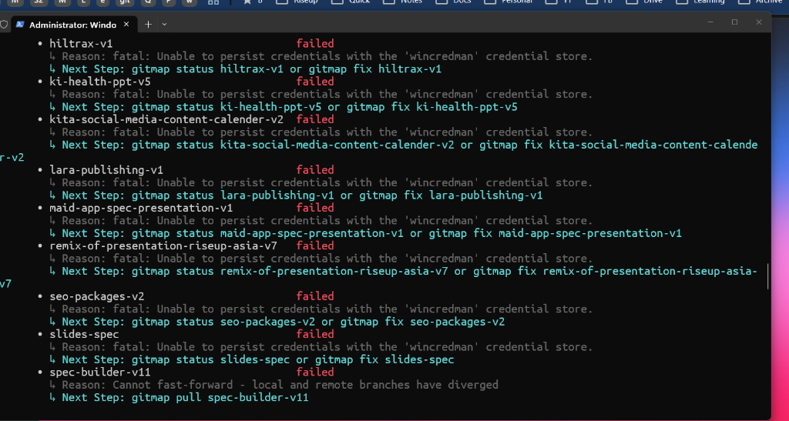

# Spec 198: PAS Worker Concurrency, Pull-Error Split-DB Subsystem & Machine Telemetry

## 1. Overview & Problem Statement

Users running `gitmap pa --ssh` (alias `gitmap pas`) across distributed SSH fleets and local developer machines reported several operational issues:
1. **Silent Fleet Hangs:** When fleet nodes or local workers take more than 30 seconds (due to network latency, large packfiles, or credential locks), the terminal provides no intermediate heartbeat progress, appearing hung.
2. **Missing Node Version Telemetry:** Fleet banners only show `Online` or `Offline` status without reporting the running `gitmap` version on each remote node, making fleet version drift invisible.
3. **Lack of Granular Concurrency Controls:** Users need explicit worker and hand constraints (`--w <N>`, `--hand <Y>`, `--wwoh`, and `paswh [N] [Y]`) to throttle or scale pull operations across low-resource nodes.
4. **Ambiguous `gitmap machine` Output:** Invoking `gitmap machine` leaks full generic command help menus instead of returning clean machine telemetry (alias, hostname, IP, OS, architecture, GitMap version) and JSON support.
5. **Output Unstructured & Opaque Dirty States:** The pull summary renders a flat list without categorized groupings (Updated, Dirty, Failed) and conceals which specific files are dirty.
6. **No Dedicated Pull-Error Inspection (`gitmap pull-error`):** Users and AI agents lack a unified, context-aware command backed by a Split-DB SQLite engine to inspect past pull failures, stack traces, and actionable remediation commands locally and across SSH fleet nodes.
7. **Wincredman Diagnostic Gaps:** Failures such as `fatal: Unable to persist credentials with the 'wincredman' credential store` lack immediate, native GitMap recovery guidance.

---

## 2. Architectural Design & Component Contracts

### 2.1 Machine Telemetry Specialization (`gitmap machine`)

- **Primary Command:** `gitmap machine` (aliases: `machines`, `machine-name`, `hostname`).
- **Behavior:**
  - When invoked with no positional arguments (or with `--json`), it directly renders machine identity without dumping the help banner.
  - If `-h` or `--help` is supplied, it displays the command usage and subcommands.
  - Supports flags: `--json` (`-j`), `--ssh` (`-s`).
- **Telemetry Schema (`MachineIdentity`):**
  - `NodeID`: Local identifier (e.g. `local-01` or SSH node ID).
  - `IPAddress`: Primary non-loopback IPv4 address.
  - `Alias`: Configured machine alias (`machine.alias`) or IP fallback.
  - `MachineName`: Machine name (`machine.name`) or OS hostname.
  - `OSHostname`: Operating system hostname.
  - `OSPlatform`: Operating system name (`windows`, `linux`, `darwin`).
  - `OSVersion`: Kernel / OS release string.
  - `Architecture`: CPU architecture (`amd64`, `arm64`).
  - `CPUCores`: Logical CPU core count.
  - `CurrentUser`: Active login username.
  - `GitMapVersion`: Current GitMap binary version (`v6.307.0`).
  - `Scope`: `local` or `ssh`.

### 2.2 SSH Fleet Startup Version Display

In `cli/cmdssh/ssh_pull_fleet.go` and `cli/cmdssh/ssh_pas_fleet.go`:
- The startup enqueue banner displays the resolved GitMap version for each reachable remote node and the local machine:
  ```text
  Enqueuing 'pull-all' across SSH fleet:
    • Remote Node [w3] (node-w3) [GitMap v6.306.0]: Online → Enqueued (async)
    • Remote Node [w1] (node-w1)  [GitMap v6.307.0]: Online → Enqueued (async)
    • Remote Node [w2] (node-w2)  [GitMap v6.307.0]: Online → Enqueued (async)
    • Remote Node [w4] (node-w4): Offline (skipped, no task enqueued)
    • Current Machine [Alim-Desktop (127.0.0.1)] [GitMap v6.307.0]: Running locally (direct execution, not enqueued)
  ```
- Node liveness probing queries `gitmap --version` or REST `/api/v1/version` in parallel with a 1.5s timeout. If unavailable, falls back to `[GitMap unknown]`.

### 2.3 Concurrency Resolver & `paswh` Command

- **Flags in `gitmap pull` and `gitmap pas`:**
  - `--w <N>`, `--worker <N>`, `--workers <N>`: Worker pool thread count $N$ (default: `auto` or NumCPU / 2 for SSH).
  - `--hand <Y>`, `--h <Y>`, `--hands <Y>`: Concurrent hands per worker $Y$ (default: `1`).
  - `--worker-with-one-hand`, `--wwoh`: Shorthand asserting $N=1, Y=1$ (or $Y=1$ hand per worker).
- **Dedicated Root Alias:** `gitmap paswh [N] [Y]`
  - Expands to `gitmap pull-all --ssh --w N --hand Y`.
  - Default values when arguments omitted: $N=1, Y=1$.
  - When one argument passed: $N=N, Y=1$.
  - When two arguments passed: $N=N, Y=Y$.

### 2.4 Terminal Heartbeat Progress (>30s)

- When pull operations exceed 30 seconds of total execution:
  - An asynchronous background ticker wakes every 5 seconds.
  - Emits an inline non-destructive status line:
    `[⏳ 35s elapsed] 14/48 completed • 3 active workers • 0 failures so far...`
  - Replaced or cleared once pull completes or prints the final summary.

### 2.5 Structured Output Grouping & Dirty Files Breakdown

In `cli/cmdpull/pull_efficient_render.go`:
- Results are organized into three distinct sections:
  1. **Updated Repositories:**
     - Displays repositories that pulled new commits.
     - Formats commit range and line statistics: `+42/-10 (5 commits)`.
  2. **Dirty Repositories:**
     - Displays repositories skipped due to uncommitted working tree changes.
     - Queries `gitutil.InspectDirtyState(repoPath)` to render indented itemized file lists:
       - `modified: <path>`
       - `untracked: <path>`
     - Displays actionable GitMap commands: `gitmap fix <repo>, gitmap cpar, or gitmap stash`.
  3. **Failed Repositories:**
     - Displays repositories that failed during fetch/merge/rebase.
     - Displays classified error line and exact remediation command.

### 2.6 GitMap Pull-Error Subsystem (`gitmap pull-error`)

- **Commands:** `gitmap pull-error`, `pull-errors`, `pulle`, `pull-e`.
- **Arguments:**
  - `<alias, path, id>`: Filters errors for a specific repository.
  - `all`: Inspects errors across all repositories from the latest pull run.
  - **Context-Aware Default:**
    - If executed inside a repository directory (`cwd` contains `.git`), defaults to that repository.
    - If executed outside any repository, defaults to `all`.
- **Flag `--ssh`:**
  - Gathers error entries from remote SSH fleet nodes via daemon or direct SSH split-DB query.
  - Outputs node alias, node GitMap version, failure timestamp, and error traces.
- **Split-DB Persistence (`data/pull-errors/sql.db`):**
  - Database table: `pull_errors` managed under `cli/store/`:
    ```sql
    CREATE TABLE IF NOT EXISTS pull_errors (
        error_id TEXT PRIMARY KEY,
        repo_slug TEXT NOT NULL,
        repo_path TEXT NOT NULL,
        node_id TEXT NOT NULL,
        node_version TEXT NOT NULL,
        error_type TEXT NOT NULL,
        error_text TEXT NOT NULL,
        stack_trace TEXT,
        remediation_cmd TEXT,
        created_at DATETIME NOT NULL
    );
    CREATE INDEX IF NOT EXISTS idx_pull_errors_repo ON pull_errors(repo_slug);
    CREATE INDEX IF NOT EXISTS idx_pull_errors_created ON pull_errors(created_at DESC);
    ```
- **AI Ingestion Formatting:**
  - Displays error details cleanly labeled with Error Type, Cause, Stack Trace, and Remediation Command for autonomous agent self-healing.

### 2.7 Wincredman Diagnostic Remediation

- In `cli/cmdpull/pull_remediation_hint.go`:
  - Recognizes `wincredman` or `Unable to persist credentials with the 'wincredman' credential store`.
  - Emits: `Run 'gitmap fix-credential' (alias: fc) or check Windows Credential Manager service`.

### 2.8 Visual Telemetry & Error Evidence




---

## 3. Verification & Compliance Gates

1. **Gate 1 - Zero Builds / Zero Tests (Rule R1):** No `go build` or `go test` executed.
2. **Gate 2 - Relative Git Paths (Rule R11):** All commands use relative paths from repo root.
3. **Gate 3 - Disjoint File Ownership (Rule R6):** No parallel subagent edits overlapping files.
4. **Gate 4 - Guideline Linter:** Python guideline autofixer passes without syntax regressions.
