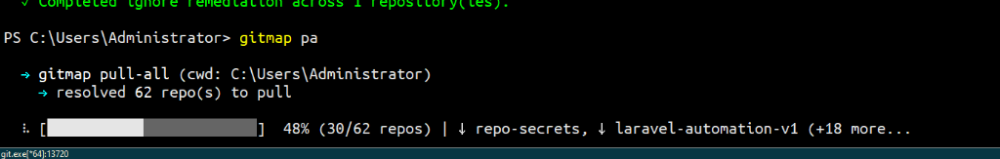
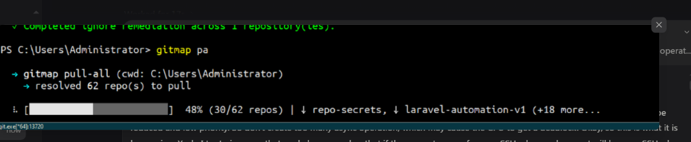

# 201 — GitMap Pull Concurrency Throttling, Split-DB GitIgnore Cache Engine, Subprocess Deadlock Prevention, and Single-Hand SSH Delegation

## Status: Active
- **Spec ID:** 201
- **Scope:** Application Architecture, CLI Subsystems, Performance Optimization, Database Caching
- **Created At:** 2026-10-01
- **Tracking Plan:** [.ai-memory/plans/pending/64-pull-ignore-concurrency-split-db-cache-and-deadlock-prevention.md](../../.ai-memory/plans/pending/64-pull-ignore-concurrency-split-db-cache-and-deadlock-prevention.md)

---

## 1. Visual Context & Ingested Assets

### 1.1 Pull Deadlock at 48% and 64 Accumulated Subprocesses
Telemetry captured during `gitmap pa` across 62 repositories demonstrates the terminal hanging indefinitely at 48% progress (30/62 repos) with 64 concurrent `git.exe` worker processes accumulating in the process table:



### 1.2 System Prompt & Telemetry Overlay
Overlay screenshot demonstrating user directives for background ignore operation throttling, Split-DB persistence, and single-hand SSH clamping:



---

## 2. User Request (Verbatim)

```text
In times when we are running this Git lab pull, sometimes when the pulling starts, the machine gets stuck. Okay? Check the async operation, how many you are actually starting. Try to reduce this number on checking the ignore issue. Okay, so ignore issue should be reduced and low priority. So don't create too many async operation, which may cause the CPU to get a deadlock. Okay, so this is what it is happening. Yeah, I try to improve that, and also remember that if the request comes from an SSH, okay, and request will have an SSH when it comes, so that you know it is coming using the SSH. So there should be different parameters how another Git lab request too. Then you run on one hand. Not too many, let's say, operations on the gitignore. And also, since the gitignore is an expensive operation, if you perform recently, okay, try to keep a save into a split DB. So create a gitignore split DB for the repositories, and when you perform how you perform, okay, use the normalized database version so that before the system starts doing a search, so you know that when it has performed last time. So let's say if it is performed one time in a day, that's enough. By default, this timing can be changed from the settings UI and settings, like what is the config for checking the ignore by default. It will be one day. And you can have CLI commands to change these settings. That's also fine. These settings can also be tapped into from the ignore subcommand. Okay, have a subtext example as well, also from the settings itself as well. So this will fix a lot of issues, right? So you don't need to check too many files and too many things if it is already checked once, okay? And, yeah, if you follow this, I think you will improve the coding, reducing the deadlock, and making things better. What do you think? If there is any other things that you think we can improve to reduce the deadlock, I think we can then focus on this. What do you think? Share your thoughts.
```

---

## 3. Problem Statement & Root Cause Analysis

During batch pull commands (`gitmap pa` / `gitmap pull-all`) across multiple repositories (e.g., 62 repos), systems encounter sudden freezes, 100% CPU lockups, and unrecoverable deadlocks around ~48% completion (30/62 repos).

### Root Cause 1: Subprocess Flooding from Unconstrained Async Ignore Checks
`cli/cmdpull/pull.go` fires `startAsyncIgnoreScan(records)`, which calculates up to 8 concurrent workers (`calculateIgnoreWorkers(62) = 8`). For each repository, `findTrackedDefaultIgnorePaths` spawns 5–6 separate `git ls-files --error-unmatch` subprocesses. With 8 parallel ignore workers running concurrently with 8 parallel `git pull` network workers, over 370 git subprocesses contend simultaneously for file handles, `.git/index.lock`, and CPU cycles.

### Root Cause 2: Missing Subprocess Context Timeouts
All `exec.Command("git", ...)` invocations in `isPathTrackedInGitIndex` and ignore resolution lack `context.WithTimeout`. When git encounters file lock contention on `.git/index.lock` or hangs on credential prompts, it blocks indefinitely. Up to 64 `git.exe` processes accumulate, permanently freezing parent goroutines.

### Root Cause 3: Zero Caching of Expensive Ignore Audits
Ignore inspections re-evaluate identical repository worktrees on every single pull command, despite `.gitignore` rules and tracked files changing rarely.

### Root Cause 4: High Concurrency over Remote SSH Sessions
Remote delegations over SSH share the same aggressive multi-worker concurrency as high-spec local sessions, overwhelming remote VMs, SSH sockets, and file systems.

---

## 4. Architectural Blueprint & Technical Specification

```text
┌────────────────────────────────────────────────────────────────────────┐
│                        GitMap Pull Orchestrator                        │
└───────────────────┬────────────────────────────────┬───────────────────┘
                    │                                │
                    ▼                                ▼
     ┌─────────────────────────────┐  ┌─────────────────────────────┐
     │  Primary Pull Task Queue    │  │ Throttled Ignore Subsystem  │
     │  - N Workers / H Hands      │  │ - Clamped to 1 Worker (Low) │
     │  - If SSH: Clamped to 1/1   │  │ - 10ms Cooperative Pauses   │
     └──────────────┬──────────────┘  └──────────────┬──────────────┘
                    │                                │
                    │                                ▼
                    │                 ┌─────────────────────────────┐
                    │                 │  Split-DB Cache Pre-Filter  │
                    │                 │  - Check TTL (Default 24h)  │
                    │                 │  - Warm: Bypassed (0 proc)  │
                    │                 │  - Cold: Sequential Scan    │
                    │                 └──────────────┬──────────────┘
                    │                                │
                    ▼                                ▼
     ┌─────────────────────────────────────────────────────────────┐
     │           gitutil.ExecGitWithTimeout (15s context)          │
     │   - Automatic SIGKILL on Hang                               │
     │   - Zero Zombie Process Accumulation                        │
     └─────────────────────────────────────────────────────────────┘
```

### 4.1 Concurrency Throttling & Priority Reduction
1. **Low Priority Sequential Queue:** Background `.gitignore` scanning during pull operations is strictly restricted to a single worker (`CalculateIgnoreWorkersForPull() = 1`).
2. **Cooperative Pauses:** Between repository audits, the single worker yields execution (`time.Sleep(10 * time.Millisecond)`), preventing CPU starvation and ensuring the primary pull progress UI renders smoothly.
3. **Split-DB Cache Filter:** Prior to launching background tasks, repositories are filtered via `cmdignore.FilterReposNeedingCheck(records, ttl)`. Repositories checked within the TTL are completely bypassed from disk/index scanning.

### 4.2 SSH Session Detection & Single-Hand Clamping
1. **Detection:** Detect SSH sessions via `cloneconcurrency.IsSSHSession()` (`SSH_CLIENT`, `SSH_CONNECTION`, `GITMAP_SSH_DELEGATED`) or the `--ssh` CLI flag.
2. **Clamping:** When an SSH session is active, automatically clamp pull workers and hands:
   - `opts.workers = 1`
   - `opts.hands = 1`
   - `opts.parallel = 1`
3. Force serial execution via `runSerialPull(records, bar)` to eliminate multi-socket race conditions on remote targets.

### 4.3 Subprocess Deadlock Prevention via Timeouts
1. Provide `gitutil.ExecGitWithTimeout(timeout time.Duration, dir string, args ...string) ([]byte, error)`.
2. Wrap all git commands (`ls-files`, `status`, `rm --cached`) with `context.WithTimeout` (default 15s).
3. Stalled processes are terminated cleanly, eliminating zombie process buildup.

### 4.4 GitIgnore Split-DB Caching Engine
- **Storage Location:** `.gitmap/data/gitignore/cache/sql.db` via `store.ResolveSplitDbPath("gitignore", "cache", "")`.
- **Table Schema:**
  ```sql
  CREATE TABLE IF NOT EXISTS gitignore_repo_cache (
      id INTEGER PRIMARY KEY AUTOINCREMENT,
      repo_path TEXT NOT NULL UNIQUE,
      repo_slug TEXT NOT NULL,
      last_checked_at INTEGER NOT NULL DEFAULT 0,
      status TEXT NOT NULL DEFAULT 'clean',
      remediated_count INTEGER NOT NULL DEFAULT 0,
      duration_ms INTEGER NOT NULL DEFAULT 0,
      is_active INTEGER NOT NULL DEFAULT 1
  );

  CREATE UNIQUE INDEX IF NOT EXISTS idx_gitignore_cache_repo_path 
      ON gitignore_repo_cache(repo_path);
  CREATE INDEX IF NOT EXISTS idx_gitignore_cache_last_checked 
      ON gitignore_repo_cache(last_checked_at);
  CREATE INDEX IF NOT EXISTS idx_gitignore_cache_is_active 
      ON gitignore_repo_cache(is_active);
  ```
- **CRUD Operations:**
  - `GetLastIgnoreCheck(repoPath string) (*GitIgnoreRecord, error)`
  - `RecordIgnoreCheck(record GitIgnoreRecord) error`
  - `IsCheckRecent(repoPath string, ttl time.Duration) bool`
  - `InvalidateCache(repoPath string) error`
  - `ListCachedChecks() ([]GitIgnoreRecord, error)`

### 4.5 Configuration & CLI Commands
- **Setting Key:** `gitignore_check_interval` in `cli/config/settings.go`, default `"24h"`.
- **Interval Parser:** Supports `"24h"`, `"1d"`, `"12h"`, `"30m"`, `"0"` / `"off"` (disabled).
- **CLI Subcommands:**
  - `gitmap ignore config`: Display active check interval, Split-DB path, and cache stats with subtext examples.
  - `gitmap ignore config set interval <duration>`: Persist updated audit frequency.
  - `gitmap ignore cache`: List cached repository ignore check statuses.
  - `gitmap ignore cache clear` / `--force`: Invalidate cache entries to force fresh re-scans.
  - `--interval <duration>` / `-i <duration>`: Command-line override for individual pull or ignore operations.

---

## 5. Verification & Acceptance Criteria

- [ ] Background ignore check during `gitmap pull` and `gitmap pa` runs on maximum 1 worker with 10ms cooperative pauses.
- [ ] Repositories checked within the configured TTL (default 24h) trigger 0 git subprocesses during pull operations.
- [ ] When running under SSH (`SSH_CLIENT`, `SSH_CONNECTION`, `GITMAP_SSH_DELEGATED`, or `--ssh`), pull concurrency automatically clamps to 1 worker and 1 hand.
- [ ] All git subprocess invocations utilize `ExecGitWithTimeout` with a 15-second timeout, preventing zombie process accumulation.
- [ ] `gitmap ignore config` renders current interval, Split-DB path, and usage subtext examples.
- [ ] `gitmap ignore cache` lists cached repositories, and `gitmap ignore cache clear` resets the cache.
- [ ] All functions adhere to <= 15 lines of executable code and affirmative boolean naming conventions.
- [ ] Unit test suite and compiler build pass cleanly without errors.
