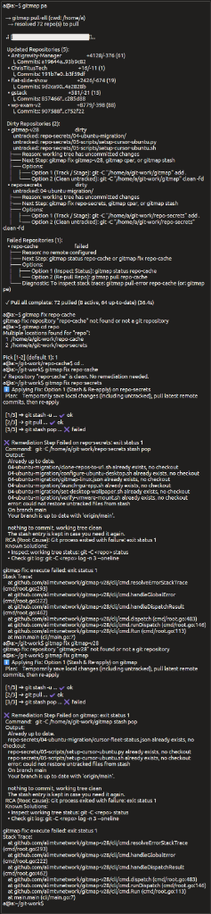

# 202 GitMap Pull Errors and SplitDB Error Storage

## Overview
This specification outlines the architecture for tracking GitMap pull errors (and execution errors) using a SplitDB SQLite architecture, alongside the implementation of fleet and local UI visibility commands (`gitmap nodes errors`, `gitmap see errors`). It also dictates the root cause fix for the `gitmap fix` untracked file collision during `git stash pop`.

## User Request (Verbatim)
```text
Dirty Repositories (2):
    • gitmap-v28                             dirty
        untracked: repo-secrets/04-ubuntu-migration/
...
   Failed Repositories (1):
    • repo-cache                             failed
...
a@a:~$ gitmap fix repo-secrets
ℹ Applying Fix: Option 1 (Stash & Re-apply) on repo-secrets
  Plan:    Temporarily save local changes (including untracked), pull latest remote commits, then re-apply

  [1/3] ➜ git stash -u ... ✔ ok
  [2/3] ➜ git pull ... ✔ ok
  [3/3] ➜ git stash pop ... ✖ failed

✖ Remediation Step Failed on repo-secrets: exit status 1
  Command:   git -C /home/a/git-work/repo-secrets stash pop
  Output:
    Already up to date.
    04-ubuntu-migration/clone-repos-to-u1.sh already exists, no checkout
...
    error: could not restore untracked files from stash
```


"Can you please look into this error? When I try to do a Git pull, I do see these errors, and I have no clue where these errors are and why it is happening. In future, make sure these errors are saved with the SplitDB concept, and also the root error DB should know where these errors are. For specific repos, it will create its own SQLite DB to store this error information, and you should be able to see all this error information from the Gitmap errors section or probably from the Gitmap EA space errors section. Pull all error or pull errors should actually show up, all these repositories errors, all these details, the stack trace. If not, make sure that you correct the code so that it does it. Find the root cause, why it failed, and also find a fix so that in future, you can automatically fix this. If it requires multiple steps to deal with it, you should have it. Make sure that not only these errors, we should be able to use Gitmap nodes errors. We can give a specific node for all, so it will show the error in the terminal or each one of the node actually send the error back as a JSON, so that the Gitmap can show all these errors in the current node and Gitmap can analyze the stack trace and fix the errors for the future. Also, it can clear the errors. Also, the Gitmap nodes errors clear should do the same thing. We could do nodes pull errors, then that would only give the pull request error. Pull errors cleared or pull errors only show the errors. It will receive the error in JSON but display it in the terminal. But also we can receive it if we use the JSON parameter, it will show the errors in JSON format in the terminal."

## Extracted Actionable Task List

1. **Task-01: Spec & Plan Scaffolding**
2. **Task-02: Fix Stash Pop Untracked File Collision Root Cause**
3. **Task-03: SplitDB Error Storage Architecture**
4. **Task-04: GitMap CLI Error Visibility & Fleet Commands**
