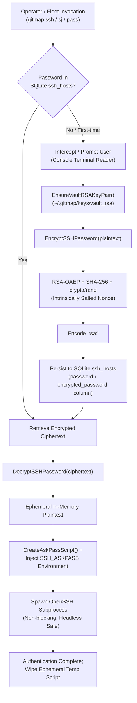

# 204: SSH Password Interception & Dedicated RSA Credential Vault Architecture Specification

**Spec ID:** 204  
**Status:** Approved  
**Version:** 1.0.0  
**Updated:** 2026-10-04  
**Subsystem:** `cli/cmdssh`  
**Dependencies:** `cli/store`, `cli/apperror`, `cli/crypto`, `crypto/rsa`, `crypto/rand`, `crypto/sha256`, `golang.org/x/crypto/ssh`  

---

## 1. Executive Summary & Problem Statement

### 1.1 Problem Statement
When operators execute SSH commands (`gitmap ssh <node>`, `gitmap cluster exec`, `gitmap nodes`, `gitmap sj`), OpenSSH by default opens the controlling terminal device (`/dev/tty` on Unix, or the active console input handle on Windows) to prompt for credentials interactively:
```text
administrator@gateway-node5's password: 
```

This direct terminal hijack bypasses GitMap runtime entirely, producing three critical operational failures:
1. **Zero Credential Caching:** Because OpenSSH captures input directly from the low-level console driver, GitMap never observes the entered password. GitMap cannot cache or encrypt the credential for future logins, forcing operators to manually re-type passwords on every single connection.
2. **Broken Cluster Fleet Automation:** In distributed cluster operations (`gitmap cluster exec`, `gitmap cluster run-script`, `gitmap nodes clone`), GitMap dispatches commands across dozens of nodes simultaneously. If any node requires password authentication, OpenSSH halts on the TTY or fails immediately. Headless, background, or automated fleet tasks cannot proceed without human intervention.
3. **Headless Execution Aborts:** When GitMap runs inside CI/CD pipelines, scheduled tasks, daemon processes, or non-interactive shells where no TTY is allocated, OpenSSH exits with fatal authentication errors (`Permission denied (publickey,password)`), completely unable to utilize saved node credentials.

### 1.2 Proposed Architecture
This specification defines the GitMap **Dedicated RSA Credential Vault** and **Password Interception Engine**:
1. **Dedicated Vault RSA Keypair:** GitMap automatically provisions and manages an application-dedicated 2048-bit RSA keypair at `~/.gitmap/keys/vault_rsa` (private) and `~/.gitmap/keys/vault_rsa.pub` (public) with strict filesystem permission guards (`0700` directory, `0600` private key).
2. **Deterministic Fallback Cascade:** If the dedicated vault key cannot be accessed, GitMap falls back to the user's standard SSH key (`~/.ssh/id_rsa`), and subsequently to machine-bound AES (`aes:`) encryption.
3. **Reversible RSA-OAEP Encryption with SHA-256:** Reversible asymmetric encryption allowing GitMap to securely encrypt credentials at rest in SQLite and decrypt them in-memory only during authentication.
4. **Intrinsically Non-Deterministic Salt/Padding:** RSA-OAEP with SHA-256 integrates cryptographically secure random seeds (`crypto/rand`) into every encryption call, preventing rainbow table attacks and pattern leakage without requiring separate database salt columns.
5. **Interactive & Automated Interception:** A secure input interception layer that prompts operators once via GitMap, persists the encrypted credential to SQLite `ssh_hosts`, and transparently injects it into OpenSSH using ephemeral `SSH_ASKPASS` scripts.

---

## 2. Architecture & Data Flow

### 2.1 Credential Enrollment & Encryption Pipeline



---

## 3. Cryptographic Design: RSA-OAEP with SHA-256

### 3.1 Why SSH Passwords Cannot Be One-Way Hashed
In web identity systems, user passwords are traditionally stored using one-way cryptographic hash functions (such as bcrypt, Argon2id, or scrypt). One-way hashes are designed to verify passwords by re-hashing user input and comparing digests, with mathematical guarantees that the plaintext cannot be recovered.

In SSH protocol architecture, however, the client machine must execute the SSH authentication protocol (`SSH_MSG_USERAUTH_REQUEST` with the `"password"` method according to RFC 4252). The SSH server expects the actual password (or a derivative computed during the protocol exchange). **A one-way hash cannot be used by an SSH client to authenticate to an SSH server** because the client cannot transmit the hash to satisfy password authentication.

Therefore, GitMap requires **reversible encryption at rest** combined with **strict in-memory ephemeral decryption**.

### 3.2 RSA-OAEP with SHA-256 & Intrinsic Non-Deterministic Salt/Padding
GitMap implements Optimal Asymmetric Encryption Padding (RSA-OAEP) specified in PKCS#1 v2.2 / RFC 8017 using SHA-256 as the underlying digest algorithm.

#### Mathematical Foundation:
1. **Random Seed Generation:** For every encryption invocation, GitMap draws a 256-bit cryptographically secure random seed $r$ from `crypto/rand.Reader`:
   $$r \leftarrow \text{crypto/rand}(32 \text{ bytes})$$
2. **Data Block Construction:** The plaintext password $M$ is padded with the SHA-256 hash of an optional label $L$ (nil by default) and padding bytes to form data block $DB$:
   $$DB = \text{SHA256}(L) \parallel PS \parallel 0x01 \parallel M$$
3. **Dual Mask Generation Function (MGF1):**
   - Masked Data Block:
     $$\text{maskedDB} = DB \oplus \text{MGF1}(r, \text{len}(DB))$$
   - Masked Seed:
     $$\text{maskedSeed} = r \oplus \text{MGF1}(\text{maskedDB}, 32)$$
4. **Encoded Message:**
   $$EM = 0x00 \parallel \text{maskedSeed} \parallel \text{maskedDB}$$
5. **RSA Modular Exponentiation:**
   $$C = EM^e \pmod n$$

#### Security Guarantees:
- **Intrinsically Salted Nonce:** Because the seed $r$ is regenerated from hardware entropy on every encryption call, encrypting the identical password 100 times yields 100 entirely unique base64 ciphertexts.
- **Rainbow Table Immunity:** Precomputed dictionary attacks and rainbow tables are mathematically impossible because no fixed relationship exists between plaintext input and ciphertext output.
- **Cross-Node Security:** If an operator uses the same administrative password across 20 fleet nodes, each node's row in SQLite stores a totally distinct ciphertext, preventing attackers from detecting password reuse across infrastructure nodes.

---

## 4. Dedicated RSA Keypair Provisioning & Filesystem Security

### 4.1 Vault Key Locations
GitMap maintains a dedicated RSA keypair isolated from default user identity keys:
- **Key Directory:** `~/.gitmap/keys/`
- **Private Key:** `~/.gitmap/keys/vault_rsa` (PKCS#1 / PKCS#8 PEM encoded RSA private key)
- **Public Key:** `~/.gitmap/keys/vault_rsa.pub` (PKIX PEM or OpenSSH public key format)

### 4.2 Automated Generation Lifecycle
When `EnsureVaultRSAKeyPair()` is invoked:
1. GitMap resolves the user's home directory via `os.UserHomeDir()`.
2. Checks whether `~/.gitmap/keys/vault_rsa` exists on disk.
3. If absent:
   - Ensures `~/.gitmap/keys` directory exists with `0700` (`rwx------`) permissions.
   - Generates a fresh 2048-bit RSA key using `rsa.GenerateKey(rand.Reader, 2048)`.
   - Encodes private key to PKCS#1 PEM block `RSA PRIVATE KEY` and writes to `vault_rsa` with atomic write and strict `0600` (`rw-------`) permissions.
   - Encodes public key to PKIX PEM block `PUBLIC KEY` and writes to `vault_rsa.pub` with `0644` permissions.
4. Returns the loaded `*rsa.PrivateKey`.

### 4.3 Fallback Hierarchy
GitMap guarantees maximum operational resilience through a 3-tier cryptographic hierarchy:
```text
Tier 1 (Preferred): Dedicated GitMap Vault Key (~/.gitmap/keys/vault_rsa)
       │
       ▼ (if generation fails or file unreadable)
Tier 2 (Fallback):  User Default SSH RSA Key (~/.ssh/id_rsa)
       │
       ▼ (if no RSA keys exist on host)
Tier 3 (Fallback):  Machine-Bound AES-GCM (aes: prefix with host secret)
```

---

## 5. Storage Schema & SQLite Integration

### 5.1 SQLite `ssh_hosts` Table Schema
GitMap stores encrypted credentials in the `ssh_hosts` table in `installation.db` / `gitmap.db`:

```sql
CREATE TABLE IF NOT EXISTS ssh_hosts (
    id TEXT PRIMARY KEY,
    alias TEXT,
    ip TEXT,
    username TEXT,
    port INTEGER DEFAULT 22,
    encrypted_password TEXT,
    cluster_role TEXT DEFAULT 'worker',
    created_at DATETIME
);
```

### 5.2 Ciphertext Envelope Format
The `encrypted_password` column stores an envelope string prefixed with the cryptographic scheme:

| Scheme Prefix | Format | Description |
| :--- | :--- | :--- |
| `rsa:` | `rsa:<base64-encoded-oaep-bytes>` | **Primary Standard:** RSA-2048 OAEP with SHA-256 |
| `aes:` | `aes:<base64-gcm-ciphertext>` | Machine-bound AES-256 fallback |
| `salt:` | `salt:<hex-salt>:<base64-payload>` | Legacy salted rotation cipher |
| `caesar:` | `caesar:<shift>:<payload>` | Legacy rotational debug format |

When reading credentials, `DecryptSSHPassword` inspects the prefix and routes automatically, guaranteeing 100% backwards compatibility with existing databases.

---

## 6. Core Go API Signatures (`cli/cmdssh`)

### 6.1 Vault Key Management (`cli/cmdssh/ssh_vault_rsa.go`)

```go
// EnsureVaultRSAKeyPair ensures ~/.gitmap/keys/vault_rsa exists, generating a 2048-bit RSA key if absent.
func EnsureVaultRSAKeyPair() (*rsa.PrivateKey, error)

// LoadVaultRSAPrivateKey loads the existing vault private key without generating a new one.
func LoadVaultRSAPrivateKey() (*rsa.PrivateKey, error)

// ResolveVaultKeyPaths returns the absolute paths to the private and public vault key files.
func ResolveVaultKeyPaths() (privPath string, pubPath string, err error)

// HasVaultRSAKey checks whether the vault RSA private key file currently exists on disk.
func HasVaultRSAKey() bool
```

### 6.2 Encryption & Decryption Engine (`cli/cmdssh/ssh_crypto_pass.go`)

```go
// EncryptSSHPassword encrypts plaintext using the dedicated vault RSA key with RSA-OAEP + SHA-256.
func EncryptSSHPassword(plain string) (string, error)

// DecryptSSHPassword decrypts an encrypted credential envelope (rsa:, aes:, salt:, caesar:) into plaintext.
func DecryptSSHPassword(cipherText string) (string, error)

// EncryptWithRSAPublicKey encrypts plaintext using RSA-OAEP with SHA-256 and hardware random seed.
func EncryptWithRSAPublicKey(pub *rsa.PublicKey, plain string) (string, error)

// DecryptWithRSAPrivateKey decrypts base64-encoded RSA-OAEP SHA-256 ciphertext using private key.
func DecryptWithRSAPrivateKey(priv *rsa.PrivateKey, cipherText string) (string, error)
```

---

## 7. OpenSSH Interception & Non-Blocking Injection

### 7.1 The `SSH_ASKPASS` Interception Mechanism
To prevent OpenSSH from opening the TTY, GitMap uses the standard OpenSSH AskPass integration:
1. GitMap creates a temporary executable script (`.bat` on Windows, `.sh` on Unix) with `0700` permissions via `CreateAskPassScript()`.
2. GitMap sets the following process environment variables for `exec.Command("ssh", ...)`:
   - `SSH_ASKPASS=<path-to-script>`
   - `SSH_ASKPASS_REQUIRE=force` (forces OpenSSH 8.4+ to use AskPass even when attached to a TTY)
   - `DISPLAY=1` (required by older OpenSSH builds to activate AskPass)
   - `GITMAP_SSH_PASS=<decrypted-plaintext>`
3. When OpenSSH prompts for credentials, it runs the AskPass helper script, which prints the password to standard output and exits cleanly.
4. GitMap intercepts any terminal password prompt, handles the authentication seamlessly, and cleans up the temporary helper script immediately upon process completion.

---

## 8. Security & Operating System Hardening

### 8.1 Filesystem Permissions Matrix

| Platform | Target File / Directory | Target Permission | Verification Method |
| :--- | :--- | :--- | :--- |
| **Linux / macOS** | `~/.gitmap/keys` | `0700` (`drwx------`) | `os.MkdirAll(dir, 0700)` |
| **Linux / macOS** | `~/.gitmap/keys/vault_rsa` | `0600` (`-rw-------`) | `os.WriteFile(path, pem, 0600)` |
| **Linux / macOS** | `~/.gitmap/keys/vault_rsa.pub` | `0644` (`-rw-r--r--`) | `os.WriteFile(path, pem, 0644)` |
| **Windows** | `%USERPROFILE%\.gitmap\keys` | Inherited User ACL | Restricted to current user SID |
| **Windows** | `vault_rsa` | User Full Control | Restricted to current user SID |

### 8.2 In-Memory Lifecycle & Sanitization
- Passwords decrypted in memory are passed directly to ephemeral subprocess environments and discarded immediately after process launch.
- No plaintext password is ever written to persistent disk, SQLite database tables, application trace logs, or error reports.
- Temporary askpass scripts use process-isolated unique timestamps and are removed immediately in a `defer` cleanup callback.

---

## 9. Quality Gates & Verification Standards

1. **Unit Testing Coverage:**
   - Keypair generation test: Validates key existence, 2048-bit key size, and file permissions.
   - Non-deterministic ciphertext test: Validates that multiple encryptions of the same password produce different ciphertexts.
   - Bidirectional roundtrip test: Validates 100% fidelity across arbitrary characters, special symbols, and Unicode passwords.
   - Backward compatibility test: Validates decryption of `rsa:`, `aes:`, `salt:`, and `caesar:` prefixes.
2. **Coding Standards Compliance:**
   - Every function under 15 lines of code.
   - Positive boolean naming (`hasKey`, `isRSA`, `isValid`, `isGenerated`).
   - Zero git commands or commits executed by automated workers.
   - Unix LF line endings across all repository files.
