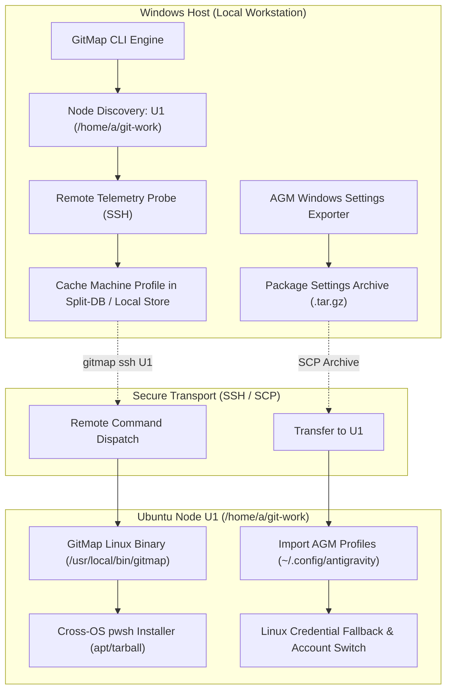

# 205: GitMap U1 Ubuntu Fleet Integration, AGM Migration & Cross-OS Automation

**Spec ID:** 205  
**Status:** Approved  
**Version:** 1.0.0  
**Updated:** 2026-10-04  
**Subsystems:** `cli/cmdssh`, `cli/cmdnode`, `cli/cmdscanner`, `cli/clicolors`, `cli/cmdvisualizer`, `cli/cmdinstall`, `cli/cmdprojectmanager`  
**Target Environments:** Windows (Development Host), Ubuntu Linux (Node `U1` VM)

---

## 1. Executive Summary & Problem Statement

### 1.1 Context & Scope
The GitMap fleet connects developer workstations to remote testing environments, specifically the Ubuntu VM node `U1`. The workspace on `U1` is `/home/a/git-work/`, containing clones of `gitmap` and `Antigravity-Manager` (AGM).

This specification addresses three integrated operational objectives:
1. **Machine Telemetry & Cross-OS Shell Automation:** Automatic discovery, OS profiling, and local caching of node `U1`'s metadata (OS, kernel, arch, GitMap version), enabling GitMap to autonomously select and deploy missing tools like PowerShell (`pwsh`) on Linux without manual operator configuration.
2. **Terminal UX & Output Polish:** Resolving observed visual defects from user terminal captures:
   - Eliminating duplicate scan validation warnings (e.g., repeated notices for `.oh-my-zsh` missing clone URLs across CSV/JSON export passes).
   - Fixing duplicate phrasing in VS Code Project Manager error strings.
   - Upgrading dull, low-contrast terminal tree colors (ANSI 32 dark green and ANSI 33 dull olive) to high-contrast, vibrant High-Intensity ANSI / TrueColor (Bright Bold Green `\033[92;1m` / `#00FF7F` and Bright Bold Yellow `\033[93;1m` / `#FFD700`).
3. **Antigravity Manager (AGM) Linux Migration & Account Switching:** Diagnosing the root cause of AGM's inability to switch accounts on Ubuntu Linux, exporting settings from Windows via GitMap, securely transferring them via SCP, configuring headless credential persistence, and documenting the end-to-end migration runbook.

---

## 2. Architecture & System Flow

---

## 3. Subsystem Specifications

### 3.1 Subsystem A: Machine Telemetry & Local Caching
- **Probe Verbs:** `gitmap nodes probe <node>` / `gitmap ssh <node> --profile`.
- **Cached Fields:**
  - `NodeId`: e.g. `u1`
  - `OS`: `linux`
  - `Distro`: `ubuntu`
  - `Version`: `24.04` / `22.04`
  - `Arch`: `x86_64`
  - `GitMapVersion`: SemVer string
  - `DefaultWorkspace`: `/home/a/git-work`
  - `HasPowerShell`: boolean
  - `HasPython3`: boolean
- **Storage:** Persisted in `~/.gitmap/nodes_cache.json` and SQLite `installation.db` (`NodeTelemetry` table) with TTL expiration (default: 24h, refreshable via `--refresh`).

### 3.2 Subsystem B: Cross-OS PowerShell Installer
- **Command:** `gitmap install pwsh` / `gitmap ssh u1 "gitmap install pwsh"`.
- **Mechanism on Debian/Ubuntu:**
  1. Detect distro family from `/etc/os-release`.
  2. Attempt package installation via `packages.microsoft.com` apt repository.
  3. Fallback: Download standalone portable tarball `powershell-<ver>-linux-x64.tar.gz`, extract to `~/.local/share/powershell/` or `/opt/microsoft/powershell/`, symlink to `/usr/local/bin/pwsh` or `~/.local/bin/pwsh`.
- **Validation:** Execute `pwsh -NoProfile -Command "$PSVersionTable.PSVersion.ToString()"` and report success.

### 3.3 Subsystem C: Scanner Warning Deduplication & Terminal Colors
- **Validation Deduplication:** In `cli/cmdscanner/`, collect scan validation issues into a deduplicated set (`map[string]struct{}`) so messages like `record has no clone URL` are emitted only once per scan rather than repeating during CSV and JSON generation passes.
- **Project Manager String Polish:** In `cli/cmdprojectmanager/`, eliminate duplicated error phrasing `storage dir not found near storage dir not found`.
- **Vibrant ANSI Palette:** In `cli/clicolors/` and tree visualizers:
  - Replace `\033[32m` (dull green) with High-Intensity Neon Green `\033[92;1m` / TrueColor `#00FF7F`.
  - Replace `\033[33m` (dull olive) with High-Intensity Bright Gold `\033[93;1m` / TrueColor `#FFD700`.
  - Maintain crisp branch indicators (`├──`, `└──`) with clear contrast against dark terminal backgrounds.

### 3.4 Subsystem D: AGM Linux Account Switching & Migration
- **Root Cause Analysis (Linux Account Switching):**
  - **Issue 1 (Keyring Hangs in Headless/SSH Sessions):** AGM relies on Secret Service / DBus (`gnome-keyring` / `secret-tool`). In SSH or headless VM sessions without an unlocked desktop keyring daemon, credential storage blocks or fails silently.
  - **Issue 2 (Browser Singleton Locks):** Antigravity / Chrome processes create `SingletonLock` symlinks and `SingletonSocket` sockets under `~/.config/antigravity/` or `~/.config/google-chrome/`. When switching profiles, stale locks prevent the new profile from binding.
  - **Issue 3 (Path Sensitivity):** Windows AGM paths use backslashes and `%APPDATA%`, whereas Linux requires XDG Base Directory standards (`$XDG_CONFIG_HOME` / `~/.config/antigravity`).
- **Remediation & Migration:**
  - Export Windows AGM profiles and OAuth tokens using GitMap.
  - Securely transfer archive to U1 via SCP.
  - Provision file-based encrypted credential storage fallback for headless Linux sessions.
  - Remove stale singleton locks before spawning profile switchers.

---

## 4. Documentation & Migration Runbook Requirements

1. **Migration Documentation:** Produce `migration-windows-to-ubuntu-agm.md` in the repository cache / docs directory detailing commands run, architectural rationale, and performance outcomes.
2. **Automated Migration Script:** Produce `run-migration.sh` enabling automated provisioning and verification on any fresh Linux node.
3. **AI Instruction Prompt:** Author `agm-linux-account-switching-fix.prompt.md` capturing upstream blockers and instructions for autonomous resolution in the AGM repository.
