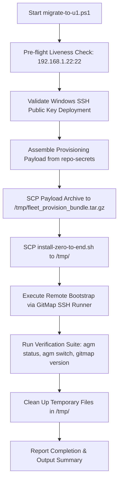

# Specification 206: Windows to Ubuntu Fleet Migration, Zero-to-End Provisioning & Secrets Vault Architecture

> **Spec Version:** 1.0.0  
> **Status:** Active  
> **Classification:** Public System Architecture Specification  
> **Target Scope:** Cross-OS Fleet Migration, Headless AGM Deployment, External Secrets Vault Hygiene

---

## 1. Executive Summary

This specification governs the automated, zero-touch provisioning of remote Linux worker nodes (e.g. node `u1` at `192.168.1.22`) from a Windows developer workstation. It formalizes:
1. A **Zero-Secrets Invariant**: Complete decoupling of application repositories from private secrets, tokens, credentials, and licenses. All sensitive state is confined to the external `repo-secrets` vault.
2. A **Windows PowerShell Controller Runner** (`migrate-to-u1.ps1`): Encapsulating pre-flight probing, bundle packaging, SCP transfer, and remote dispatch from Windows.
3. A **Linux Target Node Zero-to-End Bootstrap Script** (`install-zero-to-end.sh`): Installing `gitmap`, installing `agm` via CLI, resolving Linux launcher recursion, injecting Supabase, Telegram, 35 Google AI accounts, and active licenses.
4. A **Dual-License Secret Vault Schema**: Standardized JSON envelopes for enterprise and node worker licenses.

---

## 2. Security Boundaries & Zero-Secrets Guarantee

### 2.1 The CODE RED Rule
- **Public Git Repositories (`gitmap-v28`, etc.):** MUST NEVER contain plaintext credentials, private tokens, OAuth refresh tokens, Telegram bot tokens, Supabase API keys, or machine passwords.
- **External Storage Location:** All sensitive data resides exclusively in `d:\work\repo-secrets\` (or `/home/a/repo-secrets/` on Linux), which is git-tracked in a private, isolated repository separate from public tool code.
- **Linter Enforcement:** Pre-push checks run `python linter-scripts/check-forbidden-strings.py` and regex scanners to ensure zero leakage.

### 2.2 Storage Layout in `repo-secrets`
```text
d:\work\repo-secrets\
├── 02-antigravity-and-event-manager\
│   └── vault\
│       ├── accounts.json               # Index of 35 registered Google accounts
│       ├── accounts/*.json             # 35 individual account token profiles
│       ├── gui_config.json             # Proxy, auto-switcher, and quota settings
│       ├── update_settings.json        # Auto-update and notification rules
│       ├── telegram_config.json        # Telegram Bot Token & allowed chat ID
│       ├── supabase_config.json        # Lovable root & secondary Supabase endpoints
│       ├── email_vault.db              # Email accounts SQLite database
│       └── email_passwords.db          # Encrypted passwords SQLite database
├── 08-licenses\                        # Isolated license keys vault
│   ├── 01-primary-enterprise.json      # Primary Enterprise Suite License
│   └── 02-cluster-fleet-node.json      # Secondary Fleet Node Worker License
├── migrate-to-u1.ps1                   # Standalone Windows PowerShell migration runner
└── install-zero-to-end.sh              # Standalone Linux zero-to-end bootstrap runner
```

---

## 3. Windows PowerShell Migration Architecture (`migrate-to-u1.ps1`)

The Windows migration controller automates the entire staging and deployment flow without requiring manual SSH/SCP steps.

### 3.1 Execution Pipeline


### 3.2 Staging Bundle Assembly
The PowerShell runner archives the following items into `/tmp/fleet_provision_bundle.tar.gz`:
- `gui_config.json`, `update_settings.json`, `telegram_config.json`, `supabase_config.json`
- `accounts.json` and all `accounts/*.json`
- `email_vault.db`, `email_passwords.db`, `security.db`, `training_vault.db`
- `08-licenses/*.json`
- `scripts/antigravity-launcher.sh`

---

## 4. Target Machine Zero-to-End Installation Architecture (`install-zero-to-end.sh`)

The Linux installation script executes on the target machine (`u1`) and performs end-to-end initialization idempotently.

### 4.1 Step-by-Step Provisioning Flow
1. **System Toolchain & Prerequisites:** Ensures `curl`, `wget`, `git`, `jq`, `sqlite3`, and `libsecret-tools` are installed via `apt-get`.
2. **Directory Tree Canonicalization:**
   - Creates `/home/a/.antigravity_tools/accounts`
   - Creates `/home/a/.antigravity_tools/instances`
   - Creates `/home/a/.antigravity_tools/licenses`
   - Creates `/home/a/.local/bin`
3. **GitMap Installation & Verification:**
   - Verifies `gitmap` binary in `/home/a/.local/bin/gitmap` or `/usr/local/bin/gitmap`.
   - If missing, builds or fetches the release binary.
4. **Antigravity Manager (AGM) CLI Setup:**
   - Verifies `agm` binary in `/usr/bin/agm` or `/home/a/.local/bin/agm`.
5. **Launcher Self-Recursion Fix:**
   - Installs `antigravity-launcher.sh` into `~/.local/bin/antigravity` and `~/.local/bin/antigravity-ide`.
   - Explicitly targets the ELF executable in `/home/a/.local/share/antigravity-ide/antigravity`, preventing `Argument list too long` infinite recursive loops.
6. **Vault & Credentials Injection:**
   - Unpacks and copies all JSON configurations and SQLite databases to `~/.antigravity_tools/`.
   - Injects active Supabase endpoints (Root Lovable and Secondary).
   - Injects Telegram bot token and allowed chat ID.
   - Injects all 35 Google AI accounts into `~/.antigravity_tools/accounts/`.
   - Sets strict POSIX permissions (`chmod 700` on directories, `chmod 600` on credentials and databases).
7. **License Keys Registration:**
   - Deploys `01-primary-enterprise.json` and `02-cluster-fleet-node.json` into `~/.antigravity_tools/licenses/`.
8. **Headless Keyring & Switching Verification:**
   - Executes `agm switch <account>` and asserts that file-based credentials in `~/.gemini/oauth_creds.json` are populated with active OAuth tokens.

---

## 5. Dual-License Secret Storage Schema

Both licenses adhere to the standard GitMap/AGM typed JSON envelope specification:

### 5.1 Primary Enterprise Suite License (`01-primary-enterprise.json`)
- **Tier:** Enterprise Ultimate
- **Scope:** Full cluster delegation, unlimited account rotation, multi-node prompt injection.
- **Envelope Type:** `license-key`

### 5.2 Secondary Cluster Node Worker License (`02-cluster-fleet-node.json`)
- **Tier:** Cluster Node Worker
- **Scope:** Headless task daemon, Split-DB client, remote task execution.
- **Node Binding:** `u1` (192.168.1.22)

---

## 6. Verification & Quality Gates

| Check | Target | Expected Result | Pass Criteria |
| :--- | :--- | :--- | :--- |
| **Secrets Audit** | GitMap Repo (`docs/`, `scripts/`, `cli/`) | Zero regex matches for keys, tokens, or passwords | Linter exits 0 |
| **Windows Migration Script** | Main Host (`192.168.1.20`) | Successful connection, payload staging, SCP transfer | Exit code 0 |
| **Linux Bootstrap Script** | Node `u1` (`192.168.1.22`) | Installs tools, injects Supabase, Telegram, 35 accounts, licenses | Exit code 0 |
| **AGM Account Switching** | Node `u1` (`192.168.1.22`) | `/usr/bin/agm switch <email>` succeeds without recursion error | Exit code 0, active token in `oauth_creds.json` |
