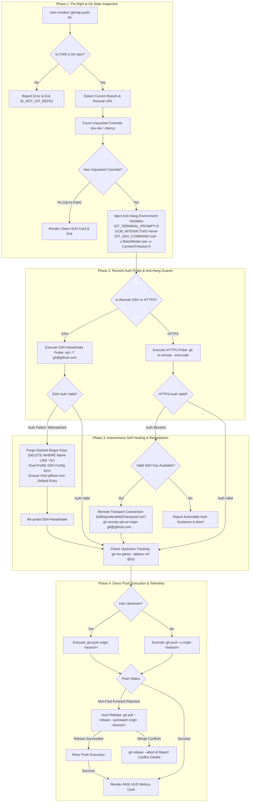

# 210: GitMap Push-Fix Command & Authentication Self-Healing Engine

**Spec ID:** 210  
**Status:** Approved  
**Version:** 1.0.0  
**Updated:** 2026-10-04  
**Subsystems:** `cli/cmdpull`, `cli/cmdpush`, `cli/cmdssh`, `cli/store`, `cli/constants`, `cli/theme`  
**Target Environments:** Cross-Platform (Windows, Linux, macOS)

---

## 1. System Overview & Problem Statement

### 1.1 Context & Problem Statement
Pushing local commits to remote Git repositories (primarily GitHub) is one of the most frequent developer operations. In automated agent environments and day-to-day developer workflows, `git push` frequently breaks down or enters indefinite hangs due to five distinct failure modes:

1. **Interactive Credential Manager Hangs:** When HTTPS credentials expire or require OAuth re-authorization, Git invokes credential helpers such as Git Credential Manager (GCM) or terminal prompts (`Username for 'https://github.com':`). In headless subagents, CI pipelines, or background terminals, this causes commands to block indefinitely until external task timeouts terminate the process.
2. **SSH Identity & Configuration Drift:** Developers frequently generate multiple SSH keys (e.g. personal vs organization), but `~/.ssh/config` or Windows user profile `.ssh/config` files lack a canonical `Host github.com` stanza mapping the default identity. Furthermore, GitMap's SQLite `SshKey` table can inadvertently store dashed bogus records (such as `-y` or `-f` when CLI flags were mistakenly captured as key names), contaminating generated SSH configurations.
3. **Dual Profile Path Desynchronization on Windows:** On Windows, OpenSSH tools and native Git may resolve user configurations either via `%USERPROFILE%\.ssh\config` or `%SystemDrive%\Users\%USERNAME%\.ssh\config`. In divergent environment setups (e.g., elevated administrative shells vs standard user sessions), writes to only one path leave the other stale, causing authentication to succeed in one shell but fail in Git.
4. **Non-Fast-Forward & Diverged Branch Rejections:** When a remote branch receives commits from another branch or remote agent, `git push` fails with a non-fast-forward rejection (`error: failed to push some refs... fetch first`). Standard command chains require manual `git pull --rebase`, conflict checks, and retries.
5. **Missing Upstream Tracking Branch:** In newly created branches, running plain `git push` yields `fatal: The current branch <name> has no upstream branch. To push the current branch and set the remote as upstream, use git push --set-upstream origin <name>`.

### 1.2 Solution Summary
`gitmap push-fix` (also available via subcommand alias `gitmap push fix`, `gitmap pushfix`, and short alias `gitmap pf`) introduces an autonomous diagnostic, self-healing, and direct execution engine. It resolves all five failure modes in an automated, non-interactive 4-phase recovery pipeline.

---

## 2. 4-Phase Recovery Pipeline Architecture



---

## 3. Detailed Phase Specifications

### 3.1 Phase 1: Pre-flight & Git State Inspection

#### 3.1.1 CWD & Repository Discovery
- Pre-flight checks verify that the current working directory (`CWD`) contains a valid `.git` directory or parent repository pointer (`fsutil.IsGitRepo(cwd)` / `isGitRepoCWD()`).
- If CWD is not inside a repository, the pipeline exits with a structured error `apperror.NewValidationError("not a git repository (run inside a repository to fix push)")` and exit code `1`.

#### 3.1.2 Branch and Remote Detection
- Inspect current branch name via:
  ```go
  git symbolic-ref --short HEAD
  ```
  Fallback to `git rev-parse --abbrev-ref HEAD` or detached HEAD detection via `git rev-parse HEAD`.
- Query primary remote (defaulting to `origin`):
  ```go
  git remote get-url origin
  ```
  If `origin` is unset, discover first configured remote via `git remote`.

#### 3.1.3 Unpushed Commits Computation
- Compute pending commits awaiting upstream delivery:
  1. If upstream tracking exists (`git rev-parse --abbrev-ref @{u}` succeeds):
     ```bash
     git rev-list --count @{u}..HEAD
     ```
  2. If upstream tracking does NOT exist:
     ```bash
     git rev-list --count HEAD --not --remotes
     ```
- When unpushed commits count equals 0, verify if working tree is clean (`git status --porcelain`). If both unpushed commits and dirty files are empty, output:
  ```
  ✓ Repository is up-to-date with remote (0 unpushed commits).
  ```

---

### 3.2 Phase 2: Remote Authentication Probe & Anti-Hang Environment Guards

#### 3.2.1 Anti-Hang Environment Isolation
To guarantee non-blocking execution across headless agents and scripts, every subprocess spawned in the recovery pipeline must inject the following mandatory environment variables:

| Environment Variable | Required Value | Rationale |
| :--- | :--- | :--- |
| `GIT_TERMINAL_PROMPT` | `0` | Prohibits Git from opening a TTY prompt for username or password. |
| `GCM_INTERACTIVE` | `never` | Instructs Git Credential Manager to never open GUI dialogs or browser OAuth prompts. |
| `GIT_SSH_COMMAND` | `ssh -o BatchMode=yes -o ConnectTimeout=5` | Prevents OpenSSH from prompting for passphrase or host-key confirmations, capping network connection handshake at 5 seconds. |

#### 3.2.2 SSH Handshake Probing
- For SSH remotes (`git@github.com:...` or `ssh://git@github.com/...`), execute non-interactive probe:
  ```bash
  ssh -T -o BatchMode=yes -o ConnectTimeout=5 -o StrictHostKeyChecking=accept-new git@github.com
  ```
- **Evaluation Criteria:**
  - GitHub SSH daemon always returns process exit status `1` when authentication succeeds because no interactive shell is allocated.
  - The probe parses combined output for confirmation strings:
    - `Hi <username>! You've successfully authenticated` -> Marked as **Valid Authentication**.
    - `Permission denied (publickey)` -> Marked as **Authentication Failure**.
    - `Connection timed out` or `Could not resolve hostname` -> Marked as **Network / DNS Error**.

#### 3.2.3 HTTPS Credential Probing
- For HTTPS remotes (`https://github.com/...`), execute:
  ```bash
  git ls-remote --exit-code <remoteUrl> HEAD
  ```
  Wrapped with `GIT_TERMINAL_PROMPT=0` and `GCM_INTERACTIVE=never`.
- If the probe returns exit status `0`, remote read access is confirmed.
- If the probe returns exit status `128` with `Authentication failed` or `could not read Username for 'https://github.com'`, HTTPS credentials are confirmed blocked or expired.

---

### 3.3 Phase 3: Autonomous Self-Healing & Remediation

#### 3.3.1 Multi-Key & SSH Config Synchronization
- **Purging Dashed Bogus Keys:**
  In `gitmap.db`, parse the `SshKey` table to detect corrupted records where `Name` begins with a hyphen (e.g., `-y`, `-f`, `--force`):
  ```sql
  DELETE FROM SshKey WHERE Name LIKE '-%' OR Name = '';
  ```
  This sanitizes key storage before config reconstruction.

- **Dual-Profile Config Writing on Windows:**
  On Windows systems, write the managed SSH configuration block to both:
  1. `~/.ssh/config` (resolved via standard `os.UserHomeDir()`)
  2. `%SystemDrive%\Users\%USERNAME%\.ssh\config` (resolved via `filepath.Join(os.Getenv("SystemDrive"), "Users", os.Getenv("USERNAME"), ".ssh", "config")`)
  Dual writing ensures both Git for Windows and native Windows OpenSSH (`ssh.exe` in `System32`) discover identical host definitions.

- **Canonical `Host github.com` Emission:**
  Ensure that when a default key (`id_ed25519` or `id_rsa`) exists, the generated SSH configuration provides an explicit default block:
  ```sshconfig
  # === GITMAP MANAGED SSH CONFIG (START) ===
  Host github.com
      HostName github.com
      User git
      IdentityFile ~/.ssh/id_ed25519
      IdentitiesOnly yes

  Host github.com-default
      HostName github.com
      User git
      IdentityFile ~/.ssh/id_ed25519
      IdentitiesOnly yes
  # === GITMAP MANAGED SSH CONFIG (END) ===
  ```

#### 3.3.2 Remote Transport Conversion (HTTPS to SSH Fallback)
- If HTTPS authentication fails (or prompts block), the recovery engine checks whether a valid SSH key is registered and responsive.
- If SSH handshake succeeds:
  1. Parse repository owner and name from HTTPS URL (e.g., `https://github.com/octocat/Hello-World.git` -> `octocat/Hello-World`).
  2. Compute canonical SSH URL: `git@github.com:octocat/Hello-World.git`.
  3. Reconfigure Git remote:
     ```bash
     git remote set-url origin git@github.com:octocat/Hello-World.git
     ```
  4. Persist updated transport verdict in SQLite:
     ```go
     db.SetRepoIdentifiedTransport(remoteURL, "ssh")
     ```
  5. Log transport conversion notification in terminal:
     ```
     ↻ Transport converted from HTTPS to SSH (valid SSH key confirmed).
     ```

#### 3.3.3 Diverged Branch Auto-Rebase
- When `git push` is rejected with non-fast-forward error strings:
  - `[rejected]`
  - `failed to push some refs to`
  - `fetch first`
  - `non-fast-forward`
- Autonomous recovery triggers:
  ```bash
  git pull --rebase --autostash origin <branch>
  ```
- **Outcome Branches:**
  - If rebase completes cleanly (`exit code 0`), the pipeline re-runs `git push` with full telemetry.
  - If merge conflicts occur, the pipeline immediately runs `git rebase --abort` to return the working directory to an untouched state, and renders an actionable conflict resolution prompt with modified file lists.

---

### 3.4 Phase 4: Direct GitHub Push Execution & Telemetry

#### 3.4.1 Upstream Tracking Auto-Configuration
- Check if current branch tracks an upstream branch:
  ```bash
  git rev-parse --abbrev-ref @{u}
  ```
- If upstream is unconfigured (returns exit code `128` with `no upstream configured for branch`):
  - Execute push with upstream binding flag:
    ```bash
    git push -u origin <branch>
    ```
- If upstream is configured:
  - Execute standard push:
    ```bash
    git push origin <branch>
    ```

#### 3.4.2 High-Contrast ANSI Terminal HUD Card
Upon push completion, render a structured ANSI metrics card adhering to GitMap terminal design standards (Neon Green `#00FF7F`, Bright Gold `#FFD700`, Cyan `#8BE9FD`, High-Contrast Bold Text):

```text
┌─────────────────────────────────────────────────────────────┐
│  GITMAP PUSH-FIX TELEMETRY                                  │
├─────────────────────────────────────────────────────────────┤
│  Repository : alimtvnetwork/gitmap-v28                      │
│  Branch     : main                                          │
│  Head Commit: 7f8b9c1 - fix: recover ssh auth & push        │
│  Remote URL : git@github.com:alimtvnetwork/gitmap-v28.git   │
│  Transport  : SSH (Identity: ~/.ssh/id_ed25519)             │
│  Commits    : 3 unpushed commit(s) successfully pushed      │
│  Latency    : 1,240 ms (Probe: 210ms, Push: 1,030ms)        │
│  Status     : ✓ Clean Upstream Synchronized                 │
└─────────────────────────────────────────────────────────────┘
```

---

## 4. CLI Interface & Flag Specifications

### 4.1 Command Invocations
The push-fix engine is exposed via multiple ergonomic command aliases:

1. `gitmap push-fix` (Primary kebab-case command)
2. `gitmap push fix` (Subcommand form under `gitmap push`)
3. `gitmap pushfix` (Condensed alias)
4. `gitmap pf` (High-speed 2-letter alias)

### 4.2 CLI Flags

| Flag | Short | Default | Description |
| :--- | :--- | :--- | :--- |
| `--remote` | `-r` | `origin` | Target Git remote name. |
| `--branch` | `-b` | `<current>` | Target branch name (defaults to active branch). |
| `--ssh` | | `false` | Force convert transport to SSH before probing. |
| `--https` | | `false` | Force convert transport to HTTPS before probing. |
| `--no-rebase`| | `false` | Disable automatic `git pull --rebase` on non-fast-forward rejection. |
| `--dry-run` | `-n` | `false` | Run diagnostics, auth probe, and self-healing checks without pushing commits. |
| `--quiet` | `-q` | `false` | Suppress HUD card, outputting minimal success/failure status. |

---

## 5. Subsystem Component Mapping

| Subsystem | Source Path | Responsibilities |
| :--- | :--- | :--- |
| **Command Routing** | `cli/cmd/dispatchcommittransfer.go`, `cli/cmd/rootcore.go` | Route `push-fix`, `push fix`, `pushfix`, and `pf` to push-fix runner. |
| **Push-Fix Engine** | `cli/cmdpull/push_fix.go` | Orchestrate 4-phase recovery pipeline, inspect branch/commits, execute auto-rebase. |
| **Auth Probing** | `cli/cmdssh/auth_probe.go` | SSH handshake probe with timeout, HTTPS ls-remote probe with anti-hang guards. |
| **SSH Sanitizer** | `cli/cmdssh/sshconfig.go` | Purge dashed keys from `SshKey` table, dual-profile write to `~/.ssh/config` and Windows User profile. |
| **Store & Persistence**| `cli/store/repo_identified_transport.go`, `cli/store/ssh_keys.go` | Persist transport decisions, sanitize `SshKey` records. |
| **Terminal HUD** | `cli/cmdpull/push_fix_hud.go` | Render high-contrast ANSI telemetry card and timing metrics. |

---

## 6. Security, Process Guards & Error Management

1. **Zero Credential Exposure:** Under no circumstances are passwords, tokens, or private key contents logged to stdout, stderr, or `.gitmap/last_error.log`.
2. **Subprocess Anti-Hang Guarantee:** All `os/exec.Command` invocations must specify a hard context timeout (`context.WithTimeout(ctx, 30*time.Second)`), preventing zombie Git processes.
3. **Structured AppError Compliance:** All fatal errors are wrapped using `apperror.NewSimple` or `apperror.WrapSimple` with standard codes:
   - `E_NOT_GIT_REPO`: Invocation outside a Git repository.
   - `E_AUTH_PROBE_FAILED`: Both SSH and HTTPS authentication failed.
   - `E_PUSH_REBASE_CONFLICT`: Auto-rebase encountered unmergeable conflicts.
   - `E_PUSH_EXEC_FAILED`: Underlying `git push` failed after remediation.
4. **Discipline Standard:** No test runs or build runs during specification authoring.
