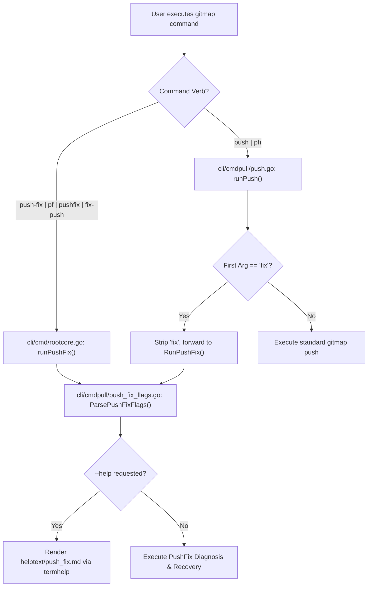
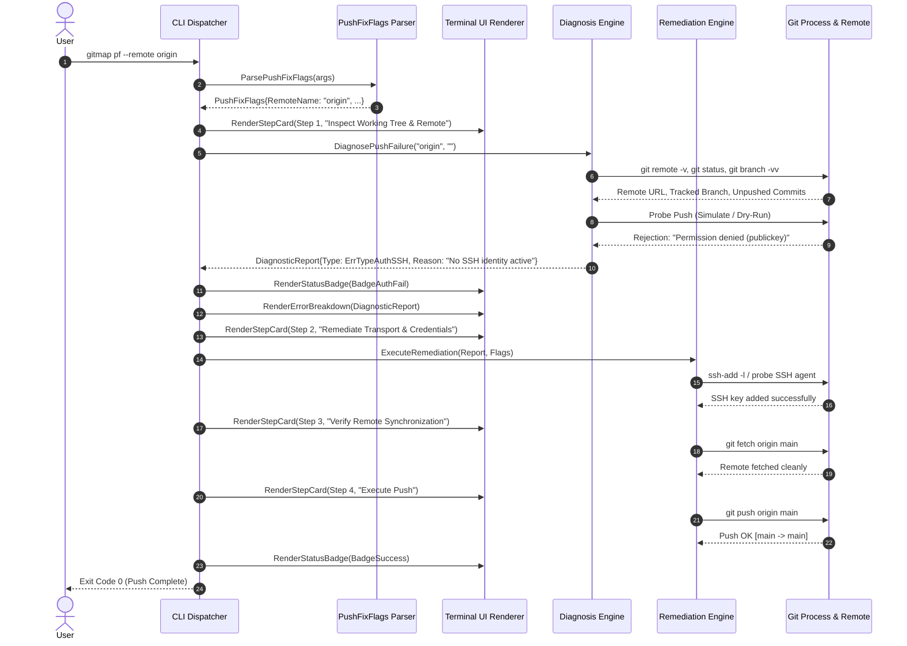

# 02 — CLI Component, Dual-Routing & Terminal UI Specification

> **Task Reference:** `210-gitmap-push-fix-command-and-auth-recovery`  
> **Status:** Specification Complete  
> **Audience:** Core GitMap CLI developers, AI subagents, and testing automation engineers.  
> **Related Specifications:**  
> - `02-spec/21-app/210-gitmap-push-fix-command-and-auth-recovery/01-architecture-and-domain-engine.md` (Domain Diagnosis & Recovery Engine)  
> - `02-spec/21-app/99-cli-cmd-uniqueness-ci-guard.md` (CLI AST Parity & Uniqueness Guard)  
> - `02-spec/02-coding-guidelines/` (Positive Booleans, Relative Paths, Value Semantics)  

---

## 1. Executive Summary & Purpose

When developers execute `git push` in corporate, multi-remote, or fast-moving repositories, pushes frequently fail due to:
1. **Authentication & Token Expirations:** Stale GitHub/GitLab personal access tokens, expired OAuth credentials, SSH key mismatches, or missing SSH agent keys.
2. **Non-Fast-Forward Rejections:** Remote branches advancing ahead of local branches (`[rejected - fetch first]`).
3. **Transport Protocol Misconfigurations:** HTTPS remotes prompting for deprecation passwords instead of SSH keys, or corporate firewalls blocking port 22.
4. **Branch Protection & Force Rules:** Unintentional rejections that require safe `--force-with-lease` after a rebase.

The `gitmap push-fix` command (with short alias `gitmap pf`) provides an autonomous, guided, and safe recovery mechanism. It inspects the local working tree, diagnoses the failure root cause, presents clear diagnostic status badges and step-by-step progress cards, and executes automated remediation with minimal user friction.

This document specifies the **CLI component architecture**, **dual-routing mechanism**, **flag parser**, **constants registry with CI parity**, **terminal UI formatting**, and **non-interactive automation contracts**.

---

## 2. CLI Command Definitions & Dual-Routing Architecture

To maximize developer ergonomics and avoid muscle-memory friction, GitMap implements a **Dual-Routing Architecture**: developers can invoke the recovery workflow either as a dedicated top-level command or as a subcommand nested under the core `gitmap push` wrapper.

### 2.1 Top-Level Command Dispatch

The root dispatcher (`cli/cmd/rootcore.go`) registers the primary command and aliases:

| Command Invocations | Form | Dispatch Target | Description |
|---|---|---|---|
| `gitmap push-fix [flags]` | Canonical Long | `runPushFix(args)` | Dedicated top-level recovery command |
| `gitmap pf [flags]` | Short Alias | `runPushFix(args)` | Ultra-compact 2-letter alias |
| `gitmap pushfix [flags]` | Solid Variant | `runPushFix(args)` | Hyphen-less common developer typing variant |
| `gitmap fix-push [flags]` | Inverted Variant | `runPushFix(args)` | Natural language inverted alias |

### 2.2 Subcommand Interception in `runPush`

The standard push command handler in `cli/cmdpull/push.go` (`runPush`) intercepts `fix` as the first argument or subcommand verb:

| Command Invocations | Form | Interception Point | Delegated Call |
|---|---|---|---|
| `gitmap push fix [flags]` | Subcommand | `runPush(args)` in `cli/cmdpull/push.go` | Strips `"fix"`, calls `runPushFix(argsTail)` |
| `gitmap ph fix [flags]` | Aliased Subcommand | `runPush(args)` in `cli/cmdpull/push.go` | Strips `"fix"`, calls `runPushFix(argsTail)` |

```go
// Interception pattern inside cli/cmdpull/push.go:runPush
func runPush(args []string) error {
    checkHelp(constants.CmdPush, args)
    
    // Intercept "gitmap push fix" and forward to PushFix engine
    if len(args) > 0 && isPushFixSubcommand(args[0]) {
        return RunPushFix(args[1:])
    }
    
    // Proceed with regular gitmap push logic...
    ...
}

func isPushFixSubcommand(arg string) bool {
    switch strings.ToLower(strings.TrimSpace(arg)) {
    case "fix", "repair", "recover":
        return true
    default:
        return false
    }
}
```

### 2.3 Argument Normalization & Precedence

1. **Subcommand Verb Stripping:** If invoked as `gitmap push fix --remote=upstream`, the subcommand token `"fix"` is removed, passing `["--remote=upstream"]` directly to the `PushFixFlags` parser.
2. **Help Interception:** Any presence of `-h`, `--help`, or `help` invokes `helptext.Print("push_fix")` and returns immediately without running diagnosis.
3. **Working Tree Validation:** The command requires execution inside a valid Git repository work tree (`isGitRepoCWD() == true`). If run outside a git work tree, it emits error `E2101` and exits with code 1.

### 2.4 Dual-Routing Architecture Flowchart



---

## 3. Flags Specification & Options Model

### 3.1 Comprehensive Flag Matrix

All flags adhere to positive boolean naming conventions and support both long-form and POSIX short-form flags.

| Long Flag | Short Flag | Value Type | Default | Description |
|---|---|---|---|---|
| `--dry-run` | `-n` | `bool` | `false` | Simulates diagnosis and remediation without modifying git remotes or pushing commits. |
| `--remote` | `-r` | `string` | `"origin"` | Upstream Git remote to target for diagnosis and push. |
| `--branch` | `-b` | `string` | `""` | Target branch to fix and push (defaults to current active branch). |
| `--force` | `-f` | `bool` | `false` | Enables `--force-with-lease` when recovering divergent or rebased histories. |
| `--yes` | `-y` | `bool` | `false` | Automatically confirms prompts (non-interactive mode for CI/CD and scripts). |
| `--ssh` | *(none)* | `bool` | `false` | Forces conversion of target remote URL to SSH protocol (`git@host:owner/repo.git`). |
| `--https` | *(none)* | `bool` | `false` | Forces conversion of target remote URL to HTTPS protocol (`https://host/owner/repo.git`). |
| `--help` | `-h` | `bool` | `false` | Displays terminal help text and exits. |

### 3.2 Flag Descriptions & Semantic Behaviors

1. **`--dry-run` / `-n`:**
   - Performs complete diagnostic inspection of remotes, branch status, upstream tracking, SSH keys, and credential stores.
   - Evaluates the recommended recovery path (e.g., protocol rewrite, fetch-merge, credential refresh).
   - Simulates the remediation commands and prints the planned execution steps.
   - **Guarantees zero mutations:** Remotes are not rewritten, local branches are not modified, and `git push` is not executed.

2. **`--remote` / `-r <name>`:**
   - Overrides default remote `"origin"`.
   - Validates that the requested remote exists in `git remote`. If the remote does not exist, errors with `E2102`.

3. **`--branch` / `-b <branch>`:**
   - Overrides the active HEAD branch.
   - Defaults to the current checked-out branch resolved via `git symbolic-ref --short HEAD`. If HEAD is detached, requires an explicit `--branch` parameter or errors with `E2103`.

4. **`--force` / `-f`:**
   - Authorizes the push recovery to utilize `--force-with-lease`.
   - Never issues a raw unconstrained `--force`; always uses `--force-with-lease` to prevent overwriting unseen remote commits.

5. **`--yes` / `-y`:**
   - Bypasses interactive confirmation prompts (e.g., confirming protocol rewrite, stash before rebase, or force-with-lease push).
   - Mandatory for automated scripts, background jobs, and CI/CD pipelines.

6. **`--ssh` and `--https`:**
   - Mutually exclusive transport flags.
   - If `--ssh` is specified: forces rewrites of HTTP/HTTPS remote URLs to SSH format.
   - If `--https` is specified: forces rewrites of SSH remote URLs to HTTPS format.
   - If both are set: `--ssh` takes precedence and a warning is logged to stderr.

### 3.3 Data Structures: `PushFixFlags`

In compliance with coding standards, the options model uses explicit positive boolean fields and value semantics:

```go
package cmdpull

// PushFixFlags encapsulates parsed command-line flags for push-fix.
type PushFixFlags struct {
    DryRun           bool
    RemoteName       string
    BranchName       string
    ForceWithLease   bool
    AssumeYes        bool
    ConvertSSH       bool
    ConvertHTTPS     bool
    ShowHelp         bool
}

// DefaultPushFixFlags returns initialized default flags.
func DefaultPushFixFlags() PushFixFlags {
    return PushFixFlags{
        DryRun:         false,
        RemoteName:     "origin",
        BranchName:     "",
        ForceWithLease: false,
        AssumeYes:      false,
        ConvertSSH:     false,
        ConvertHTTPS:   false,
        ShowHelp:       false,
    }
}
```

---

## 4. Constants Specification & CI Parity Guards

### 4.1 Constants in `cli/constants/constants_cli.go`

In `cli/constants/constants_cli.go`, under the `// gitmap:cmd top-level` declaration block:

```go
// gitmap:cmd top-level
// CLI commands.
const (
    ...
    // CmdPushFix diagnoses failed pushes, repairs authentication, and safely completes git push.
    CmdPushFix        = "push-fix"
    CmdPushFixAlias   = "pf"
    CmdPushFixSolid   = "pushfix"
    CmdPushFixInvert  = "fix-push"
    ...
)
```

### 4.2 Namespace Collision Resolution (`CmdProfileAlias`)

> [!IMPORTANT]
> In `cli/constants/constants_profile.go`, `CmdProfileAlias` was historically declared as `"pf"`.
> To prevent collision in `topLevelCmds()` and satisfy `TestTopLevelCmdConstantsAreUnique` / `TestTopLevelCmdAliasesAreUnique`:
> 1. `CmdProfileAlias` in `cli/constants/constants_profile.go` is migrated to `"prf"` (while `CmdProfilesAlias = "profs"` remains unchanged).
> 2. The alias `"pf"` is assigned exclusively to `CmdPushFixAlias`.
> 3. This resolves duplicate identifier checks without regressions in profile management.

### 4.3 AST Parity Contract & `topLevelCmds()` in `cli/constants/cmd_constants_test.go`

As established in `02-spec/21-app/99-cli-cmd-uniqueness-ci-guard.md`, the `TestTopLevelCmdRegistryMatchesAST` test parses AST declarations and requires exact equality with `topLevelCmds()`.

In `cli/constants/cmd_constants_test.go`:

```go
func topLevelCmds() map[string]string {
    return map[string]string{
        ...
        "CmdPushFix":        CmdPushFix,
        "CmdPushFixAlias":   CmdPushFixAlias,
        "CmdPushFixSolid":   CmdPushFixSolid,
        "CmdPushFixInvert":  CmdPushFixInvert,
        ...
        "CmdProfile":        CmdProfile,
        "CmdProfileAlias":   CmdProfileAlias, // now "prf"
        "CmdProfiles":       CmdProfiles,
        "CmdProfilesAlias":  CmdProfilesAlias,
        ...
    }
}
```

CI test gates enforcing parity:
- `TestTopLevelCmdConstantsAreUnique`: verifies that no two `Cmd*` constants share the same string value.
- `TestTopLevelCmdAliasesAreUnique`: verifies that no two short aliases (length $\le 2$) collide.
- `TestTopLevelCmdRegistryMatchesAST`: verifies that all AST-declared top-level constants match `topLevelCmds()` exactly.

---

## 5. Component Architecture & System Interactions

### 5.1 Architecture Decomposition

The push-fix workflow consists of four decoupled layers:

1. **CLI & Dispatch Layer (`cli/cmd/` & `cli/cmdpull/`):**
   - Intercepts top-level or subcommand calls.
   - Parses flags and sets up execution context.
2. **Terminal UI & Presentation Layer (`cli/cmdpull/push_fix_ui.go` & `cli/termhelp/`):**
   - Formats status badges, diagnostic tables, and step-by-step progress cards.
   - Respects `glyphs.ModeRich` and `glyphs.ModeSafe` rendering modes.
3. **Diagnostic & Detection Engine (`cli/cmdpull/push_fix_diagnose.go`):**
   - Inspects remote connectivity, SSH key status, upstream tracking branch, and rejected push messages.
   - Categorizes failures into structured error models.
4. **Remediation & Execution Engine (`cli/cmdpull/push_fix_remediate.go`):**
   - Performs SSH/HTTPS remote conversion via `git remote set-url`.
   - Triggers credential helper probes or auth token resets.
   - Performs safe fetch + rebase/merge and `--force-with-lease` push.

### 5.2 Mermaid Sequence Diagram: Execution Pipeline



---

## 6. Terminal UI, Helptext & Visual Design Specification

### 6.1 Helptext Documentation (`cli/helptext/push_fix.md`)

The documentation file `cli/helptext/push_fix.md` is embedded into the binary via `//go:embed *.md`. It follows standard GitMap documentation structure:

```markdown
# gitmap push-fix

Diagnose failed git pushes, repair authentication and transport protocols, and safely complete remote updates.

## Aliases

pf, pushfix, fix-push, push fix

## Usage

    gitmap push-fix [flags]
    gitmap pf [flags]
    gitmap push fix [flags]

## Flags

| Flag | Default | Description |
|---|---|---|
| -n, --dry-run | false | Simulate diagnosis and remediation without modifying git config or pushing |
| -r, --remote <name> | "origin" | Remote repository name to inspect and fix |
| -b, --branch <name> | (current) | Target branch to push |
| -f, --force | false | Push using safe --force-with-lease |
| -y, --yes | false | Skip confirmation prompts (non-interactive mode) |
| --ssh | false | Convert remote URL to SSH format (git@host:owner/repo.git) |
| --https | false | Convert remote URL to HTTPS format (https://host/owner/repo.git) |

## Examples

### Example 1: Autonomous Push Recovery
    gitmap pf

### Example 2: Dry Run Diagnosis
    gitmap pf --dry-run

### Example 3: Convert Remote to SSH and Push
    gitmap pf --ssh -y
```

### 6.2 Topic Catalog & Aliases Registration

1. **In `cli/helptext/catalog.go` (`topicSummaries`):**
   ```go
   "push-fix": "Diagnose failed git pushes, repair authentication and transport protocols, and safely complete remote updates.",
   "pf":       "Diagnose failed git pushes, repair authentication and transport protocols, and safely complete remote updates.",
   "pushfix":  "Diagnose failed git pushes, repair authentication and transport protocols, and safely complete remote updates.",
   "fix-push": "Diagnose failed git pushes, repair authentication and transport protocols, and safely complete remote updates.",
   ```
2. **In `cli/helptext/print.go` (`helpAliases`):**
   ```go
   "pf":       "push_fix",
   "pushfix":  "push_fix",
   "fix-push": "push_fix",
   "push-fix": "push_fix",
   ```

### 6.3 Rich Box Menu (`termhelp.HelpMenu`)

When `gitmap push-fix --help` is invoked in an interactive terminal, `termhelp.RenderMenu` renders a structured menu:

```
  ╔════════════════════════════════════════════════════════════════════╗
  ║              GITMAP PUSH-FIX & AUTH RECOVERY                       ║
  ╚════════════════════════════════════════════════════════════════════╝

  Usage:
    gitmap push-fix [flags]
    gitmap pf [flags]
    gitmap push fix [flags]

  Autonomous Remediation:
    gitmap pf                         Diagnose and auto-repair push failures
    gitmap pf --dry-run               Simulate recovery actions safely
    gitmap pf --ssh                   Convert remote to SSH and push
    gitmap pf --https                 Convert remote to HTTPS and push
    gitmap pf --force                 Safe push with --force-with-lease

  Options:
    -n, --dry-run                     Preview fixes without making changes
    -r, --remote <name>               Target remote (default: origin)
    -b, --branch <name>               Target branch (default: current)
    -f, --force                       Push with --force-with-lease
    -y, --yes                         Non-interactive bypass for prompts

  💡 Tip: Run 'gitmap pf -n' to safely preview the repair plan before modifying remotes.
```

### 6.4 Status Badges Specification

Badges adapt to the terminal rendering mode:
- **`glyphs.ModeRich`:** Emits UTF-8 iconography and colored backgrounds/borders.
- **`glyphs.ModeSafe`:** Emits ASCII bracket tags for legacy console compatibility.

| Badge State | ModeRich Representation | ModeSafe Representation | Semantic Trigger |
|---|---|---|---|
| **Diagnosing** | `[ 🔍 DIAGNOSING ]` (Cyan) | `[DIAGNOSE]` | Active inspection of repository and remotes |
| **Auth Error** | `[ ✗ AUTH ERROR ]` (Red) | `[AUTH-FAIL]` | Authentication rejected (401/403 or SSH denied) |
| **Diverged** | `[ ⚠ DIVERGED ]` (Yellow) | `[NON-FF]` | Non-fast-forward push rejection |
| **Transport** | `[ ⚡ PROTOCOL ]` (Magenta) | `[TRANSPORT]` | Switching between SSH and HTTPS protocols |
| **Lease Force**| `[ 🛡️ FORCE-LEASE ]` (Yellow) | `[FORCE-LEASE]` | Rebased branch push with `--force-with-lease` |
| **Dry-Run** | `[ ℹ DRY-RUN ]` (Blue) | `[DRY-RUN]` | Simulation mode active, no mutations executed |
| **Success** | `[ ✓ RECOVERED ]` (Green) | `[SUCCESS]` | Push resolved and confirmed upstream |

### 6.5 Error Breakdown Table & Diagnostic Cards

When a failure is diagnosed, GitMap outputs a clean diagnostic card:

```
  ┌── Push Failure Diagnosis ──────────────────────────────────────────┐
  │ Issue Category : SSH Public Key Authentication Failure             │
  │ Remote Target  : origin (git@github.com:alimtvnetwork/gitmap-v28) │
  │ Active Branch  : main (ahead 2, behind 0)                          │
  │ Root Cause     : SSH agent has no registered identities for GitHub │
  │ Planned Action : Load ~/.ssh/id_ed25519 into ssh-agent and retry   │
  └────────────────────────────────────────────────────────────────────┘
```

### 6.6 Step-by-Step Remediation Progress Cards

Remediation executes across four sequential stages:

```
  [1/4] 🔍 Inspecting repository status and upstream remote...  DONE
  [2/4] 🔑 Verifying authentication and probing SSH keys...     DONE
  [3/4] 🔄 Synchronizing remote tracking branch (fetch)...      DONE
  [4/4] 🚀 Executing git push origin main...                    SUCCESS

  [ ✓ RECOVERED ] Successfully pushed 2 commit(s) to origin/main.
```

---

## 7. Scripting, CI/CD & Non-Interactive Automation

### 7.1 Non-Interactive Mode (`--yes`)

When `--yes` (or `-y`) is provided, or when the environment variable `CI=true` or `GITHUB_ACTIONS=true` is detected:
1. All confirmation prompts (e.g., protocol switches, force-with-lease authorizations) are answered affirmatively.
2. If manual user intervention (such as entering a 2FA code or MFA prompt in a web browser) is strictly required and cannot be automated, `gitmap pf` does not hang: it logs the required recovery step, emits error code `E2105`, and exits with code 1.

### 7.2 Exit Code Standards

| Exit Code | Meaning | Example Condition |
|---|---|---|
| `0` | Success | Push succeeded, or `--dry-run` completed diagnostic simulation. |
| `1` | Execution Failure | Push failed, authentication rejected without recovery, or user aborted prompt. |
| `2` | Validation Error | Invalid command-line flags, unknown remote name, or not in a git repository. |

### 7.3 Machine-Readable Help Payload

Scripts and automated tooling can query the push-fix CLI definition via:

```bash
gitmap help --json --filter push-fix
```

Returning structured JSON conforming to `02-spec/08-json-schemas/help-json.schema.json`:

```json
{
  "command": "push-fix",
  "aliases": ["pf", "pushfix", "fix-push"],
  "summary": "Diagnose failed git pushes, repair authentication and transport protocols, and safely complete remote updates.",
  "flags": [
    { "name": "--dry-run", "short": "-n", "type": "bool", "description": "Simulate diagnosis and remediation without modifying git config or pushing" },
    { "name": "--remote", "short": "-r", "type": "string", "default": "origin", "description": "Remote repository name to inspect and fix" },
    { "name": "--branch", "short": "-b", "type": "string", "default": "", "description": "Target branch to push" },
    { "name": "--force", "short": "-f", "type": "bool", "description": "Push using safe --force-with-lease" },
    { "name": "--yes", "short": "-y", "type": "bool", "description": "Skip confirmation prompts (non-interactive mode)" },
    { "name": "--ssh", "short": "", "type": "bool", "description": "Convert remote URL to SSH format" },
    { "name": "--https", "short": "", "type": "bool", "description": "Convert remote URL to HTTPS format" }
  ]
}
```

---

## 8. Error Management & Diagnostics Envelopes

All errors emitted by the CLI layer wrap an underlying `apperror.AppError` struct with unique error codes and structured attributes:

| Error Code | Error Type | Message | Severity |
|---|---|---|---|
| `E2101` | `Validation` | Not inside a Git repository work tree | Fatal |
| `E2102` | `Validation` | Specified remote does not exist in repository config | Error |
| `E2103` | `Validation` | HEAD is detached and no target --branch was specified | Error |
| `E2104` | `Execution` | Conflicting transport flags: --ssh and --https cannot both be specified | Warning / Resolved |
| `E2105` | `Execution` | Interactive authentication required in non-interactive environment | Fatal |
| `E2106` | `Execution` | Remote rejected push: non-fast-forward; sync required | Error |
| `E2107` | `Execution` | Force-with-lease push rejected: remote contains uninspected commits | Fatal |
| `E2108` | `Execution` | SSH key probe failed: no valid keys found or SSH agent unreachable | Error |
| `E2109` | `Execution` | General git push command execution failure | Error |

Example error construction in Go:

```go
appErr := apperror.WrapWithDetails(
    err,
    "cmdpull.RunPushFix",
    "E2101",
    "Cannot execute push-fix outside of a Git repository",
    "gitmap-cli",
    apperror.ErrorTypeValidation,
    apperror.SeverityFatal,
    map[string]any{"cwd": cwd},
)
```
