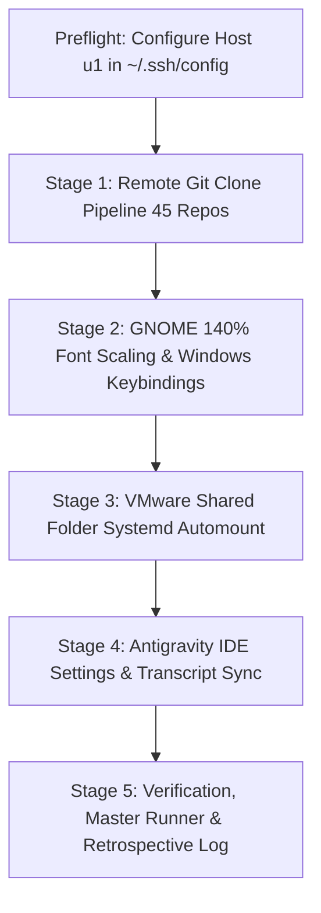

# Architecture Spec 211: Ubuntu Fleet Git Clone, Desktop Ergonomics & Cross-OS Migration

> **Specification Status:** Active  
> **Target Node:** Ubuntu 24.04 LTS (`U1` / `192.168.1.22`)  
> **Source Node:** Windows 11 (`desktop-corei9-direct`)  
> **Subsystem Focus:** SSH Fleet Automation, GNOME Desktop Customization, VMware Shared Folders, Antigravity Settings Sync  

---

## 1. System Overview & Problem Statement

This specification establishes an automated fleet synchronization and desktop customization architecture to configure the remote Ubuntu workstation (`U1` / `192.168.1.22`) to achieve:
1. **Repository Synchronization**: Clone all 45 missing work repositories into `/home/a/git-work` over SSH with Unix path normalization (replacing `\` with `/`) and zero re-copying of existing repositories.
2. **Desktop Visual Ergonomics**: Scale GNOME interface fonts by 140% (`text-scaling-factor 1.4`) to match Windows display scaling without blurry Wayland bitmap rasterization.
3. **Windows Keyboard Workflow Parity**: Reconfigure GNOME window management shortcuts (`gsettings`) to mirror Windows muscle memory:
   - `Win+D`: Show Desktop
   - `Win+Tab`: Task View Overview
   - `Ctrl+Win+Left` / `Ctrl+Win+Right`: Switch Workspaces
   - `Alt+Tab`: Ungrouped Individual Window Switching
   - `Ctrl+Shift+D` / `Ctrl+Win+D`: Create / Jump to New Workspace
4. **Persistent VMware Shared Folders**: Automate mount of VMware host shared folders (`.host:/` -> `/mnt/hgfs`) at system boot via systemd mount/automount units with `allow_other,uid=1000,gid=1000`.
5. **Cross-OS Antigravity Environment Parity**: Export Windows Antigravity IDE configuration, accounts, and conversation transcripts into path-normalized structures (`file:///d:/work/` -> `file:///home/a/git-work/`) and link `/d/work` -> `/home/a/git-work` for zero-rewrite transcript compatibility.
6. **Master Automation & Retrospective Logging**: Provide self-contained PowerShell and Bash runner scripts in `d:\work\repo-secrets\04-ubuntu-migration\` with a step-by-step engineering log.

---

## 2. 5-Stage Orchestration Pipeline



---

## 3. Subsystem Specifications

### 3.1 SSH Fleet Connection & Host Configuration
Add canonical `Host u1` definition to `C:\Users\Administrator\.ssh\config`:
```sshconfig
Host u1
    HostName 192.168.1.22
    User a
    Port 22
    IdentityFile C:\Users\Administrator\.ssh\id_rsa.backup-devorg
    IdentitiesOnly yes
    StrictHostKeyChecking no
```

### 3.2 Git Clone Pipeline (`clone-repos-to-u1.sh`)
- Reads sanitized repository manifest `gitmap-linux.json` with forward slashes `/`.
- Tests if `/home/a/git-work/<repo>/.git` exists.
- If missing: executes `mkdir -p $(dirname <path>) && git clone <url> <path>`.
- Parallel worker capacity: 4 concurrent clone jobs.

### 3.3 GNOME Desktop Scaling & Shortcuts (`configure-ubuntu-desktop.sh`)
- Dispatched with `DBUS_SESSION_BUS_ADDRESS="unix:path=/run/user/1000/bus"`.
- Sets `org.gnome.desktop.interface text-scaling-factor 1.4`.
- Rebinds `org.gnome.desktop.wm.keybindings` and `org.gnome.shell.keybindings`.

### 3.4 VMware Shared Folders (`setup-vmware-shared-folders.sh`)
- Creates `/etc/systemd/system/mnt-hgfs.mount` and `/etc/systemd/system/mnt-hgfs.automount`.
- Enables and starts units via `systemctl enable --now mnt-hgfs.mount mnt-hgfs.automount`.

### 3.5 Antigravity Configuration & Symlinks (`sync-antigravity-settings.sh`)
- Creates symlink `/d/work` -> `/home/a/git-work`.
- Transfers and normalizes `settings.json`, `keybindings.json`, and conversation transcripts.

---

## 4. Traceability & Acceptance Criteria

1. **SSH Connectivity**: `ssh u1 "echo OK"` connects instantaneously without password prompts.
2. **Repository Completeness**: All 71 repositories present in `/home/a/git-work`.
3. **Text Scaling**: `gsettings get org.gnome.desktop.interface text-scaling-factor` returns `1.4`.
4. **Shortcuts Parity**: Win+D, Win+Tab, Ctrl+Win+Left/Right, and ungrouped Alt+Tab verified active.
5. **Shared Folders**: `/mnt/hgfs` mounted and accessible by non-root user `a`.
6. **Documentation**: Detailed step-by-step markdown log persisted in `d:\work\repo-secrets\04-ubuntu-migration\step-by-step-log.md`.
