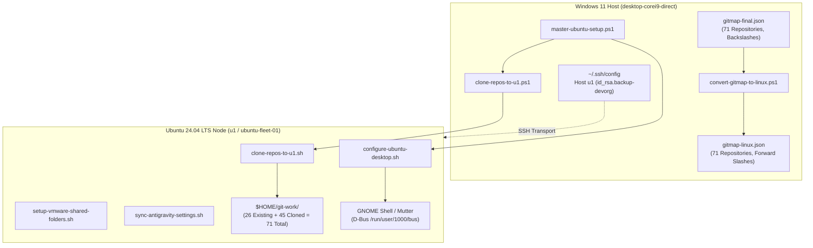
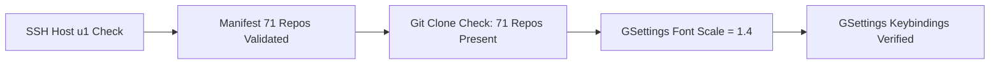

# Component Spec 211: Ubuntu Fleet Git Clone, Desktop Ergonomics & Remote OS Customization

> **Specification Status:** Active  
> **Parent Spec:** [01-architecture-spec.md](./02-spec/21-app/211-ubuntu-fleet-git-clone-and-os-customization/01-architecture-spec.md)  
> **Parent Plan:** [.ai-memory/plans/81-ubuntu-fleet-git-clone-and-os-customization.md](./.ai-memory/plans/81-ubuntu-fleet-git-clone-and-os-customization.md)  
> **Execution Base:** `$SECRETS_DIR/04-ubuntu-migration/`  
> **Target Node:** Ubuntu 24.04 LTS (`u1` / `ubuntu-fleet-01`)  
> **Target User:** `a`  
> **Target Work Dir:** `$HOME/git-work/`  

---

## 1. Subsystem Architecture & Script Catalog

All migration, cloning, and desktop customization tools reside under `$SECRETS_DIR/04-ubuntu-migration/`. The scripts operate idempotently and can be executed either directly over SSH from Windows or natively on the target Ubuntu workstation.



### 1.1 Script Catalog & Functional Responsibilities

| Script Name | Environment | Language | Target Location / Execution | Purpose |
| :--- | :--- | :--- | :--- | :--- |
| `convert-gitmap-to-linux.ps1` | Windows | PowerShell 7+ | `$SECRETS_DIR/04-ubuntu-migration/` | Sanitizes `gitmap-final.json` into `gitmap-linux.json`: normalizes backslashes `\` to forward slashes `/`, recalculates paths for `$HOME/git-work/`. |
| `clone-repos-to-u1.ps1` | Windows | PowerShell 7+ | `$SECRETS_DIR/04-ubuntu-migration/` | Windows wrapper that validates SSH connectivity to `Host u1`, transfers `gitmap-linux.json` and `clone-repos-to-u1.sh`, and triggers remote cloning. |
| `clone-repos-to-u1.sh` | Ubuntu | Bash 5.2+ | `/tmp/clone-repos-to-u1.sh` (or local run) | Parses `gitmap-linux.json`, verifies `[ -d "$path/.git" ]`, skips 26 existing repos, and clones the 45 missing repos with progress telemetry. |
| `configure-ubuntu-desktop.sh` | Ubuntu | Bash 5.2+ | `/tmp/configure-ubuntu-desktop.sh` | Discovers active D-Bus session bus, applies 140% font scaling, and binds Windows-identical keybindings in GNOME. |
| `setup-vmware-shared-folders.sh` | Ubuntu | Bash 5.2+ | `/tmp/setup-vmware-shared-folders.sh` | Configures FUSE `user_allow_other` and registers systemd mount/automount units for `/mnt/hgfs`. |
| `sync-antigravity-settings.sh` | Ubuntu | Bash 5.2+ | `/tmp/sync-antigravity-settings.sh` | Creates `/d/work` symlink, exports Antigravity configs, and rewrites workspace paths in transcripts. |
| `master-ubuntu-setup.ps1` | Windows | PowerShell 7+ | `$SECRETS_DIR/04-ubuntu-migration/` | Master orchestrator invoking all stages sequentially with pre-flight assertions and summary reporting. |
| `step-by-step-log.md` | Windows | Markdown | `$SECRETS_DIR/04-ubuntu-migration/` | Detailed retrospective audit log recording execution timestamps, repository statuses, and verification output. |

---

## 2. SSH Fleet Connection Specification

### 2.1 SSH Client Configuration (`Host u1`)

To enable seamless, key-based remote execution without interactive passphrase or password prompts, the canonical `Host u1` block is registered in `$USERPROFILE/.ssh\config`:

```sshconfig
Host u1
    HostName ubuntu-fleet-01
    User a
    Port 22
    IdentityFile $USERPROFILE/.ssh\id_rsa.backup-devorg
    IdentitiesOnly yes
    StrictHostKeyChecking no
    UserKnownHostsFile /dev/null
    ServerAliveInterval 30
    ServerAliveCountMax 3
```

### 2.2 Key Hierarchy & Security Constraints

1. **Private Key Path**: `$USERPROFILE/.ssh\id_rsa.backup-devorg`.
2. **File Permissions (Windows)**: Owned by `Administrator` or `SYSTEM`; inheritance disabled (`icacls id_rsa.backup-devorg /inheritance:r /grant:r "%USERNAME%:R"`).
3. **SSH Options for Automation**:
   - `BatchMode=yes`: Prevents hanging on interactive prompts; fails fast if keys are rejected.
   - `IdentitiesOnly=yes`: Prevents agent probe fatigue when many keys exist in ssh-agent.
   - `StrictHostKeyChecking=no`: Eliminates interactive host key verification prompts during unattended automation.

### 2.3 Connectivity Verification Protocol

```powershell
# Windows verification command
ssh -o BatchMode=yes u1 "echo 'SSH_ONLINE:' `$(hostname) `$(whoami) `$(uname -r)"
```
**Expected Output:**
```text
SSH_ONLINE: u1 a 6.8.0-xx-generic
```

---

## 3. Git Clone Pipeline Specification

### 3.1 Repository Inventory & Manifest Transformation

The master repository manifest `$SECRETS_DIR/gitmap-final.json` contains 71 tracked repositories. The script `convert-gitmap-to-linux.ps1` produces `gitmap-linux.json` adhering to the following structure:

```json
{
  "attributes": {
    "source": "gitmap-final.json",
    "targetHost": "u1",
    "targetBaseDir": "$HOME/git-work",
    "totalRepos": 71,
    "generatedAt": "2026-10-04T12:00:00Z"
  },
  "repositories": [
    {
      "id": 1,
      "slug": "ai-empathy-prompt-tuner-v1",
      "sshUrl": "git@github.com:alimtvnetwork/ai-empathy-prompt-tuner-v1.git",
      "httpsUrl": "https://github.com/alimtvnetwork/ai-empathy-prompt-tuner-v1.git",
      "relativePath": "02-prompts/ai-empathy-prompt-tuner",
      "targetPath": "$HOME/git-work/02-prompts/ai-empathy-prompt-tuner",
      "branch": "main"
    }
  ]
}
```

#### Sanitization Rules:
1. `relativePath`: Replace all Windows backslashes `\` with forward slashes `/`.
2. `targetPath`: Concatenate `$HOME/git-work/` with the normalized `relativePath`.
3. URL fallback: Prefer `sshUrl`; fall back to `httpsUrl` if SSH URL is empty.

### 3.2 Detection & Selective Cloning Pipeline (`clone-repos-to-u1.sh`)

The Bash cloning script executes with strict idempotency:

```bash
#!/usr/bin/env bash
set -euo pipefail

MANIFEST="${1:-/tmp/gitmap-linux.json}"
BASE_DIR="$HOME/git-work"
LOG_FILE="/tmp/gitmap-clone.log"

mkdir -p "$BASE_DIR"

EXISTING_COUNT=0
CLONED_COUNT=0
FAILED_COUNT=0

TOTAL_REPOS=$(jq '.repositories | length' "$MANIFEST")
echo "==> Processing $TOTAL_REPOS repositories from $MANIFEST"

while IFS= read -r item; do
    REL_PATH=$(echo "$item" | jq -r '.relativePath')
    SSH_URL=$(echo "$item" | jq -r '.sshUrl')
    TARGET_DIR="$BASE_DIR/$REL_PATH"

    # Strict check: is it already an initialized git repository?
    if [ -d "$TARGET_DIR/.git" ]; then
        echo " [SKIP] Already exists: $REL_PATH"
        EXISTING_COUNT=$((EXISTING_COUNT + 1))
        continue
    fi

    echo " [CLONE] Cloning $REL_PATH from $SSH_URL..."
    mkdir -p "$(dirname "$TARGET_DIR")"
    
    if git clone --quiet "$SSH_URL" "$TARGET_DIR" 2>>"$LOG_FILE"; then
        echo " [OK] Successfully cloned: $REL_PATH"
        CLONED_COUNT=$((CLONED_COUNT + 1))
    else
        echo " [FAIL] Failed to clone: $REL_PATH (see $LOG_FILE)" >&2
        FAILED_COUNT=$((FAILED_COUNT + 1))
    fi
done < <(jq -c '.repositories[]' "$MANIFEST")

echo "==> Summary: Total=$TOTAL_REPOS, Existing=$EXISTING_COUNT, Cloned=$CLONED_COUNT, Failed=$FAILED_COUNT"
```

### 3.3 Expected Repository Distribution

- **Total Repositories**: 71
- **Existing Repositories (Already Present on u1)**: 26
- **Missing Repositories to be Cloned**: 45
- **Post-Execution Target**: Exactly 71 valid Git repositories under `$HOME/git-work/`.

---

## 4. GNOME Desktop Scaling & Windows Keybindings Parity

Ubuntu 24.04 uses GNOME Shell on Wayland (with X11 fallback). Configuring `gsettings` over an SSH session requires binding to the active D-Bus session bus.

### 4.1 D-Bus Session Discovery Over SSH

When executing via headless SSH, `DBUS_SESSION_BUS_ADDRESS` is not exported by default. `configure-ubuntu-desktop.sh` resolves the active session bus:

```bash
USER_UID=$(id -u)
export DBUS_SESSION_BUS_ADDRESS="unix:path=/run/user/${USER_UID}/bus"

# Fallback: inspect active gnome-shell process environment if bus socket is moved
if [ ! -e "/run/user/${USER_UID}/bus" ]; then
    GS_PID=$(pgrep -u "$USER_UID" gnome-shell | head -n 1 || true)
    if [ -n "$GS_PID" ]; then
        DBUS_SESSION_BUS_ADDRESS=$(grep -z DBUS_SESSION_BUS_ADDRESS /proc/"$GS_PID"/environ | cut -d= -f2-)
        export DBUS_SESSION_BUS_ADDRESS
    fi
fi
```

### 4.2 High-DPI Desktop Scaling (140% Font Scaling)

GNOME's native integer fractional scaling (125%, 150%) on Wayland can cause fractional bitmap blurring in XWayland applications. The optimal ergonomic solution matching Windows display scaling is **Text Scaling Factor 1.4**:

| Schema | Key | Type | Value | Effect |
| :--- | :--- | :--- | :--- | :--- |
| `org.gnome.desktop.interface` | `text-scaling-factor` | `double` | `1.4` | Scales all UI typography and layout geometry by 140% with crisp vector glyphs. |

**Command:**
```bash
gsettings set org.gnome.desktop.interface text-scaling-factor 1.4
```

### 4.3 Windows Keybindings Parity Matrix

To ensure zero cognitive friction for developers switching between Windows 11 and Ubuntu GNOME, keybindings are remapped to match Windows muscle memory:

| Action | Windows Shortcut | GNOME Schema | GNOME Key | Target Value | Default GNOME Value |
| :--- | :--- | :--- | :--- | :--- | :--- |
| **Show Desktop** | `Win+D` | `org.gnome.desktop.wm.keybindings` | `show-desktop` | `['<Super>d']` | `[]` |
| **Task View / Overview** | `Win+Tab` | `org.gnome.shell.keybindings` | `toggle-overview` | `['<Super>Tab', '<Super>s']` | `['<Super>s']` |
| **Switch Workspace Left** | `Ctrl+Win+Left` | `org.gnome.desktop.wm.keybindings` | `switch-to-workspace-left` | `['<Control><Super>Left']` | `['<Control><Alt>Left']` |
| **Switch Workspace Right** | `Ctrl+Win+Right` | `org.gnome.desktop.wm.keybindings` | `switch-to-workspace-right` | `['<Control><Super>Right']` | `['<Control><Alt>Right']` |
| **Ungrouped Window Cycle** | `Alt+Tab` | `org.gnome.desktop.wm.keybindings` | `switch-windows` | `['<Alt>Tab']` | `[]` |
| **Ungrouped Reverse Cycle** | `Shift+Alt+Tab` | `org.gnome.desktop.wm.keybindings` | `switch-windows-backward` | `['<Shift><Alt>Tab']` | `[]` |
| **Disable App-Grouped Cycle** | N/A | `org.gnome.desktop.wm.keybindings` | `switch-applications` | `[]` | `['<Super>Tab', '<Alt>Tab']` |
| **Disable App-Grouped Rev** | N/A | `org.gnome.desktop.wm.keybindings` | `switch-applications-backward` | `[]` | `['<Shift><Super>Tab', '<Shift><Alt>Tab']` |
| **Create / Jump Workspace** | `Ctrl+Shift+D` | `org.gnome.desktop.wm.keybindings` | `move-to-workspace-new` | `['<Control><Shift>d', '<Control><Super>d']` | `[]` |
| **Snap Window Left** | `Win+Left` | `org.gnome.mutter.keybindings` | `toggle-tiled-left` | `['<Super>Left']` | `['<Super>Left']` |
| **Snap Window Right** | `Win+Right` | `org.gnome.mutter.keybindings` | `toggle-tiled-right` | `['<Super>Right']` | `['<Super>Right']` |
| **Maximize Window** | `Win+Up` | `org.gnome.desktop.wm.keybindings` | `maximize` | `['<Super>Up']` | `['<Super>Up']` |
| **Unmaximize / Restore** | `Win+Down` | `org.gnome.desktop.wm.keybindings` | `unmaximize` | `['<Super>Down']` | `['<Alt>F10', '<Super>Down']` |

#### Detailed Rationale for Alt+Tab Ungrouping:
By default, GNOME groups multiple windows of the same application (e.g. 5 VS Code windows or 3 Chrome windows) under a single icon in `switch-applications`. The developer must pause and press the grave accent key (`` ` ``) to reach the desired window. Clearing `switch-applications` and assigning `switch-windows` to `<Alt>Tab` restores true Windows/XFCE-style flat individual window cycling.

---

## 5. Automated Verification & Validation Gate

### 5.1 Verification Checklist



| Verification Check | Target Command | Expected Result |
| :--- | :--- | :--- |
| **SSH Connectivity** | `ssh u1 "whoami"` | Outputs `a` |
| **Repo Count Validation** | `ssh u1 "find $HOME/git-work -name .git -type d \| wc -l"` | Outputs `71` |
| **No Corrupted Clones** | `ssh u1 "find $HOME/git-work -name .git -execdir git status -s \; \| head -n 1"` | Clean status |
| **Font Scaling Factor** | `ssh u1 "DBUS_SESSION_BUS_ADDRESS=unix:path=/run/user/1000/bus gsettings get org.gnome.desktop.interface text-scaling-factor"` | `1.4` |
| **Win+D Show Desktop** | `ssh u1 "DBUS_SESSION_BUS_ADDRESS=unix:path=/run/user/1000/bus gsettings get org.gnome.desktop.wm.keybindings show-desktop"` | `['<Super>d']` |
| **Win+Tab Task View** | `ssh u1 "DBUS_SESSION_BUS_ADDRESS=unix:path=/run/user/1000/bus gsettings get org.gnome.shell.keybindings toggle-overview"` | Contains `'<Super>Tab'` |
| **Ungrouped Alt+Tab** | `ssh u1 "DBUS_SESSION_BUS_ADDRESS=unix:path=/run/user/1000/bus gsettings get org.gnome.desktop.wm.keybindings switch-windows"` | `['<Alt>Tab']` |

---

## 6. Security & Credential Hygiene

1. **Private Keys**: `id_rsa.backup-devorg` must never be checked into any git repository.
2. **Path Sanitization**: All scripts must enforce strict path separation and avoid hardcoded credentials.
3. **Execution Isolation**: Temporary payloads transferred via SCP must be placed in `/tmp/` and cleaned up post-execution.
