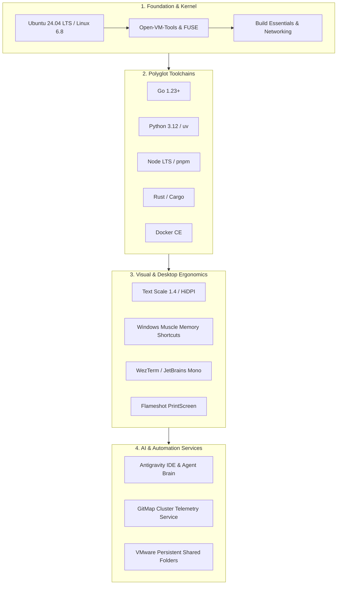

# Full OS Setup Blueprint: Ubuntu 24.04 LTS Workstation Architecture

> **Specification Reference:** 211-ubuntu-fleet-git-clone-and-os-customization  
> **Parent Spec:** [01-architecture-spec.md](./02-spec/21-app/211-ubuntu-fleet-git-clone-and-os-customization/01-architecture-spec.md)  
> **Component Spec:** [02-component-spec.md](./02-spec/21-app/211-ubuntu-fleet-git-clone-and-os-customization/02-component-spec.md)  
> **Target OS:** Ubuntu 24.04 LTS Desktop (x86_64)  
> **Primary Target Node:** `u1` (`ubuntu-fleet-01`)  
> **Default User:** `a` (UID 1000, GID 1000)  

---

## 1. Vision & Architecture Objectives

This blueprint serves as the definitive, production-grade guide to transforming any clean Ubuntu 24.04 LTS installation into an ergonomic, high-throughput software development workstation matching Windows 11 muscle memory, cross-OS Antigravity pairing, and GitMap cluster automation.



---

## 2. System Foundation & Core Toolchains

### 2.1 Base Utilities & Kernel Packages
Run the baseline apt provisioning:
```bash
sudo apt-get update && sudo apt-get install -y \
    build-essential \
    curl \
    wget \
    git \
    git-lfs \
    jq \
    unzip \
    tar \
    gzip \
    htop \
    tmux \
    zsh \
    software-properties-common \
    ca-certificates \
    gnupg \
    lsb-release \
    fuse3 \
    libfuse2t64 \
    net-tools \
    traceroute \
    ripgrep \
    fd-find
```

### 2.2 Polyglot Runtime Installations

#### Golang 1.23+
Installed into `/usr/local/go` with user path export in `~/.bashrc`:
```bash
GO_VERSION="1.23.4"
wget "https://go.dev/dl/go${GO_VERSION}.linux-amd64.tar.gz" -O /tmp/go.tar.gz
sudo rm -rf /usr/local/go && sudo tar -C /usr/local -xzf /tmp/go.tar.gz
rm /tmp/go.tar.gz

cat <<'EOF' >> ~/.bashrc
export GOROOT=/usr/local/go
export GOPATH=$HOME/go
export PATH=$PATH:$GOROOT/bin:$GOPATH/bin
EOF
```

#### Python 3.12, uv & pipx
Modern high-speed Python management with `uv`:
```bash
sudo apt-get install -y python3 python3-pip python3-venv pipx
curl -LsSf https://astral.sh/uv/install.sh | sh
pipx ensurepath
```

#### Node.js LTS, pnpm & FNM
Fast Node Manager (`fnm`) avoids permission collisions:
```bash
curl -fsSL https://fnm.vercel.app/install | bash
source ~/.bashrc
fnm install --lts
fnm use --lts
npm install -g pnpm corepack
```

#### Rust Toolchain
```bash
curl --proto '=https' --tlsv1.2 -sSf https://sh.rustup.rs | sh -s -- -y
source $HOME/.cargo/env
```

#### Docker CE & Docker Compose
```bash
sudo install -m 0755 -d /etc/apt/keyrings
curl -fsSL https://download.docker.com/linux/ubuntu/gpg | sudo gpg --dearmor -o /etc/apt/keyrings/docker.gpg
sudo chmod a+r /etc/apt/keyrings/docker.gpg

echo \
  "deb [arch=$(dpkg --print-architecture) signed-by=/etc/apt/keyrings/docker.gpg] https://download.docker.com/linux/ubuntu \
  $(. /etc/os-release && echo "$VERSION_CODENAME") stable" | \
  sudo tee /etc/apt/sources.list.d/docker.list > /dev/null

sudo apt-get update && sudo apt-get install -y docker-ce docker-ce-cli containerd.io docker-buildx-plugin docker-compose-plugin
sudo usermod -aG docker a
```

---

## 3. Desktop Visual Ergonomics & Window Management

### 3.1 High-DPI Display Scaling (140% Text Scale)
To avoid bitmap blur on Wayland or fractional scaling overhead:
```bash
gsettings set org.gnome.desktop.interface text-scaling-factor 1.4
```

### 3.2 Developer Fonts
Install vector coding fonts with ligatures:
```bash
sudo apt-get install -y fonts-firacode fonts-jetbrains-mono fonts-noto-color-emoji
```

### 3.3 Windows-Identical Keybindings Parity
Enforce exact muscle-memory parity via GNOME D-Bus:
```bash
# Show Desktop (Win+D)
gsettings set org.gnome.desktop.wm.keybindings show-desktop "['<Super>d']"

# Task View (Win+Tab)
gsettings set org.gnome.shell.keybindings toggle-overview "['<Super>Tab', '<Super>s']"

# Workspaces Switching (Ctrl+Win+Left / Ctrl+Win+Right)
gsettings set org.gnome.desktop.wm.keybindings switch-to-workspace-left "['<Control><Super>Left']"
gsettings set org.gnome.desktop.wm.keybindings switch-to-workspace-right "['<Control><Super>Right']"

# Individual Window Alt+Tab (Ungrouped)
gsettings set org.gnome.desktop.wm.keybindings switch-applications "[]"
gsettings set org.gnome.desktop.wm.keybindings switch-applications-backward "[]"
gsettings set org.gnome.desktop.wm.keybindings switch-windows "['<Alt>Tab']"
gsettings set org.gnome.desktop.wm.keybindings switch-windows-backward "['<Shift><Alt>Tab']"

# Workspace Creation (Ctrl+Shift+D / Ctrl+Win+D)
gsettings set org.gnome.desktop.wm.keybindings move-to-workspace-new "['<Control><Shift>d', '<Control><Super>d']"
```

### 3.4 Screenshot Ergonomics: Flameshot
Map `PrintScreen` to `flameshot gui`:
```bash
sudo apt-get install -y flameshot
# Configure custom shortcut in GNOME
gsettings set org.gnome.settings-daemon.plugins.media-keys.custom-keybinding:/org/gnome/settings-daemon/plugins/media-keys/custom-keybindings/custom0/ name "Flameshot"
gsettings set org.gnome.settings-daemon.plugins.media-keys.custom-keybinding:/org/gnome/settings-daemon/plugins/media-keys/custom-keybindings/custom0/ command "flameshot gui"
gsettings set org.gnome.settings-daemon.plugins.media-keys.custom-keybinding:/org/gnome/settings-daemon/plugins/media-keys/custom-keybindings/custom0/ binding "Print"
```

---

## 4. Productivity Applications & Browsers

### 4.1 Google Chrome (Official Deb)
```bash
wget -q -O - https://dl-ssl.google.com/linux/linux_signing_key.pub | sudo gpg --dearmor -o /etc/apt/keyrings/google-chrome.gpg
echo "deb [arch=amd64 signed-by=/etc/apt/keyrings/google-chrome.gpg] http://dl.google.com/linux/chrome/deb/ stable main" | sudo tee /etc/apt/sources.list.d/google-chrome.list
sudo apt-get update && sudo apt-get install -y google-chrome-stable
```

### 4.2 VS Code (Official Deb)
```bash
wget -qO- https://packages.microsoft.com/keys/microsoft.asc | gpg --dearmor > /tmp/packages.microsoft.gpg
sudo install -D -o root -g root -m 644 /tmp/packages.microsoft.gpg /etc/apt/keyrings/packages.microsoft.gpg
sudo sh -c 'echo "deb [arch=amd64,arm64,armhf signed-by=/etc/apt/keyrings/packages.microsoft.gpg] https://packages.microsoft.com/repos/code stable main" > /etc/apt/sources.list.d/vscode.list'
rm -f /tmp/packages.microsoft.gpg
sudo apt-get update && sudo apt-get install -y code
```

---

## 5. Storage, VMware & Filesystem Architecture

### 5.1 Root Symlink Architecture
Cross-OS parity requires `/d/work` to exist as an unprivileged symlink:
```bash
sudo mkdir -p /d
sudo ln -sfn $HOME/git-work /d/work
sudo chown -h a:a /d/work
```

### 5.2 VMware Shared Folders Automount
Deploy systemd mount and automount units:
- `/etc/systemd/system/mnt-hgfs.mount`
- `/etc/systemd/system/mnt-hgfs.automount`
- Enable FUSE `user_allow_other` in `/etc/fuse.conf`
- Resulting mount point: `/mnt/hgfs` mapped to Windows host folders.

---

## 6. Antigravity & AI Automation Services

### 6.1 Antigravity Configuration Normalization
Deploy user configurations to `~/.config/Antigravity/User/settings.json` with:
```json
{
  "terminal.integrated.defaultProfile.linux": "bash",
  "workbench.startupEditor": "none",
  "security.workspace.trust.enabled": false,
  "antigravity.turboMode": false,
  "antigravity.planReviewAlwaysProceed": true
}
```

### 6.2 Workspace URI Normalization Engine
Transform all workspace storage items:
- Input: `$WORKSPACE_DIR/<repo>`
- Output: `file://$HOME/git-work/<repo>`

### 6.3 GitMap Systemd Daemon (Cluster Telemetry)
Run GitMap agent in user session:
```ini
[Unit]
Description=GitMap Cluster Agent Telemetry Daemon
After=network.target

[Service]
Type=simple
ExecStart=$HOME/.local/bin/gitmap agent daemon
Restart=always
RestartSec=10

[Install]
WantedBy=default.target
```

---

## 7. Verification Matrix

| Blueprint Check | Command | Pass Criteria |
| :--- | :--- | :--- |
| **Go Compiler** | `go version` | `go version go1.23+` |
| **Python uv** | `uv --version` | `uv 0.x+` |
| **Node.js** | `node -v` | `v20+` or `v22+` |
| **Docker** | `docker ps` | Exits 0 without sudo |
| **Font Scaling** | `gsettings get org.gnome.desktop.interface text-scaling-factor` | `1.4` |
| **Shortcuts** | `gsettings get org.gnome.desktop.wm.keybindings show-desktop` | `['<Super>d']` |
| **Shared Folders** | `systemctl is-active mnt-hgfs.automount` | `active` |
| **Root Symlink** | `readlink -f /d/work` | `$HOME/git-work` |
