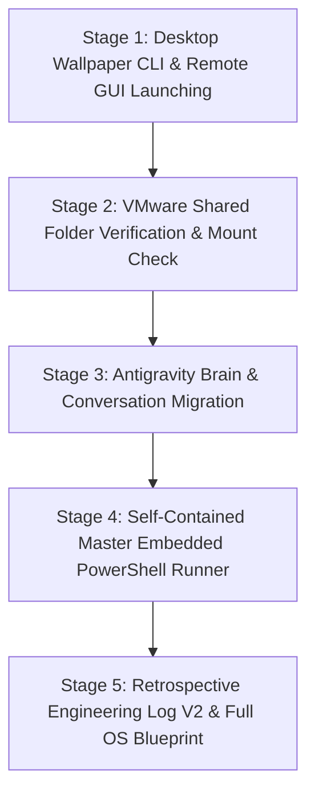

# Architecture Spec 212: Ubuntu Fleet Full Customization & Self-Contained Embedded Runner

> **Specification Status:** Active  
> **Target Workstation:** Ubuntu 24.04 LTS (`U1` / `192.168.1.22`)  
> **Source Workstation:** Windows 11 (`desktop-corei9-direct`)  
> **Subsystem Focus:** GNOME Wallpaper CLI, Remote GUI App Launching, VMware Shared Folders, Antigravity Brain Migration, Embedded PowerShell Architecture  

---

## 1. System Overview & Problem Statement

This specification provides the architecture and executable protocols to complete all desktop ergonomics, remote application controls, and deep cross-OS workspace portability on Ubuntu node `U1`:
1. **Desktop Wallpaper Synchronization**: Remotely set GNOME desktop wallpaper via `gsettings` (`picture-uri` & `picture-uri-dark` with `picture-options "zoom"` and user D-Bus socket).
2. **Remote GUI Application Launching**: Launch desktop applications (such as Antigravity IDE, Text Editor, or VS Code) from headless SSH into the active Wayland/XWayland graphical desktop session using `systemd-run --user`.
3. **VMware Shared Folders Automount & Verification**: Ensure `/mnt/hgfs` is mounted via `mnt-hgfs.automount` and accessible by user `a`, allowing any host folder shared in VMware Workstation to appear dynamically.
4. **Antigravity Brain & Conversation History Portability**: Selectively export conversation histories and `conversation_summaries.db` from Windows, stream over SSH, and normalize workspace paths from `file:///d:/work/` to `file:///home/a/git-work/`.
5. **Self-Contained Embedded PowerShell Architecture**: Consolidate all bash provisioning scripts as embedded multi-line string templates (`@' ... '@`) inside a single standalone PowerShell runner (`master-embedded-ubuntu-runner.ps1`), streaming via `tr -d '\r' | bash -s` to eliminate CRLF pitfalls and require zero external script files.

---

## 2. 5-Stage Orchestration Pipeline



---

## 3. Subsystem Specifications

### 3.1 GNOME Desktop Wallpaper CLI
GNOME 46 on Ubuntu 24.04 differentiates between light and dark modes. In `'prefer-dark'` mode, both keys must be updated:
```bash
export DBUS_SESSION_BUS_ADDRESS="unix:path=/run/user/1000/bus"
gsettings set org.gnome.desktop.background picture-uri "file://<image-path>"
gsettings set org.gnome.desktop.background picture-uri-dark "file://<image-path>"
gsettings set org.gnome.desktop.background picture-options "zoom"
```

### 3.2 Remote GUI Application Launching
To launch GUI applications from an SSH session into the user's active graphical display without X11 authorization errors:
```bash
ssh u1 "systemd-run --user /usr/local/bin/antigravity"
ssh u1 "systemd-run --user /usr/local/bin/antigravity /home/a/git-work/gitmap"
ssh u1 "systemd-run --user /usr/bin/gnome-text-editor"
```

### 3.3 VMware Shared Folders
Host-guest shared folders mount under `/mnt/hgfs/` managed by `/etc/systemd/system/mnt-hgfs.automount`. User `a` has full read/write permissions via `allow_other,uid=1000,gid=1000`.

### 3.4 Antigravity Brain Migration
Normalizes paths across `transcript.jsonl`, `messages/`, and `conversation_summaries.db`:
- `file:///d%3A/work/` $\rightarrow$ `file:///home/a/git-work/`
- `d:\work\` $\rightarrow$ `/home/a/git-work/`

### 3.5 Embedded Master PowerShell Runner
Embeds all bash logic inside a single `.ps1` script and streams directly via SSH:
```powershell
$ScriptContent | ssh.exe -o BatchMode=yes u1 "tr -d '\r' | bash -s"
```
