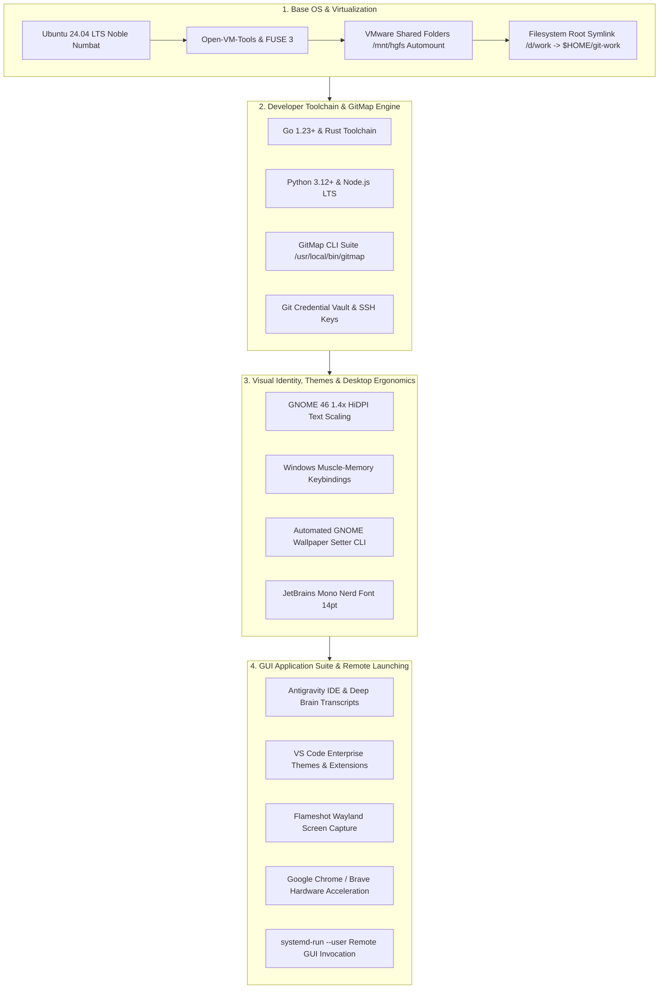

# Full OS Setup Blueprint: Ubuntu Fleet Customization & Embedded Automation Architecture

> **Specification Reference:** 212-ubuntu-fleet-full-customization-and-embedded-runner  
> **Parent Spec:** [01-architecture-spec.md](./02-spec/21-app/212-ubuntu-fleet-full-customization-and-embedded-runner/01-architecture-spec.md)  
> **Target OS:** Ubuntu 24.04 LTS Desktop (`x86_64`)  
> **Target Nodes:** Ubuntu Fleet (`U1`: `ubuntu-fleet-01`, `U2`, `U3`...)  
> **Default Workstation User:** `a` (UID 1000, GID 1000)  
> **Subsystem Scope:** VS Code & Antigravity Themes, Flameshot Wayland, Google Chrome & Brave, GitMap CLI & Cluster, Embedded Runner Architecture  

---

## 1. Executive Vision & Architecture Objectives

This blueprint establishes the canonical, automated specification for provisioning, styling, and hardening any fresh Ubuntu 24.04 LTS installation across the fleet. It unifies developer ergonomics, Windows muscle-memory parity, graphical GUI launching from headless SSH sessions, and deep workspace synchronization.



---

## 2. Desktop Environment, Themes & Visual Identity

### 2.1 GNOME 46 Desktop Customization
Ubuntu 24.04 LTS uses GNOME 46 running Wayland by default. All customizations are applied programmatically via `gsettings` over user D-Bus:

```bash
export DBUS_SESSION_BUS_ADDRESS="unix:path=/run/user/$(id -u)/bus"

# 1.4x HiDPI Text Scaling
gsettings set org.gnome.desktop.interface text-scaling-factor 1.4

# Dark Mode Interface
gsettings set org.gnome.desktop.interface color-scheme 'prefer-dark'
gsettings set org.gnome.desktop.interface gtk-theme 'Yaru-dark'
gsettings set org.gnome.desktop.interface icon-theme 'Yaru-dark'

# Font Family Parity
gsettings set org.gnome.desktop.interface font-name 'Ubuntu Sans 11'
gsettings set org.gnome.desktop.interface document-font-name 'Ubuntu Sans 11'
gsettings set org.gnome.desktop.interface monospace-font-name 'JetBrainsMono Nerd Font Mono 13'
```

### 2.2 GNOME Wallpaper CLI Integration
To remotely synchronize desktop wallpapers across fleet workstations, both light and dark background URIs are updated synchronously:

```bash
set_desktop_wallpaper() {
    local img_path="$1"
    export DBUS_SESSION_BUS_ADDRESS="unix:path=/run/user/$(id -u)/bus"
    gsettings set org.gnome.desktop.background picture-uri "file://${img_path}"
    gsettings set org.gnome.desktop.background picture-uri-dark "file://${img_path}"
    gsettings set org.gnome.desktop.background picture-options "zoom"
}
```

### 2.3 Windows Muscle-Memory Keybindings
Eliminates cognitive friction when switching between Windows 11 and Ubuntu:

| Function | Ubuntu Default | Blueprint Keybinding | Schema Key |
| :--- | :--- | :--- | :--- |
| **Switch Windows** | `<Super>Tab` | `<Alt>Tab` | `org.gnome.desktop.wm.keybindings switch-windows` |
| **Switch Applications** | `<Alt>Tab` | `[]` (Disabled) | `org.gnome.desktop.wm.keybindings switch-applications` |
| **Show Desktop** | `<Super>d` | `<Super>d` | `org.gnome.desktop.wm.keybindings show-desktop` |
| **Toggle Overview** | `<Super>` | `<Super>Tab` | `org.gnome.shell.keybindings toggle-overview` |
| **Workspace Left** | `<Super>Page_Up` | `<Control><Super>Left` | `org.gnome.desktop.wm.keybindings switch-to-workspace-left` |
| **Workspace Right** | `<Super>Page_Down` | `<Control><Super>Right` | `org.gnome.desktop.wm.keybindings switch-to-workspace-right` |
| **Terminal Launch** | `<Control><Alt>t` | `<Control><Alt>t` | Custom keybinding `/usr/bin/gnome-terminal` |

---

## 3. GUI Applications Suite & Remote Launching

### 3.1 Remote Graphical Application Launching (`systemd-run --user`)
Headless SSH sessions lack `$DISPLAY` and Wayland socket grants. To execute GUI applications into the active user desktop without X11 authorization errors:

```bash
# Launch Antigravity IDE on specific repository
ssh u1 "systemd-run --user /usr/local/bin/antigravity $HOME/git-work/gitmap"

# Launch GNOME Text Editor
ssh u1 "systemd-run --user /usr/bin/gnome-text-editor"

# Launch Google Chrome with remote debugging
ssh u1 "systemd-run --user google-chrome --remote-debugging-port=9222"
```

### 3.2 Antigravity IDE & Deep Brain Portability
- **Binary Path:** `/usr/local/bin/antigravity`
- **User Config:** `~/.config/Antigravity/User/settings.json`
- **Workspaces:** `~/.config/Antigravity/User/workspaceStorage/`
- **Agent Brain & Transcripts:** `~/.gemini/antigravity/brain/`
- **Active Summaries DB:** `~/.gemini/antigravity/conversation_summaries.db`
- **Path Normalization Protocol:** Automatic transformation of `$WORKSPACE_DIR/` and `$WORKSPACE_DIR/` to `$HOME/git-work/`.

### 3.3 VS Code Themes & Extensions Blueprint
Provisioning VS Code on Ubuntu fleet nodes:

```bash
# Install VS Code Stable
sudo apt-get install -y wget gpg apt-transport-https
wget -qO- https://packages.microsoft.com/keys/microsoft.asc | gpg --dearmor > packages.microsoft.gpg
sudo install -D -o root -g root -m 644 packages.microsoft.gpg /etc/apt/keyrings/packages.microsoft.gpg
echo "deb [arch=amd64,arm64,armhf signed-by=/etc/apt/keyrings/packages.microsoft.gpg] https://packages.microsoft.com/repos/code stable main" | sudo tee /etc/apt/sources.list.d/vscode.list
sudo apt-get update && sudo apt-get install -y code

# Enterprise Extension Matrix
code --install-extension golang.go
code --install-extension ms-python.python
code --install-extension rust-lang.rust-analyzer
code --install-extension eamodio.gitlens
code --install-extension zhuangtongfa.material-theme
code --install-extension catppuccin.catppuccin-vsc
code --install-extension pkief.material-icon-theme
```

**Recommended Theme Configuration (`~/.config/Code/User/settings.json`):**
```json
{
  "workbench.colorTheme": "Catppuccin Mocha",
  "workbench.iconTheme": "material-icon-theme",
  "editor.fontFamily": "'JetBrainsMono Nerd Font Mono', 'JetBrains Mono', monospace",
  "editor.fontSize": 14,
  "editor.lineHeight": 1.6,
  "editor.cursorBlinking": "smooth",
  "editor.cursorSmoothCaretAnimation": "on",
  "terminal.integrated.fontFamily": "JetBrainsMono Nerd Font Mono",
  "terminal.integrated.fontSize": 13,
  "window.titleBarStyle": "custom",
  "editor.formatOnSave": true
}
```

### 3.4 Flameshot Wayland Screen Capture Suite
Ubuntu 24.04 Wayland requires specific environment flags for Flameshot:

```bash
# Installation
sudo apt-get install -y flameshot

# Wayland wrapper script /usr/local/bin/flameshot-wayland
cat << 'EOF' | sudo tee /usr/local/bin/flameshot-wayland > /dev/null
#!/usr/bin/env bash
export QT_QPA_PLATFORM=wayland
flameshot gui
EOF
sudo chmod +x /usr/local/bin/flameshot-wayland

# Global Keybinding Binding (<Print> and <Shift><Super>s)
# Configured via GNOME media-keys custom keybindings
```

### 3.5 Google Chrome & Brave Browser
High-performance browser installations with Wayland native flags:

```bash
# Google Chrome
wget https://dl.google.com/linux/direct/google-chrome-stable_current_amd64.deb -O /tmp/chrome.deb
sudo apt-get install -y /tmp/chrome.deb && rm /tmp/chrome.deb

# Enable Native Wayland & GPU Acceleration (~/.config/chrome-flags.conf)
cat << 'EOF' > ~/.config/chrome-flags.conf
--ozone-platform-hint=auto
--enable-features=VaapiVideoDecoder,WaylandWindowDecorations
--enable-gpu-rasterization
--enable-zero-copy
EOF
```

---

## 4. GitMap Toolchain & High-Speed Cluster Fleet

### 4.1 GitMap Binary Deployment
Deploy the high-performance GitMap CLI binary:
```bash
# Binary location: /usr/local/bin/gitmap
sudo cp $HOME/git-work/gitmap/bin/gitmap-linux-amd64 /usr/local/bin/gitmap
sudo chmod +x /usr/local/bin/gitmap

# Verify installation
gitmap version
```

### 4.2 GitMap Global Configuration (`~/.gitmap/config.json`)
```json
{
  "nodeId": "u1",
  "nodeRole": "fleet-workstation",
  "workspacesRoot": "$HOME/git-work",
  "splitDb": {
    "engine": "sqlite3",
    "directory": "$HOME/.gitmap/db"
  },
  "cluster": {
    "orchestratorHost": "node-main",
    "telemetryIntervalSec": 5
  }
}
```

### 4.3 Git SSH & Safe Directories Configuration
Ensures seamless multi-repository operations without ownership warnings:
```bash
git config --global --add safe.directory "*"
git config --global init.defaultBranch master
git config --global core.autocrlf input
git config --global pull.rebase true
```

---

## 5. VMware Shared Folders Automount & Filesystem Symlinks

### 5.1 FUSE & Persistent Automount Unit
- `/etc/fuse.conf` configured with `user_allow_other`
- `/etc/systemd/system/mnt-hgfs.mount` mounting `.host:/` to `/mnt/hgfs` with options `allow_other,uid=1000,gid=1000,auto_unmount`
- `/etc/systemd/system/mnt-hgfs.automount` managing on-demand automounting with `TimeoutIdleSec=0`

### 5.2 Filesystem Root Symlink
Preserves absolute Windows paths across transcripts, scripts, and logs:
```bash
sudo mkdir -p /d
sudo ln -sfn $HOME/git-work /d/work
sudo chown -h a:a /d/work
```

---

## 6. Embedded Standalone PowerShell Runner Architecture

To maintain zero external `.sh` file dependencies and eliminate Windows CRLF encoding errors when provisioning remote nodes, all bash orchestration is embedded directly into PowerShell scripts via multi-line here-strings (`@' ... '@`) and streamed over SSH:

```powershell
$BashScript = @'
#!/usr/bin/env bash
set -euo pipefail
# Embedded provisioning logic...
'@

$BashScript | ssh.exe -o BatchMode=yes $TargetHost "tr -d '\r' | bash -s -- $Arguments"
```

### Key Advantages:
1. **Self-Contained:** A single `.ps1` file contains the full deployment logic without needing `scp` of auxiliary `.sh` scripts.
2. **Zero CRLF Issues:** The remote `tr -d '\r'` pipeline guarantees pure POSIX LF line endings.
3. **Parameter-Driven Execution:** Modular execution modes (`all`, `desktop`, `wallpaper`, `vmware`, `gui`, `verify`).
4. **Instant Scorecard Rollup:** Automated parsing of `SCORECARD_*` output variables for CI/CD and developer verification.

---

## 7. Automated Provisioning Verification Matrix

| Check | Command / Probe | Success Criteria |
| :--- | :--- | :--- |
| **SSH Connectivity** | `ssh u1 whoami` | Returns user `a` |
| **Desktop Scaling** | `gsettings get org.gnome.desktop.interface text-scaling-factor` | Returns `1.4` |
| **Desktop Wallpaper** | `gsettings get org.gnome.desktop.background picture-uri-dark` | Returns valid image URI |
| **VMware Automount** | `systemctl is-active mnt-hgfs.automount` | Returns `active` |
| **Shared Directory** | `ls -ld /mnt/hgfs/SharedDirectories` | Read/write without sudo |
| **Root Symlink** | `readlink -f /d/work` | Resolves to `$HOME/git-work` |
| **Antigravity Binary** | `which antigravity` | Resolves `/usr/local/bin/antigravity` |
| **Remote GUI Launch** | `systemd-run --user /usr/local/bin/antigravity --version` | Exits 0 in user session |
| **Brain DB Sync** | `sqlite3 ~/.gemini/antigravity/conversation_summaries.db "SELECT count(*) FROM conversation_summaries"` | >= 98 active records |
