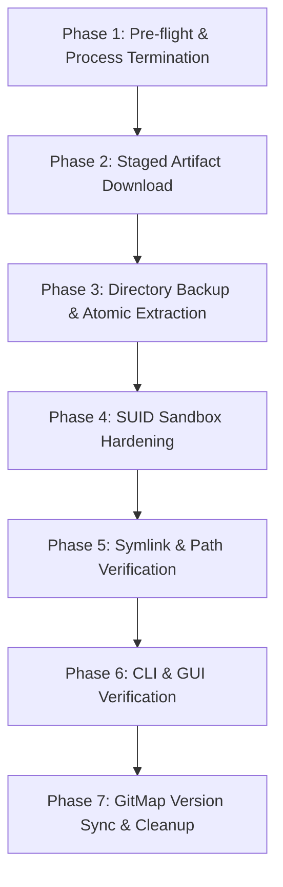

# Architecture Spec 213: Antigravity Ubuntu Update & Macro Automation

> **Specification Status:** Active  
> **Target Workstation:** Ubuntu 24.04 LTS (`u1` / `ubuntu-fleet-01`, user `a`)  
> **Source Workstation:** Windows 11 (`desktop-corei9-direct`)  
> **Installed Version:** Antigravity 2.13.0 (Build 6362815968182272)  
> **Target Version:** Antigravity 2.19.1 (Build 6046815158665216)  
> **Artifact URL:** `https://storage.googleapis.com/antigravity-public/antigravity-hub/2.19.1-6046815158665216/linux-x64/Antigravity.tar.gz`  
> **Install Path:** `$HOME/.local/share/antigravity-ide/`  
> **Global Symlink:** `/usr/local/bin/antigravity`  
> **Subsystem Focus:** Remote Upgrade Pipeline, SUID Sandbox Hardening, GitMap Type Constants Sync, Headless SSH Execution  

---

## User Request (Verbatim)

```
Author 02-spec/21-app/213-antigravity-ubuntu-update-and-macro-automation/01-architecture-spec.md detailing:
- System Overview: Updating Antigravity on Ubuntu from 2.13.0 (Build 6362815968182272) to 2.19.1 (Build 6046815158665216).
- Target environment: Ubuntu node u1, user a, install path $HOME/.local/share/antigravity-ide/.
- Binary artifacts: https://storage.googleapis.com/antigravity-public/antigravity-hub/2.19.1-6046815158665216/linux-x64/Antigravity.tar.gz.
- Remote SSH upgrade pipeline: process termination (pkill -f antigravity), archive download and extraction, SUID sandbox configuration (chmod 4755 chrome-sandbox), symlink preservation, and verification (antigravity --version).
- Integration with GitMap: updating cli/cmdinstall/installantigravity_types.go default version constants.
```

---

## 1. System Overview & Problem Statement

The developer fleet uses Antigravity as the primary agentic IDE across both Windows 11 host environments and remote Linux workstations. Node `u1` is an Ubuntu 24.04 LTS machine hosting developer toolchains and repositories at `$HOME/git-work/`.

### 1.1 The Stale Binary State
The existing installation on `u1` is pinned at version **2.13.0 (Build 6362815968182272)**, located at `$HOME/.local/share/antigravity-ide/`. Meanwhile, host nodes and active development run version **2.19.1 (Build 6046815158665216)**. This version divergence causes:
- Discrepancies in agent runtime APIs, memory management protocols, and subagent invocation semantics.
- Potential breaking schema differences in conversation transcripts and internal databases (`conversation_summaries.db`).
- Inability to use recent IDE features, tool improvements, and updated sandboxing capabilities.

### 1.2 Non-Standard Auto-Update on Linux
Unlike packaged distributions via APT or Snap, Antigravity on Linux is deployed as a standalone Electron tarball extracted into user space (`$HOME/.local/share/antigravity-ide/`). Electron auto-updaters often fail silently or fail to preserve root-owned SUID sandbox permissions when executing in user-space sessions. Consequently, updating `u1` requires a deterministic, automated remote SSH upgrade pipeline.

### 1.3 Linux SUID Sandbox Requirement
Electron requires a privileged helper binary (`chrome-sandbox`) configured with setuid root permissions:
- Permissions: `4755` (`-rwsr-xr-x`)
- Owner: `root:root`
When extracting a tarball as user `a`, `chrome-sandbox` loses SUID bit and ownership (`a:a` with `0755`), causing Electron startup to fail with:
```
The SUID sandbox helper binary was found, but is not configured correctly.
Rather than run without sandboxing I'm aborting now.
```
The upgrade pipeline must explicitly execute `sudo chown root:root chrome-sandbox` and `sudo chmod 4755 chrome-sandbox` during the installation ceremony.

---

## 2. Remote Upgrade Architecture & Pipeline



### 2.1 Upgrade Pipeline Sequence

1. **Process Termination**:
   Terminate any running Antigravity IDE, language server, or Electron helper processes to avoid file lock collisions and corrupted open handles:
   ```bash
   pkill -f antigravity || true
   pkill -f antigravity-ide || true
   ```

2. **Download Target Artifact**:
   Fetch the official 2.19.1 release tarball into `/tmp/` using curl with resume and fail flags:
   ```bash
   curl -fsSL "https://storage.googleapis.com/antigravity-public/antigravity-hub/2.19.1-6046815158665216/linux-x64/Antigravity.tar.gz" -o /tmp/Antigravity.tar.gz
   ```

3. **Backup and Extraction**:
   Move the existing install directory to a timestamped backup before unpacking the new release:
   ```bash
   mv $HOME/.local/share/antigravity-ide $HOME/.local/share/antigravity-ide.bak-2.13.0
   mkdir -p $HOME/.local/share/antigravity-ide
   tar -xzf /tmp/Antigravity.tar.gz -C $HOME/.local/share/antigravity-ide --strip-components=1
   ```

4. **SUID Sandbox Hardening**:
   Restore required SUID root permissions to `chrome-sandbox`:
   ```bash
   sudo chown root:root $HOME/.local/share/antigravity-ide/chrome-sandbox
   sudo chmod 4755 $HOME/.local/share/antigravity-ide/chrome-sandbox
   ```

5. **Symlink Preservation & PATH Verification**:
   Ensure `/usr/local/bin/antigravity` points to `$HOME/.local/share/antigravity-ide/antigravity`:
   ```bash
   sudo ln -sf $HOME/.local/share/antigravity-ide/antigravity /usr/local/bin/antigravity
   ```

6. **Post-Upgrade Verification**:
   Verify CLI reporting and binary integrity:
   ```bash
   antigravity --version
   ```
   Launch via GUI user session helper to confirm graphical display:
   ```bash
   systemd-run --user /usr/local/bin/antigravity
   ```

7. **Artifact Cleanup**:
   Remove temporary download archive:
   ```bash
   rm -f /tmp/Antigravity.tar.gz
   ```

---

## 3. GitMap Integration & Version Synchronization

GitMap provides built-in installation commands and target platform metadata in `cli/cmdinstall/installantigravity_types.go`. To ensure that any future GitMap install or upgrade operations install 2.19.1 instead of 2.13.0, the type constants must be synchronized.

### 3.1 Constant Updates in `cli/cmdinstall/installantigravity_types.go`

```go
const (
	AntigravityDefaultVersion = "2.19.1"
	AntigravityDefaultBuildID = "6046815158665216"
	AntigravityBaseURL        = "https://storage.googleapis.com/antigravity-public/antigravity-hub"
	ErrUnsupportedPlatform    = "E_UNSUPPORTED_PLATFORM"
	ErrPrerequisiteFailed     = "E_PREREQUISITE_FAILED"
	ErrDownloadFailed         = "E_DOWNLOAD_FAILED"
)
```

### 3.2 URL Resolution Mechanics
GitMap resolves Linux x64 artifacts using the pattern:
```
{AntigravityBaseURL}/{Version}-{BuildID}/linux-x64/Antigravity.tar.gz
```
Substituting the updated constants generates:
```
https://storage.googleapis.com/antigravity-public/antigravity-hub/2.19.1-6046815158665216/linux-x64/Antigravity.tar.gz
```
This matches the exact tested binary artifact URL.

---

## 4. Security & Permissions Specification

| Path / Binary | Owner | Group | Mode | Rationale |
| :--- | :--- | :--- | :--- | :--- |
| `$HOME/.local/share/antigravity-ide/` | `a` | `a` | `0755` | User workspace application directory |
| `$HOME/.local/share/antigravity-ide/antigravity` | `a` | `a` | `0755` | Main executable binary |
| `$HOME/.local/share/antigravity-ide/chrome-sandbox` | `root` | `root` | `4755` | Chromium SUID sandbox requires root UID and SUID bit |
| `/usr/local/bin/antigravity` | `root` | `root` | `0777` (symlink) | System-wide path pointer to user binary |
| `/tmp/Antigravity.tar.gz` | `a` | `a` | `0644` | Ephemeral downloaded archive (cleaned post-run) |

---

## 5. Rollback & Failure Recovery Procedures

If the download fails, extraction errors occur, or the 2.19.1 binary fails smoke verification:
1. Terminate any half-started processes: `pkill -f antigravity || true`.
2. Delete the broken target directory: `rm -rf $HOME/.local/share/antigravity-ide`.
3. Restore backup: `mv $HOME/.local/share/antigravity-ide.bak-2.13.0 $HOME/.local/share/antigravity-ide`.
4. Ensure SUID sandbox permissions on restored directory:
   ```bash
   sudo chown root:root $HOME/.local/share/antigravity-ide/chrome-sandbox
   sudo chmod 4755 $HOME/.local/share/antigravity-ide/chrome-sandbox
   ```
5. Re-verify restored binary: `antigravity --version`.

---

## 6. Acceptance Criteria

- [ ] **AC-1:** Node `u1` Antigravity version command `antigravity --version` outputs version `2.19.1`.
- [ ] **AC-2:** File `$HOME/.local/share/antigravity-ide/chrome-sandbox` has ownership `root:root` and mode `-rwsr-xr-x` (`4755`).
- [ ] **AC-3:** Global symlink `/usr/local/bin/antigravity` resolves correctly to `$HOME/.local/share/antigravity-ide/antigravity`.
- [ ] **AC-4:** GUI launch via `systemd-run --user /usr/local/bin/antigravity` launches without sandbox or display abort errors.
- [ ] **AC-5:** `cli/cmdinstall/installantigravity_types.go` has default version constants set to `2.19.1` and build ID `6046815158665216`.
- [ ] **AC-6:** Temporary artifact `/tmp/Antigravity.tar.gz` is completely purged post-installation.
