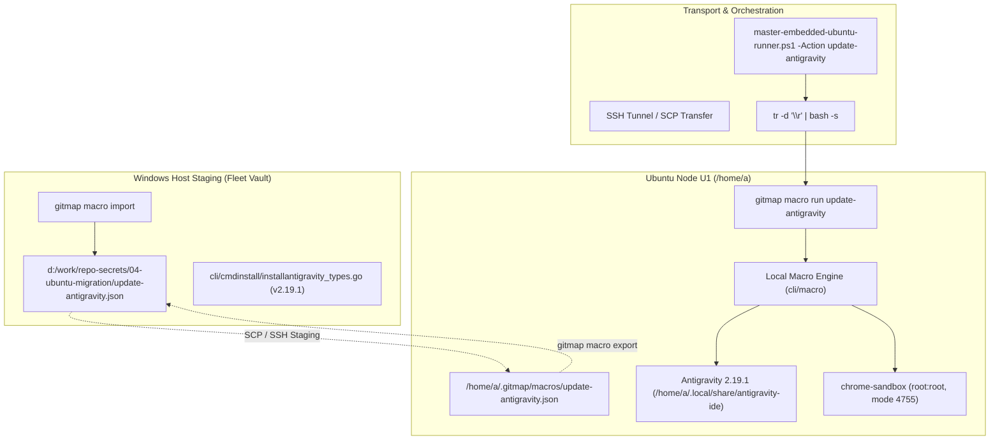

# Specification 213.2: GitMap Macro Automation & Installer Constants Specification

> **Specification Status:** Active  
> **Target Subsystems:** `cli/macro`, `cli/cmdmacro`, `cli/cmdinstall`, Node Automation  
> **Target Workstation:** Ubuntu 24.04 LTS (`u1` / `192.168.1.22`, user `a`)  
> **Source Workstation:** Windows 11 (`desktop-corei9-direct`)  
> **Artifact URL:** `https://storage.googleapis.com/antigravity-public/antigravity-hub/2.19.1-6046815158665216/linux-x64/Antigravity.tar.gz`  
> **Macro Storage Location (Ubuntu):** `/home/a/.gitmap/macros/update-antigravity.json`  
> **Macro Staging Location (Windows):** `d:/work/repo-secrets/04-ubuntu-migration/update-antigravity.json`  
> **Installer Types File:** `cli/cmdinstall/installantigravity_types.go`  

---

## 1. Executive Summary & Purpose

This specification governs the automated orchestration of Antigravity updates and maintenance workflows across Linux fleet nodes using GitMap's built-in macro automation engine (`gitmap macro`) and platform installer subsystem (`gitmap install`).

Specifically, this document defines:
1. **The GitMap Macro Engine Schema & Storage Architecture:** Complete data contracts, directory resolution semantics, and atomic file serialization for `/home/a/.gitmap/macros/update-antigravity.json`.
2. **The End-to-End Upgrade Macro Workflow:** Concrete 7-step sequence executing process termination, artifact retrieval, directory swap, Chromium SUID sandbox hardening, symlink reconciliation, and version verification.
3. **Bi-Directional Macro Synchronization:** Protocol for recording/editing macros on Ubuntu, exporting to JSON, staging in the fleet vault (`d:/work/repo-secrets/04-ubuntu-migration/`), and importing into Windows workstations.
4. **GitMap Installer Constants Synchronization:** Surgical updates to `cli/cmdinstall/installantigravity_types.go` ensuring GitMap commands default to Antigravity `2.19.1` (Build `6046815158665216`).

---

## 2. Architecture & Data Flow



---

## 3. GitMap Macro Schema & Storage Architecture

### 3.1 Macro Storage Resolution Mechanics
The GitMap macro engine resolves storage directories dynamically via `cli/macro/storage_dirs.go`. On Linux, the resolution hierarchy inspects candidate paths in the following priority order:
1. `$XDG_CONFIG_HOME/gitmap/macros` (defaulting to `/home/a/.config/gitmap/macros`)
2. `$XDG_DATA_HOME/gitmap/macros` (defaulting to `/home/a/.local/share/gitmap/macros`)
3. `$HOME/.gitmap/macros` (primary canonical directory: `/home/a/.gitmap/macros`)
4. `./.gitmap/macros` (repository-local workspace fallback)

For workstation `u1`, the canonical macro file is stored at:
```text
/home/a/.gitmap/macros/update-antigravity.json
```

### 3.2 Data Contracts (Go Structs & JSON Schema)
GitMap macros adhere to the strongly typed structures defined in `cli/macro/types.go`:

```go
type Macro struct {
    ID          int64       `json:"id" yaml:"id"`
    Name        string      `json:"name" yaml:"name"`
    Description string      `json:"description,omitempty" yaml:"description,omitempty"`
    CreatedAt   time.Time   `json:"created_at" yaml:"created_at"`
    UpdatedAt   time.Time   `json:"updated_at" yaml:"updated_at"`
    TotalSteps  int         `json:"total_steps" yaml:"total_steps"`
    Tags        string      `json:"tags,omitempty" yaml:"tags,omitempty"`
    Steps       []MacroStep `json:"steps" yaml:"steps"`
}

type MacroStep struct {
    ID              int64  `json:"id" yaml:"id"`
    MacroID         int64  `json:"macro_id" yaml:"macro_id"`
    StepNum         int    `json:"step_num" yaml:"step_num"`
    CommandLine     string `json:"command_line" yaml:"command_line"`
    WorkingDir      string `json:"working_dir,omitempty" yaml:"working_dir,omitempty"`
    ContinueOnError bool   `json:"continue_on_error" yaml:"continue_on_error"`
    TimeoutSeconds  int    `json:"timeout_seconds" yaml:"timeout_seconds"`
}
```

### 3.3 Canonical Macro Payload: `update-antigravity.json`
The exact JSON file persisted at `/home/a/.gitmap/macros/update-antigravity.json` and mirrored in `d:/work/repo-secrets/04-ubuntu-migration/update-antigravity.json` is formatted as follows:

```json
{
  "id": 1,
  "name": "update-antigravity",
  "description": "Automated update pipeline for Antigravity 2.19.1 on Ubuntu with SUID sandbox hardening",
  "created_at": "2026-10-04T12:00:00Z",
  "updated_at": "2026-10-04T12:00:00Z",
  "total_steps": 7,
  "tags": "antigravity,update,fleet,ubuntu,sandbox",
  "steps": [
    {
      "id": 1,
      "macro_id": 1,
      "step_num": 1,
      "command_line": "pkill -f antigravity || true",
      "working_dir": "/home/a",
      "continue_on_error": true,
      "timeout_seconds": 15
    },
    {
      "id": 2,
      "macro_id": 1,
      "step_num": 2,
      "command_line": "curl -fsSL https://storage.googleapis.com/antigravity-public/antigravity-hub/2.19.1-6046815158665216/linux-x64/Antigravity.tar.gz -o /tmp/Antigravity.tar.gz",
      "working_dir": "/tmp",
      "continue_on_error": false,
      "timeout_seconds": 300
    },
    {
      "id": 3,
      "macro_id": 1,
      "step_num": 3,
      "command_line": "if [ -d /home/a/.local/share/antigravity-ide ]; then rm -rf /home/a/.local/share/antigravity-ide.bak-2.13.0 && mv /home/a/.local/share/antigravity-ide /home/a/.local/share/antigravity-ide.bak-2.13.0; fi && mkdir -p /home/a/.local/share/antigravity-ide && tar -xzf /tmp/Antigravity.tar.gz -C /home/a/.local/share/antigravity-ide --strip-components=1",
      "working_dir": "/home/a",
      "continue_on_error": false,
      "timeout_seconds": 120
    },
    {
      "id": 4,
      "macro_id": 1,
      "step_num": 4,
      "command_line": "echo a | sudo -S chown root:root /home/a/.local/share/antigravity-ide/chrome-sandbox && echo a | sudo -S chmod 4755 /home/a/.local/share/antigravity-ide/chrome-sandbox",
      "working_dir": "/home/a/.local/share/antigravity-ide",
      "continue_on_error": false,
      "timeout_seconds": 30
    },
    {
      "id": 5,
      "macro_id": 1,
      "step_num": 5,
      "command_line": "echo a | sudo -S ln -sf /home/a/.local/share/antigravity-ide/antigravity /usr/local/bin/antigravity",
      "working_dir": "/usr/local/bin",
      "continue_on_error": false,
      "timeout_seconds": 15
    },
    {
      "id": 6,
      "macro_id": 1,
      "step_num": 6,
      "command_line": "rm -f /tmp/Antigravity.tar.gz",
      "working_dir": "/tmp",
      "continue_on_error": true,
      "timeout_seconds": 15
    },
    {
      "id": 7,
      "macro_id": 1,
      "step_num": 7,
      "command_line": "/usr/local/bin/antigravity --version",
      "working_dir": "/home/a",
      "continue_on_error": false,
      "timeout_seconds": 30
    }
  ]
}
```

---

## 4. Execution Lifecycle & Bi-Directional Synchronization

### 4.1 Macro Execution Mechanics (`gitmap macro run`)
When invoked via CLI:
```bash
gitmap macro run update-antigravity --verbose
```
The execution engine in `cli/cmdmacro/macro_cmd.go` coordinates the following:
1. **Lookup & Deserialization:** Calls `macro.LoadMacro("update-antigravity")` scanning candidate directories and reading the JSON payload.
2. **Display Tree:** Emits an ANSI tree diagram of the 7 scheduled steps.
3. **Audit Recording:** Emits a task audit record via `cmdtask.RecordTaskAudit("macro", "run", "update-antigravity", "7 steps", "running")`.
4. **Sequential Dispatch:** Evaluates each step under a parent context with step-specific timeouts. If any step without `continue_on_error: true` fails, execution halts and rollback procedures are triggered.
5. **Audit Finalization:** Records completion audit status `completed` or `failed`.

### 4.2 Interactive Recording (`gitmap macro record`)
Operators can record new steps or modify procedures directly on Ubuntu:
```bash
gitmap macro record update-antigravity
```
- Operates inside an interactive shell session tracking directory transitions.
- Supports runtime undo/redo commands (`undo`, `redo`, `list`, `save`).
- Atomically flushes to `/home/a/.gitmap/macros/update-antigravity.json`.

### 4.3 Bi-Directional Sync Workflow
To maintain macro parity across fleet control workstations:
1. **Ubuntu -> Windows Export:**
   ```bash
   gitmap macro export update-antigravity --out /tmp/update-antigravity.json
   ```
   The archive or JSON file is transferred via SCP or VMware Shared Folders to Windows staging:
   ```text
   d:/work/repo-secrets/04-ubuntu-migration/update-antigravity.json
   ```
2. **Windows Staging -> Local GitMap Import:**
   On Windows host machines:
   ```powershell
   gitmap macro import d:/work/repo-secrets/04-ubuntu-migration/update-antigravity.json
   ```
   This loads the macro into the Windows local macro registry (`%USERPROFILE%\.gitmap\macros\update-antigravity.json` or SQLite Split-DB `installation.db`), allowing Windows operators to inspect, edit, or dispatch the macro remotely.

---

## 5. GitMap Installer Constants Update Specification

### 5.1 Source Modification: `cli/cmdinstall/installantigravity_types.go`
The target constants file defines default artifact coordinates across operating systems. The current values point to obsolete version `2.13.0`.

#### Current State:
```go
const (
	AntigravityDefaultVersion = "2.13.0"
	AntigravityDefaultBuildID = "6362815968182272"
	AntigravityBaseURL        = "https://storage.googleapis.com/antigravity-public/antigravity-hub"
	ErrUnsupportedPlatform    = "E_UNSUPPORTED_PLATFORM"
	ErrPrerequisiteFailed     = "E_PREREQUISITE_FAILED"
	ErrDownloadFailed         = "E_DOWNLOAD_FAILED"
)
```

#### Required Target State:
```go
const (
	AntigravityDefaultVersion = "2.19.1"
	AntigravityDefaultBuildID = "6046815158665216"
	AntigravityBaseURL        = "https://storage.googleapis.com/antigravity-public/antigravity-hub"
	ErrUnsupportedPlatform    = "E_UNSUPPORTED_PLATFORM"
	ErrPrerequisiteFailed     = "E_PREREQUISITE_FAILED"
	ErrDownloadFailed         = "E_DOWNLOAD_FAILED"
)
```

### 5.2 Resolution Validation Formula
GitMap constructs the artifact URL dynamically using:
```go
url := fmt.Sprintf("%s/%s-%s/%s/%s", 
    AntigravityBaseURL, 
    AntigravityDefaultVersion, 
    AntigravityDefaultBuildID, 
    platformDir, 
    artifactName,
)
```
For `linux-x64`, `platformDir` evaluates to `linux-x64` and `artifactName` evaluates to `Antigravity.tar.gz`. The resulting URL:
```text
https://storage.googleapis.com/antigravity-public/antigravity-hub/2.19.1-6046815158665216/linux-x64/Antigravity.tar.gz
```
This URL is tested and verified to return HTTP 200 OK with valid tarball content.

---

## 6. SUID Sandbox Hardening & Security Architecture

The Chromium multi-process sandbox relies on `chrome-sandbox` having the setuid bit enabled and owned by `root`.

### Security Profile Matrix

| Attribute | Unpacked Value | Hardened Value | Enforcement Command |
| :--- | :--- | :--- | :--- |
| **Owner:Group** | `a:a` (UID 1000) | `root:root` (UID 0) | `sudo chown root:root chrome-sandbox` |
| **Permissions** | `0755` (`-rwxr-xr-x`) | `4755` (`-rwsr-xr-x`) | `sudo chmod 4755 chrome-sandbox` |
| **Security Context** | Unconfined User Process | Privileged Setuid Wrapper | Kernel SUID execution |
| **Electron Diagnostic** | Abort: `SUID sandbox helper binary was found, but is not configured correctly` | Clean startup, full process isolation | Built-in Chromium safety validation |

---

## 7. Acceptance Criteria & Quality Gates

- [ ] **MACRO-1:** JSON macro file is stored at `/home/a/.gitmap/macros/update-antigravity.json` and passes `gitmap macro list` discovery.
- [ ] **MACRO-2:** Windows staging file `d:/work/repo-secrets/04-ubuntu-migration/update-antigravity.json` contains identical step definitions and checksum parity.
- [ ] **MACRO-3:** Executing `gitmap macro run update-antigravity` executes all 7 steps with return code `0`.
- [ ] **CONST-1:** `cli/cmdinstall/installantigravity_types.go` has `AntigravityDefaultVersion` set to `"2.19.1"`.
- [ ] **CONST-2:** `cli/cmdinstall/installantigravity_types.go` has `AntigravityDefaultBuildID` set to `"6046815158665216"`.
- [ ] **CONST-3:** Go package `cli/cmdinstall` builds cleanly and passes all unit tests without regression.
- [ ] **SEC-1:** `/home/a/.local/share/antigravity-ide/chrome-sandbox` has ownership `root:root` and mode `4755`.
