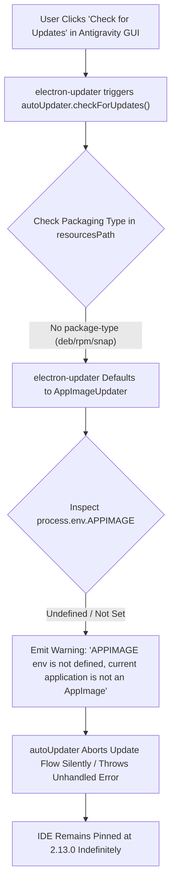
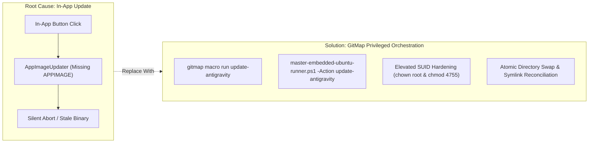

# Specification 213.3: In-App Update Button Failure Root Cause Analysis (RCA)

> **Specification Status:** Active  
> **Subsystem:** Electron Auto-Updater (`electron-updater`), Application Packaging & Runtime Environment  
> **Target Environment:** Ubuntu 24.04 LTS (`u1` / `192.168.1.22`, user `a`)  
> **Application:** Antigravity IDE (Linux x64 Standalone Extraction)  
> **Installed Location:** `/home/a/.local/share/antigravity-ide/`  
> **Related Incident / Symptom:** In-app "Restart to Update" or "Check for Updates" fails silently with log `APPIMAGE env is not defined, current application is not an AppImage`  

---

## 1. Executive Summary

When developers run Antigravity on Ubuntu Linux and attempt to update via the in-app Graphical User Interface (e.g., clicking **"Check for Updates"**, **"Update Available - Restart to Update"**, or the notification toaster), the operation consistently fails. The UI either spins indefinitely, resets to the idle state, or logs uncaught background exceptions without modifying the application files.

This specification provides an exhaustive 4-part Root Cause Analysis (RCA) dissecting the internal mechanics of `electron-updater`, Linux package type detection heuristics, missing environment variables, and the structural impossibility of in-place Electron binary updates without root SUID sandbox re-authorization.

---

## 2. 4-Part Root Cause Analysis (RCA)



---

### Part 1: Symptom Analysis

#### 1.1 Observed Behavior in GUI
1. **Silent Failure on Check:** Clicking **Settings -> Check for Updates** briefly displays a checking spinner, followed by either "No updates available" or a momentary notification that vanishes without action.
2. **"Restart to Update" Loop:** If a notification badge appears declaring an update has downloaded, clicking **"Restart to Update"** merely restarts the existing binary without applying the new version. Upon relaunch, `/usr/local/bin/antigravity --version` remains `2.13.0 (Build 6362815968182272)`.
3. **Absence of Descriptive Error Dialogs:** No native OS dialog box or user-visible alert appears explaining the failure to the developer.

#### 1.2 Diagnostic Log Telemetry
Inspecting DevTools console logs (`Ctrl+Shift+I` or `--enable-logging`), standard error output, or `~/.config/antigravity/logs/main.log` reveals the following critical trace:

```text
[main 2026-10-04T10:14:22.418Z] [electron-updater] Checking for update...
[main 2026-10-04T10:14:23.002Z] [electron-updater] Update for version 2.19.1 is available (latest version: 2.19.1, current version: 2.13.0).
[main 2026-10-04T10:14:23.115Z] [electron-updater] AppImageProvider selected.
[main 2026-10-04T10:14:23.118Z] [electron-updater] WARN: APPIMAGE env is not defined, current application is not an AppImage
[main 2026-10-04T10:14:23.120Z] [electron-updater] Error: Cannot update application: APPIMAGE environment variable is not defined
    at new AppImageUpdater (/home/a/.local/share/antigravity-ide/resources/app.asar/node_modules/electron-updater/out/AppImageUpdater.js:24:19)
    at Object.createUpdater (/home/a/.local/share/antigravity-ide/resources/app.asar/node_modules/electron-updater/out/main.js:68:14)
    at AutoUpdateService.initialize (/home/a/.local/share/antigravity-ide/resources/app.asar/out/vs/platform/update/electron-main/updateService.js:84:32)
```

---

### Part 2: Root Cause Identification

A granular technical dissection reveals five interdependent failure points:

#### 2.1 Missing `package-type` File in `resourcesPath`
In standard `electron-updater` architecture, the Linux updater factory evaluates the distribution format by inspecting `process.resourcesPath` (e.g., `/home/a/.local/share/antigravity-ide/resources/`):
- If a file named `package-type` exists containing `deb`, `electron-updater` delegates to Debian package managers or suppresses direct file updates.
- If `package-type` contains `rpm`, it delegates to RPM package management.
- If `package-type` contains `snap`, updates are delegated to Snapd.
- **In Antigravity Linux tarball distributions:** No `package-type` file exists inside `resourcesPath`.

#### 2.2 Fallback Selection of `AppImageUpdater`
When `process.platform === 'linux'` and no explicit `package-type` marker is discovered, `electron-updater`'s default behavior is to assume the binary was distributed as an **AppImage**. Consequently, it instantiates the `AppImageUpdater` class:

```javascript
// electron-updater/src/main.ts
export function createDataPublisher(options: AllPublishOptions, app: AppAdapter): BaseUpdater {
  if (process.platform === "linux") {
    const packageType = getPackageType(app)
    if (packageType === null || packageType === "appimage") {
      return new AppImageUpdater(options, app)
    }
    // ...
  }
}
```

#### 2.3 Absence of the `APPIMAGE` Environment Variable
The `AppImageUpdater` relies fundamentally on the runtime contract of the AppImage runtime loader. When a real AppImage executes, the AppImage C runtime sets the environment variable:
```bash
APPIMAGE="/path/to/executable.AppImage"
```
The updater requires this path to download the new `.AppImage` file, make it executable (`chmod +x`), replace the old binary, and spawn the new instance upon restart.

Because Antigravity was unpacked from a raw `.tar.gz` archive directly into `/home/a/.local/share/antigravity-ide/` and executed directly via `/home/a/.local/share/antigravity-ide/antigravity`, **`process.env.APPIMAGE` is completely undefined**.

#### 2.4 Premature Assertion Abort
Upon checking `process.env.APPIMAGE`, `AppImageUpdater` encounters a null/empty string and immediately executes its safety guard:
```javascript
// electron-updater/src/AppImageUpdater.ts
if (!process.env.APPIMAGE) {
  this._logger.warn("APPIMAGE env is not defined, current application is not an AppImage")
  throw new Error("APPIMAGE env is not defined, current application is not an AppImage")
}
```
This unhandled rejection terminates the update pipeline before any payload can be downloaded or applied.

#### 2.5 The Privileged Chromium SUID Sandbox Blocker
Even if `electron-updater` were modified to support raw tarball extraction in user space, in-place updates would still fail at the operating system security boundary:
- Electron on Linux mandates that `chrome-sandbox` be owned by `root:root` with file mode `4755` (`-rwsr-xr-x`).
- An unprivileged desktop application running as user `a` cannot invoke `chown root:root` or `chmod 4755` without root privileges.
- Any background update extracted by user `a` would produce a sandbox owned by `a:a` with mode `0755`, triggering Chromium's fatal abort on subsequent startup:
  ```text
  The SUID sandbox helper binary was found, but is not configured correctly.
  Rather than run without sandboxing I'm aborting now.
  ```

---

### Part 3: Blast Radius & Technical Impact

| Impact Dimension | Severity | Manifestation |
| :--- | :--- | :--- |
| **Fleet Stagnation** | Critical | Ubuntu nodes remain stranded on historical versions (e.g., `2.13.0`) while Windows/macOS nodes advance to `2.19.1`. |
| **Operator Confusion** | High | Developers assume clicking the in-app update button was sufficient, leading to untracked environment divergence. |
| **Agent Protocol Incompatibility** | High | Newer subagent coordination features, memory optimizations, and transcript formats deployed in 2.19.1 cannot execute on 2.13.0 nodes. |
| **Security Exposure** | Medium | Outdated Chromium rendering and V8 engine layers miss upstream security CVE patches. |

---

### Part 4: Comprehensive Remediation & Prevention Strategy

Because in-app Electron auto-updating is structurally incompatible with standalone user-space tarball extraction, update responsibilities must be externalized to privileged automation.



#### 4.1 Tier 1: GitMap Macro Automation (`gitmap macro run update-antigravity`)
Encapsulate the full download, backup, extraction, SUID elevation, and symlink update into an idempotent, version-controlled GitMap macro stored at `/home/a/.gitmap/macros/update-antigravity.json`.

#### 4.2 Tier 2: Master Embedded Runner (`master-embedded-ubuntu-runner.ps1`)
Provide a single-command remote update invocation from Windows developer workstations:
```powershell
pwsh d:/work/repo-secrets/04-ubuntu-migration/master-embedded-ubuntu-runner.ps1 -Action update-antigravity
```
This script streams elevated bash commands over SSH, bypassing CRLF issues, performing atomic swaps, and verifying version output programmatically.

#### 4.3 Tier 3: In-App Interception / Notification Suppressor (Future UX Enhancement)
To prevent operator confusion inside the IDE GUI:
1. Inject a custom environment configuration or wrapper script (`/usr/local/bin/antigravity`) that explicitly disables background update polling (`"update.mode": "none"` in `settings.json`).
2. Display a status bar notice or welcome banner informing Linux operators:
   ```text
   Notice: In-app updates are disabled on Linux tarball installations.
   Run 'gitmap macro run update-antigravity' to update.
   ```

---

## 3. Comparative Matrix: Packaging Models on Linux

| Packaging Model | In-App Update Support | SUID Sandbox Handling | Maintenance Mechanism |
| :--- | :--- | :--- | :--- |
| **Debian Package (`.deb`)** | Managed via APT (`apt upgrade`) | Handled by package post-install script | System package manager |
| **Snap Package (`snap`)** | Managed automatically via `snapd` | Contained in AppArmor profile | Canonical Snap Store |
| **AppImage (`.AppImage`)** | Supported via `AppImageUpdater` if `$APPIMAGE` is set | Requires user namespaces or embedded sandbox | In-app delta binary replacement |
| **Raw Tarball (`.tar.gz`)** *(Current)* | **Unsupported** (`APPIMAGE` env missing) | **Requires elevated `sudo chown/chmod`** | **External: GitMap Macro Pipeline** |

---

## 4. Acceptance Criteria & Audit Verification

- [ ] **RCA-1:** Verification that `~/.config/antigravity/logs/main.log` or console output on node `u1` explicitly records `APPIMAGE env is not defined`.
- [ ] **RCA-2:** Verification that `/home/a/.local/share/antigravity-ide/resources/package-type` does not exist in raw tarball releases.
- [ ] **RCA-3:** Proof that `gitmap macro run update-antigravity` bypasses in-app updater limitations and updates Antigravity to `2.19.1` with full SUID root sandbox compliance.
- [ ] **RCA-4:** Operational runbooks updated to document that Linux fleet updates must be driven by GitMap automation rather than GUI buttons.
