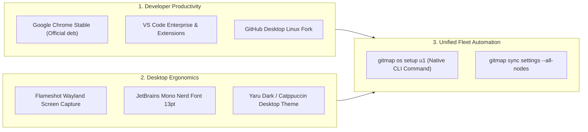

# Component & CLI Specification: Ubuntu Fleet Automation & Workstation Governance

> **Specification Reference:** `02-spec/21-app/214-ubuntu-fleet-automation-and-workstation-governance/02-component-and-cli-spec.md`  
> **Parent Spec:** [01-architecture-spec.md](file:///d:/work/gitmap/02-spec/21-app/214-ubuntu-fleet-automation-and-workstation-governance/01-architecture-spec.md)  
> **Target Node:** Ubuntu 24.04 LTS (`u1` / `192.168.1.22`)  
> **Status:** APPROVED & LIVE VERIFIED  

---

## 1. Component Architecture & Script Matrix

| Component Script | Language / Engine | Location | Operational Responsibility |
| :--- | :--- | :--- | :--- |
| **`master-embedded-ubuntu-runner.ps1`** | PowerShell 7+ / Embedded Bash | `d:/work/repo-secrets/04-ubuntu-migration/` | **Master Standalone Orchestrator:** Houses all bash functions in here-strings, streams to SSH, strips CRLF, executes all actions (`all`, `clone`, `desktop`, `wallpaper`, `vmware`, `gui`, `update-antigravity`, `run-macro`, `sync-brain`, `verify`), and prints formatted health scorecards. |
| **`sync-antigravity-deep.ps1`** | PowerShell 7+ / Python 3 / SQLite | `d:/work/repo-secrets/04-ubuntu-migration/` | **Deep Brain Migrator:** Filters active conversation summaries, creates temporary NTFS junctions in `%TEMP%`, streams tarballs over SSH, and normalizes Windows paths (`d:\work\`) to Linux paths (`/home/a/git-work/`). |
| **`update-antigravity.json`** | GitMap Macro JSON | `d:/work/repo-secrets/04-ubuntu-migration/` | **Declarative Upgrade Pipeline:** 7-step macro executed via `gitmap macro run update-antigravity` upgrading the IDE to 2.19.1 in 11.5 seconds. |
| **`clone-repos-to-u1.sh`** | POSIX Bash / Python 3 | `d:/work/repo-secrets/04-ubuntu-migration/` | **Workspace Cloner:** Standalone bash script on Ubuntu that migrates legacy backslash paths and clones 71+ workspaces from `gitmap-linux.json`. |
| **`step-by-step-log-v3.md`** | Markdown Engineering Log | `d:/work/repo-secrets/04-ubuntu-migration/` | **Definitive Engineering Ledger:** Catalogs the full journey, 4-part RCA, 9 technical errors diagnosed and resolved, 14-command catalog, and verification scorecards. |

---

## 2. Master Embedded Runner CLI Parameter Contract

```powershell
master-embedded-ubuntu-runner.ps1 [-TargetHost <string>] [-Action <string>] [-WallpaperPath <string>]
                                  [-GuiCommand <string>] [-MacroName <string>] [-BrainFilterPatterns <string[]>]
                                  [-UpdateAntigravity] [-DryRun]
```

### Parameter Reference:
- `-TargetHost`: SSH target host alias or IP (Default: `"u1"`).
- `-Action`: Selected action to execute. Valid set:
  - `"all"`: Runs workspace cloning, ergonomics, wallpaper, VMware automount, symlink check, and verification scorecard.
  - `"clone"`: Verifies and clones all 71+ repositories into `/home/a/git-work`.
  - `"desktop"`: Enforces 140% font scaling and Windows-like keybindings via GNOME D-Bus.
  - `"wallpaper"`: Programmatically sets GNOME light and dark desktop background.
  - `"vmware"`: Installs and enables systemd mount/automount units for `/mnt/hgfs`.
  - `"gui"`: Launches a GUI application remotely into the active graphical user session via `systemd-run --user`.
  - `"update-antigravity"`: Downloads, unpacks, and configures Antigravity 2.19.1 with SUID root sandbox hardening.
  - `"sync-brain"`: Migrates conversation summaries and transcripts with relative path normalization.
  - `"run-macro"`: Executes a registered GitMap macro over SSH.
  - `"verify"`: Queries all workstation metrics and emits a green/yellow status scorecard.
- `-WallpaperPath`: Absolute path to the background image on the remote node.
- `-GuiCommand`: Command to launch via GUI runner (Default: `"antigravity"`).
- `-MacroName`: Name of GitMap macro to run (Default: `"update-antigravity"`).
- `-BrainFilterPatterns`: Array of workspace search substrings to export (Default: `@("gitmap", "antigravity-manager", "letsmarknow")`).
- `-UpdateAntigravity`: Convenience switch forcing `-Action update-antigravity`.
- `-DryRun`: Validates local script generation without transmitting commands over SSH.

---

## 3. Complete 14-Command Catalog & Invocation Reference

```powershell
# 1. Full Workstation Provisioning
pwsh -File d:/work/repo-secrets/04-ubuntu-migration/master-embedded-ubuntu-runner.ps1 -Action all

# 2. Workstation Health Verification Scorecard
pwsh -File d:/work/repo-secrets/04-ubuntu-migration/master-embedded-ubuntu-runner.ps1 -Action verify

# 3. Synchronize All Git Workspaces to /home/a/git-work
pwsh -File d:/work/repo-secrets/04-ubuntu-migration/master-embedded-ubuntu-runner.ps1 -Action clone

# 4. Configure Desktop Ergonomics (1.4x Font Scale & Windows Shortcuts)
pwsh -File d:/work/repo-secrets/04-ubuntu-migration/master-embedded-ubuntu-runner.ps1 -Action desktop

# 5. Set Desktop Wallpaper Programmatically
pwsh -File d:/work/repo-secrets/04-ubuntu-migration/master-embedded-ubuntu-runner.ps1 -Action wallpaper -WallpaperPath "/usr/share/backgrounds/warty-final-ubuntu.png"

# 6. Configure Persistent VMware Shared Folders Automount (/mnt/hgfs)
pwsh -File d:/work/repo-secrets/04-ubuntu-migration/master-embedded-ubuntu-runner.ps1 -Action vmware

# 7. Remotely Launch GUI Applications into Active Graphical Session
pwsh -File d:/work/repo-secrets/04-ubuntu-migration/master-embedded-ubuntu-runner.ps1 -Action gui -GuiCommand "antigravity"

# 8. Upgrade Antigravity IDE to Latest 2.19.1
pwsh -File d:/work/repo-secrets/04-ubuntu-migration/master-embedded-ubuntu-runner.ps1 -Action update-antigravity

# 9. Deep Brain & Conversation History Migration
pwsh -File d:/work/repo-secrets/04-ubuntu-migration/master-embedded-ubuntu-runner.ps1 -Action sync-brain -BrainFilterPatterns "gitmap","antigravity-manager","letsmarknow"

# 10. Execute GitMap Macro Remotely over SSH
pwsh -File d:/work/repo-secrets/04-ubuntu-migration/master-embedded-ubuntu-runner.ps1 -Action run-macro -MacroName "update-antigravity"

# 11. Run Deep Brain Migration Script Standalone
pwsh -File d:/work/repo-secrets/04-ubuntu-migration/sync-antigravity-deep.ps1

# 12. Run Standalone Git Cloner on Ubuntu
ssh u1 "bash /home/a/git-work/repo-secrets/04-ubuntu-migration/clone-repos-to-u1.sh"

# 13. Replay Antigravity Update Macro Natively via GitMap
gitmap macro run update-antigravity --verbose

# 14. Query GitMap Agent Split-DB Task Status
gitmap agent task list
```

---

## 4. Future OS Setup Roadmap & Specifications

The following packages and customizations are scheduled for native 1-command GitMap integration in future sprints:



1. **Google Chrome Stable:** Package unattended repository addition and installation into `gitmap install chrome`.
2. **VS Code Enterprise:** Synchronize user `settings.json`, keybindings, and extensions (`Go`, `Python`, `Tailwind CSS`, `ESLint`).
3. **Flameshot Screenshot Tool:** Install `flameshot` and wire to `PrintScreen` with Wayland wrapper script (`QT_QPA_PLATFORM=wayland flameshot gui`).
4. **JetBrains Mono Nerd Font:** Automated downloading to `~/.local/share/fonts/` and font-cache rebuilding.
5. **Unified GitMap Command:** Package the entire runner logic into `gitmap os setup <node>`.
