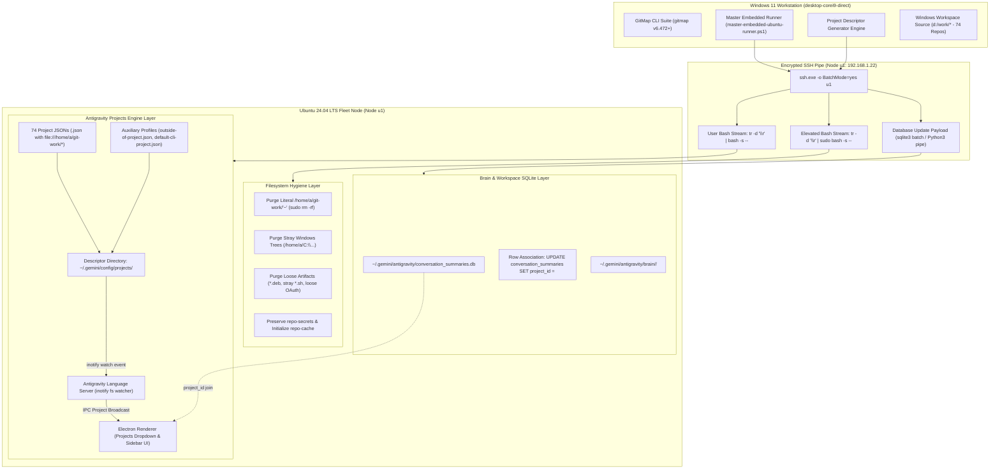
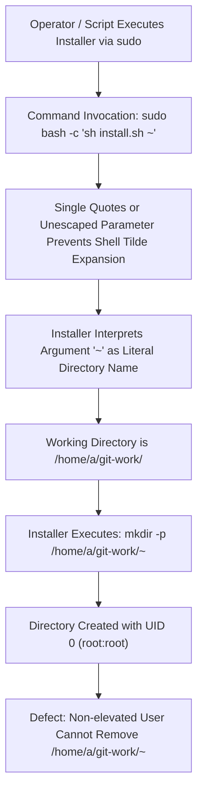
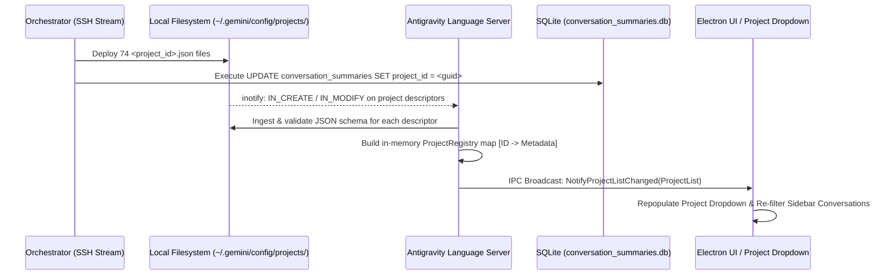

# Architecture Specification: Ubuntu Fleet Filesystem Hygiene & Antigravity Projects Engine

> **Specification Reference:** `02-spec/21-app/215-ubuntu-fleet-cleanup-antigravity-projects-and-app-manager/01-architecture-spec.md`  
> **Status:** APPROVED & SPECIFIED  
> **Task Identifier:** `215-ubuntu-fleet-cleanup-antigravity-projects-and-app-manager`  
> **Target Node:** Ubuntu 24.04 LTS (`u1` / `192.168.1.22`)  
> **Source Host:** Windows 11 (`desktop-corei9-direct`)  
> **Target User:** `a` (UID 1000, GID 1000)  
> **Toolchain:** GitMap CLI, PowerShell 7+, OpenSSH, POSIX Bash, SQLite3, Antigravity Language Server, JSON Project Registry  

---

## 1. Executive Summary & Problem Formulation

Following the multi-stage provisioning and workstation migration of Ubuntu node `u1` (Tasks 211–214), the workstation host operates with 74 synchronized repositories, custom GNOME ergonomics, persistent VMware shared folders, hardened Chromium SUID sandboxing, and deep brain conversation history. However, two critical architectural gaps remain:

1. **Filesystem Hygiene & Artifact Pollution on Node `u1`:**
   - **Root-Owned Tilde Directory:** An invalid literal directory named `~` exists at `/home/a/git-work/~`, owned by `root:root` with restricted permissions.
   - **Windows Backslash Path Leakage:** Stray directory trees resulting from cross-platform path serialization leaks (e.g. `/home/a/C:\Users\...`) pollute the user's home folder.
   - **Loose Transient Artifacts:** Deprecated installation packages (`.deb`), one-off automation scripts (`.sh`), and exposed transient OAuth token caches reside loosely directly inside `/home/a/`.
   - **Hollow Repositories vs Canonical Locations:** Hollow or empty repository shells exist in `/home/a/` while canonical working trees are located in `/home/a/git-work/`. Furthermore, the relationship and initialization status between `/home/a/git-work/repo-secrets` (master credential store) and `/home/a/git-work/repo-cache` (git cache store) must be formally governed.

2. **Antigravity Projects Engine & Workspace Registration:**
   - **Unpopulated Project Selector:** While repositories exist under `/home/a/git-work/`, the Antigravity IDE project switcher UI displays an empty list or only default fallback entries.
   - **Missing Project JSON Descriptors:** The configuration directory `~/.gemini/config/projects/` lacks formal `<project_id>.json` descriptors for the 74 workspace repositories.
   - **Orphaned Conversations in SQLite:** Migrated conversation records in `~/.gemini/antigravity/conversation_summaries.db` contain blank or invalid `project_id` foreign references, preventing historical conversation threads from linking to workspace projects.
   - **Dynamic Discovery Pipeline:** The operational relationship between the Antigravity `language_server`, inotify filesystem watchers on `~/.gemini/config/projects/`, and live UI project sidebar updates must be codified and automated.

This specification defines the architectural design, forensic root cause remediation, JSON schema structures, SQLite database bindings, and automated execution workflow to achieve full fleet filesystem hygiene and dynamic project registration.

---

## 2. End-to-End System Topology & Architecture



---

## 3. Deep Root Cause Analysis (RCA) - Filesystem Stray Residue

### 3.1 Forensic Analysis of the Root-Owned Tilde Directory

#### Incident Definition
A directory named `~` exists at `/home/a/git-work/~`, with metadata showing ownership `root:root` and permission mode `0755` (or `0700`). Standard non-elevated user deletion (`rm -rf ~` or `rm -rf /home/a/git-work/~`) fails with `Permission denied`. Furthermore, running `rm -rf ~` without careful shell escaping can inadvertently expand to the current user's home directory (`$HOME`), causing catastrophic data loss.



#### Forensic Findings
1. **Execution Context:** During automated terminal shell provisioning, an Oh My Zsh or custom toolchain installation script was invoked through `sudo` with the current working directory set to `/home/a/git-work/`.
2. **Expansion Failure:** The parameter passing the target home directory was passed as a literal string `'~'` or inside single quotes, preventing the calling shell from expanding `~` to `/root` or `/home/a`.
3. **Target Evaluation:** The installation script evaluated `TARGET_DIR="$1"` and executed `mkdir -p "$TARGET_DIR/.oh-my-zsh"`. Because `TARGET_DIR` was the literal string `~`, the filesystem resolved this relative to the process's working directory (`/home/a/git-work/`), generating `/home/a/git-work/~`.
4. **Remediation Protocol:**
   - Must be deleted with elevated privileges (`sudo`).
   - Must strictly quote or escape the tilde to prevent shell expansion to `/root`:
     ```bash
     sudo rm -rf "/home/a/git-work/~"
     # or explicitly:
     sudo rm -rf /home/a/git-work/'~'
     ```
   - Pre-flight and post-flight verification must ensure `[ ! -e /home/a/git-work/'~' ]`.

---

### 3.2 Stray Windows Path Leaks (`/home/a/C:\Users\...`)

#### Incident Definition
Directories resembling Windows drive paths, such as `/home/a/C:\Users\...` or `/home/a/C:`, exist in the Linux user home folder.

#### Forensic Mechanism
- When cross-platform copy utilities (`scp`, `rsync`, `tar`, or PowerShell remote scriptlets) stream paths using un-sanitized Windows path strings containing backslashes (e.g. `C:\Users\Administrator\...`), POSIX shells interpret backslashes as valid directory name characters rather than path delimiters.
- If a target argument is evaluated as `DEST="/home/a/$WINDOWS_PATH"`, Linux creates a physical directory named `C:\Users\Administrator\...` directly under `/home/a/`.
- **Remediation Protocol:**
  - Recursively purge all directories matching `/home/a/C:*` or `/home/a/C:\*`:
    ```bash
    rm -rf /home/a/C:* /home/a/c:* 2>/dev/null || true
    ```

---

### 3.3 Loose Transient Packages, Scripts & OAuth Credentials

#### Incident Definition
Loose `.deb` packages (e.g., `google-chrome-stable_current_amd64.deb`, `antigravity_amd64.deb`), ad-hoc bootstrap scripts (`*.sh`), and stray OAuth token cache files exist directly in `/home/a/`.

#### Policy & Hygiene Rules
1. **No Installation Binaries in Home Root:** `.deb`, `.tar.gz`, and `.rpm` files must be staged exclusively in `/tmp` and purged after package manager execution.
2. **Script Consolidation:** Operational shell scripts must reside either in `/usr/local/bin/` (if system-wide) or inside structured automation repositories (e.g., `/home/a/git-work/repo-secrets/04-ubuntu-migration/`). No loose `.sh` scripts in `/home/a/`.
3. **Credential & OAuth Token Isolation:** Authentication tokens must never reside loosely in `/home/a/`. They must adhere to XDG Base Directory standards (`~/.config/gcloud/`, `~/.gemini/`, or system keyrings). Any loose token files in `/home/a/` must be safely validated, migrated into appropriate config directories, or purged.

---

### 3.4 Repository Boundary Governance: `repo-secrets` vs `repo-cache`

#### Topology Separation
- **`/home/a/` vs `/home/a/git-work/`:** User home root `/home/a/` must contain zero git repositories. Any hollow or duplicate repository folders in `/home/a/` (such as `/home/a/gitmap/` or `/home/a/Antigravity-Manager/` created during preliminary bootstrapping) are redundant and must be purged. All repositories belong strictly in `/home/a/git-work/<repo>`.
- **`/home/a/git-work/repo-secrets`:**
  - Role: Master configuration, encryption keys, migration scripts, and infrastructure credentials.
  - Policy: Non-negotiable preservation. Must be verified for git integrity (`git status`, `git remote -v`). Never overwritten or deleted.
- **`/home/a/git-work/repo-cache`:**
  - Role: High-speed local cache for GitMap package repositories, upstream bundle mirrors, and build artifact caches.
  - Policy: Must be initialized if absent. If the remote repository exists in GitMap's catalog, clone or initialize `/home/a/git-work/repo-cache` with proper permissions (`a:a`).

---

## 4. Antigravity Projects Engine Architecture

### 4.1 Discovery & Language Server Lifecycle

The Antigravity IDE uses a decoupled client-server architecture:
- **Renderer / Frontend (Electron):** Renders the user interface, top-bar project selector dropdown, and conversation sidebar.
- **Language Server Daemon (`language_server`):** Background process providing code intelligence, workspace indexing, and project configuration management.



1. **Filesystem Watcher Registration:** Upon startup, `language_server` registers an inotify file watcher on the directory `/home/a/.gemini/config/projects/`.
2. **Real-Time Notification:** When files matching `*.json` are written or updated in this folder, `language_server` parses each file according to the Antigravity Project Schema.
3. **Zero Restart Reloading:** Changes are propagated live via internal IPC channels to the Electron renderer. The UI dropdown updates immediately without restarting the IDE or reloading the window.

---

### 4.2 Project Descriptor Schema Specification

Every project descriptor file placed in `~/.gemini/config/projects/<project_id>.json` must strictly conform to the following schema:

```json
{
  "id": "e714aa58-fdc0-471e-92c4-3b4c607b4398",
  "name": "gitmap",
  "projectResources": {
    "resources": [
      {
        "gitFolder": {
          "folderUri": "file:///home/a/git-work/gitmap",
          "defaultBranch": "main"
        }
      }
    ]
  },
  "permissionGrants": {
    "permissionGrants": {
      "allow": []
    }
  },
  "settings": {},
  "updatedAt": "2026-10-04T16:00:00.000000000Z",
  "isWorkspaceOnly": false
}
```

#### Field Specifications

| Field Name | Type | Mandatory | Description |
| :--- | :--- | :--- | :--- |
| `id` | String | Yes | Unique identifier. Formatted as a standard UUIDv4 string (lowercase, hyphen-separated) or predefined system slug (`outside-of-project`, `default-cli-project`). Must exactly match the filename `<id>.json`. |
| `name` | String | Yes | Human-readable project display name shown in the Antigravity top-bar switcher and project management modal. Matches the repository folder basename. |
| `projectResources` | Object | Yes | Container holding the list of workspace resources belonging to the project. |
| `projectResources.resources` | Array | Yes | Array of resource objects. For standard git repositories, contains a single resource entry. |
| `resources[].gitFolder` | Object | Yes | Git repository descriptor object. |
| `resources[].gitFolder.folderUri` | String | Yes | RFC 3986 compliant `file://` URI referencing the absolute path to the local repository. On Ubuntu: `file:///home/a/git-work/<repo-name>`. |
| `resources[].gitFolder.defaultBranch` | String | Yes | Primary Git branch name detected from `.git/HEAD` (typically `main` or `master`). Defaults to `main`. |
| `permissionGrants` | Object | No | Contains automated command execution permissions granted by the user or agent policy. Default: empty allow list. |
| `settings` | Object | Yes | Project-scoped IDE settings and policy overrides (e.g. `fileAccessPolicy`, `autoExecutionPolicy`). Default: `{}`. |
| `updatedAt` | String | Yes | ISO 8601 UTC timestamp with nanosecond precision representing last modification. |
| `isWorkspaceOnly` | Boolean | Yes | Positive boolean indicator. When `false`, the project is an authoritative entity with persistent indexing and settings. When `true`, it is treated as a transient workspace folder. |

---

### 4.3 Auxiliary Project Descriptors

Two standardized auxiliary project descriptors must always exist alongside the repository descriptors:

#### 1. `outside-of-project.json`
- **Location:** `~/.gemini/config/projects/outside-of-project.json`
- **Purpose:** Default fallback container for conversation threads, ad-hoc scripts, and interactions initiated outside any git repository.
- **Specification:**
  ```json
  {
    "id": "outside-of-project",
    "name": "Outside of Project",
    "settings": {
      "fileAccessPolicy": "AGENT_SETTING_POLICY_ALLOW",
      "sandboxMode": false,
      "autoExecutionPolicy": "CASCADE_COMMANDS_AUTO_EXECUTION_OFF"
    },
    "updatedAt": "2026-10-04T16:00:00.000000000Z"
  }
  ```

#### 2. `default-cli-project.json`
- **Location:** `~/.gemini/config/projects/default-cli-project.json`
- **Purpose:** Headless CLI and daemon execution project profile.
- **Specification:**
  ```json
  {
    "id": "default-cli-project",
    "name": "CLI Project",
    "projectResources": {}
  }
  ```

---

### 4.4 Cross-Platform Workspace URI & Path Translation Matrix

When transitioning workspace context and conversation records from Windows 11 to Ubuntu Linux, paths must be deterministically mapped:

| Component | Windows 11 Source Format | Ubuntu Node `u1` Target Format |
| :--- | :--- | :--- |
| **Filesystem Path** | `d:\work\<repo>` or `D:\work\<repo>` | `/home/a/git-work/<repo>` |
| **Escaped File URI** | `file:///d%3A/work/<repo>` | `file:///home/a/git-work/<repo>` |
| **Unescaped File URI** | `file:///d:/work/<repo>` | `file:///home/a/git-work/<repo>` |
| **App Data Dir** | `C:\Users\Administrator\.gemini\antigravity` | `/home/a/.gemini/antigravity` |
| **Config Dir** | `C:\Users\Administrator\.gemini\config` | `/home/a/.gemini/config` |
| **Project JSON URI** | `file:///d%3A/work/<repo>` | `file:///home/a/git-work/<repo>` |

---

### 4.5 SQLite Conversation Stitching & Foreign Key Binding

The Antigravity conversation database (`~/.gemini/antigravity/conversation_summaries.db`) tracks historical conversation sessions in the `conversation_summaries` table:

```sql
CREATE TABLE IF NOT EXISTS conversation_summaries (
    conversation_id TEXT PRIMARY KEY,
    title TEXT NOT NULL DEFAULT "",
    preview TEXT NOT NULL DEFAULT "",
    step_count INTEGER NOT NULL DEFAULT 0,
    last_modified_time DATETIME NOT NULL,
    workspace_uris TEXT NOT NULL,
    status TEXT NOT NULL DEFAULT "",
    source TEXT NOT NULL DEFAULT "",
    project_id TEXT NOT NULL DEFAULT "",
    agent_name TEXT NOT NULL DEFAULT "",
    parent_conversation_id TEXT NOT NULL DEFAULT "",
    nesting_depth INTEGER NOT NULL DEFAULT 0,
    battle_id TEXT NOT NULL DEFAULT "",
    winning_conversation_id TEXT NOT NULL DEFAULT "",
    not_fully_idle NUMERIC NOT NULL DEFAULT 0,
    killed NUMERIC NOT NULL DEFAULT 0,
    last_user_input_time DATETIME NOT NULL,
    last_user_input_step_index INTEGER NOT NULL DEFAULT -1,
    app_data_dir TEXT NOT NULL DEFAULT "",
    raw_summary BLOB,
    group_id TEXT NOT NULL DEFAULT ""
);
```

#### Association Algorithm
1. The `project_id` column stores the GUID string referencing `~/.gemini/config/projects/<project_id>.json`.
2. When conversations are migrated from Windows, their `project_id` may either be blank, refer to Windows project IDs, or point to orphaned identifiers.
3. For each active project descriptor `<project_id>.json`, extract the repository directory from `folderUri` (e.g. `/home/a/git-work/<repo>`).
4. Execute parameterized SQLite updates matching conversation workspace URIs:
   ```sql
   UPDATE conversation_summaries
   SET project_id = ?
   WHERE workspace_uris LIKE ?;
   ```
   Where `?` is `<project_id>` and `?` is `%'file:///home/a/git-work/<repo>'%`.
5. Any conversation whose workspace URI does not match a registered git repository is mapped to `'outside-of-project'`:
   ```sql
   UPDATE conversation_summaries
   SET project_id = 'outside-of-project'
   WHERE project_id = '' OR project_id IS NULL;
   ```
6. This eliminates orphaned conversations and guarantees that selecting any project in the UI sidebar displays its complete, coherent conversation history.

---

## 5. Security Architecture & Permission Boundaries

1. **Privilege Demarcation:**
   - **User Mode (`a:a`, UID/GID 1000):** All standard operations—generating project JSONs, modifying `conversation_summaries.db`, updating workspace files, cloning `repo-cache`—must run under user `a`.
   - **Root Elevation (`sudo`):** Elevation is strictly quarantined to:
     - Deleting `/home/a/git-work/'~'` (which is owned by root).
     - Deleting stray root-owned artifacts in `/home/a/C:\...` if any.
2. **Shell Injection Prevention:**
   - All shell scripts executed over SSH must use single-quoted here-docs (`@' ... '@` in PowerShell) and `cat << 'EOF'` in Bash to prevent parameter expansion vulnerabilities.
   - Filenames with special characters (such as `~` and `\`) must never be passed unquoted to shell commands.
3. **Secret Store Protection:**
   - `/home/a/git-work/repo-secrets` contains sensitive infrastructure keys. File mode permissions must be maintained at `0700` for `.ssh` and sensitive directories, and `0600` for private key files.
   - Deletion scripts must explicitly safeguard `/home/a/git-work/repo-secrets` with fail-safe path guards.

---

## 6. Master Verification & Acceptance Scorecard

| # | Inspection Item | Verification Method | Target Criteria | Pass/Fail Condition |
| :-: | :--- | :--- | :--- | :--- |
| **01** | **Root-Owned Tilde Directory** | `ssh u1 "[ ! -e /home/a/git-work/'~' ]"` | Directory does not exist | **Must be 0 instances** |
| **02** | **Stray Windows Path Trees** | `ssh u1 "find /home/a -maxdepth 1 -name 'C:*'"` | 0 matching files/directories | **Zero matches** |
| **03** | **Loose Installation Packages** | `ssh u1 "ls -d /home/a/*.deb 2>/dev/null \| wc -l"` | Count = 0 | **Zero loose `.deb` files** |
| **04** | **Loose Bootstrap Scripts** | `ssh u1 "find /home/a -maxdepth 1 -name '*.sh'"` | 0 matching scripts | **Zero loose `.sh` files in home** |
| **05** | **Repository Secrets Store** | `ssh u1 "[ -d /home/a/git-work/repo-secrets/.git ]"` | Valid git repository present | **Directory exists & valid git HEAD** |
| **06** | **Repository Cache Store** | `ssh u1 "[ -d /home/a/git-work/repo-cache ]"` | Directory initialized & owned by `a:a` | **Directory exists** |
| **07** | **Hollow Home Repositories** | `ssh u1 "find /home/a -maxdepth 1 -name '.git'"` | 0 git root folders directly in `/home/a` | **Zero git roots in `/home/a`** |
| **08** | **Project Descriptors Deployment** | `ssh u1 "ls -1 /home/a/.gemini/config/projects/*.json \| wc -l"` | Total count = 76 (74 repos + 2 aux) | **>= 76 valid JSON files** |
| **09** | **Auxiliary Descriptors** | `ssh u1 "[ -f ~/.gemini/config/projects/outside-of-project.json ] && [ -f ~/.gemini/config/projects/default-cli-project.json ]"` | Both auxiliary JSONs present | **Both files exist and parse valid JSON** |
| **10** | **Conversation Project Binding** | `sqlite3 /home/a/.gemini/antigravity/conversation_summaries.db "SELECT count(*) FROM conversation_summaries WHERE project_id = ''"` | Count = 0 orphaned conversations | **Zero orphaned conversations** |
| **11** | **Language Server Ingestion** | Inotify event log inspection / Antigravity UI verification | All 74 projects visible in Project Dropdown | **100% dropdown population** |
