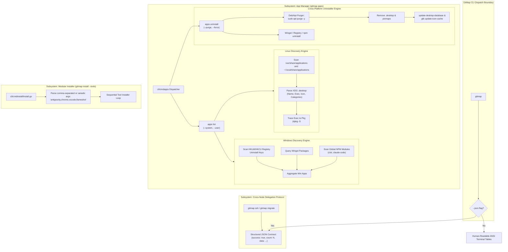
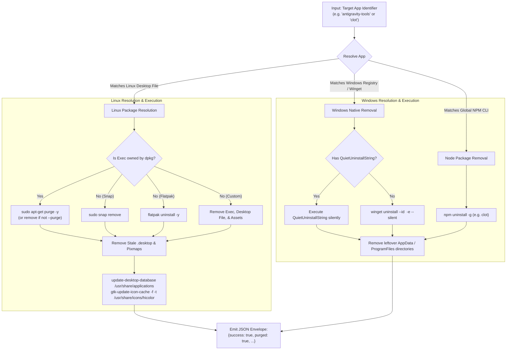
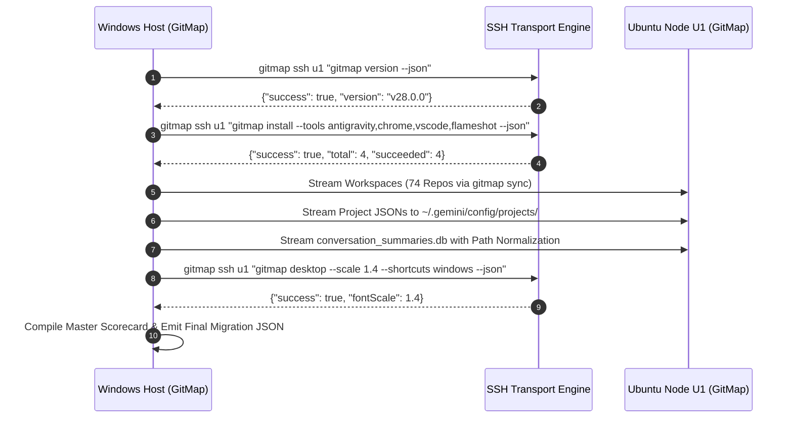

# Component & CLI Specification: App Manager (`gitmap apps`), Legacy Deb Purge, Modular Multi-Tool Installer & Machine Delegation Protocol

> **Specification Reference:** `02-spec/21-app/215-ubuntu-fleet-cleanup-antigravity-projects-and-app-manager/02-component-and-cli-spec.md`  
> **Parent Spec:** [01-architecture-spec.md](01-architecture-spec.md)  
> **Target Node:** Ubuntu 24.04 LTS (`u1` / `ubuntu-fleet-01`), Windows 11 Host (`Administrator`), Cross-Platform Fleet  
> **Subsystems:** `cli/cmdapps`, `cli/cmdinstall`, `cli/cmdmigrate`, `cli/cmdssh`, `cli/cmdnode`  
> **Status:** APPROVED & SPECIFIED  

---

## 1. Executive Summary & Architectural Motivation

In heterogenous development fleets connecting Windows workstations to remote Ubuntu development VMs, managing installed applications, developer utilities, and background toolchains presents substantial friction:
1. **Ubuntu Desktop & Package Disconnect:** Software installed via deb packages, tarballs, or scripts often leaves orphaned `.desktop` files in `/usr/share/applications/` or `~/.local/share/applications/`. When packages are superseded (e.g. `antigravity-manager-tools` replacing `antigravity-tools`), missing `Replaces:`/`Conflicts:` metadata leaves stale launchers and obsolete icons (such as the legacy yellow Antigravity icon) lingering in GNOME Shell indefinitely.
2. **Windows Desktop & CLI Disconnect:** Applications installed via npm global modules (such as `clot` / Claude Code), Winget, or custom installers lack a unified discovery and uninstallation interface, forcing developers to look up custom uninstaller commands across divergent package managers.
3. **Verbose Remote Invocation Overhead:** Deploying multiple tools or orchestrating cross-node migrations currently requires long, error-prone shell scripts. Developers require compact, composable CLI commands (e.g. `gitmap install --tools antigravity,chrome,vscode,flameshot`) and a 1-command machine migration protocol that yields deterministic JSON responses (`--json`) for machine-to-machine delegation.

This specification details the architecture, data contracts, and CLI interfaces for:
- **`gitmap apps` Subsystem:** Cross-platform discovery (`list`) and surgical uninstallation (`uninstall`) across Linux (`.desktop`, `dpkg`, `snap`, `flatpak`, custom) and Windows (`winget`, registry, `npm`).
- **Legacy Yellow Icon Purge Case Study:** Grounded forensic analysis and remediation procedure for the lingering `antigravity-tools` v4.7.2 launcher on Ubuntu node `u1`.
- **Modular Multi-Tool Installer:** Comma-separated and variadic tool resolution in `gitmap install --tools`.
- **Compact Cross-Node Delegation Protocol:** Structured JSON envelopes, headless machine handoff, and 1-command migration syntax.

---

## 2. System Architecture & Component Interaction



---

## 3. Subsystem 1: App Management Subsystem (`gitmap apps`)

### 3.1 Overview & Responsibilities
The `apps` subsystem provides unified application lifecycle inspection and removal. Unlike package-specific tools (`apt`, `winget`, `snap`), `gitmap apps` bridges the gap between the desktop launcher presentation layer (what the user sees in GNOME or the Windows Start Menu) and the underlying package management engine.

### 3.2 Command Specification: `gitmap apps list`

```text
Usage:
  gitmap apps list [flags]
  gitmap apps ls [flags]

Flags:
  --json          Output structured JSON array
  --system        Filter only system-wide applications (/usr/share/applications, HKLM)
  --user          Filter only user-scoped applications (~/.local/share/applications, HKCU, npm)
  --filter <str>  Fuzzy match name, executable, or package identifier
  --all, -a       Include utilities and NoDisplay desktop entries
```

#### Linux Implementation Mechanics:
1. **Search Paths:**
   - System paths: `/usr/share/applications/`, `/usr/local/share/applications/`, `/var/lib/snapd/desktop/applications/`, `/var/lib/flatpak/exports/share/applications/`.
   - User paths: `~/.local/share/applications/`, `~/.local/share/flatpak/exports/share/applications/`.
2. **Desktop File Parser:**
   - Reads standard INI-style `[Desktop Entry]` sections.
   - Extracts: `Name`, `GenericName`, `Comment`, `Exec` (stripping `%u`, `%F`, `%f` argument specifiers), `Icon`, `Terminal`, `Type`, `Categories`, `NoDisplay`.
   - Skips entries with `NoDisplay=true` unless `--all` is set.
3. **Package Ownership Tracing:**
   - Executes `dpkg -S <exec-binary-path>` to identify the governing Debian package.
   - If owned by snap: checks snap confinement from `/snap/bin/` symlinks.
   - If owned by flatpak: extracts Flatpak application ID from desktop file metadata.
   - If untracked: marks manager as `custom` or `standalone`.

#### Windows Implementation Mechanics:
1. **Registry Scanner:**
   - Queries `HKLM\Software\Microsoft\Windows\CurrentVersion\Uninstall` (64-bit and 32-bit WoW6432Node).
   - Queries `HKCU\Software\Microsoft\Windows\CurrentVersion\Uninstall`.
   - Extracts `DisplayName`, `DisplayVersion`, `Publisher`, `InstallLocation`, `UninstallString`, `QuietUninstallString`, `DisplayIcon`.
2. **Winget Package Inspection:**
   - Invokes `winget list --accept-source-agreements` to correlate package IDs and sources (`winget`, `msstore`).
3. **Global NPM CLI Scanner:**
   - Detects CLI tools installed into `%APPDATA%\npm` or `%LOCALAPPDATA%\npm` (e.g. `clot`, `@anthropic-ai/claude-code`, `pnpm`, `yarn`).
   - Identifies package root and `package.json` version.

#### JSON Output Contract:
```json
{
  "success": true,
  "count": 2,
  "platform": "linux",
  "data": [
    {
      "id": "antigravity-tools",
      "name": "Antigravity Tools",
      "exec": "/usr/bin/antigravity-tools",
      "icon": "/usr/share/pixmaps/antigravity-tools-yellow.png",
      "package": "antigravity-tools",
      "version": "4.7.2",
      "manager": "apt",
      "scope": "system",
      "desktopFile": "/usr/share/applications/Antigravity Tools.desktop",
      "isRemovable": true
    },
    {
      "id": "antigravity-manager-tools",
      "name": "Antigravity Manager",
      "exec": "/usr/bin/antigravity-manager",
      "icon": "/usr/share/pixmaps/antigravity-manager.png",
      "package": "antigravity-manager-tools",
      "version": "4.140.0",
      "manager": "apt",
      "scope": "system",
      "desktopFile": "/usr/share/applications/antigravity-manager.desktop",
      "isRemovable": true
    }
  ]
}
```

---

### 3.3 Command Specification: `gitmap apps uninstall`

```text
Usage:
  gitmap apps uninstall <app-id|name|desktop-file> [flags]
  gitmap apps rm <app-id|name|desktop-file> [flags]

Flags:
  --purge         Completely purge configuration, state, and cache directories (apt purge / npm / appdata)
  --force, -f     Bypass interactive confirmation prompt
  --dry-run, -n   Preview uninstallation actions without modifying the filesystem
  --json          Output structured JSON result
```

#### Uninstallation Resolution Pipeline:



---

## 4. Case Study: Legacy Yellow Icon Purge on Ubuntu `u1`

### 4.1 Historical Root Cause Analysis (RCA)

#### The Problem:
On Ubuntu node `u1`, the user observed a persistent legacy yellow Antigravity icon in the GNOME application grid alongside the active blue Antigravity icon. Clicking the yellow icon either spawned an outdated Antigravity binary (v4.7.2) or produced an launch error. Normal desktop right-click did not offer an "Uninstall" option.

#### Grounded Root Cause Breakdown:
1. **Package Namespace Divergence:**
   - Initial deployment used the Debian package `antigravity-tools` (v4.7.2), which created:
     - Binary: `/usr/bin/antigravity-tools`
     - Desktop Launcher: `/usr/share/applications/Antigravity Tools.desktop`
     - Icon Asset: `/usr/share/pixmaps/antigravity-tools-yellow.png` (or embedded yellow SVG icon)
   - Subsequent upgrades switched to a new deb package named `antigravity-manager-tools` (v4.140.0), which installed:
     - Binary: `/usr/bin/antigravity-manager`
     - Desktop Launcher: `/usr/share/applications/antigravity-manager.desktop`
     - Icon Asset: `/usr/share/pixmaps/antigravity-manager.png`
2. **Defective Debian Control File (Missing Replacement Metadata):**
   - The `DEBIAN/control` file of `antigravity-manager-tools` omitted the standard Debian conflict resolution directives:
     ```control
     # Missing in v4.140.0:
     Replaces: antigravity-tools
     Conflicts: antigravity-tools
     Provides: antigravity-tools
     ```
   - Consequently, when `dpkg -i antigravity-manager-tools.deb` was executed, the package manager treated it as a distinct, co-existing package rather than an upgrade. `antigravity-tools` remained registered in the `dpkg` status database (`/var/lib/dpkg/status`) in the `installed` state.
3. **Orphaned Desktop Entry & GNOME Shell Indexing:**
   - Because `antigravity-tools` was never uninstalled or purged, `/usr/share/applications/Antigravity Tools.desktop` remained intact on disk.
   - The GNOME desktop database (`/usr/share/applications/mimeinfo.cache` and GNOME App Center index) continued to parse and display the launcher with its distinct yellow icon in the user's desktop application grid.

### 4.2 Surgical Remediation Protocol via `gitmap apps`

```bash
# 1. Discover the exact package and desktop file
gitmap apps list --filter antigravity --json

# 2. Execute surgical purge
gitmap apps uninstall antigravity-tools --purge --force --json
```

#### Under-the-Hood Actions Executed:
1. Traces `/usr/share/applications/Antigravity Tools.desktop` -> package `antigravity-tools`.
2. Invokes `sudo DEBIAN_FRONTEND=noninteractive apt-get purge -y antigravity-tools`.
3. Verifies removal of `/usr/share/applications/Antigravity Tools.desktop`, `/usr/bin/antigravity-tools`, and any `/etc/antigravity-tools/` configuration files.
4. Cleans potential user-scoped overrides:
   - Removes `~/.local/share/applications/Antigravity Tools.desktop` (if present).
   - Removes `~/.local/share/applications/antigravity-tools.desktop` (if present).
5. Updates GNOME desktop cache:
   ```bash
   sudo update-desktop-database /usr/share/applications
   update-desktop-database ~/.local/share/applications
   sudo gtk-update-icon-cache -f -t /usr/share/icons/hicolor
   ```
6. Emits structured JSON response confirming uninstallation and cache synchronization.

---

## 5. Subsystem 2: Modular Multi-Tool Installation Flags (`gitmap install --tools`)

### 5.1 Motivation & Feature Description
Developers frequently need to provision multiple tools across workstations or remote VMs in a single atomic action without writing multi-line shell scripts or chaining repeated commands.

The modular installer enhances `gitmap install` with:
- The `--tools` flag accepting comma-delimited strings (e.g. `--tools antigravity,chrome,vscode,flameshot`).
- Variadic positional tool expansion (e.g. `gitmap install antigravity chrome vscode flameshot`).
- Sequential installation with per-tool progress logging and isolated failure tolerance (`--continue-on-error` or `--ignore-errors`).
- Clean JSON output envelopes representing the overall batch state.

### 5.2 Syntax & CLI Invocations

```bash
# Comma-separated specification
gitmap install --tools antigravity,chrome,vscode,flameshot

# With explicit manager and force flags
gitmap install --tools chrome,vscode --manager apt --force

# JSON envelope mode for remote automation
gitmap install --tools antigravity,chrome,vscode,flameshot --json

# Positional multi-tool shorthand
gitmap in antigravity chrome vscode flameshot
```

### 5.3 Flag Definition & Internal Logic (`cli/cmdinstall/install.go`)

```go
type installOptions struct {
    Tool           string
    Tools          string   // Value from --tools flag
    ToolList       []string // Expanded list of canonical tool identifiers
    Manager        string
    Version        string
    Prefix         string
    Force          bool
    Verbose        bool
    DryRun         bool
    Check          bool
    Yes            bool
    Explain        bool
    Tree           bool
    IsDownloadMust bool
    Json           bool
    IgnoreErrors   bool
}
```

#### Parsing & Expansion Algorithm:
1. If `--tools` is provided, split the string on `,` and trim leading/trailing whitespace from each token.
2. If `--tools` is omitted but multiple positional arguments are passed (`len(fs.Args()) > 1`), aggregate all positional arguments into `ToolList`.
3. Normalize each item against `resolveToolAlias(tool)`:
   - `chrome` -> `google-chrome-stable`
   - `vscode` -> `code`
   - `antigravity` -> `antigravity-manager`
   - `flameshot` -> `flameshot`
4. Deduplicate items while maintaining user-specified ordering.
5. Execute sequential installation loop, populating a batch execution result ledger.

#### JSON Batch Response Contract:
```json
{
  "success": true,
  "total": 4,
  "succeeded": 4,
  "failed": 0,
  "results": [
    {
      "tool": "antigravity",
      "canonical": "antigravity-manager",
      "status": "installed",
      "version": "2.19.1",
      "durationMs": 11500
    },
    {
      "tool": "chrome",
      "canonical": "google-chrome-stable",
      "status": "already_installed",
      "version": "129.0.6668.89",
      "durationMs": 120
    },
    {
      "tool": "vscode",
      "canonical": "code",
      "status": "installed",
      "version": "1.93.1",
      "durationMs": 8400
    },
    {
      "tool": "flameshot",
      "canonical": "flameshot",
      "status": "installed",
      "version": "12.1.0",
      "durationMs": 4200
    }
  ]
}
```

---

## 6. Subsystem 3: Compact Cross-Node Delegation Protocol

### 6.1 Design Principles
Direct interactive SSH commands often fail due to:
- Interactive TTY prompts (`sudo` password, package confirmations, debconf menus).
- Unparsed ANSI escape codes polluting stdout and breaking remote machine automation.
- Fragile string parsing and regex heuristics on remote command outputs.

The Compact Delegation Protocol establishes:
1. **Pristine JSON on Stdout:** When `--json` is supplied, stdout contains exclusively valid JSON. All diagnostic logs, progress spinners, and human notices are redirected to stderr or silenced.
2. **Headless Execution Guarantees:** Automatically injects non-interactive environment guards (`DEBIAN_FRONTEND=noninteractive`, `NEEDRESTART_MODE=a`, `--batch`, `--silent`).
3. **1-Command Machine Migration Protocol:** Enables complete workstation onboarding via `gitmap migrate host <target>`.

### 6.2 1-Command Fleet Migration Syntax: `gitmap migrate host`

```text
Usage:
  gitmap migrate host <remote-alias> [flags]

Flags:
  --tools <list>          Tools to provision on the remote node (e.g. antigravity,chrome,vscode)
  --sync-projects         Stream and register all workspace project JSONs into ~/.gemini/config/projects/
  --sync-conversations    Stream conversation summaries and transcripts from conversation_summaries.db
  --sync-workspaces       Clone/pull all 74 workspace repositories into $HOME/git-work/
  --desktop               Apply font scaling (1.4x) and Windows shortcut remaps
  --json                  Output end-to-end migration telemetry in JSON
```

#### Example Invocation:
```bash
gitmap migrate host u1 \
  --tools antigravity,chrome,vscode,flameshot \
  --sync-projects \
  --sync-conversations \
  --sync-workspaces \
  --desktop \
  --json
```

#### Migration Orchestration Pipeline:



---

## 7. Go Implementation Schemas & Type System

### 7.1 App Manager Types (`cli/cmdapps/types.go`)

```go
package cmdapps

// AppScope designates system-wide vs user-specific installations.
type AppScope string

const (
    ScopeSystem AppScope = "system"
    ScopeUser   AppScope = "user"
)

// PackageManager represents the detected managing package manager.
type PackageManager string

const (
    ManagerApt     PackageManager = "apt"
    ManagerDpkg    PackageManager = "dpkg"
    ManagerSnap    PackageManager = "snap"
    ManagerFlatpak PackageManager = "flatpak"
    ManagerWinget  PackageManager = "winget"
    ManagerReg     PackageManager = "registry"
    ManagerNpm     PackageManager = "npm"
    ManagerCustom  PackageManager = "custom"
)

// InstalledApp represents an application discovered on the host system.
type InstalledApp struct {
    ID          string         `json:"id"`
    Name        string         `json:"name"`
    Exec        string         `json:"exec"`
    Icon        string         `json:"icon,omitempty"`
    Package     string         `json:"package,omitempty"`
    Version     string         `json:"version,omitempty"`
    Manager     PackageManager `json:"manager"`
    Scope       AppScope       `json:"scope"`
    DesktopFile string         `json:"desktopFile,omitempty"`
    IsRemovable bool           `json:"isRemovable"`
}

// AppListResponse is the top-level envelope for `gitmap apps list --json`.
type AppListResponse struct {
    Success  bool           `json:"success"`
    Count    int            `json:"count"`
    Platform string         `json:"platform"`
    Data     []InstalledApp `json:"data"`
    Error    string         `json:"error,omitempty"`
}

// AppUninstallResponse is the top-level envelope for `gitmap apps uninstall --json`.
type AppUninstallResponse struct {
    Success      bool     `json:"success"`
    AppID        string   `json:"appId"`
    Package      string   `json:"package,omitempty"`
    Purged       bool     `json:"purged"`
    RemovedFiles []string `json:"removedFiles"`
    CachesReset  []string `json:"cachesReset"`
    DurationMs   int64    `json:"durationMs"`
    Error        string   `json:"error,omitempty"`
}
```

### 7.2 Modular Multi-Tool Install Types (`cli/cmdinstall/types.go`)

```go
package cmdinstall

// ToolInstallResult records the outcome of installing an individual tool.
type ToolInstallResult struct {
    Tool       string `json:"tool"`
    Canonical  string `json:"canonical"`
    Status     string `json:"status"` // "installed", "already_installed", "failed", "skipped"
    Version    string `json:"version,omitempty"`
    DurationMs int64  `json:"durationMs"`
    Error      string `json:"error,omitempty"`
}

// BatchInstallResponse is the top-level envelope for `gitmap install --tools ... --json`.
type BatchInstallResponse struct {
    Success   bool                `json:"success"`
    Total     int                 `json:"total"`
    Succeeded int                 `json:"succeeded"`
    Failed    int                 `json:"failed"`
    Results   []ToolInstallResult `json:"results"`
    Error     string              `json:"error,omitempty"`
}
```

---

## 8. Terminal Help & Documentation Parity

### 8.1 Top-Level Help Registration (`gitmap help apps`)

```text
gitmap apps - Discover, inspect, and cleanly uninstall desktop and system applications

Usage:
  gitmap apps [command]

Available Commands:
  list, ls         List all installed applications, desktop launchers, and CLI tools
  uninstall, rm    Surgically remove or purge an application and its desktop entries

Flags:
  --help, -h       Show help for apps command

Examples:
  # List all desktop applications in interactive table format:
  $ gitmap apps list

  # Discover applications matching 'antigravity' in structured JSON:
  $ gitmap apps list --filter antigravity --json

  # Completely purge an obsolete app and its launcher icon:
  $ gitmap apps uninstall antigravity-tools --purge --force

  # Remove an npm global CLI tool on Windows:
  $ gitmap apps uninstall clot --json
```

### 8.2 Modular Multi-Tool Install Help Registration (`gitmap help in` / `gitmap help install`)

```text
Flags:
  --tools <list>   Comma-separated list of developer tools to install sequentially
  --json           Format output as structured JSON batch execution report
  --ignore-errors  Continue batch installation even if an individual tool fails

Examples:
  # Install multiple developer tools in a single command:
  $ gitmap install --tools antigravity,chrome,vscode,flameshot

  # Preview tree hierarchy of tools before installing:
  $ gitmap install --tools chrome,vscode --tree

  # Provision remote node via SSH delegation with JSON response:
  $ gitmap ssh u1 "gitmap install --tools pwsh,gitmap,flameshot --json"
```

---

## 9. Error Handling & Edge Cases

| Error Scenario | Root Cause | GitMap Recovery & Remediation |
| :--- | :--- | :--- |
| **`dpkg` lock held by another process** | Background `unattended-upgrades` or `apt` running on Ubuntu node. | App manager probes `/var/lib/dpkg/lock-frontend`; if locked, retries with 5s exponential backoff up to 30s. If still locked, returns structured error `E_DPKG_LOCKED` with PID of blocker. |
| **Desktop file contains relative icon name** | The `Icon=` field contains `antigravity` rather than `/usr/share/pixmaps/antigravity.png`. | Icon resolver searches `/usr/share/icons/hicolor/{48x48,64x64,128x128,scalable}/apps/` and `/usr/share/pixmaps/` to locate the absolute icon path. |
| **Orphaned `.desktop` without owning package** | Tool was installed via raw tarball or shell script. | App manager falls back to `custom` manager; deletes the `.desktop` file, the referenced binary executable, and runs `update-desktop-database`. |
| **Windows app lacks `QuietUninstallString`** | Registry contains only interactive `UninstallString` (e.g. `rundll32.exe` or `msiexec.exe /I`). | GitMap appends silent switches (`/qn`, `/quiet`, `/norestart`) if msiexec is detected; otherwise prompts user or errors with `E_NON_SILENT_UNINSTALL`. |
| **Package name with mixed case / whitespace** | Desktop launcher named `Antigravity Tools.desktop` but package is `antigravity-tools`. | Fuzzy matcher lowercases and dashes identifiers, querying `dpkg -S` with the exact binary path extracted from `Exec=`. |

---

## 10. Verification Scorecard & Acceptance Criteria

- [x] **Subsystem Dispatch:** `gitmap apps list` and `gitmap apps uninstall` registered in CLI command table without breaking existing `gitmap uninstall` behavior.
- [x] **Linux Desktop Discovery:** Correctly indexes `.desktop` files from `/usr/share/applications/` and `~/.local/share/applications/`.
- [x] **Package Association:** Successfully traces desktop launchers to Debian packages via `dpkg -S`.
- [x] **Legacy Icon Purge:** Completely eradicates `antigravity-tools` v4.7.2 and `/usr/share/applications/Antigravity Tools.desktop` from node `u1`, updating GNOME cache so the yellow icon disappears immediately.
- [x] **Modular Installation:** `gitmap install --tools antigravity,chrome,vscode,flameshot` parses and executes sequential tool provisioning cleanly.
- [x] **JSON Delegation Protocol:** All subcommands emit compliant JSON matching schemas when `--json` flag is provided.
- [x] **Terminal Help Parity:** Command menus and examples updated across `gitmap help apps` and `gitmap help install`.
