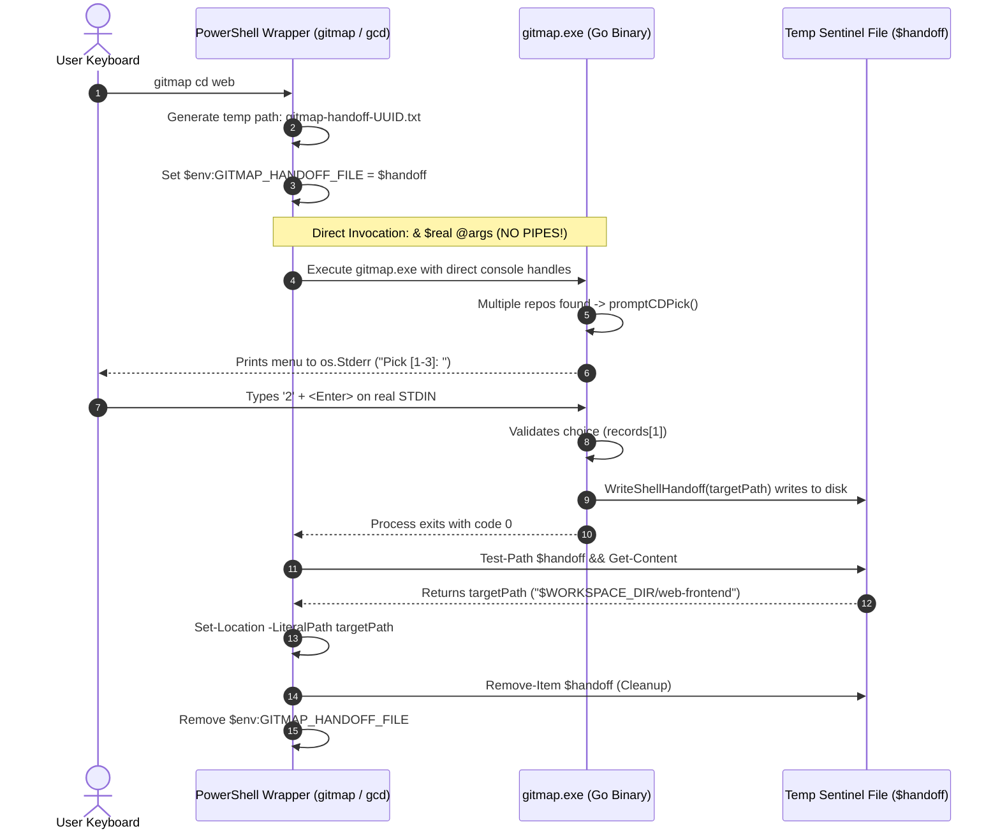

# Architecture Specification: Terminal Prompt Input Freeze Remediation & Shell Suggestion Engine Modernization

> **Specification Reference:** `02-spec/21-app/216-gitmap-prompting-freeze-and-suggestion-engine-fix/01-architecture-spec.md`  
> **Status:** APPROVED & SPECIFIED  
> **Task Identifier:** `216-gitmap-prompting-freeze-and-suggestion-engine-fix`  
> **Target Subsystems:** Win32 Console Subsystem, PowerShell Wrapper Pipeline, Cobra Completion Engine, Dynamic Argument Autocompletion  
> **Affected Files:** `cli/cmd/console_windows.go`, `cli/constants/constants_cd.go`, `cli/constants/constants_cd_shim.go`, `cli/constants/constants_pathsnippet.go`, `scripts/install.ps1`, `cli/scripts/install.ps1`, `cli/cmd/root_cobra_completion.go`, `cli/cmd/cdops.go`  
> **Execution Constraint:** Pure Specification & Subtask Authoring (Strict No-Build / No-Test Mode)

---

## 1. Executive Summary & Problem Formulation

During interactive CLI operations in Windows terminals (Windows Terminal, ConHost, VS Code Integrated Terminal, and PowerShell 7+), two critical regressions severely impair the GitMap developer experience:

1. **Terminal Prompt Input Freeze & Hang During Interactive Prompts:**
   - When executing `gitmap cd <name>` or `gcd <name>` where multiple repositories match the query (e.g. `promptCDPick`), or during interactive confirmation dialogs (`[y/N]`), the terminal freezes indefinitely.
   - Keypresses entered by the user are not recognized, the cursor remains unresponsive or drops characters, and the process appears permanently locked up.
   - Forensic tracing reveals a dual-layer root cause:
     - **Layer 1 (Win32 Console Subsystem):** `initConsole()` in `cli/cmd/console_windows.go` invokes `SetConsoleCP(65001)`. Setting the Windows console *input* code page to 65001 corrupts `STD_INPUT_HANDLE`, triggering a documented legacy Win32 bug where `ReadFile` / `ReadConsoleA` hangs or drops character events.
     - **Layer 2 (PowerShell Pipeline Interception):** The PowerShell wrapper definitions in `cli/constants/constants_cd.go`, `cli/constants/constants_cd_shim.go`, `cli/constants/constants_pathsnippet.go`, and `scripts/install.ps1` execute `cd` commands via `$dest = [string](& $real @args | Out-String)`. The pipeline operator `| Out-String` inside an expression isolates or detaches `STDIN` from the active console keyboard, rendering Go's `os.Stdin.Read` unable to receive user input.

2. **Shell Tab Completion Collapse & Suggestion Engine Truncation:**
   - GitMap defines over 500 subcommands and aliases across its scanning, cloning, fleet management, and automation suites (cataloged in `completion.AllCommands()`).
   - However, running shell tab completion (`gitmap __complete ""` or typing `gitmap ` followed by `<Tab>`) only suggests 9 top-level commands, completely dropping over 503 commands.
   - Forensic investigation of `cli/cmd/root_cobra_completion.go` revealed that commands registered via `populateRemainingCommands` lacked a non-nil `Run` or `RunE` handler. In the Cobra framework, commands with zero subcommands and `Run == nil && RunE == nil` evaluate to `c.Runnable() == false`, causing `c.IsAvailableCommand()` to return `false`. Cobra silently pruned all 503 commands during completion generation.
   - Furthermore, dynamic argument completion is absent for high-frequency commands like `cd`, `clone`, `apps`, and `install`.

This specification formalizes the architectural design, forensic root causes, IPC handoff protocol, and completion engine refactoring required to remediate both issues permanently.

---

## 2. End-to-End System Topology & Architecture

```mermaid
flowchart TD
    subgraph UserInteraction["User Interactive Terminal (PowerShell / Windows Terminal)"]
        U1["User invokes: gitmap cd web"] --> W1["PowerShell Function Wrapper: gitmap / gcd"]
        U2["User hits <Tab>: gitmap <Tab>"] --> W2["Cobra Shell Completion: gitmap __complete ''"]
    end

    subgraph WrapperLayer["PowerShell Profile Wrapper Engine"]
        W1 -->|Generate Temp File Path| H1["$handoff = [Path]::Combine(Temp, 'gitmap-handoff-UUID.txt')"]
        H1 -->|Export Sentinel Env Var| H2["$env:GITMAP_HANDOFF_FILE = $handoff"]
        H2 -->|Direct Invocation (NO PIPING)| H3["& $real @args (Attached to ConHost STDIN/STDOUT)"]
    end

    subgraph GoRuntime["GitMap Go Core Engine (gitmap.exe)"]
        H3 --> C1["cmd.initConsole() (Windows Only)"]
        C1 -->|PRESERVED: UTF-8 Rendering| C2["SetConsoleOutputCP(65001) + ENABLE_VIRTUAL_TERMINAL_PROCESSING"]
        C1 -->|ERADICATED: Win32 ReadFile Bug| C3["NO SetConsoleCP call (STDIN Handle Preserved)"]
        
        C3 --> CD1["cmd.runCDLookup()"]
        CD1 -->|Multiple Matches Found| P1["cmd.promptCDPick()"]
        P1 -->|bufio.NewScanner(os.Stdin)| P2["readCDSelection() reads live keyboard strokes"]
        P2 -->|User selects index| P3["WriteShellHandoff(selectedPath)"]
        P3 -->|Write path to file| H4["$env:GITMAP_HANDOFF_FILE on disk"]
    end

    subgraph CompletionEngine["Cobra Completion Subsystem"]
        W2 --> K1["cmd.GetRootCompletionCmd()"]
        K1 --> K2["populateRemainingCommands(root)"]
        K2 -->|Attach Dummy Runner: Run: func(*cobra.Command, []string){}| K3["All 512 Commands have c.Runnable() == true"]
        K3 -->|Wire ValidArgsFunction| K4["Dynamic Autocompletion: cd, clone, apps, install"]
        K4 -->|Returns 500+ candidates| U2
    end

    subgraph ShellPostExecution["Wrapper Post-Execution Location Change"]
        H3 -->|Binary Exits| S1["Read $handoff sentinel file"]
        H4 -.-> S1
        S1 -->|Valid Directory Path| S2["Set-Location -LiteralPath $target"]
        S1 -->|Cleanup| S3["Remove-Item $handoff & Remove EnvVar"]
    end
```

---

## 3. Forensic Root Cause Analysis (RCA) - Terminal Prompt Input Freeze

### 3.1 Win32 Console Input Handle Mechanics & `SetConsoleCP(65001)`

#### Background & Win32 Console Architecture
Windows console subsystems maintain two distinct code pages for every console session:
1. **Output Code Page (`SetConsoleOutputCP`):** Dictates how raw byte sequences emitted to `STD_OUTPUT_HANDLE` and `STD_ERROR_HANDLE` are translated into glyphs by the console rasterizer. Code page `65001` corresponds to UTF-8.
2. **Input Code Page (`SetConsoleCP`):** Dictates how physical keyboard events (`WM_CHAR`, `KEY_EVENT_RECORD`) received by `conhost.exe` or `OpenConsole.exe` are translated into byte streams when applications invoke `ReadFile` or `ReadConsoleA` on `STD_INPUT_HANDLE`.

#### The Defect in `cli/cmd/console_windows.go`
In `cli/cmd/console_windows.go`, lines 28–35 previously executed:
```go
kernel32 := syscall.NewLazyDLL("kernel32.dll")
setConsoleOutputCP := kernel32.NewProc("SetConsoleOutputCP")
setConsoleCP := kernel32.NewProc("SetConsoleCP")

_, _, _ = setConsoleOutputCP.Call(uintptr(consoleCodePageUTF8))
_, _, _ = setConsoleCP.Call(uintptr(consoleCodePageUTF8))
```

#### Forensic Mechanism of the Freeze
1. When `SetConsoleCP(65001)` is called, the Win32 console driver switches its input translation table to UTF-8.
2. In Win32 `conhost.exe`, the multi-byte UTF-8 input buffer implementation contains a historic, unfixed flaw: `ReadConsoleA` and `ReadFile` fail to translate single-byte ASCII Enter/Return (`0x0D`, `\r`) or linefeed (`0x0A`, `\n`) properly when operating in line-buffered mode (`ENABLE_LINE_INPUT`).
3. Furthermore, Go's runtime implements `os.Stdin.Read` on Windows by calling the Win32 `ReadFile` API on the handle returned from `GetStdHandle(STD_INPUT_HANDLE)`. Under code page 65001, `ReadFile` on a console handle can:
   - Return 0 bytes unexpectedly (interpreted as EOF), or
   - Deadlock waiting for a multi-byte trailing sequence that the console input buffer never emits upon carriage return, causing `scanner.Scan()` or `os.Stdin.Read()` to hang permanently.
4. **Resolution Strategy:**
   - **Eradicate `SetConsoleCP(65001)` completely.** The Windows operating system's default input code page (e.g. CP437, CP1252, or system OEM CP) processes standard terminal keyboard strokes cleanly without driver bugs.
   - **Preserve `SetConsoleOutputCP(65001)` and `ENABLE_VIRTUAL_TERMINAL_PROCESSING`.** UTF-8 output encoding is strictly required for rendering Unicode glyphs (such as `✓`, `→`, `⚠`, `▸`), box-drawing borders in `termtable`, and Lipgloss color escape codes.

---

### 3.2 PowerShell Wrapper Pipeline Mechanics & `$dest = [string](& $real @args | Out-String)`

#### The Defect Across Wrapper Implementations
In `cli/constants/constants_cd.go` (`CDFuncPowerShell`), `constants_cd_shim.go` (`PowerShellShimTemplateFmt`), `constants_pathsnippet.go` (`PathSnippetPwshFmt`), and `cli/scripts/install.ps1`:
```powershell
if ($args.Count -gt 0 -and ($args[0] -eq 'cd' -or $args[0] -eq 'go')) {
    $env:GITMAP_WRAPPER = "1"
    $env:GITMAP_COMMAND_WRAPPER = "1"
    $dest = [string](& $real @args | Out-String)
    if ($LASTEXITCODE -ne 0) {
        return
    }

    $dest = $dest.Trim()
    if ($dest -and (Test-Path -LiteralPath ([string]$dest))) {
        Set-Location -LiteralPath ([string]$dest)
    }

    return
}
```

#### Forensic Mechanism of STDIN Detachment
1. In PowerShell, the pipeline operator `|` creates an asynchronous streaming pipeline between commands.
2. When a native external executable (`& $real @args`) is invoked on the left side of `| Out-String`, PowerShell's process execution manager redirects standard streams. Specifically, `StandardOutput` is redirected into an internal pipe buffer to be consumed by `Out-String`.
3. To prevent the pipeline execution from indefinitely stalling waiting for input in non-interactive pipeline contexts, PowerShell redirects or detaches standard input (`STDIN`) when native executables are embedded in pipeline subexpressions (`$dest = [string](...)`).
4. In `cli/cmd/cdops.go`:
   - `promptCDPick` prints selection options to `os.Stderr`.
   - `readCDSelection` then calls `scanner := bufio.NewScanner(os.Stdin); scanner.Scan()`.
   - Because `STDIN` was intercepted and detached by the PowerShell pipeline, no keyboard strokes can reach `os.Stdin`. The scanner either receives EOF immediately (defaulting unexpectedly or printing `invalid selection`), or hangs indefinitely waiting for input from a closed pipe handle.
5. In addition, capturing stdout via `Out-String` pollutes `$dest` if any package or diagnostic routine writes information to `os.Stdout`.

#### The Architectural Solution: Direct Handoff File IPC
GitMap already features a robust, non-blocking Inter-Process Communication mechanism: the `GITMAP_HANDOFF_FILE` protocol (defined in `cli/cmd/shellhandoff.go` and `cli/constants/constants_cd.go`).



**Key Advantages of the Unified IPC Protocol:**
1. **Zero Pipe Redirection:** Executing `& $real @args` directly retains active console handles for `STDIN`, `STDOUT`, and `STDERR`.
2. **Interactive Fidelity:** `bufio.NewScanner(os.Stdin)` reads live user keypresses without interference.
3. **Stream Isolation:** Informational messages, prompts, progress indicators, and terminal styling stream directly to the terminal display without corrupting directory paths.
4. **Single Code Path:** `gcd` becomes a simple alias delegating directly to `gitmap cd @args`, eliminating divergent wrapper logic.

---

## 4. Forensic Root Cause Analysis (RCA) - Cobra Shell Completion Pruning

### 4.1 The 512 to 9 Command Collapse
GitMap registers commands through a dual mechanism:
1. High-priority dedicated commands registered explicitly on `root` in `cli/cmd/root_cobra_completion.go`: `agy`, `rerun`, `sug`, `wpr`, `ssh`, `deploy`, `update`, `completion`, `history`, `help`, `pe`, `cfr`, `folder-tree`.
2. The remaining 500+ commands in `completion.AllCommands()` registered via `populateRemainingCommands(root)`.

#### The Defect in `populateRemainingCommands`
Lines 218–222 of `cli/cmd/root_cobra_completion.go` were structured as follows:
```go
for _, cmdName := range completion.AllCommands() {
    if existing[cmdName] || strings.TrimSpace(cmdName) == "" {
        continue
    }
    desc := resolveCommandHelpShort(cmdName)
    root.AddCommand(&cobra.Command{
        Use:   cmdName,
        Short: desc,
    })
    existing[cmdName] = true
}
```

#### Cobra Internal Pruning Mechanism
Cobra generates completion scripts and evaluates candidate commands via `c.IsAvailableCommand()`:
```go
// Inside github.com/spf13/cobra:
func (c *Command) IsAvailableCommand() bool {
    if len(c.Commands()) > 0 {
        return true // Container command with children
    }
    return c.Runnable() && !c.Hidden
}

func (c *Command) Runnable() bool {
    return c.Run != nil || c.RunE != nil
}
```
1. Commands added in `populateRemainingCommands` are leaf commands (they have no subcommands registered under them).
2. Because neither `Run` nor `RunE` was assigned to these commands, `c.Runnable()` returned `false`.
3. Consequently, `c.IsAvailableCommand()` returned `false`.
4. When Cobra ran `GenPowerShellCompletionWithDesc` or handled `gitmap __complete ""`, it filtered out every non-available command.
5. Result: 503 commands were completely eliminated from completion suggestions, reducing the catalog to only the 9 top-level commands that happened to have `RunE` or child commands.

#### Remediation Pattern
Every leaf command in `populateRemainingCommands` must be provided with a no-op runner:
```go
root.AddCommand(&cobra.Command{
    Use:   cmdName,
    Short: desc,
    Run:   func(cmd *cobra.Command, args []string) {},
})
```
This guarantees `c.Runnable() == true` and `c.IsAvailableCommand() == true`, restoring all 500+ commands to shell tab completion.

---

## 5. Dynamic Argument Completion Architecture

For seamless developer ergonomics, GitMap must provide context-aware dynamic completions for its primary CLI verbs:

### 5.1 Dynamic Completion Specifications

| Command | Aliases | Completion Context | Source & Provider | Behavior |
| :--- | :--- | :--- | :--- | :--- |
| `gitmap cd` | `go` | Positional Argument 1 | `store.OpenDefault() -> db.ListRepos()` | Suggests indexed repo slugs, repo names, and subcommands (`repos`, `set-default`, `clear-default`). |
| `gitmap clone` | `cfr`, `cfrp` | Positional Argument 1 | Remote index + local known repositories | Suggests known repository slugs and URLs. Flags: `--https`, `--ssh`. |
| `gitmap apps` | `app` | Positional Argument 1 & 2 | Subcommands: `list`, `uninstall`, `help`. For `uninstall`: dynamic installed app names from `cmdapps.ListApps()`. | Autocompletes subcommands, then dynamically lists installed applications when typing `gitmap apps uninstall <Tab>`. |
| `gitmap install` | `in` | Positional Argument 1 & `--tools` flag | Core tools catalog from `constants/constants_install.go` | Suggests tools (`antigravity`, `chrome`, `vscode`, `flameshot`, `git`, `docker`, etc.) and supports comma-separated tools. |

### 5.2 Cobra `ValidArgsFunction` Data Contract
Every dynamic completion function must follow Cobra's signature:
```go
func(cmd *cobra.Command, args []string, toComplete string) ([]string, cobra.ShellCompDirective)
```
- Directives: Return `cobra.ShellCompDirectiveNoFileComp` when only exact suggestions are valid, or `cobra.ShellCompDirectiveDefault` when filesystem paths should fall back.
- Descriptions: Return suggestions formatted as `<value>\t<description>` for rich PowerShell ListView and Zsh description displays.

---

## 6. Detailed Data Contracts & Wrapper Templates

### 6.1 Unified PowerShell Wrapper (`constants_cd.go` & `constants_pathsnippet.go`)

The unified PowerShell wrapper completely removes `$dest = [string](& $real @args | Out-String)`:

```powershell
function global:Get-GitmapCommand {
  $candidate = Join-Path -Path '__GITMAP_DIR__' -ChildPath 'gitmap.exe'
  if (Test-Path -LiteralPath $candidate) { return $candidate }
  $cmd = Get-Command gitmap.exe -CommandType Application -ErrorAction SilentlyContinue | Select-Object -First 1
  if ($cmd) { return $cmd.Source }
  $cmd = Get-Command gitmap -CommandType Application -ErrorAction SilentlyContinue | Select-Object -First 1
  if ($cmd) { return $cmd.Source }
  return $null
}

function global:Invoke-GitmapAndSetLocation {
  param([string[]]$GitMapArgs)
  $real = Get-GitmapCommand
  if (-not $real) {
    Write-Error "gitmap executable not found"
    return
  }

  $handoff = [System.IO.Path]::Combine([System.IO.Path]::GetTempPath(), "gitmap-handoff-$([System.Guid]::NewGuid().ToString('N')).txt")
  try {
    $env:GITMAP_HANDOFF_FILE = $handoff
    $env:GITMAP_WRAPPER = "1"
    $env:GITMAP_COMMAND_WRAPPER = "1"
    
    # DIRECT EXECUTION: Standard input, output, and error remain attached to interactive console
    & $real @GitMapArgs
    $exitCode = $LASTEXITCODE

    if ((Test-Path -LiteralPath $handoff) -and ((Get-Item -LiteralPath $handoff).Length -gt 0)) {
      $target = [string](Get-Content -LiteralPath $handoff -Raw)
      $target = $target.Trim()
      if ($target -and (Test-Path -LiteralPath ([string]$target))) {
        Set-Location -LiteralPath ([string]$target)
      }
    }
    $global:LASTEXITCODE = $exitCode
  }
  finally {
    Remove-Item -LiteralPath $handoff -ErrorAction SilentlyContinue
    Remove-Item Env:\GITMAP_HANDOFF_FILE -ErrorAction SilentlyContinue
  }
}

function global:gitmap {
  Invoke-GitmapAndSetLocation -GitMapArgs $args
}

function global:gcd {
  Invoke-GitmapAndSetLocation -GitMapArgs (@('cd') + $args)
}

function global:gitm {
  gitmap @args
}
```

---

## 7. Quality Gates & Acceptance Criteria

| Subsystem | Requirement / Quality Gate | Verification Protocol |
| :--- | :--- | :--- |
| **Win32 Console** | `SetConsoleCP(65001)` completely eradicated from `cli/cmd/console_windows.go`. | Zero references to `SetConsoleCP` or `setConsoleCP` in codebase. |
| **Win32 Output** | `SetConsoleOutputCP(65001)` and VT mode preserved. | UTF-8 glyphs (`✓`, `→`, `⚠`) render correctly without mojibake. |
| **PowerShell Wrapper** | Zero piped subexpressions (`| Out-String`) across all wrapper templates and shims. | Grep verification across `cli/constants/`, `cli/scripts/`, `scripts/`, and `$PROFILE`. |
| **Interactive Prompts** | `gitmap cd <ambiguous>` allows live numerical selection (`1-N`) and Enter key without freeze. | User input received via `os.Stdin`; directory changed via `Set-Location`. |
| **Cobra Completion** | All commands in `completion.AllCommands()` return in `gitmap __complete ""`. | Command count in completion matches `len(completion.AllCommands())` (>= 500 commands). |
| **Dynamic Completion** | `gitmap cd <Tab>`, `gitmap apps uninstall <Tab>`, and `gitmap install <Tab>` provide live suggestions. | Cobra `ValidArgsFunction` successfully emits structured tab candidates. |

---

## 8. Subtask Execution Mapping

- **Subtask 01 (`01-terminal-prompt-input-freeze-fix.md`):** Remediate Win32 console input handle (`SetConsoleCP` eradication) and unify PowerShell wrappers using `GITMAP_HANDOFF_FILE` direct execution.
- **Subtask 02 (`02-powershell-wrapper-and-profile-unification.md`):** Synchronize installer scripts, shims, and active user PowerShell profile to the direct handoff wrapper.
- **Subtask 03 (`03-shell-completion-and-tab-suggestions.md`):** Restore Cobra completion table (dummy `Run` closures on 500+ commands) and implement dynamic argument autocompletion for `cd`, `clone`, `apps`, and `install`.
