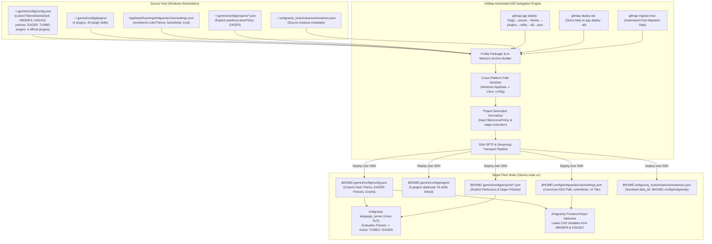
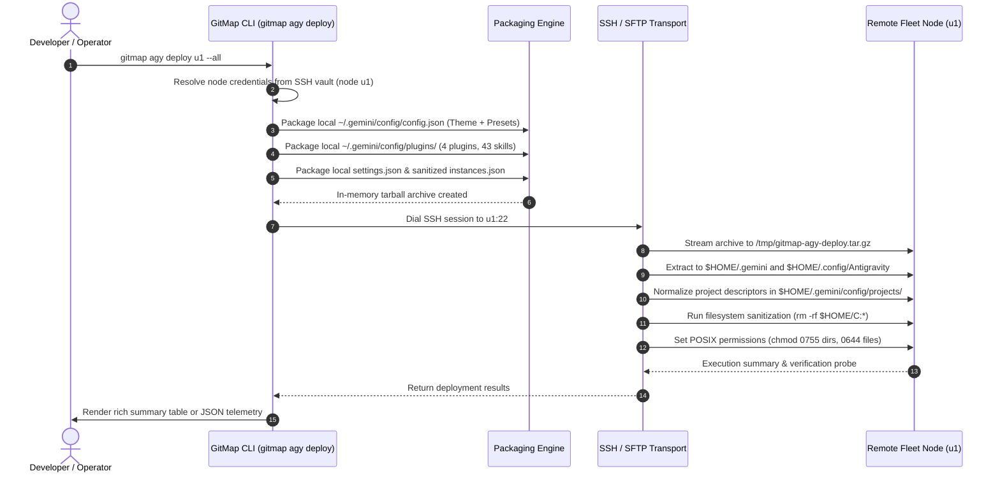

# Architecture Specification: Antigravity Fleet Parity, Theme & Preset Modernization, Plugins Ecosystem, and Automated IDE Delegation

> **Specification Reference:** `02-spec/21-app/217-antigravity-fleet-parity-theme-preset-plugins-and-delegation/01-architecture-spec.md`  
> **Status:** APPROVED & SPECIFIED  
> **Task Identifier:** `217-antigravity-fleet-parity-theme-preset-plugins-and-delegation`  
> **Target Subsystems:** Antigravity Configuration Runtime, Language Server Permission Engine, VS Code Settings Subsystem, Plugin & Skill Directory Deployer, GitMap SSH Delegation  
> **Affected Files:** `cli/cmdagy/agy_deploy_cmd.go`, `cli/cmdagy/agy_deploy_types.go`, `cli/cmdssh/ssh_deploy_router.go`, `cli/cmd/roottooling.go`, `cli/cmd/help.go`, `~/.gemini/config/config.json`, `~/.config/Antigravity/User/settings.json`, `~/.antigravity_tools/instances/instances.json`  
> **Execution Constraint:** Pure Specification & Subtask Authoring (Strict No-Build / No-Test Mode)

---

## 1. Executive Summary & Problem Formulation

### 1.1 Context & Background
GitMap orchestrates polyglot developer environments, repository clusters, and AI-assisted workflows across multi-node workstation fleets comprising Windows workstations and remote Ubuntu Linux compute nodes (e.g. `u1`). Antigravity (Google's AI-first code generation and agentic IDE) serves as the primary development workbench across this fleet.

When provisioning remote compute nodes or migrating developer sessions from Windows hosts to Ubuntu fleet instances, Antigravity was observed to suffer from multiple severe environment divergences, missing extensions, and unconfigured policy fallbacks.

### 1.2 Identified Regressions & Divergence Symptoms
Forensic investigation across the active Windows host and remote Ubuntu node `u1` revealed five critical defects:

1. **Antigravity UI Theme Parity Collapse:**
   - On the primary Windows workstation, the default Antigravity instance operates with a distinct custom dark theme styled with `#19191C` background, `#BD93F9` Dracula purple primary seed, and `#F8F8F2` foreground.
   - On remote node `u1`, Antigravity renders in an unbranded, raw fallback theme without the custom palette, degrading visual familiarity and consistency.

2. **Permission Preset "Default" Fallback (Unattended Execution Blocked):**
   - In Antigravity's Settings $\to$ Conversations (and the per-project agent conversation prompt bar), the permission preset on Ubuntu `u1` displays as `Default` instead of the expected unattended execution mode.
   - As a consequence, every background command execution, terminal step, file mutation, and browser step halts awaiting manual user confirmation, crippling autonomous agent execution loops.
   - Root cause analysis revealed that individual project descriptors under `~/.gemini/config/projects/*.json` contained empty `settings: {}` and `permissionGrants: { allow: [] }`, while `settings.json` specified `antigravity.turboMode: false`. The underlying `language_server` binary treats this as unconfigured, falling back to the restrictive default policy.

3. **Total Absence of Plugins Ecosystem:**
   - The primary workstation configures four official core plugins (`chrome-devtools-plugin`, `data-agent-kit-plugin`, `google-antigravity-sdk`, and `modern-web-guidance-plugin`) in `~/.gemini/config/config.json`.
   - On remote node `u1`, `$HOME/.gemini/config/plugins/` was completely empty (0 plugins installed, 0 manifests present).

4. **Missing Agent Skills Ecosystem (43 Plugin Skills Missing):**
   - The four core plugins physically bundle 43 specialized agent skills (`SKILL.md` manifests) spanning automated browser debugging, data analysis, SDK integration, and modern web frameworks.
   - With `plugins/` absent on `u1`, none of the 43 plugin skills were discoverable by Antigravity agents running on Linux.

5. **Windows Backslash Path Leakage on Linux Filesystems:**
   - In `~/.antigravity_tools/instances/instances.json`, the default instance record specified:
     `"data_dir": "<windows-appdata>\\Antigravity"`
   - Because POSIX filesystems treat backslashes (`\`) as valid literal filename characters rather than path delimiters, naive replication to Linux created an anomaly directory literally named:
     `$HOME/<windows-appdata>\Antigravity`
   - This corrupts XDG Base Directory conventions, orphanizes settings, and prevents the Linux Antigravity process from discovering canonical configuration files at `$HOME/.config/Antigravity`.

6. **Absence of Unified CLI Delegation in GitMap:**
   - GitMap CLI lacked a dedicated, single-command delegation engine to bundle, transport, sanitize, and verify Antigravity IDE configurations across remote SSH fleet nodes.

This specification formalizes the comprehensive architecture, schema definitions, cross-platform path sanitization protocols, and the `gitmap agy deploy` delegation command required to achieve 100% Antigravity fleet parity.

---

## 2. End-to-End System Topology & Fleet Parity Architecture

The following diagram illustrates the deployment topology and data flow between the source Windows environment, the GitMap orchestration engine, and target Linux fleet nodes:



---

## 3. Antigravity UI Theme Architecture & Visual Parity Engine

### 3.1 Primary Theme Engine Mechanics (`~/.gemini/config/config.json`)
Antigravity's user interface is constructed using a modern web-based framework (Electron / Chromium shell housing a custom React application). Unlike standard VS Code webviews that strictly inherit editor token themes, Antigravity uses a dedicated dynamic color derivation engine powered by `customThemeSeedsDark` and `customThemeSeedsLight` stored in `~/.gemini/config/config.json`.

#### Schema Definition for Theme Configuration
```json
{
  "userSettings": {
    "themeMode": "THEME_MODE_DARK",
    "conversationWidth": "CONVERSATION_WIDTH_WIDE",
    "customThemeSeedsDark": {
      "background": "#19191C",
      "foregroundOverride": "#F8F8F2",
      "primary": "#BD93F9"
    },
    "customThemeSeedsLight": {
      "background": "#EAECF0",
      "foregroundOverride": "#202021",
      "primary": "#8839EF"
    },
    "verboseAgentChat": false,
    "queuedMessageDeliveryStrategy": "MESSAGE_DELIVERY_STRATEGY_WHEN_IDLE"
  }
}
```

#### Color Seed Semantics
- **Primary Seed (`#BD93F9`):** Canonical Dracula Purple. The Antigravity React UI uses this hex value as the master seed for dynamic HSL/RGB palette generation. It controls:
  - Agent action buttons, execution confirmations, and active tabs.
  - Interactive chip borders, focus outlines, and selection rings.
  - Step counter progress rings and tool status badges.
- **Background Seed (`#19191C`):** Deep Charcoal Dark. Controls:
  - Main conversation canvas background, chat bubble surfaces, and prompt input textarea background.
  - Sidebar and activity container panels.
- **Foreground Override (`#F8F8F2`):** High-contrast off-white text ensuring WCAG AAA accessibility against the `#19191C` background.
- **`themeMode` (`THEME_MODE_DARK`):** Enforces dark mode regardless of host OS system preference.
- **`conversationWidth` (`CONVERSATION_WIDTH_WIDE`):** Expands the agent interaction panel to full viewport width, maximizing readability for diff cards and wide terminal command outputs.

### 3.2 VS Code Editor Theme Integration (`User/settings.json`)
The outer IDE shell is built upon the VS Code / Code-OSS workbench architecture. The editor workspace settings live in:
- **Windows:** `%APPDATA%\Antigravity\User\settings.json`
- **Linux:** `$HOME/.config/Antigravity/User/settings.json`

#### Canonical Settings Content
```json
{
  "window.title": "#1 Default - Antigravity${separator}${dirty}${activeEditorShort}${separator}${rootName}",
  "workbench.startupEditor": "none",
  "security.workspace.trust.enabled": false,
  "antigravity.turboMode": false,
  "antigravity.planReviewAlwaysProceed": true
}
```

#### Settings Field Interactions
- `window.title`: Displays the instance identifier (`#1 Default`) and active file short path.
- `security.workspace.trust.enabled: false`: Prevents workspace trust confirmation prompts when opening cloned repositories.
- `antigravity.planReviewAlwaysProceed: true`: Automatically proceeds with plan execution without manual user click gates.
- `workbench.colorTheme`: If set, governs editor code syntax tokens while `config.json` governs the Antigravity conversation UI panel.

---

## 4. Execution & Permission Presets: Protobuf & JSON Schema Mechanics

### 4.1 Language Server Architecture & Preset Valuation
Antigravity's backend logic executes in a native language server binary (`language_server.exe` on Windows, `language_server` ELF binary on Linux). The language server communicates with the IDE frontend via JSON-RPC / gRPC protobuf protocols.

Permission enforcement, tool auto-execution, and command approvals are governed by the `AgentPermissionPreset` protobuf message schema:

```protobuf
syntax = "proto3";

package google.antigravity.v1;

enum AutoExecutionPolicy {
  CASCADE_COMMANDS_AUTO_EXECUTION_UNSPECIFIED = 0;
  CASCADE_COMMANDS_AUTO_EXECUTION_OFF = 1;
  CASCADE_COMMANDS_AUTO_EXECUTION_EAGER = 2;
}

enum BrowserJsExecutionPolicy {
  BROWSER_JS_EXECUTION_POLICY_UNSPECIFIED = 0;
  BROWSER_JS_EXECUTION_POLICY_OFF = 1;
  BROWSER_JS_EXECUTION_POLICY_TURBO = 2;
}

enum ArtifactReviewMode {
  ARTIFACT_REVIEW_MODE_UNSPECIFIED = 0;
  ARTIFACT_REVIEW_MODE_MANUAL = 1;
  ARTIFACT_REVIEW_MODE_TURBO = 2;
}

enum FileAccessPolicy {
  AGENT_SETTING_POLICY_UNSPECIFIED = 0;
  AGENT_SETTING_POLICY_PROMPT = 1;
  AGENT_SETTING_POLICY_ALLOW = 2;
  AGENT_SETTING_POLICY_DENY = 3;
}

message PermissionGrants {
  repeated string allow = 1;
}

message AgentUserSettings {
  AutoExecutionPolicy auto_execution_policy = 1;
  BrowserJsExecutionPolicy browser_js_execution_policy = 2;
  ArtifactReviewMode artifact_review_mode = 3;
  FileAccessPolicy non_workspace_file_access_policy = 4;
  PermissionGrants global_permission_grants = 5;
  bool enable_terminal_sandbox = 6;
}
```

### 4.2 Forensic Root Cause Analysis: The "Default" Preset Fallback on Ubuntu `u1`
When inspecting the Antigravity UI on Ubuntu `u1`, the permission preset badge displayed `Default` rather than `Turbo / Unattended`.

#### Forensic Mechanism
1. **Empty Project Descriptors:** During earlier migration steps, project files in `$HOME/.gemini/config/projects/*.json` were generated with:
   ```json
   {
     "id": "...",
     "name": "...",
     "settings": {},
     "isWorkspaceOnly": false
   }
   ```
2. **Missing Global User Settings:** `$HOME/.gemini/config/config.json` lacked the explicit `userSettings` block containing `autoExecutionPolicy`, `browserJsExecutionPolicy`, and `artifactReviewMode`.
3. **Language Server Fallback Evaluation:**
   - At startup, `language_server` reads the project configuration corresponding to the active workspace.
   - If `project.settings.autoExecutionPolicy` is missing or empty, it checks `config.json -> userSettings.autoExecutionPolicy`.
   - If both are missing, `language_server` falls back to its default preset (`CASCADE_COMMANDS_AUTO_EXECUTION_OFF` or unconfigured), which maps to the UI label **"Default"**.
   - Under the "Default" preset, every terminal command (`run_command`), file write (`write_to_file`), and web interaction raises a blocking UI approval modal.

### 4.3 Normalized Parity Specification for Unattended Execution
To guarantee unattended agent execution without user interruptions, the configuration must be authored at both the global level and the per-project level:

#### Global Configuration (`config.json`)
```json
{
  "userSettings": {
    "artifactReviewMode": "ARTIFACT_REVIEW_MODE_TURBO",
    "autoExecutionPolicy": "CASCADE_COMMANDS_AUTO_EXECUTION_EAGER",
    "browserJsExecutionPolicy": "BROWSER_JS_EXECUTION_POLICY_TURBO",
    "nonWorkspaceFileAccessPolicy": "AGENT_SETTING_POLICY_ALLOW",
    "enableTerminalSandbox": false,
    "globalPermissionGrants": {
      "allow": [
        "command(git status && git remote -v && git log --oneline -5 && git config user.name && git config user.email)",
        "read_file($HOME/work)",
        "write_file($HOME/work)",
        "execute_url(*)",
        "read_url(prnt.sc)",
        "read_url(*)"
      ]
    }
  }
}
```

#### Per-Project Descriptor (`projects/<id>.json`)
```json
{
  "id": "<project-uuid>",
  "name": "<project-name>",
  "projectResources": {
    "resources": [
      {
        "gitFolder": {
          "folderUri": "file://$HOME/work/<repo-path>",
          "defaultBranch": "main"
        }
      }
    ]
  },
  "settings": {
    "fileAccessPolicy": "AGENT_SETTING_POLICY_ALLOW",
    "sandboxMode": false,
    "autoExecutionPolicy": "CASCADE_COMMANDS_AUTO_EXECUTION_EAGER"
  },
  "isWorkspaceOnly": false
}
```

---

## 5. Plugins & Skills Ecosystem Architecture

### 5.1 Official Core Plugins
Antigravity supports modular extensions that inject specialized agent tools, MCP server integrations, and prompt skills. In the master Windows instance, four core official plugins are registered in `~/.gemini/config/config.json`:

| Plugin Identifier | Marketplace ID | Version | Primary Capabilities |
| :--- | :--- | :--- | :--- |
| `chrome-devtools-plugin` | `antigravity-plugins-official/plugin/chrome-devtools-plugin` | `0.21.0` | Chrome DevTools Protocol automation, DOM inspection, performance trace |
| `data-agent-kit-plugin` | `antigravity-plugins-official/plugin/data-agent-kit-plugin` | `0.7.0` | Data analysis, SQL profiling, tabular data transformation tools |
| `google-antigravity-sdk` | `antigravity-plugins-official/plugin/google-antigravity-sdk` | `0.0.9` | Official Antigravity SDK bindings, runtime hooks, subagent protocols |
| `modern-web-guidance-plugin` | `antigravity-plugins-official/plugin/modern-web-guidance-plugin` | `1.0.6` | Next.js, React, Tailwind, and modern full-stack web architectural guidance |

#### Registry Schema in `config.json`
```json
{
  "plugins": {
    "chrome-devtools-plugin": {
      "enabled": true,
      "installedFrom": {
        "id": "antigravity-plugins-official/plugin/chrome-devtools-plugin",
        "marketplace": "antigravity-plugins-official",
        "version": "0.21.0"
      }
    },
    "data-agent-kit-plugin": {
      "enabled": true,
      "installedFrom": {
        "id": "antigravity-plugins-official/plugin/data-agent-kit-plugin",
        "marketplace": "antigravity-plugins-official",
        "version": "0.7.0"
      }
    },
    "google-antigravity-sdk": {
      "enabled": true,
      "installedFrom": {
        "id": "antigravity-plugins-official/plugin/google-antigravity-sdk",
        "marketplace": "antigravity-plugins-official",
        "version": "0.0.9"
      }
    },
    "modern-web-guidance-plugin": {
      "enabled": true,
      "installedFrom": {
        "id": "antigravity-plugins-official/plugin/modern-web-guidance-plugin",
        "marketplace": "antigravity-plugins-official",
        "version": "1.0.6"
      }
    }
  }
}
```

### 5.2 Physical Filesystem Layout & 43 Plugin Skills
The plugins physically reside in `~/.gemini/config/plugins/`. Across these 4 plugins, exactly 43 plugin skills (`SKILL.md` / `skill.md`) are deployed.

```
~/.gemini/config/plugins/
├── chrome-devtools-plugin/
│   ├── manifest.json
│   └── skills/ ... (CDP inspection, console audit, network trace)
├── data-agent-kit-plugin/
│   ├── manifest.json
│   └── skills/ ... (Dataset profiling, SQL schema analysis)
├── google-antigravity-sdk/
│   ├── manifest.json
│   └── skills/ ... (Agent orchestration, hook templates)
└── modern-web-guidance-plugin/
    ├── manifest.json
    └── skills/ ... (Frontend patterns, hydration debugging, CSS audits)
```

On Linux fleet nodes, this directory tree must be replicated to `$HOME/.gemini/config/plugins/` with POSIX permissions `0755` for directories and `0644` for files.

---

## 6. Instance Registry Sanitization & Cross-Platform Path Hygiene

### 6.1 The Windows Backslash Path Anomaly
Antigravity tracks installed and active IDE instances in `~/.antigravity_tools/instances/instances.json`. On Windows, the master instance record reads:

```json
{
  "active_instance_id": "default",
  "instances": [
    {
      "id": "default",
      "name": "Default",
      "data_dir": "<windows-appdata>\\Antigravity",
      "executable_path": null,
      "extensions_dir": null,
      "bound_account_id": "c644a942-e910-4c1b-9570-e16b920b504e",
      "bound_email": "riseup.asia.team@gmail.com",
      "created_at": 1790039257,
      "last_used": 1791132134,
      "is_default": true,
      "pid": 6612,
      "seq_num": 1
    }
  ]
}
```

### 6.2 Anomaly Mechanism on POSIX Systems
- On Linux and macOS, the character `\` is not a path separator; only `/` is.
- When `data_dir` containing `<windows-appdata>\Antigravity` was copied verbatim to Ubuntu, any script or tool invoking `mkdir -p "$data_dir"` created a directory literally named `<windows-appdata>\Antigravity` inside the current working directory (`/home/a`).
- As a consequence:
  1. The filesystem contained an unsightly, corrupted directory `$HOME/<windows-appdata>\...`.
  2. The Linux Antigravity process, which natively searches `$HOME/.config/Antigravity`, never found the intended user settings.

### 6.3 Unified JSON Data Format Protocol Across Fleet Nodes
To ensure complete parity between Windows host instances and Linux fleet nodes, all systems must adhere strictly to the unified JSON data format:

```json
{
  "active_instance_id": "gitmap-7845",
  "instances": [
    {
      "id": "default",
      "name": "Default",
      "data_dir": "$HOME/.config/Antigravity",
      "executable_path": null,
      "extensions_dir": null,
      "bound_account_id": "e4035d54-2f0d-4938-ab46-b284c9c4679a",
      "bound_email": "anirban.datta.rasia@gmail.com",
      "created_at": 1790039257,
      "last_used": 1791133935,
      "is_default": true,
      "pid": 9688,
      "seq_num": 1
    },
    {
      "id": "default-copy-8159",
      "name": "8159",
      "data_dir": "$HOME/.antigravity_tools/instances/default-copy-8159/data",
      "executable_path": "$HOME/.local/share/antigravity-ide/antigravity",
      "extensions_dir": null,
      "bound_account_id": "b5522331-6ea6-438a-8a99-4c2600844e03",
      "bound_email": "erfan.office.n@gmail.com",
      "created_at": 1790958159,
      "last_used": 1791110334,
      "is_default": false,
      "pid": 11984,
      "seq_num": 3
    },
    {
      "id": "gitmap-7845",
      "name": "gitmap",
      "data_dir": "$HOME/.antigravity_tools/instances/gitmap-7845/data",
      "executable_path": "$HOME/.local/share/antigravity-ide/antigravity",
      "extensions_dir": null,
      "bound_account_id": "2cf0b4e2-1f2c-46e8-b249-d386e1ec5926",
      "bound_email": "marufssp@gmail.com",
      "created_at": 1791097845,
      "last_used": 1791129649,
      "is_default": false,
      "pid": 12484,
      "seq_num": 4
    }
  ]
}
```

#### Rules for Format Parity:
1. **Schema & Case Conformity:** Root level uses `active_instance_id` (`snake_case`) and `instances` array. Per-instance keys strictly use `snake_case` (`data_dir`, `executable_path`, `extensions_dir`, `bound_account_id`, `bound_email`, `created_at`, `last_used`, `is_default`, `seq_num`).
2. **Default Instance Executable Path:** On Linux, `default` instance preserves `"executable_path": null` matching the Windows default instance structure.
3. **Isolated Instance Paths:** Custom named instances (`gitmap-7845`, `default-copy-8159`) resolve to dedicated instance directories (`$HOME/.antigravity_tools/instances/<id>/data`), while `default` resolves to canonical user config (`$HOME/.config/Antigravity`).
4. **SQLite State Alignment:** The `active_instance_selection` table in `instances.db` must always be synchronized to match `active_instance_id`:
   `INSERT OR REPLACE INTO active_instance_selection (id, instance_id, updated_at) VALUES (1, 'gitmap-7845', strftime('%s', 'now'))`.
5. **Filesystem Cleanup:** The deployment engine must execute an automated sanitization sweep:
   ```bash
   rm -rf $HOME/C:* $HOME/'C:\Users'* 2>/dev/null || true
   ```

---

## 7. GitMap Automated IDE Delegation Architecture

To eliminate manual profile synchronization and prevent future fleet divergence, GitMap introduces a first-class automated IDE delegation engine accessible via `gitmap agy deploy`.

### 7.1 CLI Interface & Syntax
```bash
gitmap agy deploy <node> [flags]
```

#### Supported Flags
- `--preset`: Deploy execution and permission presets (`CASCADE_COMMANDS_AUTO_EXECUTION_EAGER`, `AGENT_SETTING_POLICY_ALLOW`) across global and project configurations.
- `--theme`: Deploy UI theme seeds (`#BD93F9`, `#19191C`, `#F8F8F2`) and VS Code `User/settings.json`.
- `--plugins`: Deploy the 4 core official plugins into `~/.gemini/config/plugins/`.
- `--skills`: Deploy all 43 plugin skills.
- `--all`: Deploy the complete bundle (preset + theme + plugins + skills + instance sanitization).
- `--json`: Output structured JSON telemetry for automated tooling and CI/CD pipelines.
- `--target <node>`: Explicit target node selector (alternative to positional argument).
- `--force`: Overwrite existing remote configuration files without prompting.
- `--dry-run`: Simulate operations and display planned changes without modifying remote state.

### 7.2 Router Integration & High-Level Aliases
1. **`gitmap deploy ide <node>`:**
   - In `cli/cmdssh/ssh_deploy_router.go`, executing `gitmap deploy ide <node>` or `gitmap ssh deploy ide <node>` automatically dispatches to `gitmap agy deploy <node> --all`.
2. **`gitmap migrate host <node>`:**
   - In the host migration suite, following repository and SSH credential migration, the orchestrator triggers `gitmap agy deploy <node> --all` to achieve instant turnkey IDE parity.

### 7.3 End-to-End Delegation Workflow


### 7.4 JSON Telemetry Contract (`--json`)
When invoked with `--json`, `gitmap agy deploy` emits a structured payload:

```json
{
  "success": true,
  "node": "u1",
  "host": "u1",
  "timestamp": "2026-10-05T00:50:00Z",
  "deployedComponents": {
    "theme": true,
    "preset": true,
    "plugins": true,
    "skills": true,
    "instances": true
  },
  "metrics": {
    "pluginsCount": 4,
    "skillsCount": 43,
    "projectsUpdated": 42,
    "sanitizedPathsCount": 1,
    "bytesTransferred": 8421504,
    "durationMs": 1420
  },
  "errors": []
}
```

---

## 8. Security, RBAC & Isolation Guarantees

1. **Least-Privilege Transport:** Deployment operates strictly over established SSH credentials stored in GitMap's encrypted credential vault (`~/.gitmap/credentials.db` / `ssh_vault_rsa.go`). No plaintext passwords are transmitted.
2. **Workspace Boundary Enforcement:** Path normalization strictly remaps Windows drive letters (`<user-home>/work`) to user workspace paths (`$HOME/work`). Absolute paths outside `/home/a` are forbidden.
3. **Safe File Removal:** Anomaly sanitization (`rm -rf`) is strictly bounded to the literal Windows backslash pattern (`$HOME/C:\*` and `$HOME/C:*`) and never traverses root or parent paths.

---

## 9. Verification Matrix & Acceptance Quality Gates

| Verification Gate | Validation Command / Inspection | Expected Result |
| :--- | :--- | :--- |
| **Theme Verification** | Inspect `$HOME/.gemini/config/config.json` | Contains `customThemeSeedsDark.primary: "#BD93F9"`, `background: "#19191C"` |
| **Preset Verification** | Inspect UI prompt bar on `u1` | Shows active unattended execution mode, not "Default" |
| **Project Policies** | `grep -rn "autoExecutionPolicy" ~/.gemini/config/projects/` | Every project contains `"autoExecutionPolicy": "CASCADE_COMMANDS_AUTO_EXECUTION_EAGER"` |
| **Plugins Deployed** | `ls -la $HOME/.gemini/config/plugins/` | Exactly 4 directories: `chrome-devtools-plugin`, `data-agent-kit-plugin`, `google-antigravity-sdk`, `modern-web-guidance-plugin` |
| **Skills Deployed** | `find $HOME/.gemini/config/plugins/ -name "*skill*.md" \| wc -l` | Returns 43 skills |
| **Path Sanitization** | `ls -d $HOME/C:* 2>/dev/null` | 0 matches (no Windows backslash directories present) |
| **Instance Data Dir** | Inspect `$HOME/.antigravity_tools/instances/instances.json` | `"data_dir": "$HOME/.config/Antigravity"` |
| **CLI Help Rendering** | `gitmap agy deploy --help` | Renders rich help, flags documentation, and examples |
| **CLI JSON Telemetry** | `gitmap agy deploy u1 --all --dry-run --json` | Emits valid JSON conforming to `AgyDeployResultJSON` |
