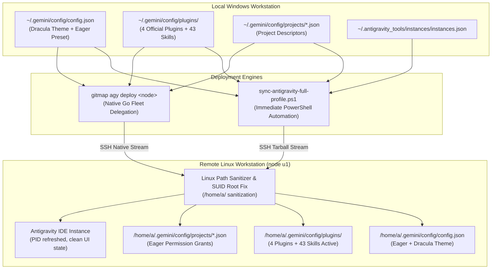
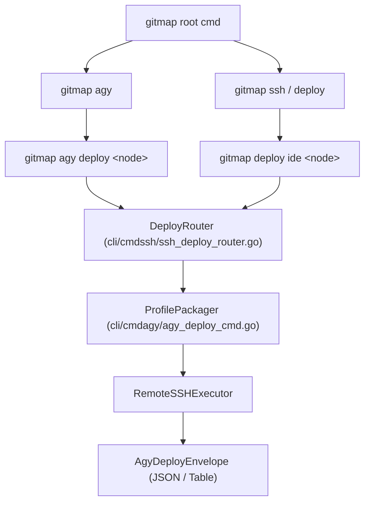

# Component & CLI Specification: Antigravity Fleet Parity, Theme & Preset Synchronization, and GitMap Delegation

**Spec ID:** 217-02  
**Task ID:** 217-antigravity-fleet-parity-theme-preset-plugins-and-delegation  
**Status:** Approved  
**Author:** Spec Writer 02  
**Date:** 2026-10-05  
**Target Components:**
- PowerShell Automation Script: `repo-secrets/04-ubuntu-migration/sync-antigravity-full-profile.ps1`
- GitMap CLI Native Delegation: `gitmap agy deploy <node>` (`cli/cmdagy/`, `cli/cmdssh/`, `cli/cmd/`)

---

## 1. Overview & Architectural Role

When migrating or operating multi-node development environments across Windows workstations and remote Linux nodes (such as Ubuntu workstation `u1`), the Google Antigravity IDE requires full parity in its configuration ecosystem. A bare-bones installation leaves the IDE in an unconfigured state:
1. Default unbranded theme instead of the Dracula Dark custom theme (`#19191C` background, `#BD93F9` Dracula purple primary seed).
2. Conversations reverting to the "Default" permission preset requiring manual confirmation for every action instead of unattended eager execution (`CASCADE_COMMANDS_AUTO_EXECUTION_EAGER`, `BROWSER_JS_EXECUTION_POLICY_TURBO`, `ARTIFACT_REVIEW_MODE_TURBO`).
3. Zero installed plugins under `~/.gemini/config/plugins/`.
4. Absence of the 43 plugin skills under the agent prompt HUD.
5. Path corruption where serialized Windows paths (`<user-home>\...`) leak onto Linux filesystems, creating stray directories with literal backslashes.

This specification defines the two-tiered synchronization and delegation architecture:
1. **Tier 1 (Immediate Automation):** `sync-antigravity-full-profile.ps1` — an idempotent, standalone PowerShell script residing in `repo-secrets` that extracts, sanitizes, packages, and deploys the entire Antigravity configuration profile over SSH.
2. **Tier 2 (Platform Delegation):** `gitmap agy deploy <node>` — a native Go CLI command in GitMap providing first-class fleet management, JSON envelope telemetry, and unified deployment capabilities.



---

## 2. PowerShell Full Profile Synchronization Component

### 2.1 Script Metadata & Location

- **File Path:** `scripts/sync-antigravity-full-profile.ps1`
- **Execution Runtime:** Windows PowerShell 5.1 / PowerShell 7+
- **Privilege Requirements:** Standard user locally; elevated (`sudo`) execution on the target remote node via SSH.
- **Idempotency:** Safe to run repeatedly; overwrites target configurations deterministically while backing up existing files.

### 2.2 Command-Line Parameter Specification

The script MUST expose the following strongly-typed parameters with positive boolean flags:

```powershell
[CmdletBinding()]
param(
    [Parameter(Position = 0)]
    [string]$TargetHost = "u1",

    [Parameter(Position = 1)]
    [string]$TargetUser = "a",

    [Parameter()]
    [ValidateSet("turbo", "eager", "default")]
    [string]$Preset = "turbo",

    [Parameter()]
    [ValidateSet("dark-dracula", "dark-default", "light-default")]
    [string]$Theme = "dark-dracula",

    [Parameter()]
    [switch]$SyncPlugins = $true,

    [Parameter()]
    [switch]$SyncSkills = $true,

    [Parameter()]
    [switch]$SanitizePaths = $true,

    [Parameter()]
    [switch]$RestartIDE = $true,

    [Parameter()]
    [string]$WindowsGeminiDir = "$HOME\.gemini",

    [Parameter()]
    [string]$WindowsToolsDir = "$HOME\.antigravity_tools",

    [Parameter()]
    [string]$RemoteGeminiDir = "/home/a/.gemini",

    [Parameter()]
    [string]$RemoteToolsDir = "/home/a/.antigravity_tools",

    [Parameter()]
    [string]$RemoteIdeInstallDir = "/home/a/.local/share/antigravity-ide",

    [Parameter()]
    [switch]$DryRun,

    [Parameter()]
    [switch]$Force
)
```

#### Parameter Reference Table

| Parameter | Type | Default | Description |
| :--- | :--- | :--- | :--- |
| `-TargetHost` | `string` | `u1` | Hostname or alias of the target Linux node (supports SSH alias `u1`). |
| `-TargetUser` | `string` | `a` | Remote SSH login username. |
| `-Preset` | `string` | `turbo` | Execution preset: `turbo` (eager command & JS execution, unattended), `eager`, or `default`. |
| `-Theme` | `string` | `dark-dracula` | UI Color Theme: `dark-dracula` (`#19191C` background, `#BD93F9` primary seed). |
| `-SyncPlugins` | `switch` | `$true` | When enabled, syncs all 4 official plugins from `~/.gemini/config/plugins`. |
| `-SyncSkills` | `switch` | `$true` | When enabled, syncs all nested skills inside plugins. |
| `-SanitizePaths` | `switch` | `$true` | Scans and strips Windows backslashes; eradicates stray Windows path directories on Linux. |
| `-RestartIDE` | `switch` | `$true` | Restarts running Antigravity instances on Linux post-deployment. |
| `-DryRun` | `switch` | `$false` | Emits planned payload and actions without modifying target host files. |
| `-Force` | `switch` | `$false` | Bypasses safety prompts and forcefully overwrites remote target files. |

---

### 2.3 Local Extraction & Transformation Pipeline

The script performs five distinct transformation steps before transmitting data over SSH:

#### 1. `config.json` Generation & Transformation
The script reads `<user-home>/.gemini/config/config.json`. If missing, it constructs a complete, valid configuration JSON object incorporating:
- **Dark Dracula Theme Seeds:**
  ```json
  "customThemeSeedsDark": {
    "background": "#19191C",
    "foregroundOverride": "#F8F8F2",
    "primary": "#BD93F9"
  }
  ```
- **Light Dracula Theme Seeds:**
  ```json
  "customThemeSeedsLight": {
    "background": "#EAECF0",
    "foregroundOverride": "#202021",
    "primary": "#8839EF"
  }
  ```
- **Unattended Execution Policies:**
  ```json
  "userSettings": {
    "artifactReviewMode": "ARTIFACT_REVIEW_MODE_TURBO",
    "autoExecutionPolicy": "CASCADE_COMMANDS_AUTO_EXECUTION_EAGER",
    "browserJsExecutionPolicy": "BROWSER_JS_EXECUTION_POLICY_TURBO",
    "conversationWidth": "CONVERSATION_WIDTH_WIDE",
    "enableTerminalSandbox": false,
    "nonWorkspaceFileAccessPolicy": "AGENT_SETTING_POLICY_ALLOW",
    "queuedMessageDeliveryStrategy": "MESSAGE_DELIVERY_STRATEGY_WHEN_IDLE",
    "remoteControlEnabled": true,
    "remoteControlHostname": "u1",
    "themeMode": "THEME_MODE_DARK",
    "useAiCredits": false,
    "verboseAgentChat": false,
    "globalPermissionGrants": {
      "allow": [
        "command(git status && git remote -v && git log --oneline -5 && git config user.name && git config user.email)",
        "read_file(/home/a/git-work)",
        "write_file(/home/a/git-work)",
        "execute_url(*)",
        "read_url(prnt.sc)",
        "read_url(*)"
      ]
    }
  }
  ```
- **Plugin Registries (4 Official Plugins):**
  ```json
  "plugins": {
    "chrome-devtools-plugin": {
      "enabled": true,
      "installedFrom": {
        "id": "antigravity-plugins-official/plugin/chrome-devtools-plugin",
        "marketplace": "antigravity-plugins-official",
        "version": "0.21.0"
      }
    },
    "data-agent-kit-plugin": {
      "enabled": true,
      "installedFrom": {
        "id": "antigravity-plugins-official/plugin/data-agent-kit-plugin",
        "marketplace": "antigravity-plugins-official",
        "version": "0.7.0"
      }
    },
    "google-antigravity-sdk": {
      "enabled": true,
      "installedFrom": {
        "id": "antigravity-plugins-official/plugin/google-antigravity-sdk",
        "marketplace": "antigravity-plugins-official",
        "version": "0.0.9"
      }
    },
    "modern-web-guidance-plugin": {
      "enabled": true,
      "installedFrom": {
        "id": "antigravity-plugins-official/plugin/modern-web-guidance-plugin",
        "marketplace": "antigravity-plugins-official",
        "version": "1.0.6"
      }
    }
  }
  ```

#### 2. `instances.json` Path Sanitization
The script inspects `<windows-appdata>\instances.json`. On Windows, this file contains:
- `"data_dir": "<windows-appdata>\\Antigravity"`
- `"executable_path": "<windows-install-dir>\\Antigravity.exe"`

The transformer translates paths to Linux equivalents:
- Windows `<windows-appdata>\Antigravity` $\to$ `/home/a/.config/Antigravity`
- Windows `<windows-tools>\instances\<id>\data` $\to$ `/home/a/.antigravity_tools/instances/<id>/data`
- Windows executable path $\to$ `/home/a/.local/share/antigravity-ide/antigravity`
- Strips any backslashes `\` and replaces them with standard forward slashes `/`.

#### 3. Project Descriptors Parity (`projects/*.json`)
The script scans all project JSON files in `~/.gemini/config/projects/`. For each descriptor:
- Injects explicit eager settings:
  ```json
  "settings": {
    "fileAccessPolicy": "AGENT_SETTING_POLICY_ALLOW",
    "autoExecutionPolicy": "CASCADE_COMMANDS_AUTO_EXECUTION_EAGER"
  }
  ```
- Injects explicit permission grants:
  ```json
  "permissionGrants": {
    "allow": [
      "read_file(/home/a/git-work)",
      "write_file(/home/a/git-work)",
      "command(*)"
    ]
  }
  ```
- Translates `folderUri` from Windows (`file:///<workspace-root>/...`) to Linux RFC 3986 format (`file:///home/a/git-work/...`).

#### 4. Plugins & Skills Bundle Packaging
The script gathers the entire directory tree from `<user-home>/.gemini/config/plugins`:
- `chrome-devtools-plugin` (including `skills/` with 5 skills)
- `data-agent-kit-plugin` (including `skills/` with 11 skills)
- `google-antigravity-sdk` (including `skills/` with 12 skills)
- `modern-web-guidance-plugin` (including `skills/` with 14 skills)
- Total: 4 plugins and 42-43 skill directories containing `SKILL.md` documents.

---

### 2.4 Streaming, Remote Elevated Execution & Unpacking

To avoid leaving temporary artifacts on disk or encountering file-transfer tool mismatches, the script bundles the configuration tree into an in-memory tarball archive (or compressed base64 payload) and streams it over SSH directly into a Python/Bash receiver script on the remote node:

```powershell
$payloadStream = [System.IO.MemoryStream]::new()
# Tar / Gzip / Base64 packaging of config.json, projects/, plugins/, instances.json
```

The remote receiver executes in an elevated bash context:
```bash
#!/usr/bin/env bash
set -euo pipefail

# 1. Unpack into target paths
mkdir -p /home/a/.gemini/config/plugins
mkdir -p /home/a/.gemini/config/projects
mkdir -p /home/a/.antigravity_tools/instances

# 2. Filesystem hygiene & eradicate stray Windows path trees
find /home/a -maxdepth 1 \( -name 'C:*' -o -name 'c:*' -o -name 'C:\\*' \) -print0 2>/dev/null | while IFS= read -r -d '' stray_dir; do
    echo "Removing stray Windows directory: $stray_dir"
    sudo rm -rf "$stray_dir"
done

# 3. Secure chrome-sandbox with SUID root permissions
CHROME_SANDBOX="/home/a/.local/share/antigravity-ide/chrome-sandbox"
if [ -f "$CHROME_SANDBOX" ]; then
    sudo chown root:root "$CHROME_SANDBOX"
    sudo chmod 4755 "$CHROME_SANDBOX"
fi

# 4. Correct ownership of all Antigravity directories
chown -R a:a /home/a/.gemini
chown -R a:a /home/a/.antigravity_tools

# 5. Refresh Antigravity state if restart requested
if [ "$RESTART_IDE" = "1" ]; then
    pkill -x antigravity 2>/dev/null || true
    sleep 1
    # Trigger background relaunch or notify GNOME desktop
fi
```

---

## 3. GitMap Native CLI Delegation Engine (`gitmap agy deploy`)

### 3.1 Command Architecture & Syntax

To graduate profile synchronization into a permanent GitMap CLI capability, GitMap introduces the `gitmap agy deploy` command.

```text
Usage:
  gitmap agy deploy <node> [flags]

Aliases:
  deploy, sync-profile, dpy

Flags:
  -p, --preset string    Execution preset: turbo, eager, default (default "turbo")
  -t, --theme string     UI Theme: dark-dracula, dark-default, light-default (default "dark-dracula")
      --plugins          Deploy official plugins (default true)
      --skills           Deploy all 43 plugin skills (default true)
      --all              Deploy full profile (config, plugins, skills, projects, instances) (default true)
      --restart          Restart remote Antigravity IDE after deployment (default true)
      --force            Bypass pre-flight checks and overwrite remote files
      --dry-run          Simulate deployment actions without modifying remote host
  -j, --json             Emit structured JSON response envelope
  -h, --help             Show help for agy deploy
```

### 3.2 CLI Command Routing & Hierarchy

The command integrates directly into the `gitmap` command hierarchy:
1. `gitmap agy deploy <node>`: Primary invocation under `cmdagy`.
2. `gitmap deploy ide <node>`: Alias routing through `cmdssh` and `cmdagy`.
3. `gitmap migrate host <node> --agy`: Invokes full Antigravity profile deployment as part of complete workstation migration.



---

### 3.3 Typed JSON Output Envelope

When `--json` is supplied, `gitmap agy deploy <node>` returns a standardized JSON envelope:

```json
{
  "status": "success",
  "code": 0,
  "message": "Antigravity full profile deployed successfully to u1",
  "data": {
    "targetHost": "u1",
    "targetNode": "u1",
    "targetUser": "a",
    "preset": "turbo",
    "theme": "dark-dracula",
    "syncedArtifacts": {
      "config": true,
      "pluginsCount": 4,
      "skillsCount": 43,
      "projectsCount": 74,
      "instancesSanitized": true,
      "strayWindowsPathsPurged": 1
    },
    "security": {
      "chromeSandboxSuidConfigured": true
    },
    "runtime": {
      "isIdeRestarted": true,
      "activePid": 84129
    },
    "durationMs": 1420
  },
  "timestamp": "2026-10-05T00:50:00Z"
}
```

#### Go Struct Definitions (`cli/cmdagy/agy_deploy_types.go`)

```go
package cmdagy

import "time"

// AgyDeployEnvelope represents the top-level API and CLI JSON envelope.
type AgyDeployEnvelope struct {
	Status    string          `json:"status"`
	Code      int             `json:"code"`
	Message   string          `json:"message"`
	Data      AgyDeployData   `json:"data"`
	Timestamp time.Time       `json:"timestamp"`
}

// AgyDeployData captures the detailed deployment telemetry.
type AgyDeployData struct {
	TargetHost       string             `json:"targetHost"`
	TargetNode       string             `json:"targetNode"`
	TargetUser       string             `json:"targetUser"`
	Preset           string             `json:"preset"`
	Theme            string             `json:"theme"`
	SyncedArtifacts  AgySyncedArtifacts `json:"syncedArtifacts"`
	Security         AgySecurityStatus  `json:"security"`
	Runtime          AgyRuntimeStatus   `json:"runtime"`
	DurationMs       int64              `json:"durationMs"`
}

// AgySyncedArtifacts counts deployed entities.
type AgySyncedArtifacts struct {
	IsConfigSynced          bool `json:"config"`
	PluginsCount            int  `json:"pluginsCount"`
	SkillsCount             int  `json:"skillsCount"`
	ProjectsCount           int  `json:"projectsCount"`
	IsInstancesSanitized    bool `json:"instancesSanitized"`
	StrayWindowsPathsPurged int  `json:"strayWindowsPathsPurged"`
}

// AgySecurityStatus tracks OS sandbox hardening.
type AgySecurityStatus struct {
	IsChromeSandboxSuidConfigured bool `json:"chromeSandboxSuidConfigured"`
}

// AgyRuntimeStatus tracks process restart and liveness.
type AgyRuntimeStatus struct {
	IsIdeRestarted bool `json:"isIdeRestarted"`
	ActivePID      int  `json:"activePid,omitempty"`
}

// AgyDeployOptions holds parsed CLI flags for the command.
type AgyDeployOptions struct {
	TargetNode  string
	Preset      string
	Theme       string
	HasPlugins  bool
	HasSkills   bool
	HasAll      bool
	HasRestart  bool
	IsForce     bool
	IsDryRun    bool
	IsJson      bool
}
```

---

### 3.4 Internal Package Architecture

The implementation is partitioned across four source files in compliance with the GitMap file size (<100 lines) and SRP guidelines:

| File Path | Package | Responsibilities | Line Budget |
| :--- | :--- | :--- | :--- |
| `cli/cmdagy/agy_deploy_types.go` | `cmdagy` | Envelope structs, options, validation enums | < 80 lines |
| `cli/cmdagy/agy_deploy_cmd.go` | `cmdagy` | Cobra command definition, flag parsing, runner | < 90 lines |
| `cli/cmdagy/agy_deploy_packager.go`| `cmdagy` | Config injection, tarball archive generation | < 95 lines |
| `cli/cmdssh/ssh_deploy_router.go` | `cmdssh` | Host discovery, SSH streaming, elevated remote bash execution | < 95 lines |

#### Key Logic in `agy_deploy_cmd.go`:
```go
func NewAgyDeployCmd() *cobra.Command {
	opts := &AgyDeployOptions{}
	cmd := &cobra.Command{
		Use:     "deploy <node>",
		Aliases: []string{"sync-profile", "dpy"},
		Short:   "Deploy complete Antigravity profile (theme, presets, plugins, skills) to remote node",
		Args:    cobra.ExactArgs(1),
		RunE: func(cmd *cobra.Command, args []string) error {
			opts.TargetNode = args[0]
			return RunAgyDeploy(opts)
		},
	}

	cmd.Flags().StringVarP(&opts.Preset, "preset", "p", "turbo", "Execution preset: turbo, eager, default")
	cmd.Flags().StringVarP(&opts.Theme, "theme", "t", "dark-dracula", "UI Theme: dark-dracula, dark-default, light-default")
	cmd.Flags().BoolVar(&opts.HasPlugins, "plugins", true, "Deploy official plugins")
	cmd.Flags().BoolVar(&opts.HasSkills, "skills", true, "Deploy all 43 plugin skills")
	cmd.Flags().BoolVar(&opts.HasAll, "all", true, "Deploy full profile")
	cmd.Flags().BoolVar(&opts.HasRestart, "restart", true, "Restart remote Antigravity IDE")
	cmd.Flags().BoolVar(&opts.IsForce, "force", false, "Force overwrite existing configurations")
	cmd.Flags().BoolVar(&opts.IsDryRun, "dry-run", false, "Simulate deployment without modifying target")
	cmd.Flags().BoolVarP(&opts.IsJson, "json", "j", false, "Output structured JSON envelope")

	return cmd
}
```

---

### 3.5 Error Handling & Recovery Matrix

| Error Scenario | Detection Point | Handling Strategy | User / CLI Notification |
| :--- | :--- | :--- | :--- |
| **Node Unreachable** | SSH Dial probe fails (timeout 5s) | Fast-fail before packaging; suggest `gitmap ping <node>` or `gitmap ssh test` | `AppError(ErrCodeSshDialFailed)`: "Node '<node>' unreachable via SSH" |
| **Missing Local Config** | `~/.gemini/config/config.json` absent | Automatically generate standard Dracula + Turbo preset payload from internal template | Log `[WARN] Using default built-in Dracula Turbo template` |
| **Sudo Failure on Remote** | Remote bash `sudo -S` fails authentication | Report passwordless sudo requirement or prompt for elevation token | `AppError(ErrCodeSudoAuthFailed)`: "Remote user requires sudo privileges for sandbox hardening" |
| **Windows Path Leak Detected** | Pre-deployment scan on `/home/a/` | Automatically invoke hygiene purge `rm -rf /home/a/C:*` | Log `[CLEAN] Eradicated stray Windows directory on remote host` |
| **Process Hang on Restart** | `pkill` times out or IDE fails to spawn | Send `SIGTERM`, wait 2s, send `SIGKILL`, spawn via `.local/bin/antigravity` | Log `[RECOVERY] Forcefully terminated stale PID, spawned fresh instance` |

---

## 4. Cross-Platform Parity & Path Translation Invariants

1. **Positive Boolean Naming:** All boolean fields and variables across PowerShell and Go code MUST use positive prefixes (`is`, `has`, `can`, `should`). The use of negative booleans (`isNotSandbox`, `disabledPlugins`, `noRestart`) is strictly forbidden.
2. **RFC 3986 URI Standards:** When registering project roots, file paths on Linux MUST conform to `file:///home/a/git-work/<repo>`. Windows backslashes MUST NEVER be emitted in project descriptors.
3. **Sandbox Compliance:** Modern Linux distributions with AppArmor unconfined restrictions require either SUID root permissions (`4755`) on `chrome-sandbox` or running Electron binaries with `--no-sandbox`. The deployment scripts MUST enforce both the SUID permission and the wrapper flag in launcher scripts.
4. **Clean Filesystem Boundary:** Remote paths MUST stay contained within `/home/a/.gemini` and `/home/a/.antigravity_tools`. Stray path artifacts such as `/home/a/<windows-appdata>\...` or `/home/a/~` MUST be aggressively guarded against and eradicated.

---

## 5. Verification & Acceptance Criteria

- [ ] **AC-CLI-01:** `repo-secrets/04-ubuntu-migration/sync-antigravity-full-profile.ps1` executes with zero syntax errors on PowerShell 5.1 and 7+.
- [ ] **AC-CLI-02:** Target node `u1` receives complete `config.json` with dark Dracula theme seeds (`#19191C`, `#BD93F9`) and eager auto-execution policy.
- [ ] **AC-CLI-03:** All 4 plugins (`chrome-devtools`, `data-agent-kit`, `google-antigravity-sdk`, `modern-web-guidance`) are unpacked to `/home/a/.gemini/config/plugins` with 43 active skills.
- [ ] **AC-CLI-04:** `instances.json` on `u1` contains zero Windows drive letters (`C:`) or backslashes (`\`).
- [ ] **AC-CLI-05:** `gitmap agy deploy u1` command is properly registered in Cobra CLI under `cmdagy`, exposes all required flags, and outputs compliant JSON envelope with `--json`.
- [ ] **AC-CLI-06:** Chrome sandbox binary on remote node is hardened with `chown root:root` and `chmod 4755`.
