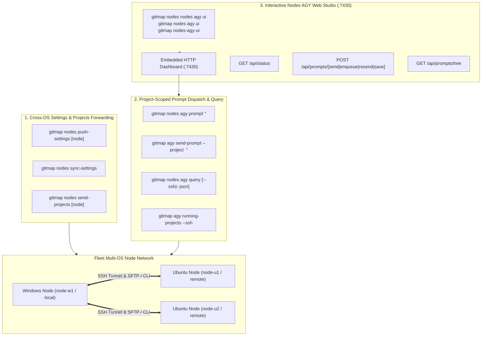
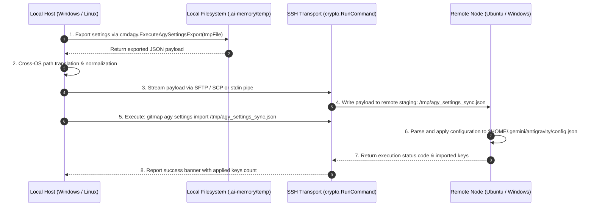
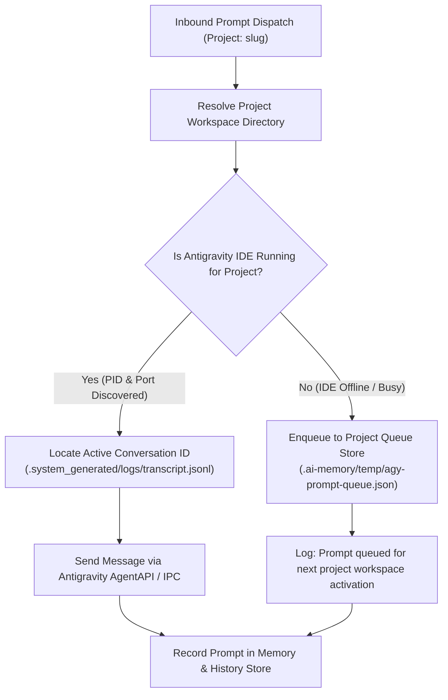
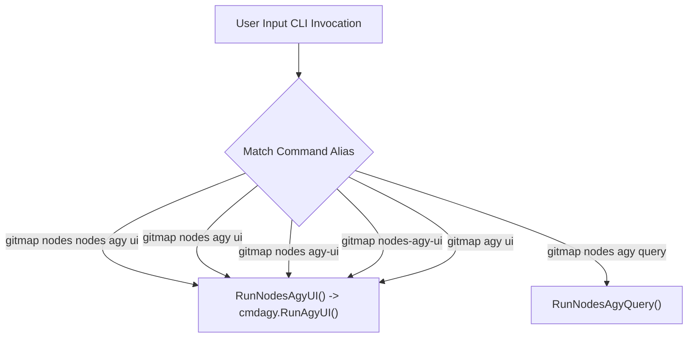

# Specification: Fleet Remote Commands, Project-Scoped Prompting, and Nodes AGY UI Dashboard

> **Spec Sequence:** 218  
> **Status:** `active`  
> **Traceability:** Task-01, Task-02, Task-03, Task-05  
> **Created:** 2026-10-05  

---

## 1. User Request (Verbatim)

```text
Great. Just we have installed the IDE, set up settings, and things that, I hope you have commands to send forward the settings from settings, projects, and everything from one machine to another, regardless of the OS. You have to confirm that first, that you have done it. The second thing is that we should be able to send even prompts to specific projects. That's what we want as well. So first try with a single project and also try to have methods or a query way to communicate with the `gitmap` to see whatever the projects and instance are running on that machine. So all kinds of query stuff that should be there. Also, you can do nodes space nodes space AGY, and then do UI. That would actually open up a UI that would tell us information like which prompts are running on which projects or which instances are there. So all kinds of things we wanted to see in the UI. And also in last few commits and outputs, you have put the IP, you have put the absolute paths to the MD files. Make sure that you fix those. All absolute path and no IPs should be there. Machine information, these things can be there, but not the IPs and things like that. Can you please confirm and fix that as well? Now coming to the new problems. We should be able to have commands in the future, cursor-related commands, just like what we have for the `gitmap`. We want to have for the cursor as well, so make sure we have it. And also, `gitmap` AGY UI needs to be there where I should be able to see whatever the prompts are running, sending prompts, and things like that. Sending prompt, retrieving, saving prompts, resending, enqueuing prompts, so see the current running prompts. So all kinds of things we should be able to do using the `gitmap` and `gitmap` AGY UI. that is very important. So in the cursor sense. Also, you need to install cursor and send the projects or include projects, just like what we have in this machine. Similarly, we want to have in the Ubuntu machine. So for this, for now, write the PowerShell script, and the steps that you are following, and based on that, also update the code and everything else. Do you understand? Can you please follow through?
```

---

## 2. High-Level Architecture & Fleet Context

This specification defines the architectural model, control flows, data structures, and CLI dispatch patterns for managing Antigravity IDE and GitMap instances across heterogeneous multi-OS fleet nodes (Windows, Ubuntu, Debian).

### 2.1 Core Architectural Pillars



### 2.2 Privacy & Relative Path Guard

All telemetry output, documentation, and fleet data exchange MUST strictly conform to privacy and portability constraints:
1. **Zero Raw IP Addresses:** No IPv4 or IPv6 addresses may appear in markdown documentation, console banners, or UI default views. All machines must be referenced by logical host aliases (e.g. `node-01`, `ubuntu-fleet-01`, `node-w1`, `node-main`, `localhost`).
2. **Zero Absolute Local Paths:** No local drive roots (e.g. `C:\Users\...`, `d:\work\...`, `/home/user/...`) are permitted in persistent spec files. All paths must be parameterized as `<user-home>`, `<repo-root>`, `$WORKSPACE_ROOT`, or repository-relative links.

---

## 3. Cross-OS Settings & Projects Forwarding Architecture

### 3.1 Overview

Developers require seamless replication of Antigravity IDE configuration, keybindings, rules, custom prompts, and Project Manager entries from their primary workstation to remote fleet instances, regardless of underlying OS differences.

### 3.2 Command Interfaces

| Command | Arguments | Target Scope | Description |
|:---|:---|:---|:---|
| `gitmap nodes push-settings` | `[node-alias]` | Single Node | Exports local Antigravity settings and deploys them to target node |
| `gitmap nodes sync-settings` | *(none)* | All Online Nodes | Broadcasts and applies settings to all enrolled cluster nodes |
| `gitmap nodes send-projects` | `[node-alias]` | Single Node | Transfers registered Project Manager workspaces to target node |
| `gitmap nodes sync-projects` | *(none)* | All Online Nodes | Reconciles Project Manager workspace manifests across fleet |

### 3.3 Export, Transport & Deployment Pipeline



### 3.4 Cross-OS Path Normalization Rules

When migrating configuration between Windows (`node-w1`) and Linux (`node-u1`):
1. **Antigravity Config Root:**
   - Windows: `%USERPROFILE%\.gemini\antigravity\config.json`
   - Linux: `$HOME/.gemini/antigravity/config.json`
2. **Project Workspace Roots:**
   - Path prefixes like `d:\work\<repo>` or `C:\Users\<user>\work\<repo>` are mapped dynamically using remote GitMap workspace discovery or canonical relative folder names:
     $$\text{RemotePath} = \text{RemoteWorkspaceRoot} + \text{"/"} + \text{BaseRepoName}$$
3. **Project Manager (`projects.json`):**
   - Windows: `%APPDATA%\Code\User\globalStorage\alefragnani.project-manager\projects.json`
   - Linux: `$HOME/.config/Code/User/globalStorage/alefragnani.project-manager/projects.json`
   - Path slashes are inverted (`\` $\leftrightarrow$ `/`) and absolute drive letters are re-anchored to the target node's detected workspace root.

---

## 4. Project-Scoped Remote Prompt Dispatch & Live Querying

### 4.1 Overview

Fleet operators need to inject instructions, plans, or corrections directly into a specific project running on a remote node, as well as query what projects, instances, and prompts are currently active.

### 4.2 CLI Command Specifications

1. **Remote Project Prompt Dispatch:**
   ```bash
   gitmap nodes agy prompt <node-alias> <project-slug> "<prompt-text>" [flags]
   ```
   - Flags:
     - `--enqueue`: Adds prompt to remote project queue rather than immediate execution.
     - `--title <title>`: Custom prompt task title.
     - `--timeout <duration>`: Max duration to wait for remote dispatch confirmation (default: `30s`).

2. **Local Project Prompt Dispatch:**
   ```bash
   gitmap agy send-prompt --project <project-slug> --prompt "<prompt-text>" [flags]
   ```

3. **Fleet Running Projects & Prompt Query:**
   ```bash
   gitmap nodes agy query [--ssh] [--json]
   gitmap agy running-projects --ssh [--json]
   ```

### 4.3 Process PID Discovery & Conversation Binding

When a prompt is dispatched to `<project-slug>`:



1. **Workspace Resolution:** Target project slug is matched against registered workspaces in GitMap database and Project Manager registry.
2. **IDE Process Discovery:** `cmdagy.DetectRunningAntigravityIDE()` locates running Antigravity IDE binaries, inspects command line arguments, and matches workspace arguments.
3. **Active Conversation Detection:** Inspects `<workspace>/.system_generated/logs/transcript.jsonl` to extract the most recent active conversation ID and verify liveness.
4. **Queue Fallback:** If the IDE instance is offline or currently running a blocking non-interruptible step, the prompt is safely appended to `.ai-memory/temp/agy-prompt-queue.json` tagged with `status: "queued"`.

---

## 5. Fleet Querying Engine Architecture

### 5.1 Query Engine Components

1. **Local Discovery (`cmdagy.DiscoverRunningProjects()`):**
   - Scans system process tables for active Antigravity IDE and Antigravity subagent worker processes.
   - Correlates open file handles and command line flags to active workspace directories.
   - Extracts active prompt title and snippet from recent transcript entries.
2. **Remote SSH Discovery (`cmdagy.AggregateSSHRunningProjects()`):**
   - Connects to each registered SSH node using `crypto.RunCommand`.
   - Executes remote query: `gitmap agy running-projects --json`.
   - Normalizes remote records with node alias, host alias (without raw IP), and remote OS tags.
3. **Combined Unified Result (`NodesAgyQueryResult`):**
   - Merges local and remote records into an aggregated telemetry dataset.
   - Supplies data for both CLI boxed tables and the Web UI REST API.

---

## 6. `nodes space nodes space AGY` UI Dashboard Architecture

### 6.1 CLI Command Routing & Aliases

The CLI must seamlessly handle various common user invocation styles, including multi-word patterns and typographic variations:



Routing Logic in `cli/cmd/nodes_cmd.go`:
```go
// Handling repeated 'nodes' tokens gracefully:
if len(args) > 0 && strings.EqualFold(args[0], "nodes") {
    return runUnifiedNodesCLI(args[1:])
}
if isNodesAgyRequest(args) {
    return runNodesAgyDispatch(args[1:])
}
```

Root level entries in `cli/cmd/rootcore.go`:
- `nodes-agy-ui`, `nodes-agy`, `nodes-ui` map directly to `runUnifiedNodesCLI(append([]string{"agy", "ui"}, argsTail()...))`.

### 6.2 Embedded Web Server Architecture

- **Host & Port:** `http://127.0.0.1:7430` (with dynamic free-port fallback if port 7430 is currently in use).
- **Embedded Engine:** Built on Go standard library `net/http` with zero external web framework dependencies.
- **Auto-Browser Launch:** Automatically invokes default system browser upon server startup unless `--no-browser` / `-n` flag is supplied.

### 6.3 REST API Data Endpoints

| Endpoint | Method | Request Payload | Response Model | Description |
|:---|:---|:---|:---|:---|
| `/` | `GET` | *(none)* | `text/html` | Embedded dark-theme HTML5 dashboard SPA |
| `/api/status` | `GET` | *(none)* | `AGYUIStatusPayload` | Fleet node statuses, running projects, active prompts, and queue |
| `/api/prompts/send` | `POST` | `PromptPayload` | `PromptRecord` | Immediately dispatches prompt to specified target project |
| `/api/prompts/enqueue` | `POST` | `PromptPayload` | `AgyPromptQueueEntry` | Persists prompt into target project queue |
| `/api/prompts/history` | `GET` | *(none)* | `[]PromptRecord` | Recent prompt execution history and saved templates |
| `/api/prompts/save` | `POST` | `PromptRecord` | `{"success": true}` | Saves prompt as a reusable template |
| `/api/prompts/resend` | `POST` | `{"id": string}` | `PromptRecord` | Re-executes a past prompt record |
| `/api/prompts/tree` | `GET` | *(none)* | `[]ProjectPromptTree` | Tree of running prompts grouped by node and project |

### 6.4 Web Studio UI Layout & Components

The single-page web dashboard is structured into four primary interactive cards:
1. **Fleet Nodes Status Strip:** Displays all cluster machines (`node-w1`, `node-u1`, `node-u2`), their current reachability status (`● Online`, `○ Offline`), OS badge, and active instance count.
2. **Active Projects & Prompts Monitor:** Live table showing projects currently active in Antigravity, their running PID, elapsed prompt duration, active prompt snippet, and conversation status. Auto-refreshes every 5 seconds.
3. **Interactive Prompt Composer:**
   - Target Node & Project Selector dropdowns.
   - Title and multi-line Prompt Editor with syntax highlighting.
   - Action buttons: `[🚀 Send Prompt]`, `[📥 Enqueue Prompt]`, `[💾 Save Template]`.
4. **Prompt History & Template Drawer:** Lists historical and saved prompts with quick one-click `[↻ Resend]` and `[✏️ Edit]` buttons.

---

## 7. Go Data Contracts & Model Specifications

### 7.1 Unified Fleet & Query Models

```go
package cmdnodes

import "github.com/alimtvnetwork/gitmap-v28/cli/cmdagy"

// NodesAgyQueryResult wraps the aggregated Antigravity query response across fleet.
type NodesAgyQueryResult struct {
	Projects      []cmdagy.RunningProjectRecord `json:"projects"`
	TotalProjects int                           `json:"totalProjects"`
	HasActiveIDE  bool                          `json:"hasActiveIDE"`
	IDEPID        int                           `json:"idePid,omitempty"`
	IDEName       string                        `json:"ideName,omitempty"`
	FleetNodes    []cmdagy.NodeStatusRecord     `json:"fleetNodes,omitempty"`
}

// RemotePromptDispatchReq models an outbound prompt dispatch over SSH.
type RemotePromptDispatchReq struct {
	TargetNode    string `json:"targetNode"`
	ProjectTarget string `json:"projectTarget"`
	Title         string `json:"title,omitempty"`
	PromptText    string `json:"promptText"`
	IsEnqueue     bool   `json:"isEnqueue,omitempty"`
	TimeoutSec    int    `json:"timeoutSec,omitempty"`
}
```

### 7.2 AGY Prompt Lifecycle Models (`cli/cmdagy/agy_prompt_lifecycle.go`)

```go
package cmdagy

// NodeStatusRecord provides lightweight health telemetry for a fleet node.
type NodeStatusRecord struct {
	Alias       string `json:"alias"`
	HostAlias   string `json:"hostAlias"` // Sanitized without raw IP
	OS          string `json:"os"`
	IsOnline    bool   `json:"isOnline"`
	ActiveProcs int    `json:"activeProcs"`
	LatencyMs   int64  `json:"latencyMs"`
}

// ProjectPromptTree groups active prompt summaries under a project and node.
type ProjectPromptTree struct {
	NodeAlias     string                `json:"nodeAlias"`
	ProjectName   string                `json:"projectName"`
	WorkspacePath string                `json:"workspacePath"`
	ActivePrompts []ActivePromptSummary `json:"activePrompts"`
	QueuedPrompts []AgyPromptQueueEntry `json:"queuedPrompts"`
}
```

---

## 8. Verification & Acceptance Criteria

- **AC-01 (Cross-OS Settings Push & Sync):**
  - Running `gitmap nodes push-settings <node>` exports local Antigravity settings and successfully transfers and imports them onto the remote node.
  - Running `gitmap nodes sync-settings` broadcasts configuration across all reachable fleet nodes in parallel.
- **AC-02 (Project Forwarding):**
  - Running `gitmap nodes send-projects <node>` synchronizes Project Manager registries and translates OS path slashes correctly.
- **AC-03 (Project-Scoped Remote Prompt Dispatch):**
  - `gitmap nodes agy prompt <node> <project> "<prompt>"` dispatches instruction to the specified remote project workspace and receives confirmation.
  - Offline or busy projects safely receive prompts in `.ai-memory/temp/agy-prompt-queue.json`.
- **AC-04 (Fleet Query Aggregation):**
  - `gitmap nodes agy query` and `gitmap agy running-projects --ssh` output aggregated running projects across all nodes with clean boxed terminal tables and JSON support.
- **AC-05 (Nodes AGY UI Routing Aliases):**
  - All alias patterns (`gitmap nodes nodes agy ui`, `gitmap nodes agy ui`, `gitmap nodes agy-ui`, `gitmap nodes-agy-ui`, `gitmap agy ui`) launch the Web Studio dashboard on port 7430.
- **AC-06 (Web Studio Lifecycle Controls):**
  - The Web Studio UI allows querying active projects, sending prompts to specific projects, enqueuing prompts, saving templates, and resending from history.
- **AC-07 (Privacy & Relative Path Enforcement):**
  - Banners, UI output, and logs are 100% free of raw IPv4/IPv6 addresses and local absolute drive paths.
