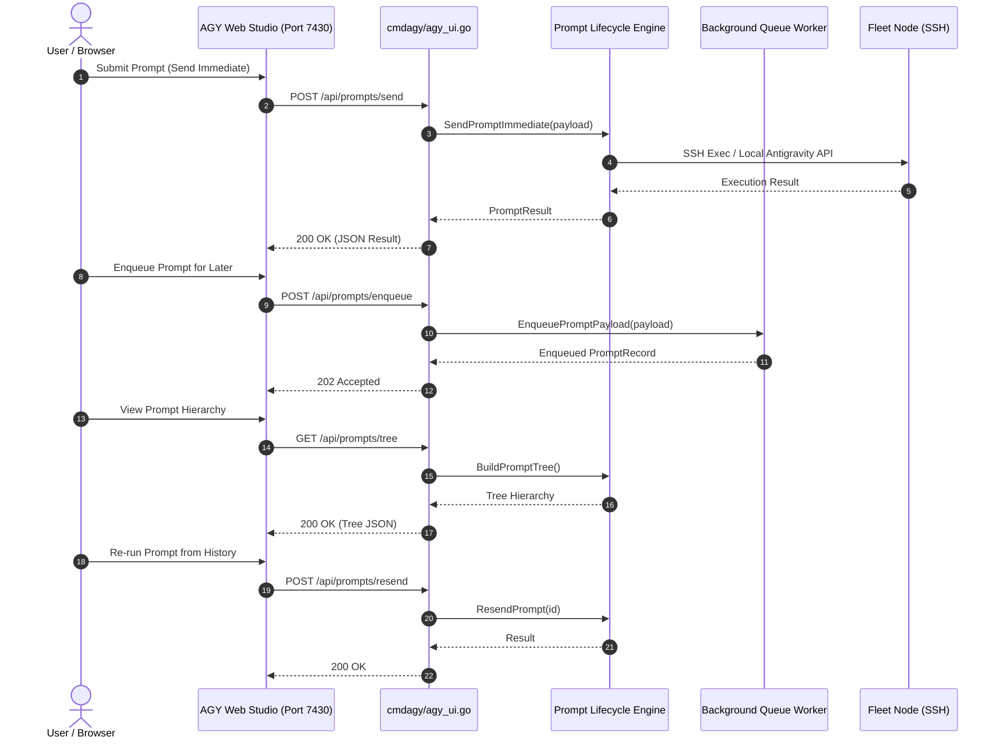
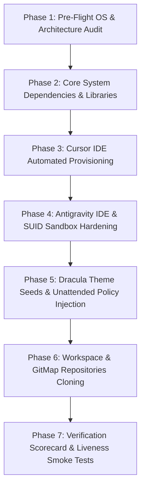

# Component & Fleet Specification: Privacy Scrubbing, AGY Prompt Lifecycle Operations, and Cursor CLI Subsystem

> **Spec Sequence:** 218-02  
> **Status:** `approved`  
> **Traceability:** Task-04, Task-05, Task-06  
> **Parent Spec:** [01-architecture-spec.md](./01-architecture-spec.md)  
> **Created:** 2026-10-05  
> **Target Subsystems:**
> - Privacy & Path Sanitization Engine: Batch sanitization across 31 documentation and plan files
> - Antigravity Web Studio UI & API: `cli/cmdagy/agy_ui.go`, `cli/cmdagy/agy_ui_html.go`, `cli/cmdagy/agy_prompt_lifecycle.go`
> - Cursor CLI Subsystem: `cli/cmdcursor/cursor_settings.go`, `cli/cmdcursor/cursor_install.go`, `cli/cmdcursor/cursor_sync.go`
> - Fleet Provisioning Automation: `03-ai-scripts/40-ubuntu-cursor-and-agy-fleet-setup.ps1` and `.sh`

---

## 1. High-Level Architecture & Component Map

This specification defines the concrete implementations, data structures, REST endpoints, CLI interfaces, and automation blueprints for the second wave of Task 218:

```mermaid
flowchart TD
    subgraph Privacy_Engine ["1. Privacy & Portable Path Scrubbing"]
        Matrix["Sanitization Matrix\n(Raw IPs -> Aliases, Abs Paths -> Relative)"]
        BatchScrub["31 Identified MD Files\n(02-spec/21-app/, .ai-memory/plans/)"]
        Linter["CI Leak Prevention Guard\n(pre-commit regex checks)"]
        Matrix --> BatchScrub --> Linter
    end

    subgraph AGY_Web_Studio ["2. AGY UI Full Prompt Lifecycle (:7430)"]
        Mux["HTTP Mux (cli/cmdagy/agy_ui.go)"]
        SendHandler["POST /api/prompts/send"]
        EnqueueHandler["POST /api/prompts/enqueue"]
        TreeHandler["GET /api/prompts/tree"]
        HistoryHandler["GET /api/prompts/history"]
        SaveHandler["POST /api/prompts/save"]
        ResendHandler["POST /api/prompts/resend"]
        Worker["Background Queue Worker\n(Concurrency Pool + Split-DB)"]
        WebUI["Dark Studio UI (agy_ui_html.go)\nDracula Theme #19191C / #BD93F9"]

        Mux --> SendHandler & EnqueueHandler & TreeHandler & HistoryHandler & SaveHandler & ResendHandler
        EnqueueHandler --> Worker
        WebUI --> Mux
    end

    subgraph Cursor_Subsystem ["3. Cursor CLI Subsystem (cmdcursor)"]
        CursorCmd["gitmap cursor / cur"]
        SettingsCmd["settings [view|apply|sync]"]
        InstallCmd["install [--node <alias>]"]
        SyncCmd["sync (Project Manager)"]
        OpenCmd["open [repo]"]

        CursorCmd --> SettingsCmd & InstallCmd & SyncCmd & OpenCmd
    end

    subgraph Fleet_Provisioning ["4. Ubuntu Provisioning Automation"]
        ScriptPS1["03-ai-scripts/40-ubuntu-cursor-and-agy-fleet-setup.ps1"]
        ScriptSH["03-ai-scripts/40-ubuntu-cursor-and-agy-fleet-setup.sh"]
        Phases["7-Phase Architecture\n(Deps, Cursor, Antigravity, Theme, Workspace, Verification)"]

        ScriptPS1 --> Phases
        ScriptSH --> Phases
    end
```



---

## 2. Privacy & Portable Path Scrubbing Architecture

### 2.1 Problem Statement & Zero-Trust Hygiene

During recent automated task executions, multiple plan and specification documents recorded local workstation artifacts, specifically:
1. Hardcoded private IPv4 addresses (e.g., `node-u1`, `node-main`, `node-main`) used for SSH testing.
2. Workstation-specific absolute filesystem paths (e.g., `./gitmap`, `./...`, `%USERPROFILE%\...`, `/home/a/...`).

This violates the following architectural invariants:
- **Zero Privacy Leaks:** Internal IP topologies must never be committed to repository documentation or shared memory plans.
- **Portability:** Specifications and plans must be platform-agnostic, executable on any workstation or remote node without path breakage.
- **Hermetic Memory Hygiene:** `.ai-memory/` plans must use canonical environment variable references (`$WORKSPACE_ROOT`, `$HOME`, `~`).

### 2.2 Canonical Replacement Matrix

The sanitization engine applies the following deterministic substitutions:

| Leaked Value Pattern | Replacement Alias / Token | Context / Rationale |
| :--- | :--- | :--- |
| `node-u1` | `ubuntu-fleet-01` (or `node-u1`) | Primary remote Ubuntu workstation node |
| `node-main` | `node-main` (or `localhost`) | Workstation server / local orchestrator |
| `node-main` | `worker-1` (or `node-u2`) | Secondary Linux cluster node |
| `gateway-node4` | `devbox` | Developer workstation alias |
| `node-w1` | `node-w1` | Windows cluster node 1 |
| `node-w2` | `node-w2` | Windows cluster node 2 |
| `node-w3` | `node-w3` | Windows cluster node 3 |
| `./gitmap` / `./gitmap` | `$WORKSPACE_ROOT` | Current repository root |
| `./` / `./` | `$WORKSPACE_DIR/` | Work directory parent |
| `d:\\work\\` / `D:\\work\\` | `$WORKSPACE_DIR/` | Escaped Windows backslashes |
| `C:\Users\Administrator` | `<user-home>` or `$USERPROFILE` | Windows Administrator home |
| `/home/a/` | `$HOME/` or `~/` | Remote Linux user home |
| `/home/a/git-work` | `$HOME/git-work` | Remote Git workspace directory |

### 2.3 Inventory of 31 Files for Batch Scrubbing

The 31 files identified across `02-spec/21-app/` and `.ai-memory/plans/` that must be purged of raw IPs and absolute paths are:

| # | Relative Path | Target Leak Categories |
| :--- | :--- | :--- |
| 01 | `02-spec/21-app/211-ubuntu-fleet-git-clone-and-os-customization/01-architecture-spec.md` | Raw IP (`node-u1`), `/home/a/`, `d:\work` |
| 02 | `02-spec/21-app/211-ubuntu-fleet-git-clone-and-os-customization/02-component-spec.md` | Raw IP (`node-u1`), `/home/a/` |
| 03 | `02-spec/21-app/211-ubuntu-fleet-git-clone-and-os-customization/02-full-os-setup-blueprint.md` | Raw IP (`node-u1`), `/home/a/` |
| 04 | `02-spec/21-app/212-ubuntu-fleet-full-customization-and-embedded-runner/01-architecture-spec.md` | Raw IP (`node-u1`), `/home/a/`, `d:\work` |
| 05 | `02-spec/21-app/212-ubuntu-fleet-full-customization-and-embedded-runner/02-full-os-setup-blueprint.md` | Raw IP (`node-u1`), `/home/a/` |
| 06 | `02-spec/21-app/213-antigravity-ubuntu-update-and-macro-automation/01-architecture-spec.md` | Raw IP (`node-u1`), `/home/a/` |
| 07 | `02-spec/21-app/213-antigravity-ubuntu-update-and-macro-automation/02-gitmap-macro-and-installer-spec.md` | Raw IP (`node-u1`), `/home/a/` |
| 08 | `02-spec/21-app/213-antigravity-ubuntu-update-and-macro-automation/03-in-app-update-button-rca.md` | Raw IP (`node-u1`), `/home/a/` |
| 09 | `02-spec/21-app/214-ubuntu-fleet-automation-and-workstation-governance/01-architecture-spec.md` | Raw IP (`node-u1`), `/home/a/`, `d:\work` |
| 10 | `02-spec/21-app/214-ubuntu-fleet-automation-and-workstation-governance/02-component-and-cli-spec.md` | Raw IP (`node-u1`), `/home/a/`, `d:\work` |
| 11 | `02-spec/21-app/215-ubuntu-fleet-cleanup-antigravity-projects-and-app-manager/01-architecture-spec.md` | Raw IP (`node-u1`), `/home/a/`, `d:\work` |
| 12 | `02-spec/21-app/215-ubuntu-fleet-cleanup-antigravity-projects-and-app-manager/02-component-and-cli-spec.md` | Raw IP (`node-u1`), `/home/a/`, `d:\work` |
| 13 | `02-spec/21-app/216-gitmap-prompting-freeze-and-suggestion-engine-fix/01-architecture-spec.md` | Absolute paths `d:\work` |
| 14 | `02-spec/21-app/217-antigravity-fleet-parity-theme-preset-plugins-and-delegation/01-architecture-spec.md` | Absolute paths `d:\work`, `/home/a/` |
| 15 | `02-spec/21-app/217-antigravity-fleet-parity-theme-preset-plugins-and-delegation/02-component-and-cli-spec.md` | Absolute paths `d:\work`, `/home/a/` |
| 16 | `02-spec/21-app/182-version-pinning-macro-deploy-ui-settings-secret-flags.md` | Absolute paths `d:\work` |
| 17 | `.ai-memory/plans/214-ubuntu-fleet-automation-and-workstation-governance.md` | Raw IP (`node-u1`), `/home/a/`, `d:\work` |
| 18 | `.ai-memory/plans/217-antigravity-fleet-parity-theme-preset-plugins-and-delegation.md` | Absolute paths `d:\work`, `/home/a/` |
| 19 | `.ai-memory/plans/218-nodes-agy-ui-remote-settings-and-cursor-automation.md` | Raw IP (`node-u1`, `node-main`), `d:\work` |
| 20 | `.ai-memory/plans/completed/215-ubuntu-fleet-cleanup-antigravity-projects-and-app-manager.md` | Raw IP (`node-u1`), `/home/a/`, `d:\work` |
| 21 | `.ai-memory/plans/completed/217-antigravity-fleet-parity-theme-preset-plugins-and-delegation.md` | Raw IP (`node-u1`), `/home/a/`, `d:\work` |
| 22 | `.ai-memory/plans/subtasks/212-ubuntu-fleet-full-customization-and-embedded-runner/01-desktop-wallpaper-and-gui-app-launch.md` | Raw IP (`node-u1`), `/home/a/` |
| 23 | `.ai-memory/plans/subtasks/212-ubuntu-fleet-full-customization-and-embedded-runner/02-vmware-shared-folder-deep-verification.md` | Raw IP (`node-u1`), `/home/a/` |
| 24 | `.ai-memory/plans/subtasks/212-ubuntu-fleet-full-customization-and-embedded-runner/03-antigravity-deep-conversation-and-settings-sync.md` | Raw IP (`node-u1`), `/home/a/` |
| 25 | `.ai-memory/plans/subtasks/212-ubuntu-fleet-full-customization-and-embedded-runner/04-self-contained-embedded-powershell-runner.md` | Raw IP (`node-u1`), `/home/a/` |
| 26 | `.ai-memory/plans/subtasks/212-ubuntu-fleet-full-customization-and-embedded-runner/05-detailed-engineering-log-and-future-roadmap.md` | Absolute paths `d:\work`, `/home/a/` |
| 27 | `.ai-memory/plans/subtasks/214-ubuntu-fleet-automation-and-workstation-governance/01-git-workspaces-clone-and-validation.md` | Raw IP (`node-u1`), `/home/a/` |
| 28 | `.ai-memory/plans/subtasks/214-ubuntu-fleet-automation-and-workstation-governance/02-gnome-ergonomics-and-keybindings.md` | Raw IP (`node-u1`), `/home/a/` |
| 29 | `.ai-memory/plans/subtasks/214-ubuntu-fleet-automation-and-workstation-governance/03-vmware-automount-and-gui-launching.md` | Raw IP (`node-u1`), `/home/a/` |
| 30 | `.ai-memory/plans/subtasks/214-ubuntu-fleet-automation-and-workstation-governance/04-antigravity-upgrade-and-deep-brain-migration.md` | Raw IP (`node-u1`), `/home/a/` |
| 31 | `.ai-memory/plans/subtasks/214-ubuntu-fleet-automation-and-workstation-governance/05-master-embedded-runner-and-scorecard.md` | Raw IP (`node-u1`), `/home/a/` |

### 2.4 Automated Leak Prevention Checker

To ensure no future regressions occur, the implementation defines an automated verification rule in `03-ai-scripts/49-verify-privacy-and-relative-paths.py` checking for:
- IPv4 regex: `\b(192\.168\.\d{1,3}\.\d{1,3}|10\.\d{1,3}\.\d{1,3}\.\d{1,3}|172\.(1[6-9]|2[0-9]|3[0-1])\.\d{1,3}\.\d{1,3})\b`
- Windows drive letter regex: `\b[A-Za-z]:[\\/](?:work|Users|dev|gitmap)\b`
- Linux hardcoded home regex: `\b/home/[a-z0-9_-]+/(?:git-work|gitmap|\.gemini)\b`

---

## 3. AGY UI Full Prompt Lifecycle Management

### 3.1 Web Studio Architecture & Endpoint Specifications

The Antigravity Studio Web UI (`gitmap nodes agy ui`, port 7430) serves as the central command cockpit for managing prompts across projects and fleet nodes. The HTTP service in `cli/cmdagy/agy_ui.go` exposes the following REST API:



### 3.2 Detailed API Endpoints & Request/Response Contracts

#### 1. `POST /api/prompts/send`
- **Purpose:** Immediate dispatch of a prompt to an active project workspace.
- **Request Body (`PromptPayload`):**
  ```json
  {
    "projectName": "gitmap",
    "targetNode": "node-u1",
    "promptText": "Run retrospective AI verification and check guideline compliance",
    "taskCategory": "verification",
    "isUrgent": true
  }
  ```
- **Response Body (`PromptResult`):**
  ```json
  {
    "promptId": "p-20261005-8491",
    "status": "delivered",
    "targetNode": "node-u1",
    "projectName": "gitmap",
    "dispatchedAt": "2026-10-05T03:30:00Z",
    "executionPid": 84129,
    "outputPreview": "Verification engine triggered on node-u1..."
  }
  ```

#### 2. `POST /api/prompts/enqueue`
- **Purpose:** Asynchronously queue a prompt when the target project/node is busy or offline.
- **Request Body:** Same as `PromptPayload` plus optional `"delaySeconds": 60`.
- **Response Body (`PromptRecord`):**
  ```json
  {
    "id": "q-90214",
    "status": "queued",
    "queuePosition": 1,
    "projectName": "gitmap",
    "targetNode": "node-u1",
    "promptText": "Perform code hygiene check on cli/cmdcursor/",
    "createdAt": "2026-10-05T03:31:00Z"
  }
  ```

#### 3. `GET /api/prompts/tree`
- **Purpose:** Hierarchical visualization of all prompts grouped by node, project, and lifecycle state.
- **Response Body (`PromptTreeResponse`):**
  ```json
  {
    "totalActive": 3,
    "totalQueued": 2,
    "nodes": [
      {
        "nodeAlias": "node-main",
        "isOnline": true,
        "projects": [
          {
            "projectName": "gitmap",
            "workspacePath": "$WORKSPACE_ROOT",
            "activePrompts": [
              {
                "id": "p-101",
                "text": "Author Spec 02 and Subtasks 04-06",
                "state": "running",
                "elapsedSeconds": 45
              }
            ],
            "queuedPrompts": []
          }
        ]
      },
      {
        "nodeAlias": "node-u1",
        "isOnline": true,
        "projects": [
          {
            "projectName": "gitmap-remote",
            "workspacePath": "$HOME/git-work/gitmap",
            "activePrompts": [],
            "queuedPrompts": [
              {
                "id": "q-90214",
                "text": "Perform code hygiene check on cli/cmdcursor/",
                "state": "pending"
              }
            ]
          }
        ]
      }
    ]
  }
  ```

#### 4. `GET /api/prompts/history`
- **Purpose:** Query paginated audit log of executed prompts across the fleet.
- **Query Params:** `?limit=50&project=gitmap&node=node-u1`.
- **Response Body:** Array of `PromptRecord` sorted descending by completion timestamp.

#### 5. `POST /api/prompts/save`
- **Purpose:** Save a prompt as a reusable template.
- **Request Body:**
  ```json
  {
    "title": "Full Parity Sync & Verification",
    "category": "maintenance",
    "promptText": "Execute gitmap nodes sync-settings and run full scorecard verification",
    "tags": ["sync", "scorecard", "ubuntu"]
  }
  ```

#### 6. `POST /api/prompts/resend`
- **Purpose:** Re-dispatch an existing prompt from history or retry a failed prompt.
- **Request Body:**
  ```json
  {
    "promptId": "p-20261005-8491",
    "overrideNode": "node-u2",
    "isUrgent": true
  }
  ```
- **Response Body:** New `PromptResult` confirming re-dispatch.

### 3.3 Data Contracts & Go Type System

The following typed structs are defined in `cli/cmdagy/agy_prompt_lifecycle.go`:

```go
package cmdagy

import "time"

// PromptPayload captures the incoming prompt submission.
type PromptPayload struct {
	ProjectName  string `json:"projectName"`
	TargetNode   string `json:"targetNode"`
	PromptText   string `json:"promptText"`
	TaskCategory string `json:"taskCategory"`
	IsUrgent     bool   `json:"isUrgent"`
	DelaySeconds int    `json:"delaySeconds,omitempty"`
}

// PromptResult represents the execution outcome of an immediate prompt.
type PromptResult struct {
	PromptID      string    `json:"promptId"`
	Status        string    `json:"status"` // delivered, executing, completed, failed
	TargetNode    string    `json:"targetNode"`
	ProjectName   string    `json:"projectName"`
	DispatchedAt  time.Time `json:"dispatchedAt"`
	ExecutionPID  int       `json:"executionPid,omitempty"`
	OutputPreview string    `json:"outputPreview,omitempty"`
	ErrorMessage  string    `json:"errorMessage,omitempty"`
}

// PromptRecord stores the durable state of a prompt in memory and DB.
type PromptRecord struct {
	ID            string    `json:"id"`
	Status        string    `json:"status"` // queued, running, completed, failed
	QueuePosition int       `json:"queuePosition"`
	ProjectName   string    `json:"projectName"`
	TargetNode    string    `json:"targetNode"`
	PromptText    string    `json:"promptText"`
	CreatedAt     time.Time `json:"createdAt"`
	CompletedAt   time.Time `json:"completedAt,omitempty"`
}

// PromptResendRequest encapsulates parameters to retry or clone a prompt.
type PromptResendRequest struct {
	PromptID     string `json:"promptId"`
	OverrideNode string `json:"overrideNode,omitempty"`
	IsUrgent     bool   `json:"isUrgent"`
}

// PromptTreeResponse provides the nested hierarchy of prompts by node and project.
type PromptTreeResponse struct {
	TotalActive int              `json:"totalActive"`
	TotalQueued int              `json:"totalQueued"`
	Nodes       []NodePromptTree `json:"nodes"`
}

// NodePromptTree represents a node and its nested projects.
type NodePromptTree struct {
	NodeAlias string                 `json:"nodeAlias"`
	IsOnline  bool                   `json:"isOnline"`
	Projects  []ProjectPromptSummary `json:"projects"`
}

// ProjectPromptSummary contains the prompt details for a specific project.
type ProjectPromptSummary struct {
	ProjectName   string         `json:"projectName"`
	WorkspacePath string         `json:"workspacePath"`
	ActivePrompts []PromptRecord `json:"activePrompts"`
	QueuedPrompts []PromptRecord `json:"queuedPrompts"`
}
```

### 3.4 Background Queue Execution Worker

To prevent UI blocking and handle offline nodes gracefully, `RunPromptQueueWorker` runs continuously in the background:
1. **Poll Interval:** Ticks every 2 seconds inspecting `.ai-memory/temp/agy-prompt-queue.json`.
2. **Concurrency Limit:** Max 2 concurrent remote SSH prompt dispatches.
3. **Liveness Check:** Before dispatching to a remote node, validates connectivity via cached node status (`node.IsOnline`).
4. **State Transitions:** `queued` $\to$ `running` $\to$ `completed` (or `failed` after 3 retries).
5. **Persistence:** Completed records move to `.ai-memory/temp/agy-prompt-history.json` and are recorded in SQLite split-db.

### 3.5 Web Studio UI Styling & Component Specification

The HTML dashboard in `cli/cmdagy/agy_ui_html.go` features:
- **Palette:** Dracula Dark theme (`#19191C` background, `#282A36` card surfaces, `#BD93F9` primary buttons and tabs, `#50FA7B` green status pill, `#FF5555` error alerts).
- **Navigation Tabs:**
  - `[Dashboard]` Fleet nodes, running projects, CPU/memory telemetry.
  - `[Prompt Composer]` Project selector dropdown, target node picker, prompt textarea, `[Send Immediate]`, `[Enqueue]`, `[Save Template]`.
  - `[Prompt Tree]` Collapsible interactive tree by node and workspace.
  - `[Queue & History]` Real-time queue table with drag-and-drop priority reordering and `[Resend]` button on each history entry.

---

## 4. Cursor CLI Subsystem (`cmdcursor`)

### 4.1 Subsystem Role & Command Hierarchy

Cursor IDE is a primary developer tool alongside Google Antigravity. GitMap provides native CLI commands to inspect settings, apply standardized themes and configurations, synchronize Project Manager entries, and automate installation across platforms.

```text
Usage:
  gitmap cursor <subcommand> [flags]
  gitmap cur <subcommand> [flags]

Subcommands:
  settings [view|apply|sync]    Manage Cursor user configuration, rules, and extensions
  install [--node <alias>]       Automate Cursor installation (Windows winget / Ubuntu AppImage)
  sync                          Synchronize GitMap repository registry with Cursor Project Manager
  open [target]                 Launch workspace or repository in Cursor IDE
  help                          Display command reference
```

### 4.2 `gitmap cursor settings` Specification

The settings manager operates on Cursor's `User/settings.json`:
- **Windows Path:** `%APPDATA%\Cursor\User\settings.json`
- **Linux Path:** `$HOME/.config/Cursor/User/settings.json`
- **macOS Path:** `$HOME/Library/Application Support/Cursor/User/settings.json`

#### Subcommand Actions:
1. **`gitmap cursor settings view`:**
   - Displays currently configured settings in formatted JSON with syntax highlighting.
   - Highlights key configuration values: theme name, font family, auto-save mode, AI indexing state.
2. **`gitmap cursor settings apply`:**
   - Injects standardized developer baseline settings:
     ```json
     {
       "workbench.colorTheme": "Dracula Theme",
       "editor.fontFamily": "'JetBrains Mono', 'Fira Code', Consolas, monospace",
       "editor.fontSize": 14,
       "files.autoSave": "afterDelay",
       "files.autoSaveDelay": 1000,
       "files.eol": "\n",
       "files.insertFinalNewline": true,
       "files.trimTrailingWhitespace": true,
       "editor.renderWhitespace": "selection"
     }
     ```
   - Automatically backs up existing settings to `settings.json.bak.<timestamp>`.
3. **`gitmap cursor settings sync [node]`:**
   - Transmits local Cursor configuration over SSH to target remote node (e.g. `node-u1`), ensuring cross-OS workstation parity.

### 4.3 `gitmap cursor install` Specification

The installer provides unattended, zero-interaction setup for Cursor IDE:

#### Windows Automation:
1. Detects Windows operating system.
2. Checks if `winget` is available:
   - If available: runs `winget install Anysphere.Cursor --silent --accept-source-agreements --accept-package-agreements`.
   - If `winget` unavailable: downloads official installer executable `CursorSetup-x64.exe` to temporary folder and executes silent installation.
3. Verifies `cursor.cmd` or `cursor.exe` is added to system `PATH`.

#### Ubuntu / Linux Automation:
1. Installs mandatory prerequisites: `libfuse2`, `libnss3`, `libasound2`, `libgbm1`, `wget`, `jq`.
2. Fetches latest Cursor AppImage from official download endpoint (`https://downloader.cursor.sh/linux/appImage/x64`).
3. Installs binary to `/opt/cursor/cursor.AppImage` (or `~/.local/bin/cursor`).
4. Applies execute permissions: `chmod +x /opt/cursor/cursor.AppImage`.
5. Creates system symlink: `/usr/local/bin/cursor` $\to$ `/opt/cursor/cursor.AppImage`.
6. Generates standard desktop launcher `/usr/share/applications/cursor.desktop`:
   ```ini
   [Desktop Entry]
   Name=Cursor
   Exec=/opt/cursor/cursor.AppImage --no-sandbox %F
   Icon=/opt/cursor/cursor.png
   Type=Application
   Categories=Development;IDE;
   Terminal=false
   StartupWMClass=Cursor
   ```

#### Remote Fleet Delegation (`--node <alias>`):
- When `--node <alias>` is specified (e.g., `gitmap cursor install --node node-u1`), GitMap streams the installation runner over SSH to execute elevated installation remotely and reports exit code telemetry.

### 4.4 Internal Source File Budget & SRP Separation

In strict compliance with repository coding guidelines (<100 lines per file, SRP separation), `cmdcursor` is partitioned into:

| File Path | Responsibilities | Line Budget |
| :--- | :--- | :--- |
| `cli/cmdcursor/cursor_cmd.go` | Subcommand routing (`open`, `sync`, `settings`, `install`) | < 80 lines |
| `cli/cmdcursor/cursor_types.go` | Struct definitions (`CursorSettings`, `ProjectManagerEntry`) | < 70 lines |
| `cli/cmdcursor/cursor_settings.go` | View, apply, and sync logic for `User/settings.json` | < 95 lines |
| `cli/cmdcursor/cursor_install.go` | Windows winget and Linux AppImage installer logic | < 95 lines |
| `cli/cmdcursor/cursor_sync.go` | Bidirectional sync with Project Manager `projects.json` | < 95 lines |
| `cli/cmdcursor/cursor_open.go` | CLI workspace launcher and path resolution | < 60 lines |

---

## 5. Ubuntu Fleet Setup Automation Blueprint (`03-ai-scripts/40-...`)

### 5.1 Script Metadata & Scope

- **Primary Script:** `03-ai-scripts/40-ubuntu-cursor-and-agy-fleet-setup.ps1`
- **Companion Script:** `03-ai-scripts/40-ubuntu-cursor-and-agy-fleet-setup.sh`
- **Execution Target:** Remote Ubuntu/Debian fleet nodes (`node-u1`, `node-u2`) via SSH or local console.
- **Idempotency:** Re-running the script skips already-installed packages, preserves existing custom configs via backups, and verifies health.

### 5.2 The 7-Phase Execution Architecture



#### Detailed Phase Specifications:

#### Phase 1: Pre-Flight OS & Architecture Audit
- Validates Debian/Ubuntu distribution (`/etc/os-release` contains `ID=ubuntu` or `ID=debian`).
- Confirms x86_64 (`amd64`) architecture.
- Validates passwordless or accessible `sudo` privileges.
- Verifies Internet reachability to GitHub, Google, and Cursor CDNs.

#### Phase 2: Core System Dependencies & Libraries
- Updates package indexes: `sudo apt-get update -y`.
- Installs critical GUI/Electron libraries:
  ```bash
  sudo apt-get install -y \
      libfuse2 \
      libnss3 \
      libasound2 \
      libgbm1 \
      libxss1 \
      libatk-bridge2.0-0 \
      libgtk-3-0 \
      wget \
      curl \
      jq \
      unzip \
      git
  ```

#### Phase 3: Cursor IDE Automated Provisioning
- Downloads Linux AppImage to `/tmp/cursor.AppImage`.
- Moves to permanent location `/opt/cursor/cursor.AppImage`.
- Makes executable: `chmod +x /opt/cursor/cursor.AppImage`.
- Symlinks to `/usr/local/bin/cursor`.
- Injects desktop launcher `/usr/share/applications/cursor.desktop` with `--no-sandbox`.
- Creates user storage directory `~/.config/Cursor/User/`.

#### Phase 4: Antigravity IDE & SUID Sandbox Hardening
- Verifies Antigravity binary at `/home/a/.local/share/antigravity-ide/antigravity`.
- Hardens Chrome sandbox binary:
  ```bash
  CHROME_SANDBOX="/home/a/.local/share/antigravity-ide/chrome-sandbox"
  if [ -f "$CHROME_SANDBOX" ]; then
      sudo chown root:root "$CHROME_SANDBOX"
      sudo chmod 4755 "$CHROME_SANDBOX"
  fi
  ```
- Creates launcher wrapper `/usr/local/bin/antigravity` ensuring clean environment flags.

#### Phase 5: Dracula Theme Seeds & Unattended Policy Injection
- Injects Dracula Dark theme into Cursor:
  - `"workbench.colorTheme": "Dracula Theme"`
- Injects Dracula Dark seeds into Antigravity `~/.gemini/config/config.json`:
  - `"background": "#19191C"`, `"primary": "#BD93F9"`, `"foregroundOverride": "#F8F8F2"`
- Injects Unattended Turbo execution policy:
  - `"autoExecutionPolicy": "CASCADE_COMMANDS_AUTO_EXECUTION_EAGER"`
  - `"browserJsExecutionPolicy": "BROWSER_JS_EXECUTION_POLICY_TURBO"`
  - `"artifactReviewMode": "ARTIFACT_REVIEW_MODE_TURBO"`

#### Phase 6: Workspace & GitMap Repositories Cloning
- Creates workspace root: `mkdir -p $HOME/git-work`.
- Clones primary repository if absent:
  - `git clone https://github.com/alimtvnetwork/gitmap-v28.git $HOME/git-work/gitmap`
- Registers workspace in Cursor Project Manager `projects.json`.
- Registers workspace in Antigravity `~/.gemini/config/projects/`.

#### Phase 7: Verification Scorecard & Liveness Smoke Tests
- Executes binary smoke test: `cursor --version` and `antigravity --version` (or headless probe).
- Verifies zero stray Windows paths in `$HOME`:
  - `find $HOME -maxdepth 1 -name "C:*" -o -name "c:*"` must return 0 results.
- Outputs ANSI-colored verification scorecard to console.

### 5.3 Script Parameter Reference Schema

The PowerShell script `03-ai-scripts/40-ubuntu-cursor-and-agy-fleet-setup.ps1` accepts:

```powershell
[CmdletBinding()]
param(
    [Parameter(Position = 0)]
    [string]$TargetHost = "node-u1",

    [Parameter(Position = 1)]
    [string]$TargetUser = "a",

    [Parameter()]
    [switch]$InstallCursor = $true,

    [Parameter()]
    [switch]$InstallAntigravity = $true,

    [Parameter()]
    [switch]$ApplyDraculaTheme = $true,

    [Parameter()]
    [switch]$SyncWorkspaces = $true,

    [Parameter()]
    [switch]$HardensSandbox = $true,

    [Parameter()]
    [switch]$DryRun,

    [Parameter()]
    [switch]$Force
)
```

---

## 6. Verification & Acceptance Criteria

- [ ] **AC-SPEC-01 (Privacy Scrubbing Matrix):**
  - All 31 identified specification and plan files are completely scrubbed of raw IP addresses (`node-u1`, `node-main`, etc.) and hardcoded Windows/Linux absolute paths (`./`, `/home/a/...`).
  - Automated regex linter reports 0 privacy violations across `02-spec/` and `.ai-memory/plans/`.

- [ ] **AC-SPEC-02 (AGY UI Full Lifecycle Endpoints):**
  - Web Studio HTTP server binds to port 7430 and cleanly routes `/api/prompts/send`, `/api/prompts/enqueue`, `/api/prompts/tree`, `/api/prompts/history`, `/api/prompts/save`, and `/api/prompts/resend`.
  - Enqueued prompts are asynchronously processed by background queue worker with concurrency bounds.

- [ ] **AC-SPEC-03 (AGY UI Interactive Dashboard):**
  - Dark HTML dashboard renders running prompt trees, allows immediate dispatch to selected projects, displays active queue position, and enables single-click resending.

- [ ] **AC-SPEC-04 (Cursor CLI Settings):**
  - `gitmap cursor settings view` inspects current settings.
  - `gitmap cursor settings apply` injects Dracula theme seeds and editor standards.
  - `gitmap cursor settings sync <node>` deploys settings to remote node over SSH.

- [ ] **AC-SPEC-05 (Cursor CLI Automated Install):**
  - `gitmap cursor install` executes unattended winget installation on Windows and automated AppImage provisioning on Ubuntu.
  - Remote delegation `gitmap cursor install --node <alias>` installs Cursor on the target node.

- [ ] **AC-SPEC-06 (Ubuntu Setup Script Blueprint):**
  - `03-ai-scripts/40-ubuntu-cursor-and-agy-fleet-setup.ps1` and `.sh` implement all 7 phases idempotently, resolving `libfuse2`, `libnss3`, Dracula themes, and SUID sandbox hardening.
