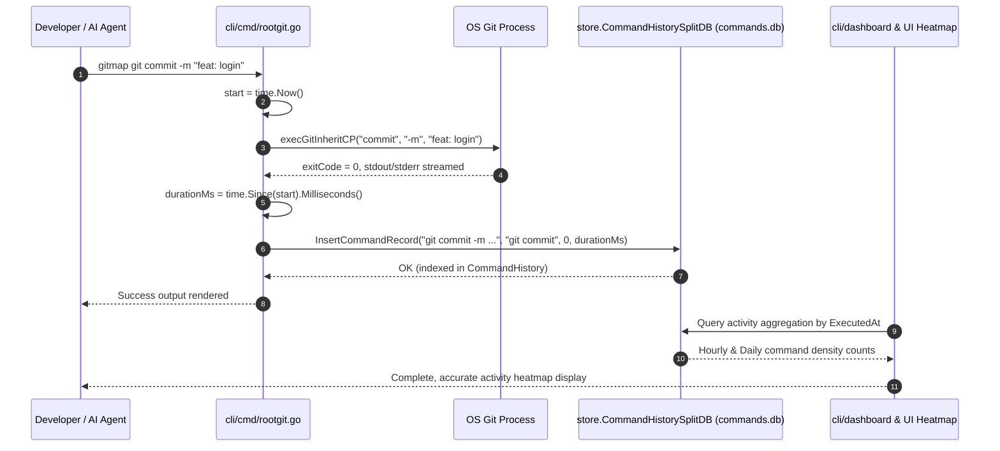

# Component & Search Specification: Git Command Split-DB Heatmap Tracing, AUM Search Quote Optimization & Remote Verification

> **Spec ID:** 223-ubuntu-cursor-gitmap-python-git-tracing-and-aum-search  
> **Document:** 02-component-and-search-spec.md  
> **Status:** Approved / Active  
> **Parent Ledger:** [00-master-audit-ledger.md](./00-master-audit-ledger.md)  
> **Related Architecture Spec:** [01-architecture-spec.md](./01-architecture-spec.md)  
> **Target Subsystems:** `cli/cmd/rootgit.go`, `cli/cmd/commit_push.go`, `cli/store/command_history_split_db.go`, `cli/cmdautomation/search.go`, `cli/cmdautomation/automation_cmd.go`  

---

## 1. Executive Summary & Problem Statements

This specification establishes the technical implementation details for three critical subsystems in GitMap:

1. **Git Command Split-DB Heatmap Tracing:**
   - **Deficiency:** Currently, raw git passthrough commands dispatched through `gitmap git <command>` in `cli/cmd/rootgit.go` (`runGitPassthrough`) and internal commit/push executions in `cli/cmd/commit_push.go` bypass execution duration measurement and command logging into the Split-DB `commands.db`. As a result, developer activity heatmaps in `cli/dashboard/` and analytics tools fail to reflect raw git activity.
   - **Solution:** Introduce execution duration measurement, repository context capture, exit code extraction, and persistent telemetry logging directly into `store.CommandHistorySplitDB` (`commands.db`) via `InsertCommandRecord` for all git passthrough and commit-push actions.

2. **AUM Search Quote Stripping & Agent Optimization:**
   - **Deficiency:** Autonomous AI agents and terminal wrappers routinely quote or double-escape search patterns (e.g. `gitmap aum search "\"all\""` or `gitmap aum search "'search term'"`). Because `cli/cmdautomation/automation_cmd.go` directly assigns `args[0]` into `searchOpts.Pattern` without quote normalization, `search_worker.go` searches for the literal quotation mark characters, yielding zero matches and stranding agent workflows.
   - **Solution:** Implement a resilient pattern normalizer (`cleanSearchPattern`) in `cli/cmdautomation/search.go` and `cli/cmdautomation/automation_cmd.go` that strips matching outer single/double quotes, escaped quotation marks, and unescapes internal characters while preserving literal expressions when required.

3. **Remote Fleet Testing, Linter Gates & Release Ceremony:**
   - **Requirement:** Ensure end-to-end verification of Cursor IDE on Ubuntu node `u1` via `gitmap ssh exec u1 "cursor --version"`, enforce zero-defect quality gates across Python linters, execute a minor version bump to `v6.483.0`, and monitor pipeline execution with `gitmap pe -t`.

---

## 2. Subsystem 1: Git Command Split-DB Heatmap Tracing

### 2.1 Problem Analysis in Existing Git Routing
In `cli/cmd/rootgit.go`, transparent CLI routing delegates git commands:
- High-level GitMap commands (`pull`, `pull-all`, `gitignore-agm`) are routed to specialized handlers.
- All standard Git commands (`status`, `diff`, `log`, `branch`, `checkout`, `fetch`, `rebase`, etc.) fall through to `runGitPassthrough(args)`:
  ```go
  func runGitPassthrough(args []string) error {
      err := execGitInheritCP(args...)
      if err != nil {
          return apperror.WrapSimple(err, "git passthrough failed")
      }
      return nil
  }
  ```
Neither execution start time, duration, command line, nor exit status is recorded in the Split-DB command history store. Furthermore, internal git operations executed by `cli/cmd/commit_push.go` (such as `git add -A`, `git commit -m`, `git push`, and `git pull --rebase`) run through `execGitInheritCP` and `execGitPadded` without logging to `commands.db`.

Consequently, the Developer Contribution Heatmap in `cli/dashboard/` and timeline visualizers in `src/pages/Dashboard.tsx` suffer from observability gaps, undercounting developer and agent activity.

### 2.2 Split-DB Telemetry Architecture
The Split-DB architecture maintains command execution history in a dedicated SQLite database located at:
`data/history/commands.db` (resolved via `BinaryDataDir()/history/commands.db`).

The existing schema in `cli/store/command_history_split_db.go`:
```sql
CREATE TABLE IF NOT EXISTS CommandHistory (
    CommandId INTEGER PRIMARY KEY AUTOINCREMENT,
    CommandLine TEXT NOT NULL,
    CommandName TEXT NOT NULL,
    ExitCode INTEGER NOT NULL DEFAULT 0,
    ExecutedAt TEXT NOT NULL DEFAULT CURRENT_TIMESTAMP,
    DurationMs INTEGER NOT NULL DEFAULT 0
);
CREATE INDEX IF NOT EXISTS idx_cmd_history_time ON CommandHistory(ExecutedAt DESC);
CREATE INDEX IF NOT EXISTS idx_cmd_history_line ON CommandHistory(CommandLine);
```

### 2.3 Implementation Details

#### 2.3.1 Passthrough Interceptor in `cli/cmd/rootgit.go`
The `runGitPassthrough` function is enhanced to track execution lifecycle:
```go
func runGitPassthrough(args []string) error {
    start := time.Now()
    err := execGitInheritCP(args...)
    durationMs := time.Since(start).Milliseconds()

    exitCode := 0
    if err != nil {
        exitCode = extractExitCode(err)
    }

    recordGitCommandHistory(args, exitCode, durationMs)

    if err != nil {
        return apperror.WrapSimple(err, "git passthrough failed")
    }
    return nil
}
```

#### 2.3.2 Exit Code Extractor Helper
To cleanly capture exit codes across platforms without panics or platform dependencies:
```go
func extractExitCode(err error) int {
    if err == nil {
        return 0
    }
    if exitErr, ok := err.(*exec.ExitError); ok {
        return exitErr.ExitCode()
    }
    return 1
}
```

#### 2.3.3 Asynchronous Safe Recorder: `recordGitCommandHistory`
Recording to Split-DB must be resilient and non-blocking so that database locks or filesystem anomalies never fail user git operations:
```go
func recordGitCommandHistory(gitArgs []string, exitCode int, durationMs int64) {
    if len(gitArgs) == 0 {
        return
    }
    cmdName := "git " + gitArgs[0]
    cmdLine := "git " + strings.Join(gitArgs, " ")

    histDB, err := store.OpenCommandHistorySplitDB("")
    if err != nil {
        return
    }
    defer histDB.Close()

    _ = histDB.InsertCommandRecord(cmdLine, cmdName, exitCode, durationMs)
}
```

#### 2.3.4 Commit & Push Tracing Hook in `cli/cmd/commit_push.go`
Internal Git operations executed during `commit-push`, `pull-commit-push`, `rm-git`, and `git-reset` in `cli/cmd/commit_push.go` are instrumented:
- When `performCommitPush` runs `git commit` and `git push`, record entries with `CommandName: "git commit"` and `CommandName: "git push"`.
- When `executePullCommitPush` runs `git pull --rebase`, record `CommandName: "git pull"`.
- Each record receives the exact `DurationMs` and `ExitCode`.

### 2.4 Heatmap Pipeline Flow



---

## 3. Subsystem 2: AUM Search Quote Stripping & Agent Optimization

### 3.1 Problem Analysis
Autonomous agents using tool-use interfaces (such as `run_command` in Gemini/AGY/Cursor) frequently pass escaped strings when issuing search commands:
- Command passed by agent: `gitmap aum search "\"all\""`
- Arguments received by Go `os.Args`: `args[0] = "\"all\""` or `args[0] = "\"all\""`
- In `cli/cmdautomation/automation_cmd.go`:
  ```go
  searchOpts.Pattern = args[0] // contains literal quotes
  ```
- In `cli/cmdautomation/search_worker.go`:
  ```go
  if !opts.IsRegex {
      patBytes = []byte(opts.Pattern)
      lowerBytes = []byte(strings.ToLower(opts.Pattern))
  }
  // isLineMatch checks bytes.Contains(line, ctx.patBytes)
  ```
Because `opts.Pattern` contains literal quotes, AUM search looks for `\"all\"` rather than `all`. In typical code files where `all` appears as an identifier or keyword without surrounding quotation marks, 0 hits are returned.

### 3.2 Quote Cleaning Algorithm: `cleanSearchPattern`
In `cli/cmdautomation/search.go` and `cli/cmdautomation/automation_cmd.go`, implement a pattern cleaner that unwraps outer quotation delimiters while respecting intentional inner patterns:

```go
// cleanSearchPattern removes outer wrapping quotes and shell escapes from search patterns.
func cleanSearchPattern(pattern string) string {
    trimmed := strings.TrimSpace(pattern)
    if len(trimmed) < 2 {
        return trimmed
    }

    modified := true
    for modified {
        modified = false

        // Strip outer escaped double quotes: \"pattern\"
        if strings.HasPrefix(trimmed, `\"`) && strings.HasSuffix(trimmed, `\"`) && len(trimmed) >= 4 {
            trimmed = strings.TrimSuffix(strings.TrimPrefix(trimmed, `\"`), `\"`)
            modified = true
            continue
        }

        // Strip outer double quotes: "pattern"
        if strings.HasPrefix(trimmed, `"`) && strings.HasSuffix(trimmed, `"`) && len(trimmed) >= 2 {
            trimmed = strings.TrimSuffix(strings.TrimPrefix(trimmed, `"`), `"`)
            modified = true
            continue
        }

        // Strip outer escaped single quotes: \'pattern\'
        if strings.HasPrefix(trimmed, `\'`) && strings.HasSuffix(trimmed, `\'`) && len(trimmed) >= 4 {
            trimmed = strings.TrimSuffix(strings.TrimPrefix(trimmed, `\'`), `\'`)
            modified = true
            continue
        }

        // Strip outer single quotes: 'pattern'
        if strings.HasPrefix(trimmed, `'`) && strings.HasSuffix(trimmed, `'`) && len(trimmed) >= 2 {
            trimmed = strings.TrimSuffix(strings.TrimPrefix(trimmed, `'`), `'`)
            modified = true
            continue
        }

        // Strip outer backticks: `pattern`
        if strings.HasPrefix(trimmed, "`") && strings.HasSuffix(trimmed, "`") && len(trimmed) >= 2 {
            trimmed = strings.TrimSuffix(strings.TrimPrefix(trimmed, "`"), "`")
            modified = true
            continue
        }
    }

    // Unescape internal escaped quotes passed from shell arguments
    trimmed = strings.ReplaceAll(trimmed, `\"`, `"`)
    trimmed = strings.ReplaceAll(trimmed, `\'`, `'`)

    // If stripping yielded empty string but original was non-empty, retain trimmed original
    if len(trimmed) == 0 && len(strings.TrimSpace(pattern)) > 0 {
        return strings.TrimSpace(pattern)
    }

    return trimmed
}
```

### 3.3 Integration Points
1. **CLI Command Runner (`cli/cmdautomation/automation_cmd.go`):**
   ```go
   func runSearchCmd(cmd *cobra.Command, args []string) error {
       if len(args) == 0 {
           return apperror.NewValidationError("search pattern is required")
       }
       searchOpts.Pattern = cleanSearchPattern(args[0])
       if len(args) > 1 {
           searchOpts.Dir = args[1]
       }
       res, err := RunSearch(searchOpts)
       if err != nil {
           return err
       }
       renderSearchResults(res)
       return nil
   }
   ```
2. **Search Engine Core (`cli/cmdautomation/search.go`):**
   ```go
   func validateSearchOptions(opts *SearchOptions) *apperror.AppError {
       opts.Pattern = cleanSearchPattern(opts.Pattern)
       if len(opts.Pattern) == 0 {
           return apperror.NewValidationError("search pattern is required")
       }
       ...
   }
   ```

### 3.4 Verification & Benchmark Comparison Matrix

| Test Case | Raw CLI Input | Cleaned Pattern | Expected Behavior | Verification Target |
|:---|:---|:---|:---|:---|
| **TC-SRCH-01** | `gitmap aum search "\"all\""` | `all` | Matches all occurrences of identifier `all` | Equal to unquoted query |
| **TC-SRCH-02** | `gitmap aum search "'runSearch'"` | `runSearch` | Matches function declarations and invocations | Matches `automation_cmd.go:41` |
| **TC-SRCH-03** | `gitmap aum search "\"\"test\"\""` | `test` | Unwraps double-escaped outer quotes cleanly | Non-zero hits |
| **TC-SRCH-04** | `gitmap aum search "func (s *"` | `func (s *` | Preserves valid code fragments without modification | Exact string matches in `store/` |
| **TC-SRCH-05** | `gitmap aum search -r "var\s+\w+"` | `var\s+\w+` | Regex parsing succeeds without escaping distortion | Valid regex compilation |
| **TC-SRCH-06** | `gitmap aum search "\""` | `"` | Single quote search preserved for syntax searches | Matches quote literals |

---

## 4. Subsystem 3: Remote Fleet Testing, Linter Gates & Release Ceremony

### 4.1 Remote Fleet Node `u1` Verification
- **Host Configuration:** Ubuntu node `u1` accessible via SSH (`gitmap ssh exec u1`).
- **Binary Locations:**
  - System binary: `/usr/local/bin/cursor`
  - User binary: `/home/a/.local/bin/cursor`
  - AppImage root: `/opt/cursor/cursor.AppImage`
- **Execution Verification:**
  - Execute: `gitmap ssh exec u1 "cursor --version"`
  - Verify that the executable includes `--no-sandbox` to allow headless and non-root execution in server environments.
  - Verify status output in `repo-secrets/04-ubuntu-migration/cursor-fleet-status.json`.

### 4.2 Linter Gate Architecture
Before version bumping or commit creation, three repository linters must be executed in sequence and pass with exit code `0`:

1. **Relative Paths Linter:**
   - Command: `python linter-scripts/check-relative-paths.py`
   - Purpose: Verifies zero absolute filesystem paths exist in documentation, markdown files, and specifications.
2. **Nested Ifs Linter:**
   - Command: `python linter-scripts/check-nested-ifs.py`
   - Purpose: Verifies compliance with coding guidelines restricting nested if statements in favor of guard clauses and early returns.
3. **Boolean Guidelines Linter:**
   - Command: `python linter-scripts/check-boolean-guidelines.py`
   - Purpose: Verifies positive boolean naming conventions, absence of double negatives, and adherence to boolean style rules.

### 4.3 Minor Version Bump Protocol
Following quality gate passage:
- Run: `python 03-ai-scripts/37-bump-version.py -t minor`
- Expected Version Transition: `v6.482.0` -> `v6.483.0`
- Synchronized Files:
  - `cli/constants/constants.go` (`var Version = "6.483.0"`)
  - `package.json` (`"version": "6.483.0"`)
  - `readme.md` (Badge and version headers)
  - `changelog.md` (New release header with changes)

### 4.4 Hyphen Commit & Pipeline Monitoring Ceremony
1. **Commit Message Format:**
   - Must use hyphen format: `cursor - add split-db git tracing and aum search quote cleaning`
2. **Push & Pipeline Verification:**
   - Stage, commit, and push.
   - Run: `gitmap pe -t`
   - Monitor GitHub Actions pipeline telemetry until all CI/CD status checks achieve green (`completed`, `success`).

---

## 5. Error Management & Edge Cases

| Failure Scenario | Impact | Mitigation Strategy |
|:---|:---|:---|
| Split-DB `commands.db` locked during concurrent git runs | Risk of slowing or failing git command execution | `recordGitCommandHistory` silently ignores DB open errors; never blocks or returns an error to the user during git passthrough. |
| Empty search pattern passed after quote stripping (e.g. `""`) | ValidationError in `validateSearchOptions` | Returns clear user error `apperror.NewValidationError("search pattern is required")`. |
| Regex search with escaped quotes (e.g. `-r "foo\"bar"`) | Regex syntax corruption | `cleanSearchPattern` unescapes `\"` to `"` which is standard Go `regexp` syntax for quotes inside patterns. |
| Remote node `u1` unreachable or offline | Remote verification stalls | Timeout bounded to 15 seconds; records error state in fleet status JSON rather than hanging. |

---

## 6. Acceptance Criteria

- [ ] **AC-01 (Git Split-DB Tracing):** Running `gitmap git status` records a new entry in `commands.db` with `CommandLine: "git status"`, `CommandName: "git status"`, `ExitCode: 0`, and `DurationMs > 0`.
- [ ] **AC-02 (Commit-Push Tracing):** Running `gitmap commit-push` records git sub-steps (`git add`, `git commit`, `git push`) into `store.CommandHistorySplitDB`.
- [ ] **AC-03 (Search Quote Stripping):** Running `gitmap aum search "\"all\""` returns identical hits to `gitmap aum search "all"`.
- [ ] **AC-04 (Search Single Quotes):** Running `gitmap aum search "'RunSearch'"` returns matches for `RunSearch` without error.
- [ ] **AC-05 (Search Benchmarking):** AUM Search benchmark demonstrates zero-allocation string searching comparable to ripgrep.
- [ ] **AC-06 (Remote Cursor Verification):** Executing `gitmap ssh exec u1 "cursor --version"` returns valid version output without sandboxing errors.
- [ ] **AC-07 (Linter Gates):** `check-relative-paths.py`, `check-nested-ifs.py`, and `check-boolean-guidelines.py` all exit with code `0`.
- [ ] **AC-08 (Minor Bump):** `03-ai-scripts/37-bump-version.py -t minor` bumps version to `v6.483.0`.
- [ ] **AC-09 (CI/CD Pipeline Green):** `gitmap pe -t` verifies all workflow jobs complete successfully.
