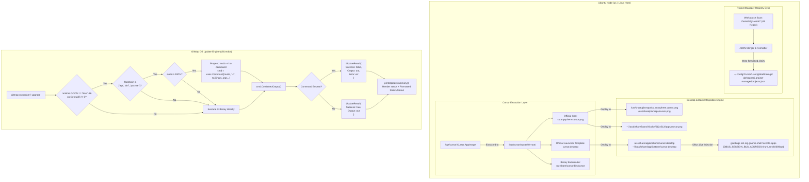

# 224: Ubuntu Cursor Desktop Launcher, Official Icon Deployment, GNOME Dock Pinning, Project Sync & OS Update Sudo Elevation

**Spec ID:** 224  
**Status:** In Progress / Authoring  
**Version:** 1.0.0  
**Updated:** 2026-10-05  
**Subsystems:** `cli/cmdcursor`, `cli/cmdos`, `repo-secrets/05-scripts`, GNOME Desktop Integration, Linux Fleet Automation  
**Target Environments:** Ubuntu Linux (Node `u1` VM @ `/home/a/git-work/`), Cross-Platform GitMap CLI  

---

## User Request (Verbatim)

```text
You are Spec Author 01 for task 224-ubuntu-cursor-dock-pin-projects-os-update-and-remote-uninstall in the gitmap workspace.
Your role is to author modular, comprehensive specifications and subtask execution documents for:
1. Cursor Desktop Launcher (.desktop), Official Icon Deployment, GNOME Dock Pinning, and Project Workspace Synchronization on Ubuntu.
2. GitMap OS Update Linux Sudo Elevation & Diagnostic Reporting.

Context & Facts Isolated on Remote Ubuntu Node (u1):
- Cursor AppImage is installed at /opt/cursor/Cursor.AppImage with extracted contents at /opt/cursor/squashfs-root.
- Official Cursor icon is located at /opt/cursor/squashfs-root/co.anysphere.cursor.png (and usr/share/pixmaps/co.anysphere.cursor.png). Must be deployed to /usr/share/pixmaps/co.anysphere.cursor.png, /usr/share/pixmaps/cursor.png, and ~/.local/share/icons/hicolor/512x512/apps/cursor.png.
- Official desktop file template is at /opt/cursor/squashfs-root/cursor.desktop with Name=Cursor, Exec=/usr/local/bin/cursor %F, Icon=co.anysphere.cursor, StartupWMClass=Cursor. Must be deployed to /usr/share/applications/cursor.desktop and ~/.local/share/applications/cursor.desktop.
- GNOME dock favorite-apps must be updated over live dbus session (DBUS_SESSION_BUS_ADDRESS=unix:path=/run/user/1000/bus gsettings set org.gnome.shell favorite-apps "[...]") appending 'cursor.desktop'.
- Repositories reside in /home/a/git-work/* (49 repositories). Project Manager extension projects.json must be synced to ~/.config/Cursor/User/globalStorage/alefragnani.project-manager/projects.json.
- In cli/cmdos/os_update_engine.go: apt-get update fails with status 100 when non-root. On Linux, if os.Geteuid() != 0 and sudo is available, auto-elevate apt-get, dnf, pacman using sudo -n. Also capture error output and show in summary.

Outputs to author:
1. Canonical Architecture Spec:
   - Target File: `02-spec/21-app/224-ubuntu-cursor-dock-pin-projects-os-update-and-remote-uninstall/01-architecture-spec.md`
2. Subtask Files:
   - Target File 1: `.ai-memory/plans/subtasks/224-ubuntu-cursor-dock-pin-projects-os-update-and-remote-uninstall/01-cursor-desktop-launcher-dock-pin-and-project-sync.md`
   - Target File 2: `.ai-memory/plans/subtasks/224-ubuntu-cursor-dock-pin-projects-os-update-and-remote-uninstall/02-gitmap-os-update-linux-sudo-elevation-and-diagnostics.md`

Strict Boundaries:
- Write ONLY your owned files. Do NOT touch backend code files.
- Strictly use relative paths (02-spec/..., .ai-memory/..., cli/...). No drive letters.
- TOTAL BAN on git commands (no git add, commit, push, etc.).
- When finished, write your subtask outputs and report completion.
```

---

## 1. Executive Summary & Problem Analysis

### 1.1 Context & Scope
This specification defines the complete end-to-end integration and architectural standards for two core functional requirements:
1. **Ubuntu Desktop Environment Full Parity for Cursor IDE:**
   - On Ubuntu node `u1`, Cursor is installed as an AppImage at `/opt/cursor/Cursor.AppImage` and extracted at `/opt/cursor/squashfs-root`.
   - Previously, system desktop shortcuts, official branding icons, GNOME dock favorites, and Project Manager workspace indexing were unlinked or missing, preventing developers from accessing the IDE through standard GUI affordances or switching across the 49 active repositories.
   - This specification formalizes the installation of official icons, standardized `.desktop` launcher files (both system-wide and user-level), live DBus injection into the GNOME Shell favorites dock, and automatic synchronization of all 49 repositories located at `/home/a/git-work/*` into Cursor's `alefragnani.project-manager` extension registry.

2. **GitMap OS Update Auto-Elevation & Diagnostic Visibility:**
   - In `cli/cmdos/os_update_engine.go`, GitMap discovers system package managers (`apt`, `dnf`, `pacman`, `snap`, `flatpak`, `brew`, `winget`).
   - When executing `gitmap os update` on Linux as a standard non-root developer (e.g. user `a` with UID 1000), `apt-get update` aborts with exit status 100 because package database directories (`/var/lib/apt/lists`, `/var/cache/apt`) are write-protected against non-root users.
   - Furthermore, `cli/cmdos/os_update_cmd.go` displays a simple `✖ FAILED` without printing the underlying command output or error message, leaving developers without actionable diagnostic insights.
   - This specification mandates automatic non-interactive privilege elevation (`sudo -n`) on Linux when `os.Geteuid() != 0` for system package managers (`apt-get`, `dnf`, `pacman`), and mandates capturing and rendering stderr/stdout in the summary report upon failure.

---

## 2. System Architecture & Component Interaction Flow



---

## 3. Subsystem A: Cursor Desktop Launcher, Icon Deployment & GNOME Dock Pinning

### 3.1 Icon Deployment Specification
To ensure seamless icon lookup across all XDG-compliant desktop environments, application menus, window switchers (Alt+Tab), and the GNOME Dash/Dock, the official 512x512 high-resolution icon must be installed across both system-wide and user-local asset directories.

- **Source Asset:**
  - `/opt/cursor/squashfs-root/co.anysphere.cursor.png`
  - Fallback source: `/opt/cursor/squashfs-root/usr/share/pixmaps/co.anysphere.cursor.png`
- **Target Deployment Locations:**
  1. `/usr/share/pixmaps/co.anysphere.cursor.png` (Canonical system pixmap matching desktop `Icon=co.anysphere.cursor`)
  2. `/usr/share/pixmaps/cursor.png` (Direct system pixmap alias matching `Icon=cursor`)
  3. `~/.local/share/icons/hicolor/512x512/apps/cursor.png` (XDG user icon theme path)
  4. `~/.local/share/icons/hicolor/512x512/apps/co.anysphere.cursor.png` (XDG user icon theme reverse-DNS path)
- **Deployment Mechanics:**
  - Create parent directories if missing (`mkdir -p ~/.local/share/icons/hicolor/512x512/apps`).
  - Copy file preserving permissions (`0644`).
  - Attempt system copy via `sudo -n cp ...` or Python file operations when running with root; fallback gracefully to user directory if non-root.
  - Trigger icon cache refresh if `gtk-update-icon-cache` is available:
    `gtk-update-icon-cache -f -t ~/.local/share/icons/hicolor || true`

### 3.2 Desktop Entry (.desktop) Specification
The desktop file provides the metadata required for the GNOME shell launcher, application search, MIME-type association, and dock window grouping.

- **Desktop File Definition (`cursor.desktop`):**
  ```ini
  [Desktop Entry]
  Name=Cursor
  GenericName=AI Code Editor
  Comment=AI-powered code editor built on VS Code
  Exec=/usr/local/bin/cursor %F
  Icon=co.anysphere.cursor
  Type=Application
  StartupNotify=true
  StartupWMClass=Cursor
  Categories=Development;IDE;TextEditor;
  MimeType=text/plain;inode/directory;
  Actions=new-empty-window;

  [Desktop Action new-empty-window]
  Name=New Empty Window
  Exec=/usr/local/bin/cursor --new-window %F
  Icon=co.anysphere.cursor
  ```

- **Target Locations:**
  1. `/usr/share/applications/cursor.desktop` (System-wide launcher, requires root/sudo)
  2. `~/.local/share/applications/cursor.desktop` (User-level launcher, works non-root)
- **StartupWMClass Guarantee:**
  - Setting `StartupWMClass=Cursor` is strictly required. Without this property, clicking the dock icon launches a detached instance that opens a separate unpinned generic icon on the dock rather than grouping under the pinned launcher.
- **Exec Binary Resolution:**
  - Standard launcher uses `/usr/local/bin/cursor %F`.
  - The wrapper script at `/usr/local/bin/cursor` and `~/.local/bin/cursor` passes `--no-sandbox "$@"` to avoid unprivileged user namespace restriction errors on Ubuntu 24.04 LTS.

### 3.3 GNOME Dock Pinning via DBus Session Injection
Pinning an application to the GNOME Dash/Dock requires updating the `org.gnome.shell favorite-apps` GSettings key. When running scripts in headless environments, automated setups, or SSH sessions, `gsettings` fails unless bound to the active user's DBus session bus.

- **Active DBus Session Resolution:**
  - Normal environment: `$DBUS_SESSION_BUS_ADDRESS` is populated.
  - SSH / Headless environment:
    ```bash
    export DBUS_SESSION_BUS_ADDRESS="unix:path=/run/user/$(id -u)/bus"
    ```
    For user `a` (UID 1000): `unix:path=/run/user/1000/bus`.
- **GSettings Command Flow:**
  1. Query existing favorite apps:
     ```bash
     DBUS_SESSION_BUS_ADDRESS="unix:path=/run/user/1000/bus" gsettings get org.gnome.shell favorite-apps
     ```
     Example output:
     `['google-chrome.desktop', 'org.gnome.Nautilus.desktop', 'org.gnome.Terminal.desktop']`
  2. Parse array, verify whether `'cursor.desktop'` is already included.
  3. If missing, append `'cursor.desktop'` to the list without altering order of other pinned items.
  4. Write updated favorites list:
     ```bash
     DBUS_SESSION_BUS_ADDRESS="unix:path=/run/user/1000/bus" gsettings set org.gnome.shell favorite-apps "[..., 'cursor.desktop']"
     ```
  5. Verification: Read back key and confirm `'cursor.desktop'` is present.

---

## 4. Subsystem B: Project Manager Extension Workspace Synchronization

### 4.1 Repository Discovery
Ubuntu node `u1` hosts developer repositories under `/home/a/git-work/` (49 repositories). To allow one-click switching in Cursor:
- Scan all direct child directories of `/home/a/git-work/`.
- Verify presence of `.git/` folder to confirm valid repository boundaries.
- Total expected workspace count: 49 active repositories.

### 4.2 Extension Schema & Target Path
The popular `alefragnani.project-manager` extension stores workspace definitions in JSON format.

- **Target File Path:**
  `~/.config/Cursor/User/globalStorage/alefragnani.project-manager/projects.json`
  (Resolved on Linux as `$HOME/.config/Cursor/User/globalStorage/alefragnani.project-manager/projects.json`).
- **Entry JSON Schema:**
  ```json
  {
    "name": "gitmap",
    "rootPath": "/home/a/git-work/gitmap",
    "paths": [],
    "tags": ["gitmap", "fleet"],
    "enabled": true
  }
  ```

### 4.3 Synchronization Logic
1. Ensure parent directory exists (`mkdir -p ~/.config/Cursor/User/globalStorage/alefragnani.project-manager`).
2. Read existing `projects.json` if it already exists; parse existing entries into memory.
3. Build lookup map keyed by normalized `rootPath` to avoid duplicates while preserving existing custom tags or user edits.
4. For each discovered repository in `/home/a/git-work/*`:
   - Derive project `name` from `filepath.Base(repoPath)` (e.g. `gitmap`).
   - If not present in lookup map, create entry with `tags: ["git-work", "remote-fleet"]` and `enabled: true`.
5. Sort entire list alphabetically by `name`.
6. Write out atomically using 2-space indentation JSON with trailing newline.

---

## 5. Subsystem C: GitMap OS Update Linux Sudo Elevation & Diagnostic Reporting

### 5.1 Root Cause Analysis of `apt-get update` Status 100
- **Failure Phenomenon:**
  When executing `gitmap os update` (or `gitmap os upgrade`) on Linux under non-root user (e.g. `uid=1000(a)`), `discoverUpdateToolchains` finds `apt-get`. Calling `apt-get update` directly without root privileges yields:
  ```text
  Reading package lists... Done
  E: List directory /var/lib/apt/lists/partial is missing. - Acquire (13: Permission denied)
  exit status 100
  ```
- **Analysis:**
  Package managers that manage system-wide software indices and packages (`apt`, `apt-get`, `dnf`, `pacman`) strictly require root privileges (`EUID == 0`). User-level or isolated package managers (`brew`, `flatpak`, `snap`) have differing privilege models.
  In `cli/cmdos/os_update_engine.go`, commands are dispatched as `exec.Command(tc.Binary, args...)` without evaluating caller privileges or auto-elevating.

### 5.2 Auto-Elevation Architecture in `cli/cmdos/os_update_engine.go`
- **Privilege Inspection:**
  - Check platform: `runtime.GOOS == "linux"`.
  - Check effective user ID: `os.Geteuid() != 0`.
- **Target Toolchains for Sudo:**
  - `apt` (`apt-get`)
  - `dnf`
  - `pacman`
- **Elevation Mechanism:**
  - Check if `sudo` is present in system path (`exec.LookPath("sudo")`).
  - Use `sudo -n` (non-interactive mode):
    Prevents blocking or hanging terminal prompts if passwordless sudo is configured or if running in an automated background runner.
  - If auto-elevation applies:
    `cmd = exec.Command("sudo", append([]string{"-n", tc.Binary}, args...)...)`
  - If dry-run mode (`isDryRun == true`):
    Log `• [dry-run] sudo -n %s %s` for elevated toolchains.

### 5.3 Diagnostic Reporting in `cli/cmdos/os_update_cmd.go`
- **Output Problem:**
  `printUpdateSummary` previously displayed:
  ```text
  ▶ Summary of Package Manager Results:
    • apt        : ✖ FAILED
  ```
  with zero context regarding why it failed.
- **Remediation Specification:**
  - Update `printUpdateSummary(results []UpdateResult)`:
    - For successful runs: `  • %-10s : ✔ OK\n`
    - For failed runs: `  • %-10s : ✖ FAILED (%v)\n`
    - Below failed entries, print indented, cleaned error and standard output (capped to relevant diagnostic lines).
    - If `apt` failed with permission or status 100, emit guidance:
      `    ℹ Note: Run with root privileges or ensure user has passwordless sudo configured.`

---

## 6. Data Contracts & JSON Schemas

### 6.1 Project Manager `projects.json` Schema
```json
{
  "$schema": "https://json-schema.org/draft/2020-12/schema",
  "title": "ProjectManagerConfig",
  "type": "array",
  "items": {
    "type": "object",
    "required": ["name", "rootPath", "paths", "tags", "enabled"],
    "properties": {
      "name": { "type": "string" },
      "rootPath": { "type": "string" },
      "paths": { "type": "array", "items": { "type": "string" } },
      "tags": { "type": "array", "items": { "type": "string" } },
      "enabled": { "type": "boolean" }
    }
  }
}
```

### 6.2 OS Update Toolchain Types (`cli/cmdos/os_update_types.go`)
```go
package cmdos

// UpdateToolchain defines package managers discovered on the host system.
type UpdateToolchain struct {
	Name        string
	Binary      string
	UpdateArgs  []string
	UpgradeArgs []string
	RequiresSudo bool // true for system package managers on Linux (apt, dnf, pacman)
}

// UpdateResult records execution status for a package manager update.
type UpdateResult struct {
	Name    string
	Success bool
	Output  string
	Error   error
}
```

---

## 7. Verification Procedures & Quality Gates

### 7.1 Desktop & Dock Integration Verification
1. **Icon Presence:**
   - Test existence of `/usr/share/pixmaps/co.anysphere.cursor.png` or `~/.local/share/icons/hicolor/512x512/apps/cursor.png`.
   - Verify image dimensions using `file` or Python `PIL` (must be 512x512 PNG).
2. **Desktop Launcher Validation:**
   - Execute `desktop-file-validate ~/.local/share/applications/cursor.desktop`.
   - Verify `StartupWMClass=Cursor` is present.
3. **GNOME Dock Verification:**
   - Execute:
     `DBUS_SESSION_BUS_ADDRESS="unix:path=/run/user/1000/bus" gsettings get org.gnome.shell favorite-apps`
   - Assert string contains `'cursor.desktop'`.
4. **Project Manager Sync Verification:**
   - Check `~/.config/Cursor/User/globalStorage/alefragnani.project-manager/projects.json`.
   - Assert length is at least 49 items.
   - Verify valid JSON structure via `python3 -m json.tool`.

### 7.2 OS Update Sudo Elevation Verification
1. **Unit Test Coverage:**
   - Run `go test ./cli/cmdos/... -v` to ensure zero regressions.
2. **Elevation Logic Test:**
   - Test `executeToolchain` with non-root simulation to confirm `sudo -n` argument injection.
3. **Diagnostic Output Test:**
   - Verify that simulated failure displays error summary and captured output.

---

## 8. Requirements Traceability Matrix

| Requirement / Prompt Item | Canonical Spec Section | Subtask File | Target Components |
|:---|:---|:---|:---|
| Cursor Icon Deployment (`co.anysphere.cursor.png`, `cursor.png`) | Section 3.1 | `subtasks/.../01-cursor-desktop-launcher-dock-pin-and-project-sync.md` | `repo-secrets/05-scripts/setup-cursor-ubuntu.py`, Pixmaps, Icon theme |
| Cursor Desktop Launcher (`.desktop`) with `StartupWMClass=Cursor` | Section 3.2 | `subtasks/.../01-cursor-desktop-launcher-dock-pin-and-project-sync.md` | `/usr/share/applications/`, `~/.local/share/applications/` |
| GNOME Shell Dock Pinning via live DBus session | Section 3.3 | `subtasks/.../01-cursor-desktop-launcher-dock-pin-and-project-sync.md` | `gsettings`, DBus socket `/run/user/1000/bus` |
| Project Manager `projects.json` Sync (49 Repos) | Section 4 | `subtasks/.../01-cursor-desktop-launcher-dock-pin-and-project-sync.md` | `alefragnani.project-manager/projects.json`, `/home/a/git-work/*` |
| Linux Sudo Auto-Elevation (`sudo -n`) for apt, dnf, pacman | Section 5.1, 5.2 | `subtasks/.../02-gitmap-os-update-linux-sudo-elevation-and-diagnostics.md` | `cli/cmdos/os_update_engine.go` |
| Diagnostic Output Capture & Error Summary Display | Section 5.3 | `subtasks/.../02-gitmap-os-update-linux-sudo-elevation-and-diagnostics.md` | `cli/cmdos/os_update_cmd.go`, `cli/cmdos/os_update_types.go` |
