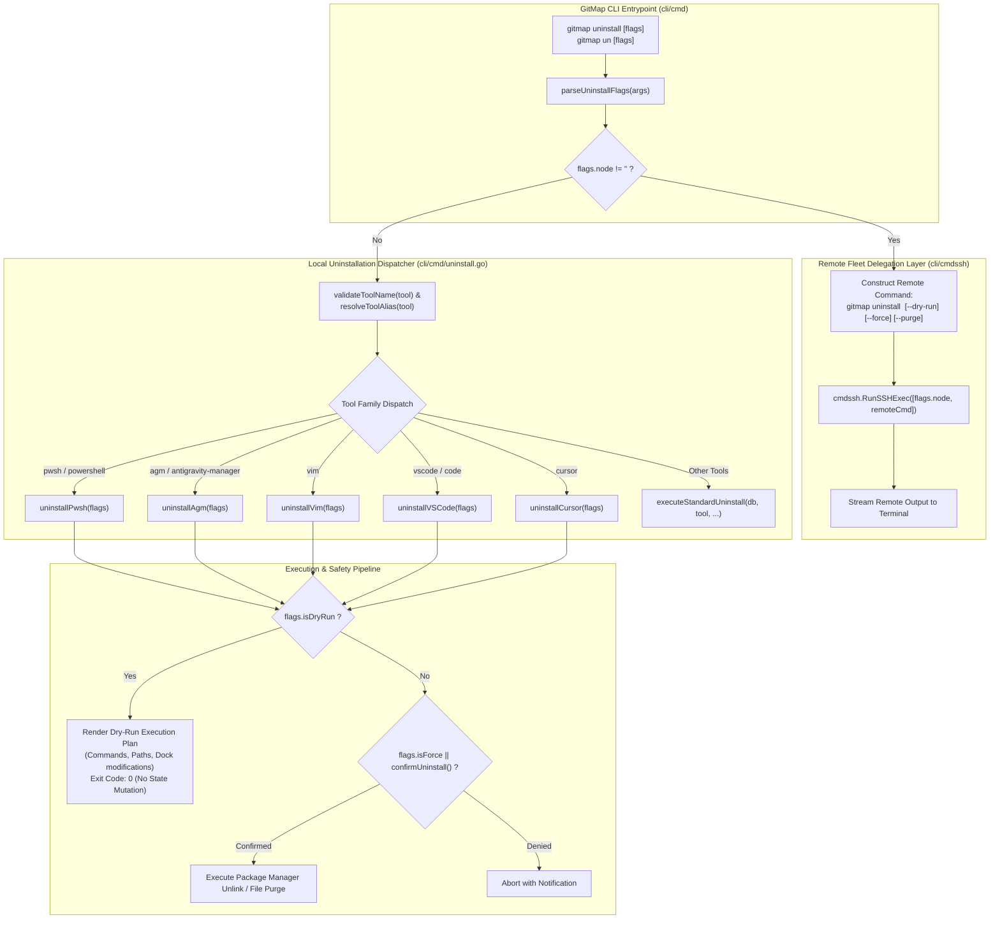
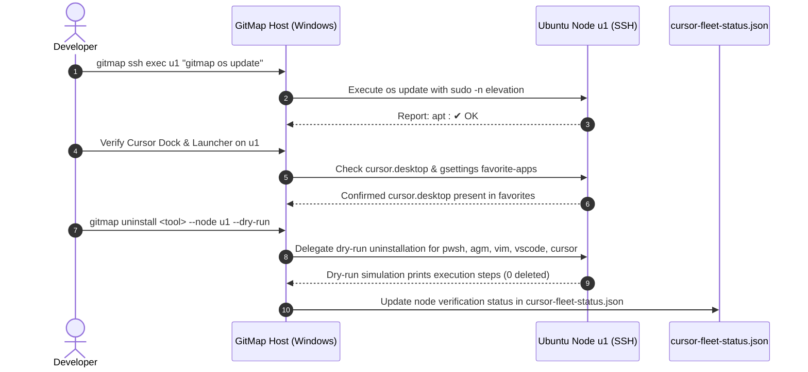
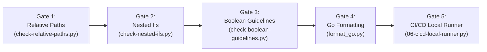

# 224: Dev Tools Remote & Local Uninstall Subsystem, Remote Fleet Verification, Linter Quality Gates & Release Ceremony

**Spec ID:** 224  
**Component Spec:** 02  
**Status:** Approved / Authoring  
**Version:** 1.0.0  
**Updated:** 2026-10-05  
**Subsystems:** `cli/cmd`, `cli/cmdinstall`, `cli/cmdcursor`, `cli/cmdssh`, `cli/constants`, `linter-scripts`, `03-ai-scripts`  
**Target Environments:** Ubuntu Linux (Node `u1` VM @ `/home/a/git-work/`), Windows Development Workstation, GitMap Cross-Platform CLI  

---

## 1. Executive Summary & Problem Analysis

### 1.1 Context & Background
As the GitMap developer ecosystem expands to manage heterogeneous developer workstations and remote fleet testing environments (such as Ubuntu node `u1`), tooling lifecycle parity becomes critical. While GitMap historically supported installing various developer tools and provided specialized uninstallers for Antigravity (`agy`), Antigravity Manager (`agm`), Copilot, and Edge via `cli/cmdagy`, `cli/cmdinstall`, and `cli/cmdwinutil`, several key developer tools lacked a unified uninstallation interface:
1. **PowerShell (`pwsh` / `powershell`):** Deployed across Linux and Windows for cross-platform automation.
2. **Antigravity Manager (`agm` / `antigravity-manager`):** Desktop application and account synchronizer.
3. **Vim (`vim`):** System terminal editor installed across developer nodes.
4. **Visual Studio Code (`vscode` / `code`):** Primary editor requiring clean removal of binaries, desktop launchers, and configuration state.
5. **Cursor IDE (`cursor`):** AI-first editor installed via standalone AppImage on Linux or Winget on Windows, requiring complete teardown of extracted binaries, launchers, branding icons, GNOME dock favorite-apps entries, and Project Manager configurations.

### 1.2 User Intent & Non-Destructive Invariant
The user explicitly specified:
> *"I don't want you to remove anything yet. Probably I will do the end-to-end testing later, but make sure the commands exist so that we can test it later on."*

This mandate establishes a strict **Non-Destructive Invariant**:
- The CLI command suite and underlying dispatchers must be fully registered, typed, and executable.
- The default verification protocol for testing and automated runs must strictly use `--dry-run` (or inspect command registration and dry-run output) without deleting binaries, modifying system packages, or modifying user configuration directories.
- Real uninstallation operations must require explicit confirmation or the `--force` / `-f` flag, and must be guarded by dry-run simulation capabilities.
- Working project repositories under `d:\work` (local workstation) and `/home/a/git-work` (remote node `u1`) are non-negotiably protected invariants and must never be touched by any uninstaller routine.

### 1.3 Scope of Specification
This component specification defines:
1. The **Dev Tools Remote & Local Uninstall Subsystem** across the 5 target tools (`pwsh`, `agm`, `vim`, `vscode`, `cursor`) supporting `--node <alias>`, `--dry-run`, `--force`, and `--purge`.
2. The **Remote Node `u1` Live Verification Protocol** validating Cursor dock pinning, Project Manager sync, `gitmap os update` auto-elevation, and dry-run uninstallation commands.
3. The **Linter Quality Gates** enforcing relative path hygiene, nested-if limits, boolean standards, and Go code formatting.
4. The **Minor Version Bump (`v6.485.0`) & Release Ceremony** using GitMap hyphen-separated atomic commit syntax and continuous pipeline error tracking (`gitmap pe -t`).

---

## 2. Component Architecture & System Flow



---

## 3. Dev Tools Uninstall Subsystem Specification

### 3.1 CLI Command Syntax & Grammar

```bash
# Canonical command format
gitmap uninstall <tool> [--node <alias>] [--dry-run] [--force] [--purge]

# Common aliases
gitmap un <tool> [--node <alias>] [-d] [-f] [-a]
```

#### Flags Matrix
| Flag | Short | Type | Default | Description |
|---|---|---|---|---|
| `--node` | `-node` | string | `""` | Target remote fleet machine alias (e.g. `u1`, `devbox`). If provided, delegates command execution over SSH. |
| `--dry-run` | `-d`, `-n` | boolean | `false` | Simulates uninstallation without deleting packages, removing files, or modifying configuration. |
| `--force` | `-f`, `-y`, `--yes` | boolean | `false` | Bypasses interactive confirmation prompt (`confirmUninstall`). |
| `--purge` | `-a`, `--all` | boolean | `false` | Performs complete removal including user configurations, cache directories, desktop shortcuts, and dock favorites. |

### 3.2 Tool Resolution & Alias Mapping
The uninstaller resolves incoming user tool tokens through `resolveToolAlias`:

| User Input Aliases | Canonical Tool Name | Target Binary / Package |
|---|---|---|
| `pwsh`, `powershell`, `ps` | `powershell` (`constants.ToolPowerShell`) | Linux: `powershell` (apt/tarball) / Windows: `Microsoft.PowerShell` (winget) |
| `agm`, `ag-manager`, `antigravity-manager`, `agm-all` | `ag-manager` (`constants.ToolAgManager`) | Linux: `/usr/local/bin/agm`, `~/.local/bin/agm` / Windows: AppData bin |
| `vim`, `vi` | `vim` (`constants.ToolVim`) | Linux: `vim` (apt) / Windows: `vim` (choco/winget) |
| `vscode`, `code`, `vs-code` | `vscode` (`constants.ToolVSCode`) | Linux: `code` (apt) / Windows: `Microsoft.VisualStudioCode` (winget) |
| `cursor`, `cur` | `cursor` (`constants.ToolCursor`) | Linux: `/opt/cursor/Cursor.AppImage` / Windows: `Anysphere.Cursor` |

### 3.3 Target Tool Lifecycle & Platform Actions

#### 1. PowerShell (`pwsh` / `powershell`)
- **Linux (Ubuntu / Debian):**
  - **Standard (`--dry-run` false):**
    ```bash
    sudo -n apt-get remove -y powershell
    sudo -n rm -f /usr/local/bin/pwsh ~/.local/bin/pwsh
    ```
  - **Purge (`--purge`):**
    ```bash
    sudo -n apt-get purge -y powershell
    rm -rf ~/.config/powershell ~/.local/share/powershell
    ```
  - **Dry-Run Output (`--dry-run`):**
    ```text
    ● [DryRun] PowerShell Uninstallation Plan (Linux):
      - Package Action: sudo apt-get remove -y powershell (or purge if --purge)
      - Symlinks: remove /usr/local/bin/pwsh, ~/.local/bin/pwsh
      - Purge Configs: ~/.config/powershell, ~/.local/share/powershell
    ```
- **Windows:**
  - Standard: `winget uninstall --id Microsoft.PowerShell --silent` (or `choco uninstall powershell-core -y`).
  - Purge: removes `$HOME\Documents\PowerShell` profiles if `--purge`.

#### 2. Antigravity Manager (`agm` / `antigravity-manager`)
- **Linux (Ubuntu / Debian):**
  - **Standard:**
    ```bash
    sudo -n rm -f /usr/local/bin/agm
    rm -f ~/.local/bin/agm
    sudo -n rm -f /usr/share/applications/agm.desktop
    rm -f ~/.local/share/applications/agm.desktop
    ```
  - **Purge (`--purge`):**
    ```bash
    rm -rf ~/.config/antigravity ~/.local/share/antigravity
    ```
  - **Dry-Run Output:**
    ```text
    ● [DryRun] Antigravity Manager Uninstallation Plan (Linux):
      - Binaries: unlink /usr/local/bin/agm, ~/.local/bin/agm
      - Desktop Entries: remove /usr/share/applications/agm.desktop, ~/.local/share/applications/agm.desktop
      - Purge State: remove ~/.config/antigravity
    ```
- **Windows:**
  - Dispatches to existing `cmdinstall.RunAGMUninstall(isPurge, isForce, isDryRun)` in `cli/cmdinstall/agm_uninstall.go`.

#### 3. Vim (`vim`)
- **Linux (Ubuntu / Debian):**
  - **Standard:**
    ```bash
    sudo -n apt-get remove -y vim
    ```
  - **Purge (`--purge`):**
    ```bash
    sudo -n apt-get purge -y vim
    rm -rf ~/.vim ~/.vimrc /etc/vim
    ```
  - **Dry-Run Output:**
    ```text
    ● [DryRun] Vim Uninstallation Plan (Linux):
      - Package Action: sudo apt-get remove -y vim (or purge if --purge)
      - Purge Configs: ~/.vim, ~/.vimrc
    ```
- **Windows:**
  - Standard: `winget uninstall --id vim.vim --silent` or `choco uninstall vim -y`.

#### 4. Visual Studio Code (`vscode` / `code`)
- **Linux (Ubuntu / Debian):**
  - **Standard:**
    ```bash
    sudo -n apt-get remove -y code
    sudo -n rm -f /usr/share/applications/code.desktop ~/.local/share/applications/code.desktop
    sudo -n rm -f /usr/local/bin/code
    ```
  - **Purge (`--purge`):**
    ```bash
    sudo -n apt-get purge -y code
    rm -rf ~/.config/Code ~/.vscode
    ```
  - **Dry-Run Output:**
    ```text
    ● [DryRun] Visual Studio Code Uninstallation Plan (Linux):
      - Package Action: sudo apt-get remove -y code
      - Desktop Entries: remove /usr/share/applications/code.desktop, ~/.local/share/applications/code.desktop
      - Purge State: remove ~/.config/Code, ~/.vscode
    ```
- **Windows:**
  - Standard: `winget uninstall --id Microsoft.VisualStudioCode --silent` or `choco uninstall vscode -y`.

#### 5. Cursor IDE (`cursor`)
- **Linux (Ubuntu / Debian):**
  - **Standard:**
    ```bash
    sudo -n rm -rf /opt/cursor
    rm -rf ~/.local/share/cursor
    sudo -n rm -f /usr/local/bin/cursor ~/.local/bin/cursor
    sudo -n rm -f /usr/share/applications/cursor.desktop ~/.local/share/applications/cursor.desktop
    sudo -n rm -f /usr/share/pixmaps/co.anysphere.cursor.png /usr/share/pixmaps/cursor.png
    rm -f ~/.local/share/icons/hicolor/512x512/apps/cursor.png
    ```
  - **GNOME Dock Unpinning:**
    Queries current dock favorites via `gsettings get org.gnome.shell favorite-apps`, removes `'cursor.desktop'`, and writes back using:
    ```bash
    DBUS_SESSION_BUS_ADDRESS=unix:path=/run/user/$(id -u)/bus gsettings set org.gnome.shell favorite-apps "[...]"
    ```
  - **Purge (`--purge`):**
    ```bash
    rm -rf ~/.config/Cursor ~/.cursor
    ```
  - **Dry-Run Output:**
    ```text
    ● [DryRun] Cursor IDE Uninstallation Plan (Linux):
      - AppImage & Root: remove /opt/cursor, ~/.local/share/cursor
      - Wrappers: remove /usr/local/bin/cursor, ~/.local/bin/cursor
      - Desktop Launchers: remove /usr/share/applications/cursor.desktop, ~/.local/share/applications/cursor.desktop
      - Icons: remove /usr/share/pixmaps/cursor.png, ~/.local/share/icons/hicolor/512x512/apps/cursor.png
      - GNOME Dock: unpin 'cursor.desktop' from org.gnome.shell favorite-apps
      - Purge Configs: remove ~/.config/Cursor, ~/.cursor
    ```
- **Windows:**
  - Standard: `winget uninstall --id Anysphere.Cursor --silent` or removes `%LOCALAPPDATA%\Programs\cursor`.

### 3.4 Remote Node Delegation Architecture
When the user executes `gitmap uninstall <tool> --node <alias>`:
1. The flag parser in `cli/cmd/uninstall.go` extracts the `targetNode` string.
2. The remaining flags are reconstructed into a sanitized remote command:
   ```go
   remoteCmd := fmt.Sprintf("gitmap uninstall %s", tool)
   if flags.isDryRun {
       remoteCmd += " --dry-run"
   }
   if flags.isForce {
       remoteCmd += " --force"
   }
   if flags.isPurge {
       remoteCmd += " --purge"
   }
   ```
3. The command is dispatched across the fleet transport layer:
   ```go
   cmdssh.RunSSHExec([]string{flags.node, remoteCmd})
   ```
4. Output and exit status are streamed directly back to the terminal. If the remote node lacks `gitmap`, a fallback script invocation executes the equivalent bash uninstaller commands.

---

## 4. Remote Node `u1` Live Verification Protocol

To verify the integrated components across the remote Ubuntu node `u1` without violating the non-destructive requirement, the following verification sequence is defined:



### 4.1 Remote Verification Steps
1. **OS Update Sudo Elevation Verification:**
   - Execute: `gitmap ssh exec u1 "gitmap os update"`
   - Assert: `apt : ✔ OK` is returned, verifying `sudo -n` elevation bypassed status 100 failure.
2. **Cursor Desktop & Dock Favorites Verification:**
   - Execute: `gitmap ssh exec u1 "test -f /usr/share/applications/cursor.desktop && echo 'LAUNCHER_EXISTS'"`
   - Execute: `gitmap ssh exec u1 "DBUS_SESSION_BUS_ADDRESS=unix:path=/run/user/1000/bus gsettings get org.gnome.shell favorite-apps"`
   - Assert: `'cursor.desktop'` is present in the favorites array.
3. **Cursor Project Manager Sync Verification:**
   - Execute: `gitmap ssh exec u1 "cat ~/.config/Cursor/User/globalStorage/alefragnani.project-manager/projects.json | grep -c rootPath"`
   - Assert: Count matches the 49 workspace projects located under `/home/a/git-work/*`.
4. **Dev Tools Uninstall Dry-Run Verification:**
   - Execute dry-run for all 5 tools via remote delegation:
     * `gitmap uninstall pwsh --node u1 --dry-run`
     * `gitmap uninstall agm --node u1 --dry-run`
     * `gitmap uninstall vim --node u1 --dry-run`
     * `gitmap uninstall vscode --node u1 --dry-run`
     * `gitmap uninstall cursor --node u1 --dry-run`
   - Assert: Each command prints the detailed dry-run execution plan and exits with status 0 without removing packages or modifying files.
5. **Ledger Synchronization:**
   - Update `repo-secrets/04-ubuntu-migration/cursor-fleet-status.json` with timestamped node health, launcher paths, and verification outcomes.

---

## 5. Linter Quality Gates Protocol

Before releasing or cutting commits, all code and documentation must pass the repository's strict quality gates without exception:



### 5.1 Quality Gate Execution Matrix

| Gate | Linter Script | Rule Enforced | Waiver / Tolerance |
|---|---|---|---|
| **Gate 1** | `linter-scripts/check-relative-paths.py` | Zero hardcoded absolute drive letters (`C:`, `D:`, `d:\`, `c:\`) in code, specs, or plans. | Strictly 0 violations. |
| **Gate 2** | `linter-scripts/check-nested-ifs.py` | Maximum nesting depth <= 2. All deep conditionals must be flattened with early returns and guard clauses. | Strictly 0 violations. |
| **Gate 3** | `linter-scripts/check-boolean-guidelines.py` | Positive boolean naming prefixes (`is*`, `has*`, `can*`, `should*`). Prohibits negative booleans (`disable*`, `not*`). | Strictly 0 violations. |
| **Gate 4** | `scripts/format_go.py` | Canonical Go code formatting via `gofmt -w` across all `.go` files under `cli/`. | Zero unformatted diffs. |
| **Gate 5** | `03-ai-scripts/06-cicd-local-runner.py` | High-speed multi-worker validation running all 21 repository CI gates. | 100% green pass. |

---

## 6. Minor Version Bump & Release Ceremony

### 6.1 Version Bump Invariants
- **Current Version:** `v6.484.0` (as resolved in `version.json`).
- **Target Version:** `v6.485.0` (Minor Bump according to repository Rule 0).
- **Execution Script:** `03-ai-scripts/37-bump-version.py`.
- **Command:**
  ```bash
  python 03-ai-scripts/37-bump-version.py --tier minor --scope "cursor - ubuntu dock pin, projects sync, os update sudo elevation, and dev tools remote uninstall"
  ```
- **Manifests Synchronized:**
  - `version.json` (root canonical source of truth)
  - `package.json`
  - `readme.md` (root badges and header version references)
  - `changelog.md` (new SemVer header and itemized entries)
  - `cli/constants/constants.go` (internal CLI version string)

### 6.2 Hyphen-Separated Atomic Commit Standard
In strict adherence to GitMap commit guidelines, the release commit must follow the exact hyphen-separated multi-phase syntax:

```text
cursor - ubuntu dock pin, projects sync, os update sudo elevation, and dev tools remote uninstall
```

### 6.3 Pipeline Monitoring Protocol (`gitmap pe -t`)
Following release staging, CI/CD telemetry must be actively tracked:
1. Execute: `gitmap pe -t` (or `gitmap pipeline errors --timeline`).
2. Monitor real-time status until all jobs show `✔ SUCCESS`.
3. If any step fails, capture diagnostic stack traces using `gitmap pe` and remediate without manual intervention.

---

## 7. Acceptance Criteria & Verification Matrix

| Area | Acceptance Criteria | Verification Method |
|---|---|---|
| **CLI Registration** | `gitmap uninstall --help` displays all supported flags: `--node`, `--dry-run`, `--force`, `--purge`. | Run `gitmap uninstall --help`. |
| **Remote Delegation** | Passing `--node u1` routes execution to remote host `u1` via `cmdssh.RunSSHExec`. | Run `gitmap uninstall pwsh --node u1 --dry-run`. |
| **Dry-Run Mode** | Invoking `--dry-run` on any tool produces formatted action plan and exits 0 with zero file deletions. | Run dry-run for all 5 tools (`pwsh`, `agm`, `vim`, `vscode`, `cursor`). |
| **Work Protection** | Uninstall actions never delete or target `/home/a/git-work` or `d:\work`. | Code review & audit path resolvers. |
| **Remote Verification** | `gitmap os update` on `u1` reports `apt : ✔ OK`. | Run `gitmap ssh exec u1 "gitmap os update"`. |
| **Dock Favorites** | `cursor.desktop` is present in GNOME dock favorites on `u1`. | Query `org.gnome.shell favorite-apps`. |
| **Project Sync** | `projects.json` on `u1` contains all 49 repositories from `/home/a/git-work/*`. | Inspect `projects.json`. |
| **Linters** | Zero relative path, nested-if, or boolean violations across the repository. | Run linter scripts and CI runner. |
| **Version Bump** | Repository cleanly updated to `v6.485.0` with synchronized manifests. | Verify `version.json` and `changelog.md`. |
| **CI Telemetry** | Pipeline monitored via `gitmap pe -t` achieves 100% green pass. | Monitor pipeline status. |
