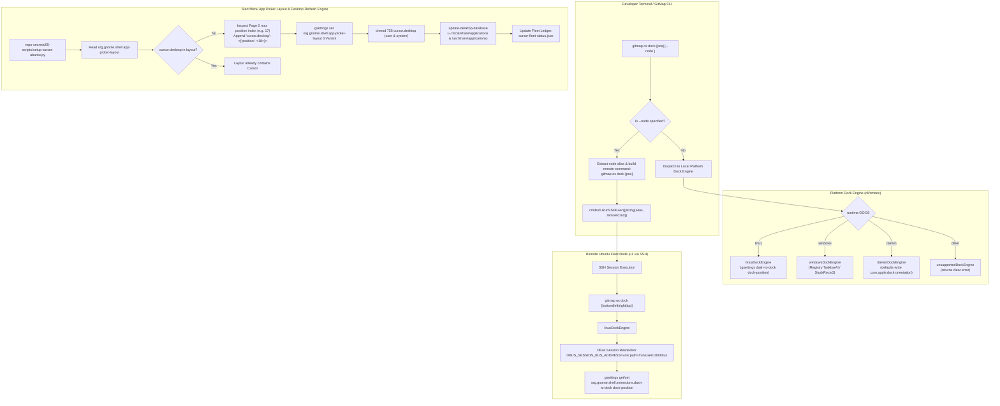

# 225: Ubuntu Start Menu (GNOME App Grid) Cursor Integration, Desktop Database Refresh & Cross-Platform GitMap OS Dock Position Command

**Spec ID:** 225  
**Status:** Approved / Ready for Execution  
**Version:** 1.0.0  
**Updated:** 2026-10-05  
**Subsystems:** `cli/cmdos`, `repo-secrets/05-scripts`, GNOME Shell Desktop Integration, Freedesktop Standards, Fleet Remote Delegation (`cmdssh`)  
**Target Environments:** Ubuntu Linux (Node `u1` VM @ `/home/a/git-work/`), Cross-Platform GitMap CLI (Windows / Linux / macOS)  

---

## User Request (Verbatim)

```text
You are Spec Author 01 for task 225-ubuntu-cursor-start-menu-dock-position-and-profile-migration in the repository.
Your role is to author modular, comprehensive specifications and subtask execution documents for:
1. Ubuntu Start Menu (GNOME App Grid / App Picker Layout) Cursor Integration & Desktop Database Refresh.
2. Cross-Platform Configurable Dock / Start Menu Position Command in GitMap OS (`gitmap os dock [bottom|left|right|top]`, `gitmap os start-menu`, `gitmap os panel`) with remote node delegation.

Context & Facts Isolated on Remote Ubuntu Node (u1):
- GNOME App Grid layout is stored in `org.gnome.shell app-picker-layout` as a GVariant array of dictionaries mapping desktop IDs to position objects: `[{'org.gnome.Calculator.desktop': <{'position': <0>}>, ..., 'Antigravity Manager Tools.desktop': <{'position': <17>}>}]`.
- Because `cursor.desktop` was missing from `app-picker-layout`, it did not appear on page 1 of the Ubuntu Show Applications / Start menu. Appending `'cursor.desktop': <{'position': <18>}>` to `app-picker-layout` directly places Cursor into the Start menu.
- In addition, running `update-desktop-database` and `chmod 755` on `cursor.desktop` ensures full Freedesktop standard compatibility.
- GNOME dock position is controlled by `org.gnome.shell.extensions.dash-to-dock dock-position` with enum values `'TOP'`, `'RIGHT'`, `'BOTTOM'`, `'LEFT'`.
- New GitMap OS command: `gitmap os dock [bottom|left|right|top] [--node <alias>]` (with aliases `panel`, `start-menu`). If no position argument is provided, display current configuration. If `--node <alias>` is passed, delegate over SSH via `cmdssh.RunSSHExec`.

Outputs to author:
1. Canonical Architecture Spec:
   - Target File: `02-spec/21-app/225-ubuntu-cursor-start-menu-dock-position-and-profile-migration/01-architecture-spec.md`
2. Subtask Files:
   - Target File 1: `.ai-memory/plans/subtasks/225-ubuntu-cursor-start-menu-dock-position-and-profile-migration/01-cursor-start-menu-app-picker-layout-and-desktop-refresh.md`
   - Target File 2: `.ai-memory/plans/subtasks/225-ubuntu-cursor-start-menu-dock-position-and-profile-migration/02-gitmap-os-dock-position-command-and-remote-delegation.md`

Strict Boundaries:
- Write ONLY your owned files. Do NOT touch backend code files.
- Strictly use relative paths (02-spec/..., .ai-memory/..., cli/...). No drive letters.
- TOTAL BAN on git commands (no git add, commit, push, etc.).
- When finished, write your subtask outputs and report completion.
```

---

## 1. Executive Summary & Problem Analysis

### 1.1 Context & Scope
This specification defines the architectural design, implementation contracts, data structures, and verification protocols for two core workstation management capabilities:

1. **Ubuntu Start Menu (GNOME App Grid / App Picker Layout) Cursor Integration & Desktop Database Refresh:**
   - In Ubuntu 22.04 / 24.04 LTS running GNOME 42+, the application launcher menu ("Show Applications" or "Start Menu") layout is governed by the GSettings key `org.gnome.shell app-picker-layout`.
   - On remote Ubuntu node `u1`, although `cursor.desktop` was deployed and pinned to the GNOME dock favorite-apps (Task 224), it failed to appear on **Page 1** of the GNOME App Grid because it was omitted from the `app-picker-layout` GVariant dictionary array.
   - The remote environment contains 18 default application positions (indices 0 through 17 ending with `Antigravity Manager Tools.desktop`). Without explicit placement at position 18, Cursor is relegated to overflow or hidden from the immediate application grid.
   - Furthermore, Freedesktop compliance requires explicit permission enforcement (`chmod 755` on `.desktop` entries) and triggering `update-desktop-database` to rebuild MIME and desktop cache indices.

2. **Cross-Platform Configurable Dock / Start Menu Position Command in GitMap OS:**
   - Developers managing multi-node fleets (local Windows / macOS workstations and remote Ubuntu headless or GUI nodes) require a single, uniform CLI command to inspect and reposition the desktop dock / taskbar / panel across physical and virtual screens.
   - On Linux GNOME Shell, dock orientation is managed via `org.gnome.shell.extensions.dash-to-dock dock-position` (`TOP`, `RIGHT`, `BOTTOM`, `LEFT`).
   - On Windows, taskbar positioning and alignment is managed via registry entries (`HKCU\Software\Microsoft\Windows\CurrentVersion\Explorer\Advanced\TaskbarAl` and `StuckRects3`).
   - On macOS, dock orientation is managed via `com.apple.dock orientation` (`bottom`, `left`, `right`).
   - GitMap CLI must expose a unified command:
     `gitmap os dock [bottom|left|right|top] [--node <alias>]`
     with aliases: `gitmap os panel`, `gitmap os start-menu`, and `gitmap os taskbar`.
   - If executed with zero position arguments, it queries and prints current dock configuration.
   - If `--node <alias>` is specified, GitMap delegates execution over SSH to the target fleet machine via `cmdssh.RunSSHExec`.

---

## 2. System Architecture & Interaction Flow



---

## 3. Subsystem A: Ubuntu Start Menu (GNOME App Grid) Cursor Integration & Desktop Refresh

### 3.1 GNOME App Grid Data Model (`app-picker-layout`)
GNOME Shell 40+ organizes applications into a paginated grid. The configuration is stored as a GVariant value of type `aa{sv}` (an array of dictionaries mapping strings to variants):

- **GSettings Schema:** `org.gnome.shell`
- **GSettings Key:** `app-picker-layout`
- **Data Signature:** `aa{sv}`
- **Concrete Example from Remote Node `u1`:**
  ```text
  [{'org.gnome.Calculator.desktop': <{'position': <0>}>,
    'org.gnome.Calendar.desktop': <{'position': <1>}>,
    'org.gnome.Characters.desktop': <{'position': <2>}>,
    'org.gnome.clocks.desktop': <{'position': <3>}>,
    'org.gnome.Contacts.desktop': <{'position': <4>}>,
    'org.gnome.DiskUtility.desktop': <{'position': <5>}>,
    'org.gnome.Evince.desktop': <{'position': <6>}>,
    'org.gnome.FileRoller.desktop': <{'position': <7>}>,
    'org.gnome.font-viewer.desktop': <{'position': <8>}>,
    'org.gnome.Logs.desktop': <{'position': <9>}>,
    'org.gnome.Loupe.desktop': <{'position': <10>}>,
    'org.gnome.Music.desktop': <{'position': <11>}>,
    'org.gnome.Nautilus.desktop': <{'position': <12>}>,
    'org.gnome.Snapshot.desktop': <{'position': <13>}>,
    'org.gnome.SoundRecorder.desktop': <{'position': <14>}>,
    'org.gnome.SystemMonitor.desktop': <{'position': <15>}>,
    'org.gnome.Weather.desktop': <{'position': <16>}>,
    'Antigravity Manager Tools.desktop': <{'position': <17>}>}]
  ```

### 3.2 Position 18 Appending Algorithm
When a new application is added to the system, GNOME Shell does not automatically assign it a fixed slot on Page 1 if a custom `app-picker-layout` is already defined. To pin Cursor directly to Page 1:
1. **Query Existing Layout:**
   Execute via live DBus session (`DBUS_SESSION_BUS_ADDRESS="unix:path=/run/user/1000/bus"`):
   ```bash
   gsettings get org.gnome.shell app-picker-layout
   ```
2. **Determine Target Position:**
   - Scan page 0 for existing entries matching `<{'position': <N>}>`.
   - Identify the maximum existing position index $N_{max}$ (on node `u1`, $N_{max} = 17$).
   - Target position $N_{target} = N_{max} + 1 = 18$.
3. **Check Idempotency:**
   - If `'cursor.desktop'` is already present anywhere in `app-picker-layout`, do not duplicate.
4. **Construct Updated GVariant String:**
   - Append `'cursor.desktop': <{'position': <18>}>` to the dictionary representing page 0.
   - Example serialized result:
     ```text
     [{..., 'Antigravity Manager Tools.desktop': <{'position': <17>}>, 'cursor.desktop': <{'position': <18>}>}]
     ```
5. **Apply via GSettings:**
   ```bash
   gsettings set org.gnome.shell app-picker-layout "[..., 'cursor.desktop': <{'position': <18>}>]"
   ```
6. **Handle Default / Empty State:**
   - If `app-picker-layout` returns `@aa{sv} []` or empty array, initialize page 0:
     `[{'cursor.desktop': <{'position': <0>}>}]`

### 3.3 Freedesktop Permissions & Desktop Database Refresh
To ensure the GNOME Shell indexer, application finder, and XDG MIME association engines recognize `cursor.desktop`:

1. **Permission Enforcement:**
   - Ensure `cursor.desktop` is marked with standard permissions (`0755` or `0644` with execution bit on directory):
     ```bash
     chmod 755 ~/.local/share/applications/cursor.desktop
     sudo -n chmod 755 /usr/share/applications/cursor.desktop || true
     ```
2. **Desktop Database Cache Rebuild:**
   - Running `update-desktop-database` updates `mimeinfo.cache` and application indexing databases:
     ```bash
     update-desktop-database ~/.local/share/applications
     sudo -n update-desktop-database /usr/share/applications || true
     ```
3. **Icon Cache Validation:**
   - Trigger icon cache refresh if `gtk-update-icon-cache` exists:
     ```bash
     gtk-update-icon-cache -f -t ~/.local/share/icons/hicolor || true
     ```

### 3.4 Integration into `repo-secrets/05-scripts/setup-cursor-ubuntu.py`
The provisioning script `repo-secrets/05-scripts/setup-cursor-ubuntu.py` will be enhanced with:
- `pin_cursor_to_app_picker(is_dry_run: bool) -> bool`:
  Parses GVariant layout, calculates target position, injects `'cursor.desktop'`, and persists via `gsettings`.
- `refresh_desktop_database(is_dry_run: bool) -> bool`:
  Performs `chmod 755` and executes `update-desktop-database`.
- Extends the node status report in `cursor-fleet-status.json` with:
  ```json
  "appPickerPinned": true,
  "appPickerPosition": 18,
  "desktopDatabaseRefreshed": true
  ```

---

## 4. Subsystem B: Cross-Platform GitMap OS Dock & Start Menu Position Command

### 4.1 Command Grammar & Aliases
GitMap OS provides a unified interface for configuring workstation dock, panel, and start menu positioning.

- **Primary Command:**
  ```bash
  gitmap os dock [bottom|left|right|top] [--node <alias>]
  ```
- **Registered Aliases:**
  ```bash
  gitmap os panel [bottom|left|right|top] [--node <alias>]
  gitmap os start-menu [bottom|left|right|top] [--node <alias>]
  gitmap os dock-position [bottom|left|right|top] [--node <alias>]
  gitmap os taskbar [bottom|left|right|top] [--node <alias>]
  ```

### 4.2 Query Mode vs Mutation Mode

| Invocation Mode | Arguments | Behavior |
|:---|:---|:---|
| **Query Mode** | Zero position arguments (e.g. `gitmap os dock`, `gitmap os dock --node u1`) | Queries host/target dock configuration and prints current orientation (`BOTTOM`, `LEFT`, `RIGHT`, `TOP`), active desktop engine, and available orientations. |
| **Mutation Mode** | One position argument (e.g. `gitmap os dock bottom`, `gitmap os panel left --node u1`) | Validates position, normalizes to canonical enum, executes platform-specific configuration mutation, and confirms change. |
| **Help Mode** | `-h`, `--help`, `help` | Renders rich terminal help with examples and platform compatibility table. |

### 4.3 Remote Delegation Protocol (`--node <alias>`)
When the developer passes `--node <alias>` (e.g. `--node u1` or `--node=u1`):
1. **Flag Extraction:**
   Filter out `--node` and its parameter from the argument slice.
2. **Remote Command Construction:**
   Reconstruct the exact child command:
   - For query: `gitmap os dock`
   - For set: `gitmap os dock <position>`
3. **Execution Delegation via `cmdssh.RunSSHExec`:**
   ```go
   fmt.Printf("● Delegating dock configuration to remote node '%s'...\n", nodeAlias)
   err := cmdssh.RunSSHExec([]string{nodeAlias, remoteCmd})
   ```
4. **Error Propagation:**
   Wrap SSH errors using `apperror.WrapSimple(err, "remote dock delegation")`.

### 4.4 Platform Implementation Engines

#### 4.4.1 Linux Platform Engine (`linuxDockEngine`)
- **Desktop Environment:** GNOME Shell (with Ubuntu Dock / Dash-to-Dock extension).
- **GSettings Schema:** `org.gnome.shell.extensions.dash-to-dock`
- **GSettings Key:** `dock-position`
- **Allowed Values (GSettings Enum):** `'TOP'`, `'RIGHT'`, `'BOTTOM'`, `'LEFT'` (GNOME Shell requires uppercase strings).
- **Session DBus Handling:**
  In headless SSH sessions (such as `u1`), `DBUS_SESSION_BUS_ADDRESS` is not automatically set in the SSH shell. The engine automatically probes `/run/user/<UID>/bus` (e.g. `/run/user/1000/bus`) and injects the environment variable into the child `exec.Command` process.
- **Read Logic:**
  ```bash
  gsettings get org.gnome.shell.extensions.dash-to-dock dock-position
  # Output: 'LEFT' or 'BOTTOM'
  ```
- **Write Logic:**
  ```bash
  gsettings set org.gnome.shell.extensions.dash-to-dock dock-position 'BOTTOM'
  ```

#### 4.4.2 Windows Platform Engine (`windowsDockEngine`)
- **OS Versions:** Windows 10 & Windows 11.
- **Taskbar Alignment (Windows 11):**
  - Registry Path: `HKCU\Software\Microsoft\Windows\CurrentVersion\Explorer\Advanced`
  - Value: `TaskbarAl` (DWORD)
  - Values: `0` = Left (classic alignment), `1` = Center (default Windows 11).
- **Screen Edge Position (Windows 10 / Windows 11 with custom shell):**
  - Registry Path: `HKCU\Software\Microsoft\Windows\CurrentVersion\Explorer\StuckRects3`
  - Value: `Settings` (Binary)
  - Byte index 12 defines orientation:
    - `0x00`: Left
    - `0x01`: Top
    - `0x02`: Right
    - `0x03`: Bottom
- **Read Logic:**
  Reads registry values, inspects Windows build version via `os_info`, and reports whether taskbar is configured Left or Bottom/Center.
- **Write Logic:**
  Updates `TaskbarAl` (or `StuckRects3`), and prompts or optionally restarts Windows Explorer to refresh layout.

#### 4.4.3 macOS Platform Engine (`darwinDockEngine`)
- **Read Logic:**
  ```bash
  defaults read com.apple.dock orientation
  # Returns: bottom, left, or right
  ```
- **Write Logic:**
  ```bash
  defaults write com.apple.dock orientation <bottom|left|right>
  killall Dock
  ```

---

## 5. Data Contracts, Types & Schemas

### 5.1 Go Core Types (`cli/cmdos/os_dock_types.go`)

```go
package cmdos

// DockPosition defines the cardinal screen edge for dock / taskbar placement.
type DockPosition string

const (
	DockPositionBottom DockPosition = "bottom"
	DockPositionLeft   DockPosition = "left"
	DockPositionRight  DockPosition = "right"
	DockPositionTop    DockPosition = "top"
	DockPositionCenter DockPosition = "center" // For Windows 11 taskbar icon alignment
)

// DockConfig holds detailed information about the active workstation dock.
type DockConfig struct {
	Platform    string       `json:"platform"`
	Engine      string       `json:"engine"`      // e.g. "gnome-dash-to-dock", "windows-explorer", "macos-dock"
	Position    DockPosition `json:"position"`
	Supported   []DockPosition `json:"supportedPositions"`
	CanMutate   bool         `json:"canMutate"`
	Details     string       `json:"details,omitempty"`
}

// DockOperator defines the interface for querying and modifying dock position.
type DockOperator interface {
	GetDockConfig() (*DockConfig, error)
	SetDockPosition(pos DockPosition) error
}

// DockCLIOptions captures parsed CLI parameters for dock commands.
type DockCLIOptions struct {
	TargetNode string
	Position   DockPosition
	IsJSON     bool
	IsHelp     bool
}
```

### 5.2 GVariant Schema Contracts

#### App Picker Layout Schema (`aa{sv}`)
```text
Type: Array of Dictionary of String to Variant (aa{sv})
Outer Array: Each element represents a page in the application picker.
Inner Dict: Keys are Desktop Entry IDs (e.g. 'cursor.desktop').
Values: Dictionaries containing:
  - 'position': <uint32> (zero-indexed coordinate on current page)
```

#### Dash-to-Dock Position Schema
```text
Schema: org.gnome.shell.extensions.dash-to-dock
Key: dock-position
Type: s (String Enum)
Values: 'TOP' | 'RIGHT' | 'BOTTOM' | 'LEFT'
```

### 5.3 JSON Output Schema for CLI (`--json`)
```json
{
  "$schema": "https://json-schema.org/draft/2020-12/schema",
  "title": "GitMapOSDockConfig",
  "type": "object",
  "required": ["platform", "engine", "position", "supportedPositions", "canMutate"],
  "properties": {
    "platform": { "type": "string", "enum": ["linux", "windows", "darwin"] },
    "engine": { "type": "string" },
    "position": { "type": "string", "enum": ["bottom", "left", "right", "top", "center"] },
    "supportedPositions": {
      "type": "array",
      "items": { "type": "string" }
    },
    "canMutate": { "type": "boolean" },
    "details": { "type": "string" }
  }
}
```

---

## 6. Verification Procedures & Quality Gates

### 6.1 Subsystem A (Ubuntu Remote Node `u1`) Verification Matrix

1. **Verify App Picker Layout GVariant Key:**
   ```bash
   DBUS_SESSION_BUS_ADDRESS="unix:path=/run/user/1000/bus" gsettings get org.gnome.shell app-picker-layout
   ```
   *Expected Output:* Contains `'cursor.desktop': <{'position': <18>}>` (or appropriate page 1 index).

2. **Verify Desktop File Permissions:**
   ```bash
   ls -la ~/.local/share/applications/cursor.desktop
   ls -la /usr/share/applications/cursor.desktop
   ```
   *Expected Output:* File permissions mode `0755` (`-rwxr-xr-x`).

3. **Verify Desktop Database Indexing:**
   ```bash
   grep -i "cursor" ~/.local/share/applications/mimeinfo.cache || true
   desktop-file-validate ~/.local/share/applications/cursor.desktop
   ```
   *Expected Output:* Validation exits with returncode 0 with zero warnings/errors.

4. **Verify GNOME GUI Appearance:**
   Opening Show Applications (`Super` key or Applications button) renders the official high-resolution Cursor icon at position 18 on page 1 of the application grid.

### 6.2 Subsystem B (GitMap OS Dock Command) Verification Matrix

1. **Local Query Execution:**
   ```bash
   gitmap os dock
   gitmap os panel
   gitmap os start-menu
   ```
   *Expected Output:* Prints current platform dock configuration (e.g. `▶ Desktop Dock Engine: gnome-dash-to-dock`, `▶ Current Position: LEFT`).

2. **Local Mutation Execution:**
   ```bash
   gitmap os dock bottom
   gitmap os dock left
   ```
   *Expected Output:* Sets orientation and reports `✔ Desktop dock position set to: bottom successfully.`

3. **Remote Fleet Delegation Execution:**
   ```bash
   gitmap os dock --node u1
   gitmap os dock bottom --node u1
   gitmap os panel left --node u1
   ```
   *Expected Output:* Prints `● Delegating dock configuration to remote node 'u1'...'` and runs SSH command, modifying node `u1`'s live GNOME dock position without errors.

4. **Unit Test Suite Execution (`cli/cmdos/`):**
   - Unit tests covering `normalizeDockPosition`, `parseDockCLIOptions`, and mock `DockOperator`.
   - Adheres strictly to `02-spec/02-coding-guidelines/` isolating test execution with mocks/dry-runs (NO destructive OS modifications during unit testing).

---

## 7. Requirements Traceability Matrix

| Requirement / Prompt Directive | Spec Section | Subtask File | Target Components |
|:---|:---|:---|:---|
| GNOME App Grid `app-picker-layout` GVariant Inspection & Position 18 Appending | Section 3.1, 3.2 | `subtasks/.../01-cursor-start-menu-app-picker-layout-and-desktop-refresh.md` | `repo-secrets/05-scripts/setup-cursor-ubuntu.py`, `org.gnome.shell app-picker-layout` |
| Freedesktop `chmod 755` & `update-desktop-database` Execution | Section 3.3 | `subtasks/.../01-cursor-start-menu-app-picker-layout-and-desktop-refresh.md` | `/usr/share/applications/`, `~/.local/share/applications/`, `update-desktop-database` |
| `gitmap os dock [bottom\|left\|right\|top]` Command & Aliases (`panel`, `start-menu`) | Section 4.1, 4.2 | `subtasks/.../02-gitmap-os-dock-position-command-and-remote-delegation.md` | `cli/cmdos/os_dock_cmd.go`, `cli/cmdos/os.go` |
| Remote Node SSH Delegation (`--node <alias>`, `cmdssh.RunSSHExec`) | Section 4.3 | `subtasks/.../02-gitmap-os-dock-position-command-and-remote-delegation.md` | `cli/cmdos/os_dock_cmd.go`, `cli/cmdssh` |
| Linux GNOME Dash-to-Dock Position Engine (`dash-to-dock dock-position`) | Section 4.4.1 | `subtasks/.../02-gitmap-os-dock-position-command-and-remote-delegation.md` | `cli/cmdos/os_dock_linux.go` |
| Cross-Platform Support (Windows Taskbar & macOS Dock) | Section 4.4.2, 4.4.3 | `subtasks/.../02-gitmap-os-dock-position-command-and-remote-delegation.md` | `cli/cmdos/os_dock_windows.go`, `cli/cmdos/os_dock_darwin.go` |
| Go Data Contracts, Types & Modern Help Registry | Section 5.1, 5.2 | `subtasks/.../02-gitmap-os-dock-position-command-and-remote-delegation.md` | `cli/cmdos/os_dock_types.go`, `cli/cmdos/os_help_modern.go` |
