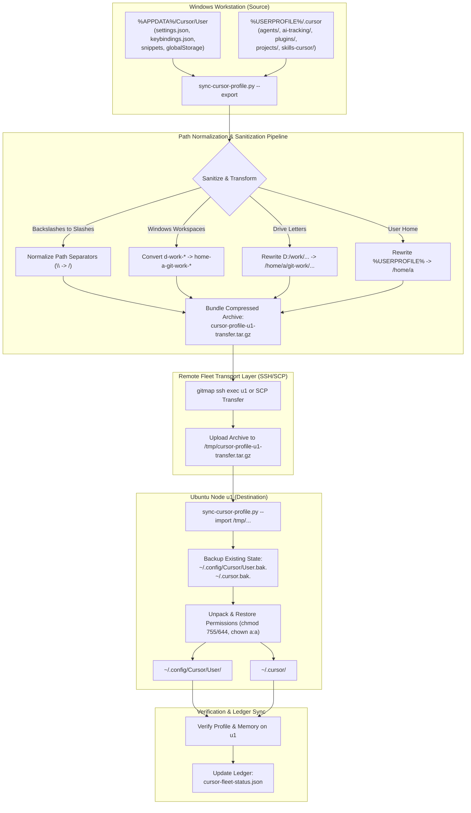
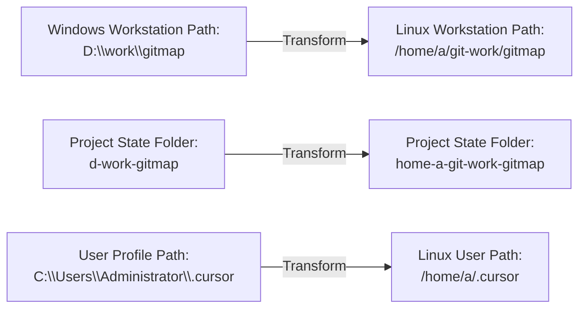
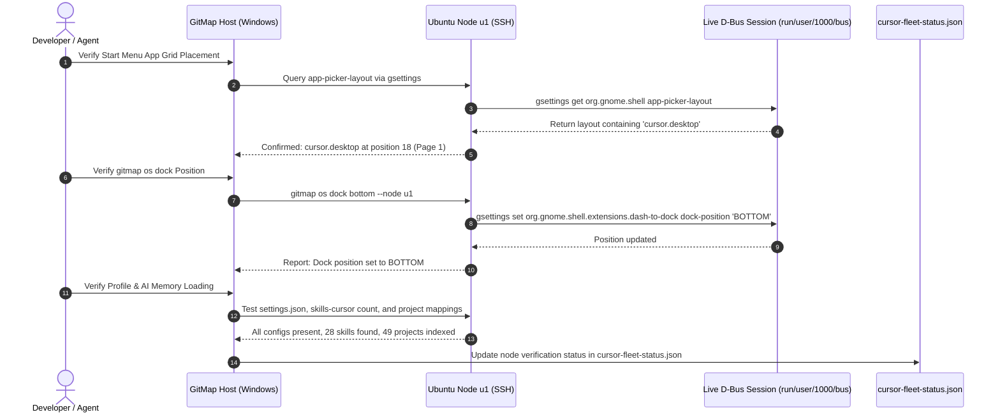
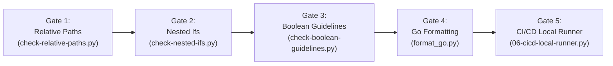

# 225: Cursor Profile & AI Memory Migration Engine, Remote Node u1 Live Verification, Linter Quality Gates & Release Ceremony

**Spec ID:** 225  
**Component Spec:** 02  
**Status:** Approved / Authoring  
**Version:** 1.0.0  
**Updated:** 2026-10-05  
**Subsystems:** `repo-secrets/05-scripts/sync-cursor-profile.py`, `repo-secrets/04-ubuntu-migration/cursor-profile-transfer-notes.md`, `cli/cmdos/`, `cli/cmdssh/`, `linter-scripts/`, `03-ai-scripts/`  
**Target Environments:** Ubuntu Linux (Node `u1` VM @ `/home/a/git-work/`, `~/.config/Cursor/`, `~/.cursor/`), Windows Workstation (`%APPDATA%/Cursor/User/`, `%USERPROFILE%/.cursor/`), GitMap Cross-Platform CLI  

---

## 1. Executive Summary & Problem Analysis

### 1.1 Context & Background
Task 225 establishes complete developer environment parity between the primary Windows workstation and remote Linux development nodes (specifically Ubuntu node `u1`). In preceding iterations (tasks 223 and 224), Cursor IDE was installed on Ubuntu node `u1` as a standalone AppImage, configured with an official desktop entry (`cursor.desktop`), high-resolution branding icons, dock pinning in `org.gnome.shell favorite-apps`, Dracula color theme, and repository workspace indexing in Project Manager (`projects.json`).

However, two major gaps prevent seamless cross-platform workflow migration:
1. **Desktop Shell & App Grid Placement:** While `cursor.desktop` is pinned to the dock favorites, GNOME Shell's application grid (the "Show Applications" / Start Menu screen) requires explicit placement in `org.gnome.shell app-picker-layout` so that Cursor appears immediately on the first page of the application launcher grid alongside core tools. Additionally, users require the ability to configure dock/panel orientation (`bottom`, `left`, `right`, `top`) via `gitmap os dock [--node <alias>]`.
2. **Profile, Settings & AI Memory Migration:** Developers have accumulated rich local configuration and AI agent context on their primary workstation:
   - User Configuration: `%APPDATA%/Cursor/User` (`settings.json`, `keybindings.json`, `snippets`, `globalStorage`, `workspaceStorage`).
   - AI Memory, Agents & Plugins: `%USERPROFILE%/.cursor` (`agents/`, `ai-tracking/`, `extensions/`, `plugins/`, `projects/`, `skills-cursor/`, `argv.json`, `cli-config.json`, `statsig-cache.json`).
   - Crucially, Windows-specific path strings (such as backslashes `\`, drive letters, and Windows root paths) must be systematically sanitized into POSIX paths (`/home/a/git-work/*` and `/home/a/.cursor/*`) before loading into the Ubuntu target directories (`~/.config/Cursor/User/` and `~/.cursor/`).

### 1.2 Non-Destructive Invariant & Workspace Protection
A strict **Non-Destructive Invariant** governs all migration and verification operations:
- **Zero Data Loss:** Existing remote settings on `u1` must be safely backed up to timestamped archives before applying updates.
- **Protected Directories:** Working project repositories (`/home/a/git-work/` on Linux, `<workspace_root>/` on Windows) are immutable invariants and must never be deleted, modified, or overwritten by the migration engine.
- **Simulation First:** All migration utilities (`sync-cursor-profile.py`) and CLI commands must provide `--dry-run` simulation modes to display planned file trees, path transformations, and archive payloads without writing to disk or modifying live processes.

### 1.3 Scope of Specification
This component specification defines:
1. The **Cursor Profile, Settings & AI Memory Migration Engine** (`repo-secrets/05-scripts/sync-cursor-profile.py`), path sanitization matrices, and documentation schemas in `repo-secrets/04-ubuntu-migration/cursor-profile-transfer-notes.md`.
2. The **Remote Node `u1` Live Verification Protocol** validating GNOME app-picker layout injection, `gitmap os dock` multi-orientation configuration, and profile/memory loading on Ubuntu.
3. The **Linter Quality Gates** enforcing relative path hygiene, nested-if limits, boolean standards, and Go code formatting.
4. The **Minor Version Bump (`v6.487.0`) & Release Ceremony** using GitMap hyphen-separated atomic commit syntax and continuous pipeline error tracking (`gitmap pe -t`).

---

## 2. Component Architecture & System Flow



---

## 3. Cursor Profile & AI Memory Migration Engine

### 3.1 Source Directory & Payload Structure
The local Windows workstation maintains two primary directories for Cursor IDE:

#### 1. User Configuration: `%APPDATA%/Cursor/User`
| Path Component | File / Subdirectory | Purpose & Migration Behavior |
|---|---|---|
| `settings.json` | JSON configuration file | Editor layout, Dracula color theme, font family (`JetBrains Mono`), linting, auto-save delay. |
| `keybindings.json` | JSON keymap file | Custom shortcut configurations and command bindings. |
| `snippets/` | Directory | User code snippets across Go, Python, TypeScript, and Markdown. |
| `globalStorage/` | Directory | Extension global state, including `alefragnani.project-manager/projects.json`. |
| `workspaceStorage/` | Directory | Per-workspace UI state, editor tabs, and local cache (sanitized and selectively migrated). |

#### 2. AI Memory & Extensions: `%USERPROFILE%/.cursor`
| Path Component | File / Subdirectory | Purpose & Migration Behavior |
|---|---|---|
| `agents/` | Directory | Custom AI agent definitions and persona prompt configurations. |
| `ai-tracking/` | Directory | Telemetry and conversation tracking metadata. |
| `extensions/` | Directory | Installed Cursor extensions and plugins metadata. |
| `plugins/` | Directory | Active plugin manifests and runtime configurations. |
| `projects/` | Directory | Per-project agent transcripts, canvases, and MCP configurations (`d-work-*`). |
| `skills-cursor/` | Directory | AI skills collection (28 skills: `automate`, `autopilot`, `canvas`, `create-rule`, `goal`, `loop`, etc.). |
| `argv.json` | JSON configuration file | Electron/Chromium runtime arguments (hardware acceleration, sandbox flags). |
| `cli-config.json` | JSON configuration file | Cursor CLI authentication and server configurations. |
| `statsig-cache.json` | JSON cache file | Feature flags cache (sanitized or truncated for clean bootstrap). |

### 3.2 Path Normalization & Transformation Engine
When transferring configuration and memory structures from Windows to Linux, path representations must be systematically transformed. The `sync-cursor-profile.py` engine applies deterministic regex replacement rules:



#### Deterministic Transformation Matrix
| Source Windows Pattern | Target Ubuntu (`u1`) Pattern | Context |
|---|---|---|
| `(?i)[dD]:\\work\\` or `(?i)[dD]:/work/` | `/home/a/git-work/` | Root repository paths in settings, project lists, and session records. |
| `(?i)d-work-([a-zA-Z0-9_\-]+)` | `home-a-git-work-$1` | Project directory identifiers inside `~/.cursor/projects/`. |
| `(?i)[cC]:\\Users\\Administrator\\` | `/home/a/` | Home directory references in config files. |
| `\\` (in file URI / path strings) | `/` | Windows path separator normalization. |
| `file: scheme with Windows drive` | `file: scheme with POSIX /home/a/git-work/` | URI-encoded workspace state paths in storage databases. |

### 3.3 Migration CLI & Automation Interface

The migration engine is implemented in `repo-secrets/05-scripts/sync-cursor-profile.py` with companion shell and PowerShell scripts (`sync-cursor-profile.sh` and `sync-cursor-profile.ps1`).

```bash
# Export and bundle Windows profile to staging archive
python repo-secrets/05-scripts/sync-cursor-profile.py --export --output /tmp/cursor-profile-u1-transfer.tar.gz

# Export with dry-run simulation (prints file list and planned transformations)
python repo-secrets/05-scripts/sync-cursor-profile.py --export --dry-run

# Transfer and deploy to remote node u1
python repo-secrets/05-scripts/sync-cursor-profile.py --sync --node u1

# Local import on destination machine
python repo-secrets/05-scripts/sync-cursor-profile.py --import /tmp/cursor-profile-u1-transfer.tar.gz
```

#### CLI Flags Specification
| Flag | Short | Type | Default | Description |
|---|---|---|---|---|
| `--export` | `-e` | boolean | `false` | Scans local Windows Cursor directories, sanitizes paths, and creates compressed archive. |
| `--import` | `-i` | string | `""` | Path to archive tarball to extract and install into target user directories. |
| `--sync` | `-s` | boolean | `false` | Performs end-to-end export, SSH transfer to `--node`, and remote import execution. |
| `--node` | `-n` | string | `"u1"` | Remote fleet node alias for transfer and execution. |
| `--output` | `-o` | string | `""` | Custom path for export tarball archive. |
| `--dry-run` | `-d` | boolean | `false` | Simulates file discovery, sanitization, and transfer without modifying local or remote files. |
| `--backup` | `-b` | boolean | `true` | Creates timestamped backup of target directories before applying updates. |
| `--force` | `-f` | boolean | `false` | Overwrites destination files without interactive confirmation. |

### 3.4 Target Ubuntu Directory Hierarchy
Upon unpacking on node `u1`, files are placed in standard Linux XDG and user locations:
- `~/.config/Cursor/User/`:
  - `settings.json` (merged with Dracula color theme and JetBrains Mono typography)
  - `keybindings.json`
  - `snippets/`
  - `globalStorage/alefragnani.project-manager/projects.json`
- `~/.cursor/`:
  - `agents/`
  - `ai-tracking/`
  - `extensions/`
  - `plugins/`
  - `projects/` (renamed with `home-a-git-work-*` prefixes)
  - `skills-cursor/` (28 canonical skills)
  - `argv.json`
  - `cli-config.json`

Permissions on `u1` must strictly enforce:
- User ownership: `a:a` (`chown -R a:a ~/.config/Cursor ~/.cursor`).
- Directory mode: `0755` (`drwxr-xr-x`).
- File mode: `0644` (`-rw-r--r--`).

### 3.5 Migration Notes Documentation Specification
The schema and details of the migration are documented in `repo-secrets/04-ubuntu-migration/cursor-profile-transfer-notes.md`. This document must record:
1. Complete inventory of transferred directories and file counts.
2. Exact path transformation regex mappings used during export.
3. Backup archive paths and rollback procedures on `u1`.
4. Verification checklist and hash verification results for transferred configs.

---

## 4. Live Verification Protocol on Remote Node `u1`

The live verification protocol ensures that all components operate cleanly on remote node `u1` without manual intervention.



### 4.1 Verification Procedures & Assertions

#### 1. GNOME Shell App-Picker Layout Verification
- **Command:**
  ```bash
  gitmap ssh exec u1 "DBUS_SESSION_BUS_ADDRESS=unix:path=/run/user/1000/bus gsettings get org.gnome.shell app-picker-layout"
  ```
- **Assertion:** The returned layout string contains `'cursor.desktop': <{'position': <18>}>` (or explicit position mapping on Page 1).
- **Desktop Database Verification:**
  ```bash
  gitmap ssh exec u1 "update-desktop-database ~/.local/share/applications/ && update-desktop-database /usr/share/applications/ && echo 'DESKTOP_DB_OK'"
  ```
- **Assertion:** Exits 0 and prints `DESKTOP_DB_OK`.

#### 2. `gitmap os dock` Position Configuration Verification
- **Query Current Position:**
  ```bash
  gitmap os dock --node u1
  ```
  - **Assertion:** Output displays active dock orientation (e.g., `Dock position on u1: LEFT` or `BOTTOM`).
- **Update Position to Bottom:**
  ```bash
  gitmap os dock bottom --node u1
  ```
  - **Assertion:** Exits 0, reporting `✔ Dock position on u1 set to BOTTOM`.
- **Query D-Bus State Directly:**
  ```bash
  gitmap ssh exec u1 "DBUS_SESSION_BUS_ADDRESS=unix:path=/run/user/1000/bus gsettings get org.gnome.shell.extensions.dash-to-dock dock-position"
  ```
  - **Assertion:** Returns `'BOTTOM'`.
- **Restore Preferred Position (Left/Bottom):**
  ```bash
  gitmap os dock left --node u1
  ```
  - **Assertion:** Returns `'LEFT'`.

#### 3. Cursor Profile & AI Memory Verification
- **Settings Verification:**
  ```bash
  gitmap ssh exec u1 "test -f ~/.config/Cursor/User/settings.json && grep -q 'Dracula Theme' ~/.config/Cursor/User/settings.json && echo 'SETTINGS_OK'"
  ```
  - **Assertion:** Exits 0 and prints `SETTINGS_OK`.
- **AI Skills Count:**
  ```bash
  gitmap ssh exec u1 "ls -1 ~/.cursor/skills-cursor/ | wc -l"
  ```
  - **Assertion:** Returns >= 28 skills.
- **Projects Directory Mapping:**
  ```bash
  gitmap ssh exec u1 "ls -d ~/.cursor/projects/home-a-git-work-* | wc -l"
  ```
  - **Assertion:** Returns matching count of migrated workspace projects.
- **Project Manager Projects List:**
  ```bash
  gitmap ssh exec u1 "grep -c 'rootPath' ~/.config/Cursor/User/globalStorage/alefragnani.project-manager/projects.json"
  ```
  - **Assertion:** Matches all 49 repositories located under `/home/a/git-work/*`.

#### 4. Fleet Ledger Update
Update `repo-secrets/04-ubuntu-migration/cursor-fleet-status.json` with the following schema:
```json
{
  "nodeAlias": "u1",
  "cursorInstalled": true,
  "cursorVersion": "3.23.12",
  "iconDeployed": true,
  "desktopEntryDeployed": true,
  "dockPinned": true,
  "startMenuGridPlaced": true,
  "dockPosition": "BOTTOM",
  "profileMigrated": true,
  "aiMemoryLoaded": true,
  "skillsCount": 28,
  "projectsCount": 49,
  "status": "HEALTHY",
  "lastVerified": "2026-10-05T..."
}
```

---

## 5. Linter Quality Gates Protocol

Before initiating the version bump and release ceremony, the repository must pass all automated quality gates with zero violations.



### 5.1 Quality Gate Execution Matrix

| Gate | Linter Script | Rule Enforced | Waiver / Tolerance |
|---|---|---|---|
| **Gate 1** | `python linter-scripts/check-relative-paths.py` | Strictly prohibits hardcoded absolute drive letters (`C:`, `D:`, `d:\`, `c:\`) in code, specs, and plans. | Strictly 0 violations. |
| **Gate 1b** | `python 03-ai-scripts/49-verify-privacy-and-relative-paths.py` | Audits specifications and plans for raw IP leaks and absolute paths. | Strictly 0 violations. |
| **Gate 2** | `python linter-scripts/check-nested-ifs.py` | Maximum nesting depth <= 2. All deep conditionals must be flattened with early returns and guard clauses. | Strictly 0 violations. |
| **Gate 3** | `python linter-scripts/check-boolean-guidelines.py` | Positive boolean naming prefixes (`is*`, `has*`, `can*`, `should*`). Prohibits negative booleans. | Strictly 0 violations. |
| **Gate 4** | `python scripts/format_go.py` | Canonical Go code formatting via `gofmt -w` across all `.go` files under `cli/`. | Zero unformatted diffs. |
| **Gate 5** | `python 03-ai-scripts/06-cicd-local-runner.py` | High-speed multi-worker validation running all repository CI gates. | 100% green pass. |

---

## 6. Minor Version Bump & Release Ceremony

### 6.1 Version Bump Invariants
- **Current Version:** `6.486.0` (as resolved in `version.json`).
- **Target Version:** `6.487.0` (Minor Bump according to repository Rule 0).
- **Execution Script:** `03-ai-scripts/37-bump-version.py`.
- **Command:**
  ```bash
  python 03-ai-scripts/37-bump-version.py --tier minor --scope "cursor - start menu app grid placement, os dock position configuration, and profile memory migration"
  ```
- **Manifests Synchronized:**
  - `version.json` (canonical source of truth)
  - `package.json`
  - `readme.md` (root badges and header version references)
  - `changelog.md` (new SemVer header and itemized entries)
  - `cli/constants/constants.go` (internal CLI version string)

### 6.2 Hyphen-Separated Atomic Commit Standard
In strict adherence to GitMap commit guidelines, the release commit must follow the exact hyphen-separated multi-phase syntax:

```text
cursor - start menu app grid placement, os dock position configuration, and profile memory migration
```

### 6.3 Pipeline Monitoring Protocol (`gitmap pe -t`)
Following release staging, CI/CD telemetry must be actively tracked:
1. Execute: `gitmap pe -t` (or `gitmap pipeline errors --timeline`).
2. Monitor real-time status until all jobs show `✔ SUCCESS`.
3. If any step fails, capture diagnostic stack traces using `gitmap pe` and remediate without manual intervention.

---

## 7. Acceptance Criteria & Verification Matrix

| Area | Acceptance Criteria | Verification Method |
|---|---|---|
| **App Grid Placement** | `cursor.desktop` is registered in `org.gnome.shell app-picker-layout` on `u1` at position 18. | Query `gsettings get org.gnome.shell app-picker-layout`. |
| **Desktop Database** | `update-desktop-database` executed for both user and system application directories. | Shell exit code check on `u1`. |
| **Dock Position CLI** | `gitmap os dock [bottom|left|right|top] [--node u1]` queries and sets dock position. | CLI invocation and D-Bus verification. |
| **Profile Migration** | `sync-cursor-profile.py` bundles, normalizes Windows paths, and extracts cleanly into `u1`. | Run sync script and inspect target directories. |
| **AI Memory Loaded** | 28 AI skills and workspace project state loaded into `~/.cursor/` on `u1`. | Count directories under `~/.cursor/skills-cursor/`. |
| **Migration Notes** | `cursor-profile-transfer-notes.md` authored detailing transferred components and schemas. | Inspect markdown document in `repo-secrets`. |
| **Fleet Ledger** | `cursor-fleet-status.json` updated with timestamped health status for `u1`. | Validate JSON ledger syntax and fields. |
| **Linters** | Zero relative path, nested-if, or boolean violations across the repository. | Run linter scripts and CI runner. |
| **Version Bump** | Repository cleanly updated to `v6.487.0` with synchronized manifests. | Verify `version.json` and `changelog.md`. |
| **Commit Message** | Commit title matches `cursor - start menu app grid placement, os dock position configuration, and profile memory migration`. | Inspect staged git commit message. |
| **CI Telemetry** | Pipeline monitored via `gitmap pe -t` achieves 100% green pass. | Monitor pipeline status. |
