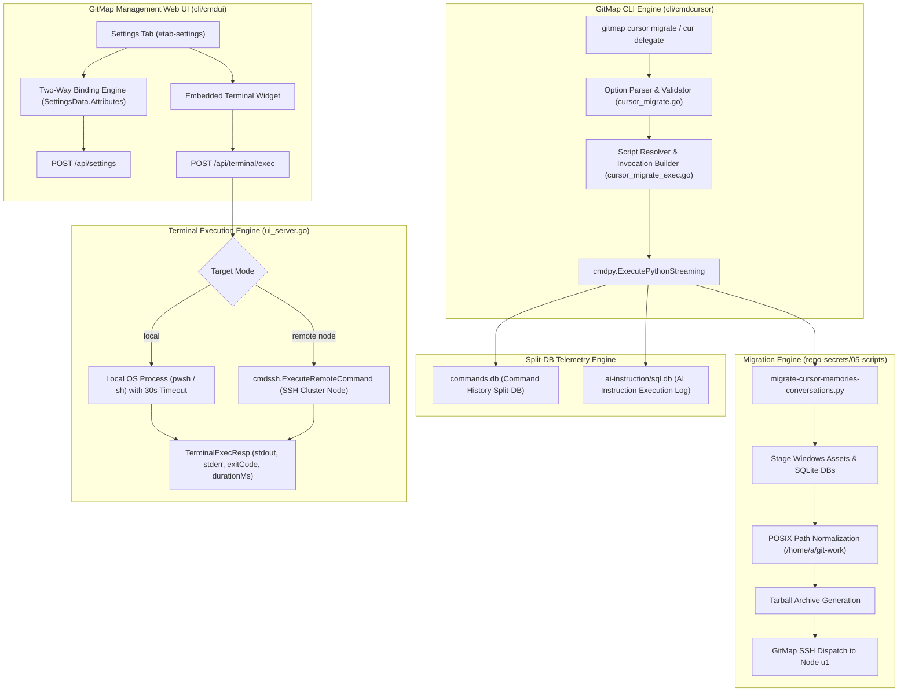
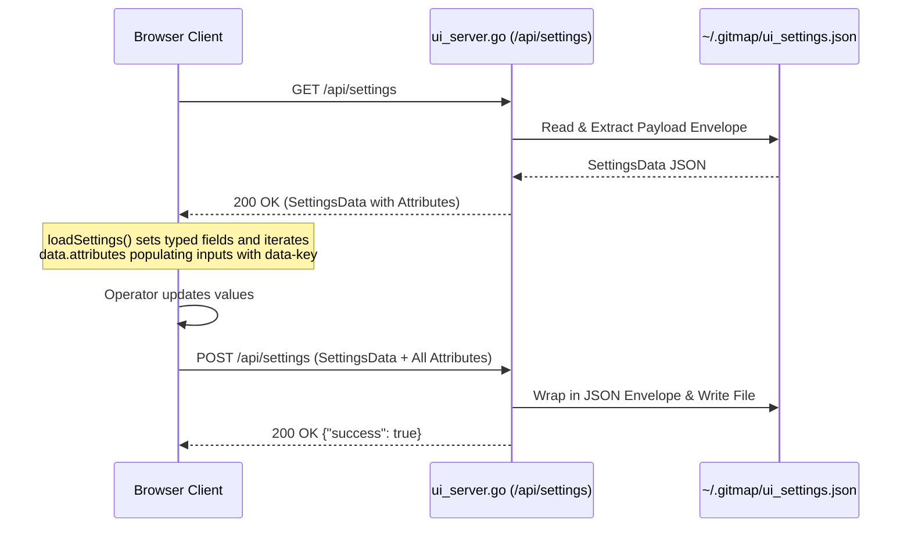

# 227: GitMap Cursor Fleet Delegation, Settings UI Modernization & Embedded Terminal Architecture

**Spec ID:** 227  
**Status:** Approved  
**Version:** 1.0.0  
**Updated:** 2026-10-05  
**Subsystems:** `cli/cmdcursor`, `cli/cmdui`, `cli/cmdpy`, `cli/store`, `repo-secrets/05-scripts`  
**Target Environments:** Windows (Local Development Workstation), Ubuntu Linux (Node `u1` and Fleet Nodes)  
**Parent Plan:** [227-gitmap-cursor-fleet-delegate-settings-ui-and-cross-node-path-suggestions.md](../../../.ai-memory/plans/subtasks/227-gitmap-cursor-fleet-delegate-settings-ui-and-cross-node-path-suggestions/01-cursor-migrate-cli-command.md)

---

## 1. Executive Summary & Problem Statement

### 1.1 Context
Following the successful migration of Cursor IDE internal state (AI memories, conversation search indexes, persona agents, skills, and 49 workspaces) to the Ubuntu testing node `u1` under specification [226-ubuntu-cursor-memories-conversations-and-projects-migration](../226-ubuntu-cursor-memories-conversations-and-projects-migration/01-architecture-spec.md), GitMap requires native, first-class CLI commands to delegate and manage migration runs across arbitrary fleet nodes without operators manually locating and invoking internal Python scripts.

Furthermore, operational use revealed two significant limitations in GitMap's management tools:
1. **Settings UI Two-Way Binding Data Loss:** In `cli/cmdui/ui_assets.go`, `loadSettings()` and `saveSettings()` only bound Card 1 general settings, silently discarding all 11 Speed and Machine Identity configuration fields (including `lap.default_hours`, `account_switch.threshold`, `telegram.bot_token`, and `email.*`).
2. **Lack of Embedded Terminal in Settings UI:** Operators adjusting node settings or executing quick fleet diagnostics were forced to switch between the browser and external terminal windows.

### 1.2 Core Objectives
- Introduce `gitmap cursor migrate` and `gitmap cur delegate` into the `cli/cmdcursor` subsystem, supporting targeted synchronization flags (`--node`, `--exclude`, `--skip-settings`, `--settings-only`, `--dry-run`, `--no-backup`, `--force`, `--output`).
- Standardize the migration engine execution pipeline through GitMap's `cmdpy` executor with dual Split-DB telemetry recording (`commands.db` and `ai-instruction/sql.db`).
- Overhaul `#tab-settings` in `cli/cmdui` to enforce complete attribute persistence across all configuration groups.
- Architect an interactive, context-timeout-guarded embedded terminal endpoint (`/api/terminal/exec`) supporting both local shell execution and remote SSH fleet node delegation.

---

## 2. System Architecture & Component Flow



---

## 3. Subsystem A: Cursor Fleet Delegation CLI (`cli/cmdcursor`)

### 3.1 Command Routing & Aliases
The `cli/cmdcursor` subsystem dispatches subcommands via `routeCursorSubcommand` in `cursor_cmd.go`. The delegation command is registered under the following primary verbs and aliases:

| Verb | Aliases | Description |
|:---|:---|:---|
| `migrate` | `m` | Export, package, and migrate Cursor assets to target fleet node |
| | `delegate`, `del` | Canonical alias emphasizing fleet delegation semantics |

Example invocations:
```bash
# Full end-to-end delegation to default node u1
gitmap cursor migrate

# Fleet delegation to specific node with exclusions and dry run
gitmap cur delegate --node u1 --exclude "projects/temp*,logs" --dry-run

# Synchronize settings and keybindings only
gitmap cursor migrate --node u1 --settings-only --force

# Synchronize conversation transcripts and memories without settings
gitmap cur delegate --node u1 --skip-settings --no-backup
```

### 3.2 Flag Catalog & Specifications

| Flag | Short | Type | Default | Description |
|:---|:---|:---|:---|:---|
| `--node` | `-n` | `string` | `u1` | Target fleet node alias or IP address |
| `--exclude` | | `string` | `""` | Comma-separated list of path or pattern exclusions |
| `--skip-settings` | | `bool` | `false` | Exclude `settings.json`, keybindings, and theme preferences |
| `--settings-only` | | `bool` | `false` | Migrate only configuration files; exclude SQLite chat databases |
| `--dry-run` | `-d` | `bool` | `false` | Simulate migration workflow without modifying files or dispatching SSH |
| `--no-backup` | | `bool` | `false` | Skip pre-flight snapshot backup creation on the remote node |
| `--force` | `-f` | `bool` | `false` | Overwrite destination files on target node unconditionally |
| `--output` | `-o` | `string` | `""` | Custom archive bundle path |

### 3.3 Option Validation & Mutual Exclusivity
- If both `--skip-settings` and `--settings-only` are specified, validation fails immediately with error code `E1035` (`mutually_exclusive_options`).
- The `--node` argument is validated against alphanumeric identifiers and dots/hyphens. If non-empty, it must correspond to an active or configured node alias.

---

## 4. Migration Engine Flow & Dual Split-DB Telemetry

### 4.1 Script Resolution & Process Execution
1. **Resolver:** Locate the canonical migration engine script at `repo-secrets/05-scripts/migrate-cursor-memories-conversations.py`. If invoked outside the repository root, search up to the discovered workspace root or the GitMap configuration path.
2. **Argument Assembly:**
   - Always append `--sync` to perform complete export-dispatch-unpack execution.
   - Append `--node <alias>`.
   - Conditionally forward `--exclude`, `--skip-settings`, `--settings-only`, `--dry-run`, `--no-backup`, `--force`, and `--output`.
3. **Execution Pipeline:** Invoke Python using `cmdpy.ExecutePythonStreaming`, which streams `stdout` and `stderr` directly to the terminal while tracking start timestamp and duration.

### 4.2 Split-DB Dual Telemetry Recording
Upon command completion, GitMap records telemetry into two independent SQLite databases conforming to the 3-Tier Split-DB architecture:

1. **`commands.db` (Command History Store):**
   - Opened via `store.OpenCommandHistorySplitDB("")`.
   - Inserts record: `InsertCommandRecord("cursor migrate --node ...", "cursor", exitCode, durationMs)`.
   - Enables historical auditing, command duration percentiles, and crash analysis.

2. **`ai-instruction/sql.db` (AI Instruction & Automation Store):**
   - Recorded via `store.RecordAiExecution`.
   - Records category `"cursor_migrate"`, full command line, serialized JSON arguments array, execution directory, client IP (`"127.0.0.1"`), duration, exit code, error message, and boolean success flag (`exitCode == 0`).

---

## 5. Subsystem B: Settings UI Architecture & Embedded Terminal (`cli/cmdui`)

### 5.1 Settings Two-Way Binding & Attribute Preservation
To resolve the critical data loss bug where Card 2 speed and machine identity settings were discarded, `cli/cmdui/ui_server.go` and `cli/cmdui/ui_assets.go` adopt dynamic attribute binding:



#### Settings Data Model (`ui_types.go`)
```go
type SettingsData struct {
    Theme           string            `json:"theme"`
    DefaultRemote   string            `json:"defaultRemote"`
    ClusterPort     int               `json:"clusterPort"`
    AutoDeployKey   bool              `json:"isAutoDeployKey"`
    GraphicsMode    string            `json:"graphicsMode"`
    AutoOpenBrowser bool              `json:"autoOpenBrowser"`
    CommitInLayout  string            `json:"commitInLayout"`
    PullDirection   string            `json:"pullDirection"`
    PRReplayMode    string            `json:"prReplayMode"`
    Attributes      map[string]string `json:"attributes"`
}
```

The `Attributes` map preserves arbitrary configuration keys without requiring schema migrations:
- `lap.default_hours`: Lookback hours (default: `24`)
- `account_switch.threshold`: Fast-forward threshold percentage (default: `15`)
- `telegram.bot_token`, `telegram.chat_id`: Telegram notification endpoints
- `email.smtp_host`, `email.smtp_port`, `email.sender`, `email.recipient`: Mail alert routing
- `machine.alias`, `machine.datacenter`: Fleet identity tags

### 5.2 Embedded Terminal Architecture

#### Endpoint Specification
- **Route:** `POST /api/terminal/exec`
- **Request Body (`TerminalExecReq`):**
  ```go
  type TerminalExecReq struct {
      Command    string `json:"command"`
      NodeAlias  string `json:"nodeAlias,omitempty"`  // "" or "local" for host; node ID for remote
      TimeoutSec int    `json:"timeoutSec,omitempty"` // default 30, max 120
      WorkingDir string `json:"workingDir,omitempty"` // optional working directory
  }
  ```
- **Response Body (`TerminalExecResp`):**
  ```go
  type TerminalExecResp struct {
      Output     string `json:"output"`
      ExitCode   int    `json:"exitCode"`
      DurationMs int64  `json:"durationMs"`
      IsSuccess  bool   `json:"isSuccess"`
      Error      string `json:"error,omitempty"`
  }
  ```

#### Execution Modes & Timeout Guards
1. **Local Mode:**
   - If `NodeAlias` is empty or `"local"`, spawn a host shell process with a context deadline bounded by `time.Duration(timeoutSec) * time.Second` (clamped between 1s and 120s, default 30s).
   - Windows host: `powershell.exe -NoProfile -NonInteractive -Command "<command>"`.
   - Linux / macOS host: `sh -c "<command>"`.
   - Separate stdout and stderr buffers are combined into `Output`. Buffer capacity is capped at 1 MB to prevent browser memory exhaustion.
2. **Remote Mode:**
   - If `NodeAlias` is set to a fleet node (e.g., `u1`), route the command through `cmdssh.ExecuteRemoteCommand(nodeAlias, command, timeoutSec)`.
   - Captures remote SSH terminal output and maps exit status code.

#### UI Embedded Widget in `#tab-settings`
The terminal widget is rendered as a dedicated card within the Settings view:
- **Terminal Display:** Monospace dark console display (`#0b1120` background) with scrollback buffer.
- **Node Selector:** Dropdown offering `Local Host` or any registered SSH node (`u1`, `u2`, etc.).
- **Quick Action Chips:** Clickable pill buttons to quickly populate diagnostic commands:
  - `gitmap status`
  - `gitmap nodes list`
  - `gitmap cur migrate --node u1 --dry-run`
  - `gitmap db sizes`
- **Command History:** Up/Down arrow key navigation through previous execution history.
- **Clear Console:** Quick button to clear terminal scrollback.

---

## 6. Acceptance Criteria & Quality Gates

| ID | Criterion | Verification Method |
|:---|:---|:---|
| **AC-227-01** | `gitmap cursor migrate --help` and `gitmap cur delegate --help` render consistent help menus documenting all flags | CLI invocation test |
| **AC-227-02** | Flag parsing correctly rejects mutually exclusive `--skip-settings` and `--settings-only` | Unit test in `cursor_migrate_test.go` |
| **AC-227-03** | Python migration script receives converted flags (`--exclude`, `--skip-settings`, `--settings-only`) | Execution spy & dry-run test |
| **AC-227-04** | Dual Split-DB telemetry successfully writes records to `commands.db` and `ai-instruction/sql.db` | SQLite table query inspection |
| **AC-227-05** | Settings UI preserves all Card 2 Speed/Bot settings across save and reload cycles | API test `GET/POST /api/settings` |
| **AC-227-06** | `/api/terminal/exec` executes local commands and respects 30s timeout guard without process leaks | API test `POST /api/terminal/exec` |
| **AC-227-07** | Zero violations in coding guideline linters (`check-nested-ifs.py`, `check-enum-and-boolean.py`) | Linter runner check |

---

## 7. Cross-References

- [Task 227 Master Audit Ledger](00-master-audit-ledger.md)
- [Subtask 01: Cursor Migrate CLI Command](../../../.ai-memory/plans/subtasks/227-gitmap-cursor-fleet-delegate-settings-ui-and-cross-node-path-suggestions/01-cursor-migrate-cli-command.md)
- [Subtask 02: Settings UI & Embedded Terminal](../../../.ai-memory/plans/subtasks/227-gitmap-cursor-fleet-delegate-settings-ui-and-cross-node-path-suggestions/02-settings-ui-design-and-embedded-terminal.md)
- [App UI Design System (Spec 24)](../../24-app-ui-design-system/01-index.md)
- [Spec 226: Cursor Memories & Conversations Migration](../226-ubuntu-cursor-memories-conversations-and-projects-migration/01-architecture-spec.md)
