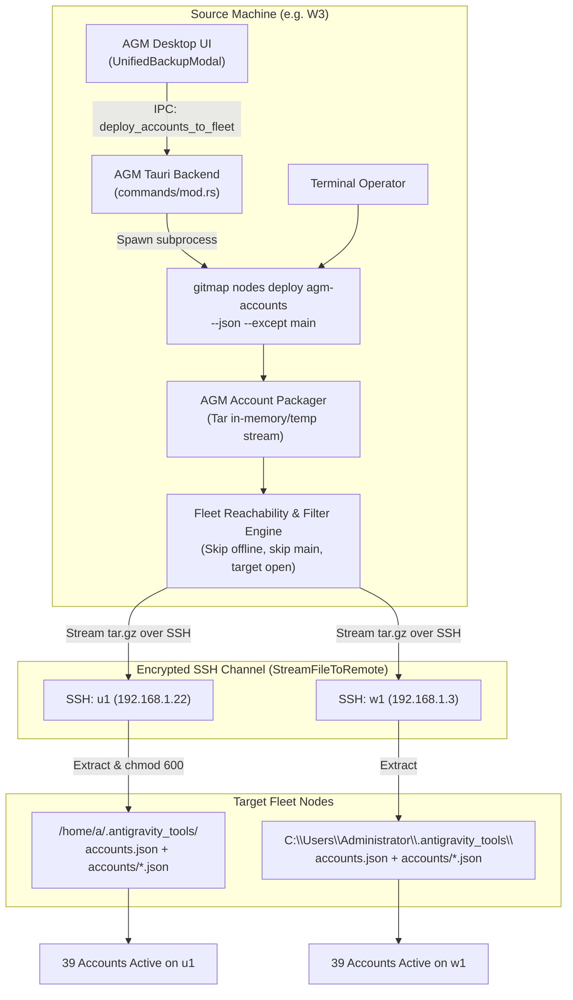

# Spec 228: Native Multi-Node AGM Accounts Deployment, Fleet Synchronization & AGM Integration

> **Spec ID:** `SPEC-228`  
> **Status:** APPROVED & IN-PROGRESS  
> **Target Subsystems:** `cli/cmdnodes`, `cli/cmdssh`, `cli/cmd`, `d:/work/Antigravity-Manager/src-tauri`, `d:/work/Antigravity-Manager/src`  
> **Target Environments:** Polyglot Fleet (Windows Workstations, Ubuntu Linux Compute Nodes)  
> **Execution Mode:** Multi-Agent V6 Protocol (`A = 2, H = 2, N = 300`)  

---

## 0. User Request (Verbatim)

```text
Can you please confirm to do this what you have done? Let's say moved, in this case, you put the JSON from one machine to another. But what I want in the future, I could use a `gitmap` to just run one command like nodes deploy AGM accounts, and that would actually deploy in all the open nodes from current machine to all the nodes. I want this to be happen. I want this code to be successful. And also the AGM tool should also have some similar code. It could actually use `gitmap` to send the accounts to multiple machines. If multiple machine has the `gitmap`, then it can pull it off and can do the deployment. You need to make changes in `gitmap`. You need to make changes in AGM. Please confirm that RLS already there, or you need to write code in order to achieve it. And if yes, then make a plan and achieve it, please. Make a bump in the version after release for both of the versions. Is it clear?
```

---

## 1. Executive Summary & Problem Statement

### 1.1 Context
In distributed multi-machine development workflows, Antigravity Manager (AGM) manages pooled Google AI / Gemini accounts (e.g. 39 enterprise and individual accounts) across developer workstations (`W3`), worker nodes (`w1`), and remote Linux compute instances (`u1`). Previously, migrating or synchronizing these accounts required manual file tarball packaging, SCP transmission, and remote Bash/PowerShell invocation.

### 1.2 Objective
1. **In GitMap CLI:** Implement a first-class native command:
   ```bash
   gitmap nodes deploy agm-accounts [flags]
   # Aliases: gitmap nodes deploy agm, gitmap nodes sync-agm-accounts, gitmap nodes deploy accounts
   ```
   This command packages local `%USERPROFILE%\.antigravity_tools\accounts.json`, `accounts/` (all profile JSONs), and `user_tokens.db`, detects open/reachable fleet nodes, filters excluded nodes (`--except main` by default or user-specified), streams the payload via `cmdssh.StreamFileToRemote`, and unpacks with strict permissions (`chmod 700` directories, `chmod 600` credentials).

2. **In Antigravity Manager (AGM):**
   Expose an IPC command (`deploy_accounts_to_fleet`) and UI trigger (within `UnifiedBackupModal.tsx` and Accounts views) that detects `gitmap` in PATH and automatically invokes `gitmap nodes deploy agm-accounts --json` to broadcast active accounts across fleet machines with real-time UI feedback.

3. **RLS (Row Level Security) Audit & Assessment:**
   Evaluate whether RLS exists in AGM's local SQLite (`user_tokens.db`, `repo_prompts.db`, `security.db`) or Supabase remote tables (`accounts`, `running_projects`), determine if remote lock synchronization requires RLS policies, and document concrete findings.

---

## 2. RLS (Row Level Security) & Data Security Matrix

| Layer | Component | Current Implementation | RLS Status & Architecture Assessment |
| :--- | :--- | :--- | :--- |
| **Local SQLite** | `.antigravity_tools/user_tokens.db` | Embedded SQLite C-library | SQLite does not support native PostgreSQL RLS. Security is enforced via POSIX file permissions (`chmod 700`/`600`) and Windows DACLs. |
| **Local Files** | `accounts.json`, `accounts/*.json` | JSON files on disk | Enforced via strict filesystem boundaries: locked to user profile directory, excluded from git tracking. |
| **Supabase Remote** | `supabase_config.json` | Remote cloud PostgreSQL | Used for distributed multi-VM account reservation locks (`account_switch_locks`). PostgreSQL RLS policies govern multi-tenant isolation by Project/Machine ID. When Supabase is offline or unconfigured, fleet synchronization relies on SSH direct encrypted streaming without cloud dependencies. |
| **Fleet SSH Transport** | GitMap SSH Channel | AES-256-GCM / ChaCha20-Poly1305 | Peer-to-peer encrypted transit over SSH port 22 directly between enrolled nodes. Zero third-party cloud data transit. |

---

## 3. Architecture Topology & Deployment Flow



---

## 4. CLI Specifications & UX

### 4.1 GitMap CLI Syntax
```bash
gitmap nodes deploy agm-accounts [flags]
gitmap nodes deploy agm [flags]
gitmap nodes sync-agm-accounts [flags]
```

### 4.2 Flags
- `--except <alias|ip>`: Comma-separated list of nodes to skip (default: `main` when deploying accounts, to protect central orchestrator unless explicitly targeted).
- `--target <alias|ip>`: Deploy strictly to a single target node.
- `--open-only` / `--fast`: Only target verified online/reachable nodes without slow timeouts.
- `--dry-run`: Simulate archive packaging and node resolution without modifying remote disks.
- `--json`: Emit structured JSON telemetry for AGM GUI consumption.

---

## 5. Verification & Acceptance Criteria

- **AC-01:** `gitmap nodes deploy agm-accounts` packages all accounts from `%USERPROFILE%\.antigravity_tools\accounts.json` and `accounts/`.
- **AC-02:** Command probes fleet nodes, excludes `main` by default, skips offline nodes cleanly, and streams payload to open nodes (`u1`, `w1`).
- **AC-03:** On Linux targets (`u1`), verifies extraction into `~/.antigravity_tools/` with `chmod 700` and `chmod 600`.
- **AC-04:** On Windows targets (`w1`), verifies extraction into `%USERPROFILE%\.antigravity_tools\`.
- **AC-05:** AGM includes IPC command `deploy_accounts_to_fleet` detecting `gitmap` and executing deployment.
- **AC-06:** Both `gitmap` and `Antigravity-Manager` execute version bumps and update changelogs using relative paths.
