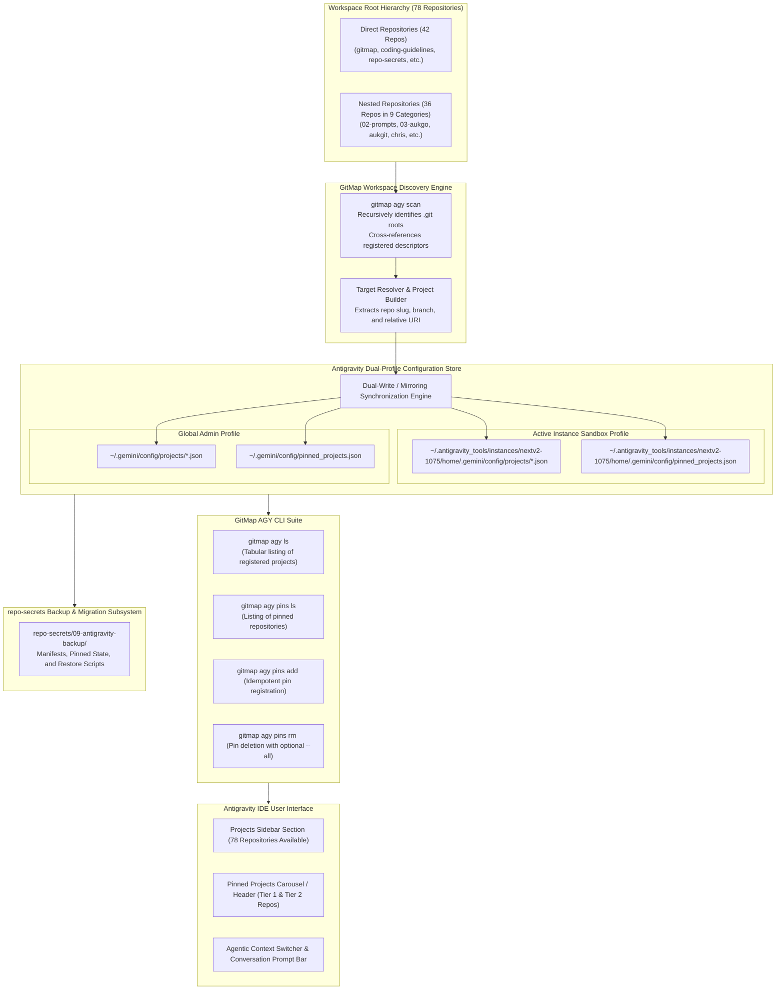
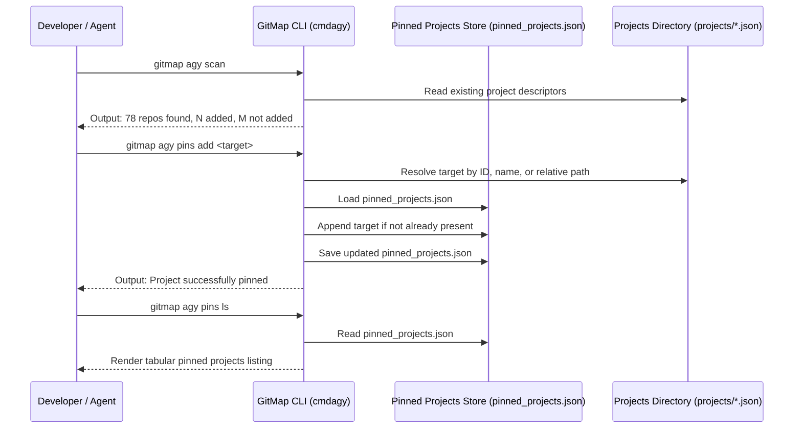

# Architecture Specification: Antigravity IDE Projects Discovery, Dual-Profile Storage, and Pinned Projects Engine

> **Specification Reference:** `02-spec/21-app/229-antigravity-ide-projects-and-settings-backup/01-architecture-spec.md`  
> **Status:** APPROVED & SPECIFIED  
> **Task Identifier:** `229-antigravity-ide-projects-and-settings-backup`  
> **Target Subsystems:** Antigravity IDE Project Manager, Dual-Profile Storage Engine, Pinned Projects Store (`pinned_projects.json`), GitMap AGY CLI Suite, Multi-Tier Workspace Discovery Engine  
> **Affected Files & Locations:** `~/.antigravity_tools/instances/nextv2-1075/home/.gemini/config/projects/`, `~/.gemini/config/projects/`, `~/.gemini/config/pinned_projects.json`, `repo-secrets/09-antigravity-backup/`, `cli/cmdagy/agy_pins.go`, `cli/cmdagy/agy_projects.go`  
> **Execution Constraint:** Pure Specification & Subtask Authoring (Strict No-Build / No-Test Mode)

---

## 1. Executive Summary & Problem Formulation

### 1.1 Context & Background
Antigravity (Google's agentic AI coding environment) organizes developer workspaces using individual project descriptors located in profile configuration stores under `.gemini/config/projects/*.json`. Each project descriptor defines the repository metadata, workspace resources, root paths, default git branches, and execution permission policies.

In parallel, GitMap provides an autonomous developer companion and CLI tool suite (`gitmap agy`) that scans local workspaces, inspects registered Antigravity projects, and orchestrates pinned repositories via `pinned_projects.json`.

### 1.2 Identified Regressions & Structural Gaps
A comprehensive audit of the active Antigravity IDE deployment and workspace filesystem revealed four fundamental operational issues:

1. **Severe Workspace Under-Registration (3 of 78 Repositories Registered):**
   - The workspace root contains 78 active Git repositories organized across direct top-level directories and specialized nested taxonomy namespaces.
   - In the active Antigravity instance profile, only 3 repositories (`gitmap`, `scripts-fixer`, `wp-html-automate`) are registered.
   - 75 repositories remain unregistered (`✖ not added`), preventing Antigravity's agentic selector, conversation manager, and project switcher from surfacing them.

2. **Dual-Profile Storage Divergence:**
   - Antigravity operates with an active instance sandbox profile (`~/.antigravity_tools/instances/nextv2-1075/home/.gemini/config/projects/`) while maintaining a global administrator profile (`~/.gemini/config/projects/`).
   - Project descriptors created in one profile are not mirrored to the other, leading to configuration drift, missing projects upon instance respawn, and fractured workspace visibility.

3. **Uninitialized Pinned Projects Store:**
   - Neither profile contains an initialized `pinned_projects.json` file indexing high-frequency core repositories.
   - Core infrastructure repositories (such as `coding-guidelines`, `repo-secrets`, `antigravity-manager`, and `repo-cache`) lack pinned status, forcing developers and autonomous agents to perform manual searches.

4. **Absence of Standardized Migration & Restoration Manifests:**
   - Moving or replicating Antigravity environments between workstations, virtual machine instances, or compute nodes lacks a zero-touch restoration procedure.
   - A centralized backup repository vault within `repo-secrets/09-antigravity-backup/` is necessary to store snapshots, pinned project manifests, and automated recovery scripts.

This specification establishes the architectural blueprints, repository taxonomies, JSON schemas, GitMap command integration workflows, and acceptance criteria required to achieve complete project registration and pinned workspace governance.

---

## 2. High-Level System Architecture & Component Topology

The following diagram illustrates the relationship between the workspace file hierarchy, the multi-tier discovery taxonomy, the dual-profile storage system, GitMap CLI commands, and the Antigravity IDE user interface:



---

## 3. 78-Repository Discovery Taxonomy & Inventory Matrix

The workspace encompasses exactly 78 Git repositories structured across two primary topological divisions: 42 direct root repositories and 36 nested repositories organized under 9 category namespaces.

### 3.1 Taxonomy Classification Matrix

| Category Namespace | Repo Count | Directory Description & Functional Domain |
| :--- | :--- | :--- |
| **Direct Workspace Root** | 42 | Primary applications, utilities, websites, and infrastructure services |
| **`02-prompts/`** | 3 | AI prompt architectures, tuner modules, and orchestration bridges |
| **`03-aukgo/`** | 7 | Shared Golang foundation libraries, core types, error handling, Redis |
| **`aukgit/`** | 3 | Linux installer engines, Kubernetes clusters, profile configurations |
| **`chris/`** | 4 | System optimization suites (linutil, winutil, image-tools, ChrisTitusTech) |
| **`commit-fix/`** | 2 | Specialized prompt architect refactoring repositories |
| **`presentations-repos/`** | 13 | Slide systems, corporate presentations, design assets, and logos |
| **`project-watch-pro/`** | 2 | Mobile and desktop fleet monitoring applications |
| **`seo-writing/`** | 1 | Search engine optimization and automated copywriting tooling |
| **`web-system/`** | 1 | Web-based property discovery and search systems |
| **Total Ecosystem** | **78** | **Complete developer workbench repository fleet** |

---

### 3.2 Inventory of All 78 Repositories

#### 3.2.1 Direct Workspace Root Repositories (42 Repositories)

1. `alim-cv` - Curriculum vitae and profile documentation repository
2. `alim-karim-profile` - Personal engineering portfolio and credentials
3. `alim-status-sample` - Status reporting and telemetry sample service
4. `antigravity-manager` - Multi-instance manager for Google Antigravity IDE (Tier 1 Core)
5. `awansoft-v10` - Enterprise software foundation suite
6. `cat-my` - System diagnostics and inspection tool
7. `coding-guidelines` - Canonical repository standards, specs, and prompts (Tier 1 Core)
8. `digital-name-card` - Digital identity and contact presentation card
9. `gitlogger-new` - Git event logger and commit activity daemon
10. `gitmap` - High-speed CLI developer companion and multi-tier orchestrator (Tier 1 Core)
11. `gstack` - Full-stack application scaffold and development template
12. `icon-coding-guidelines` - Iconography, SVG vector standards, and design assets
13. `img-pdf` - Image to PDF batch converter and manipulation utility
14. `kita-social-media-content-calender` - Social media calendar and scheduler
15. `lara-licensing` - Laravel licensing verification and software protection engine
16. `lara-publishing` - Content publishing pipeline and asset distributor
17. `laravel-automation` - Automated Laravel deployment and queue orchestrator
18. `letsmarknow` - Real-time bookmarking and URL synchronization system
19. `letsmarknow-ui` - Frontend web client for letsmarknow application
20. `macro-ahk` - Windows desktop automation and AutoHotkey productivity macros
21. `movie-cli` - Media query, catalog, and CLI metadata extraction tool
22. `network-fixer-hub` - Network diagnostic, DNS switcher, and socket repair service
23. `password-reset-helper-powershell` - PowerShell directory credential reset automation
24. `punam-case-studies-v1` - Case study showcase and visual marketing materials
25. `repo-cache` - Multi-language build artifact and package cache vault (Tier 1 Core)
26. `repo-secrets` - Central credential vault, tokens, and backup archives (Tier 1 Core)
27. `riseup-asia-website-project` - Corporate public website and marketing platform
28. `scripts-fixer` - Script syntax remediation and linting engine (Tier 1 Core)
29. `seo-packages` - Search engine optimization modular package library
30. `slack-ai-agent` - Slack agentic bot integration with AI LLM backend
31. `slide-sensei-37` - Automated presentation deck generation framework
32. `spec-builder` - Interactive technical specification authoring compiler
33. `test-repo-bootcamp-v1` - Developer onboarding and training sandbox
34. `ui-prompts-cat` - UI prompt library catalog and component showcase
35. `workflowy` - Workflow and task hierarchy management engine
36. `workflowy-ui` - Reactive user interface for workflow hierarchy management
37. `wp-exam` - WordPress educational examination and quiz engine
38. `wp-git-log` - WordPress plugin tracking git commit deployment logs
39. `wp-html-automate` - HTML extraction, scraping, and WordPress publisher (Tier 1 Core)
40. `wp-link-manager` - WordPress URL, affiliate, and internal link manager
41. `wp-onboarding` - Interactive WordPress user onboarding and site setup wizard
42. `yt-descriptions` - YouTube metadata generator, SEO tagger, and copywriter

---

#### 3.2.2 Nested Workspace Repositories (36 Repositories Across 9 Categories)

**Category 1: `02-prompts/` (3 Repositories)**
43. `02-prompts/ai-empathy-prompt-tuner` - Empathy tuning prompts and emotional calibration
44. `02-prompts/prompt-architect` - Prompt engineering design system and templates
45. `02-prompts/prompts-connect` - Prompt integration connectors and pipeline hooks

**Category 2: `03-aukgo/` (7 Repositories)**
46. `03-aukgo/core` - High-performance core primitives, data structures, and context tools
47. `03-aukgo/enum` - Type-safe string enums and serialization interfaces
48. `03-aukgo/errorwrapper` - Structured error wrapper with AppError compliance
49. `03-aukgo/extendcore` - Extended abstractions, collections, and reflection helpers
50. `03-aukgo/pathhelper` - Cross-platform path normalization and traversal protection
51. `03-aukgo/rediswrapper` - Resilient Redis client pool and connection supervisor
52. `03-aukgo/strhelper` - String normalization, slicing, and EqualFold utilities

**Category 3: `aukgit/` (3 Repositories)**
53. `aukgit/alim.karim.profile` - Git deployment configurations for profile services
54. `aukgit/common-linux-installer` - Shell bootstrap scripts for workstation provisioning
55. `aukgit/kubernetes-training` - Kubernetes manifests, helm charts, and cluster labs

**Category 4: `chris/` (4 Repositories)**
56. `chris/ChrisTitusTech` - General system utility tools and administration scripts
57. `chris/image-tools` - Desktop image conversion and batch resizing scripts
58. `chris/linutil` - Linux toolbox and package configuration utility
59. `chris/winutil` - Windows utility for debloating, optimization, and software setup

**Category 5: `commit-fix/` (2 Repositories)**
60. `commit-fix/prompt-architect-v2` - Iteration 2 prompt refactoring architecture
61. `commit-fix/prompt-architect-v3` - Iteration 3 prompt refactoring architecture

**Category 6: `presentations-repos/` (13 Repositories)**
62. `presentations-repos/bright-buddy-block` - Interactive slide component blocks
63. `presentations-repos/bsrm-presentation-hiltrax` - BSRM corporate presentation deck
64. `presentations-repos/flat-slide-show` - Minimalist flat design slide system
65. `presentations-repos/global-ppt-v1` - Global corporate template presentation v1
66. `presentations-repos/hiltrax` - Hiltrax interactive brand presentation deck
67. `presentations-repos/image-create-samples-v1` - Visual generation sample assets
68. `presentations-repos/ki-health-ppt` - Healthcare domain presentation deck
69. `presentations-repos/maid-app-spec-presentation` - Maid mobile app specification slides
70. `presentations-repos/presentation-aug-2026-plans-alim` - Strategic planning deck
71. `presentations-repos/rasia-logo` - RiseUp Asia vector logo and branding assets
72. `presentations-repos/remix-of-presentation-riseup-asia` - Remix slide presentation
73. `presentations-repos/slides-spec` - Specification system for declarative slide decks
74. `presentations-repos/white-presentation-v1` - High-contrast monochromatic presentation

**Category 7: `project-watch-pro/` (2 Repositories)**
75. `project-watch-pro/project-watch-pro` - Desktop project monitoring and telemetry dashboard
76. `project-watch-pro/pwp-mobile` - Mobile client companion for Project Watch Pro

**Category 8: `seo-writing/` (1 Repository)**
77. `seo-writing/alim-seo-writing` - Automated SEO content generator and rank analyzer

**Category 9: `web-system/` (1 Repository)**
78. `web-system/sweet-digs-finder` - Property search portal and location finder

---

## 4. Antigravity Configuration Storage Architecture

### 4.1 Dual-Profile Model: Sandbox Instance vs. Global Profile

Antigravity operates with a dual-tier filesystem profile architecture to maintain isolation between isolated runtime instances and global workstation settings:

1. **Active Instance Profile (`~/.antigravity_tools/instances/nextv2-1075/home/.gemini/`):**
   - Encapsulates the specific runtime environment of the active instance (`nextv2-1075`).
   - Project descriptors reside in: `~/.antigravity_tools/instances/nextv2-1075/home/.gemini/config/projects/`.
   - Pinned projects store resides in: `~/.antigravity_tools/instances/nextv2-1075/home/.gemini/config/pinned_projects.json`.
   - The active IDE process running in this instance directly reads and monitors this path for live updates.

2. **Global Administrator Profile (`~/.gemini/`):**
   - Serves as the persistent host-wide configuration registry across instance reboots or re-creations.
   - Project descriptors reside in: `~/.gemini/config/projects/`.
   - Pinned projects store resides in: `~/.gemini/config/pinned_projects.json`.
   - Standalone CLI invocations and automated tools read this path when running outside an instance sandbox.

> [!IMPORTANT]
> To prevent configuration divergence and ensure seamless transitions, every project registration and pinned project mutation MUST perform dual-writes to both the active instance profile and the global administrator profile.

---

### 4.2 Project Descriptor Schema (`<project-id>.json`)

Each registered repository in Antigravity is represented by an individual JSON file named after its unique UUID identifier (e.g. `d4c6435c-c96d-4afc-adb2-c12b504734ba.json`).

```json
{
  "id": "d4c6435c-c96d-4afc-adb2-c12b504734ba",
  "name": "gitmap",
  "projectResources": {
    "resources": [
      {
        "gitFolder": {
          "folderUri": "work/gitmap",
          "defaultBranch": "main"
        }
      }
    ]
  },
  "settings": {
    "autoExecutionPolicy": "CASCADE_COMMANDS_AUTO_EXECUTION_EAGER"
  },
  "isWorkspaceOnly": false
}
```

#### Field Specifications:
- `id` (string, required): A deterministic or random UUID v4 identifier for the project.
- `name` (string, required): The human-readable name and slug of the repository.
- `projectResources.resources` (array, required): Array of workspace resource definitions.
- `projectResources.resources[0].gitFolder.folderUri` (string, required): Normalized relative path or portable URI of the git repository root.
- `projectResources.resources[0].gitFolder.defaultBranch` (string, required): The default active git branch (typically `main` or `master`).
- `settings` (object, required): Project-scoped policy grants, including execution permissions.
- `isWorkspaceOnly` (boolean, required): Affirmative flag indicating whether the project is restricted solely to workspace sessions (`false` for full IDE project support).

---

## 5. Pinned Projects Store Architecture (`pinned_projects.json`)

### 5.1 JSON Store Schema

The pinned projects store provides Antigravity and GitMap with an ordered list of frequently accessed repositories. The file is located at `~/.gemini/config/pinned_projects.json` (and mirrored in the instance configuration directory).

```json
{
  "version": "1.0.0",
  "updatedAt": "2026-10-06T16:20:00Z",
  "projects": [
    {
      "id": "d4c6435c-c96d-4afc-adb2-c12b504734ba",
      "name": "gitmap",
      "path": "work/gitmap",
      "branch": "main",
      "pinnedAt": "2026-10-06T16:20:00Z"
    }
  ]
}
```

#### Field Specifications:
- `version` (string, required): Schema version string (`1.0.0`).
- `updatedAt` (string, required): ISO-8601 / RFC 3339 UTC timestamp representing the last modification time.
- `projects` (array, required): List of `PinnedProject` records.
  - `id` (string, required): Matching UUID of the registered Antigravity project.
  - `name` (string, required): Repository slug name.
  - `path` (string, required): Relative workspace path of the repository root.
  - `branch` (string, optional): Active or default branch name.
  - `pinnedAt` (string, required): RFC 3339 UTC timestamp recording when the project was pinned.

---

### 5.2 Priority Tiers for Pinned Repositories

Pinned projects are divided into two distinct functional tiers:

#### Tier 1: Mandatory Core Repositories (7 Repositories)
These repositories form the operational backbone of the developer toolchain, configuration vault, and automation infrastructure:

1. **`gitmap`**: Core CLI developer companion, fleet delegator, and high-speed search engine.
2. **`scripts-fixer`**: Universal script fixer and polyglot linting/remediation tool.
3. **`wp-html-automate`**: Web content automation, HTML parser, and publishing hub.
4. **`coding-guidelines`**: Canonical coding standards, architecture specs, and prompt repository.
5. **`repo-secrets`**: Centralized secret storage, credential vaults, and backup archives.
6. **`antigravity-manager`**: Fleet-wide Google Antigravity instance and profile manager.
7. **`repo-cache`**: Build cache storage and dependency distribution vault.

#### Tier 2: Key Ecosystem Repositories (13 Repositories)
High-frequency domain tools and active development repositories:

8. **`chris/winutil`**: Windows workstation optimization and debloat toolbox.
9. **`chris/linutil`**: Linux system setup, shell styling, and package manager helper.
10. **`03-aukgo/core`**: Foundation Go library for high-throughput concurrency and contexts.
11. **`03-aukgo/errorwrapper`**: Structured error handling and logging wrapper.
12. **`02-prompts/prompt-architect`**: Canonical prompt engineering framework.
13. **`project-watch-pro/project-watch-pro`**: Desktop fleet monitoring dashboard.
14. **`presentations-repos/hiltrax`**: Core presentation deck engine.
15. **`presentations-repos/slides-spec`**: Declarative slide specification language.
16. **`cat-my`**: System diagnostics and logging inspector.
17. **`movie-cli`**: CLI media querying and metadata engine.
18. **`network-fixer-hub`**: Network routing and diagnostic workbench.
19. **`laravel-automation`**: Automated backend deployment suite.
20. **`letsmarknow`**: Real-time bookmarking and navigation synchronization service.

---

## 6. GitMap AGY CLI Suite Command Integration

GitMap exposes first-class subcommands within `gitmap agy` to govern projects and pins:



### 6.1 Command Reference

- **`gitmap agy scan [path]`**:
  Recursively discovers all `.git` directories under the target workspace root. Matches discovered folders against registered project descriptors in the active profile and reports added versus unadded repositories.
- **`gitmap agy ls`**:
  Lists all currently registered projects in the active Antigravity profile, displaying sequence indices, conversation IDs, project slugs, and workspace paths.
- **`gitmap agy pins ls [--json]`**:
  Displays all pinned repositories stored in `pinned_projects.json`. Supports plain tabular output and structured JSON formatting for programmatic consumption.
- **`gitmap agy pins add <target...>`**:
  Pins one or more repositories by project slug, sequence number, or relative path. Operation is strictly idempotent; if a project is already pinned, its existing record is preserved.
- **`gitmap agy pins rm <target...> [--all]`**:
  Removes a repository from the pinned list. When invoked with `--all` or `-a`, flushes all pinned entries.

---

## 7. Migration, Backup & Restoration Boundaries

To support disaster recovery, instance re-provisioning, and cross-machine synchronization, all project configurations, pinned states, and restoration procedures are archived in `repo-secrets/09-antigravity-backup/` (owned by Worker 02):

1. **Manifest Archive (`repo-secrets/09-antigravity-backup/vault/`):**
   - `projects-manifest.json`: Snapshot of all 78 registered project descriptors.
   - `pinned_projects.json`: Copy of the master pinned projects configuration.
   - `settings-snapshot.json`: Master editor settings and execution permissions.
2. **Restoration Automation Scripts:**
   - Standalone scripts to recreate project JSON descriptors and pinned stores on any fresh Antigravity installation without manual GUI intervention.
3. **Standard Operating Procedure (SOP):**
   - Detailed operational instructions in `repo-secrets/09-antigravity-backup/readme.md` describing full-system export and import workflows.

---

## 8. Concrete Acceptance Criteria & Verification Matrix

| Identifier | Acceptance Gate | Verification Command / Procedure | Success Threshold |
| :--- | :--- | :--- | :--- |
| **AC-01** | Total Repository Registration | `gitmap agy scan` | 78/78 repos report `✔ added` (0 not added) |
| **AC-02** | Dual-Profile Parity | Filesystem directory check across instance sandbox and global admin paths | 100% descriptor parity (78 JSON files in both profiles) |
| **AC-03** | Tier 1 Mandatory Core Pins | `gitmap agy pins ls` | All 7 Tier 1 core repositories present in `pinned_projects.json` |
| **AC-04** | Tier 2 Ecosystem Pins | `gitmap agy pins ls` | Key Tier 2 ecosystem repositories present |
| **AC-05** | GitMap CLI Command Parity | Execute `gitmap agy ls` and `gitmap agy pins ls` | Zero errors, zero missing project paths, clean output |
| **AC-06** | Relative Path Compliance | Textual scan of generated documentation and specs | 100% relative Git paths; zero absolute paths; zero `file:///` URIs |
| **AC-07** | Idempotent JSON Integrity | JSON syntax and schema validation | Valid JSON structure, correct RFC 3339 timestamps |
