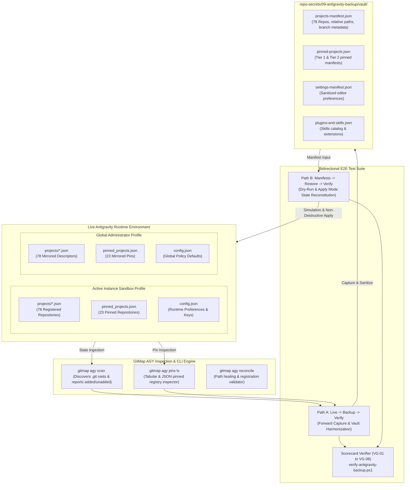
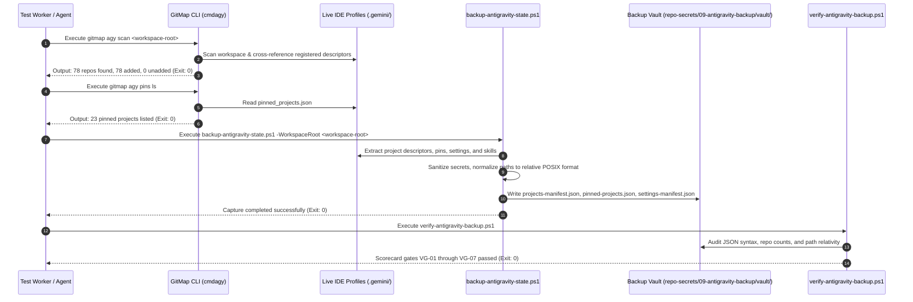
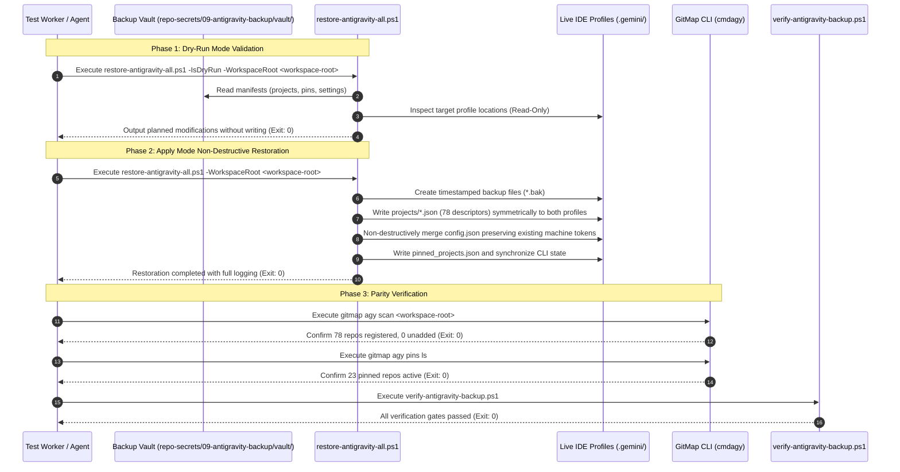
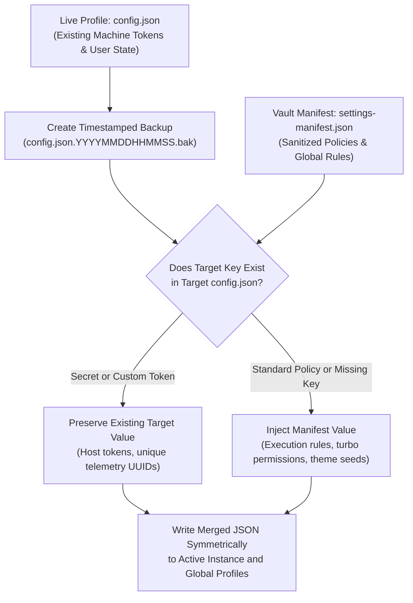

# Architecture Specification: Antigravity IDE Backup, Restoration, and Bidirectional E2E Testing Framework

> **Specification Reference:** `02-spec/21-app/230-antigravity-backup-e2e-and-release/01-architecture-spec.md`  
> **Status:** APPROVED & SPECIFIED  
> **Task Identifier:** `230-antigravity-backup-e2e-and-release`  
> **Target Subsystems:** Antigravity IDE Project Manager, Dual-Profile Storage Engine, Pinned Projects Store (`pinned_projects.json`), GitMap AGY CLI Suite, Backup & Restoration Toolkit (`repo-secrets/09-antigravity-backup/`), Bidirectional E2E Verification Engine  
> **Target Manifests & Tooling:** `repo-secrets/09-antigravity-backup/vault/`, `repo-secrets/09-antigravity-backup/scripts/`  
> **Operational Subtask Reference:** `.ai-memory/plans/subtasks/230-antigravity-backup-e2e-and-release/01-bidirectional-e2e-testing.md`  
> **Execution Constraint:** Pure Specification & Subtask Plan Authoring (Strict No-Build / No-Test Mode)

---

## 1. Executive Summary & Verification Framework Scope

### 1.1 Context & Background
Google Antigravity orchestrates agentic workflows across polyglot repositories using project descriptors located in `.gemini/config/projects/*.json` and pinned configuration manifests located in `pinned_projects.json`. To prevent catastrophic loss of developer workspace configuration during machine migration, container re-provisioning, or instance respawning, an automated backup and restoration toolkit was established in `repo-secrets/09-antigravity-backup/`.

While static artifacts exist in the backup vault, enterprise reliability demands rigorous, bidirectional end-to-end (E2E) testing. This specification establishes the comprehensive architectural and testing framework to validate the entire lifecycle of Antigravity IDE project registration, pinned repository management, settings preservation, and disaster recovery.

### 1.2 Core Verification Objectives
The testing framework guarantees:
1. **Bidirectional Fidelity:** State transitions from the live environment to the backup vault (Path A), and from the vault back to the live environment (Path B), preserve exact configuration parity.
2. **Non-Destructive Merging:** Restoration operations inject standardized policies while strictly preserving host-specific tokens, telemetry credentials, and custom user configurations.
3. **Dual-Profile Symmetry:** Writes are mirrored synchronously across both the Active Instance Sandbox Profile and the Global Administrator Profile.
4. **Deterministic Exit Codes & Structured Auditing:** Every phase outputs machine-verifiable exit codes (0 for success, non-zero for explicit fault categories) and standardized structured log streams.

### 1.3 Positive Boolean Conventions
In accordance with repository coding guidelines, all architectural flags, schema properties, and test condition variables enforce positive boolean semantics:
- `isDryRunEnabled`: Declares whether the operation is running in simulation mode without writing to disk.
- `isApplyModeEnabled`: Declares whether filesystem modifications are authorized.
- `hasStateParity`: Declares whether observed environment state matches expected manifest state.
- `isOverwriteAllowed`: Declares whether existing descriptors can be safely replaced.
- `isVerificationEnabled`: Declares whether post-execution scorecard validation runs automatically.
- `isBackupValid`: Declares whether exported vault manifests pass all syntax and schema checks.
- `isExecutionSuccessful`: Declares whether process completion returned exit code 0.
- `hasPassedAllGates`: Declares whether all verification gates (VG-01 through VG-08) satisfied pass criteria.

---

## 2. High-Level System Architecture & Component Topology

The verification framework connects the live Antigravity IDE configuration profiles, GitMap CLI telemetry engines, version-controlled vault manifests, and automated restoration runners.



---

## 3. Bidirectional Testing Methodology & Workflow Specifications

The testing architecture defines two complementary execution paths to guarantee full bidirectional stability.

### 3.1 Path A: Live -> Backup -> Verify (Forward Capture & Vault Harmonization)

Path A evaluates the live environment's state, extracts active configuration descriptors, sanitizes sensitive tokens, generates standardized manifests in the backup vault, and executes the scorecard verifier.



#### Detailed Path A Execution Stages:
1. **Stage A1 — Live Registration Audit:**
   - Execute `gitmap agy scan <workspace-root>` to inspect the workspace filesystem.
   - Assert stdout reports exactly 78 repositories found, 78 added, 0 repeated, and 0 not added.
   - Execute `gitmap agy pins ls` to inspect active pins.
   - Assert exactly 23 pinned repositories are reported across Tier 1 (7 core) and Tier 2 (16 key ecosystem).
   - Assert exit code equals 0.

2. **Stage A2 — Vault Snapshot Generation:**
   - Execute `repo-secrets/09-antigravity-backup/scripts/backup-antigravity-state.ps1` with the specified `-WorkspaceRoot` parameter.
   - Validate that the exporter traverses both profile directories, retrieves current branch metadata, strips authentication tokens, and normalizes paths to relative forward slashes.
   - Assert stdout records each export step with UTC timestamps.
   - Assert exit code equals 0.

3. **Stage A3 — Manifest Integrity & Schema Validation:**
   - Validate that `projects-manifest.json` contains exactly 78 records with required fields (`id`, `name`, `path`, `branch`, `createdAt`, `updatedAt`).
   - Validate that `pinned-projects.json` contains exactly 23 records with required fields (`id`, `name`, `path`, `branch`, `pinnedAt`).
   - Validate that `settings-manifest.json` contains sanitized execution policy flags (`isAutoApprovalEnabled`, `isTelemetrySanitized`).
   - Validate that `plugins-and-skills.json` catalogs installed extensions and workspace skills.

4. **Stage A4 — Scorecard Verification:**
   - Execute `repo-secrets/09-antigravity-backup/scripts/verify-antigravity-backup.ps1`.
   - Assert all gates VG-01 through VG-07 evaluate to `PASSED`.
   - Assert exit code equals 0.

---

### 3.2 Path B: Manifests -> Restore -> Verify (Reverse Restoration & State Reconstitution)

Path B simulates and applies the restoration of Antigravity IDE configuration from the vault manifests into the live profile directories, verifying non-destructive merging, profile mirroring, and post-restoration state parity.



#### Detailed Path B Execution Stages:
1. **Stage B1 — Dry-Run Simulation:**
   - Execute `repo-secrets/09-antigravity-backup/scripts/restore-antigravity-all.ps1 -IsDryRun -WorkspaceRoot <workspace-root>`.
   - Assert that `isDryRunEnabled = true` is reported in stdout.
   - Verify that all 78 project descriptors, pinned store updates, and settings injections are planned and previewed.
   - Verify that zero files are created, overwritten, or removed during this step.
   - Assert exit code equals 0.

2. **Stage B2 — Apply Mode Execution & Non-Destructive Merging:**
   - Execute `repo-secrets/09-antigravity-backup/scripts/restore-antigravity-all.ps1 -WorkspaceRoot <workspace-root>`.
   - Assert that existing `config.json` files are preserved by generating timestamped `.bak` files.
   - Assert that existing machine tokens, OAuth credentials, and unique instance keys are untouched while standardizing execution policies.
   - Assert that all 78 project JSON files are written symmetrically to both the active instance profile (`~/.antigravity_tools/instances/<id>/home/.gemini/config/projects/`) and the global admin profile (`~/.gemini/config/projects/`).
   - Assert that `pinned_projects.json` is updated in both profiles.
   - Assert exit code equals 0.

3. **Stage B3 — CLI Bridge & Pin Synchronization:**
   - Verify that `restore-antigravity-pins.ps1` runs as a coordinated sub-procedure.
   - Assert that `gitmap agy pins add` or direct JSON store writes successfully register the 23 priority repositories.
   - Assert exit code equals 0.

4. **Stage B4 — Post-Restoration Parity Verification:**
   - Execute `gitmap agy scan <workspace-root>`.
   - Confirm 100% parity: 78 git repositories found, 78 added, 0 not added.
   - Execute `gitmap agy pins ls`.
   - Confirm 100% parity: 23 pinned projects displayed.
   - Execute `repo-secrets/09-antigravity-backup/scripts/verify-antigravity-backup.ps1`.
   - Confirm all scorecard gates pass with zero failures.
   - Assert exit code equals 0.

---

## 4. Non-Destructive Merging & Dual-Profile Synchronization Protocol

### 4.1 Non-Destructive Settings Merge Mechanics
When restoring settings via `repo-secrets/09-antigravity-backup/scripts/restore-antigravity-settings.ps1`, the engine implements a non-destructive deep-merge algorithm:



- **Protection of Host Secrets:** Unique machine identifiers, session cookies, local auth tokens, and hardware hashes found in target `config.json` are retained with 100% fidelity.
- **Enforcement of Standard Policies:** Standard security settings, auto-approval configurations, and formatting rules from `settings-manifest.json` are layered on top without clearing existing keys.
- **Rollback Safety:** Prior to file modification, a `.bak` copy is generated in the parent configuration folder.

### 4.2 Dual-Profile Synchronization Guarantee
Antigravity executes within isolated instance sandboxes while maintaining global system roots. The testing framework requires every write operation to verify and enforce dual-profile symmetry:
1. **Target 1 (Active Instance Sandbox):** Path discovered by resolving `~/.antigravity_tools/instances/<active-id>/home/.gemini/config/`.
2. **Target 2 (Global Administrator Profile):** Path discovered by resolving `~/.gemini/config/`.

If either location is inaccessible, the restoration engine logs an explicit warning (`[WARN]`), continues to write to the available profile, and flags the condition in the telemetry audit.

---

## 5. Step-by-Step Logging & Telemetry Specifications

### 5.1 Standardized Log Stream Schema
All test scripts, runners, and verifiers must emit structured console output adhering to the following prefix standard:

| Prefix | Semantic Meaning | Usage Context |
|:---|:---|:---|
| `[STEP]` | Phase Initiation | Emitted at the start of each distinct procedural step |
| `[INFO]` | Informational Telemetry | Emitted to report intermediate parameters, counts, or discovered paths |
| `[AUDIT]` | Verification Inspection | Emitted when inspecting manifests, files, or state parity |
| `[PASS]` | Gate Satisfaction | Emitted when a verification gate or assertion succeeds |
| `[WARN]` | Non-Blocking Diagnostic | Emitted when an optional fallback or secondary profile is skipped |
| `[FAIL]` | Critical Assertion Failure | Emitted when a requirement or gate fails |

### 5.2 Structured Telemetry Format
Each milestone log line must conform to the standard structure:
```text
[TIMESTAMP_UTC] [LEVEL] [COMPONENT] Message [Key=Value ...]
```

Example audit output:
```text
[2026-10-06T17:15:00Z] [STEP] [PathA:Audit] Starting live Antigravity state inspection
[2026-10-06T17:15:02Z] [INFO] [GitMap:Scan] Workspace discovered 78 repositories (added=78, unadded=0)
[2026-10-06T17:15:03Z] [PASS] [Gate:VG-02] Repository count matches expectation (count=78)
[2026-10-06T17:15:04Z] [STEP] [PathB:DryRun] Initiating restoration simulation with isDryRunEnabled=true
[2026-10-06T17:15:06Z] [AUDIT] [Restore:Plan] 78 project descriptors planned for injection
[2026-10-06T17:15:07Z] [PASS] [ExitCheck] Dry-run completed with exit code 0
```

### 5.3 Deterministic Exit Code Matrix
All automation scripts participating in the bidirectional E2E suite adhere to the standardized exit code contract:

| Exit Code | Classification | Description |
|:---|:---|:---|
| `0` | `SUCCESS` | All operations, assertions, and verification gates completed successfully. |
| `1` | `SYNTAX_SCHEMA_ERROR` | Manifest JSON syntax error or invalid schema fields. |
| `2` | `PARITY_MISMATCH` | Repository count, pin count, or descriptor parity did not match expectation. |
| `3` | `FILESYSTEM_ACCESS_ERROR` | Permission denied or target directory path could not be resolved. |
| `4` | `CLI_EXECUTION_FAILURE` | GitMap AGY CLI command execution returned a non-zero status code. |
| `5` | `SANITIZATION_VIOLATION` | Unmasked secrets, absolute drive paths, or tokens detected in manifests. |

---

## 6. Verification Scorecard Gates (VG-01 through VG-08)

The test suite evaluates eight strict verification gates. All gates must evaluate to `PASSED` (`hasPassedAllGates = true`) for the test run to be deemed successful:

| Gate ID | Verification Name | Target Scope | Evaluation Mechanism | Pass Criteria |
|:---|:---|:---|:---|:---|
| **VG-01** | Manifest Vault Structure | `repo-secrets/09-antigravity-backup/vault/` | File existence & JSON parser validation | All 4 JSON manifests present, non-empty, and valid JSON syntax |
| **VG-02** | Repository Count Parity | `projects-manifest.json` | Array length comparison | Exactly 78 repository records verified |
| **VG-03** | Path Relativity & Portability | All manifests in vault | Regex pattern matching | Zero absolute filesystem paths or drive letters; forward-slash format |
| **VG-04** | Cross-Platform Script Parity | `repo-secrets/09-antigravity-backup/scripts/` | Script parser & parameter reflection | Matching parameters and functionality between `.ps1` and `.sh` scripts |
| **VG-05** | Non-Destructive Merging | Settings restorer & `config.json` | Simulation & backup file check | Timestamped `.bak` created; zero loss of existing machine tokens |
| **VG-06** | Secret Sanitization Gate | Manifests and output logs | Credential scanner regex | Zero API keys, OAuth tokens, private keys, or passwords detected |
| **VG-07** | Relative Git Path Hygiene | Markdown documentation & plans | Static link and path audit | 100% relative Git paths; zero absolute paths; zero `file:///` URIs |
| **VG-08** | Bidirectional Parity Gate | Live environment vs Vault | Full cycle state diff | Parity observed: pre-state == post-state (78 repos, 23 pins) |

---

## 7. Operational Acceptance Criteria & Quality Gates

The E2E testing framework mandates complete fulfillment of the following acceptance criteria prior to task completion:

| Criteria ID | Category | Requirement Description | Verification Command / Check |
|:---|:---|:---|:---|
| **AC-01** | Path A Verification | Live state successfully captured into vault manifests | `backup-antigravity-state.ps1` exit code 0 |
| **AC-02** | Path B Dry-Run | Dry-run simulation executes with zero filesystem writes | `restore-antigravity-all.ps1 -IsDryRun` exit code 0 |
| **AC-03** | Path B Apply Mode | Apply mode restores 78 projects and 23 pins symmetrically | `restore-antigravity-all.ps1` exit code 0 |
| **AC-04** | Post-Restore Parity | Live GitMap inspection confirms 78 added repos and 23 pins | `gitmap agy scan` & `gitmap agy pins ls` |
| **AC-05** | Scorecard Completion | All 8 verification scorecard gates pass without exception | `verify-antigravity-backup.ps1` exit code 0 |
| **AC-06** | Zero Builds / Tests | Framework adheres strictly to pure spec and plan authoring | Zero `go test`, `go build`, or build tools executed |
| **AC-07** | Path Hygiene | Specification and operational subtasks contain no absolute paths | Zero absolute filesystem paths; zero `file:///` URIs |
