# Architecture Specification: Spec 230 (Core CLI, Navigation, Pull Remediation & AGM Update)

> **Spec Document:** `02-spec/21-app/230-token-purge-installer-workdir-pull-agm-and-ui-modernization/01-architecture-spec.md`  
> **Parent Ledger:** [`00-master-audit-ledger.md`](00-master-audit-ledger.md)  
> **Parent Plan:** [`.ai-memory/plans/pending/230-token-purge-installer-workdir-pull-agm-and-ui-modernization.md`](../../../.ai-memory/plans/pending/230-token-purge-installer-workdir-pull-agm-and-ui-modernization.md)  
> **Target Version:** `v6.482.0`  
> **Module Scope:** Tasks 01 through 04 (Security, Installer Navigation, Pull Remediation, AGM Linux Update)  
> **Status:** APPROVED & IN-PROGRESS  

---

## 1. User Request (Verbatim)

```text
Can you please check and remove any one of the accounts JSON file that actually contains the refresh token from anywhere in the machine? It could be inside the work directory or outside. Also, in the `gitmap`. Installer. You need to improve the `gitmap` installer a bit and want to add a little bit more commands. For example, it could be the `gitmap` CD space dollar symbol work, then it would go to the default work directory. And also we could say dollar DEF. That would also go to default work directory. We should be able to set multiple work directories in the machine. Remember that command should be working. And make sure that the pool, when we do the `gitmap` pool, make sure that we can resolve most of the issues, like fast-forwarding, resolving merge conflict, things like that. And also in the AGM, Antigravity Manager, the update for the Linux does not work properly. And also one more point is the update section. When we do the update, it does not need to show that other commands or other things that it is doing. Only if it fails, then it will show into the terminal with the stack trace and everything. Only if it fails, but if it does not fail, then it should not do anything. Remember that. For example, if we have a failure, multiple failure, then the system should also tell us if we want to resolve those failures. In this case, the system did not ask. That is another problem. In this case, we have to resolve things by our own. That could be a little bit problematic. Try to respect that.
```

---

## 2. High-Level Architectural Overview

Spec 230 establishes robust core CLI foundations for workstation management, developer navigation, resilient repository synchronization, and background tool maintenance:

```mermaid
flowchart TD
    subgraph S1["Task-01: Security & Token Purge"]
        VM_CACHE["VMware / Host Caches\n(/home/a/.cache/vmware/...)"] -->|Search & Detect| SCAN_PURGE["Safe Unlink Engine\n(chmod check + rm)"]
        SCAN_PURGE --> SEC_VERIFY["Security Gate Pass\n(POSIX 0600 verified)"]
    end

    subgraph S2["Task-02: CD Navigation & Multi-Workdir"]
        SHELL_CMD["gitmap cd [$work | $def | <label>]"] --> RESOLVER["WorkDir Keyword Resolver\n(cli/cmd/cd_workdir_resolver.go)"]
        RESOLVER -->|Keyword Match| DB_DEFAULT["store.GetDefaultWorkDir()"]
        RESOLVER -->|Label Match| DB_LIST["store.ListWorkDirs()"]
        DB_DEFAULT --> HANDOFF["WriteShellHandoff() -> builtin cd"]
        DB_LIST --> HANDOFF
    end

    subgraph S3["Task-03: Pull Auto-Remediation"]
        PULL_REQ["gitmap pull / gitmap pa"] --> FF_TRY["Step 1: git pull --ff-only --autostash"]
        FF_TRY -->|Diverged| MERGE_TRY["Step 2: git pull --no-rebase --no-edit --autostash"]
        MERGE_TRY -->|Conflict Detected| ABORT_MERGE["Step 3: git merge --abort (Safe State)"]
        ABORT_MERGE --> PROMPT_MENU["Step 4: Interactive Remediation Prompt\n[1/a] All | [2/s] Step-by-Step | [q/n] Skip"]
    end

    subgraph S4["Task-04: AGM Linux Update Engine"]
        AGM_UP["gitmap agm update"] --> BUF_STREAM["Buffer Stdout/Stderr in Memory"]
        BUF_STREAM --> EXEC_SCRIPT["bash -c 'curl ... | bash'"]
        EXEC_SCRIPT -->|Exit 0| QUIET_OK["Silent / Minimal Success Indicator"]
        EXEC_SCRIPT -->|Exit Non-Zero| STACK_TRACE["Dump Bounded Stack Trace & Terminal Logs"]
        STACK_TRACE --> FLEET_PROMPT["Fleet Failure Interactive Resolver"]
    end
```



---

## 3. Subsystem Architecture & Technical Contracts

### 3.1 Task-01: Refresh Token & accounts.json Security Sanitization

#### 3.1.1 Problem Statement
Temporary development archives, VMware shared folders, and drag-and-drop cache directories (`/home/a/.cache/vmware/drag_and_drop/`) can inadvertently store unencrypted JSON snapshots containing sensitive OAuth 2.0 refresh tokens (e.g., `agm_accounts_backup_2026-10-06.json`). Such files pose a credential exposure risk if exposed to untracked git repos or world-readable temporary paths.

#### 3.1.2 Security Policy & Enforcement Rules
1. **Target Identification & Eradication:**
   - Scan system-wide temporary folders (`/tmp`, `/var/tmp`, `/home/a/.cache/vmware/drag_and_drop/`, Windows `%TEMP%`).
   - Identify backup files matching `agm_accounts_backup_*.json`, `accounts_backup*.json`, or files containing `"refresh_token": "1//` outside the canonical credential directory.
   - Execute atomic shredding and deletion of unauthorized token stores.
2. **Canonical Credential Boundary:**
   - Authorized accounts store resides strictly inside `~/.antigravity_tools/accounts.json` and individual profiles in `~/.antigravity_tools/accounts/*.json`.
   - POSIX permissions MUST be strictly enforced:
     - Directories: `0700` (`drwx------`)
     - Files: `0600` (`-rw-------`)
3. **Repository Cleanliness Check:**
   - Git repository scanning (`gitmap gitignore agm status` / `cli/gitignoreagm/sanitizer.go`) ensures zero credential files are tracked or unignored in `.gitignore`.

---

### 3.2 Task-02: GitMap Installer, `gitmap cd` Resolution & Multi-Workdir

#### 3.2.1 Problem Statement
Developers frequently switch to their primary workspace directory from arbitrary terminal locations. Passing `gitmap cd $work` or `gitmap cd $def` currently fails if the environment variables `$work` or `$def` are not already exported in the parent shell session, or if the resolver only checks literal words without leading dollar signs. Furthermore, developers need to manage multiple persistent work directories across physical disks.

#### 3.2.2 Resolution Logic in `cli/cmd/cd_workdir_resolver.go`
1. **Prefix Normalization:**
   - The resolver strips optional leading dollar signs (`$`) and trims leading/trailing whitespace.
   - Case-insensitive comparison is enforced using `strings.ToLower(strings.TrimPrefix(name, "$"))`.
2. **Workdir Keyword Dictionary:**
   ```go
   func isWorkDirKeyword(name string) bool {
       clean := strings.ToLower(strings.TrimPrefix(strings.TrimSpace(name), "$"))
       return clean == "work" || clean == "def" || clean == "default" || clean == "workdir" || clean == "wd"
   }
   ```
3. **Shell Wrapper Fallback (`cdfunction.go` & `constants_cd.go`):**
   - In Bash, Zsh, and PowerShell wrappers:
     - If `$work` expands to empty string in unquoted invocations (`gitmap cd $work` where `$work` is unset), the command executes as bare `gitmap cd`.
     - `handleBareCD()` in `cli/cmd/cd.go` routes directly to `resolveDefaultWorkDirPath()`, preserving expected navigation seamlessly.
     - When quoted (`gitmap cd "$work"` or `gitmap cd '$def'`), `isWorkDirKeyword` catches the literal token and dispatches to the default work directory.
4. **Multi-Workdir Management (`cli/cmdworkdir/`):**
   - `gitmap workdir add <path> [--label <label>]`: Registers directory in SQLite `work_directories` table.
   - `gitmap workdir ls`: Lists all configured workspaces with ID, label, path, and default marker (`*`).
   - `gitmap workdir set <id|path|label>`: Updates `is_default` flag in SQLite atomically.
   - `gitmap cd <label>`: Matches against registered workdir labels or folder basenames in addition to repo names.

---

### 3.3 Task-03: GitMap Pull Auto-Remediation & Conflict Resolution

#### 3.3.1 Problem Statement
When running bulk repository synchronization (`gitmap pull` / `gitmap pa`), network hiccups, divergent local commits, or non-fast-forward states cause routine pull operations to abort. Aborted pulls leave developers with manual rebase/merge overhead.

#### 3.3.2 4-Stage Safe Pull Workflow (`cli/cloner/safe_pull.go`)

```mermaid
sequenceDiagram
    participant User as CLI Operator
    participant SafePull as cloner.SafePullOne
    participant Git as Git Subprocess
    participant Prompt as cmdpull.PromptInteractiveBatchFix

    User->>SafePull: gitmap pull / gitmap pa
    SafePull->>Git: git -C <repo> pull --progress --ff-only --autostash
    alt Fast-Forward Success
        Git-->>SafePull: Exit 0 (Already up to date / Fast-forward)
        SafePull-->>User: Success Indicator
    else Divergent Commits
        Git-->>SafePull: Exit 1 (Not possible to fast-forward)
        SafePull->>Git: git -C <repo> pull --progress --no-rebase --no-edit --autostash
        alt Auto-Merge Clean
            Git-->>SafePull: Exit 0 (Merge made by 'ort' strategy)
            SafePull-->>User: Auto-Merge Remediated
        else Merge Conflict
            Git-->>SafePull: Exit 1 (Automatic merge failed; fix conflicts)
            SafePull->>Git: git -C <repo> merge --abort
            SafePull-->>Prompt: Collect Failure Record (Status: Conflict Aborted)
        end
    end
    opt Failures Present & Terminal Interactive
        Prompt->>User: Remediation Menu: [1/a] All | [2/s] Step | [q/n] Skip
        User->>Prompt: Choice [1/2/q]
    end
```

#### 3.3.3 Implementation Specifics
1. **Zero Working-Tree Dirty State:**
   - Every pull attempt utilizes `--autostash` to safely preserve uncommitted modifications during synchronization.
   - If auto-merge encounters conflicting files, `git merge --abort` is immediately executed. The repository working tree is restored to its pristine pre-merge state before returning `ErrMergeConflict`.
2. **Interactive Remediation Menu (`cli/cmdpull/pull_remediation.go`):**
   - When one or more repositories fail, `PromptInteractiveBatchFix` provides structured resolution paths:
     - `[1/a] Resolve all failed repositories at once`: Runs automated reconciliation across failed repositories.
     - `[2/s] Step through one by one`: Displays file conflict lists, remote diff links, and options to force-pull or stash.
     - `[q/n] Skip / Exit`: Emits standard diagnostic error table without blocking CI/CD runners.
3. **Non-Interactive CI/CD Guard:**
   - Detects `!isInteractiveTerminal()` (pipes, headless runners, CI/CD) and skips interactive prompts cleanly with exit codes preserved.

---

### 3.4 Task-04: AGM Linux Update Engine, Quiet Mode & Failure Resolver

#### 3.4.1 Problem Statement
When updating Antigravity Manager (`gitmap agm update` or fleet node updates), the Linux shell invocation dumps voluminous `curl` progress, package manager diagnostics, and system logs to standard output. On success, this verbose stream creates terminal clutter. Conversely, on failure, the tool exited without capturing full stack traces or prompting the user to resolve multi-node failure states.

#### 3.4.2 Architectural Design (`cli/cmdinstall/agm_update.go` & `installagmanager.go`)
1. **Output Buffering & Quiet Mode on Success:**
   - During `isUpdate = true` execution, standard output and standard error are intercepted using an internal memory buffer (`bytes.Buffer`).
   - If execution completes with exit code 0:
     - Discard verbose installation traces.
     - Output a concise, clean completion badge:
       ```text
       ✓ Antigravity Manager updated successfully (latest).
       ```
2. **Bounded Stack Trace & Diagnostic Capture on Failure:**
   - If the update subprocess exits with a non-zero code:
     - Flush the entire captured output buffer to standard error.
     - Format a structured diagnostic card containing:
       - Exit Code
       - OS Architecture (`runtime.GOOS`/`runtime.GOARCH`)
       - Binary target path (`/usr/local/bin/agm-alim` or `~/.local/bin/`)
       - Bounded error log (last 50 lines of script execution)
3. **Interactive Multi-Failure Prompt:**
   - For fleet or batch update failures (e.g. `gitmap agm update-all` across nodes `u1`, `w1`):
     - Track failed node targets in a structured slice (`[]AgmUpdateFailure`).
     - If failures occur in an interactive terminal, invoke `PromptAgmBatchUpdateFix()`:
       ```text
       [?] Antigravity Manager update failed on 2 nodes (u1, w2).
           [1/a] Retry failed nodes with elevated privileges (sudo/root)
           [2/s] Step through failed nodes with verbose logs
           [q/n] Skip / Abort
       ```

---

## 4. Positive Boolean & Zero-Nesting Rules

In accordance with repository coding standards (`02-spec/17-consolidated-guidelines/34-compiled-simple-coding-guidelines.md`):

1. **Positive Boolean Naming:**
   - Variables and struct fields must use affirmative prefixes:
     - `isSuccess`, `hasWorkDir`, `isInteractive`, `isAutoYes`, `isDiverged`, `isUpdate`.
     - FORBIDDEN: `isNotConfigured`, `unresolved`, `noPrompt`, `dontAbort`.
2. **Zero-Nesting & Guard Inversion:**
   - All error handling and edge cases must use immediate early returns.
   - Code blocks must never exceed 2 levels of nesting depth.

---

## 5. Requirements Traceability Matrix

| Requirement / Prompt Item | Canonical Spec Section | Target Code Files | Target Verification Check |
|:---|:---|:---|:---|
| Purge refresh token & accounts.json backups | Section 3.1 | `/home/a/.cache/vmware/drag_and_drop/` | Zero orphaned token JSON files found |
| Support `$work` and `$def` in `gitmap cd` | Section 3.2 | `cli/cmd/cd_workdir_resolver.go`, `cli/constants/constants_cd.go` | `gitmap cd $work` navigates to default workdir |
| Support multiple workdirs | Section 3.2 | `cli/cmdworkdir/workdir_cmd.go`, `cli/store/workdir_*.go` | `gitmap workdir add` & `gitmap workdir ls` work |
| Safe pull fast-forward & conflict abort | Section 3.3 | `cli/cloner/safe_pull.go`, `cli/cmdpull/pull_remediation.go` | Non-ff pull aborts merge cleanly without dirty git state |
| AGM Linux update quiet mode on success | Section 3.4 | `cli/cmdinstall/installagmanager.go` | Silent stdout on exit 0 |
| AGM Linux update stack trace on failure | Section 3.4 | `cli/cmdinstall/installagmanager.go` | Captured buffer flushed to stderr on error |
| AGM batch failure interactive prompt | Section 3.4 | `cli/cmdinstall/agm_update.go` | Interactive menu offered on multiple node failures |

---

## 6. Verification & Quality Gates

1. **Compilation & Static Checks:**
   - Package builds and syntax checks via gofmt / golangci-lint in CI/CD.
2. **Zero File Modification Leaks:**
   - Only assigned files authored; no unauthorized modifications to external modules.
3. **Relative Path Integrity:**
   - All markdown links validated against repository root.
