# Component & CLI Specification: Spec 230 (Multi-Instance API, UI Modernization, Image Sanitation & Interim Verification)

> **Spec Document:** `02-spec/21-app/230-token-purge-installer-workdir-pull-agm-and-ui-modernization/02-component-and-cli-spec.md`  
> **Parent Ledger:** [`00-master-audit-ledger.md`](00-master-audit-ledger.md)  
> **Architecture Spec:** [`01-architecture-spec.md`](01-architecture-spec.md)  
> **Parent Plan:** [`.ai-memory/plans/pending/230-token-purge-installer-workdir-pull-agm-and-ui-modernization.md`](../../../.ai-memory/plans/pending/230-token-purge-installer-workdir-pull-agm-and-ui-modernization.md)  
> **Target Version:** `v6.482.0`  
> **Module Scope:** Tasks 05 through 08 (Interim Verification, Multi-Instance API, Settings UI Modernization, Image Sanitation)  
> **Status:** APPROVED & IN-PROGRESS  

---

## 1. Executive Summary & Scope

While `01-architecture-spec.md` governs workstation security, installer navigation, pull auto-remediation, and AGM update mechanics, this specification defines the operational architectures, API contracts, user interface enhancements, and media sanitization protocols for the remaining core pillars:

1. **Task-05 (Interim Testing & Telemetry Audit):** Targeted unit and telemetric verification of recently committed subsystems across `cli/cmdpull/`, `cli/cmdpipeline/`, and `cli/scanner/` to prevent regressions without triggering full test suites.
2. **Task-06 (Antigravity Multi-Instance Prompt Query API):** Extends GitMap's Antigravity inspection layer (`cli/cmdagy/`) to support instance-filtered prompt querying, conversation inspection, and queue observation across multiple concurrent Antigravity IDE instances via structured JSON CLI flags and REST API endpoints (`/api/instances`, `/api/prompts/instances`).
3. **Task-07 (Settings UI Modernization & Design System Alignment):** Redesigns the Settings interfaces in both the React application (`src/pages/Settings.tsx`) and the embedded Go Web UI (`cli/cmdui/ui_assets.go`) against the 4-plane dark mode depth hierarchy and HSL design tokens, concluding with an authoritative curated index of reference UI/UX and CSS3 repositories.
4. **Task-08 (Codebase Image Inventory, Redaction & Git Scrub Protocol):** Catalogs all 141+ images across the repository, isolates purely textual screenshots for removal, specifies an automated redaction protocol for images exposing developer email addresses, details sanitized file renaming, and outlines a comprehensive `git-filter-repo` history scrub strategy.

```mermaid
flowchart TD
    subgraph T6["Task-06: Multi-Instance Engine"]
        DISCOVER["Instance Discovery Engine\n(pids, ports, socket paths)"] --> REGISTRY["Instance Registry Map\n[InstanceID -> Metadata]"]
        REGISTRY --> CLI_FLAGS["CLI: --instance <id> | --all-instances\n--json envelope"]
        REGISTRY --> REST_EP["REST: /api/instances\n/api/prompts/instances"]
    end

    subgraph T7["Task-07: Settings UI Modernization"]
        TOKENS["HSL Design Tokens\n(4-Plane Depth Hierarchy)"] --> REACT_UI["React Settings: src/pages/Settings.tsx\n(Radix + Tailwind Tokens)"]
        TOKENS --> EMBEDDED_UI["Embedded Web UI: cli/cmdui/ui_assets.go\n(#tab-settings HSL Theme)"]
        REF_CATALOG["Curated UI/UX & CSS3 Repo Index"] --> REACT_UI
    end

    subgraph T8["Task-08: Image Audit & Git Scrub"]
        IMG_SCAN["Repository Image Discovery\n(141+ image files)"] --> CAT_MATRIX["Classification: Text vs Diagram vs UI"]
        CAT_MATRIX --> TEXT_RM["Text Screenshot Removal\n(Convert to Markdown)"]
        CAT_MATRIX --> EMAIL_BLUR["Email PII Masking\n(Gaussian Blur / Solid Mask)"]
        EMAIL_BLUR --> RENAME_SYNC["Safe Re-naming & Path Sync"]
        RENAME_SYNC --> SCRUB_PLAN["Git History Purge Plan\n(git-filter-repo / BFG)"]
    end

    subgraph T5["Task-05: Interim Verification"]
        COMMITS["Recent Commits\n(pull, pipeline, scanner)"] --> SCOPED_TESTS["Targeted Go Unit Tests\n(cli/cmdpull, cli/cmdpipeline, cli/scanner)"]
        SCOPED_TESTS --> TELEMETRY["JSON Telemetry Validation"]
    end
```



---

## 2. Task-05: Interim Testing & Telemetry Audit

### 2.1 Context & Commit Traceability
Recent development introduced significant enhancements to several core subsystems:
- **`cli/cmdpull/`:** Ubuntu `pull-all` failure tree subtrees, recursive submodule ignore, automatic fast-forward retries, and structured pull error logging.
- **`cli/cmdpipeline/`:** Implementation of `executeAllPipelineErrorLogs` for `gitmap pe all`, `--is-all` CLI flags, unit test traceback extraction, and heatmap terminal renderers.
- **`cli/scanner/`:** Introduction of `DefaultScanExcludeDirs`, deep worktree discovery, and case-insensitive filesystem deduplication.

### 2.2 Testing Policy & Constraints
- **Zero Full-Suite Invocations:** In accordance with rule R1, invoking `go test ./...` or executing root test orchestration scripts is strictly forbidden.
- **Package-Scoped Execution:** Verification must be conducted strictly on isolated packages.
- **Telemetry Conformance:** Ensure that commands emitting JSON envelopes (`--json`) conform to positive boolean attributes (`isSuccess`, `hasErrors`, `isFiltered`).

### 2.3 Verification Matrix

| Package | Test Files to Execute | Key Functions Verified | Validation Objective |
|:---|:---|:---|:---|
| `cli/cmdpull/` | `pull_fallback_test.go`<br>`pull_flags_test.go`<br>`pull_progress_bar_test.go`<br>`pull_worker_test.go` | `executePullAllWithFallback`<br>`parsePullFlags`<br>`buildPullProgressBar` | Verify non-blocking concurrency, fast-forward retry logic, and zero panic during network aborts. |
| `cli/cmdpipeline/` | `pipeline_errorlogs_test.go`<br>`pipeline_all_errors_test.go`<br>`pipeline_failure_tree_test.go` | `executeAllPipelineErrorLogs`<br>`filterPipelineErrorsByCommit`<br>`renderFailureTree` | Validate `--is-all` flag propagation, Split-DB error persistence, and correct failure tree tree-view rendering. |
| `cli/scanner/` | `scanner_test.go`<br>`scanner_worktree_test.go`<br>`scanner_depth_test.go` | `ScanWorktrees`<br>`isExcludedScanDir`<br>`sortDiscoveredProjects` | Verify `DefaultScanExcludeDirs` skips `.cache`, `.oh-my-zsh`, and vendor directories reliably. |

### 2.4 Targeted Execution Commands
```bash
# 1. Verify cmdpull isolated package
go test -v -run TestPullFallback ./cli/cmdpull/
go test -v -run TestPullFlags ./cli/cmdpull/

# 2. Verify cmdpipeline error logging and all errors
go test -v -run TestPipelineErrorLogs ./cli/cmdpipeline/
go test -v -run TestPipelineAllErrors ./cli/cmdpipeline/

# 3. Verify scanner directory exclusion and worktree detection
go test -v -run TestScannerWorktree ./cli/scanner/
go test -v -run TestScannerExcludeDirs ./cli/scanner/
```

---

## 3. Task-06: Antigravity Multi-Instance Prompt/Conversation API

### 3.1 Problem Statement & Architectural Need
Developers frequently run multiple concurrent Antigravity IDE instances (e.g., separate VS Code / Antigravity windows working across independent workspace repositories). Previously, `gitmap rp` (running prompts) and `gitmap agy prompts` only queried the primary default instance located at `~/.gemini/antigravity/`. When multiple instances are running, developers cannot:
1. Target queries to a specific instance window.
2. View prompts queued in secondary instances.
3. Query prompts and conversations programmatically through a REST API.
4. Ingest recent conversations associated with active prompts formatted as structured JSON.

### 3.2 Instance Discovery & Identification Model

Each running or configured Antigravity instance is identified by an `InstanceID` and associated metadata:

```go
// AgyInstanceInfo encapsulates metadata for a running or configured Antigravity instance.
type AgyInstanceInfo struct {
    InstanceID       string   `json:"instanceId"`
    InstanceName     string   `json:"instanceName"`
    ProcessID        int      `json:"processId"`
    LanguageServer   string   `json:"languageServer"`
    ConfigDir        string   `json:"configDir"`
    BrainDir         string   `json:"brainDir"`
    SummariesDBPath  string   `json:"summariesDbPath"`
    ActiveWorkspaces []string `json:"activeWorkspaces"`
    IsPrimary        bool     `json:"isPrimary"`
    IsRunning        bool     `json:"isRunning"`
    LastActiveAt     string   `json:"lastActiveAt"`
}
```

#### Discovery Mechanics:
1. **Primary Instance:** Defaults to `~/.gemini/antigravity/` (`ConfigDir`) and `~/.gemini/antigravity/brain/` (`BrainDir`).
2. **Process Scan:** On Linux/macOS, discover instances by inspecting active language server processes (`pgrep -f "antigravity"` or process listening on ports). On Windows, query CIM instances (`Get-CimInstance Win32_Process`).
3. **Instance Registry Database:** Persist registered instance profiles in `~/.gemini/antigravity/instances.json` or query Split-DB instances table.

### 3.3 Prompt & Conversation Data Models

```go
// AgyInstancePromptQueryOptions provides filtering criteria for multi-instance prompt retrieval.
type AgyInstancePromptQueryOptions struct {
    InstanceID  string `json:"instanceId,omitempty"`
    IsAll       bool   `json:"isAll"`
    Status      string `json:"status,omitempty"` // "running", "queued", "all"
    Limit       int    `json:"limit"`
    MaxWords    int    `json:"maxWords"`
    IncludeConvs bool   `json:"includeConvs"`
}

// AgyMultiInstancePromptResponse provides the top-level API envelope.
type AgyMultiInstancePromptResponse struct {
    IsSuccess      bool                       `json:"isSuccess"`
    TotalInstances int                        `json:"totalInstances"`
    TotalPrompts   int                        `json:"totalPrompts"`
    Instances      []AgyInstancePromptPayload `json:"instances"`
    Error          string                     `json:"error,omitempty"`
}

// AgyInstancePromptPayload groups prompt snapshots by instance.
type AgyInstancePromptPayload struct {
    InstanceID    string                   `json:"instanceId"`
    InstanceName  string                   `json:"instanceName"`
    RunningCount  int                      `json:"runningCount"`
    QueuedCount   int                      `json:"queuedCount"`
    Running       []AgyPromptSnapshotItem  `json:"running"`
    Queued        []AgyPromptQueueEntry    `json:"queued"`
    RecentConvs   []AgyConversationPreview `json:"recentConvs,omitempty"`
}

// AgyConversationPreview captures recent conversation dialogue details.
type AgyConversationPreview struct {
    ConversationID string `json:"conversationId"`
    Title          string `json:"title"`
    WorkspacePath  string `json:"workspacePath"`
    LastPromptText string `json:"lastPromptText"`
    StepCount      int    `json:"stepCount"`
    UpdatedAt      string `json:"updatedAt"`
    IsActive       bool   `json:"isActive"`
}
```

### 3.4 CLI Command Specifications

#### 3.4.1 `gitmap rp ls` (Running Prompts List)
Enhance flags in `cli/cmdagy/agy_running_prompts_cmd.go`:
```text
Flags:
  -i, --instance string   Filter by Antigravity instance ID or alias (default: primary)
  -a, --all-instances     Aggregate prompts across all active Antigravity instances
      --json              Output envelope in machine-readable JSON format
      --full              Display full prompt text without word truncation
  -l, --limit int         Maximum prompts to display per instance (default: 8)
      --wc int            Maximum word count for prompt previews (default: 100)
```

#### 3.4.2 CLI Usage Examples
```bash
# Query running and queued prompts for specific instance
gitmap rp ls --instance gitmap-7845

# Query all running prompts across all instances formatted as JSON
gitmap rp ls --all-instances --json

# Read the latest conversation dialogue associated with an instance prompt
gitmap agy prompt read --instance gitmap-7845 --latest
```

### 3.5 REST API Specifications

The embedded HTTP server (`cli/cmdui/ui_server.go`) mounts the following endpoints:

#### 1. `GET /api/instances`
Returns a list of all detected or registered Antigravity instances.
- **Request Parameters:** None.
- **Response Format:**
  ```json
  {
    "isSuccess": true,
    "instances": [
      {
        "instanceId": "primary",
        "instanceName": "Default Antigravity Workspace",
        "processId": 14208,
        "languageServer": "127.0.0.1:42110",
        "configDir": "/home/a/.gemini/antigravity",
        "activeWorkspaces": ["/home/a/git-work/gitmap"],
        "isPrimary": true,
        "isRunning": true,
        "lastActiveAt": "2026-10-06T17:20:00Z"
      }
    ]
  }
  ```

#### 2. `GET /api/prompts/instances`
Returns prompts partitioned by instance.
- **Query Parameters:**
  - `instance`: (Optional) ID of target instance. Omit or set to `all` to aggregate.
  - `status`: (Optional) `running`, `queued`, or `all` (default: `all`).
  - `limit`: (Optional) Integer maximum items per instance (default: `10`).
  - `max_words`: (Optional) Integer maximum words per preview (default: `100`).
  - `include_convs`: (Optional) Boolean `true`/`false` to include recent conversation previews.
- **Response Format:**
  ```json
  {
    "isSuccess": true,
    "totalInstances": 1,
    "totalPrompts": 2,
    "instances": [
      {
        "instanceId": "primary",
        "instanceName": "Default Antigravity Workspace",
        "runningCount": 1,
        "queuedCount": 1,
        "running": [
          {
            "type": "running",
            "projectName": "gitmap-v28",
            "workspacePath": "/home/a/git-work/gitmap",
            "conversationId": "ae858955-579f-4285-9410-e98773fd5bb5",
            "title": "Authoring Component Spec & Subtasks 05-08",
            "promptPreview": "You are a spec and plan authoring subagent...",
            "status": "running",
            "elapsedSeconds": 145
          }
        ],
        "queued": [],
        "recentConvs": [
          {
            "conversationId": "ae858955-579f-4285-9410-e98773fd5bb5",
            "title": "Authoring Component Spec & Subtasks 05-08",
            "workspacePath": "/home/a/git-work/gitmap",
            "lastPromptText": "You are a spec and plan authoring subagent...",
            "stepCount": 12,
            "updatedAt": "2026-10-06T17:22:00Z",
            "isActive": true
          }
        ]
      }
    ]
  }
  ```

---

## 4. Task-07: Settings UI Modernization & Design System Alignment

### 4.1 Visual Hierarchy & Design System Rules
In accordance with `02-spec/07-design-system/18-dark-mode-and-materiality.md` and `03-theme-variable-architecture.md`, the Settings UI must eliminate amateur dark mode anti-patterns (pure black `#000000`, purple-blue gradient washes, flat uniform planes, and invisible heavy drop shadows) and implement the **4-Plane Neutral Depth Hierarchy**:

```text
┌────────────────────────────────────────────────────────────────────────┐
│ PLANE 3: Elevated (Lightness: 18% – 22%)                               │
│ Modal dialogs, dropdown popovers, active control chips, hover states   │
├────────────────────────────────────────────────────────────────────────┤
│ PLANE 2: Surface (Lightness: 14% – 17%)                                │
│ Settings cards, input fields, code blocks, segment containers          │
├────────────────────────────────────────────────────────────────────────┤
│ PLANE 1: Raised (Lightness: 10% – 13%)                                 │
│ Section wells, tab navigation rails, table headers, sidebar backdrops   │
├────────────────────────────────────────────────────────────────────────┤
│ PLANE 0: Base Canvas (Lightness: 7% – 9%)                              │
│ Overall page background (e.g., hsl(230, 25%, 8%))                      │
└────────────────────────────────────────────────────────────────────────┘
```

### 4.2 HSL Design Tokens

```css
:root {
  /* Core Surface Tokens (Dark Theme Native) */
  --background: 230 25% 8%;           /* Base Canvas (Plane 0) */
  --foreground: 220 20% 92%;          /* High-contrast body text */
  --card: 230 20% 12%;                /* Card Surface (Plane 2) */
  --card-foreground: 220 20% 92%;     /* Text on cards */
  --popover: 230 20% 16%;             /* Popover/Flyout (Plane 3) */
  --popover-foreground: 220 20% 92%;  /* Text on popovers */

  /* Neutral & Structure Tokens */
  --muted: 230 18% 18%;               /* Muted fill / container */
  --muted-foreground: 220 15% 65%;    /* Subtitle / secondary label */
  --border: 230 18% 20%;              /* Hairline border (1px solid) */
  --input: 230 18% 16%;               /* Form input background */
  --ring: 252 85% 65%;                /* Focus ring indicator */

  /* Brand & Accent Tokens */
  --primary: 252 85% 65%;             /* Interactive primary accent */
  --primary-foreground: 0 0% 100%;    /* Text on primary buttons */
  --accent: 330 85% 65%;              /* Secondary accent */
  --accent-foreground: 0 0% 100%;     /* Text on accent */
  --destructive: 0 72% 51%;           /* Critical alert / purge red */
  --destructive-foreground: 0 0% 100%;/* Text on critical elements */

  /* Radius & Elevation */
  --radius: 0.5rem;                   /* 8px rounded corners */
}
```

### 4.3 Modernization Plan: `src/pages/Settings.tsx`
1. **Visual Restructuring:**
   - Replace flat container styling with modular `Plane 2` card components styled with subtle top hairline lighting: `border border-border/40 shadow-sm bg-card`.
   - Add structured category tabs:
     - **General & Storage:** Temp directories, retention limits, database auto-vacuum.
     - **Antigravity & Fleet:** Multi-instance discovery, language server ports, prompt backup interval.
     - **Pipeline & Diagnostics:** Polling frequency, error traceback limits, failure tree depth.
     - **Terminal & Theme:** HSL color scheme selector, font size, shell path override.
2. **Form Interaction & Two-Way Binding:**
   - Synchronize with backend API (`/api/settings`) alongside `localStorage` fallback.
   - Display unambiguous positive boolean switches: `hasAutoSync`, `isTelemetryEnabled`, `isCompactView`.

### 4.4 Modernization Plan: Embedded Web UI (`cli/cmdui/ui_assets.go`)
1. Refactor `#tab-settings` layout into a responsive CSS grid using pure semantic tokens.
2. Replace hardcoded inline colors (`#1e1e1e`, `#333`) with HSL variables: `var(--card)`, `var(--border)`, `var(--primary)`.
3. Align interactive buttons with the unified button spec: hover state lightness shift of +4%, active click depression, and high-contrast text.

### 4.5 Curated Directory of Authoritative UI/UX & CSS3 Repositories

To maintain world-class visual craft, the following high-authority repositories and resources serve as architectural benchmarks for layout, accessibility, and micro-interactions:

| Repository / Resource | URL / Source | Primary Utility & Architectural Focus |
|:---|:---|:---|
| **shadcn/ui** | `github.com/shadcn-ui/ui` | Copy-paste accessible React primitives built on Radix UI and Tailwind CSS; exemplary tokenized theming. |
| **Radix Primitives** | `github.com/radix-ui/primitives` | Unstyled, fully accessible UI components (dialogs, tooltips, dropdowns, popovers) with WAI-ARIA compliance. |
| **Aceternity UI** | `github.com/mannupaaji/aceternity-ui` | High-impact modern components, border beams, glowing cards, and canvas animations. |
| **Magic UI** | `github.com/magicuidesign/magicui` | Polished interactive UI components, retro grids, particle animations, and dock bars. |
| **Tremor** | `github.com/tremorlabs/tremor` | React dashboard and telemetry components; clean dark mode metrics cards and charts. |
| **Lucide Icons** | `github.com/lucide-icons/lucide` | High-consistency, clean SVG icon set with zero runtime bloat. |
| **Tailwind CSS** | `github.com/tailwindlabs/tailwindcss` | Utility-first CSS framework establishing baseline token architectures. |
| **Modern CSS Solutions** | `moderncss.dev` | Deep-dive CSS3 architectural recipes for modern grid, flexbox, and accessible form styling. |
| **CodyHouse Framework** | `github.com/CodyHouse/codyhouse-framework` | Production-ready design system tokens, typography scales, and modular CSS utility classes. |
| **CSS-Tricks Guides** | `css-tricks.com` | Authoritative guides on fluid typography, CSS custom properties, and subgrid layouts. |

---

## 5. Task-08: Codebase Image Inventory, Redaction & Git Scrub Protocol

### 5.1 Repository Image Inventory & Categorization
A comprehensive audit across `assets/`, `.ai-memory/`, `02-spec/`, `cli/`, `docs/`, `public/`, and `src/` cataloged 141 image assets. They are partitioned into 4 distinct functional classes:

```text
┌────────────────────────────────────────────────────────────────────────┐
│ REPOSITORY IMAGE CATEGORIES (TOTAL: 141 ASSETS)                        │
├────────────────────────────────────────────────────────────────────────┤
│ 1. Core Architecture & Topology Diagrams (42 images)                   │
│    - Location: 02-spec/19-main-worker-service/diagrams/, etc.          │
│    - Action: RETAIN. Clean vector/raster architectural flows.          │
├────────────────────────────────────────────────────────────────────────┤
│ 2. Text-Only Terminal Screenshots (58 images)                          │
│    - Location: assets/screenshots/, .ai-memory/assets/error-handling/  │
│    - Examples: pe-pipeline-error-*.png, 15-ai-raw-git-status.png       │
│    - Action: REMOVE. Convert diagnostic outputs to Markdown blocks.    │
├────────────────────────────────────────────────────────────────────────┤
│ 3. PII & Email-Exposed Screenshots (12 images)                         │
│    - Examples: 14-github-238-commits.png, commit-pull-prompt-notes.png │
│    - Action: REDACT & RENAME. Blur email addresses, assign new names.  │
├────────────────────────────────────────────────────────────────────────┤
│ 4. Product UI, Branding & Extension Icons (29 images)                  │
│    - Location: cli/assets/, docs/assets/, src/assets/                  │
│    - Action: RETAIN. High-craft logos and application icons.           │
└────────────────────────────────────────────────────────────────────────┘
```

### 5.2 Identification of Text-Only Screenshots for Purge
Screenshots that merely display terminal commands, diff outputs, or log messages add unnecessary binary bloat to the repository. The following items must be phased out and replaced with markdown code fences:

1. `assets/screenshots/pe-pipeline-error-01.png`
2. `assets/screenshots/pe-pipeline-error-02.png`
3. `assets/screenshots/pe-pipeline-error-03.png`
4. `assets/screenshots/commit-pull-dry-run-telemetry.png`
5. `assets/screenshots/commit-pull-array-async-pool-01.png`
6. `assets/screenshots/pipeline-failed-shows-pass-01.png`
7. `.ai-memory/assets/error-handling/01-releasepull-diff.png`
8. `.ai-memory/assets/error-handling/02-reinstall-diff.png`
9. `.ai-memory/assets/error-handling/03-rootadd-diff.png`
10. `.ai-memory/assets/screenshots/15-ai-raw-git-status.png`
11. `.ai-memory/assets/screenshots/16-ai-running-commands.png`
12. `.ai-memory/assets/screenshots/18-ai-rg-search-commands.png`

### 5.3 Email Address & PII Redaction Protocol

#### 5.3.1 Target Artifacts Exposing Sensitive Details
Screenshots capturing web interfaces (such as GitHub commit logs or user profile management) inadvertently expose developer email addresses (e.g., `alim.***@gmail.com`):
- `.ai-memory/assets/screenshots/14-github-238-commits.png`
- `assets/screenshots/commit-pull-prompt-notes.png`
- `assets/screenshots/media_1791131607200.png`

#### 5.3.2 Redaction Mechanics
1. **Targeted Masking:** Apply an opaque solid neutral fill (`#18181b` with 1px border) or 24px radius Gaussian blur directly over the bounding box coordinates enclosing user emails, access tokens, or workstation hostnames.
2. **Context Preservation:** Retain surrounding UI context (commit hashes, message text, status pills) so the image retains its technical illustrative utility.
3. **Renaming Mandate:** The sanitized asset must NEVER overwrite the existing filename in-place. It must be written to a fresh, descriptive filename using standard lowercase kebab-case (e.g., `assets/screenshots/sanitized-github-commit-log.png`).
4. **Markdown Link Updating:** Update all referencing spec and memory documents to link to the new filename before removing the old asset.

### 5.4 Git History Scrub Strategy

Merely deleting or modifying files in a new commit leaves the original binary blobs accessible within historical Git packfiles. To permanently eradicate all traces of unblurred images and confidential tokens:

#### 5.4.1 Tool Selection
`git-filter-repo` is selected as the canonical high-performance rewriting engine over BFG or legacy `git filter-branch`.

#### 5.4.2 Execution Sequence (Dry-Run & Scrub)
```bash
# Step 1: Pre-flight clone backup
git clone --mirror . ../gitmap-pre-scrub-backup.git

# Step 2: Formulate list of paths to completely purge from history
cat << 'EOF' > /tmp/git-purge-paths.txt
assets/screenshots/commit-pull-prompt-notes.png
assets/screenshots/media_1791131607200.png
.ai-memory/assets/screenshots/14-github-238-commits.png
assets/screenshots/_N8xDMM-6ylG.png
assets/screenshots/0J1Th8lwMNIL.png
assets/screenshots/8BnieUEKidCr.png
assets/screenshots/MNRD-mOPioTv.png
assets/screenshots/w66J-xV1NN3E.png
EOF

# Step 3: Run git-filter-repo to rewrite tree and commit history
git-filter-repo --paths-from-file /tmp/git-purge-paths.txt --invert-paths --force

# Step 4: Expire reflogs and prune untracked packfiles
git reflog expire --expire=now --all
git gc --prune=now --aggressive

# Step 5: Verify blob disappearance
git log --all --full-history -- "**/commit-pull-prompt-notes.png" || echo "Purged successfully"
```

#### 5.4.3 Remote Synchronization Protocol
- Force-push requires explicit branch protection overrides: `git push origin --force --all && git push origin --force --tags`.
- Coordinate fleet pull with all team nodes using `git fetch --all && git reset --hard origin/main`.

---

## 6. Traceability & Subtask Linkage Matrix

| Task ID | Implementation Area | Subtask Plan Document | Status |
|:---|:---|:---|:---:|
| **Task-05** | Interim Testing & Telemetry Audit | [`.ai-memory/plans/subtasks/230-token-purge-installer-workdir-pull-agm-and-ui-modernization/08-targeted-interim-tests-and-verification.md`](../../../.ai-memory/plans/subtasks/230-token-purge-installer-workdir-pull-agm-and-ui-modernization/08-targeted-interim-tests-and-verification.md) | QUEUED |
| **Task-06** | Antigravity Multi-Instance Prompt API | [`.ai-memory/plans/subtasks/230-token-purge-installer-workdir-pull-agm-and-ui-modernization/05-antigravity-multi-instance-prompt-query-api.md`](../../../.ai-memory/plans/subtasks/230-token-purge-installer-workdir-pull-agm-and-ui-modernization/05-antigravity-multi-instance-prompt-query-api.md) | QUEUED |
| **Task-07** | Settings UI Modernization & Design Specs | [`.ai-memory/plans/subtasks/230-token-purge-installer-workdir-pull-agm-and-ui-modernization/06-settings-ui-modernization-and-design-system.md`](../../../.ai-memory/plans/subtasks/230-token-purge-installer-workdir-pull-agm-and-ui-modernization/06-settings-ui-modernization-and-design-system.md) | QUEUED |
| **Task-08** | Codebase Image Inventory & Scrub Plan | [`.ai-memory/plans/subtasks/230-token-purge-installer-workdir-pull-agm-and-ui-modernization/07-image-audit-email-blur-and-text-screenshot-cleanup.md`](../../../.ai-memory/plans/subtasks/230-token-purge-installer-workdir-pull-agm-and-ui-modernization/07-image-audit-email-blur-and-text-screenshot-cleanup.md) | QUEUED |
