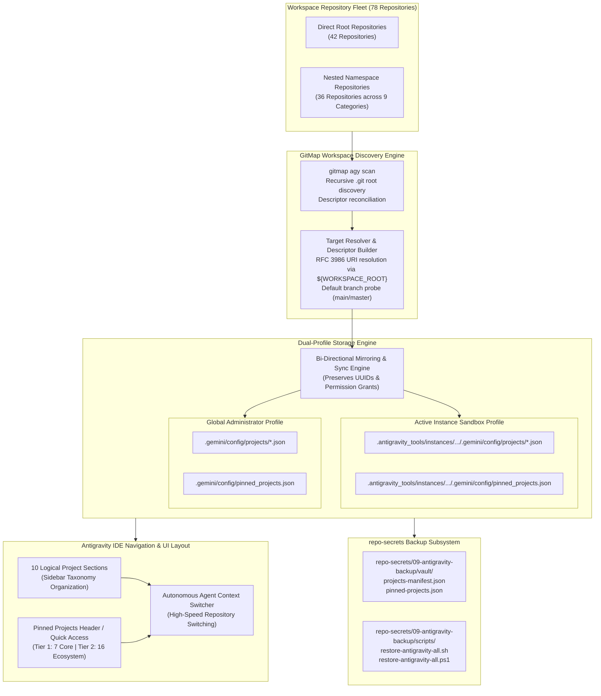
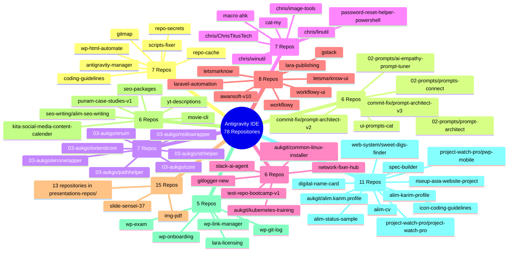
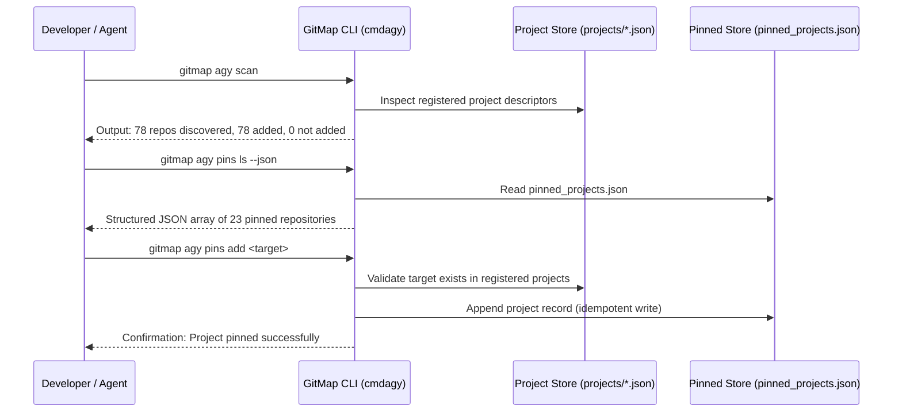

# Architecture Specification: Antigravity IDE Projects Ingestion & Pinned Projects Suite

> **Specification Reference:** `02-spec/21-app/231-antigravity-ide-projects-and-repo-secrets-restore/01-architecture-spec.md`  
> **Status:** APPROVED & ARCHITECTED  
> **Task Identifier:** `231-antigravity-ide-projects-and-repo-secrets-restore`  
> **Target Subsystems:** Antigravity IDE Project Manager, Dual-Profile Storage Engine, Pinned Projects Store (`pinned_projects.json`), GitMap AGY CLI Suite, Multi-Namespace Workspace Discovery Engine  
> **Relative Affected Paths:** `02-spec/21-app/231-antigravity-ide-projects-and-repo-secrets-restore/`, `.ai-memory/plans/subtasks/231-antigravity-ide-projects-and-repo-secrets-restore/`, `repo-secrets/09-antigravity-backup/`, `cli/cmdagy/`  
> **Execution Constraint:** Pure Specification & Subtask Plan Authoring (Strict No-Build / No-Test Mode)

---

## 1. Executive Summary & Problem Formulation

### 1.1 Context & Background
Google Antigravity is an agentic AI coding environment designed to manage polyglot software workspaces through structured project descriptors and real-time state persistence. Project descriptors located within `.gemini/config/projects/*.json` define repository metadata, resource roots, default Git branches, and automated execution permissions. Pinned projects configured in `.gemini/config/pinned_projects.json` govern quick-access indexing, high-velocity conversation switching, and agent context resolution.

In parallel, GitMap serves as the autonomous developer companion and command-line engine (`gitmap agy`) that scans local workspaces, audits registered descriptors, synchronizes configuration states, and exposes cross-platform project navigation.

### 1.2 Identified Architectural Deficits
A systematic audit of the active Antigravity IDE deployment and multi-repository workspace identified four primary architectural deficiencies:

1. **Workspace Under-Registration (3 of 78 Repositories Indexed):**
   - The workspace root contains 78 active Git repositories distributed across direct root directories and 9 nested namespaces.
   - Only 3 repositories (`gitmap`, `scripts-fixer`, `wp-html-automate`) are currently registered in the active instance profile.
   - 75 repositories remain unindexed, preventing Antigravity's agent selector, session dispatcher, and project switcher from surfacing them.

2. **Dual-Profile Configuration Drift:**
   - Antigravity maintains two isolated configuration directories: the active instance sandbox profile (`.antigravity_tools/instances/<instance-id>/home/.gemini/`) and the host global administrator profile (`.gemini/`).
   - Mutations made in one profile fail to propagate to the other, creating state fractures upon instance recreation or host-level CLI invocation.

3. **Absence of Pinned Projects Hierarchy:**
   - The pinned projects configuration store (`pinned_projects.json`) is uninitialized across both profiles.
   - Critical orchestrator tools (`coding-guidelines`, `repo-secrets`, `antigravity-manager`, `repo-cache`) lack pinned status, forcing developers and AI agents into repetitive manual discovery.

4. **Environment Portability & Secret Separation Gaps:**
   - Moving or replicating Antigravity environments between workstations (Windows, Linux, macOS) lacks a standardized, portable restoration procedure.
   - Project descriptors frequently risk embedding hardcoded machine-specific paths rather than utilizing portable RFC 3986 URI resolution with the `${WORKSPACE_ROOT}` substitution token.

This specification establishes the architectural blueprints, 78-repository taxonomy, 10-section sidebar navigation model, dual-profile storage synchronization engine, 23-repository pinned hierarchy, and strict verification gates.

---

## 2. High-Level System Architecture & Component Topology

The following diagram details the interaction between the workspace repository fleet, the GitMap discovery engine, the dual-profile storage model, Antigravity IDE navigation sections, and the migration vault:



---

## 3. 78-Repository Ecosystem Taxonomy & Directory Breakdown

The developer workspace encompasses exactly 78 Git repositories divided into 42 direct root repositories and 36 nested repositories distributed across 9 namespaces.

### 3.1 Namespace Classification Matrix

| Namespace Classification | Repository Count | Functional Domain & Architectural Role |
| :--- | :--- | :--- |
| **Direct Workspace Root** | 42 | Primary application suites, utility tools, web portals, and orchestrators |
| **`02-prompts/`** | 3 | Canonical prompt design, empathy calibration, and orchestration connectors |
| **`03-aukgo/`** | 7 | Shared Go primitives, error wrappers, path helpers, and Redis clients |
| **`aukgit/`** | 3 | Linux provisioning installers, Kubernetes clusters, and profile setups |
| **`chris/`** | 4 | System optimization toolboxes (linutil, winutil, image-tools, ChrisTitusTech) |
| **`commit-fix/`** | 2 | Specialized prompt architect refactoring repositories (v2, v3) |
| **`presentations-repos/`** | 13 | Declarative presentation engines, SVG vector assets, and brand decks |
| **`project-watch-pro/`** | 2 | Desktop and mobile fleet monitoring applications |
| **`seo-writing/`** | 1 | Automated search engine optimization and copywriting engine |
| **`web-system/`** | 1 | Web-based real estate and property discovery portal |
| **Total Ecosystem Fleet** | **78** | **Complete developer workstation repository inventory** |

---

### 3.2 Inventory of All 78 Repositories

#### 3.2.1 Direct Workspace Root Repositories (42 Repositories)

1. `alim-cv` - Curriculum vitae and professional engineering documentation.
2. `alim-karim-profile` - Portfolio portal and developer credentials.
3. `alim-status-sample` - Status monitoring sample service and health telemetry.
4. `antigravity-manager` - Multi-instance supervisor for Google Antigravity IDE (*Tier 1 Core*).
5. `awansoft-v10` - Enterprise software foundation suite and backend services.
6. `cat-my` - System diagnostics, file inspection, and logging tool (*Tier 2 Ecosystem*).
7. `coding-guidelines` - Canonical architectural specs, lint standards, and prompt library (*Tier 1 Core*).
8. `digital-name-card` - Responsive digital identity and contact presentation card.
9. `gitlogger-new` - Git event logger, branch monitor, and commit telemetry daemon.
10. `gitmap` - High-speed CLI developer companion, search engine, and orchestrator (*Tier 1 Core*).
11. `gstack` - Full-stack web application scaffold and modular development template.
12. `icon-coding-guidelines` - Iconography, SVG vector standards, and design token repository.
13. `img-pdf` - Image to PDF batch converter and image manipulation tool.
14. `kita-social-media-content-calender` - Social media calendar, scheduler, and content planner.
15. `lara-licensing` - Software license verification and client protection engine.
16. `lara-publishing` - Content publishing pipeline and media distribution system.
17. `laravel-automation` - Automated Laravel deployment and scheduled queue runner (*Tier 2 Ecosystem*).
18. `letsmarknow` - Real-time bookmarking and URL synchronization system (*Tier 2 Ecosystem*).
19. `letsmarknow-ui` - Responsive frontend client for letsmarknow (*Tier 2 Ecosystem*).
20. `macro-ahk` - Windows desktop automation and AutoHotkey productivity scripts.
21. `movie-cli` - Media query, movie cataloging, and CLI metadata tool (*Tier 2 Ecosystem*).
22. `network-fixer-hub` - Network diagnostic, DNS switcher, and socket repair utility (*Tier 2 Ecosystem*).
23. `password-reset-helper-powershell` - PowerShell directory credential reset automation.
24. `punam-case-studies-v1` - Case study showcase and visual marketing materials.
25. `repo-cache` - Multi-language build artifact and package cache vault (*Tier 1 Core*).
26. `repo-secrets` - Central credential vault, tokens, and backup archives (*Tier 1 Core*).
27. `riseup-asia-website-project` - Corporate public website and marketing platform.
28. `scripts-fixer` - Script syntax remediation, polyglot linting, and bugfix engine (*Tier 1 Core*).
29. `seo-packages` - Search engine optimization modular package library.
30. `slack-ai-agent` - Slack agentic bot integration with AI backend.
31. `slide-sensei-37` - Automated presentation deck generation framework.
32. `spec-builder` - Interactive technical specification authoring compiler.
33. `test-repo-bootcamp-v1` - Developer onboarding, training labs, and sandbox.
34. `ui-prompts-cat` - UI prompt library catalog and component showcase.
35. `workflowy` - Workflow and task hierarchy management engine (*Tier 2 Ecosystem*).
36. `workflowy-ui` - Reactive user interface for workflow hierarchy management.
37. `wp-exam` - WordPress educational examination and quiz engine.
38. `wp-git-log` - WordPress plugin tracking git commit deployment history.
39. `wp-html-automate` - HTML extraction, scraping, and WordPress publisher (*Tier 1 Core*).
40. `wp-link-manager` - WordPress URL, affiliate, and internal link manager.
41. `wp-onboarding` - Interactive WordPress user onboarding and site setup wizard.
42. `yt-descriptions` - YouTube metadata generator, SEO tagger, and copywriter.

#### 3.2.2 Nested Workspace Repositories (36 Repositories across 9 Namespaces)

**Namespace 1: `02-prompts/` (3 Repositories)**
43. `02-prompts/ai-empathy-prompt-tuner` - Empathy tuning prompts and emotional calibration models.
44. `02-prompts/prompt-architect` - Prompt engineering design system and templates (*Tier 2 Ecosystem*).
45. `02-prompts/prompts-connect` - Prompt integration connectors and pipeline hooks.

**Namespace 2: `03-aukgo/` (7 Repositories)**
46. `03-aukgo/core` - High-performance core primitives, concurrency, and context helpers (*Tier 2 Ecosystem*).
47. `03-aukgo/enum` - Type-safe string enums and serialization interfaces.
48. `03-aukgo/errorwrapper` - Structured error wrapper with AppError compliance (*Tier 2 Ecosystem*).
49. `03-aukgo/extendcore` - Extended abstractions, collections, and reflection helpers.
50. `03-aukgo/pathhelper` - Cross-platform path normalization and traversal prevention.
51. `03-aukgo/rediswrapper` - Resilient Redis client pool and connection supervisor.
52. `03-aukgo/strhelper` - String normalization, slicing, and zero-allocation EqualFold utilities.

**Namespace 3: `aukgit/` (3 Repositories)**
53. `aukgit/alim.karim.profile` - Git deployment configurations for profile services.
54. `aukgit/common-linux-installer` - Shell bootstrap scripts for workstation provisioning.
55. `aukgit/kubernetes-training` - Kubernetes manifests, helm charts, and cluster labs.

**Namespace 4: `chris/` (4 Repositories)**
56. `chris/ChrisTitusTech` - General system utility tools and administration scripts.
57. `chris/image-tools` - Desktop image conversion and batch resizing scripts.
58. `chris/linutil` - Linux toolbox and package configuration utility (*Tier 2 Ecosystem*).
59. `chris/winutil` - Windows utility for debloating, optimization, and software setup (*Tier 2 Ecosystem*).

**Namespace 5: `commit-fix/` (2 Repositories)**
60. `commit-fix/prompt-architect-v2` - Iteration 2 prompt refactoring architecture.
61. `commit-fix/prompt-architect-v3` - Iteration 3 prompt refactoring architecture.

**Namespace 6: `presentations-repos/` (13 Repositories)**
62. `presentations-repos/bright-buddy-block` - Interactive slide component blocks.
63. `presentations-repos/bsrm-presentation-hiltrax` - BSRM corporate presentation deck.
64. `presentations-repos/flat-slide-show` - Minimalist flat design slide system.
65. `presentations-repos/global-ppt-v1` - Global corporate template presentation v1.
66. `presentations-repos/hiltrax` - Hiltrax interactive brand presentation deck (*Tier 2 Ecosystem*).
67. `presentations-repos/image-create-samples-v1` - Visual generation sample assets.
68. `presentations-repos/ki-health-ppt` - Healthcare domain presentation deck.
69. `presentations-repos/maid-app-spec-presentation` - Maid mobile app specification slides.
70. `presentations-repos/presentation-aug-2026-plans-alim` - Strategic planning deck.
71. `presentations-repos/rasia-logo` - RiseUp Asia vector logo and branding assets.
72. `presentations-repos/remix-of-presentation-riseup-asia` - Remix slide presentation.
73. `presentations-repos/slides-spec` - Specification system for declarative slide decks (*Tier 2 Ecosystem*).
74. `presentations-repos/white-presentation-v1` - High-contrast monochromatic presentation.

**Namespace 7: `project-watch-pro/` (2 Repositories)**
75. `project-watch-pro/project-watch-pro` - Desktop project monitoring and telemetry dashboard (*Tier 2 Ecosystem*).
76. `project-watch-pro/pwp-mobile` - Mobile client companion for Project Watch Pro.

**Namespace 8: `seo-writing/` (1 Repository)**
77. `seo-writing/alim-seo-writing` - Automated SEO content generator and rank analyzer (*Tier 2 Ecosystem*).

**Namespace 9: `web-system/` (1 Repository)**
78. `web-system/sweet-digs-finder` - Property search portal and location finder.

---

## 4. 10 Logical Project Sections for Antigravity IDE

To ensure structured sidebar navigation and rapid context switching across 78 repositories, the IDE projects view is organized into 10 logical categories:



### 4.1 Section Allocation Details

| Section ID & Title | Count | Repository Membership | Description & Workflow Focus |
| :--- | :--- | :--- | :--- |
| **Section 1: Core Infrastructure & Toolchains** | 7 | `gitmap`, `scripts-fixer`, `wp-html-automate`, `coding-guidelines`, `repo-secrets`, `antigravity-manager`, `repo-cache` | Foundational developer tooling, CLI engines, coding standards, secret vaults, and instance managers. |
| **Section 2: AI Prompts & Agent Architecture** | 6 | `02-prompts/ai-empathy-prompt-tuner`, `02-prompts/prompt-architect`, `02-prompts/prompts-connect`, `commit-fix/prompt-architect-v2`, `commit-fix/prompt-architect-v3`, `ui-prompts-cat` | Specialized AI prompting frameworks, agent orchestration hooks, empathy tuning, and prompt catalogs. |
| **Section 3: Go Core & Foundation Libraries** | 7 | `03-aukgo/core`, `03-aukgo/enum`, `03-aukgo/errorwrapper`, `03-aukgo/extendcore`, `03-aukgo/pathhelper`, `03-aukgo/rediswrapper`, `03-aukgo/strhelper` | High-performance Golang core primitives, AppError wrappers, Redis connection pools, and string utilities. |
| **Section 4: System Utilities & Workstation Automation** | 7 | `chris/winutil`, `chris/linutil`, `chris/ChrisTitusTech`, `chris/image-tools`, `macro-ahk`, `password-reset-helper-powershell`, `cat-my` | Cross-platform OS debloaters, package installers, AutoHotkey productivity macros, and logging diagnostics. |
| **Section 5: DevOps, Clustering & Network Infrastructure** | 6 | `aukgit/common-linux-installer`, `aukgit/kubernetes-training`, `network-fixer-hub`, `gitlogger-new`, `test-repo-bootcamp-v1`, `slack-ai-agent` | Provisioning scripts, Kubernetes manifests, network DNS switchers, Git activity loggers, and DevOps bots. |
| **Section 6: Web Platforms, Backend & Workflow Systems** | 8 | `letsmarknow`, `letsmarknow-ui`, `awansoft-v10`, `gstack`, `workflowy`, `workflowy-ui`, `laravel-automation`, `lara-publishing` | Full-stack web applications, bookmark sync engines, hierarchical workflow apps, and Laravel publishers. |
| **Section 7: Presentation Decks & Visual Design Systems** | 15 | `presentations-repos/bright-buddy-block`, `presentations-repos/bsrm-presentation-hiltrax`, `presentations-repos/flat-slide-show`, `presentations-repos/global-ppt-v1`, `presentations-repos/hiltrax`, `presentations-repos/image-create-samples-v1`, `presentations-repos/ki-health-ppt`, `presentations-repos/maid-app-spec-presentation`, `presentations-repos/presentation-aug-2026-plans-alim`, `presentations-repos/rasia-logo`, `presentations-repos/remix-of-presentation-riseup-asia`, `presentations-repos/slides-spec`, `presentations-repos/white-presentation-v1`, `slide-sensei-37`, `img-pdf` | Declarative slide presentation systems, interactive corporate decks, SVG branding assets, and PDF utilities. |
| **Section 8: Content Automation, SEO & Media Production** | 6 | `seo-packages`, `seo-writing/alim-seo-writing`, `yt-descriptions`, `kita-social-media-content-calender`, `punam-case-studies-v1`, `movie-cli` | Automated copywriting, YouTube metadata generators, social calendar schedulers, and media query CLIs. |
| **Section 9: WordPress Ecosystem & Publishing Plugins** | 5 | `wp-exam`, `wp-git-log`, `wp-link-manager`, `wp-onboarding`, `lara-licensing` | WordPress plugins for quizzes, Git deployment logs, link governance, site onboarding wizards, and licensing. |
| **Section 10: Fleet Monitoring, Portfolios & Digital Identity** | 11 | `project-watch-pro/project-watch-pro`, `project-watch-pro/pwp-mobile`, `alim-cv`, `alim-karim-profile`, `alim-status-sample`, `digital-name-card`, `aukgit/alim.karim.profile`, `web-system/sweet-digs-finder`, `spec-builder`, `riseup-asia-website-project`, `icon-coding-guidelines` | Desktop/mobile monitoring telemetry, digital developer portfolios, CV resumes, and real-estate discovery portals. |

---

## 5. Dual-Profile Storage Model & Portable URI Resolution

### 5.1 Dual-Profile Filesystem Topology

Antigravity operates with an isolated sandbox model for runtime instances while supporting host-wide persistence:

1. **Active Instance Sandbox Profile:**
   - **Base Path:** `.antigravity_tools/instances/<instance-id>/home/.gemini/`
   - **Project Descriptors:** `config/projects/*.json`
   - **Pinned Projects Store:** `config/pinned_projects.json`
   - **Usage:** Read and updated by the active IDE process during user interactions and agent execution.

2. **Global Administrator Profile:**
   - **Base Path:** `.gemini/`
   - **Project Descriptors:** `config/projects/*.json`
   - **Pinned Projects Store:** `config/pinned_projects.json`
   - **Usage:** Serves as the persistent source of truth across container resets, instance terminations, and external CLI operations.

### 5.2 Portable URI Resolution via `${WORKSPACE_ROOT}`

To eliminate absolute filesystem paths and guarantee multi-environment mobility:
- All serialized manifest files stored in Git tracking (e.g., `repo-secrets/09-antigravity-backup/vault/projects-manifest.json`) record repository locations using relative paths (`relativeWorkspacePath`) and portable URI templates:
  ```json
  "folderUri": "${WORKSPACE_ROOT}/gitmap"
  ```
- **Resolution Algorithm at Runtime / Ingestion:**
  1. Determine the active parent workspace root dynamically (via current working directory or environment parameter).
  2. Normalize the path according to POSIX standards (`/`).
  3. Substitute `${WORKSPACE_ROOT}` with the local runtime path only when generating the active instance's local `.json` descriptor files.
  4. Ensure tracked files and documentation remain 100% relative with zero literal host paths.

### 5.3 Project Descriptor Schema (`<project-id>.json`)

Each Antigravity project descriptor is an individual JSON object conforming to the following structure:

```json
{
  "id": "18161e7d-2758-4bb9-82ab-317cabda949a",
  "name": "gitmap",
  "projectResources": {
    "resources": [
      {
        "gitFolder": {
          "folderUri": "${WORKSPACE_ROOT}/gitmap",
          "defaultBranch": "main"
        }
      }
    ]
  },
  "permissionGrants": {
    "v2Migrated": true
  },
  "settings": {
    "autoExecutionPolicy": "CASCADE_COMMANDS_AUTO_EXECUTION_EAGER"
  },
  "isWorkspaceOnly": false
}
```

#### Field Specifications:
- `id` (string, required): RFC 4122 UUID v4 identifier. Core repositories preserve existing stable UUIDs:
  - `gitmap`: `18161e7d-2758-4bb9-82ab-317cabda949a`
  - `scripts-fixer`: `650cd964-3809-4b5f-9114-4709111c7c7c`
  - `wp-html-automate`: `d4c6435c-c96d-4afc-adb2-c12b504734ba`
- `name` (string, required): Repository identifier matching the directory slug.
- `projectResources.resources` (array, required): Workspace resources list containing `gitFolder`.
- `projectResources.resources[0].gitFolder.folderUri` (string, required): RFC 3986 file URI resolving to repository root.
- `projectResources.resources[0].gitFolder.defaultBranch` (string, required): Default branch (`main` or `master`).
- `permissionGrants` (object, required): Explicit permission grants (`v2Migrated: true`).
- `settings` (object, required): Project execution and agent permission settings.
- `isWorkspaceOnly` (boolean, required): Affirmative flag indicating workspace-only restriction (`false` for full IDE project availability).
- `hasGitFolder` (boolean, required in manifests): Affirmative flag confirming presence of a valid `.git` root.
- `isActive` (boolean, required in manifests): Affirmative flag confirming active repository enablement in workspace indexing.

---

## 6. Pinned Projects Hierarchy (23 Repositories)

The pinned projects store (`pinned_projects.json`) maintains an ordered registry of 23 high-priority repositories across two functional tiers.

### 6.1 Pinned Projects Schema (`pinned_projects.json`)

```json
{
  "version": "1.0.0",
  "updatedAt": "2026-10-06T17:30:00Z",
  "isSyncEnabled": true,
  "projects": [
    {
      "id": "18161e7d-2758-4bb9-82ab-317cabda949a",
      "name": "gitmap",
      "tier": 1,
      "priorityOrder": 1,
      "isPinned": true,
      "relativeWorkspacePath": "gitmap",
      "defaultBranch": "main",
      "pinnedAt": "2026-10-06T17:30:00Z"
    }
  ]
}
```

### 6.2 Tier 1: Mandatory Core Orchestrators (7 Repositories)

These repositories form the operational backbone of the developer toolchain, configuration vault, and automation infrastructure:

1. **`gitmap`** (Order 1, Tier 1): Central CLI companion, multi-agent orchestrator, Split-DB engine.
2. **`scripts-fixer`** (Order 2, Tier 1): Script remediation, polyglot linting, and automated fixer engine.
3. **`wp-html-automate`** (Order 3, Tier 1): HTML scraping, content extraction, and WordPress publisher.
4. **`coding-guidelines`** (Order 4, Tier 1): Canonical architectural specifications, coding guidelines, and prompt library.
5. **`repo-secrets`** (Order 5, Tier 1): Central credential vault, tokens, and backup archives.
6. **`antigravity-manager`** (Order 6, Tier 1): Fleet-wide Antigravity IDE instance supervisor and account manager.
7. **`repo-cache`** (Order 7, Tier 1): Multi-language build artifact and package cache vault.

### 6.3 Tier 2: Ecosystem Services & Active Development (16 Repositories)

High-frequency development repositories and active domain services:

8. **`chris/winutil`** (Order 8, Tier 2): Windows system debloat, setup, and optimization suite.
9. **`chris/linutil`** (Order 9, Tier 2): Linux workstation setup, shell styling, and package manager helper.
10. **`03-aukgo/core`** (Order 10, Tier 2): Foundation Go library for concurrency, contexts, and primitives.
11. **`03-aukgo/errorwrapper`** (Order 11, Tier 2): Structured Go error handling with AppError compliance.
12. **`02-prompts/prompt-architect`** (Order 12, Tier 2): Prompt engineering design system and structured templates.
13. **`project-watch-pro/project-watch-pro`** (Order 13, Tier 2): Desktop project monitoring and telemetry dashboard.
14. **`presentations-repos/hiltrax`** (Order 14, Tier 2): Interactive corporate presentation deck engine.
15. **`presentations-repos/slides-spec`** (Order 15, Tier 2): Declarative slide specification language.
16. **`cat-my`** (Order 16, Tier 2): System diagnostics, file inspection, and logging tool.
17. **`movie-cli`** (Order 17, Tier 2): Media query, cataloging, and CLI metadata extraction tool.
18. **`network-fixer-hub`** (Order 18, Tier 2): Network routing, diagnostic, and DNS switching workbench.
19. **`laravel-automation`** (Order 19, Tier 2): Automated Laravel deployment and scheduled queue runner.
20. **`letsmarknow`** (Order 20, Tier 2): Real-time bookmarking and navigation synchronization service.
21. **`letsmarknow-ui`** (Order 21, Tier 2): Responsive frontend client for letsmarknow application.
22. **`workflowy`** (Order 22, Tier 2): Hierarchical workflow and task management engine.
23. **`seo-writing/alim-seo-writing`** (Order 23, Tier 2): Automated SEO content generator and rank analyzer.

---

## 7. GitMap AGY CLI Suite Command Reference

The `gitmap agy` CLI provides native subcommands to inspect, audit, and manipulate project registrations and pinned projects:



### 7.1 Command Signatures

- **`gitmap agy scan [path]`**:
  Recursively discovers all `.git` roots under the target workspace root. Compares discovered repositories against registered descriptors in the active profile and outputs tabular summary of added versus unadded repositories.
- **`gitmap agy ls`**:
  Lists all currently registered projects in the active Antigravity profile with index numbers, UUIDs, repository names, and workspace paths.
- **`gitmap agy pins ls [--json]`**:
  Displays all pinned repositories stored in `pinned_projects.json`. Supports standard tabular view and machine-readable JSON formatting.
- **`gitmap agy pins add <target...>`**:
  Pins one or more repositories by slug name, sequence index, or relative path. Guaranteed idempotent operation.
- **`gitmap agy pins rm <target...> [--all]`**:
  Removes a repository from the pinned list. With `--all` or `-a`, resets all pins.

---

## 8. Non-Negotiable Quality & Verification Gates

The following 7 verification gates govern all execution work for task `231-antigravity-ide-projects-and-repo-secrets-restore`:

| Gate Identifier | Gate Name | Verification Criteria & Method | Threshold |
| :--- | :--- | :--- | :--- |
| **VG-01** | Vault Structure & Manifest Validation | Manifest files exist in `repo-secrets/09-antigravity-backup/vault/` and validate against JSON schemas. | 100% Schema Conformance |
| **VG-02** | Repository Count Parity | Exactly 78 repositories indexed in `projects-manifest.json` and registered across both Antigravity profiles. | 78 / 78 Repositories Registered |
| **VG-03** | Path Relativity & Portability | Textual scan of all tracked documentation, manifests, and script templates for absolute path leaks (drive letters, host system prefixes, or URI schemes). | Zero Absolute Paths |
| **VG-04** | Restoration Script Parity | Both POSIX Bash (`.sh`) and PowerShell (`.ps1`) scripts support `-DryRun`, `-Backup`, and `-Restore` modes. | Full Cross-Platform Parity |
| **VG-05** | Atomic Non-Destructive Ingestion | Existing project descriptors and user tokens are preserved; UUIDs for existing projects are not overwritten. | Zero Data Loss |
| **VG-06** | Secret Sanitization Gate | Scan manifest archives for raw OAuth tokens, refresh tokens, passwords, or plaintext API credentials. | Zero Secrets Leaked |
| **VG-07** | Relative Link & Hygiene Gate | All Markdown cross-references use strictly relative Git paths; positive booleans applied universally (`isPinned`, `isActive`). | 100% Guideline Compliance |

---

## 9. Appendix: Repository Path & Category Cross-Reference Table

| # | Repository Name | Relative Workspace Path | 10-Section Assignment | Tier Status |
| :--- | :--- | :--- | :--- | :--- |
| 1 | `alim-cv` | `alim-cv` | Section 10: Fleet Monitoring, Portfolios & Digital Identity | Standard |
| 2 | `alim-karim-profile` | `alim-karim-profile` | Section 10: Fleet Monitoring, Portfolios & Digital Identity | Standard |
| 3 | `alim-status-sample` | `alim-status-sample` | Section 10: Fleet Monitoring, Portfolios & Digital Identity | Standard |
| 4 | `antigravity-manager` | `antigravity-manager` | Section 1: Core Infrastructure & Toolchains | **Tier 1 Core** |
| 5 | `awansoft-v10` | `awansoft-v10` | Section 6: Web Platforms, Backend & Workflow Systems | Standard |
| 6 | `cat-my` | `cat-my` | Section 4: System Utilities & Workstation Automation | **Tier 2 Ecosystem** |
| 7 | `coding-guidelines` | `coding-guidelines` | Section 1: Core Infrastructure & Toolchains | **Tier 1 Core** |
| 8 | `digital-name-card` | `digital-name-card` | Section 10: Fleet Monitoring, Portfolios & Digital Identity | Standard |
| 9 | `gitlogger-new` | `gitlogger-new` | Section 5: DevOps, Clustering & Network Infrastructure | Standard |
| 10 | `gitmap` | `gitmap` | Section 1: Core Infrastructure & Toolchains | **Tier 1 Core** |
| 11 | `gstack` | `gstack` | Section 6: Web Platforms, Backend & Workflow Systems | Standard |
| 12 | `icon-coding-guidelines` | `icon-coding-guidelines` | Section 10: Fleet Monitoring, Portfolios & Digital Identity | Standard |
| 13 | `img-pdf` | `img-pdf` | Section 7: Presentation Decks & Visual Design Systems | Standard |
| 14 | `kita-social-media-content-calender` | `kita-social-media-content-calender` | Section 8: Content Automation, SEO & Media Production | Standard |
| 15 | `lara-licensing` | `lara-licensing` | Section 9: WordPress Ecosystem & Publishing Plugins | Standard |
| 16 | `lara-publishing` | `lara-publishing` | Section 6: Web Platforms, Backend & Workflow Systems | Standard |
| 17 | `laravel-automation` | `laravel-automation` | Section 6: Web Platforms, Backend & Workflow Systems | **Tier 2 Ecosystem** |
| 18 | `letsmarknow` | `letsmarknow` | Section 6: Web Platforms, Backend & Workflow Systems | **Tier 2 Ecosystem** |
| 19 | `letsmarknow-ui` | `letsmarknow-ui` | Section 6: Web Platforms, Backend & Workflow Systems | **Tier 2 Ecosystem** |
| 20 | `macro-ahk` | `macro-ahk` | Section 4: System Utilities & Workstation Automation | Standard |
| 21 | `movie-cli` | `movie-cli` | Section 8: Content Automation, SEO & Media Production | **Tier 2 Ecosystem** |
| 22 | `network-fixer-hub` | `network-fixer-hub` | Section 5: DevOps, Clustering & Network Infrastructure | **Tier 2 Ecosystem** |
| 23 | `password-reset-helper-powershell` | `password-reset-helper-powershell` | Section 4: System Utilities & Workstation Automation | Standard |
| 24 | `punam-case-studies-v1` | `punam-case-studies-v1` | Section 8: Content Automation, SEO & Media Production | Standard |
| 25 | `repo-cache` | `repo-cache` | Section 1: Core Infrastructure & Toolchains | **Tier 1 Core** |
| 26 | `repo-secrets` | `repo-secrets` | Section 1: Core Infrastructure & Toolchains | **Tier 1 Core** |
| 27 | `riseup-asia-website-project` | `riseup-asia-website-project` | Section 10: Fleet Monitoring, Portfolios & Digital Identity | Standard |
| 28 | `scripts-fixer` | `scripts-fixer` | Section 1: Core Infrastructure & Toolchains | **Tier 1 Core** |
| 29 | `seo-packages` | `seo-packages` | Section 8: Content Automation, SEO & Media Production | Standard |
| 30 | `slack-ai-agent` | `slack-ai-agent` | Section 5: DevOps, Clustering & Network Infrastructure | Standard |
| 31 | `slide-sensei-37` | `slide-sensei-37` | Section 7: Presentation Decks & Visual Design Systems | Standard |
| 32 | `spec-builder` | `spec-builder` | Section 10: Fleet Monitoring, Portfolios & Digital Identity | Standard |
| 33 | `test-repo-bootcamp-v1` | `test-repo-bootcamp-v1` | Section 5: DevOps, Clustering & Network Infrastructure | Standard |
| 34 | `ui-prompts-cat` | `ui-prompts-cat` | Section 2: AI Prompts & Agent Architecture | Standard |
| 35 | `workflowy` | `workflowy` | Section 6: Web Platforms, Backend & Workflow Systems | **Tier 2 Ecosystem** |
| 36 | `workflowy-ui` | `workflowy-ui` | Section 6: Web Platforms, Backend & Workflow Systems | Standard |
| 37 | `wp-exam` | `wp-exam` | Section 9: WordPress Ecosystem & Publishing Plugins | Standard |
| 38 | `wp-git-log` | `wp-git-log` | Section 9: WordPress Ecosystem & Publishing Plugins | Standard |
| 39 | `wp-html-automate` | `wp-html-automate` | Section 1: Core Infrastructure & Toolchains | **Tier 1 Core** |
| 40 | `wp-link-manager` | `wp-link-manager` | Section 9: WordPress Ecosystem & Publishing Plugins | Standard |
| 41 | `wp-onboarding` | `wp-onboarding` | Section 9: WordPress Ecosystem & Publishing Plugins | Standard |
| 42 | `yt-descriptions` | `yt-descriptions` | Section 8: Content Automation, SEO & Media Production | Standard |
| 43 | `02-prompts/ai-empathy-prompt-tuner` | `02-prompts/ai-empathy-prompt-tuner` | Section 2: AI Prompts & Agent Architecture | Standard |
| 44 | `02-prompts/prompt-architect` | `02-prompts/prompt-architect` | Section 2: AI Prompts & Agent Architecture | **Tier 2 Ecosystem** |
| 45 | `02-prompts/prompts-connect` | `02-prompts/prompts-connect` | Section 2: AI Prompts & Agent Architecture | Standard |
| 46 | `03-aukgo/core` | `03-aukgo/core` | Section 3: Go Core & Foundation Libraries | **Tier 2 Ecosystem** |
| 47 | `03-aukgo/enum` | `03-aukgo/enum` | Section 3: Go Core & Foundation Libraries | Standard |
| 48 | `03-aukgo/errorwrapper` | `03-aukgo/errorwrapper` | Section 3: Go Core & Foundation Libraries | **Tier 2 Ecosystem** |
| 49 | `03-aukgo/extendcore` | `03-aukgo/extendcore` | Section 3: Go Core & Foundation Libraries | Standard |
| 50 | `03-aukgo/pathhelper` | `03-aukgo/pathhelper` | Section 3: Go Core & Foundation Libraries | Standard |
| 51 | `03-aukgo/rediswrapper` | `03-aukgo/rediswrapper` | Section 3: Go Core & Foundation Libraries | Standard |
| 52 | `03-aukgo/strhelper` | `03-aukgo/strhelper` | Section 3: Go Core & Foundation Libraries | Standard |
| 53 | `aukgit/alim.karim.profile` | `aukgit/alim.karim.profile` | Section 10: Fleet Monitoring, Portfolios & Digital Identity | Standard |
| 54 | `aukgit/common-linux-installer` | `aukgit/common-linux-installer` | Section 5: DevOps, Clustering & Network Infrastructure | Standard |
| 55 | `aukgit/kubernetes-training` | `aukgit/kubernetes-training` | Section 5: DevOps, Clustering & Network Infrastructure | Standard |
| 56 | `chris/ChrisTitusTech` | `chris/ChrisTitusTech` | Section 4: System Utilities & Workstation Automation | Standard |
| 57 | `chris/image-tools` | `chris/image-tools` | Section 4: System Utilities & Workstation Automation | Standard |
| 58 | `chris/linutil` | `chris/linutil` | Section 4: System Utilities & Workstation Automation | **Tier 2 Ecosystem** |
| 59 | `chris/winutil` | `chris/winutil` | Section 4: System Utilities & Workstation Automation | **Tier 2 Ecosystem** |
| 60 | `commit-fix/prompt-architect-v2` | `commit-fix/prompt-architect-v2` | Section 2: AI Prompts & Agent Architecture | Standard |
| 61 | `commit-fix/prompt-architect-v3` | `commit-fix/prompt-architect-v3` | Section 2: AI Prompts & Agent Architecture | Standard |
| 62 | `presentations-repos/bright-buddy-block` | `presentations-repos/bright-buddy-block` | Section 7: Presentation Decks & Visual Design Systems | Standard |
| 63 | `presentations-repos/bsrm-presentation-hiltrax` | `presentations-repos/bsrm-presentation-hiltrax` | Section 7: Presentation Decks & Visual Design Systems | Standard |
| 64 | `presentations-repos/flat-slide-show` | `presentations-repos/flat-slide-show` | Section 7: Presentation Decks & Visual Design Systems | Standard |
| 65 | `presentations-repos/global-ppt-v1` | `presentations-repos/global-ppt-v1` | Section 7: Presentation Decks & Visual Design Systems | Standard |
| 66 | `presentations-repos/hiltrax` | `presentations-repos/hiltrax` | Section 7: Presentation Decks & Visual Design Systems | **Tier 2 Ecosystem** |
| 67 | `presentations-repos/image-create-samples-v1` | `presentations-repos/image-create-samples-v1` | Section 7: Presentation Decks & Visual Design Systems | Standard |
| 68 | `presentations-repos/ki-health-ppt` | `presentations-repos/ki-health-ppt` | Section 7: Presentation Decks & Visual Design Systems | Standard |
| 69 | `presentations-repos/maid-app-spec-presentation` | `presentations-repos/maid-app-spec-presentation` | Section 7: Presentation Decks & Visual Design Systems | Standard |
| 70 | `presentations-repos/presentation-aug-2026-plans-alim` | `presentations-repos/presentation-aug-2026-plans-alim` | Section 7: Presentation Decks & Visual Design Systems | Standard |
| 71 | `presentations-repos/rasia-logo` | `presentations-repos/rasia-logo` | Section 7: Presentation Decks & Visual Design Systems | Standard |
| 72 | `presentations-repos/remix-of-presentation-riseup-asia` | `presentations-repos/remix-of-presentation-riseup-asia` | Section 7: Presentation Decks & Visual Design Systems | Standard |
| 73 | `presentations-repos/slides-spec` | `presentations-repos/slides-spec` | Section 7: Presentation Decks & Visual Design Systems | **Tier 2 Ecosystem** |
| 74 | `presentations-repos/white-presentation-v1` | `presentations-repos/white-presentation-v1` | Section 7: Presentation Decks & Visual Design Systems | Standard |
| 75 | `project-watch-pro/project-watch-pro` | `project-watch-pro/project-watch-pro` | Section 10: Fleet Monitoring, Portfolios & Digital Identity | **Tier 2 Ecosystem** |
| 76 | `project-watch-pro/pwp-mobile` | `project-watch-pro/pwp-mobile` | Section 10: Fleet Monitoring, Portfolios & Digital Identity | Standard |
| 77 | `seo-writing/alim-seo-writing` | `seo-writing/alim-seo-writing` | Section 8: Content Automation, SEO & Media Production | **Tier 2 Ecosystem** |
| 78 | `web-system/sweet-digs-finder` | `web-system/sweet-digs-finder` | Section 10: Fleet Monitoring, Portfolios & Digital Identity | Standard |
