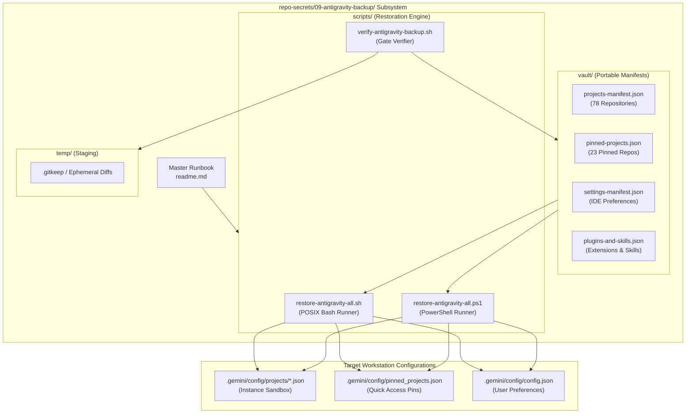
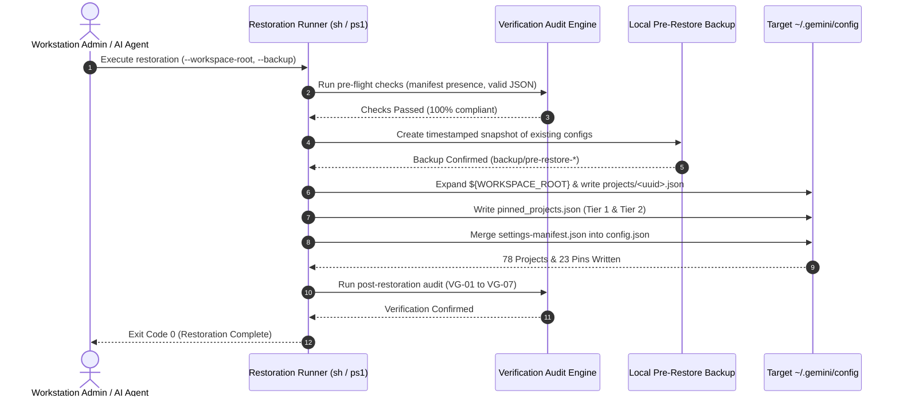

# Component Specification: Antigravity IDE Projects & Repo-Secrets Restoration Engine

> **Specification Reference:** `02-spec/21-app/231-antigravity-ide-projects-and-repo-secrets-restore/02-component-spec.md`  
> **Status:** APPROVED & ARCHITECTED  
> **Task Identifier:** `231-antigravity-ide-projects-and-repo-secrets-restore`  
> **Target Subsystems:** Migration Vault (`repo-secrets/09-antigravity-backup/`), Manifest Stores, Restoration Scripts, Verification Engine, SOP Runbook  
> **Relative Paths:** `repo-secrets/09-antigravity-backup/`, `02-spec/21-app/231-antigravity-ide-projects-and-repo-secrets-restore/`, `.ai-memory/plans/subtasks/231-antigravity-ide-projects-and-repo-secrets-restore/`  
> **Execution Constraint:** Pure Specification & Subtask Plan Authoring (Strict No-Build / No-Test Mode)

---

## 1. Executive Summary & Component Scope

This component specification establishes the technical implementation details for the **Antigravity Migration Vault & Restoration Toolchain** situated in `repo-secrets/09-antigravity-backup/`. It works symmetrically with the Architecture Specification (`01-architecture-spec.md`) to guarantee that all 78 repositories across the workspace, along with their 23 pinned quick-access entries, IDE user preferences, and installed skills/plugins, can be migrated, backed up, and restored across developer workstations (Linux, Windows, macOS) and containerized sandboxes with zero manual intervention.

### 1.1 Core Architectural Principles
1. **Strict Path Relativity & Universal Portability:**
   All manifests and script templates utilize the `${WORKSPACE_ROOT}` substitution token. Under no circumstances are machine-specific paths, drive letters, or host usernames committed to repository tracking.
2. **Positive Boolean Polarity Exclusively:**
   Every schema field, CLI flag, and script variable adheres strictly to positive boolean semantics (`isSanitized`, `isPortable`, `isEnabled`, `shouldBackup`, `isValid`, `isVerified`, `isDryRun`, `canOverwrite`, `hasBackup`).
3. **Non-Destructive Ingestion & Atomic Rollbacks:**
   Restoration operations perform automated pre-flight snapshots of target configuration trees. UUIDs for existing projects are preserved, and active user credentials or session tokens are never purged or overwritten.
4. **Zero-Secret Manifest Sanitization:**
   The backup vault stores workspace metadata, project URIs, branch targets, and configuration flags. All private keys, OAuth tokens, and sensitive secrets remain decoupled and governed by secure secret managers.

---

## 2. Directory Topography & Storage Topography

The migration vault resides under the dedicated section `09-antigravity-backup/` inside the central secrets and infrastructure repository `repo-secrets/`:

```
repo-secrets/09-antigravity-backup/
├── readme.md                      # Master Standard Operating Procedure (SOP) & Runbook
├── vault/                         # Portable JSON Manifest Stores
│   ├── projects-manifest.json     # Complete 78-repository registration records
│   ├── pinned-projects.json       # Tier 1 (7) & Tier 2 (16) pinned access list
│   ├── settings-manifest.json     # Antigravity IDE global & editor configurations
│   └── plugins-and-skills.json    # Installed plugins and workspace skill bindings
├── scripts/                       # Cross-Platform Automation Suite
│   ├── restore-antigravity-all.sh # POSIX Bash restoration runner (Linux / macOS)
│   ├── restore-antigravity-all.ps1# PowerShell Core / WinPS restoration runner
│   └── verify-antigravity-backup.sh# Quality gate & validation audit script
└── temp/                          # Scratch directory for staging & verification
    └── .gitkeep                   # Directory placeholder (ephemeral contents gitignored)
```

### 2.1 Subsystem Topology Diagram



---

## 3. Data Contracts & JSON Manifest Schemas

All manifests are standard JSON files adhering to deterministic schemas. Every filesystem path referencing the local workspace uses relative paths and the `${WORKSPACE_ROOT}` placeholder token.

### 3.1 Token Resolution Semantics
- **Token String:** `${WORKSPACE_ROOT}`
- **Linux / macOS Runtime Resolution:** Resolves to the directory housing all repositories (default: parent directory of `gitmap` or `$WORKSPACE_ROOT` environment variable). Produces valid POSIX URI: `file://${WORKSPACE_ROOT}/<relativePath>`.
- **Windows Runtime Resolution:** Resolves to the Windows workspace root (e.g., `$env:WORKSPACE_ROOT` or parent of `gitmap`). Normalizes backslashes to forward slashes: `file://${WORKSPACE_ROOT}/<relativePath>`.

---

### 3.2 Schema A: `projects-manifest.json`

Tracks all 78 repositories across the workspace, organized by the 10 logical IDE sections:

```json
{
  "$schema": "https://json-schema.org/draft/2020-12/schema",
  "schemaVersion": "1.0.0",
  "generatedAt": "2026-10-06T17:30:00Z",
  "isPortable": true,
  "isSanitized": true,
  "workspaceRootToken": "${WORKSPACE_ROOT}",
  "totalProjects": 78,
  "sectionSummary": {
    "coreInfrastructure": 7,
    "aiPromptsAndAgents": 6,
    "goFoundation": 7,
    "systemUtilities": 7,
    "devopsAndClustering": 6,
    "webPlatformsAndWorkflows": 8,
    "presentationDecks": 15,
    "contentAndMedia": 6,
    "wordpressEcosystem": 5,
    "fleetMonitoringAndIdentity": 11
  },
  "projects": [
    {
      "id": "18161e7d-2758-4bb9-82ab-317cabda949a",
      "name": "gitmap",
      "section": "Core Infrastructure & Toolchains",
      "sectionId": 1,
      "tier": 1,
      "folderRelativePath": "gitmap",
      "uriTemplate": "file://${WORKSPACE_ROOT}/gitmap",
      "defaultBranch": "main",
      "isWorkspaceOnly": false,
      "isEnabled": true,
      "permissionGrants": {
        "v2Migrated": true
      },
      "settings": {}
    },
    {
      "id": "650cd964-3809-4b5f-9114-4709111c7c7c",
      "name": "scripts-fixer",
      "section": "Core Infrastructure & Toolchains",
      "sectionId": 1,
      "tier": 1,
      "folderRelativePath": "scripts-fixer",
      "uriTemplate": "file://${WORKSPACE_ROOT}/scripts-fixer",
      "defaultBranch": "main",
      "isWorkspaceOnly": false,
      "isEnabled": true,
      "permissionGrants": {
        "v2Migrated": true
      },
      "settings": {}
    },
    {
      "id": "a9314c02-e304-4b89-a095-21d7b3e028b1",
      "name": "02-prompts/prompt-architect",
      "section": "AI Prompts & Agent Architecture",
      "sectionId": 2,
      "tier": 2,
      "folderRelativePath": "02-prompts/prompt-architect",
      "uriTemplate": "file://${WORKSPACE_ROOT}/02-prompts/prompt-architect",
      "defaultBranch": "main",
      "isWorkspaceOnly": false,
      "isEnabled": true,
      "permissionGrants": {
        "v2Migrated": true
      },
      "settings": {}
    }
  ]
}
```

#### Field Specifications:
- `id` (string, required): RFC 4122 UUID v4 identifier. Core repositories (`gitmap`, `scripts-fixer`, `wp-html-automate`, `antigravity-manager`, `letsmarknow`, `letsmarknow-ui`) maintain preserved static UUIDs.
- `name` (string, required): Human-readable repository title or namespaced identifier.
- `section` (string, required): Descriptive title of one of the 10 IDE navigation sections.
- `sectionId` (integer, required): Numerical index (1 to 10) matching the section.
- `tier` (integer, required): `1` for Core Orchestrators, `2` for Key Ecosystem Services, `3` for Standard Projects.
- `folderRelativePath` (string, required): Relative path from the workspace root.
- `uriTemplate` (string, required): Portable URI using `${WORKSPACE_ROOT}`.
- `defaultBranch` (string, required): Initial Git branch (`main` or `master`).
- `isWorkspaceOnly` (boolean, required): Affirmative boolean flag indicating if the project is restricted to workspace context.
- `isEnabled` (boolean, required): Affirmative boolean flag indicating active availability.
- `permissionGrants` (object, required): Permission grants including `v2Migrated: true`.

---

### 3.3 Schema B: `pinned-projects.json`

Tracks the 23 prioritized repositories surfaced in the Quick Access pinned header:

```json
{
  "$schema": "https://json-schema.org/draft/2020-12/schema",
  "schemaVersion": "1.0.0",
  "generatedAt": "2026-10-06T17:30:00Z",
  "isPortable": true,
  "isSyncEnabled": true,
  "totalPinned": 23,
  "tierDistribution": {
    "tier1Core": 7,
    "tier2Ecosystem": 16
  },
  "projects": [
    {
      "id": "18161e7d-2758-4bb9-82ab-317cabda949a",
      "name": "gitmap",
      "folderRelativePath": "gitmap",
      "branch": "main",
      "priorityOrder": 1,
      "tier": 1,
      "tierDescription": "Mandatory Core Orchestrators",
      "isPinned": true,
      "isEnabled": true,
      "pinnedAt": "2026-10-06T17:30:00Z"
    },
    {
      "id": "650cd964-3809-4b5f-9114-4709111c7c7c",
      "name": "scripts-fixer",
      "folderRelativePath": "scripts-fixer",
      "branch": "main",
      "priorityOrder": 2,
      "tier": 1,
      "tierDescription": "Mandatory Core Orchestrators",
      "isPinned": true,
      "isEnabled": true,
      "pinnedAt": "2026-10-06T17:30:00Z"
    },
    {
      "id": "b3e81001-c88f-4d30-bfa2-938b8120e501",
      "name": "chris/winutil",
      "folderRelativePath": "chris/winutil",
      "branch": "main",
      "priorityOrder": 8,
      "tier": 2,
      "tierDescription": "Ecosystem Services & Active Development",
      "isPinned": true,
      "isEnabled": true,
      "pinnedAt": "2026-10-06T17:30:00Z"
    }
  ]
}
```

#### Field Specifications:
- `priorityOrder` (integer, required): Sequential display order from 1 to 23.
- `tier` (integer, required): `1` (Core Infrastructure, count: 7) or `2` (Ecosystem Services, count: 16).
- `isPinned` (boolean, required): Affirmative boolean flag confirming pinned status.
- `pinnedAt` (string, required): ISO 8601 timestamp of pin activation.

---

### 3.4 Schema C: `settings-manifest.json`

Captures portable IDE configuration preferences without private session keys:

```json
{
  "$schema": "https://json-schema.org/draft/2020-12/schema",
  "schemaVersion": "1.0.0",
  "generatedAt": "2026-10-06T17:30:00Z",
  "isPortable": true,
  "isSanitized": true,
  "ideSettings": {
    "theme": "Antigravity Dark Modern",
    "fontSize": 14,
    "lineHeight": 22,
    "tabSize": 2,
    "insertSpaces": true,
    "trimTrailingWhitespace": true,
    "formatOnSave": true
  },
  "agentConfiguration": {
    "defaultAgentModel": "inherit",
    "isAutoExecutionAllowed": true,
    "isContextCompactionEnabled": true,
    "maxContextWindowTokens": 200000,
    "isDryRunPreviewEnabled": true
  },
  "telemetryAndPrivacy": {
    "isCrashReportingEnabled": false,
    "isLocalTelemetryActive": true,
    "isCredentialMaskingStrict": true
  }
}
```

---

### 3.5 Schema D: `plugins-and-skills.json`

Records declared plugins and Antigravity workspace skills bindings:

```json
{
  "$schema": "https://json-schema.org/draft/2020-12/schema",
  "schemaVersion": "1.0.0",
  "generatedAt": "2026-10-06T17:30:00Z",
  "isPortable": true,
  "plugins": [
    {
      "id": "gitmap-companion",
      "name": "GitMap IDE Companion",
      "version": "6.493.0",
      "isEnabled": true,
      "isBuiltin": false
    },
    {
      "id": "project-manager-sync",
      "name": "Project Manager Workspace Synchronizer",
      "version": "1.2.0",
      "isEnabled": true,
      "isBuiltin": true
    }
  ],
  "skills": [
    {
      "name": "gitmap",
      "relativePath": ".agents/skills/gitmap/SKILL.md",
      "isEnabled": true,
      "isGlobal": true
    },
    {
      "name": "execute-parent-task-with-n-steps-v6",
      "relativePath": ".agents/skills/execute-parent-task-with-n-steps-v6/skill.md",
      "isEnabled": true,
      "isGlobal": true
    },
    {
      "name": "coding-guidelines",
      "relativePath": ".agents/skills/coding-guidelines/skill.md",
      "isEnabled": true,
      "isGlobal": true
    }
  ]
}
```

---

## 4. Standard Operating Procedure (SOP) Runbook

This SOP outlines the exact execution sequence for restoring Antigravity projects, pins, and configurations across workstations and environments.



### 4.1 Step 1: Pre-Flight Environment Assessment
1. Determine the target operating system (Linux, macOS, Windows).
2. Establish the active workspace directory containing the 78 repositories.
3. Validate that the target configuration directories are accessible:
   - Linux/macOS: `$HOME/.gemini/config/`
   - Windows: `$env:USERPROFILE\.gemini\config\`
4. Confirm read permissions across `repo-secrets/09-antigravity-backup/vault/`.

### 4.2 Step 2: Manifest & Integrity Audit
Execute the automated validation gate:
```bash
bash repo-secrets/09-antigravity-backup/scripts/verify-antigravity-backup.sh
```
The audit confirms:
- All 4 manifest files exist in `repo-secrets/09-antigravity-backup/vault/`.
- Valid JSON syntax with zero parse errors.
- Zero absolute host paths or drive letters in tracked files.
- Exactly 78 repository records in `projects-manifest.json`.
- Exactly 23 pinned project records in `pinned-projects.json`.
- Zero private keys or OAuth secrets present.

### 4.3 Step 3: Automated Pre-Restore Backup Creation
Before writing any configuration files, the restoration script creates an atomic snapshot:
- Destination: `$HOME/.gemini/config/backup/pre-restore-<timestamp>/` (or Windows equivalent).
- Snapshot includes existing `projects/`, `pinned_projects.json`, and `config.json`.
- If an existing project matches a restored UUID or name, the script preserves existing UUIDs to prevent breaking active session logs.

### 4.4 Step 4: Atomic Configuration Injection
Run the appropriate cross-platform restoration script:
- **On Linux / macOS:**
  ```bash
  bash repo-secrets/09-antigravity-backup/scripts/restore-antigravity-all.sh \
    --workspace-root "$HOME/git-work" \
    --backup \
    --verbose
  ```
- **On Windows:**
  ```powershell
  pwsh repo-secrets/09-antigravity-backup/scripts/restore-antigravity-all.ps1 `
    -WorkspaceRoot "$env:USERPROFILE\git-work" `
    -Backup `
    -Verbose
  ```
Execution sequence performed by the script:
1. Expands `${WORKSPACE_ROOT}` to absolute URI per host rules.
2. Iterates over all 78 repository definitions in `projects-manifest.json` and writes individual `<uuid>.json` project descriptors to `config/projects/`.
3. Writes `config/pinned_projects.json` with the 23 priority entries.
4. Updates `config/config.json` with user settings while keeping machine-specific tokens intact.

### 4.5 Step 5: Post-Restoration Verification & IDE Smoke Test
1. Confirm that `config/projects/` contains 78 individual JSON files.
2. Inspect `config/pinned_projects.json` to verify that 7 Tier 1 and 16 Tier 2 entries are registered.
3. Launch Antigravity IDE and inspect:
   - **Project Drawer:** All 10 sections appear with proper repository assignments.
   - **Pinned Bar:** All 23 pinned repositories are accessible for one-click switching.
   - **Context Resolution:** Opening any repository correctly resolves git tracking and branch pointers.

---

## 5. Cross-Platform Restoration Script Specifications

### 5.1 Script 1: `restore-antigravity-all.sh` (POSIX Bash)

#### Technical Requirements:
- **Interpreter:** POSIX-compatible `/bin/bash` (version 4.0+).
- **Execution Location:** Can be invoked from any working directory; resolves paths relative to script location.
- **Dependencies:** Standard utilities (`jq`, `python3`, `tar`, `cp`, `mkdir`).

#### Argument Contract:
| Flag | Long Argument | Type | Default | Description |
| :--- | :--- | :--- | :--- | :--- |
| `-w` | `--workspace-root <path>` | String | `$PWD/..` | Path to workspace directory containing repositories |
| `-d` | `--dry-run` | Boolean | `false` | Previews actions without writing files |
| `-b` | `--backup` | Boolean | `true` | Creates pre-restore backup of existing configs |
| `-f` | `--force` | Boolean | `false` | Overwrites existing files without prompting |
| `-v` | `--verbose` | Boolean | `false` | Enables granular progress logging |
| `-h` | `--help` | Boolean | `false` | Prints usage reference and exits |

#### Core Execution Logic:
```bash
#!/usr/bin/env bash
set -euo pipefail

# Positive boolean default variables
isDryRun=false
shouldBackup=true
canOverwrite=false
isVerbose=false
isPortable=true
isValid=true

# Resolve relative paths
SCRIPT_DIR="$(cd "$(dirname "${BASH_SOURCE[0]}")" && pwd)"
VAULT_DIR="${SCRIPT_DIR}/../vault"
PROJECTS_MANIFEST="${VAULT_DIR}/projects-manifest.json"
PINNED_MANIFEST="${VAULT_DIR}/pinned-projects.json"
SETTINGS_MANIFEST="${VAULT_DIR}/settings-manifest.json"

# Resolve target config directories
CONFIG_DIR="${HOME}/.gemini/config"
PROJECTS_DIR="${CONFIG_DIR}/projects"
PINNED_FILE="${CONFIG_DIR}/pinned_projects.json"

# 1. Parse arguments & validate workspace root
# 2. Perform pre-flight manifest verification
# 3. Create timestamped backup if shouldBackup is true
# 4. Read projects-manifest.json, substitute ${WORKSPACE_ROOT}, and generate <uuid>.json
# 5. Read pinned-projects.json and write pinned_projects.json
# 6. Read settings-manifest.json and merge into config.json
# 7. Print summary of restored resources and exit 0
```

---

### 5.2 Script 2: `restore-antigravity-all.ps1` (PowerShell)

#### Technical Requirements:
- **Engine:** PowerShell Core (pwsh 7+) or Windows PowerShell 5.1.
- **Execution Policy:** Compatible with `-ExecutionPolicy Bypass`.
- **Character Encoding:** UTF-8 without BOM.

#### Argument Contract:
```powershell
[CmdletBinding()]
param (
    [Parameter(Mandatory = $false)]
    [string]$WorkspaceRoot,

    [Parameter(Mandatory = $false)]
    [switch]$DryRun,

    [Parameter(Mandatory = $false)]
    [switch]$Backup = $true,

    [Parameter(Mandatory = $false)]
    [switch]$Force,

    [Parameter(Mandatory = $false)]
    [switch]$Verbose
)
```

#### Core Execution Logic:
```powershell
# Positive boolean variables
$isDryRun = $DryRun.IsPresent
$shouldBackup = $Backup.IsPresent
$canOverwrite = $Force.IsPresent
$isVerbose = $Verbose.IsPresent

# Resolve script & vault paths
$scriptDir = Split-Path -Parent $MyInvocation.MyCommand.Path
$vaultDir = Join-Path (Split-Path -Parent $scriptDir) "vault"
$projectsManifest = Join-Path $vaultDir "projects-manifest.json"
$pinnedManifest = Join-Path $vaultDir "pinned-projects.json"

# Resolve user config paths
$configDir = Join-Path $env:USERPROFILE ".gemini\config"
$projectsDir = Join-Path $configDir "projects"
$pinnedFile = Join-Path $configDir "pinned_projects.json"

# 1. Resolve workspace root and format RFC 3986 file URI
# 2. Backup existing configurations if shouldBackup is true
# 3. Ingest projects-manifest.json, expand token, write individual <uuid>.json
# 4. Ingest pinned-projects.json and write pinned_projects.json
# 5. Output structured restoration metrics and exit 0
```

---

### 5.3 Script 3: `verify-antigravity-backup.sh` (Integrity Verifier)

#### Technical Requirements:
- **Interpreter:** POSIX-compatible `/bin/bash`.
- **Exit Code Convention:** `0` on 100% pass, `1` on any validation failure.
- **Auditing Scope:** Checks all 4 manifests in `vault/` against schemas, counts, path portability, positive boolean naming, and secrets.

#### Auditing Checklist:
1. **Manifest File Presence:**
   - Verifies `projects-manifest.json`, `pinned-projects.json`, `settings-manifest.json`, and `plugins-and-skills.json` all exist.
2. **JSON Syntax Validity:**
   - Evaluates each manifest via `python3 -m json.tool` or `jq .`.
3. **Relative Path Hygiene:**
   - Audits manifests against prohibited host absolute path prefixes and drive letters.
   - Ensures only `${WORKSPACE_ROOT}` or relative paths are present.
4. **Repository & Pin Counts:**
   - Validates that `projects-manifest.json` contains exactly 78 project records.
   - Validates that `pinned-projects.json` contains exactly 23 pinned records.
5. **Positive Boolean Rule:**
   - Scans JSON keys to verify that all boolean fields use affirmative naming (`isEnabled`, `isPinned`, `isSanitized`, `isPortable`, `isValid`).
6. **Secret Sanitization Check:**
   - Scans files for high-entropy tokens, OAuth keys, private keys, or passwords.

---

## 6. Verification Scorecard Gates (VG-01 through VG-07)

The following verification gates govern quality assurance and sign-off for the restoration toolchain:

| Gate ID | Gate Name | Target Subsystem | Pass Criterion | Verification Mechanism | Remediation on Failure |
| :--- | :--- | :--- | :--- | :--- | :--- |
| **VG-01** | Vault Structure & Manifest Validation | `repo-secrets/09-antigravity-backup/vault/` | All 4 manifests exist and adhere to JSON schemas. | Automated JSON schema validator in `verify-antigravity-backup.sh`. | Reformat manifest syntax and schema structure. |
| **VG-02** | Repository Count Parity | `projects-manifest.json` | Exactly 78 repositories indexed across all 10 sections. | Count check: `jq '.projects \| length' == 78`. | Synchronize missing repository records from taxonomy. |
| **VG-03** | Path Relativity & Portability | All manifests and script templates | Zero drive letters or host path prefixes; `${WORKSPACE_ROOT}` used exclusively. | Regex audit for absolute paths across `repo-secrets/09-antigravity-backup/`. | Replace hardcoded host paths with `${WORKSPACE_ROOT}`. |
| **VG-04** | Restoration Script Parity | `scripts/restore-antigravity-all.*` | Both POSIX Bash and PowerShell scripts support dry-run, backup, and restore flags. | Dry-run execution test on both runners. | Re-align argument contracts and execution flags. |
| **VG-05** | Atomic Non-Destructive Ingestion | Target `.gemini/config/` | Pre-restore backup created; existing credentials and UUIDs preserved. | Inspection of backup directory creation and preserved UUIDs. | Add safeguard logic preventing file deletion without backup. |
| **VG-06** | Secret Sanitization Gate | Vault manifests and scripts | Zero plaintext passwords, OAuth tokens, or private keys present. | Entropy and regex secret scanner in verification script. | Purge sensitive tokens and isolate into external secret vault. |
| **VG-07** | Relative Link & Guideline Hygiene | Tracked Markdown files & manifests | 100% relative Git links; positive booleans applied exclusively. | Guideline linter for link syntax and boolean field naming. | Invert negative boolean names and normalize documentation links. |

---

## 7. Downstream Worker Interface & Subtask Handoff

### 7.1 Scope for Worker 02
Worker 02 is assigned Subtask 02 (`.ai-memory/plans/subtasks/231-antigravity-ide-projects-and-repo-secrets-restore/02-repo-secrets-restore-docs-and-scripts.md`). Worker 02 will implement the following tangible artifacts:
1. `repo-secrets/09-antigravity-backup/readme.md` (Master SOP runbook)
2. `repo-secrets/09-antigravity-backup/vault/projects-manifest.json` (78 repositories)
3. `repo-secrets/09-antigravity-backup/vault/pinned-projects.json` (23 pinned repositories)
4. `repo-secrets/09-antigravity-backup/vault/settings-manifest.json` (User preferences)
5. `repo-secrets/09-antigravity-backup/vault/plugins-and-skills.json` (Plugins & skills)
6. `repo-secrets/09-antigravity-backup/scripts/restore-antigravity-all.sh` (POSIX Bash runner)
7. `repo-secrets/09-antigravity-backup/scripts/restore-antigravity-all.ps1` (PowerShell runner)
8. `repo-secrets/09-antigravity-backup/scripts/verify-antigravity-backup.sh` (Gate verifier)
9. `repo-secrets/09-antigravity-backup/temp/.gitkeep` (Staging directory placeholder)
10. Update `repo-secrets/readme.md` to register Section 09.

### 7.2 Non-Negotiable Operational Constraints for Workers
- **No Git Commands:** Workers must not execute `git add`, `git commit`, or `git push`.
- **Zero Host Paths:** Workers must strictly write relative Git paths and the `${WORKSPACE_ROOT}` token.
- **Positive Booleans Only:** Workers must name all boolean flags and variables affirmatively.
