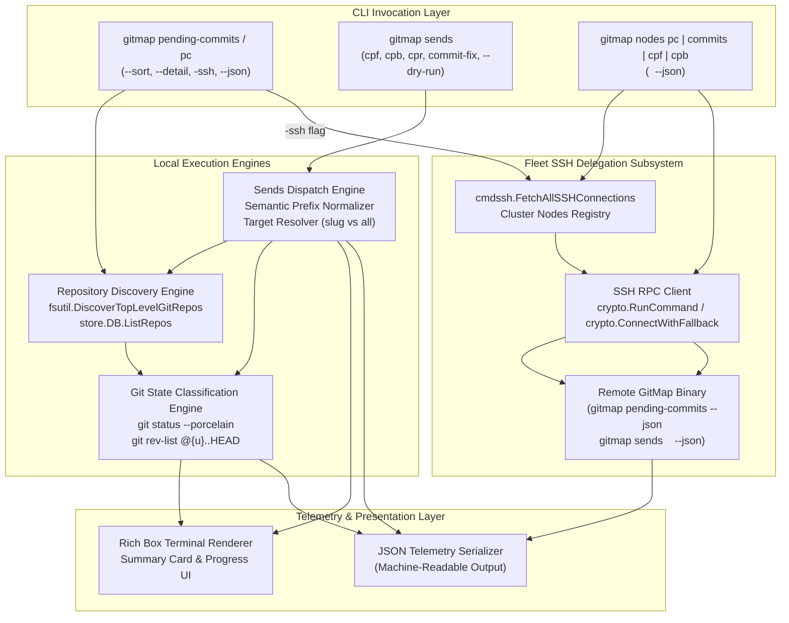
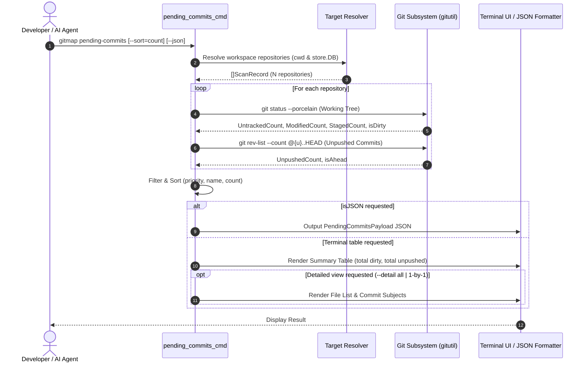
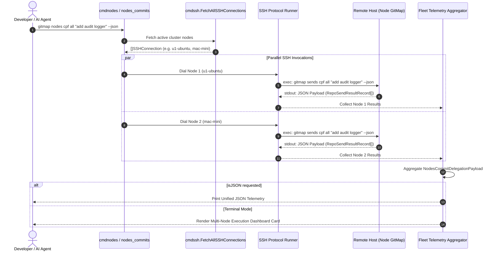
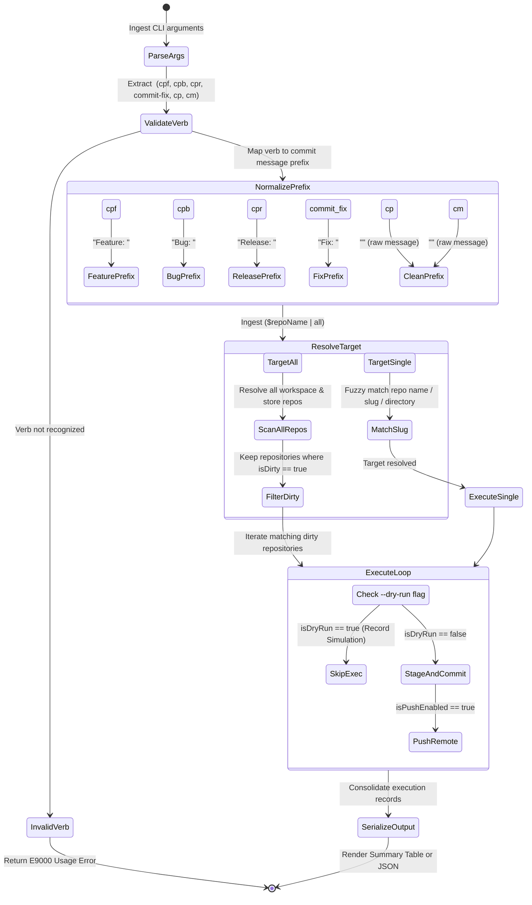

# Architecture Specification: Pending Commits, Sends & Fleet Nodes Commit Suite

> **Specification Reference:** `02-spec/21-app/232-pending-commits-sends-and-nodes-commit-suite/01-architecture-spec.md`  
> **Status:** APPROVED & ARCHITECTED  
> **Task Identifier:** `232-pending-commits-sends-and-nodes-commit-suite`  
> **Target Subsystems:** GitMap CLI Core, Working Tree Status Engine, Multi-Repo Commit Dispatcher, Fleet SSH RPC Engine, Unified Nodes Subsystem  
> **Relative Affected Paths:**  
> - `02-spec/21-app/232-pending-commits-sends-and-nodes-commit-suite/01-architecture-spec.md`  
> - `.ai-memory/plans/subtasks/232-pending-commits-sends-and-nodes-commit-suite/01-pending-commits-and-sends.md`  
> - `.ai-memory/plans/subtasks/232-pending-commits-sends-and-nodes-commit-suite/02-nodes-commits-and-delegation.md`  
> - `cli/cmd/pending_commits_cmd.go`  
> - `cli/cmd/pending_commits_types.go`  
> - `cli/cmd/pending_commits_help.go`  
> - `cli/cmd/sends_cmd.go`  
> - `cli/cmd/sends_types.go`  
> - `cli/cmd/sends_help.go`  
> - `cli/cmdnodes/nodes_pending_commits.go`  
> - `cli/cmdnodes/nodes_commits.go`  
> **Execution Constraint:** Pure Specification & Subtask Plan Authoring (Strict No-Build / No-Test Mode)

---

## 1. Executive Summary & Problem Formulation

### 1.1 Context & Background
In multi-repository development environments and distributed workstation fleets, developers and autonomous AI coding agents routinely maintain dozens of interconnected repositories across local workspaces and remote SSH cluster nodes. Managing changes across these repositories requires two high-frequency operations:
1. **Status Visibility:** Quickly identifying which repositories have uncommitted working tree changes (`git status --porcelain`) or unpushed local commits (`git rev-list @{u}..HEAD`), without having to manually inspect every repository one by one.
2. **Batch & Semantic Commits:** Atomically committing and pushing feature updates, bug fixes, releases, or merge remediations across a single targeted repository or across all dirty repositories simultaneously, following strict conventional commit conventions (`Feature: `, `Bug: `, `Release: `, `Fix: `).
3. **Fleet Delegation:** Querying pending commits and dispatching commit actions to remote GitMap instances on cluster nodes over SSH, receiving structured JSON responses for aggregate terminal rendering.

### 1.2 Identified Deficits in Prior Architecture
Prior to this specification, the GitMap command suite exhibited several operational bottlenecks:
1. **Fragmented Pending Commit Visibility:** Existing `gitmap status` and `gitmap status --dirty` provide generic tabular listings but lack a dedicated command focused on uncommitted and unpushed commits. There was no facility for sorting by change volume, viewing a compact summary prior to detailed diffs, or stepping through repositories one-by-one interactively.
2. **Absence of Unified Multi-Repo Semantic Commit Dispatch (`gitmap sends`):** While GitMap supports single-repo commands (`gitmap cpf`, `gitmap cpb`, `gitmap cpr`), there was no multi-repo command capable of accepting a semantic verb, resolving a target repository slug or iterating over `all` dirty repositories, applying the correct prefix, and pushing updates while automatically skipping clean repositories.
3. **Cluster Delegation Disconnect for Commit Operations:** Remote fleet operations under `gitmap nodes` supported cloning (`nodes clone`), scanning (`nodes scan`), and project deployment (`nodes deploy-repo`), but lacked remote commit delegation (`gitmap nodes pc` / `gitmap nodes commits/cpf/cpb/cpr/commit-fix`). Developers had to manually SSH into remote machines to run commits.
4. **JSON Telemetry Gaps:** Existing CLI commit commands wrote directly to stdout/stderr with terminal color codes, preventing external scripts, CI/CD runners, and parent AI agents from consuming structured JSON execution results.

### 1.3 Core Architectural Objectives
This architecture addresses all identified deficits through three pillars:
- **`gitmap pending-commits` (alias `pc`):** Scans all workspace and Split-DB repositories, classifies dirty working tree files vs unpushed commits, presents a summary table first, supports priority/name/count sorting, offers 1-by-1 or all-together detailed views, and supports `-ssh` fleet aggregation.
- **`gitmap sends <verb> <target> "<message>"`:** Standardizes semantic commit dispatch (`cpf`, `cpb`, `cpr`, `cp`, `cm`, `commit-fix`) targeting a specific repository or `all` dirty repositories, with dry-run safety and JSON output.
- **`gitmap nodes pending-commits(pc)` & `gitmap nodes commits/...`:** Delegates pending commit inspection and commit execution to remote GitMap instances across the SSH cluster fleet, aggregating JSON telemetry into unified terminal views.

---

## 2. High-Level System Architecture & Component Topology

### 2.1 System Component Topology Diagram

The following diagram illustrates the interaction between local commands, the discovery and git inspection engines, the remote SSH RPC subsystem, and output renderers:



---

### 2.2 Local Pending Commits Scanning & Inspection Sequence



---

### 2.3 Remote Fleet SSH Delegation Sequence



---

### 2.4 Semantic Prefix & Target Resolution State Machine



---

## 3. Command Suite Specification: `gitmap pending-commits` (`pc`)

### 3.1 Command Identity & Routing
- **Primary Command:** `gitmap pending-commits`
- **Canonical Alias:** `gitmap pc`
- **Subcommand Mapping:** Registered in `cli/cmd/rootcore.go` dispatch tables and `cli/cmd/pending_commits_cmd.go`.

### 3.2 Command Arguments & Flags
```text
Usage: gitmap pending-commits [flags]
Aliases: gitmap pc

Flags:
  -s, --sort <mode>       Sort order: priority | name | count (default: priority)
  -d, --detail <mode>     Detail view: none | summary | 1-by-1 | all (default: summary)
      --ssh               Aggregate pending commits across all registered cluster SSH nodes
  -j, --json              Output machine-readable JSON telemetry
      --dirty-only        Display only repositories with uncommitted or unpushed changes (default: true)
      --all               Include completely clean repositories in output
  -h, --help              Display command usage and options
```

### 3.3 Status Classification Engine
Each inspected repository is classified across two distinct Git state dimensions:
1. **Working Tree State (`isDirty`):**
   - Evaluated via `git status --porcelain`.
   - Populates positive counters: `untrackedFilesCount`, `modifiedFilesCount`, `stagedFilesCount`.
   - `isDirty` is set to `true` if `untrackedFilesCount + modifiedFilesCount + stagedFilesCount > 0`.
2. **Upstream Tracking State (`hasUnpushed`):**
   - Evaluated via `git rev-list --count @{u}..HEAD`.
   - If the repository has a tracking upstream, count denotes commits ahead of origin.
   - `hasUnpushed` is set to `true` if `unpushedCommitsCount > 0`.
   - `hasUpstream` is set to `false` if no remote tracking branch exists (local-only branch).
3. **Clean State (`isClean`):**
   - `isClean` is set to `true` if `isDirty == false && hasUnpushed == false`.

### 3.4 Sorting Strategies
- **`priority` (Default):**
  1. Repositories with both uncommitted changes AND unpushed commits (`isDirty && hasUnpushed`).
  2. Repositories with uncommitted changes only (`isDirty && !hasUnpushed`).
  3. Repositories with unpushed commits only (`!isDirty && hasUnpushed`).
  4. Completely clean repositories (`isClean`).
- **`count`:**
  - Descending numerical order of `totalPendingCount = (untracked + modified + staged) + unpushedCommitsCount`.
- **`name`:**
  - Case-insensitive ascending alphabetical sort by repository slug.

### 3.5 View Modes: Summary First vs Detailed
To prevent screen clutter in large workspaces (e.g. 78 repositories):
1. **Summary First (Default):**
   - Renders a high-level summary box displaying total repositories scanned, dirty repositories count, total uncommitted files, total unpushed commits, and a compact tabular overview.
2. **Detailed View (`--detail all`):**
   - Directly renders the file modification breakdown (status code + relative path) and unpushed commit SHA subjects beneath each dirty repository entry.
3. **Interactive 1-by-1 View (`--detail 1` or `--detail one-by-one`):**
   - If running in an interactive terminal (non-TTY bypasses to summary), prompts the developer to step through dirty repositories sequentially with `[n]ext / [s]kip / [a]ll / [q]uit`.

### 3.6 Fleet Mode (`-ssh` / `--ssh`)
When `--ssh` is specified:
1. GitMap queries `cmdssh.FetchAllSSHConnections()` for all configured cluster nodes.
2. Dialing routines invoke `gitmap pending-commits --json` concurrently on all online nodes.
3. Node results are parsed from JSON stdout and merged with local workspace results.
4. Output renders a clustered multi-node summary grouped by node alias.

---

## 4. Command Suite Specification: `gitmap sends`

### 4.1 Command Anatomy & Routing
- **Primary Command:** `gitmap sends <verb> <target> "<message>" [flags]`
- **Subcommand Mapping:** Registered in `cli/cmd/roottooling.go` and `cli/cmd/sends_cmd.go`.

### 4.2 Semantic Verbs & Prefix Matrix
The `<verb>` argument dictates the conventional commit prefix applied to the commit message:

| Verb | Semantic Prefix | Meaning & Conventional Commit Format | Auto-Push Default |
| :--- | :--- | :--- | :--- |
| **`cpf`** | `Feature: ` | New feature or functional capability | `isPushed: true` |
| **`cpb`** | `Bug: ` | Bug fix or defect remediation | `isPushed: true` |
| **`cpr`** | `Release: ` | Version release, changelog, or distribution bump | `isPushed: true` |
| **`commit-fix`** | `Fix: ` | Merge conflict resolution or guideline repair | `isPushed: true` |
| **`cp`** | `""` (None) | Standard commit and push without prefix injection | `isPushed: true` |
| **`cm`** | `""` (None) | Local commit only (stages and commits, does not push) | `isPushed: false` |

### 4.3 Target Resolution Engine (`<target>`)
The `<target>` argument specifies the destination scope:
1. **`all` (Case-Insensitive):**
   - Evaluates all repositories discovered in the current workspace and Split-DB repository registry.
   - **Non-Destructive Bypass:** Repositories where `isDirty == false` are automatically skipped with `status: "clean-skipped"`.
   - Only dirty repositories undergo `git add -A`, `git commit -m "<prefix><msg>"`, and `git push`.
2. **Specific Repository Name / Slug (`$repoName`):**
   - Resolves via exact match or case-insensitive fuzzy match against `repo.RepoName`, `repo.Slug`, or relative directory path.
   - If the targeted repository is clean and has unpushed commits, GitMap pushes outstanding commits.
   - If the targeted repository is clean and fully up-to-date, GitMap reports `status: "already-clean"`.

### 4.4 Command Flags
```text
Flags:
  -n, --dry-run           Preview staged actions without modifying files or git refs
      --no-push           Create local commits without pushing to remote origin
  -j, --json              Output machine-readable JSON execution telemetry
  -v, --verbose           Print detailed subprocess execution logs
  -h, --help              Display command usage and options
```

---

## 5. Command Suite Specification: `gitmap nodes pending-commits` & `gitmap nodes commits`

### 5.1 Command Identity & Syntax
Fleet operations are exposed under the unified `gitmap nodes` hierarchy:

1. **`gitmap nodes pending-commits` (alias `gitmap nodes pc`):**
   ```bash
   gitmap nodes pc [--sort=priority|count|name] [--json]
   ```
   - Queries pending commit status across all registered cluster nodes.
   - Aggregates node responses into a unified fleet dashboard.

2. **`gitmap nodes commits <target> "<message>"`:**
   ```bash
   gitmap nodes commits <repoName|all> "<message>" [--dry-run] [--no-push] [--json]
   ```
   - Standard commit across nodes.

3. **`gitmap nodes cpf <target> "<message>"`:**
   ```bash
   gitmap nodes cpf <repoName|all> "<message>" [--dry-run] [--no-push] [--json]
   ```
   - Dispatches `Feature: ` commit across nodes.

4. **`gitmap nodes cpb <target> "<message>"`:**
   ```bash
   gitmap nodes cpb <repoName|all> "<message>" [--dry-run] [--no-push] [--json]
   ```
   - Dispatches `Bug: ` commit across nodes.

5. **`gitmap nodes cpr <target> "<message>"`:**
   ```bash
   gitmap nodes cpr <repoName|all> "<message>" [--dry-run] [--no-push] [--json]
   ```
   - Dispatches `Release: ` commit across nodes.

6. **`gitmap nodes commit-fix <target> "<message>"`:**
   ```bash
   gitmap nodes commit-fix <repoName|all> "<message>" [--dry-run] [--no-push] [--json]
   ```
   - Dispatches `Fix: ` commit across nodes.

### 5.2 SSH JSON RPC Protocol
Fleet delegation functions strictly via remote CLI execution and JSON deserialization:
1. **Payload Construction:** The orchestrator formats the remote invocation:
   ```bash
   gitmap sends <verb> <target> "<msg>" --json [extra-flags]
   ```
2. **Channel Execution:** `crypto.RunCommand(sshClient, cmdStr, shell)` executes the command over the established SSH session.
3. **Payload Extraction:** GitMap captures remote stdout, locates the JSON envelope (filtering out any OS login banners), and unmarshals into structured Go types.
4. **Resilience & Fault Isolation:** If a node is unreachable or encounters an SSH timeout (configurable, default: 15 seconds), the error is isolated to that node record (`isSuccess: false`, `errorMessage: "..."`) without failing the entire fleet batch.

---

## 6. Complete JSON Telemetry & Data Schemas

### 6.1 Local Pending Commits Schema (`PendingCommitsPayload`)

```go
package cmd

import "time"

// PendingCommitsPayload represents the top-level JSON telemetry for pending-commits.
type PendingCommitsPayload struct {
	Timestamp            time.Time                 `json:"timestamp"`
	TotalReposScanned    int                       `json:"totalReposScanned"`
	TotalDirtyRepos      int                       `json:"totalDirtyRepos"`
	TotalUncommittedFiles int                      `json:"totalUncommittedFiles"`
	TotalUnpushedCommits int                       `json:"totalUnpushedCommits"`
	SortMode             string                    `json:"sortMode"`
	DetailMode           string                    `json:"detailMode"`
	Repositories         []RepoPendingCommitRecord `json:"repositories"`
}

// RepoPendingCommitRecord represents the status of an individual repository.
type RepoPendingCommitRecord struct {
	RepoName             string   `json:"repoName"`
	RelativePath         string   `json:"relativePath"`
	CurrentBranch        string   `json:"currentBranch"`
	IsDirty              bool     `json:"isDirty"`
	IsClean              bool     `json:"isClean"`
	HasUncommitted       bool     `json:"hasUncommitted"`
	HasUnpushed          bool     `json:"hasUnpushed"`
	HasUpstream          bool     `json:"hasUpstream"`
	UntrackedFilesCount  int      `json:"untrackedFilesCount"`
	ModifiedFilesCount   int      `json:"modifiedFilesCount"`
	StagedFilesCount     int      `json:"stagedFilesCount"`
	UnpushedCommitsCount int      `json:"unpushedCommitsCount"`
	PendingFiles         []string `json:"pendingFiles,omitempty"`
	UnpushedCommitSHAs   []string `json:"unpushedCommitShas,omitempty"`
}
```

```json
{
  "timestamp": "2026-10-06T18:35:00Z",
  "totalReposScanned": 78,
  "totalDirtyRepos": 2,
  "totalUncommittedFiles": 4,
  "totalUnpushedCommits": 1,
  "sortMode": "priority",
  "detailMode": "summary",
  "repositories": [
    {
      "repoName": "gitmap",
      "relativePath": ".",
      "currentBranch": "main",
      "isDirty": true,
      "isClean": false,
      "hasUncommitted": true,
      "hasUnpushed": true,
      "hasUpstream": true,
      "untrackedFilesCount": 1,
      "modifiedFilesCount": 3,
      "stagedFilesCount": 0,
      "unpushedCommitsCount": 1,
      "pendingFiles": [
        "M cli/cmd/pending_commits_cmd.go",
        "M cli/cmd/sends_cmd.go",
        "?? cli/cmd/pending_commits_types.go"
      ],
      "unpushedCommitShas": [
        "e1750de7 Feature: core - token purge and ui modernization"
      ]
    }
  ]
}
```

---

### 6.2 Sends Execution Schema (`SendsExecutionPayload`)

```go
package cmd

import "time"

// SendsExecutionPayload represents the top-level JSON telemetry for gitmap sends.
type SendsExecutionPayload struct {
	Timestamp          time.Time              `json:"timestamp"`
	Verb               string                 `json:"verb"`
	PrefixApplied      string                 `json:"prefixApplied"`
	RawMessage         string                 `json:"rawMessage"`
	FinalCommitMessage string                 `json:"finalCommitMessage"`
	TargetScope        string                 `json:"targetScope"`
	IsDryRun           bool                   `json:"isDryRun"`
	IsPushed           bool                   `json:"isPushed"`
	TotalProcessed     int                    `json:"totalProcessed"`
	TotalCommitted     int                    `json:"totalCommitted"`
	TotalSkipped       int                    `json:"totalSkipped"`
	Results            []RepoSendResultRecord `json:"results"`
}

// RepoSendResultRecord details the commit and push operation for a single repository.
type RepoSendResultRecord struct {
	RepoName     string `json:"repoName"`
	RelativePath string `json:"relativePath"`
	Status       string `json:"status"` // committed | pushed | clean-skipped | dry-run-simulated | failed
	Branch       string `json:"branch"`
	HeadSHA      string `json:"headSha,omitempty"`
	FilesStaged  int    `json:"filesStaged"`
	IsSuccess    bool   `json:"isSuccess"`
	ErrorMessage string `json:"errorMessage,omitempty"`
}
```

```json
{
  "timestamp": "2026-10-06T18:35:10Z",
  "verb": "cpf",
  "prefixApplied": "Feature: ",
  "rawMessage": "pending commits and sends suite",
  "finalCommitMessage": "Feature: pending commits and sends suite",
  "targetScope": "all",
  "isDryRun": false,
  "isPushed": true,
  "totalProcessed": 78,
  "totalCommitted": 2,
  "totalSkipped": 76,
  "results": [
    {
      "repoName": "gitmap",
      "relativePath": ".",
      "status": "pushed",
      "branch": "main",
      "headSha": "54c19736",
      "filesStaged": 4,
      "isSuccess": true
    },
    {
      "repoName": "scripts-fixer",
      "relativePath": "scripts-fixer",
      "status": "clean-skipped",
      "branch": "main",
      "filesStaged": 0,
      "isSuccess": true
    }
  ]
}
```

---

### 6.3 Fleet Nodes Remote Delegation Schema (`NodesCommitDelegationPayload`)

```go
package cmdnodes

import (
	"time"

	"github.com/alimtvnetwork/gitmap-v28/cli/cmd"
)

// NodesPendingCommitsPayload represents aggregated fleet pending commits.
type NodesPendingCommitsPayload struct {
	Timestamp       time.Time                     `json:"timestamp"`
	TotalNodes      int                           `json:"totalNodes"`
	OnlineNodes     int                           `json:"onlineNodes"`
	FleetResults    []NodePendingCommitsRecord    `json:"fleetResults"`
}

// NodePendingCommitsRecord represents pending commits for a specific cluster node.
type NodePendingCommitsRecord struct {
	NodeAlias       string                     `json:"nodeAlias"`
	Host            string                     `json:"host"`
	OSType          string                     `json:"osType"`
	IsOnline        bool                       `json:"isOnline"`
	IsSuccess       bool                       `json:"isSuccess"`
	LatencyMs       int64                      `json:"latencyMs"`
	ErrorMessage    string                     `json:"errorMessage,omitempty"`
	Payload         *cmd.PendingCommitsPayload `json:"payload,omitempty"`
}

// NodesCommitDelegationPayload represents aggregated fleet commit dispatch results.
type NodesCommitDelegationPayload struct {
	Timestamp       time.Time                     `json:"timestamp"`
	CommandVerb     string                        `json:"commandVerb"`
	TargetScope     string                        `json:"targetScope"`
	Message         string                        `json:"message"`
	TotalNodes      int                           `json:"totalNodes"`
	SuccessfulNodes int                           `json:"successfulNodes"`
	NodeResults     []NodeCommitDelegationRecord  `json:"nodeResults"`
}

// NodeCommitDelegationRecord represents commit dispatch telemetry on a single cluster node.
type NodeCommitDelegationRecord struct {
	NodeAlias       string                     `json:"nodeAlias"`
	Host            string                     `json:"host"`
	OSType          string                     `json:"osType"`
	IsSuccess       bool                       `json:"isSuccess"`
	LatencyMs       int64                      `json:"latencyMs"`
	ErrorMessage    string                     `json:"errorMessage,omitempty"`
	ExecutionResult *cmd.SendsExecutionPayload `json:"executionResult,omitempty"`
}
```

---

### 6.4 Positive Boolean Compliance Audit Matrix

| Struct Field Name | Type | Affirmative Semantic Meaning | Forbidden Negative Anti-Pattern |
| :--- | :--- | :--- | :--- |
| `IsDirty` | `bool` | Working tree contains uncommitted files | `IsNotClean`, `Uncommitted` |
| `IsClean` | `bool` | Working tree and upstream tracking are fully synchronized | `NotDirty` |
| `HasUncommitted` | `bool` | Uncommitted staged or unstaged modifications present | `NoChanges` |
| `HasUnpushed` | `bool` | Local commits ahead of upstream branch present | `Unpushed` |
| `HasUpstream` | `bool` | Upstream remote tracking branch is configured | `NoRemote` |
| `IsDryRun` | `bool` | Simulation mode enabled; no writes performed | `SkipCommit`, `NoExec` |
| `IsPushed` | `bool` | Changes were successfully pushed to remote origin | `Unpushed` |
| `IsOnline` | `bool` | Cluster node reachable over SSH | `IsOffline`, `Unreachable` |
| `IsSuccess` | `bool` | Subprocess or command executed with zero exit code | `Failed`, `HasError` |

---

## 7. Terminal UX, Help Text & Box Rendering

### 7.1 `gitmap pending-commits` Summary Card & Box UI
```text
┌──────────────────────────────────────────────────────────────────────────────┐
│                    GITMAP PENDING COMMITS SUMMARY                           │
├──────────────────────────────────────────────────────────────────────────────┤
│ Scanned: 78 repos  │  Dirty: 2 repos  │  Uncommitted: 4 files  │  Unpushed: 1 │
├──────────────────────────────────────────────────────────────────────────────┤
│ REPOSITORY          BRANCH   DIRTY  UNTRACK  MODIF  STAGE  UNPUSHED  STATUS  │
├──────────────────────────────────────────────────────────────────────────────┤
│ gitmap              main     YES         1      3      0         1   ● PEND  │
│ prompts-connect     main     YES         0      1      0         0   ● PEND  │
│ 76 clean repos      -        NO          0      0      0         0   ○ CLEAN │
└──────────────────────────────────────────────────────────────────────────────┘
```

### 7.2 `gitmap sends` Execution Summary Card
```text
┌──────────────────────────────────────────────────────────────────────────────┐
│                        GITMAP SENDS EXECUTION CARD                           │
├──────────────────────────────────────────────────────────────────────────────┤
│ Verb: cpf (Feature:) │ Target: all │ Dry-Run: false │ Push: true             │
│ Message: Feature: pending commits and sends suite                            │
├──────────────────────────────────────────────────────────────────────────────┤
│  ✓ gitmap          -> Staged 4 files -> Committed 54c19736 -> Pushed origin  │
│  - scripts-fixer   -> Clean working tree -> Skipped                          │
│  - wp-html-automate-> Clean working tree -> Skipped                          │
├──────────────────────────────────────────────────────────────────────────────┤
│ Summary: 1 committed & pushed | 77 skipped clean | 0 failed                  │
└──────────────────────────────────────────────────────────────────────────────┘
```

---

## 8. Quality Verification Gates (VG-01 to VG-07)

### VG-01: Command Routing Parity
- **Requirement:** `gitmap pending-commits`, `gitmap pc`, `gitmap sends`, `gitmap nodes pc`, `gitmap nodes commits`, `gitmap nodes cpf`, `gitmap nodes cpb`, `gitmap nodes cpr`, `gitmap nodes commit-fix` must resolve cleanly without panic or unknown command errors.
- **Verification Method:** Unit tests executing CLI flag parser dispatch tables in `cli/cmd/pending_commits_test.go` and `cli/cmdnodes/nodes_commits_test.go`.

### VG-02: Status & Commit Classification
- **Requirement:** The inspection engine must accurately distinguish uncommitted working tree changes (`untracked`, `modified`, `staged`) from unpushed commits ahead of upstream (`@{u}..HEAD`).
- **Verification Method:** Mock Git runner verifying `parsePortcelainStatus` and `parseAheadBehind` outputs.

### VG-03: Target Resolution Parity
- **Requirement:** Target selector resolves both single repository names/slugs and the `all` keyword. Clean repositories are non-destructively skipped during `all` operations.
- **Verification Method:** Unit test asserting that given 3 repos (1 dirty, 2 clean), `sends cpf all "msg"` only mutates the dirty repo.

### VG-04: Semantic Message Prefixing
- **Requirement:** Commit message prefix injection must strictly adhere to conventions: `cpf` injects `Feature: `, `cpb` injects `Bug: `, `cpr` injects `Release: `, `commit-fix` injects `Fix: `, while `cp` and `cm` inject nothing.
- **Verification Method:** Table-driven unit test verifying `normalizeCommitMessage(verb, rawMsg)`.

### VG-05: Remote JSON RPC Delegation
- **Requirement:** SSH delegation must execute `gitmap sends ... --json` remotely, isolate stdout JSON from SSH banners, and gracefully handle node timeouts without failing the entire fleet.
- **Verification Method:** Unit test with mock SSH runner verifying JSON unmarshaling and error isolation.

### VG-06: UI Help Text & Box Rendering
- **Requirement:** Rich UI box help dashboards and usage text must render cleanly when called with `--help` or `-h`.
- **Verification Method:** Test asserting non-empty ANSI-clean output containing flags and examples.

### VG-07: Path Relativity & Coding Guidelines
- **Requirement:** All referenced paths must strictly use relative Git paths (e.g. `02-spec/...`, `.ai-memory/...`, `cli/...`). Positive boolean names must be used exclusively. Pure specification mode (zero build or test executions during authoring).
- **Verification Method:** Automated inspection of specification markdown and code plans.
