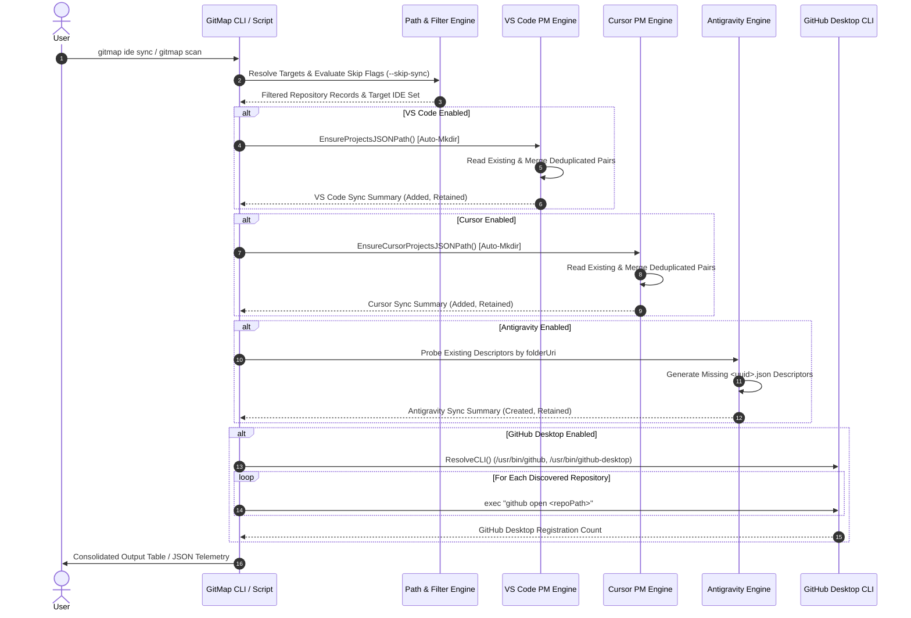

# Architecture Specification: Ubuntu Multi-IDE & GitHub Desktop Scan-Sync Engine

> **Document Version:** 1.0.0  
> **Status:** Active  
> **Scope:** GitMap Core CLI (`cli/cmdide`, `cli/vscodepm`, `cli/desktop`, `cli/cmdscan`, `cli/scanner`), Standalone Tooling (`03-ai-scripts/40-ubuntu-ide-desktop-sync.py`)  
> **Traceability:** Task-232 (`232-ubuntu-ide-and-github-desktop-scan-sync`)  
> **Target OS:** Ubuntu Linux 22.04 / 24.04 LTS (with Cross-Platform Parity for macOS and Windows)  

---

## 1. Executive Summary & Problem Statement

GitMap provides repository scanning (`gitmap scan`, `gitmap rescan`) to discover local Git workspaces, index them into SQLite tracking databases, and register them across local developer tooling. On Ubuntu Linux workstations, end-to-end investigation revealed a critical flaw: **running `gitmap scan` failed to register discovered repositories into either GitHub Desktop or VS Code**.

A thorough root-cause audit identified four interconnected architectural omissions:
1. **Omission of Auto-Mkdir in `cli/vscodepm`**: When the VS Code Project Manager extension directory (`~/.config/Code/User/globalStorage/alefragnani.project-manager`) does not yet exist on disk, `vscodepm.ProjectsJSONPath()` returns `ErrExtensionMissing`. Callers treat this as a silent soft skip rather than auto-creating the folder hierarchy, leaving `projects.json` uncreated and unpopulated.
2. **Missing GitHub Desktop Linux CLI Discovery**: The CLI resolver in `cli/desktop/resolve.go` only defined candidate install paths for Windows and macOS, returning empty candidates on Linux. It probed exclusively for the command name `github` via `exec.LookPath`, failing to probe standard Linux shims such as `/usr/bin/github-desktop`, `/usr/lib/github-desktop/resources/app/static/github`, Flatpak wrappers (`com.github.shiftkey.Desktop`), or AppImages.
3. **Default False Toggle in `cli/cmdscan`**: The scan flag `--github-desktop` was registered as `false` by default, meaning repository registration into GitHub Desktop was completely bypassed during routine scans unless the user explicitly remembered to pass the flag.
4. **Absence of Cursor and Antigravity IDE Hooks**: Modern developer workflows on Ubuntu utilize multiple editors simultaneously (VS Code, Cursor, Google Antigravity). `gitmap scan` possessed zero integration hooks for Cursor (`~/.config/Cursor/User/...`) or Antigravity (`~/.gemini/config/projects/*.json`), causing cross-tool desynchronization.

This specification details the comprehensive architecture to resolve these issues through:
- A grounded 4-part Root Cause Analysis (Task-01),
- A standalone, high-performance Python synchronization utility `03-ai-scripts/40-ubuntu-ide-desktop-sync.py` (Task-02),
- A dedicated native GitMap CLI command suite `cli/cmdide/` with commands `add`, `sync`, `remove`, `ls`, and `status` (Task-03),
- Seamless integration into `gitmap scan` with intelligent deduplication and skip toggles (Task-04 & Task-05).

---

## 2. Ubuntu IDE & GitHub Desktop Storage Layout

Understanding the filesystem layout and schema expectations for each application on Ubuntu is essential for reliable synchronization.

```
~ (User Home: /home/<user>)
├── .config/
│   ├── Code/
│   │   └── User/
│   │       ├── globalStorage/
│   │       │   ├── alefragnani.project-manager/
│   │       │   │   └── projects.json             <-- Primary VS Code PM Storage
│   │       │   └── state.vscdb                   <-- SQLite DB (history.recentlyOpenedPathsList)
│   │       └── projects.json                     <-- Legacy / Fallback PM Storage
│   ├── Cursor/
│   │   └── User/
│   │       ├── globalStorage/
│   │       │   ├── alefragnani.project-manager/
│   │       │   │   └── projects.json             <-- Primary Cursor PM Storage
│   │       │   └── state.vscdb                   <-- SQLite DB (history.recentlyOpenedPathsList)
│   │       └── projects.json                     <-- Secondary Cursor PM Storage
│   └── GitHub Desktop/
│       ├── IndexedDB/
│       │   └── file__0.indexeddb.leveldb/        <-- Chromium LevelDB (Repositories Store)
│       └── window-state.json
└── .gemini/
    └── config/
        ├── projects/
        │   └── <uuid>.json                       <-- Antigravity Workspace Descriptors
        └── pinned_projects.json                  <-- Antigravity Pinned Registry
```

### 2.1 Visual Studio Code Layout & Schema

#### 2.1.1 Project Manager Extension Storage
- **Canonical Path:** `~/.config/Code/User/globalStorage/alefragnani.project-manager/projects.json`
- **Fallback Path:** `~/.config/Code/User/projects.json`
- **Format:** JSON array of project definitions.
- **Record Schema:**
```json
[
  {
    "name": "gitmap",
    "rootPath": "/home/a/git-work/gitmap",
    "paths": [],
    "tags": [
      "gitmap",
      "go"
    ],
    "enabled": true
  }
]
```
- **Key Constraints:**
  - `rootPath`: Absolute filesystem path to the workspace root directory.
  - `name`: Human-readable identifier, typically matching the repository directory base name.
  - `paths`: Array of secondary workspace roots for multi-root projects (empty for standard single repositories).
  - `tags`: Array of classification tags (derived from folder name, repository detection, or user assignment).
  - `enabled`: Boolean toggle indicating whether the project is active in the Project Manager sidebar.

#### 2.1.2 VS Code Recent Workspaces SQLite Storage (`state.vscdb`)
- **Path:** `~/.config/Code/User/globalStorage/state.vscdb`
- **Engine:** SQLite 3.
- **Table Name:** `ItemTable` (`key TEXT PRIMARY KEY, value BLOB`).
- **Target Key:** `history.recentlyOpenedPathsList`.
- **Value Format:** JSON object containing `entries: [ { "folderUri": "file:///path/to/repo" }, ... ]`.

---

### 2.2 Cursor IDE Layout & Schema

Cursor is an AI-first fork of VS Code and maintains an identical directory architecture under the `Cursor` configuration umbrella.

- **Primary Path:** `~/.config/Cursor/User/globalStorage/alefragnani.project-manager/projects.json`
- **Secondary Path:** `~/.config/Cursor/User/projects.json`
- **Recent Workspaces:** `~/.config/Cursor/User/globalStorage/state.vscdb`
- **Compatibility:** Cursor reads the standard `alefragnani.project-manager` schema directly. Synchronizing records to both VS Code and Cursor ensures that users transitioning between editors experience unified project palettes.

---

### 2.3 Google Antigravity IDE Layout & Schema

Google Antigravity utilizes an agentic workspace model where each project is defined by a standalone descriptor file in RFC 4122 UUID v4 format.

- **Project Descriptors Root:** `~/.gemini/config/projects/`
- **Descriptor Filename:** `<uuid>.json` (for example, `18161e7d-2758-4bb9-82ab-317cabda949a.json`).
- **Pinned Registry:** `~/.gemini/config/pinned_projects.json`.
- **Record Schema:**
```json
{
  "id": "18161e7d-2758-4bb9-82ab-317cabda949a",
  "name": "gitmap",
  "projectResources": {
    "resources": [
      {
        "gitFolder": {
          "folderUri": "file:///home/a/git-work/gitmap",
          "defaultBranch": "main"
        }
      }
    ]
  },
  "permissionGrants": {
    "v2Migrated": true
  },
  "settings": {
    "autoExecutionPolicy": "CASCADE_COMMANDS_AUTO_EXECUTION_EAGER"
  },
  "isWorkspaceOnly": false
}
```
- **Key Constraints:**
  - `folderUri`: Canonical file URI adhering to RFC 3986 (`file:///home/...`).
  - `defaultBranch`: Discovered primary Git branch (`main` or `master`).
  - Affirmative boolean conventions (`isWorkspaceOnly: false`).

---

### 2.4 GitHub Desktop Layout & CLI Invocation Mechanics

GitHub Desktop on Linux (packages maintained by Shiftkey/Debian community or official Electron bundles) operates through two distinct layers:

#### 2.4.1 CLI Shim Invocation
- **Binary Locations:**
  - `/usr/bin/github` (symlinked to `/usr/lib/github-desktop/resources/app/static/github`)
  - `/usr/bin/github-desktop` (symlinked to `/usr/lib/github-desktop/github-desktop`)
  - `/usr/local/bin/github`
  - Flatpak command: `flatpak run com.github.shiftkey.Desktop`
- **CLI Shell Script Structure:**
  The canonical shell wrapper `/usr/lib/github-desktop/resources/app/static/github` executes:
  ```bash
  ELECTRON_RUN_AS_NODE=1 "$ELECTRON" "$CLI" open <path>
  ```
- **CLI Command Syntax:**
  - `github open <path>`: Opens or adds the Git repository at `<path>` into GitHub Desktop.
  - `github <path>`: Implicitly invokes the open handler for the target directory.
  - `github clone <url|slug>`: Clones a remote repository.
- **Invocation Characteristics:**
  The shell script detaches the Electron process via `< /dev/null > /dev/null &` when invoked with non-help commands, returning exit code 0 immediately.

#### 2.4.2 IndexedDB Storage (`file__0.indexeddb.leveldb`)
- **Path:** `~/.config/GitHub Desktop/IndexedDB/file__0.indexeddb.leveldb/`
- **Internal Storage:** Chromium LevelDB key-value store holding serialized repository descriptors, remote origin URLs, last fetched timestamps, and active branch state.
- **Access Rule:** Because LevelDB enforces exclusive process-level locking when GitHub Desktop is actively running, direct filesystem mutation of LevelDB blocks or risks corrupting transaction logs. **CLI invocation via `github open <path>` is the mandatory, safe, non-destructive method for adding repositories to GitHub Desktop.**

---

## 3. Subsystem Architecture & Component Breakdown

```
┌────────────────────────────────────────────────────────────────────────┐
│                        User & Workflow Ingress                         │
│  - gitmap scan / rescan                                                │
│  - gitmap ide <add | sync | remove | ls | status>                      │
│  - 03-ai-scripts/40-ubuntu-ide-desktop-sync.py                         │
└───────────────────┬────────────────────────────────────────────────────┘
                    │
                    ▼
┌────────────────────────────────────────────────────────────────────────┐
│                   Unified IDE Orchestration Engine                     │
│  - Deduplication & Existing Repo State Resolver                        │
│  - Target IDE Selector & Exclusion Filter (--skip-sync, --exclude-sync)│
│  - Auto-Mkdir Directory Guard                                          │
└────────┬──────────────┬──────────────┬───────────────┬─────────────────┘
         │              │              │               │
         ▼              ▼              ▼               ▼
┌────────────────┐┌───────────┐┌──────────────┐┌────────────────────────┐
│ VS Code PM     ││ Cursor PM ││ Antigravity  ││ GitHub Desktop CLI     │
│ Storage Engine ││ Storage   ││ Store Engine ││ Invocation Engine      │
│                ││ Engine    ││              ││                        │
│ - Ensure Dir   ││ - Ensure  ││ - Generate   ││ - Probe CLI Candidates │
│ - Atomic JSON  ││   Dir     ││   UUID v4    ││ - Verify Git Root      │
│ - Merge Tags   ││ - Atomic  ││ - Descriptor ││ - `github open <path>` │
│ - Deduplicate  ││   JSON    ││   Writing    ││ - Fallback Detection   │
└────────────────┘└───────────┘└──────────────┘└────────────────────────┘
```

---

## 4. Task-01: Root Cause Analysis Architecture

Task-01 conducts a rigorous, grounded investigation and formalizes findings into `02-spec/22-app-issues/232-ubuntu-ide-github-desktop-scan-omission.md`.

### 4.1 Root Cause Breakdown Matrix

| Vulnerability Vector | Affected Source File | Exact Mechanism | Failure Mode |
| :--- | :--- | :--- | :--- |
| **Vector 1: Omission of Auto-Mkdir** | `cli/vscodepm/path.go` (lines 55-64) | `ProjectsJSONPath()` checks `if !dirExists(extDir)` and immediately returns `ErrExtensionMissing` without attempting directory creation. | When VS Code is freshly installed or the extension hasn't saved projects, the parent folder is absent. GitMap returns a soft error and drops all records without writing `projects.json`. |
| **Vector 2: Linux CLI Resolution Blindspot** | `cli/desktop/resolve.go` (lines 43-56) | `knownInstallCandidates()` explicitly handled only Windows (`runtime.GOOS == "windows"`) and macOS (`runtime.GOOS == "darwin"`), returning `nil` on Linux. | If `github` was installed under `/usr/bin/github-desktop` or custom bin directories not in active PATH, discovery failed and returned empty string. |
| **Vector 3: Default False Scan Flag** | `cli/cmdscan/flags.go` (line 63) | `flagPtrs.ghDesktopFlag = fs.Bool("github-desktop", false, ...)` | Scanning defaulted to omitting GitHub Desktop registration. Users expected seamless synchronization without passing manual flags. |
| **Vector 4: Absence of Multi-IDE Pipeline** | `cli/cmdscan/scan.go` (lines 183-188) | Scan execution loop only invoked `addToDesktop` and `syncRecordsToVSCodePM`, with zero calls to Cursor or Antigravity handlers. | Multi-editor workspaces remained fragmented, requiring manual import across tools. |

### 4.2 Auto-Mkdir Resolution Architecture
In `cli/vscodepm/path.go`, path resolution must distinguish between read-only queries and write-intent operations. For write-intent operations (`EnsureProjectsJSONPath()`), the resolver must execute `os.MkdirAll(extDir, constants.DirPermission)`:
```go
func EnsureProjectsJSONPath() (string, error) {
    root, err := UserDataRoot()
    if err != nil {
        return "", err
    }
    extDir := filepath.Join(root,
        constants.VSCodePMUserDir,
        constants.VSCodePMGlobalStorageDir,
        constants.VSCodePMExtensionDir)
    if err := os.MkdirAll(extDir, constants.DirPermission); err != nil {
        return "", fmt.Errorf("failed to create project-manager directory: %w", err)
    }
    return filepath.Join(extDir, constants.VSCodePMProjectsFile), nil
}
```

---

## 5. Task-02: Standalone Multi-IDE Synchronization Script Architecture

Task-02 defines the architecture of `03-ai-scripts/40-ubuntu-ide-desktop-sync.py`, providing immediate, dependency-free automation before and alongside CLI integration.

### 5.1 Architecture & Core Components
- **Integration with Shared Engine:** Ingests base primitives, logging, cross-platform locking, and positive booleans from `03-ai-scripts/02-shared-engine.py`.
- **Target Editors Supported:**
  1. `vscode`: Writes to `~/.config/Code/User/globalStorage/alefragnani.project-manager/projects.json`.
  2. `cursor`: Writes to `~/.config/Cursor/User/globalStorage/alefragnani.project-manager/projects.json`.
  3. `antigravity`: Writes descriptors to `~/.gemini/config/projects/<uuid>.json` and updates `pinned_projects.json`.
  4. `desktop`: Executes `github open <path>` or `github-desktop open <path>`.

### 5.2 Command Line Interface
```bash
python3 03-ai-scripts/40-ubuntu-ide-desktop-sync.py [options]

Options:
  --scan-dir PATH       Root directory to discover repositories (default: current directory)
  --from-db             Read repository inventory directly from gitmap.db
  --ide TARGETS         Comma-separated target IDEs: vscode,cursor,antigravity,desktop,all (default: all)
  --exclude-ide TARGETS Comma-separated IDEs to skip (e.g. desktop,cursor)
  --skip-sync TARGETS   Alias for --exclude-ide
  --dry-run             Simulate modifications without writing to disk or invoking CLIs
  --quiet               Suppress verbose standard output
  --json                Emit structured JSON results for programmatic ingestion
```

### 5.3 Deduplication & Merge Logic
1. **VS Code & Cursor:**
   - Reads existing entries from `projects.json`.
   - Constructs a canonical path map using `os.path.realpath()`.
   - For existing paths, retains existing tags and names; appends missing repositories.
   - Writes atomically via a temporary file with `os.replace`.
2. **Antigravity:**
   - Reads existing `<uuid>.json` descriptors from `~/.gemini/config/projects/`.
   - Maps normalized `folderUri` to prevent duplicate file creation.
   - Only creates a new UUID file if no matching `folderUri` exists.
3. **GitHub Desktop:**
   - Checks if the directory contains a valid `.git` folder.
   - Executes `/usr/bin/github open <path>` with a 2-second timeout per repository.
   - Aggregates success and failure counts into execution telemetry.

---

## 6. Task-03: `cli/cmdide/` Command Suite Architecture

Task-03 introduces the dedicated `gitmap ide` command group under `cli/cmdide/`, providing first-class CLI lifecycle management for IDE project registrations.

### 6.1 Command Matrix & Syntax

```bash
# Add a single repository to all or specific IDEs
gitmap ide add <path|slug> [flags]

# Reconcile all tracked repositories across IDEs
gitmap ide sync [dir] [flags]

# Remove a repository from IDE configurations
gitmap ide remove <path|slug> [flags]
gitmap ide rm <path|slug> [flags]

# List registered repositories per IDE
gitmap ide ls [flags]
gitmap ide list [flags]

# Inspect health and configuration of installed IDEs
gitmap ide status [flags]
```

### 6.2 Flag Specification

| Flag | Shorthand | Type | Default | Description |
| :--- | :--- | :--- | :--- | :--- |
| `--ide` | `-i` | `string` | `"all"` | Target specific IDEs (`vscode`, `cursor`, `antigravity`, `desktop`, `all`). |
| `--skip-sync` | | `string` | `""` | Comma-separated list of IDEs to exclude during synchronization. |
| `--exclude-sync`| | `string` | `""` | Alias for `--skip-sync`. |
| `--dry-run` | `-n` | `bool` | `false` | Simulate operations without modifying configuration files. |
| `--json` | `-j` | `bool` | `false` | Output structured JSON response. |
| `--quiet` | `-q` | `bool` | `false` | Silence non-essential terminal messages. |
| `--force-create`| | `bool` | `true` | Automatically create missing IDE storage directories (`os.MkdirAll`). |

### 6.3 Subcommand Execution Behaviors

#### 6.3.1 `gitmap ide add <path|slug>`
- Resolves `<path|slug>` against absolute filesystem paths or existing records in `gitmap.db`.
- Validates that the target path contains a valid `.git` root.
- Registers the repository into each enabled IDE registry.
- Invokes GitHub Desktop CLI (`github open <path>`) if GitHub Desktop is enabled.

#### 6.3.2 `gitmap ide sync [dir]`
- When `dir` is supplied, walks `dir` to discover all Git repositories; otherwise, queries all active repositories from `store.OpenDefault()`.
- Filters targets according to `--ide` and `--skip-sync` / `--exclude-sync`.
- Executes batch deduplicated merge across VS Code, Cursor, Antigravity, and GitHub Desktop.
- Emits a clean terminal summary table indicating added, preserved, and failed counts per IDE.

#### 6.3.3 `gitmap ide remove <path|slug>`
- Locates the repository in `projects.json` across VS Code and Cursor and removes the entry.
- Locates and deletes the corresponding `<uuid>.json` file in Antigravity storage.
- Emits status confirming removal from each respective editor.

#### 6.3.4 `gitmap ide ls` / `gitmap ide list`
- Inspects configuration files across all supported IDEs.
- Outputs a consolidated table showing repository path, name, and registered IDE matrix.

#### 6.3.5 `gitmap ide status`
- Probes filesystem and environment variables to detect installed IDEs:
  - VS Code executable and storage directory existence.
  - Cursor executable and storage directory existence.
  - Antigravity configuration directory existence.
  - GitHub Desktop CLI shim location and LevelDB store existence.
- Displays detected paths, project counts, and health status.

---

## 7. Data Flow & Sequence Diagram



---

## 8. Positive Boolean & Hygiene Compliance

In compliance with repository coding guidelines:
- All boolean variables, struct fields, and function names utilize positive, affirmative naming:
  - `isSyncEnabled` (never `isNotDisabled`)
  - `isVSCodeEnabled` (replaces inverted flags)
  - `isCursorEnabled`
  - `isAntigravityEnabled`
  - `isGitHubDesktopEnabled`
  - `isAutoMkdirEnabled`
  - `isDryRun`
- All filesystem references in specifications and plans strictly employ relative repository paths.
- All code and documentation adhere to US English spelling conventions.
- No direct Git commands are executed in documentation or automated specifications.

---

## 9. Verification & Acceptance Criteria

1. **Auto-Mkdir Verification:**
   - Invoking `vscodepm.Sync` when `~/.config/Code/User/globalStorage/alefragnani.project-manager` does not exist succeeds without error and creates both the directory and `projects.json`.
2. **Linux GitHub Desktop CLI Resolution:**
   - `desktop.ResolveCLI()` successfully discovers `/usr/bin/github` and `/usr/bin/github-desktop` on Ubuntu Linux.
3. **Standalone Script Execution:**
   - `python3 03-ai-scripts/40-ubuntu-ide-desktop-sync.py --dry-run` discovers all local workspace repositories and outputs structured JSON without errors.
4. **Command Suite Operation:**
   - `gitmap ide status` displays accurate status for VS Code, Cursor, Antigravity, and GitHub Desktop.
   - `gitmap ide sync` populates all active IDEs and reports deduplicated counts.
   - `gitmap ide add <path>` registers the specified path.
   - `gitmap ide remove <path>` removes the specified path.
   - `gitmap ide ls` lists registered entries cleanly.
5. **Scan Integration:**
   - `gitmap scan` correctly registers discovered repositories into IDEs when enabled, respecting `--skip-sync` and `--exclude-sync`.
