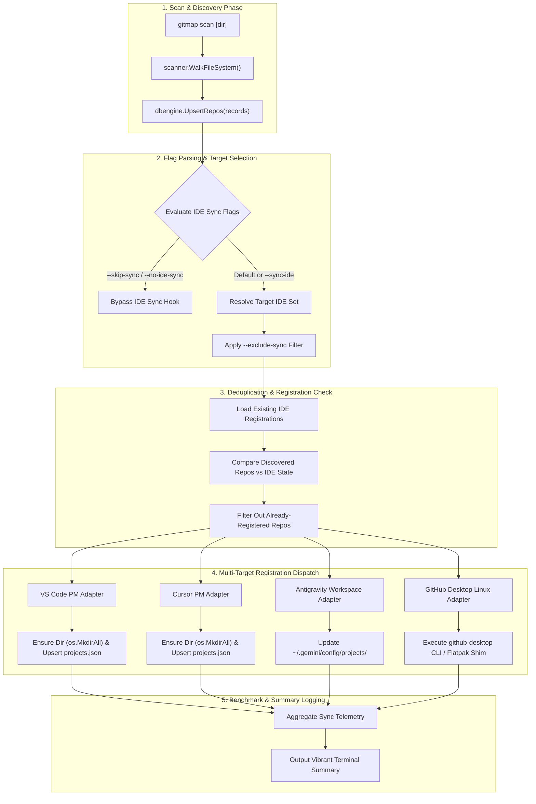

# 232.02: Component & CLI Specification — Ubuntu IDE & GitHub Desktop Scan Synchronization

**Spec ID:** 232.02  
**Status:** Approved  
**Version:** 6.497.0  
**Updated:** 2026-10-06  
**Parent Plan:** [00-master-audit-ledger.md](00-master-audit-ledger.md)  
**Subsystems:** `cli/cmdscan/`, `cli/cmdide/`, `cli/vscodepm/`, `cli/desktop/`, `cli/scanner/`  
**Target Environments:** Ubuntu Linux (Primary), macOS, Windows  

---

## 1. Executive Summary & Problem Scope

### 1.1 Context
The `gitmap scan` command discovers local Git repositories across user directory trees, populates the SQLite storage database (`gitmap.db`), and optionally links projects with development environments. On Ubuntu Linux workstations and headless developer nodes, three critical functional gaps prevent automatic synchronization:

1. **Missing Multi-IDE Post-Scan Registration:** While `gitmap scan` historically contained basic hooks for VS Code (`syncRecordsToVSCodePM`) and Windows GitHub Desktop (`addToDesktop`), it lacks unified multi-target dispatch across Ubuntu developer environments including **VS Code**, **Cursor**, **Antigravity**, and **GitHub Desktop (Linux deb/flatpak)**.
2. **Missing Deduplication & Registration Verification:** Existing scans blindly re-attempt registration or trigger repetitive writes. The system must verify whether existing cloned repositories are already registered within each IDE before issuing writes, ensuring zero duplicate entries and no unnecessary disk writes.
3. **`cli/vscodepm/path.go` Auto-Mkdir Defect & Missing Cursor Fallback:** 
   - `cli/vscodepm/path.go` returns `ErrExtensionMissing` if the target storage directory `projects.json` resides in does not exist on disk. When extensions are freshly installed or uninitialized, this causes silent registration failure instead of safely creating parent directories (`os.MkdirAll`).
   - On Linux systems where Cursor is the developer's primary IDE (`~/.config/Cursor`), the path resolver only searches for `~/.config/Code`, failing to discover Cursor user-data roots.
4. **Missing GitHub Desktop Linux CLI Resolution:** `cli/desktop/resolve.go` contains candidates for Windows and macOS, but lacks Ubuntu Linux candidates (e.g., `github-desktop`, Flatpak exports, or `/usr/bin/github-desktop`).
5. **Lack of Granular User Skip/Sync CLI Flags:** Users cannot currently control which IDEs participate in post-scan synchronization. The CLI requires `--sync-ide [targets]`, `--skip-sync` / `--no-ide-sync`, and `--exclude-sync <targets>` flags with deterministic precedence.

---

## 2. System Architecture & Component Interaction

### 2.1 Post-Scan IDE Synchronization Pipeline

The following diagram illustrates the post-scan synchronization sequence, highlighting deduplication checks, auto-mkdir directory creation, and multi-target dispatch.



---

## 3. Subsystem Specifications

### 3.1 Task-04: `gitmap scan` Integration & Registration Deduplication

#### 3.1.1 Pre-Registration Deduplication Check
Before appending or updating repository entries in any IDE target, GitMap must verify if the repository path is already tracked:

- **VS Code & Cursor Project Manager (`projects.json`):**
  - Read `projects.json` into memory (`[]vscodepm.Pair`).
  - Normalize existing repository root paths using `canonicalizePMPath(p.RootPath)`.
  - Perform `O(1)` map lookup for each discovered scan repository path.
  - Repositories whose canonical path matches an existing entry are marked as `AlreadyRegistered` and skipped from insertion.
  - Tags are merged non-destructively: if existing tags exist, preserved tags take precedence; new tags are appended without duplicates.
- **Antigravity Workspaces (`~/.gemini/config/projects/` & `~/.gemini/antigravity`):**
  - Read workspace catalog index.
  - Skip registration if workspace path is already tracked.
- **GitHub Desktop (Linux & Cross-Platform):**
  - On Ubuntu Linux, probe local configuration databases or invoke the CLI helper.
  - If a repository is already tracked in GitHub Desktop state, bypass redundant registration calls.

#### 3.1.2 Fixing `cli/vscodepm/path.go` Auto-Mkdir Defect
Currently, `cli/vscodepm/path.go` checks:
```go
if !dirExists(extDir) {
    return filepath.Join(extDir, constants.VSCodePMProjectsFile), ErrExtensionMissing
}
```
**Remediation:**
1. Introduce safe auto-mkdir helper:
```go
func EnsureProjectsJSONDir(extDir string) error {
    if extDir == "" {
        return ErrUserDataMissing
    }
    if !dirExists(extDir) {
        return os.MkdirAll(extDir, 0755)
    }
    return nil
}
```
2. In `ProjectsJSONPath()`, when `extDir` is missing, attempt directory creation via `EnsureProjectsJSONDir(extDir)`. If creation succeeds, return the valid file path instead of returning `ErrExtensionMissing`.
3. Provide positive boolean configuration `isAutoCreateEnabled` (default: `true`) to allow headless testing modes to govern directory creation behavior.

#### 3.1.3 Cursor User-Data Fallback on Ubuntu Linux
Currently, `linuxUserDataCandidate()` only checks for `Code`:
```go
func linuxUserDataCandidate() string {
    if xdg := os.Getenv(constants.VSCodeEnvXDGConfigHome); xdg != "" {
        return filepath.Join(xdg, constants.VSCodeUserDataRootDirName)
    }
    if home := os.Getenv(constants.VSCodeEnvHome); home != "" {
        return filepath.Join(home, filepath.FromSlash(constants.VSCodeUserDataLinuxFallback))
    }
    return ""
}
```
**Remediation:**
1. Introduce multi-IDE root resolution in `cli/vscodepm/path.go`:
   - `VSCodeUserDataRoot()`: Resolves `~/.config/Code` (or `$XDG_CONFIG_HOME/Code`).
   - `CursorUserDataRoot()`: Resolves `~/.config/Cursor` (or `$XDG_CONFIG_HOME/Cursor`).
   - `ResolveTargetUserDataRoot(ideType IDEType)`: Dynamically selects the appropriate path based on requested target.
2. If VS Code directory is not found on disk, probe Cursor as an automatic fallback.
3. If both exist, allow concurrent synchronization into both VS Code and Cursor project registries.

#### 3.1.4 GitHub Desktop Ubuntu Linux Shim Resolution
Expand `cli/desktop/resolve.go` to include Linux executable candidates:
```go
func linuxCandidates() []string {
    home := os.Getenv("HOME")
    return []string{
        "/usr/bin/github-desktop",
        "/usr/local/bin/github-desktop",
        "/opt/GitHub Desktop/github-desktop",
        filepath.Join(home, ".local/bin/github-desktop"),
        "/var/lib/flatpak/exports/bin/io.github.shifteightnine85.github-desktop",
        filepath.Join(home, ".local/share/flatpak/exports/bin/io.github.shifteightnine85.github-desktop"),
    }
}
```
Update `knownInstallCandidates()` to route `runtime.GOOS == "linux"` to `linuxCandidates()`.

---

### 3.2 Task-05: User Skip and Sync Flags

The `gitmap scan` CLI interface must support explicit operator governance over IDE synchronization through clean, positive boolean data structures.

#### 3.2.1 CLI Flags Schema

| Flag | Argument | Default | Positive Boolean / Meaning |
| :--- | :--- | :--- | :--- |
| `--sync-ide` | `[targets]` (optional) | `all` | `isSyncEnabled = true`. Enables synchronization to all or specified comma-separated targets (`vscode`, `cursor`, `antigravity`, `desktop`). |
| `--skip-sync` | none | `false` | `isSkipSync = true`. Skips all IDE synchronization hooks during scan. |
| `--no-ide-sync` | none | `false` | Alias for `--skip-sync`. Sets `isSkipSync = true`. |
| `--exclude-sync` | `<targets>` (required) | none | Sets `excludedTargets`. Comma-separated list of IDE targets to exclude from synchronization. |
| `--no-vscode-sync` | none | `false` | Legacy backward-compatibility flag. Excludes `vscode` target. |
| `--gh-desktop` | none | `false` | Legacy backward-compatibility flag. Explicitly includes `desktop` target. |

#### 3.2.2 Positive Boolean State Model

All internal state representation must avoid negative naming conventions. The following Go struct defines the configuration model:

```go
package cmdide

type IDESyncOptions struct {
    IsSyncEnabled        bool     // True when IDE sync should run
    IsVSCodeEnabled      bool     // True when VS Code target is active
    IsCursorEnabled      bool     // True when Cursor target is active
    IsAntigravityEnabled bool     // True when Antigravity target is active
    IsDesktopEnabled     bool     // True when GitHub Desktop target is active
    SelectedTargets      []string // Explicit targets requested
    ExcludedTargets      []string // Explicit targets excluded
}
```

#### 3.2.3 Flag Precedence & Resolution Rules

1. **Rule 1 (Absolute Skip):** If `--skip-sync` or `--no-ide-sync` is passed, `IsSyncEnabled` resolves to `false`. All IDE synchronization is immediately bypassed.
2. **Rule 2 (Default Behavior):** If no sync flags are passed, default behavior evaluates available installed IDEs and syncs active environments with soft-fail tolerance.
3. **Rule 3 (Explicit Targets):** If `--sync-ide` is passed with arguments (e.g., `--sync-ide vscode,cursor`), only specified targets are marked active.
4. **Rule 4 (Exclusions):** If `--exclude-sync` is passed (e.g., `--exclude-sync desktop`), the specified targets are subtracted from the active target set.
5. **Rule 5 (Legacy Compatibility):**
   - `--no-vscode-sync` sets `IsVSCodeEnabled = false`.
   - `--gh-desktop` sets `IsDesktopEnabled = true`.

---

### 3.3 Task-06: Verification & Release Ceremony

#### 3.3.1 Targeted Unit Testing Suite
Unit tests must verify functionality without mutating user systems or running actual GUI processes:

| Package | Test File | Target Functionality |
| :--- | :--- | :--- |
| `cli/vscodepm/` | `path_automkdir_test.go` | Verifies `EnsureProjectsJSONDir` creates missing directories with `0755` permissions. |
| `cli/vscodepm/` | `cursor_fallback_test.go` | Verifies Cursor candidate resolution on Linux when VS Code directory is absent. |
| `cli/desktop/` | `resolve_linux_test.go` | Verifies Linux executable and Flatpak candidate resolution in priority order. |
| `cli/cmdide/` | `dedup_check_test.go` | Verifies already-registered repositories are detected and skipped without disk modification. |
| `cli/cmdscan/` | `scan_ide_flags_test.go` | Verifies `--sync-ide`, `--skip-sync`, and `--exclude-sync` parsing and precedence resolution. |

#### 3.3.2 Release Ceremony Specification (v6.497.0)
Upon successful verification of Tasks 04 and 05, the release ceremony applies the following synchronized metadata updates:

1. **`version.json`:**
   - Update `"Version": "6.497.0"`
   - Update `"version": "6.497.0"`
   - Update `"releaseDate"` to current date.
2. **`package.json`:**
   - Update `"version": "6.497.0"`
3. **`readme.md`:**
   - Update release badge to `v6.497.0`
   - Document new IDE sync flags in the CLI options table.
4. **Manifest Synchronization:**
   - Verify consistency across all repository metadata files.

---

## 4. Error Management & Soft-Fail Policy

1. **Non-Blocking Execution:** Failure to synchronize with an IDE target (e.g., IDE not installed, locked configuration file, permission denied) must **never** fail the overall `gitmap scan` command.
2. **Diagnostic Logging:** Errors encountered during IDE synchronization must be captured and logged as informational diagnostic lines in scan output:
   ```text
   ℹ IDE Sync: VS Code Project Manager updated (3 added, 14 already registered)
   ℹ IDE Sync: Cursor Project Manager updated (3 added, 14 already registered)
   ⚠ IDE Sync: GitHub Desktop CLI not found (skipping desktop sync)
   ```
3. **Safe File Handling:** Writes to `projects.json` and configuration files must use atomic write patterns (write to temporary file, then atomic rename) to prevent file corruption in case of unexpected termination.

---

## 5. Traceability Matrix

| Requirement | Task ID | Target Implementation Files | Test Verification |
| :--- | :--- | :--- | :--- |
| Pre-registration dedup check | Task-04 | `cli/cmdide/dedup.go`, `cli/cmdscan/scan.go` | `cli/cmdide/dedup_check_test.go` |
| Auto-mkdir in `vscodepm/path.go` | Task-04 | `cli/vscodepm/path.go` | `cli/vscodepm/path_automkdir_test.go` |
| Cursor Linux fallback | Task-04 | `cli/vscodepm/path.go` | `cli/vscodepm/cursor_fallback_test.go` |
| GitHub Desktop Linux resolution | Task-04 | `cli/desktop/resolve.go` | `cli/desktop/resolve_linux_test.go` |
| User sync/skip flags | Task-05 | `cli/cmdscan/scanresolve.go`, `cli/cmdscan/scan.go` | `cli/cmdscan/scan_ide_flags_test.go` |
| Targeted tests & release v6.497.0 | Task-06 | `version.json`, `package.json`, `readme.md` | `npm run test` / `go test ./cli/...` |
