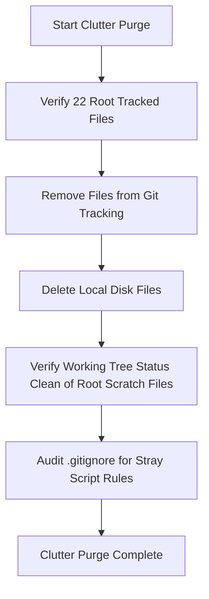
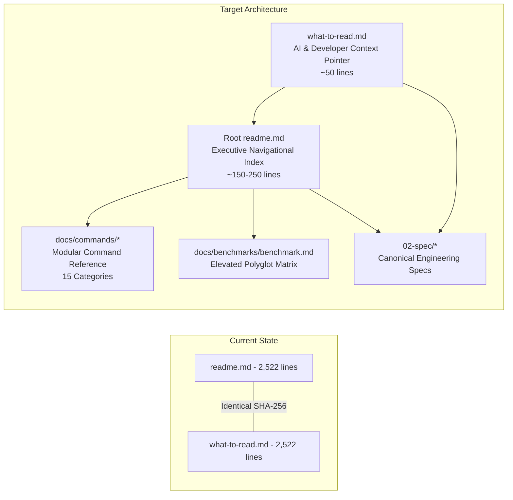
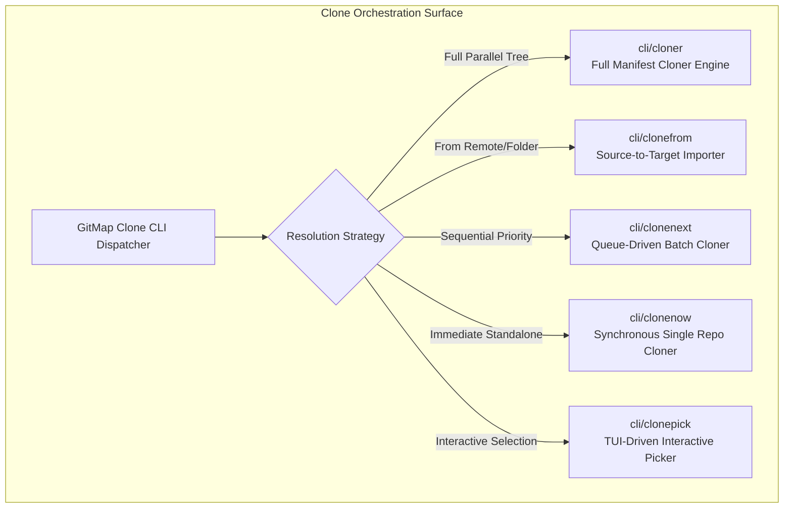

# Architecture Specification: Codebase Review Remediation & Consolidation

> **Document ID:** `APP-SPEC-234-01`  
> **Plan Slug:** `234-codebase-review-remediation-and-consolidation`  
> **Specification Path:** `02-spec/21-app/234-codebase-review-remediation-and-consolidation/01-architecture-spec.md`  
> **Master Ledger:** [00-master-audit-ledger.md](00-master-audit-ledger.md)  
> **Target Version:** `v6.497.0` (Preserved — zero unauthorized version churn)  
> **Status:** `APPROVED`  
> **Created Date:** `2026-10-06`  
> **Author:** MD ALIM UL KARIM / Multi-Agent Spec Engine  

---

## 1. Executive Summary & Review Ingestion

An external structural review authored by News Spark was cataloged in `docs/review/honest-feedback.md` and `docs/review/action-checklist.md`. The review examined the repository structure, codebase metrics (~3,900 Go files, 100+ CLI packages, 365 help files, ~70 docs site pages), versioning history, documentation state, and committed artifacts.

While several observations regarding repository hygiene, root directory clutter, documentation duplication, and `version.json` identity drift are accurate and actionable, the review also recommended dismantling essential engineering practices—such as diluting positive boolean standards, weakening strict 8-to-15 line function decomposition, relaxing file size caps, and collapsing distinct clone subsystems into monolithic single files.

Per explicit user mandate, this specification establishes the canonical engineering response: **adopt all valid hygiene, documentation, identity, and error-handling improvements while strictly rejecting any relaxation of modularity, function sizing, positive booleans, or architectural separation.**

---

## 2. Review Ingestion & Disposition Matrix

The table below catalogs every finding from `docs/review/honest-feedback.md` and `docs/review/action-checklist.md`, designating whether it is accepted for remediation or rejected per project governance.

| Item ID | Review Finding / Proposal | Disposition | Architectural Rationale & Concrete Action |
| :--- | :--- | :--- | :--- |
| **REV-01** | Consolidate byte-identical `readme.md` / `what-to-read.md` pair (2,522 lines each) into one canonical file | **AGREED** | Maintain single canonical source. Root `readme.md` is converted into an executive index linking to modular documentation in `docs/commands/` and `02-spec/`. `what-to-read.md` is reduced to an agent reading guide. |
| **REV-02** | Correct `version.json` identity (Title/RepoSlug: "Coding Guidelines" / `coding-guidelines-v24` -> GitMap) | **AGREED** | Update `version.json` to reflect GitMap repository identity (`Title`: "GitMap", `RepoSlug`: "gitmap-v28", `RepoUrl`: "https://github.com/alimtvnetwork/gitmap-v28", `name`: "gitmap") while preserving author attribution and coding guidelines spec entries. |
| **REV-03** | Remove committed `cli/rsrc_windows_*.syso` and `cli/cli.exe` binaries; enforce via `.gitignore` | **AGREED** | Untrack compiled `.syso` binaries from git, add `*.syso` to `.gitignore`, and verify zero `.exe` binaries exist across tracked files. Build artifacts belong in release workflows. |
| **REV-04** | Purge root clutter: 16 `fix_*.py` scripts, 2 `update_runner*.py`, 3 `audit_results_*.csv`, `user_prompt_full.txt`, and misplaced `gitignore` | **AGREED** | Delete exactly 22 tracked root clutter files from git tracking and the working tree. |
| **REV-05** | Elevate `benchmark.md` to `docs/benchmarks/benchmark.md` and link from root `readme.md` | **AGREED** | Preserve benchmark data by elevating `benchmark.md` into `docs/benchmarks/benchmark.md` and adding cross-references in root `readme.md`. |
| **REV-06** | Standardize error exits on `apperror` + `cliexit` wrappers instead of bare `os.Exit` or ad-hoc errors | **AGREED** | Ensure CLI command paths consistently route through `apperror.AppError` and `cliexit.Exit` for uniform exit codes and error envelopes. |
| **REV-07** | Non-destructive audit of `repo-secrets/` and security token purge verification | **AGREED** | Audit `repo-secrets/` non-destructively without deleting keys unless confirmed. Verify OAuth tokens and refresh tokens remain completely purged across repositories and caches. |
| **REV-08** | Eliminate hardcoded absolute paths and `D:\work` references | **AGREED** | Enforce strictly relative git paths across all specifications, docs, and review artifacts. Purge any absolute Windows paths. |
| **REV-09** | Revisit positive booleans (banning negation / double negatives) | **REJECTED** | **Preserved per user mandate.** Positive boolean prefixes (`Has*`, `Is*`, `Can*`, `Should*`) and the ban on double negatives prevent logic errors and optimize machine checkability. |
| **REV-10** | Relax 8-to-15 line function limit and file size caps (100–200 lines) | **REJECTED** | **Preserved per user mandate.** Small, single-purpose functions enable autonomous AI reasoning, prevent context window overflow, and simplify unit testing. |
| **REV-11** | Collapse clone packages (`cloner`, `clonefrom`, `clonenext`, `clonenow`, `clonepick`) into a single file | **REJECTED** | **Preserved per user mandate.** Monolithic single-file collapse is rejected. The clone packages represent distinct execution strategies and remain modularly structured behind a clear architectural strategy map. |
| **REV-12** | Alter versioning scheme or bump version on every commit indiscriminately | **REJECTED** | **Preserved per user mandate.** Version changes are reserved for major feature deliveries. Version remains `v6.497.0` without artificial bump churn during this remediation. |
| **REV-13** | Remove `docs/review/` once actionable items are resolved; synthesize objective AI counter-review | **AGREED** | Complete all actionable remediation tasks, delete `docs/review/`, and document an objective AI counter-review in the master ledger and completion summary. |

---

## 3. Root Clutter Purge Architecture

### 3.1 Inventory of 22 Tracked Clutter Files

The root directory accumulated 22 tracked temporary scripts, audit spreadsheets, and prompt dumps from past remediation workflows. These files degrade repository hygiene and must be removed from git tracking and deleted from disk.

| Category | File Path | File Size | Original Purpose | Disposal Strategy |
| :--- | :--- | :--- | :--- | :--- |
| **Scratch Script** | `fix_agy_conv_ls.py` | 623 B | Antigravity conversation listing hotfix | Purge & delete from tree |
| **Scratch Script** | `fix_agy_ls.py` | 1,127 B | Antigravity listing hotfix | Purge & delete from tree |
| **Scratch Script** | `fix_agy_most_conv.py` | 661 B | Antigravity conversation count patch | Purge & delete from tree |
| **Scratch Script** | `fix_cd_alias.py` | 357 B | Shell `cd` command alias hotfix | Purge & delete from tree |
| **Scratch Script** | `fix_cg_path.py` | 1,030 B | Coding guideline path normalizer | Purge & delete from tree |
| **Scratch Script** | `fix_common_sync.py` | 774 B | Common synchronization hotfix | Purge & delete from tree |
| **Scratch Script** | `fix_cr_alias.py` | 361 B | Command runner alias hotfix | Purge & delete from tree |
| **Scratch Script** | `fix_cr_rootcore.py` | 303 B | Root core command runner hotfix | Purge & delete from tree |
| **Scratch Script** | `fix_go_compile.py` | 1,426 B | Go compilation flag hotfix | Purge & delete from tree |
| **Scratch Script** | `fix_ip_aliases.py` | 1,192 B | IP alias resolution patch | Purge & delete from tree |
| **Scratch Script** | `fix_ip_conflict.py` | 254 B | IP conflict resolution patch | Purge & delete from tree |
| **Scratch Script** | `fix_most_conv.py` | 308 B | Conversation ranking hotfix | Purge & delete from tree |
| **Scratch Script** | `fix_repo_create_init.py` | 2,390 B | Repository initialization patch 1 | Purge & delete from tree |
| **Scratch Script** | `fix_repo_create_init2.py` | 1,819 B | Repository initialization patch 2 | Purge & delete from tree |
| **Scratch Script** | `fix_watch.py` | 887 B | Watch command trigger patch | Purge & delete from tree |
| **Scratch Script** | `fix_words_flag.py` | 952 B | Word flag parser patch | Purge & delete from tree |
| **Runner Update** | `update_runner.py` | 2,978 B | Legacy runner update script 1 | Purge & delete from tree |
| **Runner Update** | `update_runner2.py` | 2,223 B | Legacy runner update script 2 | Purge & delete from tree |
| **Audit CSV** | `audit_results_extra.csv` | 765 KB | Intermediate audit dump | Purge & delete from tree |
| **Audit CSV** | `audit_results_go.csv` | 403 KB | Intermediate Go audit dump | Purge & delete from tree |
| **Audit CSV** | `audit_results_ts.csv` | 1.4 KB | Intermediate TS audit dump | Purge & delete from tree |
| **Prompt Dump** | `user_prompt_full.txt` | 5.3 KB | Stale user prompt copy | Purge & delete from tree |
| **Misplaced File** | `gitignore` | 2.6 KB | Unprefixed non-dot copy of `.gitignore` | Purge & delete from tree |

### 3.2 Purge Execution Protocol



1. **Safety Verification:** Confirm that none of the 16 `fix_*.py` or 2 `update_runner*.py` scripts are invoked by `Makefile`, `run.ps1`, `run.sh`, `install.ps1`, or active CI workflows.
2. **Untrack & Delete:** Remove all 22 tracked files from git staging and the filesystem.
3. **Clean Status:** Confirm that `audit_results_*.csv`, `user_prompt_full.txt`, and `gitignore` are no longer tracked.

---

## 4. Binary Hygiene Architecture & Git History Audit

### 4.1 Windows Resource Binaries (`cli/*.syso`)

The repository currently tracks two compiled COFF Windows resource files in `cli/`:
- `cli/rsrc_windows_386.syso` (20,450 bytes)
- `cli/rsrc_windows_amd64.syso` (20,450 bytes)

These files embed Windows executable metadata (icons, version manifests) during Go build on Windows targets. Because `.syso` files are binary compilation artifacts, they must not be tracked in source control.

### 4.2 `.gitignore` Rule Hardening

Add `*.syso` to the binary artifacts block of `.gitignore` under `# Generated code, artifacts, test data, and binaries (NEVER COMMIT)`:

```gitignore
# Generated code, artifacts, test data, and binaries (NEVER COMMIT)
*.generated.*
*_generated.*
!linters-cicd/codegen/fixtures/expected/*.generated.*
coverage/
test-results/
test-reports/
*.test-report.*
*.exe
*.dll
*.so
*.dylib
*.out
*.syso
build/
bin/
obj/
*.class
```

### 4.3 Git History Verification

1. **Untrack `.syso`:** Remove `cli/rsrc_windows_386.syso` and `cli/rsrc_windows_amd64.syso` from git tracking while leaving build systems capable of generating them dynamically when compiling Windows binaries via `rsrc` or `go generate`.
2. **Binary Scan:** Confirm zero `.exe` binaries are tracked in the current git tree.

---

## 5. Version Identity & Metadata Architecture

### 5.1 Root Cause Analysis: Metadata Drift

The repository `version.json` file was cloned or synchronized from `coding-guidelines-v24`, leaving stale header values (`Title`: "Coding Guidelines", `RepoSlug`: "coding-guidelines-v24", `RepoUrl`: "https://github.com/alimtvnetwork/coding-guidelines-v24", `name`: "coding-guidelines").

While this repository hosts the Coding Guidelines specifications in `02-spec/`, the repository itself is **GitMap** (`gitmap-v28`).

### 5.2 Canonical Target Configuration

Update `version.json` with the following configuration:
- `"Title"`: `"GitMap"`
- `"RepoSlug"`: `"gitmap-v28"`
- `"RepoUrl"`: `"https://github.com/alimtvnetwork/gitmap-v28"`
- `"name"`: `"gitmap"`
- `"Description"`: Preserved with full attribution to MD ALIM UL KARIM and RISEUP ASIA LLC.
- `"Authors"`: Preserved with full primary author and sponsor metadata.
- `"Version"`: `6.497.0` (preserved — no version churn).
- `"folders"`: Preserved folder specifications cataloging `01-spec-authoring-guide`, `02-coding-guidelines`, `03-error-manage`, `21-app`, etc.

```json
{
  "_purpose": "version.json is the single canonical source of truth for repository versioning, releases, metadata, and cross-repo dependencies. All tools, packages, scripts, CI/CD pipelines, manifests, and AI agents must read this file for version information.",
  "Version": "6.497.0",
  "Title": "GitMap",
  "RepoSlug": "gitmap-v28",
  "RepoUrl": "https://github.com/alimtvnetwork/gitmap-v28",
  "LastCommitSha": "fd487dd0b5eab289a3847e9f58428add7907bdb5",
  "Description": "GitMap — High-performance multi-repository discovery, manifest management, and parallel workspace cloner written by MD ALIM UL KARIM, sponsored by RISEUP ASIA LLC. Implements zero-allocation streaming search, split-database indexing, and strict AI-first engineering standards.",
  "Authors": [
    {
      "Name": "MD ALIM UL KARIM",
      "Role": "PrimaryAuthor",
      "Title": "Chief Software Engineer",
      "Company": "RISEUP ASIA LLC",
      "CompanyUrl": "https://riseup-asia.com/",
      "Urls": [
        "https://alimkarim.com/",
        "https://www.linkedin.com/in/alimkarim",
        "https://stackoverflow.com/users/513511/md-alim-ul-karim",
        "https://github.com/aukgit",
        "https://github.com/aukgit/alim.karim.profile"
      ]
    },
    {
      "Name": "RISEUP ASIA LLC",
      "Role": "Sponsor",
      "Title": "Official Sponsor & Engineering Partner",
      "Company": "RISEUP ASIA LLC",
      "CompanyUrl": "https://riseup-asia.com",
      "Urls": [
        "https://riseup-asia.com"
      ]
    }
  ],
  "backend": "inherit",
  "frontend": "inherit",
  "linters": "3.79.0",
  "name": "gitmap",
  "version": "6.497.0"
}
```

---

## 6. Documentation Architecture & Benchmark Elevation

### 6.1 Documentation Consolidation & Index Reduction

Currently, `readme.md` (2,522 lines / 169 KB) and `what-to-read.md` (2,522 lines / 169 KB) are byte-identical copies. Any edit to one file causes drift or requires duplicate commits.



1. **Root `readme.md`:** Convert into a high-authority, readable index containing:
   - GitMap value proposition & high-level architecture.
   - Quickstart commands (`gitmap scan`, `gitmap find`, `gitmap clone`).
   - Category index linking directly into `docs/commands/` (15 command domains).
   - Core specifications index linking to `02-spec/`.
   - Performance benchmarks link pointing to `docs/benchmarks/benchmark.md`.
2. **`what-to-read.md`:** Refactor into an explicit reading map for AI agents and human contributors:
   - Directs agents to `.ai-memory/overview.md`, `02-spec/`, and `version.json`.
   - Eliminates the duplicate 2,522-line payload.
3. **`benchmark.md` Elevation:**
   - Copy root `benchmark.md` to `docs/benchmarks/benchmark.md`.
   - Ensure synergy with existing `docs/benchmarks/search_benchmark.md`.
   - Remove root `benchmark.md` from the root clutter.
   - Link `docs/benchmarks/benchmark.md` from root `readme.md`.

---

## 7. Clone Package Architecture & Modularity Preservation

News Spark suggested merging `cli/cloner`, `cli/clonefrom`, `cli/clonenext`, `cli/clonenow`, and `cli/clonepick` into a single file. This suggestion violates modularity and file sizing guidelines.

The five packages serve distinct operational strategies:



1. **`cli/cloner`**: Core parallel re-clone engine consuming `gitmap.json` manifests.
2. **`cli/clonefrom`**: Clones repositories from alternative remote remotes or directory templates.
3. **`cli/clonenext`**: Stepwise queue-based cloning for rate-limited or intermittent network links.
4. **`cli/clonenow`**: Urgent single-target immediate clone without processing whole manifests.
5. **`cli/clonepick`**: Interactive terminal picker allowing developers to select subset repos via TUI.

**Architectural Decision:** Retain separate modular packages. Document their relationships and strategy dispatch in `02-component-and-cli-spec.md` and `docs/commands/` without collapsing into a single monolithic file.

---

## 8. Non-Negotiable Governance & Verification Gates

1. **Positive Booleans Gate:** Every boolean field and function across Go and Python must use positive framing (`HasValidConfig`, `IsClean`, `CanExecute`, `ShouldPurge`). Negation prefixes (`is_not`, `unclean`, `no_sync`) are strictly prohibited.
2. **Function Sizing Gate:** Go functions must remain 8-to-15 lines. Large procedural logic must be decomposed into focused private helpers.
3. **Relative Path Gate:** All documentation links and spec references must use strictly relative repository paths (e.g., `02-spec/...`, `docs/...`). No absolute Windows paths (`D:\...`) or host-specific user paths are permitted.
4. **Git Binary Cleanliness:** Verify that `.gitignore` prevents future `.syso`, `.exe`, or binary commits.
5. **No Unauthorized Version Churn:** Maintain `Version` at `6.497.0`.

---

## 9. Traceability & Implementation Subtask Mapping

This architecture specification is implemented across five focused subtasks:

- **Subtask 01 (`01-purge-root-clutter-scripts-and-binaries.md`)**: Purge the 22 root clutter scripts and audit CSVs, update `.gitignore` for `*.syso`, and untrack Windows resource binaries.
- **Subtask 02 (`02-consolidate-readme-index-and-benchmarks.md`)**: Consolidate `readme.md` / `what-to-read.md` pair into an index, elevate `benchmark.md` to `docs/benchmarks/benchmark.md`, and hyperlink from `readme.md`.
- **Subtask 03 (`03-fix-version-json-identity-and-clone-architecture-spec.md`)**: Update `version.json` with GitMap identity and author attribution; formalize clone package strategy map in component spec.
- **Subtask 04 (`04-error-exit-audit-and-security-token-verification.md`)**: Audit and standardize CLI error exits on `apperror` + `cliexit`; verify complete purge of OAuth refresh tokens.
- **Subtask 05 (`05-repo-secrets-audit-and-honest-counter-review.md`)**: Non-destructive audit of `repo-secrets/`, removal of `docs/review/`, and publication of the objective AI counter-review.
