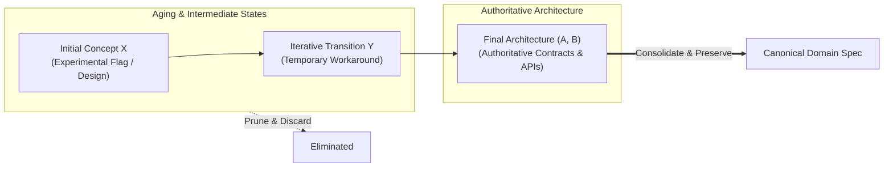
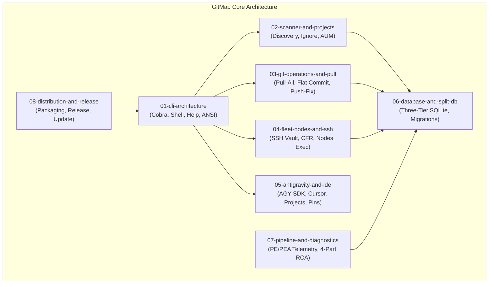
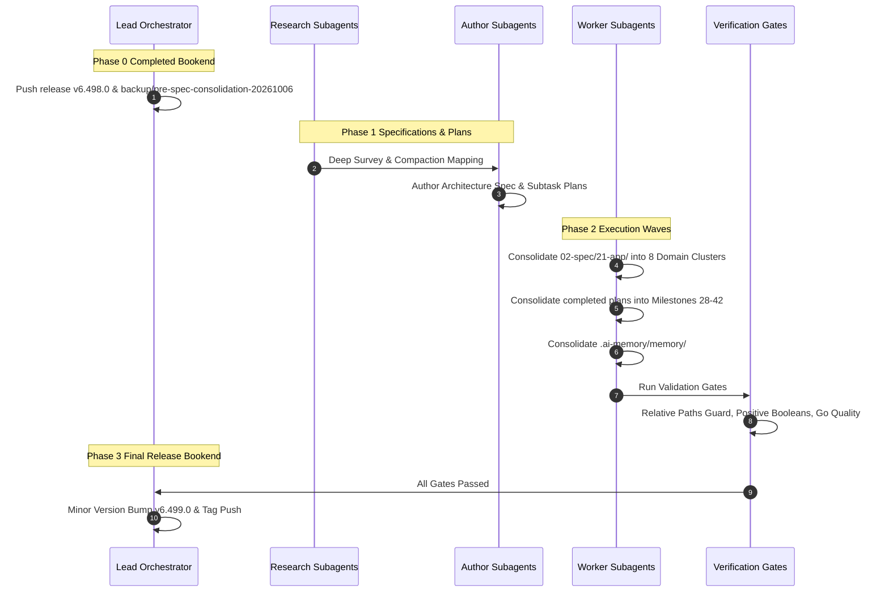

# 235: Application Specifications & Completed Plans Consolidation & Memory Reduction Architecture Specification

**Spec ID:** 235  
**Status:** Approved  
**Version:** 1.0.0  
**Updated:** 2026-10-06  
**Subsystem:** Documentation & Memory Governance  
**Dependencies:** `02-spec/21-app/`, `.ai-memory/plans/completed/`, `.ai-memory/memory/`, `.ai-memory/plans/pending/`  

---

## 1. Executive Summary & Core Intent

### 1.1 Context & Intent
Over hundreds of autonomous iterative development cycles, GitMap has accumulated substantial specification, plan, and memory artifacts. While this progressive record documents continuous feature evolution, it introduces three acute operational bottlenecks:
1. **Spec Proliferation & Redundancy:** The `02-spec/21-app/` directory has expanded to 310 filesystem items (80 subdirectories and 228 standalone Markdown files), creating navigation drag and indexing fragmentation for AI agents and human contributors alike.
2. **Intermediate Draft Noise (X, Y vs. A, B):** Multiple specifications and plans record transient design iterations (e.g., initial drafts X, Y that were later superseded or refined by final implementations A, B). Retaining intermediate exploratory states inflates token overhead and causes conversational confusion during AI context loading.
3. **Completed Plans Bloat:** The `.ai-memory/plans/completed/` directory contains 163 completed plan documents post-milestone-27, alongside associated historical subtasks, adding clutter without providing active forward utility.

The core intent of this architecture is to execute a rigorous, bounded consolidation and reduction across `02-spec/21-app/`, `.ai-memory/plans/completed/`, and `.ai-memory/memory/`. This process prunes aging, redundant, and intermediate draft descriptions while preserving 100% of final authoritative architectures, Go type contracts, error handling paradigms (`*appfault.AppError`), monadic result envelopes (`Result[T]`), and operational CLI commands.

### 1.2 Phase 0 Completed Bookend: Baseline Safety Release
To guarantee zero accidental data loss before executing extensive filesystem consolidation, Phase 0 was executed and verified:
- **Baseline Release:** Minor version bump to `v6.498.0` pushed with updated release manifests.
- **Annotated Git Tag:** Tag `v6.498.0` pushed to the remote repository.
- **Safety Backup Branch:** Remote backup branch `backup/pre-spec-consolidation-20261006` created from `v6.498.0` and pushed to remote origin.
- **Verification Proof:** Confirmed on remote origin; provides an instantaneous, immutable fallback point should rollback ever be required.

---

## 2. Core Architectural Invariants

### 2.1 The Compaction Invariant: Retain Final Version (A, B)
When consolidating specifications and plans where features evolved through multi-stage iterations:
- **Rule:** Retain solely the final authoritative version (A, B) and prune intermediate draft states (X, Y).
- **Application:** For example, where early pull optimization explored in-process mutex locking (X) and single-worker execution (Y) before settling on SQLite Split-DB advisory locking and 8-worker semaphore pools (A, B), the consolidated domain specification retains exclusively the 8-worker Split-DB architecture (A, B). Stale hypotheses, discarded interfaces, and deprecated flags are completely eliminated.

### 2.2 The Strict Pending Isolation Rule
Active engineering pipelines and pending task backlogs must remain entirely undisturbed during this consolidation:
- **`.ai-memory/plans/pending/`:** Exactly 4 plan files are designated read-only and must not be touched:
  1. `.ai-memory/plans/pending/01-ports-and-ssh-enablement.md`
  2. `.ai-memory/plans/pending/56-vmware-hardware-batch-and-macro-orchestration.md`
  3. `.ai-memory/plans/pending/67-nodes-cfr-remote-fleet-clone-enhancement.md`
  4. `.ai-memory/plans/pending/75-gitmap-u1-ubuntu-agm-fleet-integration.md`
- **Active Open Plans in `.ai-memory/plans/`:** Exactly 7 active open plan files are isolated:
  1. `214-ubuntu-fleet-automation-and-workstation-governance.md`
  2. `216-gitmap-prompting-freeze-and-suggestion-engine-fix.md`
  3. `217-antigravity-fleet-parity-theme-preset-plugins-and-delegation.md`
  4. `219-ubuntu-pull-all-remediation-omz-ignore-and-error-logging.md`
  5. `223-ubuntu-cursor-gitmap-python-git-tracing-and-aum-search.md`
  6. `225-ubuntu-cursor-start-menu-dock-position-and-profile-migration.md`
  7. `227-gitmap-cursor-fleet-delegate-settings-ui-and-cross-node-path-suggestions.md`
- **Active Open Subtask Folders:** Exactly 10 active subtask directories comprising 52 files under `.ai-memory/plans/subtasks/` must not be touched or modified.
- **Safety Invariant:** All consolidation actions filter targets through strict exclusion gates verifying `isPendingIsolated: true`.

---

## 3. The 8 Canonical Domain Clusters for `02-spec/21-app/`

All 310 items currently residing within `02-spec/21-app/` are organized and consolidated into 8 canonical, authoritative domain clusters. Each cluster serves as the single source of truth for its functional subsystem:

| Cluster Directory | Domain Scope | Key Subsystems & Authority |
| :--- | :--- | :--- |
| **`01-cli-architecture/`** | CLI Engine & Shell UX | Cobra command hierarchy, help text formatting, ANSI tables, middle-ellipsized columns, typo suggestions, Win32 console code page handoff, flag parsing, autocomplete scripts. |
| **`02-scanner-and-projects/`** | Repository Scanner & Projects | High-speed filesystem discovery, `.gitmapignore` engine, AUM indexing, project formatters (JSON, CSV, Markdown, ANSI), ignore rule hierarchies, deduplication. |
| **`03-git-operations-and-pull/`** | Git Engine & Synchronization | Pull-all (`pa`/`pat`), auto fast-forward merge, multi-worker concurrency pools, semantic flat commit (`gitmap c`), auto-staging, push-fix recovery, stash collision handling, failure tree styling. |
| **`04-fleet-nodes-and-ssh/`** | Fleet Nodes, SSH & Cluster | SSH password interception, RSA-OAEP salt credential vault, multi-target remote exec (`gitmap sj`, `nodes`), CFR/CFRP manifest distribution, node OS profiling, cross-OS port & firewall lifecycle. |
| **`05-antigravity-and-ide/`** | AI Agents & IDE Integration | Google Antigravity SDK workflows, multi-conversation prompts, project pins & recency, Cursor IDE workstation migration, IDE theme presets, SUID sandbox hardening, remote agent dispatch. |
| **`06-database-and-split-db/`** | Split SQLite Database Engine | Three-tier database architecture (`gitmap.db`, `installation.db`, `repodb/pipeline.db`), WAL mode, `SetMaxOpenConns(1)` deadlock prevention, schema migrations, PascalCase tables, camelCase columns. |
| **`07-pipeline-and-diagnostics/`** | CI/CD Diagnostics & Telemetry | Pipeline execution telemetry (`pe`/`pea`), compact log parser, 4-part RCA engine, dynamic ETA prediction, unit test traceback extraction, health heatmaps. |
| **`08-distribution-and-release/`** | Packaging, Installers & Release | SemVer release ceremony, cross-platform runners (`run.ps1`/`run.sh`), NSIS Windows installers, Linux archive packages, remote `gitmap update-all` binary propagation, self-healing deployments. |

### 3.1 Domain Cluster Architectural Contracts

---

## 4. The 15 Milestone Clusters for `.ai-memory/plans/completed/`

Completed plans from Milestone 01 through Milestone 27 were previously consolidated into canonical milestone records. The remaining 163 completed plan files (covering milestones 28 through 234) are clustered into **15 Milestone Clusters (Milestones 28 to 42)**:

| Milestone Cluster | Consolidated Document | Source Plans Merged (Count: 163) | Primary Architectural Themes |
| :--- | :--- | :--- | :--- |
| **Milestone 28** | `28-antigravity-ide-prompts-and-protocols.md` | `28`, `41`, `42`, `54`, `56`, `77`, `79`, `80`, `83`, `xx-agy-enhancements` (10 plans) | Google Antigravity IDE first integration, prompt templates, multi-conversation ping, queue protocol, cache clearing, prompt table renaming. |
| **Milestone 29** | `29-ssh-remote-exec-auth-and-join.md` | `30`, `39`, `43`, `48`, `66`, `81`, `89`, `91`, `97` (9 plans) | SSH remote execution (`copy`, `mv`, `rm`), Windows authkey join automation, port 22 known_hosts resolution, terminal UI node management, undo history. |
| **Milestone 30** | `30-pipeline-telemetry-eta-and-remediation.md` | `31`, `32`, `45`, `46`, `84`, `88`, `90`, `162` (8 plans) | CI/CD pipeline telemetry, forward-slash clear paths, deep ETA prediction, live error streaming, error deduplication, stage timings, queue inspection. |
| **Milestone 31** | `31-aum-engine-lazy-regex-and-training.md` | `33`, `34`, `35`, `36`, `37`, `38` (6 plans) | AI scripts engine, scaffolding generator, lazy regex compilation, AUM polyglot script migration, helptext parity, chained LLM train curriculum suite. |
| **Milestone 32** | `32-macro-fleet-automation-and-streaming.md` | `40`, `54`, `89`, `98`, `192` (5 plans) | Macro fleet export-import, streaming runner, idempotent editor UX, PEA fleet deploy, version-pinned macro UI settings. |
| **Milestone 33** | `33-split-db-transactions-and-cache.md` | `42`, `44`, `49`, `50`, `62`, `78`, `85` (7 plans) | PR commit engines, SQLite Split-DB architecture, task DB partitioning, branch compare, DevTools dynamic discovery tree, relative DB paths. |
| **Milestone 34** | `34-os-profiling-linutil-and-governance.md` | `51`, `52`, `53`, `57`, `76`, `81`, `82`, `104`, `105`, `108` (10 plans) | OS auto-login, Winutil/Linutil advanced tweaks, CI/CD interface naming, lowercase file renamer, first-login OS profiling, SQLite OS persistence. |
| **Milestone 35** | `35-vmware-cluster-automation-and-hardware.md` | `72`, `73`, `74`, `86`, `87` (5 plans) | VMware CLI commands, VM lifecycle operations, hardware batch customization, CPU/RAM hotplug tuning, automated PowerShell scripts. |
| **Milestone 36** | `36-gitmap-pull-optimization-and-cache.md` | `58`, `60`, `61`, `64`, `66`, `70`, `71`, `72`, `164`, `166`, `169`, `197` (12 plans) | PAS formula engine, ignore grouping, CPAR suite, Split-DB repo cache, duplicate repo deduplication, fast mode templates DB, concise summary filtering. |
| **Milestone 37** | `37-semantic-flat-commit-and-non-git-rca.md` | `63`, `65`, `80`, `165`, `168` (5 plans) | Semantic flat commit command (`gitmap c`), auto-staging, non-git repo execution RCA, push-fix recovery, array async pool UI. |
| **Milestone 38** | `38-ssh-password-interception-and-rsa-vault.md` | `67`, `68`, `76`, `78`, `163`, `198`, `199` (7 plans) | Masked terminal password prompt, user RSA consent, RSA-OAEP with SHA-256 reversible encryption, deploy keys, JSON envelope variables, OS password CLI. |
| **Milestone 39** | `39-ai-agent-task-orchestrator-and-web-ui.md` | `79`, `112`, `174`, `184`, `185`, `186`, `202` (7 plans) | AI Agent Task Orchestrator, 3-tier multi-agent SQLite hierarchy, `gitmap agent` CLI, decision log DB, active rerun recency, AGY prompt manager Web UI. |
| **Milestone 40** | `40-fleet-nodes-cfr-manifests-and-delegation.md` | `55`, `57`, `69`, `94`, `98`, `99`, `195`, `196`, `200`, `201`, `218`, `228` (12 plans) | Fleet nodes clone (except-self), CFR/CFRP manifest staging, machine ping, async delegation, AGM accounts deployment, remote Cursor automation. |
| **Milestone 41** | `41-remote-deploy-streaming-and-auto-update.md` | `100`, `101`, `106`, `109`, `110`, `111`, `171`, `172`, `173`, `177`, `178`, `179`, `180`, `184`, `188`, `189`, `194` (17 plans) | Remote executable copy, SemVer verification, streaming upload, NSIS installer payload detection, hermetic test isolation, fleet auto-update guard, smart deploy. |
| **Milestone 42** | `42-workstation-parity-and-codebase-consolidation.md` | `215`, `216`, `217`, `220`, `221`, `222`, `223`, `224`, `228`, `229`, `230`, `230-token`, `231`, `232`, `233`, `234` (16 plans) | Ubuntu fleet filesystem hygiene, terminal input freeze fix, AGY fleet parity (themes, permissions, plugins), Cursor IDE migration, repo-secrets restore, codebase review remediation. |

---

## 5. Memory Consolidation Architecture (`.ai-memory/memory/`)

The `.ai-memory/memory/` directory contains active memory documents, session summaries, and legacy records. The consolidation strategy aligns these files into structured domains:
1. **Retain Authoritative Long-Term Principles:** Retain `constraints/`, `avoid/`, `learned/`, `project/`, and `style/` subdirectories as canonical guidance.
2. **Prune Intermediate Session Artifacts:** Merge legacy turn-by-turn logs (e.g. `02-v15-legacy-compat-audit.md`, `03-v3.12.1-session.md`, `ssh-public-key-display-and-clipboard.md`) into consolidated domain references under `.ai-memory/memory/learned/`.
3. **Consolidate Indices:** Update `.ai-memory/memory/readme.md` and `index.md` to reflect the streamlined architecture.

---

## 6. End-to-End Compaction Workflow & Verification Gates

### 6.1 Non-Negotiable Quality Gates
1. **Zero Git Commands Invariant:** Spec authoring subagents must never execute git commands directly. All git operations remain bounded to designated orchestrator workflows.
2. **Strictly Relative Paths:** Every filesystem path referenced across specs and plans must use repository-relative format (e.g. `02-spec/21-app/...`, `.ai-memory/plans/...`, `cmd/...`). Absolute paths are strictly forbidden.
3. **Positive Boolean Naming:** All status flags and configuration parameters must use positive affirmative naming (`isVerified`, `isEnabled`, `hasValidStructure`), completely avoiding double negatives or anti-patterns.
4. **US English Spelling:** All documentation strictly adheres to standard US English conventions.
5. **Phase 3 Final Release Bookend:** Following verified compaction, the orchestrator will execute a clean release bump to `v6.499.0`, pushing annotated tags and release branches.
