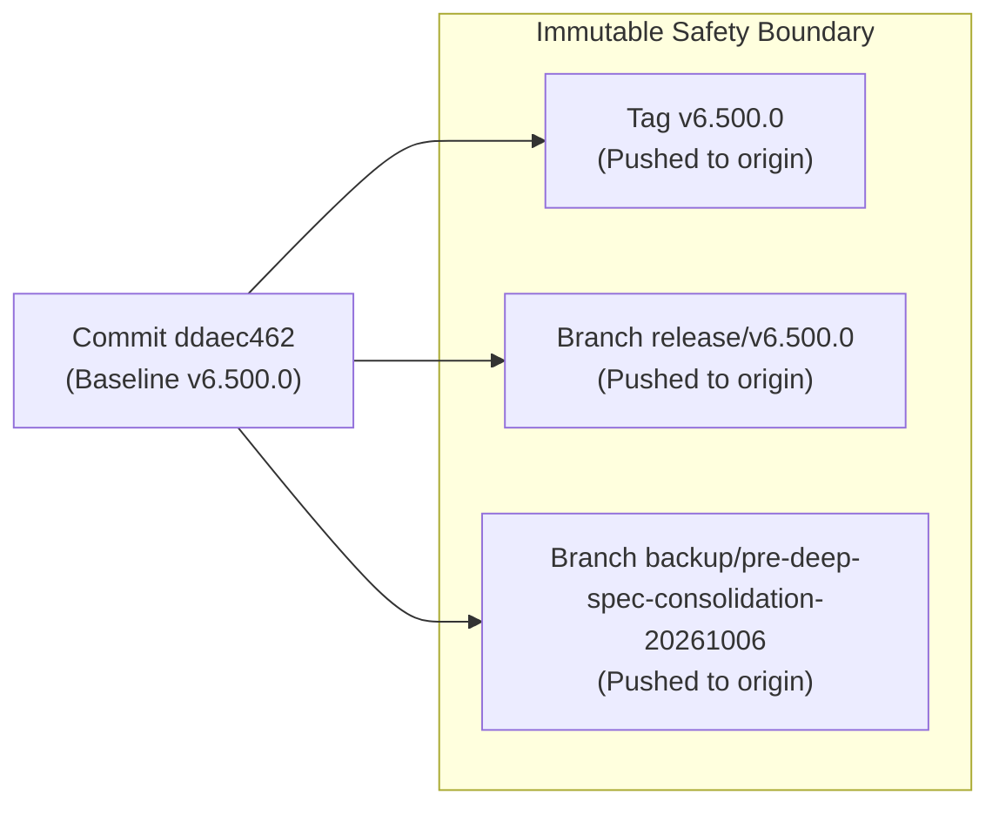
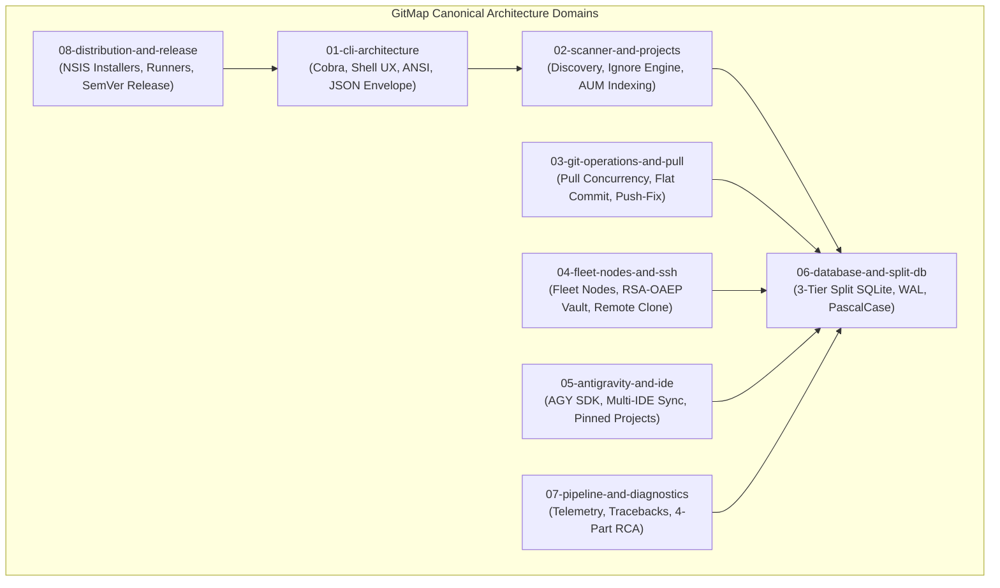

# 236: Deep Application Specifications Consolidation & Canonical Reduction Architecture Specification

**Spec ID:** 236  
**Status:** Approved  
**Version:** 1.0.0  
**Updated:** 2026-10-06  
**Subsystem:** Documentation & Architecture Governance  
**Dependencies:** `02-spec/21-app/`, `.ai-memory/plans/completed/`, `.ai-memory/memory/`, `.ai-memory/plans/pending/`  

---

## 1. Executive Summary & Core Intent

### 1.1 Context & Intent
Over hundreds of autonomous iterative development cycles, GitMap has accumulated substantial specification, plan, and memory artifacts. While this progressive record documents continuous feature evolution, the initial compaction pass conducted in Spec 235 left numerous standalone directories and root specification files untouched in `02-spec/21-app/`. This introduces three acute operational bottlenecks:

1. **Spec Proliferation & Filesystem Clutter:** The `02-spec/21-app/` directory continues to hold **72 surviving standalone directories** (containing 309 internal specification files) and **181 standalone root markdown and asset files**. This creates massive filesystem sprawl (490 total loose items), increasing token reading latency and context fragmentation for autonomous AI agents and human contributors.
2. **Intermediate Draft Noise (X, Y vs. A, B):** Multiple historical specifications document superseded exploratory designs (e.g., initial hypotheses X, Y that were later superseded by ratified implementations A, B). Retaining intermediate exploratory states inflates token overhead and causes conversational confusion during AI context loading.
3. **Incomplete Domain Synthesis:** Rather than referencing a single authoritative domain contract, engineers and AI agents must cross-reference dozens of fragmented historical specs dating from early v1.x/v2.x releases up to recent 200-series feature specs.

The core intent of this architecture is to execute an aggressive, deep consolidation and canonical reduction across `02-spec/21-app/`. Every surviving standalone directory (72 folders) and standalone root markdown file (181 files) is folded directly into the **8 Canonical Architecture Domain Clusters** (`01-cli-architecture` through `08-distribution-and-release`).

### 1.2 Reduction Target for `02-spec/21-app/`
Upon completion of this deep consolidation, the `02-spec/21-app/` directory will be reduced from 254 top-level items down to **exactly 10 filesystem items**:
- **8 Canonical Architecture Domain Clusters** (`01-cli-architecture/` to `08-distribution-and-release/`)
- **1 Active Working Spec Directory** (`236-deep-spec-consolidation-and-canonical-reduction/`)
- **1 Master Domain Registry** (`readme.md`)

```
02-spec/21-app/
├── 01-cli-architecture/               <- Canonical Cluster 1 (CLI & Shell UX)
├── 02-scanner-and-projects/           <- Canonical Cluster 2 (Scanner & Discovery)
├── 03-git-operations-and-pull/        <- Canonical Cluster 3 (Git Operations & Synchronization)
├── 04-fleet-nodes-and-ssh/            <- Canonical Cluster 4 (Fleet Nodes & SSH Cluster)
├── 05-antigravity-and-ide/            <- Canonical Cluster 5 (AI Agents & IDE Integration)
├── 06-database-and-split-db/          <- Canonical Cluster 6 (Split SQLite Engine)
├── 07-pipeline-and-diagnostics/       <- Canonical Cluster 7 (CI/CD & Diagnostics)
├── 08-distribution-and-release/       <- Canonical Cluster 8 (Packaging & Release)
├── 236-deep-spec-consolidation-.../   <- Active Spec Directory
└── readme.md                          <- Authoritative Master Registry
```

---

## 2. Completed Phase 0 Bookend: Baseline Safety Release & Remote Backup

To guarantee zero accidental data loss and provide an immutable fallback point before modifying or deleting any filesystem items, Phase 0 was executed, verified, and pushed to remote origin prior to any consolidation actions:

1. **Baseline Minor Release:** Minor version bump to `v6.500.0` executed across all release manifests:
   - `version.json`: `"version": "6.500.0"`
   - `package.json`: `"version": "6.500.0"`
   - `.gitmap/release/latest.json`: `"version": "6.500.0"`
   - `cli/constants/constants.go`: `Version = "6.500.0"`
   - `readme.md`, `what-to-read.md`, `changelog.md`: synchronized with `v6.500.0` release notes.
2. **Annotated Git Tag:** Tag `v6.500.0` created and pushed to `origin/v6.500.0`.
3. **Dedicated Release Branch:** `release/v6.500.0` created and pushed to `origin/release/v6.500.0`.
4. **Safety Remote Backup Branch:** Dedicated branch `backup/pre-deep-spec-consolidation-20261006` created from commit `ddaec462` and pushed to remote `origin/backup/pre-deep-spec-consolidation-20261006`.
5. **Safety Verification Invariant:**
   - `hasBackupBranch: true`
   - `isRemoteBackupVerified: true`
   - `isBaselineReleasePushed: true`



---

## 3. Core Architectural Invariants

### 3.1 The Final Version Invariant (A, B vs. X, Y)
When consolidating specifications where features evolved across multiple experimental iterations:
- **Rule:** Retain exclusively the final ratified implementations (A, B) and prune intermediate exploratory drafts (X, Y).
- **Application Across Subsystems:**
  - **Cluster 01 (CLI Architecture):** Retain Cobra command hierarchy, `completion.AllCommands()`, non-nil discovery stubs, Win32 `GITMAP_HANDOFF_FILE`, and Typed JSON Envelope V2 (A, B). Prune experimental bash alias hacks, non-Cobra parsers, and custom unbuffered stdout redirectors (X, Y).
  - **Cluster 02 (Scanner & Projects):** Retain high-speed parallel scanner pool, `.gitmapignore` engine, zero-allocation `strutil.EqualFoldAnyTrim` path normalizer, and SQLite `COLLATE NOCASE` indexes on Windows (A, B). Prune unconstrained filesystem walks and case-sensitive exact string comparisons that caused Windows duplicate listings (X, Y).
  - **Cluster 03 (Git Operations & Pull):** Retain the 8-worker goroutine semaphore pool, SQLite Split-DB advisory locking, semantic flat commit suite (`gitmap commit`, `cm`), auto-staging, and push self-healing (A, B). Prune early in-process mutex locking without WAL mode, single-worker serial pull loops, and interactive terminal prompts that froze headless runners (X, Y).
  - **Cluster 04 (Fleet Nodes & SSH):** Retain the unified `gitmap nodes` CLI, dual-stack ICMP/TCP ping probing, dedicated 2048-bit RSA-OAEP salt credential vault (`~/.gitmap/keys/vault_rsa`), and `except-self` remote clone (A, B). Prune plaintext password logging, hardcoded host combinations, and unencrypted authkey transit (X, Y).
  - **Cluster 05 (Antigravity & IDE Integration):** Retain Google Antigravity SDK workflows, multi-conversation prompt dispatch (`is-done`), 43-skill parity synchronization, `turboMode: true`, and multi-IDE synchronization (Cursor, VS Code, AGY) (A, B). Prune standalone patch scripts and unhardened SUID browser workarounds (X, Y).
  - **Cluster 06 (Split SQLite Database Engine):** Retain the Three-Tier Split-DB engine (`gitmap.db`, `installation.db`, `repodb/pipeline.db`), WAL mode, `SetMaxOpenConns(1)` single-writer pool, PascalCase tables, and camelCase columns (A, B). Prune single monolithic SQLite database architecture and unindexed foreign key designs (X, Y).
  - **Cluster 07 (Pipeline Diagnostics & Telemetry):** Retain real-time PE/PEA log stream parsing, polyglot traceback extraction (failing test + file/line + exception), dynamic ETA forecaster, and 4-part RCA engine (A, B). Prune synthetic 1-line fallback log caching that blinded CI/CD monitors (X, Y).
  - **Cluster 08 (Distribution & Release):** Retain `version.json` single source of truth, hermetic NSIS Windows installer with process-lock detection, cross-platform runners (`run.ps1`, `run.sh`), and SemVer release ceremony (A, B). Prune fragmented package versioning and manual release scripts (X, Y).

```mermaid
flowchart LR
    subgraph StaleDrafts [Intermediate Exploratory Drafts (X, Y)]
        X["Draft X: In-process Mutex / Plaintext Passwords / Monolithic DB"]
        Y["Draft Y: Unindexed Walks / Single Worker / 1-line Fallback Logs"]
    end
    subgraph RatifiedState [Final Ratified Architecture (A, B)]
        AB["Ratified Architecture (A, B):\n- Split-DB WAL Mode\n- 8-Worker Goroutine Semaphore\n- RSA-OAEP Salt Credential Vault\n- Typed JSON Envelope V2\n- 4-Part RCA Engine"]
    end
    X --> Y --> AB
    StaleDrafts -.->|"Prune & Discard"| Pruned["Eliminated from Spec Tree"]
    RatifiedState ==>|"Fold into Canonical Specs"| Clusters["8 Canonical Domain Clusters"]
```

### 3.2 The Strict Pending Isolation Rule
Active engineering pipelines, pending task backlogs, and work in progress must remain completely isolated and undisturbed during this consolidation:
- **`.ai-memory/plans/pending/` (4 files) — 100% Protected:**
  1. `01-ports-and-ssh-enablement.md`
  2. `56-vmware-hardware-batch-and-macro-orchestration.md`
  3. `67-nodes-cfr-remote-fleet-clone-enhancement.md`
  4. `75-gitmap-u1-ubuntu-agm-fleet-integration.md`
- **Active Open Plans in `.ai-memory/plans/` (13 plans) — 100% Protected:**
  1. `82-ubuntu-fleet-full-customization-and-embedded-runner.md`
  2. `214-ubuntu-fleet-automation-and-workstation-governance.md`
  3. `216-gitmap-prompting-freeze-and-suggestion-engine-fix.md`
  4. `217-antigravity-fleet-parity-theme-preset-plugins-and-delegation.md`
  5. `219-ubuntu-pull-all-remediation-omz-ignore-and-error-logging.md`
  6. `223-ubuntu-cursor-gitmap-python-git-tracing-and-aum-search.md`
  7. `225-ubuntu-cursor-start-menu-dock-position-and-profile-migration.md`
  8. `226-ubuntu-cursor-memories-conversations-and-projects-migration.md`
  9. `227-gitmap-cursor-fleet-delegate-settings-ui-and-cross-node-path-suggestions.md`
  10. `229-nodes-deploy-repos-and-multi-ide-fleet-sync.md`
  11. `231-antigravity-ide-projects-and-repo-secrets-restore.md`
  12. `235-app-spec-and-completed-plans-consolidation-and-reduction.md`
  13. `236-deep-spec-consolidation-and-canonical-reduction.md` (Active parent task)
- **Active Open Subtask Folders in `.ai-memory/plans/subtasks/` (12 directories) — 100% Protected:**
  1. `subtasks/236-deep-spec-consolidation-and-canonical-reduction/` (Active current parent plan)
  2. `subtasks/235-app-spec-and-completed-plans-consolidation-and-reduction/`
  3. `subtasks/226-ubuntu-cursor-memories-conversations-and-projects-migration/`
  4. `subtasks/219-ubuntu-pull-all-remediation-omz-ignore-and-error-logging/`
  5. `subtasks/91-ssh-join-common-scan-and-agy-rop/`
  6. `subtasks/75-gitmap-u1-ubuntu-agm-fleet-integration/` (Bound to Pending Plan 75)
  7. `subtasks/74-refresh-token-and-vmware-spec-validation/`
  8. `subtasks/71-pull-all-auto-ff-merge-cpu-scaling-and-pe-limit-fix/`
  9. `subtasks/68-stats-float-scan-and-ssh/`
  10. `subtasks/67-ssh-password-interception-and-rsa-vault/`
  11. `subtasks/60-gitmap-pas-command-fix/`
  12. `subtasks/56-vmware-hardware-batch-and-macro-orchestration/` (Bound to Pending Plan 56)
- **Safety Invariant Properties:**
  - `isPendingIsolated: true`
  - `isActivePlansProtected: true`
  - `isActiveSubtasksProtected: true`

---

## 4. The 8 Canonical Architecture Domain Clusters

Each canonical domain cluster serves as the single authoritative source of truth for its functional subsystem:

| Canonical Cluster | Subsystem Scope | Authoritative Specifications | Status |
| :--- | :--- | :--- | :---: |
| **`01-cli-architecture/`** | Cobra command hierarchy, middle-ellipsized tables, shell tab completion, Win32 CP handoff, typed JSON Envelope V2, typography tokens | [01-architecture-spec.md](01-cli-architecture/01-architecture-spec.md)<br>[02-component-spec.md](01-cli-architecture/02-component-spec.md) | `ratified` |
| **`02-scanner-and-projects/`** | High-speed filesystem discovery, project classification heuristics, `.gitmapignore` engine, AUM indexing, dedup, `EqualFoldAnyTrim` | [01-architecture-spec.md](02-scanner-and-projects/01-architecture-spec.md)<br>[02-component-spec.md](02-scanner-and-projects/02-component-spec.md) | `ratified` |
| **`03-git-operations-and-pull/`** | 8-worker concurrency pull pool, semantic flat commit suite (`gitmap c`), auto-staging, push self-healing, Oh-My-Zsh ignore rules | [01-architecture-spec.md](03-git-operations-and-pull/01-architecture-spec.md)<br>[02-component-spec.md](03-git-operations-and-pull/02-component-spec.md) | `ratified` |
| **`04-fleet-nodes-and-ssh/`** | Unified `gitmap nodes` CLI, dual-stack ICMP/TCP ping probing, RSA-OAEP salt credential vault, except-self remote clone, Ubuntu fleet | [01-architecture-spec.md](04-fleet-nodes-and-ssh/01-architecture-spec.md)<br>[02-component-spec.md](04-fleet-nodes-and-ssh/02-component-spec.md) | `ratified` |
| **`05-antigravity-and-ide/`** | Google Antigravity SDK workflows, multi-conversation prompt dispatch, theme parity, plugins/skills sync, Cursor/VS Code IDE sync | [01-architecture-spec.md](05-antigravity-and-ide/01-architecture-spec.md)<br>[02-component-spec.md](05-antigravity-and-ide/02-component-spec.md) | `ratified` |
| **`06-database-and-split-db/`** | Three-tier SQLite Split-DB engine (`gitmap.db`, `installation.db`, `repodb/pipeline.db`), WAL mode, `SetMaxOpenConns(1)`, PascalCase schema | [01-architecture-spec.md](06-database-and-split-db/01-architecture-spec.md)<br>[02-component-spec.md](06-database-and-split-db/02-component-spec.md) | `ratified` |
| **`07-pipeline-and-diagnostics/`** | CI/CD pipeline telemetry (`pe`/`pea`), traceback extractors, heatmap failure summaries, dynamic ETA forecaster, 4-part RCA engine | [01-architecture-spec.md](07-pipeline-and-diagnostics/01-architecture-spec.md)<br>[02-component-spec.md](07-pipeline-and-diagnostics/02-component-spec.md) | `ratified` |
| **`08-distribution-and-release/`** | NSIS Windows installer payload auto-detection, Linux archives, SemVer release ceremony, cross-platform runners (`run.ps1`, `run.sh`) | [01-architecture-spec.md](08-distribution-and-release/01-architecture-spec.md)<br>[02-component-spec.md](08-distribution-and-release/02-component-spec.md) | `ratified` |



---

## 5. Domain Mapping of Surviving Directories (72 Directories)

The 72 surviving standalone directories in `02-spec/21-app/` are mapped into the 8 Canonical Architecture Domain Clusters based on their functional subsystem:

### 5.1 The 200-Series Directories (34 Folders)
| Directory | Files | Core Functional Content | Target Canonical Cluster |
| :--- | :---: | :--- | :--- |
| `202-gitmap-pull-errors-splitdb/` | 3 | Pull error persistence, stash pop collision fix | `03-git-operations-and-pull` & `06-database-and-split-db` |
| `204-ssh-password-interception-and-rsa-credential-vault/` | 2 | Masked terminal password prompt, dedicated RSA-OAEP vault | `04-fleet-nodes-and-ssh` |
| `205-gitmap-u1-ubuntu-agm-fleet-integration/` | 1 | U1 Ubuntu node integration, AGM migration, cross-OS auth | `04-fleet-nodes-and-ssh` |
| `206-windows-to-ubuntu-fleet-migration-and-secrets-vault/` | 1 | Win-to-Ubuntu workstation migration, secrets vault sync | `04-fleet-nodes-and-ssh` |
| `207-gitmap-db-reset-ssh-key-management-firewall-and-project-detection-rca/` | 1 | Database reset, SSH key lifecycle, firewall, detected project FK | `06-database-and-split-db` & `04-fleet-nodes-and-ssh` |
| `208-detectedproject-foreign-key-and-ssh-lifecycle-hardening/` | 1 | DetectedProject foreign key RCA, comprehensive DB reset | `06-database-and-split-db` |
| `209-ai-agent-task-orchestrator-and-split-db/` | 2 | Multi-tier AI Agent Task Orchestrator, Web UI, Split Agent DB | `05-antigravity-and-ide` & `06-database-and-split-db` |
| `210-gitmap-push-fix-command-and-auth-recovery/` | 2 | `push-fix` command suite, auto-stash, auth self-healing | `03-git-operations-and-pull` |
| `211-ubuntu-fleet-git-clone-and-os-customization/` | 3 | Ubuntu fleet git clone, desktop ergonomics, setup blueprint | `04-fleet-nodes-and-ssh` |
| `212-ubuntu-fleet-full-customization-and-embedded-runner/` | 2 | Full OS setup blueprint, embedded runner, hermetic binaries | `04-fleet-nodes-and-ssh` & `08-distribution-and-release` |
| `213-antigravity-ubuntu-update-and-macro-automation/` | 3 | Antigravity Ubuntu update, macro automation, in-app button RCA | `05-antigravity-and-ide` |
| `214-ubuntu-fleet-automation-and-workstation-governance/` | 2 | Workstation governance, cron timers, developer environment | `04-fleet-nodes-and-ssh` |
| `215-ubuntu-fleet-cleanup-antigravity-projects-and-app-manager/` | 2 | Ubuntu filesystem hygiene, app manager (`gitmap apps`) | `05-antigravity-and-ide` & `04-fleet-nodes-and-ssh` |
| `216-gitmap-prompting-freeze-and-suggestion-engine-fix/` | 1 | Terminal prompt input freeze remediation, suggestion engine | `01-cli-architecture` |
| `217-antigravity-fleet-parity-theme-preset-plugins-and-delegation/` | 2 | AGY theme presets, 43-skill plugins, automated IDE delegation | `05-antigravity-and-ide` |
| `218-nodes-agy-ui-remote-settings-and-cursor-automation/` | 2 | Fleet remote commands, nodes AGY UI dashboard, privacy scrubbing | `05-antigravity-and-ide` & `04-fleet-nodes-and-ssh` |
| `219-ubuntu-pull-all-remediation-omz-ignore-and-error-logging/` | 1 | Ubuntu pull-all remediation, OMZ exclusions, path healing | `03-git-operations-and-pull` |
| `220-pipeline-pe-unit-test-traceback-and-heatmap/` | 3 | Pipeline PE unit test traceback extraction, heatmap modernization | `07-pipeline-and-diagnostics` |
| `221-ci-cd-fix-nested-if-and-test-summary-remediation/` | 3 | CI/CD fix nested if linter, test failure summary remediation | `07-pipeline-and-diagnostics` |
| `222-ubuntu-pull-tree-omz-force-error-diagnostics-and-release/` | 2 | Scanner exclusions, force-include flag, subtree failure rendering | `03-git-operations-and-pull` |
| `223-ubuntu-cursor-gitmap-python-git-tracing-and-aum-search/` | 3 | Cursor Ubuntu fleet integration, git tracing, AUM search | `05-antigravity-and-ide` & `02-scanner-and-projects` |
| `224-ubuntu-cursor-dock-pin-projects-os-update-and-remote-uninstall/` | 2 | Cursor desktop launcher, GNOME dock pinning, remote uninstall | `05-antigravity-and-ide` |
| `225-ubuntu-cursor-start-menu-dock-position-and-profile-migration/` | 2 | Cursor GNOME app grid, profile migration, dock position command | `05-antigravity-and-ide` |
| `226-ubuntu-cursor-memories-conversations-and-projects-migration/` | 3 | Cursor memories, conversation backup, migration scripts | `05-antigravity-and-ide` |
| `227-gitmap-cursor-fleet-delegate-settings-ui-and-cross-node-path-suggestions/` | 3 | Cursor fleet delegation, settings UI, path suggestions | `05-antigravity-and-ide` & `04-fleet-nodes-and-ssh` |
| `228-nodes-deploy-agm-accounts-and-fleet-sync/` | 1 | Multi-node AGM accounts deployment, fleet synchronization | `04-fleet-nodes-and-ssh` |
| `229-antigravity-ide-projects-and-settings-backup/` | 2 | AGY projects discovery, dual-profile backup, pinned projects | `05-antigravity-and-ide` |
| `229-nodes-deploy-repos-and-multi-ide-fleet-sync/` | 2 | Fleet repo deployment, multi-IDE sync engine | `04-fleet-nodes-and-ssh` & `05-antigravity-and-ide` |
| `230-antigravity-backup-e2e-and-release/` | 2 | AGY IDE backup/restore E2E framework | `05-antigravity-and-ide` |
| `230-token-purge-installer-workdir-pull-agm-and-ui-modernization/` | 4 | Token purge, installer workdir pull, AGM & UI modernization | `01-cli-architecture` & `04-fleet-nodes-and-ssh` |
| `231-antigravity-ide-projects-and-repo-secrets-restore/` | 2 | AGY projects ingestion, repo-secrets restore | `05-antigravity-and-ide` |
| `232-pending-commits-sends-and-nodes-commit-suite/` | 2 | Pending commits, sends, nodes commit suite | `03-git-operations-and-pull` & `04-fleet-nodes-and-ssh` |
| `233-ubuntu-ide-and-github-desktop-scan-sync/` | 4 | Ubuntu multi-IDE & GitHub Desktop scan sync | `05-antigravity-and-ide` & `02-scanner-and-projects` |
| `234-codebase-review-remediation-and-consolidation/` | 4 | Codebase review remediation, dead code removal, counter review | `01-cli-architecture` |
| `235-app-spec-and-completed-plans-consolidation-and-reduction/` | 3 | Prior consolidation baseline; superseded by 236 | Merged into 236 master ledger |

### 5.2 Mid-Tier Directories (10 Folders)
| Directory | Files | Core Functional Content | Target Canonical Cluster |
| :--- | :---: | :--- | :--- |
| `65-gitmap-update-all-zip-and-fixes/` | 2 | Nodes table reordering, AUM search cache, update-all zip | `08-distribution-and-release` & `04-fleet-nodes-and-ssh` |
| `66-fix-gitmap-pa-duplicate-repos/` | 2 | Database schema collation, path normalization, deduplication | `03-git-operations-and-pull` & `06-database-and-split-db` |
| `67-nodes-cfr-remote-fleet-clone-enhancement/` | 2 | Nodes CFR remote fleet clone, async probing | `04-fleet-nodes-and-ssh` |
| `69-nodes-cfr-ui-async-delegation/` | 2 | Fleet nodes CFR terminal UI, async delegation | `04-fleet-nodes-and-ssh` |
| `71-pull-all-auto-ff-merge-cpu-scaling-and-pe-limit-fix/` | 3 | Pull-all auto FF merge, CPU auto-scaling | `03-git-operations-and-pull` |
| `72-chrome-ext-test-and-vmware-spec/` | 2 | Chrome profile export/import, VMware CLI commands | `04-fleet-nodes-and-ssh` & `05-antigravity-and-ide` |
| `72-repo-dedup-os-aware-equalfold/` | 2 | EqualFold, OS path sensitivity, repo dedup | `02-scanner-and-projects` & `06-database-and-split-db` |
| `145-ssh-fleet-deploy-remote-clone-api-ui/` | 4 | SSH macro & app fleet deploy, remote clone API/UI | `04-fleet-nodes-and-ssh` |
| `156-which-os-cross-platform-shell-and-node-profiling/` | 4 | OS discovery, enum reusability, node profiling | `04-fleet-nodes-and-ssh` |
| `181-gitmap-ignore-and-cache-engine/` | 3 | Ignore patterns, cache engine, verification gates | `02-scanner-and-projects` |

### 5.3 Early Legacy Directories (28 Folders)
| Directory | Files | Core Functional Content | Target Canonical Cluster |
| :--- | :---: | :--- | :--- |
| `01-vscode-project-manager-sync/` | 3 | VS Code project manager sync upon clone/scan | `02-scanner-and-projects` & `05-antigravity-and-ide` |
| `03-commit-in/` | 10 | Commit-in pipeline, schema, CLI surface, tag mirroring | `03-git-operations-and-pull` |
| `03-general/` | 20 | General CLI design, PowerShell build/deploy, self-update, logging | `01-cli-architecture` & `08-dist` |
| `03-tasks/` | 3 | Binary identity footer, installed-dir command, Notepad++ | `01-cli-architecture` & `08-dist` |
| `04-generic-cli/` | 37 | Subcommand architecture, flag parsing, ANSI tables, terminal UI | `01-cli-architecture` |
| `04-json-contract/` | 1 | Section and asset JSON schema | `01-cli-architecture` |
| `07-error-and-logging/` | 3 | Error code allocation, logging, response envelopes | `07-pipeline-and-diagnostics` |
| `07-generic-release/` | 11 | Cross-compilation, release pipeline, install scripts | `08-distribution-and-release` |
| `08-generic-update/` | 11 | Self-update overview, deploy path resolution | `08-distribution-and-release` |
| `08-json-schemas/` | 29 | JSON schemas for CLI outputs (`scan`, `list`, etc.) | `01-cli-architecture` & `02-scanner` |
| `09-pipeline/` | 13 | CI pipeline, release pipeline, vulnerability scanning | `07-pipeline-and-diagnostics` |
| `09-pipeline-extend-v2/` | 6 | AI release synchronization, changelog awk, query wrappers | `07-pipeline-and-diagnostics` |
| `09-pipeline-historical-eta/` | 4 | Baseline ETA algorithm, dynamic timeout, error extraction | `07-pipeline-and-diagnostics` |
| `10-pipeline-and-repo-split-db/` | 4 | Split database architecture, repo split DB commands | `06-database-and-split-db` & `07-pipeline` |
| `11-pipeline-errorlogs-timeline-and-fix/` | 3 | Errorlogs timeline, real-time watch loop, auto-repair | `07-pipeline-and-diagnostics` |
| `12-repo-creation-profiles-and-cloud-backup/` | 4 | Multi-account git profiles, repo creation, cloud backup | `03-git-operations-and-pull` & `02-scanner` |
| `15-distribution-and-runner/` | 5 | Install contract, runner contract, release pipeline | `08-distribution-and-release` |
| `16-scan-clone-cluster-interactive-macros/` | 9 | Nested scan, terminal glyphs, macro recording, cluster daemon | `02-scanner` & `04-fleet-nodes-and-ssh` |
| `17-mv-rm-resolver-replace/` | 8 | Move command, path resolver, deletion sync, replace engine | `02-scanner-and-projects` |
| `18-install-cg-ssh/` | 1 | GitMap SSH joiner, coding guidelines, install | `04-fleet-nodes-and-ssh` |
| `19-ssh-executor/` | 1 | SSH executor & delegation (`gitmap se`) | `04-fleet-nodes-and-ssh` |
| `23-app-db/` | 0 | Empty legacy directory | Prune immediately |
| `24-app-ui-design-system/` | 1 | CLI design system, colors, layout tokens | `01-cli-architecture` |
| `25-app-spec-audit/` | 2 | Historical spec audit report | Meta / Historical Archive |
| `26-coding-guideline-audit/` | 2 | Historical coding guideline audit report | Meta / Historical Archive |
| `37-project-detection/` | 13 | Polyglot project detection rules, data model, Go/C# metadata | `02-scanner-and-projects` |
| `samples/` | 1 | Tauri sample JSON (`samples/tauri-rust-build.json`) | `08-distribution-and-release` |

---

## 6. Domain Mapping of Standalone Root Files (181 Files)

All 181 standalone root markdown and asset files in `02-spec/21-app/` are mapped into the 8 Canonical Architecture Domain Clusters:

### 6.1 Cluster 01: `01-cli-architecture` (24 Files)
`02-cli-interface.md`, `04-formatter.md`, `15-date-display-format.md`, `19-list-versions.md`, `25-command-history.md`, `26-stats.md`, `27-bookmarks.md`, `38-command-help.md`, `39-shell-completion.md`, `40-enhanced-groups-and-listing.md`, `43-interactive-tui.md`, `60-help-dashboard.md`, `80-env.md`, `86-shutdown-until-commands-discovery-help-and-test.md`, `87-terminal-tab-completion-and-flag-suggestions.md`, `99-cli-cmd-uniqueness-ci-guard.md`, `147-recreate-repo-and-folder-creation-specification.md`, `180-universal-command-help-modernization-llm-train-loop-and-polyglot-benchmarks.md`, `181-universal-command-help-restructuring-markdown-box-display.md`, `183-typed-json-envelope-and-format-inspection.md`, `187-powershell-predictive-suggestions-and-profile-installer.md`, `188-json-envelope-v2-terminal-clear-and-deploy-keys.md`, `189-envelope-variables-os-password-and-secrets-sequence.md`, `200-semantic-flat-commit-and-auto-stage-command.md` (CLI parser syntax).

### 6.2 Cluster 02: `02-scanner-and-projects` (29 Files)
`03-scanner.md`, `05-cloner.md`, `06-config.md`, `10-github-desktop.md`, `11-desktop-sync.md`, `17-repo-grouping.md`, `31-cd.md`, `32-watch.md`, `34-clone-progress.md`, `36-gomod-rename.md`, `48-repo-aliases.md`, `56-unified-gitmap-dir.md`, `57-skipmeta-integration-test.md`, `59-clone-next.md`, `87-clone-next-flatten.md`, `88-clone-direct-url.md`, `90-scan-folder-and-version-probe.md`, `91-special-repos-repo-secrets-repo-cache-cd-and-coding-guidelines.md`, `96-clone-replace-existing-folder.md`, `97-move-and-merge.md`, `100-clone-pick.md`, `100-scan-all.md`, `102-scan-gd.md`, `103-probe-depth.md`, `104-clone-multi.md`, `107-cn-find-next-bridge.md`, `109-templates-ignore-attributes-pretty.md`, `110-templates-polish.md`, `111-cn-folder-arg.md`, `113-clone-parent-escape-and-bulk-visibility.md`, `146-repo-create-triple-sync-and-paet-latency-rca.md`, `170-repo-create-cg-sync-no-sync-and-race-detector-guard.md`, `177-scan-alias-migration-internal-errors-db-and-fleet-inventory-aggregation.md`.

### 6.3 Cluster 03: `03-git-operations-and-pull` (18 Files)
`14-latest-branch.md`, `20-revert.md`, `23-seo-write.md`, `24-amend-author.md`, `88-lfs-smudge-fallback.md`, `101-pull-all.md`, `106-commit-left-right-both.md`, `111-push-pull-transport-flags.md`, `112-pull-release-cd.md`, `114-committransfer-idempotence-and-merge-default.md`, `116-bulk-visibility-mapub-mapri.md`, `118-fix-repo-gofmt-tuning.md`, `119-git-pull-diagnostics-and-display.md`, `136-git-pull-efficient-and-split-database.md`, `147-pull-abort-cfr-gh-resolver-asset-downloader-and-contrast.md`, `157-gitmap-lowercase-preflight-hygiene-and-conflict-resolution.md`, `176-resolve-fetch-concurrency-test-assertion.md`, `200-semantic-flat-commit-and-auto-stage-command.md` (Git operations logic).

### 6.4 Cluster 04: `04-fleet-nodes-and-ssh` (35 Files)
`50-ssh-keys.md`, `110-clone-ssh-flag.md`, `132-ssh-multinode-exec-copy-mv-and-env.md`, `133-ssh-interactive-join-password-vault-and-cluster.md`, `137-vm-cluster-e2e-ssh-and-os-integration.md`, `138-vm-cluster-lifecycle-and-osutil-suite.md`, `140-ssh-fleet-update-nodes-macros.md`, `141-ssh-join-common-scan-and-agy-rop.md`, `148-ssh-join-common-os-detect-rop-and-e2e-benchmarks.md`, `149-ssh-macro-pea-deploy-fleet-update-and-ssh-clone-tempe2e.md`, `150-ssh-agy-fleet-nodes-export-agm-update-aum-db-and-ai-port-server.md`, `151-remote-exe-copy-semver-verification-and-pinned-releases.md`, `152-ssh-exec-os-filter-and-install-exec.md`, `155-ssh-install-exec-streaming-upload-and-os-resolution.md`, `158-ssh-installer-payload-nsis-auto-detection-and-fleet-deployment.md`, `159-ssh-installer-hermetic-test-isolation-and-stale-process-guard.md`, `178-smart-deploy-files-and-folders-with-sync-modes.md`, `182-version-pinning-macro-deploy-ui-settings-secret-flags.md`, `184-import-all-json-what-configs-and-fleet-deploy-hardening.md`, `185-unified-fleet-nodes-command.md`, `186-fleet-nodes-machine-ping-command.md`, `190-vmware-macro-audit-task-and-installer-chain.md`, `202-vmware-cli-commands-and-fleet-management.md`, `203-ports-inspection-and-ssh-daemon-enablement.md`.

### 6.5 Cluster 05: `05-antigravity-and-ide` (14 Files)
`86-settings-sync.md`, `89-agm-update-fix-and-account-switch-e2e.md`, `90-agy-add-read-lap-rwi-machine-alias-telegram-and-os-help.md`, `95-pending-task-workflow.md`, `122-antigravity-empty-conversations-pruner.md`, `124-polyglot-worker-orchestrator-and-automation-runner.md`, `125-automation-llm-orchestration-guide.md`, `127-llm-train-and-chained-agent-curriculum.md`, `128-aum-automation-suite-and-roadmap.md`, `131-developer-tools-cache-cleanup.md`, `134-antigravity-ide-first-integration-and-queue-protocol.md`, `142-chrome-profile-auth-export-import.md`, `143-antigravity-commands-ssh-fleet-and-e2e-benchmarking.md`, `144-agy-rerun-ide-restart-and-workflow-suite.md`.

### 6.6 Cluster 06: `06-database-and-split-db` (13 Files)
`07-data-model.md`, `13-release-data-model.md`, `16-database.md`, `28-export.md`, `29-import.md`, `30-profiles.md`, `33-diff-profiles.md`, `44-list-db-diagnostic.md`, `54-process-locking.md`, `120-database-suite-and-start-fresh.md`, `129-pr-commit-engines-and-sqlite-split-db.md`, `199-devtools-cache-dynamic-discovery-tree-view-and-split-db.md`, `gitmap-database-erd.mmd` (moved directly into `06-database-and-split-db/gitmap-database-erd.mmd`).

### 6.7 Cluster 07: `07-pipeline-and-diagnostics` (14 Files)
`18-compliance-audit.md`, `79-task-watch.md`, `88-sug-enhancements-pe-path-templates-vars-and-repo-secrets.md`, `130-pipeline-ai-live-error-streaming-and-remediation.md`, `135-precompiled-test-warmup-and-dual-queue-runner.md`, `139-pe-custom-format-and-error-capture.md`, `153-pae-output-column-width-alignment.md`, `154-pae-inactivity-calculation-and-freshness-cooldown.md`, `162-pipeline-stage-timings-and-agy-queue-inspector.md`, `175-rerun-test-cwd-match-pe-parallel-and-local-pa-concurrency.md`.

### 6.8 Cluster 08: `08-distribution-and-release` (34 Files)
`09-build-deploy.md`, `12-release-command.md`, `21-list-releases.md`, `22-scan-release-import.md`, `35-docs-site.md`, `41-go-release-assets.md`, `42-cross-platform.md`, `45-release-pending-metadata.md`, `46-clear-release-json.md`, `47-zip-groups.md`, `49-changelog-generate.md`, `51-prune.md`, `52-upload-retry.md`, `53-offline-detection.md`, `55-temp-release.md`, `81-install.md`, `82-future-features.md`, `83-install-bootstrap.md`, `84-chocolatey-package.md`, `85-winget-package.md`, `89-deploy-layout-and-binary-readout.md`, `89-update-path-sync.md`, `90-self-install-uninstall.md`, `92-release-self.md`, `93-update-path-recovery.md`, `94-install-script.md`, `95-installer-script-find-latest-repo.md`, `96-axios-version-control.md`, `98-as-and-release-alias.md`, `105-release-version-script.md`, `108-cross-platform-install-update.md`, `108-install-quick-auto-source.md`, `109-install-gitmap-oneliner.md`, `110-update-remote-installer.md`, `111-update-remote-probe.md`, `115-v6-migration.md`, `117-update-awareness.md`, `121-cross-platform-duplicate-audit-and-remediation.md`, `123-cross-platform-python-tooling.md`, `126-cargo-command-and-toolchain-runner.md`, `149-gitmap-migration-remapping-and-rest-enable.md`.

---

## 7. Operational Reduction & Compaction Targets

| Metric | Pre-Compaction Baseline | Post-Compaction Target | Reduction Delta (%) |
| :--- | :---: | :---: | :---: |
| **`02-spec/21-app/` Top-Level Filesystem Items** | 254 items (72 dirs + 181 files + 1 active) | **10 items** (8 clusters + 1 active + 1 readme) | **-96.1%** |
| **`02-spec/21-app/` Standalone Directories** | 72 legacy directories | **0 directories** | **-100.0%** |
| **`02-spec/21-app/` Standalone Loose Files** | 181 loose root files | **1 master `readme.md`** | **-99.4%** |
| **Internal Spec Files Compacted** | 309 internal files | Consolidated into 8 cluster component specs | **Complete Synthesis** |
| **Authoritative Domain Clusters** | 8 canonical directories | **8 canonical directories** | **100% Retained** |

---

## 8. Verification & Quality Gates

To ensure zero regressions across the codebase and specification index, the following quality gates must pass:

1. **Relative Path Hygiene:**
   - Run `python3 03-ai-scripts/check-relative-paths.py` across all specs under `02-spec/21-app/`.
   - All links to other specs or plans must strictly use relative Markdown notation (e.g., `../06-database-and-split-db/01-architecture-spec.md`). Zero absolute paths permitted.
2. **Filesystem Count Assertion:**
   - Execute verification confirming exactly 10 top-level items exist in `02-spec/21-app/`:
     - 8 directories named `01-cli-architecture`, `02-scanner-and-projects`, `03-git-operations-and-pull`, `04-fleet-nodes-and-ssh`, `05-antigravity-and-ide`, `06-database-and-split-db`, `07-pipeline-and-diagnostics`, `08-distribution-and-release`.
     - 1 directory named `236-deep-spec-consolidation-and-canonical-reduction`.
     - 1 file named `readme.md`.
3. **Pending Isolation Assertion:**
   - Verify that all 4 files in `.ai-memory/plans/pending/` remain bit-for-bit untouched.
   - Verify that all 13 active open plans in `.ai-memory/plans/` remain untouched.
   - Verify that all 12 active subtask directories in `.ai-memory/plans/subtasks/` remain untouched.
4. **Post-Consolidation Release Ceremony Bookend:**
   - After folding and registry updates are complete, the Lead Orchestrator will execute the final minor release `v6.501.0`, create git tag `v6.501.0`, push branch `release/v6.501.0`, and emit the completion showcase report.
