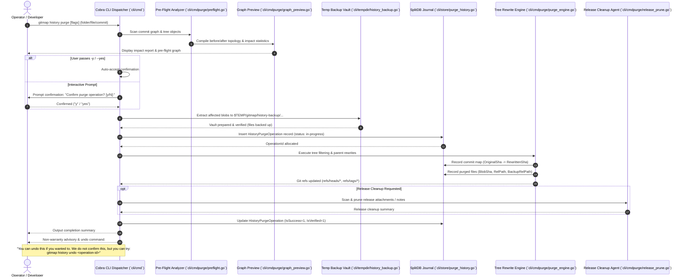

# 237-git-history-purge-and-undo: Git History Purge & Undo Engine Architecture Specification

- **Spec ID:** `02-spec/21-app/237-git-history-purge-and-undo/01-architecture-spec.md`
- **Status:** `APPROVED`
- **Version:** `1.0.0`
- **Subsystem:** Git History Rewriting, SplitDB Transaction Logging, Temp Backup Vault, Graph Pre-Flight
- **Dependencies:** `cli/store`, `cli/tempdir`, `cli/cmdpurge`, `cli/cmd`, `cli/apperror`, `cli/termpad`
- **Version Baseline:** `v6.500.0`
- **Target Version:** `v6.501.0`

---

## 1. Executive Summary & Core Intent

Accidental commits containing sensitive data (OAuth client secrets, API tokens, proprietary binaries, PII data) represent a critical operational hazard. Standard remediation techniques like `git rm` or revert commits leave sensitive blobs permanently queryable in Git commit history, tree objects, and packfiles.

The **Git History Purge & Undo Engine** provides an automated, enterprise-grade mechanism to surgically excise sensitive files, folders, or specific commit ranges across all branches and tags in a Git repository while guaranteeing:
1. **Defensive Pre-Flight Analysis:** Full visualization of affected commits, branches, and tree structures before mutating any Git objects.
2. **Deterministic Temp Blob Backup:** Pre-mutation extraction of all affected blobs into a segregated filesystem vault (`$TEMP/gitmap/history-backup/...`).
3. **SplitDB Reversion Ledger:** Persistence of parent-child commit lineage, blob mappings, and rewrite metadata in SQLite SplitDB (`HistoryPurgeOperation`, `HistoryPurgeCommitMap`, `HistoryPurgeFile`, `HistoryUndoOperation`).
4. **Interactive Confirmation UX:** Safe-by-default execution requiring explicit user confirmation (`[y/N]`) with optional `-y` / `--yes` flag bypass.
5. **Release Asset & Tag Pruning:** Automated scrubbing of matching artifacts or notes from GitHub releases.
6. **Non-Warranty Reversion Protocol:** Clear post-purge guidance displaying exact undo commands with honest non-warranty advisories.

---

## 2. Command Flow & System Topology

The end-to-end execution path strictly enforces transactional safety gates before touching repository trees.

### 2.1 User Command Execution Flow



---

## 3. SplitDB Data Architecture (Tier 1/3 SQLite)

The history purge subsystem utilizes GitMap's Split-DB storage architecture. Metadata is stored in a dedicated repository split database (`BinaryDataDir()/repodb/history_purge.db` or local `.gitmap/splitdb/history_purge.db`) using SQLite in Write-Ahead Logging (WAL) mode.

### 3.1 Naming & Schema Invariants
- **Table Names:** Strict singular PascalCase (`HistoryPurgeOperation`, `HistoryPurgeCommitMap`, `HistoryPurgeFile`, `HistoryUndoOperation`).
- **Primary Keys:** `INTEGER PRIMARY KEY AUTOINCREMENT`.
- **Boolean Attributes:** Positive boolean integer flags (`0` for false, `1` for true), prefixed with `Is` or `Has`:
  - `IsDryRun`
  - `IsVerified`
  - `HasPushed`
  - `IsUndone`
  - `IsSuccess`
- **Timestamps:** Standard Unix epoch integers in seconds (`INTEGER NOT NULL`).
- **Path Storage:** Strictly relative repository paths (`rel-path`), never absolute paths.

### 3.2 SQL DDL Specification

```sql
-- Table: HistoryPurgeOperation
-- Tracks top-level execution parameters, targets, and lifecycle status.
CREATE TABLE IF NOT EXISTS HistoryPurgeOperation (
    OperationId INTEGER PRIMARY KEY AUTOINCREMENT,
    RepoSlug TEXT NOT NULL DEFAULT '',
    TargetType TEXT NOT NULL DEFAULT '',       -- 'folder', 'file', 'commit', 'commit-range'
    TargetPath TEXT NOT NULL DEFAULT '',       -- Target relative folder or file path
    CommitListJson TEXT NOT NULL DEFAULT '[]', -- Target commit SHAs if commit-mode
    TotalCommitsScanned INTEGER NOT NULL DEFAULT 0,
    AffectedCommitsCount INTEGER NOT NULL DEFAULT 0,
    BackedUpFilesCount INTEGER NOT NULL DEFAULT 0,
    BackupVaultPath TEXT NOT NULL DEFAULT '',  -- Relative or tokenized temp vault locator
    IsDryRun INTEGER NOT NULL DEFAULT 0,       -- 1 if preview-only run
    IsVerified INTEGER NOT NULL DEFAULT 0,     -- 1 if post-purge git fsck passed
    HasPushed INTEGER NOT NULL DEFAULT 0,      -- 1 if affected commits were already pushed to remote
    IsUndone INTEGER NOT NULL DEFAULT 0,       -- 1 if later reverted by undo engine
    IsSuccess INTEGER NOT NULL DEFAULT 0,      -- 1 if purge completed without fault
    CreatedAt INTEGER NOT NULL DEFAULT 0,      -- Unix epoch seconds
    CompletedAt INTEGER NOT NULL DEFAULT 0,    -- Unix epoch seconds
    Notes TEXT NOT NULL DEFAULT ''
);
CREATE INDEX IF NOT EXISTS idx_history_purge_op_repo ON HistoryPurgeOperation(RepoSlug);
CREATE INDEX IF NOT EXISTS idx_history_purge_op_created ON HistoryPurgeOperation(CreatedAt);

-- Table: HistoryPurgeCommitMap
-- Records the 1:1 mapping between pre-rewrite and post-rewrite commits.
CREATE TABLE IF NOT EXISTS HistoryPurgeCommitMap (
    MapId INTEGER PRIMARY KEY AUTOINCREMENT,
    OperationId INTEGER NOT NULL,
    OriginalCommitSha TEXT NOT NULL,
    RewrittenCommitSha TEXT NOT NULL,
    ParentOriginalSha TEXT NOT NULL DEFAULT '',
    ParentRewrittenSha TEXT NOT NULL DEFAULT '',
    AuthorName TEXT NOT NULL DEFAULT '',
    AuthorEmail TEXT NOT NULL DEFAULT '',
    CommitTimestamp INTEGER NOT NULL DEFAULT 0,
    CommitMessage TEXT NOT NULL DEFAULT '',
    IsPurged INTEGER NOT NULL DEFAULT 0,       -- 1 if commit was completely dropped
    CreatedAt INTEGER NOT NULL DEFAULT 0,
    FOREIGN KEY(OperationId) REFERENCES HistoryPurgeOperation(OperationId) ON DELETE CASCADE
);
CREATE INDEX IF NOT EXISTS idx_history_purge_cmap_op ON HistoryPurgeCommitMap(OperationId);
CREATE INDEX IF NOT EXISTS idx_history_purge_cmap_orig ON HistoryPurgeCommitMap(OriginalCommitSha);
CREATE INDEX IF NOT EXISTS idx_history_purge_cmap_rewr ON HistoryPurgeCommitMap(RewrittenCommitSha);

-- Table: HistoryPurgeFile
-- Catalogs every original blob excised from each affected commit.
CREATE TABLE IF NOT EXISTS HistoryPurgeFile (
    FileId INTEGER PRIMARY KEY AUTOINCREMENT,
    OperationId INTEGER NOT NULL,
    OriginalCommitSha TEXT NOT NULL,
    RelativePath TEXT NOT NULL,
    BlobSha TEXT NOT NULL DEFAULT '',
    FileSizeBytes INTEGER NOT NULL DEFAULT 0,
    FileMode INTEGER NOT NULL DEFAULT 0644,
    BackupRelPath TEXT NOT NULL,               -- Relative path inside temp backup vault
    IsPurged INTEGER NOT NULL DEFAULT 1,
    CreatedAt INTEGER NOT NULL DEFAULT 0,
    FOREIGN KEY(OperationId) REFERENCES HistoryPurgeOperation(OperationId) ON DELETE CASCADE
);
CREATE INDEX IF NOT EXISTS idx_history_purge_file_op ON HistoryPurgeFile(OperationId);
CREATE INDEX IF NOT EXISTS idx_history_purge_file_path ON HistoryPurgeFile(RelativePath);

-- Table: HistoryUndoOperation
-- Records restoration runs, replayed refs, and verification outcomes.
CREATE TABLE IF NOT EXISTS HistoryUndoOperation (
    UndoId INTEGER PRIMARY KEY AUTOINCREMENT,
    OperationId INTEGER NOT NULL,
    RepoSlug TEXT NOT NULL DEFAULT '',
    RestoredCommitCount INTEGER NOT NULL DEFAULT 0,
    RestoredFileCount INTEGER NOT NULL DEFAULT 0,
    BackupVaultPath TEXT NOT NULL DEFAULT '',
    IsVerified INTEGER NOT NULL DEFAULT 0,     -- 1 if post-undo git verify succeeded
    IsSuccess INTEGER NOT NULL DEFAULT 0,      -- 1 if undo succeeded completely
    CreatedAt INTEGER NOT NULL DEFAULT 0,
    CompletedAt INTEGER NOT NULL DEFAULT 0,
    ErrorMessage TEXT NOT NULL DEFAULT '',
    FOREIGN KEY(OperationId) REFERENCES HistoryPurgeOperation(OperationId) ON DELETE CASCADE
);
CREATE INDEX IF NOT EXISTS idx_history_undo_op ON HistoryUndoOperation(OperationId);
```

---

## 4. Temp Backup Vault Architecture

Prior to initiating any branch rewriting, the engine extracts every file blob targeted for excision across all affected commits into an isolated directory structure within the system temporary directory.

### 4.1 Vault Directory Structure

The vault path follows a strictly compartmentalized hierarchy rooted in the repository-scoped temp directory (`cli/tempdir/tempdir.go:RepoTempDir`):

```text
$TEMP/
  └── gitmap/
      └── history-backup/
          └── <repo-slug>/
              └── <operation-id>/
                  ├── manifest.json
                  └── blobs/
                      └── <commit-sha>/
                          └── <rel-path>
```

#### Path Component Definitions:
1. `$TEMP/gitmap/`: Base temporary directory for GitMap operations.
2. `history-backup/`: Segregated namespace for Git history backups.
3. `<repo-slug>`: URL-safe, sanitized repository identifier (e.g., `github-com-alimtvnetwork-gitmap-v28`).
4. `<operation-id>`: Zero-padded integer ID corresponding to `HistoryPurgeOperation.OperationId` (e.g., `000042`).
5. `manifest.json`: Cryptographic index containing operation metadata, blob SHA-256 hashes, file modes, and original Git commit SHAs.
6. `blobs/<commit-sha>/<rel-path>`: Full byte-for-byte extraction of the targeted file as it existed in that exact Git commit tree.

### 4.2 Security & Permissions
- Vault files are created with mode `0600` (files) and `0700` (directories) to prevent multi-tenant access on shared workstations.
- Windows access control lists (ACLs) are inherited from user profile temp storage.

---

## 5. Core Architectural Invariants

### 5.1 Invariant 1: Zero Data Loss Prior to Mutation
- **Rule:** No Git reference or commit object may be rewritten, replaced, or stripped until all targeted file blobs have been successfully copied into the Temp Backup Vault and verified with matching byte counts and checksums.
- **Enforcement:** If vault creation encounters any I/O error or permission failure, the entire operation immediately terminates with a clean rollback. The repository remains untouched.

### 5.2 Invariant 2: Verifiable Rollback Metadata & Deterministic Replay
- **Rule:** Every commit modification must record its antecedent mappings in `HistoryPurgeCommitMap`.
- **Enforcement:** The original commit SHA, rewritten commit SHA, author timestamp, and tree mappings must be stored in SplitDB before moving the branch references.

### 5.3 Invariant 3: Single-Writer WAL SQLite Invariant
- **Rule:** SplitDB instances must operate exclusively under Write-Ahead Logging (`PRAGMA journal_mode=WAL;`), utilize `PRAGMA busy_timeout=5000;`, and enforce synchronized transaction scopes via Go mutex protection (`sync.Mutex`).
- **Enforcement:** Concurrency locks prevent database corruption during parallel CLI invocations.

### 5.4 Invariant 4: Strict Relative Path Hygiene
- **Rule:** All database columns, logs, JSON outputs, and CLI parameters must record and process strictly repository-relative paths (`02-spec/...`, `src/...`), never absolute operating system paths (`D:\...` or `/home/...`).
- **Exception:** The physical temp backup vault root utilizes `$TEMP` resolution internally, but database references store normalized relative sub-paths.

### 5.5 Invariant 5: Non-Warranty Advisory Invariant
- **Rule:** The engine MUST NOT make false claims of absolute, unconditional reversibility. Force-pushed remote histories and pruned reflogs cannot always be fully reconstructed across external clones.
- **Prescribed Output Message:**
  ```text
  You can undo this if you wanted to. We do not confirm this, but you can try:
    gitmap history undo <operation-id>
  ```

---

## 6. Pre-Flight Analyzer & Interactive Safety Gates

### 6.1 Pre-Flight Responsibilities
Before touching any Git references, the engine scans the repository graph and compiles an impact report:
1. **Target Matcher:** Evaluates target patterns against trees in `HEAD..root` across all branches (`refs/heads/*`) and tags (`refs/tags/*`).
2. **Blast Radius Calculations:**
   - Total commits evaluated vs. affected commits containing target blobs.
   - Distinct file paths and cumulative blob size to be excised.
   - Impacted branches and tags requiring reference updates.
   - Remote tracking analysis: identifies whether affected commits have already been pushed to `origin`.
3. **Graph Diff Preview:** Renders an ASCII/Unicode branch tree comparing the pre-purge topology with the anticipated post-purge topology.

### 6.2 Confirmation UX Flow
- When run in an interactive terminal, execution pauses with an explicit confirmation banner:
  ```text
  WARNING: History purging rewrites Git commit hashes and alters repository history.
  Affected commits: 14 | Target: secrets/credentials.json | Branches: main, dev
  Confirm purge operation? [y/N]:
  ```
- **Flag Bypass:** Supplying `-y` or `--yes` bypasses the interactive prompt for automated CI/CD and script environments.
- **Dry-Run Mode:** Supplying `--dry-run` compiles the full pre-flight report and populates `HistoryPurgeOperation` with `IsDryRun=1` without extracting backup blobs or mutating Git objects.

---

## 7. Reversion & Undo Protocol

When a developer executes `gitmap history undo <operation-id>`:
1. **Validation:** Checks SplitDB for `HistoryPurgeOperation` matching `operation-id`. Validates that `IsUndone == 0` and `IsSuccess == 1`.
2. **Vault Verification:** Inspects `$TEMP/gitmap/history-backup/<repo-slug>/<operation-id>/manifest.json`.
3. **Reference Restoration:**
   - If original commit objects still exist in `.git/objects` (unpruned reflog), resets branch references back to `OriginalCommitSha`.
   - If original commits have been garbage-collected, replays the recorded parent-child relationships and restores excised blobs from the backup vault.
4. **Audit Logging:** Inserts a new record into `HistoryUndoOperation` with `IsSuccess=1` and updates `HistoryPurgeOperation.IsUndone=1`.
5. **Output:** Reports restored branches, files, and commits to the console.

---

## 8. Release Cleanup Integration

When sensitive data is purged from repository history, corresponding GitHub releases may still expose matching downloadable assets (e.g., zip archives containing the purged files) or release notes referencing the sensitive blobs.
- **Module:** `cli/cmdpurge/release_prune.go`
- **Actions:**
  1. Identifies release tags pointing to affected pre-rewrite commits.
  2. Retags releases to point to the corresponding `RewrittenCommitSha`.
  3. Scans release bodies and removes matching strings/hashes.
  4. Deletes downloadable binary assets that match purged target file names.
