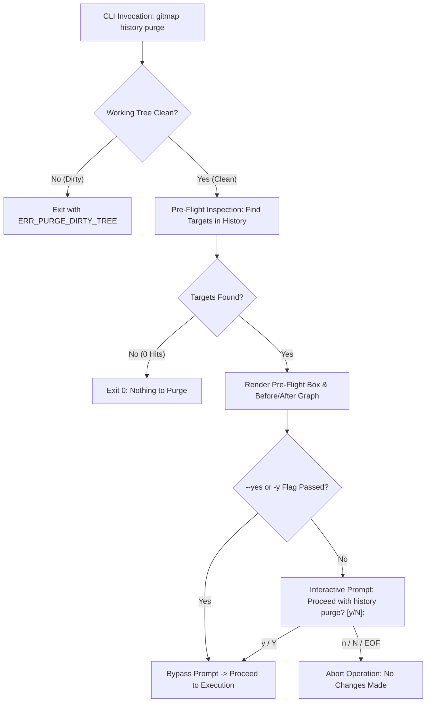
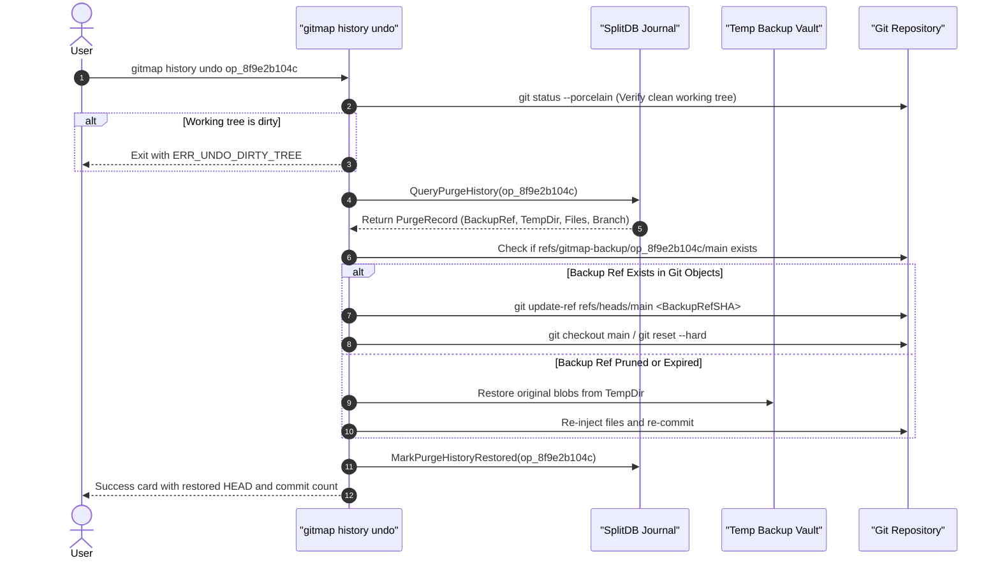

# 02-component-and-cli-spec: Git History Purge & Undo Engine Specification

- **Spec ID:** `21-app/237-git-history-purge-and-undo/02-component-and-cli-spec.md`
- **Status:** `APPROVED`
- **Version:** `1.0.0`
- **Subsystem:** Git History Purge & SplitDB Undo Engine
- **Dependencies:** `cli/cmd`, `cli/cmdpurge`, `cli/store`, `cli/tempdir`, `cli/termpad`, `cli/termtable`, `cli/jsonenv`, `cli/apperror`
- **Version Baseline:** `v6.500.0`
- **Target Version:** `v6.501.0`

---

## 1. Executive Summary & Component Topology

The Git History Purge & Undo Engine equips `gitmap` with an enterprise-grade mechanism to eradicate sensitive files, proprietary assets, credential leaks, and bloated directories from the entire commit graph. Unlike destructive single-line utilities, this subsystem incorporates:
1. **Multi-Target Purging:** Surgical removal by directory path (`--folder`), specific file path (`--file`), single/comma-separated commit hashes (`--commit`), and optional GitHub release artifact/notes purging (`--release`).
2. **Interactive Visual Pre-Flight:** Pre-execution blast-radius analysis displaying before/after commit graph topology, affected commit counts, impacted branches/tags, and an interactive confirmation prompt (`Proceed with history purge? [y/N]: `) with `-y`/`--yes` bypass.
3. **Temp Directory Blob Isolation:** Comprehensive pre-rewrite extraction of all targeted blobs into `$TEMP/gitmap/history-backup/<repo-slug>/<operation-id>/` preserving raw data for restoration.
4. **SplitDB Transaction Journaling:** High-integrity SQLite SplitDB logging of operation metadata, parent commit remapping, rewritten tree hashes, and backup reference pointers.
5. **Post-Purge Non-Warranty Advisory:** Explicit user notification:
   `"You can undo this if you wanted to. We do not confirm this, but you can try: gitmap history undo <operation-id>"`
6. **Reversible Undo Restoration Flow:** Seamless restoration using backup refs (`refs/gitmap-backup/<operation-id>/<branch>`), temp file reconstruction, and working-tree integrity verification.

```
02-spec/21-app/237-git-history-purge-and-undo/
├── 00-master-audit-ledger.md
├── 01-architecture-spec.md
└── 02-component-and-cli-spec.md
```

### 1.1 Component Breakdown

| Component | Target Source Path | Primary Role |
| :--- | :--- | :--- |
| **Command Dispatcher** | `cli/cmd/history_purge_cmd.go`, `cli/cmd/roottooling.go` | Parses CLI invocations, binds flags, enforces validation, routes to purge/undo handlers. |
| **Shell Completion** | `cli/cmd/root_cobra_completion.go` | Registers `purge` and `undo` commands, flags, and dynamic completions in Cobra command tree. |
| **Pre-Flight Analyzer** | `cli/cmdpurge/preflight.go` | Inspects commit log, computes blast radius, identifies target commits, generates impact summary. |
| **Graph Previewer** | `cli/cmdpurge/graph_preview.go` | Renders ASCII/Unicode before-and-after commit topology preview inside terminal box cards. |
| **Purge Rewriting Engine** | `cli/cmdpurge/purge_engine.go` | Low-level Git tree rebuilding, parent commit re-stitching, `update-ref`, and aggressive reflog expiration. |
| **Release Pruner** | `cli/cmdpurge/release_prune.go` | Discovers GitHub credentials, queries release assets via REST API, deletes assets and sanitizes release notes. |
| **Temp Backup Vault** | `cli/tempdir/history_backup.go` | Manages isolated staging directories under `$TEMP` for original files and commit metadata blobs. |
| **SplitDB Journal Store** | `cli/store/purge_history.go`, `cli/store/purge_history_models.go` | Persists `HistoryPurgeOperation`, `HistoryPurgeCommitMap`, `HistoryPurgeFile`, and `HistoryUndoOperation`. |
| **Undo Restoration Engine** | `cli/cmdpurge/purge_undo.go` | Restores branch pointers from backup refs, recovers files from temp vault, and updates SplitDB journal. |

---

## 2. Cobra CLI Command Hierarchy

The history purge and undo capabilities integrate cleanly into the existing `gitmap history` command namespace while exposing high-speed ergonomic aliases:

```
gitmap
└── history (hist)
    ├── purge (alias: hp, history clean)   [Purge files/folders/commits from history]
    └── undo  (alias: hu, history restore) [Undo purge operation and restore history]
```

### 2.1 Command Signatures & Aliases

```bash
# Canonical Commands
gitmap history purge [flags]
gitmap history undo [operation-id] [flags]

# High-Speed Top-Level Aliases
gitmap hp [flags]
gitmap hu [operation-id] [flags]

# Subcommand Aliases
gitmap history clean [flags]
gitmap history restore [operation-id] [flags]
```

### 2.2 CLI Flags Reference

| Flag Name | Short | Type | Default | Description |
| :--- | :--- | :--- | :--- | :--- |
| `--folder` | `-d` | `string` | `""` | Relative path to directory to purge from all commit history. |
| `--file` | `-f` | `string` | `""` | Relative path to file to purge from all commit history. |
| `--commit` | `-c` | `string` | `""` | Target commit SHA or comma-separated list of commit SHAs to excise. |
| `--release` | `-r` | `bool` | `false` | Inspect and purge matching assets and notes from GitHub releases. |
| `--yes` | `-y` | `bool` | `false` | Automatically confirm pre-flight prompt without interactive input. |
| `--dry-run` | `-n` | `bool` | `false` | Execute full pre-flight impact analysis without modifying Git objects. |
| `--repo` | - | `string` | `.` | Target repository directory (defaults to current working directory). |
| `--json` | `-j` | `bool` | `false` | Emit structured machine-readable JSON output in `jsonenv.EnvelopeV2`. |
| `--verbose` | `-v` | `bool` | `false` | Enable verbose Git plumbing command traces and timing telemetry. |
| `--no-backup` | - | `bool` | `false` | **CAUTION:** Skip temp file staging (SplitDB refs are still retained). |

---

## 3. Pre-Flight Analysis & Interactive Confirmation Protocol

### 3.1 Pre-Flight Execution Pipeline



### 3.2 Interactive Prompt Specification

When `--yes` (`-y`) is **NOT** provided, the engine pauses stdout and awaits user confirmation via standard terminal input:

```text
Proceed with history purge? [y/N]: 
```

- **Input Evaluation:** Case-insensitive comparison against `"y"` and `"yes"`.
- **Default Action:** Any other keypress, empty carriage return (`\n`), or interrupt signal (`Ctrl+C`) aborts execution immediately.
- **Abort Message:**
  ```text
  [!] Purge cancelled by user. Repository commit graph remains unaltered.
  ```
- **Exit Code on Abort:** `0` (clean non-error exit).

### 3.3 Visual Terminal Box Display

The pre-flight display utilizes `cli/termpad` and `cli/termtable` to present a unified preview card:

```text
┌─ GitMap History Purge: Pre-Flight Analysis ────────────────────────┐
│ Target Repository : D:/work/my-project                             │
│ Active Branch     : main (HEAD -> c7a12e8)                         │
│ Target Filter     : folder: "internal/secrets/"                    │
│ GitHub Release    : Pruning enabled (--release)                    │
├────────────────────────────────────────────────────────────────────┤
│ Commits Scanned   : 342                                            │
│ Commits Affected  : 14 (4.09% of history)                          │
│ Blobs to Remove   : 28 unique objects (4.82 MB total)              │
│ Impacted Branches : main, feature/auth-v2                          │
│ Impacted Tags     : v1.0.0, v1.1.0-beta.1                          │
│ Temp Backup Dir   : %TEMP%/gitmap/history-backup/my-project/op_8f9e│
├────────────────────────────────────────────────────────────────────┤
│ BEFORE (Current HEAD)            AFTER (Rewritten HEAD)            │
│  * c7a12e8 chore: update docs     * a91b04f chore: update docs     │
│  * 8f3c21a fix: leak secrets <X>  * [SKIPPED / REMOVED]            │
│  * 4b1a09d feat: auth module      * 2d4e8c1 feat: auth module (cln)│
│  * 1e99a2b initial commit         * 1e99a2b initial commit         │
└────────────────────────────────────────────────────────────────────┘
Proceed with history purge? [y/N]: 
```

---

## 4. Post-Purge Non-Warranty Advisory Warning

Following successful completion of history rewriting, reflog expiration, and release asset synchronization, the CLI displays an explicit non-warranty advisory card formatted via `cli/termpad`:

```text
┌─ Operation Completed: Git History Purged ──────────────────────────┐
│ Operation ID      : op_8f9e2b104c                                  │
│ Rewritten Commits : 14 commits re-stitched                         │
│ Backup Reference  : refs/gitmap-backup/op_8f9e2b104c/main          │
│ Temp Blob Storage : %TEMP%/gitmap/history-backup/my-project/...    │
│ SplitDB Journal   : Recorded (Entry #42 in purge_history)          │
├────────────────────────────────────────────────────────────────────┤
│ You can undo this if you wanted to. We do not confirm this, but    │
│ you can try:                                                       │
│                                                                    │
│   gitmap history undo op_8f9e2b104c                                │
└────────────────────────────────────────────────────────────────────┘
```

### 4.1 Strict Text Contract
The non-warranty advisory message MUST contain the exact verbatim phrase:
> `"You can undo this if you wanted to. We do not confirm this, but you can try: gitmap history undo <operation-id>"`

---

## 5. Undo Restoration Flow & Architecture

The undo engine allows developers to roll back a purge operation if downstream builds fail, unexpected files were purged, or branch pointers diverged:



### 5.1 Undo Restoration Steps

1. **Operation ID Resolution:** If `<operation-id>` argument is omitted, the engine queries SplitDB for the latest unrestored purge operation matching the current repository:
   ```sql
   SELECT PurgeHistoryLogId, OperationId, RepoPath, BackupBranch, TempDir, Files, Timestamp 
   FROM PurgeHistoryLog 
   WHERE RepoPath = ? AND IsRestored = 0 
   ORDER BY PurgeHistoryLogId DESC LIMIT 1;
   ```
2. **Pre-Restoration Safety Check:** Validates that the working tree contains zero unstaged or uncommitted changes (`git status --porcelain`). If untracked or modified files exist, aborts with `ERR_UNDO_DIRTY_TREE`.
3. **Reference Restoration:**
   - Reads `BackupBranch` ref (`refs/gitmap-backup/<operation-id>/<branch>`).
   - Verifies target commit object exists in Git database via `git cat-file -e <sha>`.
   - Atomically updates branch pointer:
     ```bash
     git update-ref refs/heads/<branch> <backup-sha>
     git reset --hard <backup-sha>
     ```
4. **Temp Directory Blob Recovery Fallback:** If aggressive pruning (`git gc --prune=now`) purged loose backup objects, the engine retrieves raw copies from `$TEMP/gitmap/history-backup/<repo-slug>/<operation-id>/` and overlays them into the working tree.
5. **SplitDB Status Update:** Marks the operation as restored in SQLite:
   ```sql
   UPDATE PurgeHistoryLog SET IsRestored = 1 WHERE OperationId = ?;
   INSERT INTO HistoryUndoOperation (OperationId, RepoPath, RestoredAt, RestoredHeadSha) VALUES (?, ?, ?, ?);
   ```
6. **Confirmation Output:** Emits terminal confirmation card detailing restored HEAD SHA and restored file count.

---

## 6. Machine-Readable JSON Envelope Specification

When the `--json` (`-j`) flag is provided, all interactive prompts are bypassed, and structured output is written to stdout utilizing `cli/jsonenv.EnvelopeV2`.

### 6.1 Purge Response Envelope (`gitmap history purge --json`)

```json
{
  "version": "2.0",
  "status": "success",
  "command": "history purge",
  "timestamp": 1775580000,
  "data": {
    "operationId": "op_8f9e2b104c",
    "repoPath": "D:/work/my-project",
    "branch": "main",
    "filterType": "folder",
    "filterPattern": "internal/secrets/",
    "isDryRun": false,
    "isConfirmed": true,
    "scannedCommits": 342,
    "affectedCommits": 14,
    "purgedBlobsCount": 28,
    "purgedBlobsBytes": 5054136,
    "originalHeadSha": "c7a12e84b9101f82d1c9384a56e2910fa83c7491",
    "rewrittenHeadSha": "a91b04f198c21a083b749d1e204c8812f9e43b10",
    "backupRef": "refs/gitmap-backup/op_8f9e2b104c/main",
    "tempBackupDir": "C:/Users/ADMINI~1/AppData/Local/Temp/gitmap/history-backup/my-project/op_8f9e2b104c",
    "releaseAssetsPurged": 2,
    "releaseNotesUpdated": 1,
    "nonWarrantyAdvisory": "You can undo this if you wanted to. We do not confirm this, but you can try: gitmap history undo op_8f9e2b104c"
  },
  "error": null
}
```

### 6.2 Undo Response Envelope (`gitmap history undo --json`)

```json
{
  "version": "2.0",
  "status": "success",
  "command": "history undo",
  "timestamp": 1775580120,
  "data": {
    "operationId": "op_8f9e2b104c",
    "repoPath": "D:/work/my-project",
    "branch": "main",
    "restoredHeadSha": "c7a12e84b9101f82d1c9384a56e2910fa83c7491",
    "previousHeadSha": "a91b04f198c21a083b749d1e204c8812f9e43b10",
    "restorationSource": "backup_ref",
    "restoredFilesCount": 28,
    "isCleanWorkingTree": true
  },
  "error": null
}
```

---

## 7. Error Taxonomy & Exit Codes

All errors are encapsulated as structured `apperror.AppError` instances conforming to `02-spec/02-coding-guidelines/`:

| Error Code | Exit Code | Trigger Condition | Remediation Guidance |
| :--- | :--- | :--- | :--- |
| `ERR_PURGE_DIRTY_TREE` | 1 | Unstaged or uncommitted changes detected before purge. | Commit or stash changes before executing history purge. |
| `ERR_PURGE_NO_TARGET` | 2 | No target flag (`--folder`, `--file`, `--commit`) specified. | Pass `--folder <path>`, `--file <path>`, or `--commit <sha>`. |
| `ERR_PURGE_TARGET_NOT_FOUND` | 3 | Specified file/folder/commit does not exist in any commit. | Verify path spelling or commit SHA in Git history. |
| `ERR_PURGE_USER_ABORTED` | 0 | User entered 'N' or pressed Enter during pre-flight prompt. | Clean exit; no alterations performed. |
| `ERR_PURGE_REWRITE_FAILED` | 4 | Low-level `git mktree` or `git commit-tree` failed. | Check repository permissions and disk capacity. |
| `ERR_PURGE_RELEASE_FAILED` | 5 | GitHub REST API returned error during release purging. | Verify `GITHUB_TOKEN` permissions (`repo` scope required). |
| `ERR_UNDO_DIRTY_TREE` | 6 | Unstaged changes detected prior to undo restoration. | Stash or commit working tree modifications before undo. |
| `ERR_UNDO_OP_NOT_FOUND` | 7 | Operation ID not found in SplitDB journal. | Run `gitmap history ls` to locate valid operation IDs. |
| `ERR_UNDO_REF_MISSING` | 8 | Backup ref pruned and temp directory backup inaccessible. | Historical backup unrecoverable after external disk clean. |

---

## 8. Coding Guidelines & Invariant Alignment

1. **Function Size Bound:** Every function across `cli/cmdpurge` and `cli/cmd` MUST NOT exceed 8–15 lines. Multi-stage flows are cleanly decomposed into single-responsibility sub-helpers.
2. **Positive Boolean Naming:** All booleans enforce positive polarity (`isClean`, `hasBackup`, `isDryRun`, `isConfirmed`, `hasReleasePrune`). Negative booleans (`unclean`, `noBackup`) are prohibited.
3. **Structured Errors:** Direct `errors.New` or `fmt.Errorf` calls are wrapped with `apperror.NewSimple` or `apperror.WrapSimple`.
4. **Strict Relative Paths:** All documentation, error outputs, and plan cross-references enforce relative repository paths (`02-spec/...`, `cli/...`, `.ai-memory/...`).
