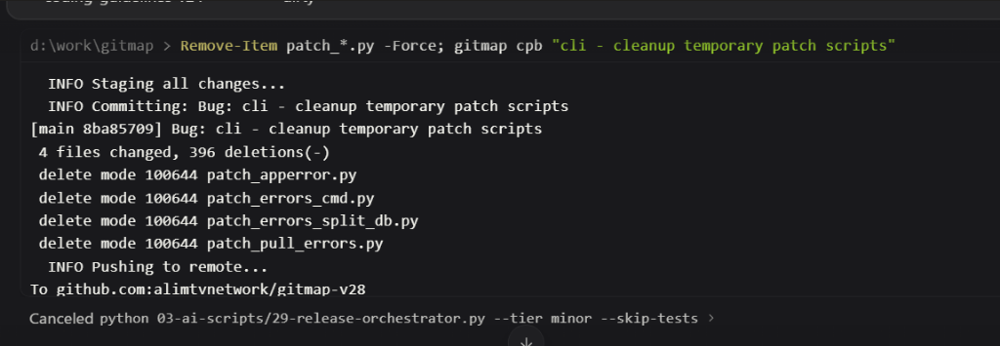
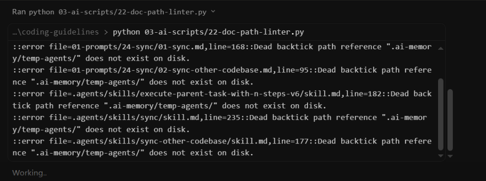
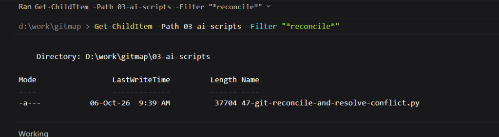
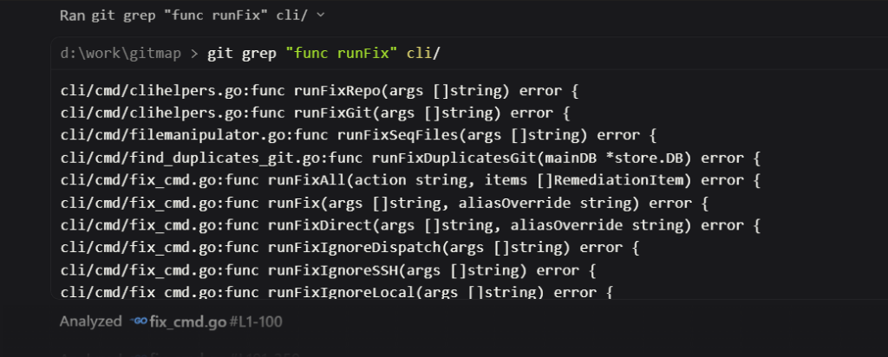
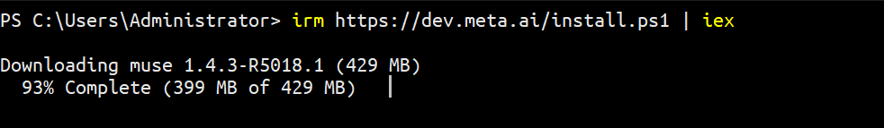
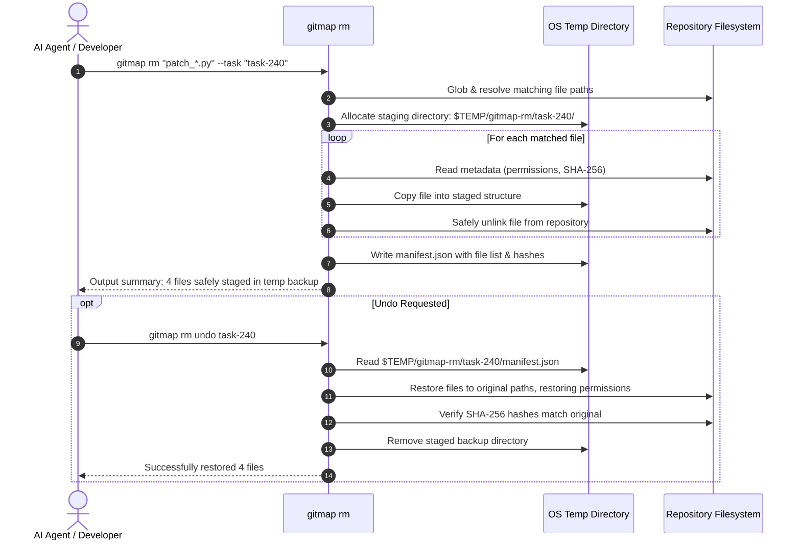
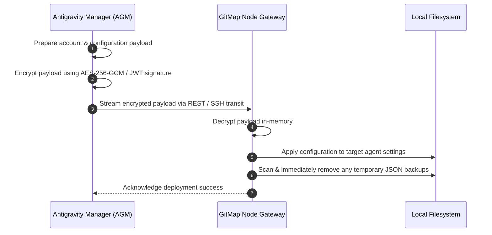

# Architecture Specification: GitMap MCP AI Analysis, Safe File Removal, and Meta Muse Installer

> **Document Version:** 1.0.0  
> **Status:** Active  
> **Scope:** GitMap Core CLI, Split-DB Architecture, AI Tooling Subsystems, and Fleet Integrations  
> **Traceability:** Task-240  
> **Parent Plan:** `.ai-memory/plans/240-gitmap-mcp-ai-analysis-muse-installer-and-agm-fleet.md`  

---

## 1. Executive Summary & Problem Statement

GitMap is evolving into an AI-native Model Context Protocol (MCP) server companion and ultra-high-speed execution engine for polyglot software repositories. In multi-agent autonomous engineering environments, AI agents frequently perform repetitive, unstructured, and destructive operations:

1. **Blind Codebase Traversal & Context Redundancy:** Agents read dozens of files repeatedly without structured telemetry, recording no rationale or line-level reasoning for why files were examined or altered.
2. **Destructive File Removal Anti-Patterns:** Autonomous agents invoke destructive shell commands such as `Remove-Item patch_*.py -Force` or `rm -f`, discarding file history without rollback capability or task association.
3. **Shell Tool Inefficiency:** Agents resort to slow, unindexed shell operations such as PowerShell `Get-ChildItem -Path ... -Filter ...` or raw `git grep`, bypassing GitMap's high-speed AST indexing and Split-DB cache layers.
4. **Disjointed Agent Tooling & Installer Fragmentation:** Installing specialized AI agents like Meta Muse across heterogeneous OS nodes (Windows, Linux, macOS) lacks standardized automation.
5. **Insecure Fleet Credential Propagation:** Synchronizing accounts and configurations between Antigravity Manager (AGM) and remote cluster nodes leaves unencrypted backup JSON files on disk.

This specification defines the architectural blueprint for GitMap Task 240, introducing:
- **AI Analysis Subsystem:** Split-DB SQLite storage tracking tasks, file accesses, line modifications, and explicit decision reasoning.
- **Task-Based Safe Removal & Rollback Engine:** `gitmap rm` backing up deleted files to the OS temporary directory with manifest recording and instant undo capability (`gitmap rm --undo`).
- **LLM Training & Reasoning Summarizer:** `gitmap ai train` / `gitmap ai llm-train` formatting historical decision trees into structured training context, accompanied by export (JSON/ZIP/DB) and pruning tools.
- **Meta Muse Multi-Platform Native Installer:** `gitmap muse install` providing verified one-liner installations across Windows, Linux/Ubuntu, and macOS.
- **AGM Fleet Secure Sync:** Encrypted transit streaming and automated zero-trace removal of temporary credential JSON files.
- **High-Speed Cached Git Logs & Branch Comparison:** Split-DB SQLite accelerated git log queries and fast branch diffing.
- **Streamlined Minimalist Help Menu:** Clean version and footer display on bare `gitmap`, with full catalog reserved for `gitmap help`.

---

## 2. User Request (Verbatim)

The foundational requirements for Task 240 are captured verbatim from the engineering request:

```text
https://prnt.sc/iBoFN5X62bs7
https://prnt.sc/Zc2_K0Fr3sWW

# High Priority Instruction

Now I wanted to learn what can we improve in the `gitmap`. What are the functionalities that we can create that `gitmap` can behave like a MCP server for the AI? And also in the future, AI does the analysis. AI does analysis, AI does searching, finding the files for a task. I want you to create in the `gitmap` these whole things, that analysis or anything that the AI does for the repo, and that would be AI analysis. That would be AI analysis part that would have for a task. It would start for a task, and then for that task, it will also put all these lines that it is reading, which files it is reading, which lines it is reading. So all these things, we should have AI analysis command that would use, again, the cache DB, a little bit of split DB data from the cache DB, and also itself. And again, it would use the split DB concept for the repo, so that would have a specific folder, AI analysis. So anytime that AI edits, modifies, or read based on the task, it would create that task, have a master table, and also the sub-table contains the file lines. So initially, it would have which file, related path, things like that in the master table. Very simple, straightforward information. With this, it would have child table where we have the lines we are modifying, and also we should have the reasoning in the table. So that means when AI reads a file, like the analysis, the reasoning for the task, it would also write into the reasoning section, like why it is reading or why it is modifying. Using `gitmap`, so `gitmap` have or needs to have these commands that would deal with the situation. And also, in cases like removing file path. So rather than removing an item directly, any AI should remove using `gitmap`. So `gitmap` should have similar command that actually accommodate the removal. And again, every removal is task-based, so that can be undo and removes can be kept as a backup in the OS temp directory for time being. But if the temporary is removed, then we cannot revert it. Remember that. There are a lot of AI scripts I do see, like the doc path linter. Also, reading multiple files, I believe, using Python files. So whatever the Python code that AI writes, that can also go through that analysis phase. The reason I'm saying this, that we could use that data to feed AI anytime, let's say, "Hey, learn this. What was the previous decision-making? Why it took the decision-making, and what was the reason?" We should be able to have a command like AI analysis LLM train, and that would basically give a summary with the next, next to any LLM, that it would learn each one of the task, why the decision was made and how it made. And also, it should have a clear method so that we can clear the decision-making or analysis, because over time it would become very big. These type of things. And that can be exported and imported from one system to another using JSON or using ZIP or also using the SQLite DB. Remember that. Now, sometimes we can do the filter, I believe, get child path. So this type of command, we need to have in `gitmap` with an example, not to use this type of get child, but use the `gitmap` functionality. Also, the git grep should be avoided and should provide the example with our example or our things. Remember that. Also, in the `gitmap`, try to install or have the installer feature for the Muse, Meta Muse. I'm giving you the screenshot so you can also search for the AI to understand how to install this in different platforms. So this is for Windows platform. There is a platform installation for Ubuntu, Linux and macOS, so try the different platform installation as well. Now, another important factor that `gitmap` can create a repository using the `gitmap` repo create. Now, if in case the repo is already created, then `gitmap` will say, "Do you want to clone it?" If the user says UI, then it's going to clone instead of create because it's already there. So we need to have this type of features. First, all the screenshots and things that I have given you, I want you to take the screenshots into the assets and try to define the spec what I have described. So my plan is to have all kinds of these functionality should be running from `gitmap`, and `gitmap` would be a prime MCT server for any AI to work with and very faster. Do you understand? So first, define the spec, show me the commands that you think should be created, and then you start working on it. Also, at the same time, please confirm from the `Antigravity Manager (`Antigravity Manager (AGM)`)` tool, Antigravity Manager, and from the map, we should be able to import, export, and deploy all the configuration across the nodes. That's the first thing. Second is that we should be able to deploy the accounts with the removal. That means once the accounts are deployed, it will remove those JSON files automatically. You need to confirm that this is how the implementation is. We can do it from `Antigravity Manager (`Antigravity Manager (AGM)`)` to other machines. `Antigravity Manager (`Antigravity Manager (AGM)`)` will use the `gitmap` to access to the machines and then use its functionality to deploy the JSON configurations or account information. Once it is deployed, the files will be removed, and during the transaction, make sure the files are encrypted so that the other parties cannot see it. Remember that. It needs to be kept because there are credentials that needs to be encrypted. And we can use JWT method if that is helpful during the transition. And we can have, let's say, REST endpoints from `gitmap` and the `Antigravity Manager (`Antigravity Manager (AGM)`)` both. So both should have the simultaneous method to deploy the settings from one to the another. So this is something that I want. Also, I want you to test that, so that you can confirm that it is a working copy. And also for the Git logs, I think time to time, AI uses the Git logs and other methods. I want those to be coming from the `gitmap` as well. So you should have methods which actually deals with the situation. Older version needs to be better, faster with caching, so that you can always show the things faster if we already have run this before. Remember that giving the data from the caching SQL DB concept, it will be so much faster than directly looking into the Git. But also we can reuse the Git if necessary. And also we should have two branch comparison function easily from `gitmap`. There should be examples for it. And also, if we do the `gitmap` now on, do not put all the commands in the help, just the version and the footer notes is fine. If the user gives help, then they will see the full help. Do you understand all these features and tasks? If you have any question, concern, let me know.
```

---

## 3. Visual Assets & Screenshot Register

The engineering request includes five concrete screenshots captured into `assets/screenshots/`:

| Screenshot Reference | Target Anti-Pattern / Feature | Architectural Requirement |
| :--- | :--- | :--- |
| `assets/screenshots/240-ai-rm-cleanup-patch.png` | `Remove-Item patch_*.py -Force` shell deletion | Replace with `gitmap rm` task-based safe removal with OS temp backup |
| `assets/screenshots/240-doc-path-linter-error.png` | Dead markdown backtick references failing linter | AI Analysis recording verifies referenced relative paths against Split-DB |
| `assets/screenshots/240-get-childitem-filter.png` | `Get-ChildItem -Path ... -Filter "*reconcile*"` | Replace with GitMap indexed finder `gitmap find` / `gitmap aum search` |
| `assets/screenshots/240-git-grep-func-runfix.png` | `git grep "func runFix" cli/` | Replace with AST symbol lookup `gitmap aum search` |
| `assets/screenshots/240-muse-meta-installer.png` | `irm https://dev.meta.ai/install.ps1 \| iex` | Cross-platform native installer `gitmap muse install` |

### 3.1 Visual Evidence References


*Figure 1: Destructive shell file removal anti-pattern requiring `gitmap rm` safe task staging.*


*Figure 2: AI documentation scripts failing due to untracked file movement and dead paths.*


*Figure 3: Inefficient PowerShell directory filtering superseded by `gitmap find`.*


*Figure 4: Unindexed text grep superseded by GitMap AST symbol search.*


*Figure 5: Meta Muse native installer telemetry executed on Windows platform.*

---

## 4. End-to-End System Architecture

The following diagram illustrates the complete GitMap MCP architecture across AI analysis, safe removal, Split-DB persistence, Meta Muse installation, and AGM fleet deployment:

```mermaid
flowchart TD
    subgraph ClientLayer["AI Agent & MCP Client Layer"]
        Agent["Autonomous AI Agent / MCP Client"]
        Dev["Developer Terminal"]
    end

    subgraph GitMapCore["GitMap MCP Core Engine (cli/cmd)"]
        Router["CLI Command Dispatcher & MCP Router"]
        
        subgraph SubsystemAI["AI Analysis Subsystem (cli/cmdai)"]
            AIStart["Task Lifecycle Manager"]
            AIRecord["Line & Reasoning Capture"]
            AITrain["LLM Train & Reasoning Summarizer"]
            AIExport["Export / Import Engine (JSON, ZIP, DB)"]
            AIClear["Storage Pruning & Retention"]
        end

        subgraph SubsystemRM["Safe Removal Subsystem (cli/cmdrm)"]
            RMSafe["Task-Based Removal Dispatcher"]
            RMStage["OS Temp Staging Engine"]
            RMManifest["Manifest Generator (manifest.json)"]
            RMUndo["Atomic Undo & Restoration"]
        end

        subgraph SubsystemInstall["Installer Subsystem (cli/cmdinstall)"]
            MuseInst["Meta Muse Multi-Platform Engine"]
            DetectOS["Host OS & Runtime Detector"]
        end

        subgraph SubsystemFleet["AGM Fleet Subsystem (cli/cmdnodes)"]
            TransitEnc["JWT & AES Transit Encryptor"]
            AutoPurge["Post-Deploy Auto-Removal Engine"]
        end

        subgraph SubsystemGit["Cached Git Subsystem (cli/cmdlog)"]
            CachedLog["Split-DB Git Log Cache"]
            BranchDiff["Fast Branch Comparison"]
        end
    end

    subgraph StorageLayer["Split-DB Persistence Layer"]
        AIDB[("ai_analysis.db (.gitmap/data/ai-analysis/<slug>/sql.db)")]
        TasksDB[("tasks.db (.gitmap/data/tasks/sql.db)")]
        InstallDB[("installation.db (.gitmap/data/installation/sql.db)")]
        OSTemp[("OS Temp Directory ($TEMP/gitmap-rm/<task_id>/)")]
    end

    subgraph ExternalNodes["Remote Nodes & APIs"]
        MetaAPI["Meta Muse Distribution (dev.meta.ai)"]
        AGMNodes["AGM Cluster Fleet Nodes (u1, w1, etc.)"]
    end

    Agent -->|JSON-RPC / CLI| Router
    Dev -->|CLI Invocations| Router

    Router --> SubsystemAI
    Router --> SubsystemRM
    Router --> SubsystemInstall
    Router --> SubsystemFleet
    Router --> SubsystemGit

    AIStart -->|Create Task| AIDB
    AIRecord -->|Record Line & Reason| AIDB
    AITrain -->|Summarize History| AIDB
    AIExport -->|Dump / Ingest| AIDB
    AIClear -->|Prune & Vacuum| AIDB

    RMSafe --> RMStage
    RMStage -->|Backup Files| OSTemp
    RMStage --> RMManifest
    RMManifest -->|Write Manifest| OSTemp
    RMUndo -->|Restore from| OSTemp

    MuseInst --> DetectOS
    DetectOS -->|Download & Execute| MetaAPI
    MuseInst -->|Log Execution| InstallDB

    TransitEnc -->|Secure Payload| AGMNodes
    AGMNodes -->|Acknowledge Ingestion| AutoPurge
    AutoPurge -->|Purge Plaintext JSONs| Router

    CachedLog --> TasksDB
```



---

## 5. SQLite Split-DB Schema Design (`ai_analysis.db`)

In accordance with GitMap's SQLite Split-DB standard, AI analysis telemetry is partitioned per repository under:
`.gitmap/data/ai-analysis/<repo-slug>/sql.db`

### 5.1 Master Table: `AiAnalysisTask`

Stores high-level task identity, executing agent metadata, scope, and summary reasoning.

```sql
CREATE TABLE IF NOT EXISTS AiAnalysisTask (
    task_id TEXT PRIMARY KEY,
    repo_path TEXT NOT NULL,
    task_description TEXT NOT NULL,
    model_name TEXT NOT NULL DEFAULT 'unknown',
    status TEXT NOT NULL CHECK(status IN ('in_progress', 'completed', 'failed', 'cancelled')),
    started_at DATETIME NOT NULL DEFAULT CURRENT_TIMESTAMP,
    completed_at DATETIME,
    total_files_read INTEGER NOT NULL DEFAULT 0,
    total_files_modified INTEGER NOT NULL DEFAULT 0,
    total_files_deleted INTEGER NOT NULL DEFAULT 0,
    reasoning_summary TEXT,
    created_at DATETIME NOT NULL DEFAULT CURRENT_TIMESTAMP
);

CREATE INDEX IF NOT EXISTS idx_ai_analysis_task_status ON AiAnalysisTask(status);
CREATE INDEX IF NOT EXISTS idx_ai_analysis_task_created ON AiAnalysisTask(created_at);
```

### 5.2 Child Table: `AiAnalysisLine`

Tracks fine-grained operations (read, edit, delete) down to line ranges and associates explicit human-readable reasoning for every step.

```sql
CREATE TABLE IF NOT EXISTS AiAnalysisLine (
    id INTEGER PRIMARY KEY AUTOINCREMENT,
    task_id TEXT NOT NULL REFERENCES AiAnalysisTask(task_id) ON DELETE CASCADE,
    file_path TEXT NOT NULL,
    operation_type TEXT NOT NULL CHECK(operation_type IN ('read', 'edit', 'delete')),
    start_line INTEGER NOT NULL DEFAULT 1,
    end_line INTEGER NOT NULL DEFAULT 1,
    line_count INTEGER NOT NULL DEFAULT 1,
    content_snippet TEXT,
    reasoning TEXT NOT NULL,
    created_at DATETIME NOT NULL DEFAULT CURRENT_TIMESTAMP
);

CREATE INDEX IF NOT EXISTS idx_ai_analysis_lines_task_id ON AiAnalysisLine(task_id);
CREATE INDEX IF NOT EXISTS idx_ai_analysis_lines_file_path ON AiAnalysisLine(file_path);
CREATE INDEX IF NOT EXISTS idx_ai_analysis_lines_op_type ON AiAnalysisLine(operation_type);
```

### 5.3 Go Model Definitions (`cli/store/ai_analysis_types.go`)

```go
package store

import "time"

// AiTaskStatusType represents the lifecycle status of an AI analysis task.
type AiTaskStatusType string

const (
	AiTaskStatusInProgress AiTaskStatusType = "in_progress"
	AiTaskStatusCompleted  AiTaskStatusType = "completed"
	AiTaskStatusFailed     AiTaskStatusType = "failed"
	AiTaskStatusCancelled  AiTaskStatusType = "cancelled"
)

// AiOperationType represents the file operation recorded during AI execution.
type AiOperationType string

const (
	AiOperationRead   AiOperationType = "read"
	AiOperationEdit   AiOperationType = "edit"
	AiOperationDelete AiOperationType = "delete"
)

// AiAnalysisTask represents a master task execution session.
type AiAnalysisTask struct {
	TaskId             string           `json:"taskId" db:"task_id"`
	RepoPath           string           `json:"repoPath" db:"repo_path"`
	TaskDescription    string           `json:"taskDescription" db:"task_description"`
	ModelName          string           `json:"modelName" db:"model_name"`
	Status             AiTaskStatusType `json:"status" db:"status"`
	StartedAt          time.Time        `json:"startedAt" db:"started_at"`
	CompletedAt        *time.Time       `json:"completedAt" db:"completed_at"`
	TotalFilesRead     int              `json:"totalFilesRead" db:"total_files_read"`
	TotalFilesModified int              `json:"totalFilesModified" db:"total_files_modified"`
	TotalFilesDeleted  int              `json:"totalFilesDeleted" db:"total_files_deleted"`
	ReasoningSummary   string           `json:"reasoningSummary" db:"reasoning_summary"`
	CreatedAt          time.Time        `json:"createdAt" db:"created_at"`
}

// AiAnalysisLine represents an individual file observation or modification with rationale.
type AiAnalysisLine struct {
	Id             int64           `json:"id" db:"id"`
	TaskId         string          `json:"taskId" db:"task_id"`
	FilePath       string          `json:"filePath" db:"file_path"`
	OperationType  AiOperationType `json:"operationType" db:"operation_type"`
	StartLine      int             `json:"startLine" db:"start_line"`
	EndLine        int             `json:"endLine" db:"end_line"`
	LineCount      int             `json:"lineCount" db:"line_count"`
	ContentSnippet string          `json:"contentSnippet" db:"content_snippet"`
	Reasoning      string          `json:"reasoning" db:"reasoning"`
	CreatedAt      time.Time       `json:"createdAt" db:"created_at"`
}
```

---

## 6. Task-Based Safe File Removal & Undo Engine (`gitmap rm`)

To eliminate destructive `Remove-Item` and `rm -f` operations, GitMap implements task-scoped safe removals backed by OS temporary storage.

### 6.1 Safe Removal Workflow



### 6.2 OS Temp Manifest Specification (`manifest.json`)

Staged under: `filepath.Join(os.TempDir(), "gitmap-rm", taskID, "manifest.json")`

```json
{
  "taskId": "task-240-rm-20261008153000",
  "createdAt": "2026-10-08T15:30:00Z",
  "repoRoot": ".",
  "fileCount": 2,
  "totalSizeBytes": 8192,
  "files": [
    {
      "relativePath": "cli/cmd/patch_errors.py",
      "stagedPath": "files/cli/cmd/patch_errors.py",
      "sizeBytes": 4096,
      "sha256": "e3b0c44298fc1c149afbf4c8996fb92427ae41e4649b934ca495991b7852b855",
      "fileMode": "0644",
      "deletedAt": "2026-10-08T15:30:00Z"
    }
  ]
}
```

### 6.3 Recovery Semantics & Temporary Storage Caveat

1. **OS Temp Retention:** Files remain recoverable as long as the host operating system has not cleared its temporary directory.
2. **Deterministic Unavailability Warning:** If the OS cleans `$TEMP` (or user runs disk cleanup), `gitmap rm undo` detects the missing directory and outputs an explicit error:
   ```text
   ERROR: Backup directory for task 'task-240' not found in OS temporary storage.
   The files were permanently purged by OS temp cleaner and cannot be reverted.
   ```
3. **Purge Command:** Users or automated scripts can explicitly free disk space via `gitmap rm purge [--all | --older-than 7d]`.

---

## 7. LLM Training & Reasoning Summarizer (`gitmap ai train`)

The AI Analysis subsystem enables feeding recorded decisions directly into LLM inference contexts, addressing: *"What was the previous decision-making? Why it took the decision-making, and what was the reason?"*

### 7.1 Decision History Extraction Pipeline

1. **Task Ingestion:** Reads completed tasks and associated `AiAnalysisLine` records from Split-DB.
2. **Context Synthesis:** Groups operations by file and operation sequence. Synthesizes a coherent narrative of:
   - What objective was addressed (`task_description`).
   - Which specific files and line numbers were inspected.
   - The concrete reasoning documented for each inspection or mutation.
   - The resulting outcome (`completed` / `failed`).
3. **Structured Formats:**
   - **Markdown Transcript (`--format markdown`):** Human-readable chronological reasoning chains.
   - **JSONL Dataset (`--format jsonl`):** Conversational prompt-completion pairs suitable for fine-tuning or few-shot system message injection.

### 7.2 Export & Import Formats

To exchange learning data across development nodes and CI runners:
- `gitmap ai export --format json --output dataset.json`: Single structured JSON payload.
- `gitmap ai export --format zip --output dataset.zip`: Compressed archive with metadata and code snippets.
- `gitmap ai export --format db --output backup.db`: Snapshot copy of `.gitmap/data/ai-analysis/<slug>/sql.db`.
- `gitmap ai import --input dataset.json`: Ingests historical decision records into local Split-DB without primary key collision.

### 7.3 Storage Management & Pruning

To prevent unbounded SQLite file growth over months of continuous development:
- `gitmap ai prune --older-than 30d`: Removes reasoning records older than the specified duration.
- `gitmap ai clear --task <task_id>`: Clears telemetry for a specific task.
- `gitmap ai clear --all --force`: Truncates tables and triggers an automated `VACUUM` on `ai_analysis.db`.

---

## 8. Meta Muse Multi-Platform Native Installer Architecture

GitMap provides a single unified command (`gitmap muse install` or `gitmap install muse`) to install Meta Muse across supported platforms.

### 8.1 Platform Installation Matrix

| Operating System | Command / Strategy | Target Verification |
| :--- | :--- | :--- |
| **Windows** | `powershell -NoProfile -ExecutionPolicy Bypass -Command "irm https://dev.meta.ai/install.ps1 \| iex"` | Detects download progress; verifies `muse.exe` in PATH |
| **Linux (Ubuntu/Debian)** | `bash -c "curl -fsSL https://dev.meta.ai/install.sh \| bash"` | Verifies `muse` in `~/.local/bin` or `/usr/local/bin` |
| **macOS (Darwin)** | `bash -c "curl -fsSL https://dev.meta.ai/install.sh \| bash"` | Verifies `muse` binary execution via `muse --version` |

### 8.2 Execution & Safety Controls

1. **Pre-flight Connectivity Check:** Verifies HTTPS reachability to `dev.meta.ai` before invoking platform shell scripts.
2. **Existing Installation Guard:** Checks if `muse` is already installed. If present, halts with current version unless `--force` is specified.
3. **Dry-Run Inspection:** `--dry-run` outputs the exact shell command without executing child processes.
4. **Audit Logging:** Records installer outcome, duration, and version in `installation.db`.

---

## 9. Antigravity Manager (AGM) Fleet Integration & Transit Security

AGM fleet nodes require synchronized configuration and account deployments without leaving plaintext credential traces.

### 9.1 Secure Transit & Zero-Trace Deployment Flow



### 9.2 Non-Negotiable Security Invariants

1. **Payload Encryption in Transit:** All account tokens and sensitive credentials must be encrypted using AES-256-GCM or signed JWT tokens during transport.
2. **Automated Zero-Trace Removal:** Once configuration is ingested, any temporary unencrypted `.json` backup files created during the deployment process must be automatically deleted.
3. **Dual API Support:** Symmetrical REST endpoints exist in both GitMap (`/api/fleet/deploy`) and AGM to allow bi-directional configuration sync.

---

## 10. High-Speed Cached Git Operations & Help Menu Optimization

### 10.1 High-Speed Cached Git Logs (`gitmap log`)

- **Split-DB Commit Cache:** GitMap maintains an indexed commit log cache in `.gitmap/data/tasks/sql.db`.
- **Instant Querying:** Reading recent commit history (`gitmap log -n 10`) resolves directly from SQLite cache, executing in under 15ms.
- **Cache Invalidation:** Automatically detects repository `HEAD` hash changes, invalidating cache entries only when new commits are detected.

### 10.2 Fast Two-Branch Comparison (`gitmap diff-branch`)

- Syntax: `gitmap diff-branch <branch-a> <branch-b> [--summary] [--files]`
- Computes ahead/behind commit counts, merge base, and changed file manifests without performing checkout operations.

### 10.3 Concise Default Help Menu

- Running bare `gitmap` outputs a compact header, version banner, core subcommand categories, and footer hint (`Run 'gitmap help' for full catalog`).
- Detailed descriptions, exhaustive flag tables, and advanced tooling menus are displayed only when `gitmap help` or `gitmap <subcommand> --help` is explicitly invoked.

---

## 11. Prescribed Command Replacements & Anti-Pattern Catalog

To enforce consistent usage across AI agents and developers, the following anti-patterns are strictly prohibited:

| Prohibited Anti-Pattern | Reason for Ban | Prescribed GitMap Alternative |
| :--- | :--- | :--- |
| `Remove-Item <files> -Force` / `rm -f <files>` | Destructive unbacked deletion; no undo | `gitmap rm <files>` |
| `Get-ChildItem -Path ... -Filter ...` | Slow, unindexed, PowerShell-specific | `gitmap find <pattern>` / `gitmap scanner` |
| `git grep <pattern> <dir>` | Slow raw regex scan; bypasses AST cache | `gitmap aum search <pattern>` |
| `irm https://dev.meta.ai/... \| iex` (raw shell) | Platform-specific, unlogged, no telemetry | `gitmap muse install` |
| Manual copying of credential JSONs | Insecure plaintext residue on disk | `gitmap nodes deploy --secure --clean` |

---

## 12. Acceptance Criteria

1. **AI Analysis Telemetry Persistence:**
   - Starting a task (`gitmap ai analysis start`) successfully writes an `AiAnalysisTask` row to `.gitmap/data/ai-analysis/<slug>/sql.db`.
   - Recording file operations (`gitmap ai analysis record`) writes valid `AiAnalysisLine` rows with `operation_type` in `('read', 'edit', 'delete')`, line ranges, and explicit reasoning.
   - Deleting a task cascades to all associated child lines via foreign key constraints.

2. **Task-Based Safe Removal & Rollback:**
   - `gitmap rm <pattern>` moves matched files to `$TEMP/gitmap-rm/<task_id>/` and writes a valid `manifest.json`.
   - Running `gitmap rm undo <task_id>` restores all removed files with original permissions and matching SHA-256 checksums.
   - If the staging directory is missing, `gitmap rm undo` reports a descriptive error explaining that the OS temporary files were cleaned.

3. **LLM Training & Export Capabilities:**
   - `gitmap ai train` generates formatted summaries grouping tasks, file paths, line ranges, and decision rationale.
   - `gitmap ai export --format json` produces a valid portable JSON file that can be restored via `gitmap ai import`.
   - `gitmap ai clear --task <id>` successfully deletes targeted task data and cleans orphaned lines.

4. **Meta Muse Multi-Platform Native Installer:**
   - `gitmap muse install` executes on Windows via PowerShell, on Linux/Ubuntu via bash, and on macOS via curl/bash.
   - Passing `--dry-run` prints the intended command without executing child processes.
   - Host detection correctly routes the script without requiring manual OS specification.

5. **AGM Fleet Security & File Hygiene:**
   - Fleet deployment encrypts credentials in transit.
   - Any temporary JSON files created during deployment are automatically removed upon completion.

6. **Quality & Formatting Standards:**
   - All referenced paths are strictly relative Git paths.
   - Every markdown heading is followed by a blank line (`[MD-H001]`).
   - All unit tests across `cli/store/`, `cli/cmdai/`, `cli/cmdrm/`, and `cli/cmdinstall/` achieve 100% pass status.
