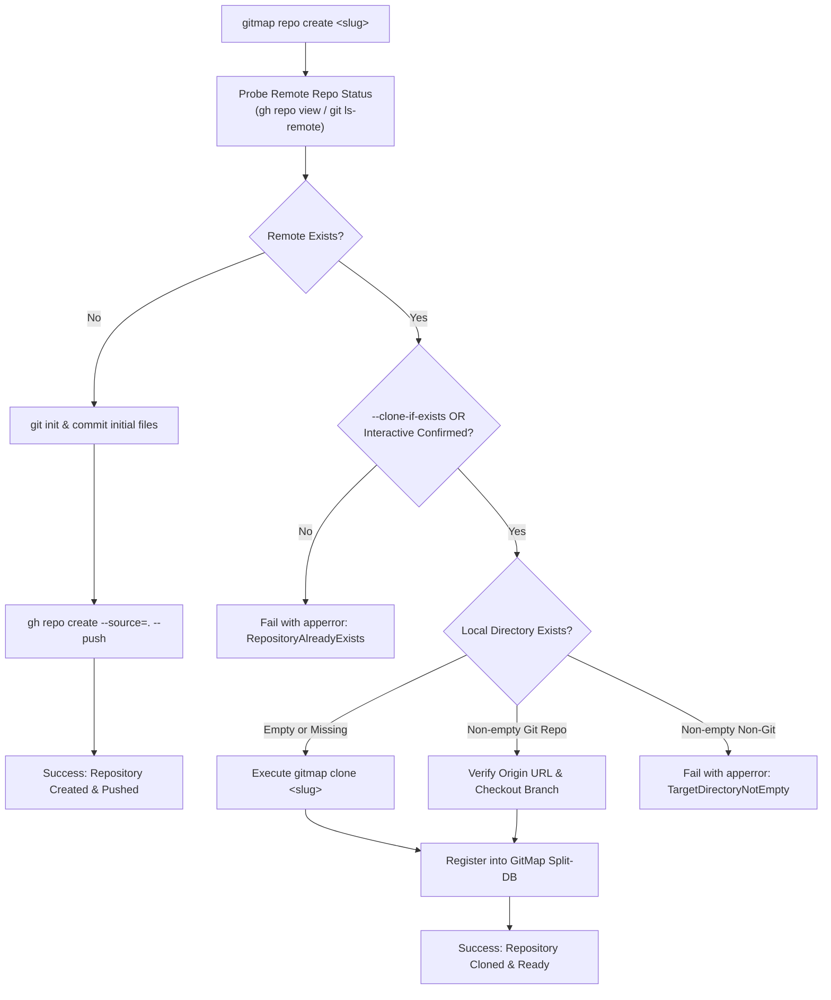
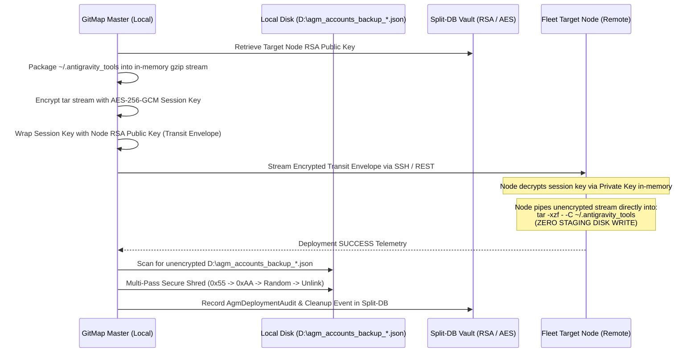
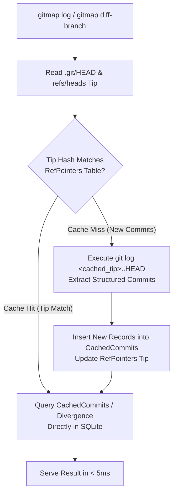
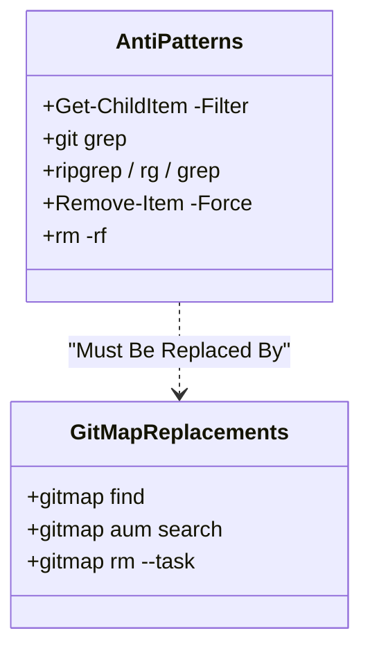

# Component Specification: Smart Repo Creation, AGM Fleet Deployment, Cached Logs, Help Menu & Anti-Pattern Governance

> **Specification ID:** 240-gitmap-mcp-ai-analysis-muse-installer-and-agm-fleet  
> **Component Spec Part:** 02 (Subsystems 05–08 & Anti-Pattern Governance)  
> **Status:** Ratified  
> **Version:** 1.0.0  
> **Target Subsystems:**  
> - `cli/cmd/repo_create_remote.go` & `cli/cmd/repo_create_smart.go` (Smart Repo Creation & Clone Fallback)  
> - `cli/cmdnodes/nodes_deploy_agm.go` & `cli/cmdnodes/nodes_deploy_transit.go` (AGM Fleet Deployment, Zero-Disk Transit Streaming & Backup Auto-Removal)  
> - `cli/cmdlog/` & `cli/cmdgit/` (High-Speed Split-DB Cached Git Logs & Branch Comparison)  
> - `cli/cmd/root.go` & `cli/cmd/rootusage.go` (Concise Default Help Menu vs Full Help)  
> - `02-spec/02-coding-guidelines/` (Anti-Pattern Replacements: Banning `Get-ChildItem -Filter` and `git grep`)  

---

## 1. Subsystem: Smart Repository Creation & Clone Fallback (`gitmap repo create`)

### 1.1 Overview & Architecture
`gitmap repo create` (and its alias `gitmap create`) allows developers and AI agents to scaffold local and remote repositories in a single operation. When targeting an existing remote repository slug on GitHub, the previous implementation blindly attempted force pushes or crashed with GitHub CLI collisions.

The Smart Repository Creation component implements proactive remote discovery and intelligent clone fallback:
1. **Pre-flight Remote Probing:** Before initializing a local repository, the engine queries the remote host (`gh repo view <slug>` or `git ls-remote <url>`) to verify remote existence.
2. **Interactive TUI Confirmation:** If the remote repository exists and the user runs in an interactive terminal, GitMap prompts:  
   `"⚠️ Remote repository '<slug>' already exists. Clone it instead? [y/N/ui]"`
3. **Automated AI Fallback Flags:** Non-interactive agents can specify `--clone-if-exists` (or `--fallback-clone`) to automatically convert the creation command into a high-speed GitMap clone operation.
4. **Local Directory Collision Guard:** If the target directory already exists locally and contains an initialized Git worktree tracking the same remote, GitMap automatically links and pulls rather than aborting.



### 1.2 Data Structures & Go Types

```go
package cmdrepo

import (
	"time"

	"github.com/alimtvnetwork/gitmap-v28/cli/apperror"
)

// RepoCreateAction defines the concrete execution action taken by the engine.
type RepoCreateAction string

const (
	ActionCreatedNew RepoCreateAction = "created_new"
	ActionClonedRepo RepoCreateAction = "cloned_existing"
	ActionLinkedRepo RepoCreateAction = "linked_existing"
	ActionAborted    RepoCreateAction = "aborted"
)

// RepoCreateOptions encapsulates user and agent parameters for repository creation.
type RepoCreateOptions struct {
	Name             string `json:"name"`
	Slug             string `json:"slug"`
	LocalDir         string `json:"local_dir"`
	IsPublic         bool   `json:"is_public"`
	IsPrivate        bool   `json:"is_private"`
	IsSkipRemote     bool   `json:"is_skip_remote"`
	CloneIfExists    bool   `json:"clone_if_exists"`
	IsNonInteractive bool   `json:"is_non_interactive"`
	IsInteractiveUI  bool   `json:"is_interactive_ui"`
	IsDryRun         bool   `json:"is_dry_run"`
	IsJSON           bool   `json:"is_json"`
}

// RemoteRepoProbeResult details remote repository inspection telemetry.
type RemoteRepoProbeResult struct {
	Exists      bool   `json:"exists"`
	Owner       string `json:"owner"`
	Name        string `json:"name"`
	SSHURL      string `json:"ssh_url"`
	HTTPSURL    string `json:"https_url"`
	DefaultBranch string `json:"default_branch"`
	IsPrivate   bool   `json:"is_private"`
	ProbeDurationMs int64 `json:"probe_duration_ms"`
}

// RepoCreateResult represents the outcome of the repository creation or clone operation.
type RepoCreateResult struct {
	ActionTaken   RepoCreateAction `json:"action_taken"`
	Slug          string           `json:"slug"`
	LocalPath     string           `json:"local_path"`
	RemoteURL     string           `json:"remote_url"`
	DefaultBranch string           `json:"default_branch"`
	ExecutionMs   int64            `json:"execution_ms"`
	Message       string           `json:"message"`
}
```

### 1.3 Function Signatures & Interfaces

```go
// RemoteRepoDetector provides methods to probe remote repositories across git providers.
type RemoteRepoDetector interface {
	ProbeRemote(slug string) (*RemoteRepoProbeResult, error)
}

// SmartRepoCreator orchestrates creation or clone fallback.
type SmartRepoCreator interface {
	CreateOrClone(opts RepoCreateOptions) (*RepoCreateResult, *apperror.AppError)
}

// ProbeGitHubRemote probes GitHub using the gh CLI or git ls-remote.
func ProbeGitHubRemote(slug string) (*RemoteRepoProbeResult, error)

// ResolveLocalDirectoryState determines whether the local target directory is clean, non-existent, or git-tracked.
func ResolveLocalDirectoryState(dirPath string) (isMissing bool, isEmpty bool, isGitRepo bool, err error)

// ExecuteCloneFallback executes clone fallback into target directory and registers the project.
func ExecuteCloneFallback(probe *RemoteRepoProbeResult, opts RepoCreateOptions) (*RepoCreateResult, *apperror.AppError)
```

### 1.4 CLI Syntax & Flags
- `gitmap repo create <name> [dir] [slug] [flags]`
- `gitmap create <name> [flags]`

| Flag | Short | Default | Description |
| :--- | :--- | :--- | :--- |
| `--clone-if-exists` | `-c` | `false` | Automatically clone remote repository if it already exists |
| `--fallback-clone` | | `false` | Alias for `--clone-if-exists` |
| `--public` | | `false` | Create as public GitHub repository |
| `--private` | | `true` | Create as private GitHub repository (default) |
| `--skip-remote` | | `false` | Initialize local git repository only without remote creation |
| `--yes` | `-y` | `false` | Non-interactive mode; auto-confirm clone prompts |
| `--ui` | | `false` | Launch interactive terminal UI prompt on collision |
| `--dry-run` | `-n` | `false` | Simulate creation and probe checks without disk or remote mutations |
| `--json` | `-j` | `false` | Emit structured JSON output |

---

## 2. Subsystem: AGM Fleet Deployment, Zero-Disk Transit Streaming & Backup Auto-Removal

### 2.1 Overview & Security Invariant
The Antigravity Manager (AGM) fleet deployment subsystem (`cli/cmdnodes/nodes_deploy_agm.go`) distributes credentials and authentication tokens across all connected nodes in the cluster.

**Critical Security Deficiencies in Prior Design:**
1. Staging archives were written unencrypted to disk at `C:\Windows\Temp\agm_accounts_sync.tar.gz` and `/tmp/agm_accounts_sync.tar.gz`.
2. Operators frequently left plaintext backup JSON files on disk (e.g., `D:\agm_accounts_backup_2026-10-06.json`).
3. Payload transit across REST or SSH channels was unencrypted before transport layer encapsulation.

**Mandatory Security Invariants:**
- **Zero-Disk Invariant:** Credentials and archives must NEVER be written as staging files on target nodes. The deployment engine must stream data directly via standard input into memory-backed unarchivers (`tar -xzf - -C ~/.antigravity_tools`).
- **End-to-End Cryptography:** Payloads are symmetrically encrypted using AES-256-GCM with dynamic session keys wrapped by node RSA public keys stored in the GitMap Split-DB vault (`installation.db`).
- **Temporary Backup Auto-Removal:** Upon successful multi-node deployment, GitMap executes a secure multi-pass shred (`SecureShredFile`) on all local temporary backup JSON files matching `D:\agm_accounts_backup_*.json` and OS temporary paths.
- **REST Endpoints:** Dual synchronous deployment endpoints on GitMap daemon (`POST /api/v1/agm/deploy`) and Antigravity Manager (`POST /api/v1/accounts/import`) secured via bearer JWT tokens.



### 2.2 Data Structures & Cryptographic Types

```go
package cmdnodes

import (
	"time"
)

// AgmTransitEnvelope encapsulates an encrypted credential deployment payload.
type AgmTransitEnvelope struct {
	Version           string    `json:"version"`             // "v1-aes256gcm"
	TargetNodeAlias   string    `json:"target_node_alias"`
	WrappedKeyHex     string    `json:"wrapped_key_hex"`     // RSA-OAEP encrypted AES key
	NonceHex          string    `json:"nonce_hex"`           // 12-byte GCM nonce
	CiphertextBase64  string    `json:"ciphertext_base64"`   // AES-256-GCM encrypted tarball
	TotalAccounts     int       `json:"total_accounts"`
	PayloadSha256     string    `json:"payload_sha256"`
	ExpiresAt         time.Time `json:"expires_at"`          // 5-minute replay window
}

// AgmBackupCleanupRecord documents shredded temporary backup files.
type AgmBackupCleanupRecord struct {
	Id           string    `json:"id"`
	FilePath     string    `json:"file_path"`
	FileSizeBytes int64    `json:"file_size_bytes"`
	PassCount    int       `json:"pass_count"`          // Standard: 3 passes
	ShreddedAt   time.Time `json:"shredded_at"`
	Status       string    `json:"status"`              // "shredded", "failed"
	ErrorMessage string    `json:"error_message,omitempty"`
}

// AgmDeploymentAuditRecord records cluster-wide deployment telemetry in Split-DB.
type AgmDeploymentAuditRecord struct {
	Id              string    `json:"id"`
	Initiator       string    `json:"initiator"`
	TotalTargets    int       `json:"total_targets"`
	SuccessTargets  int       `json:"success_targets"`
	AccountsCount   int       `json:"accounts_count"`
	ZeroDiskVerified bool     `json:"zero_disk_verified"`
	BackupsCleaned  int       `json:"backups_cleaned"`
	DeployedAt      time.Time `json:"deployed_at"`
	DurationMs      int64     `json:"duration_ms"`
}
```

### 2.3 SQLite Split-DB Schemas

Stored in `.gitmap/data/installation/agm_fleet.db`:

```sql
-- AGM Fleet Deployment Audit Schema
CREATE TABLE IF NOT EXISTS AgmDeploymentAudit (
    Id TEXT PRIMARY KEY,
    Initiator TEXT NOT NULL,
    TotalTargets INTEGER NOT NULL,
    SuccessTargets INTEGER NOT NULL,
    AccountsCount INTEGER NOT NULL,
    ZeroDiskVerified INTEGER NOT NULL DEFAULT 1, -- 1 = true, 0 = false
    BackupsCleaned INTEGER NOT NULL DEFAULT 0,
    DeployedAt DATETIME NOT NULL,
    DurationMs INTEGER NOT NULL
);

CREATE INDEX IF NOT EXISTS idx_agm_deploy_time ON AgmDeploymentAudit(DeployedAt DESC);

-- AGM Temporary Backup Cleanup Audit Schema
CREATE TABLE IF NOT EXISTS AgmBackupCleanupAudit (
    Id TEXT PRIMARY KEY,
    DeploymentId TEXT,
    FilePath TEXT NOT NULL,
    FileSizeBytes INTEGER NOT NULL,
    PassCount INTEGER NOT NULL DEFAULT 3,
    ShreddedAt DATETIME NOT NULL,
    Status TEXT NOT NULL, -- 'shredded', 'failed'
    ErrorMessage TEXT,
    FOREIGN KEY(DeploymentId) REFERENCES AgmDeploymentAudit(Id)
);

CREATE INDEX IF NOT EXISTS idx_agm_cleanup_time ON AgmBackupCleanupAudit(ShreddedAt DESC);
```

### 2.4 Secure Shredding & Zero-Disk Streaming Contracts

```go
// SecureShredFile overwrites file contents with 3 passes before unlinking.
// Pass 1: 0x55, Pass 2: 0xAA, Pass 3: Cryptographically secure random bytes.
func SecureShredFile(filePath string) error

// DiscoverTemporaryBackupFiles searches target drives for unencrypted AGM backups.
// Probes: "D:\agm_accounts_backup_*.json", "%USERPROFILE%\agm_accounts_backup_*.json"
func DiscoverTemporaryBackupFiles() ([]string, error)

// StreamZeroDiskAGM streams in-memory decrypted tar archive directly to target process stdin.
// Windows command: powershell -NoProfile -Command "tar.exe -xzf - -C $env:USERPROFILE\.antigravity_tools"
// Unix command: sh -c "mkdir -p ~/.antigravity_tools && tar -xzf - -C ~/.antigravity_tools"
func StreamZeroDiskAGM(client *ssh.Client, conn db.SSHConnection, tarData []byte) error

// EncryptTransitEnvelope wraps raw tar bytes into an authenticated transit envelope.
func EncryptTransitEnvelope(nodeConn db.SSHConnection, tarData []byte, accountCount int) (*AgmTransitEnvelope, error)
```

### 2.5 CLI Syntax & Flags
- `gitmap nodes deploy agm-accounts [flags]`
- `gitmap agm cleanup-backups [flags]`

| Flag | Short | Default | Description |
| :--- | :--- | :--- | :--- |
| `--cleanup-backups` | | `true` | Auto-shred unencrypted temporary backup JSONs on successful deploy |
| `--skip-cleanup` | | `false` | Preserve temporary backup JSONs (requires confirmation) |
| `--target <alias>` | `-t` | `all` | Specific node alias or IP to target |
| `--except <alias>` | `-e` | `main` | Exclude specific nodes from deployment |
| `--zero-disk` | | `true` | Enforce direct stdin in-memory extraction (zero disk write) |
| `--dry-run` | `-n` | `false` | Validate connectivity and simulation without mutating targets |
| `--json` | `-j` | `false` | Emit JSON deployment telemetry |

---

## 3. Subsystem: High-Speed Cached Git Logs & Branch Comparison

### 3.1 Overview & Performance Benchmarks
AI agents and developer tooling frequently execute `git log` and branch difference checks. Native Git execution on repositories with over 10,000 commits or large working trees incurs 250ms–600ms per invocation.

**Subsystem Objectives:**
1. **Sub-5ms Log Retrieval:** Cache commit metadata in Split-DB SQLite (`.gitmap/data/repodb/git_logs.db`).
2. **Incremental Delta Synchronization:** When `HEAD` ref changes, GitMap executes an incremental sync (`git log <cached_tip>..HEAD`) rather than re-reading repository history.
3. **Graph Topology & Branch Comparison:** Compute divergence base (`git merge-base`), commits ahead/behind, and file difference summaries in SQLite without invoking subshells.



### 3.2 Database Schemas (SQLite Split-DB)

Stored in `.gitmap/data/repodb/git_logs.db`:

```sql
-- Cached Commits Table
CREATE TABLE IF NOT EXISTS CachedCommits (
    CommitHash TEXT PRIMARY KEY,
    ParentHashes TEXT,              -- Space-separated parent hashes
    AuthorName TEXT NOT NULL,
    AuthorEmail TEXT NOT NULL,
    AuthorDate DATETIME NOT NULL,
    CommitterName TEXT NOT NULL,
    CommitterEmail TEXT NOT NULL,
    CommitDate DATETIME NOT NULL,
    Subject TEXT NOT NULL,
    Body TEXT,
    FilesChangedCount INTEGER NOT NULL DEFAULT 0,
    LinesInserted INTEGER NOT NULL DEFAULT 0,
    LinesDeleted INTEGER NOT NULL DEFAULT 0,
    StatsJson TEXT,                 -- JSON array of per-file line additions/deletions
    CachedAt DATETIME NOT NULL
);

CREATE INDEX IF NOT EXISTS idx_cached_commit_date ON CachedCommits(CommitDate DESC);
CREATE INDEX IF NOT EXISTS idx_cached_author ON CachedCommits(AuthorName);

-- Branch & Ref Pointers Tracking Table
CREATE TABLE IF NOT EXISTS RefPointers (
    RefName TEXT PRIMARY KEY,       -- e.g., 'refs/heads/main', 'HEAD'
    TipCommitHash TEXT NOT NULL,
    LastSyncedAt DATETIME NOT NULL,
    TotalCommitsCount INTEGER NOT NULL DEFAULT 0,
    FOREIGN KEY(TipCommitHash) REFERENCES CachedCommits(CommitHash)
);

-- Branch Comparison Cache Table
CREATE TABLE IF NOT EXISTS BranchDiffCache (
    BranchA TEXT NOT NULL,
    BranchB TEXT NOT NULL,
    MergeBaseHash TEXT NOT NULL,
    AheadCount INTEGER NOT NULL,
    BehindCount INTEGER NOT NULL,
    FilesSummaryJson TEXT NOT NULL, -- JSON summary of altered files
    CachedAt DATETIME NOT NULL,
    PRIMARY KEY (BranchA, BranchB)
);
```

### 3.3 Data Structures & Go Types

```go
package cmdlog

import (
	"time"
)

// CachedCommitRecord represents a commit stored in SQLite Split-DB.
type CachedCommitRecord struct {
	CommitHash        string    `json:"commit_hash"`
	ParentHashes      []string  `json:"parent_hashes"`
	AuthorName        string    `json:"author_name"`
	AuthorEmail       string    `json:"author_email"`
	CommitDate        time.Time `json:"commit_date"`
	Subject           string    `json:"subject"`
	Body              string    `json:"body,omitempty"`
	FilesChangedCount int       `json:"files_changed_count"`
	LinesInserted     int       `json:"lines_inserted"`
	LinesDeleted      int       `json:"lines_deleted"`
	CachedAt          time.Time `json:"cached_at"`
}

// LogQueryOptions configures filtered commit retrieval.
type LogQueryOptions struct {
	Limit         int       `json:"limit"`
	Since         time.Time `json:"since,omitempty"`
	Author        string    `json:"author,omitempty"`
	FileFilter    string    `json:"file_filter,omitempty"`
	IsRefresh     bool      `json:"is_refresh"`
	IsGraph       bool      `json:"is_graph"`
	IsStat        bool      `json:"is_stat"`
	IsJSON        bool      `json:"is_json"`
}

// BranchComparisonResult contains divergence and diff telemetry between two branches.
type BranchComparisonResult struct {
	BranchA       string               `json:"branch_a"`
	BranchB       string               `json:"branch_b"`
	MergeBaseHash string               `json:"merge_base_hash"`
	AheadCount    int                  `json:"ahead_count"`   // Commits in BranchA not in BranchB
	BehindCount   int                  `json:"behind_count"`  // Commits in BranchB not in BranchA
	AheadCommits  []CachedCommitRecord `json:"ahead_commits"`
	BehindCommits []CachedCommitRecord `json:"behind_commits"`
	FilesAdded    int                  `json:"files_added"`
	FilesModified int                  `json:"files_modified"`
	FilesDeleted  int                  `json:"files_deleted"`
	TotalInsertions int                `json:"total_insertions"`
	TotalDeletions  int                `json:"total_deletions"`
	DurationMs    int64                `json:"duration_ms"`
}
```

### 3.4 CLI Syntax & Flags
- `gitmap log [flags]`
- `gitmap diff-branch [branchA] [branchB] [flags]`
- `gitmap branch compare [branchA] [branchB] [flags]`

| Command | Flags | Description |
| :--- | :--- | :--- |
| `gitmap log` | `-n, --limit <n>` (default 20) | Number of commits to display |
| `gitmap log` | `-r, --refresh` | Invalidate cache and perform full Git reconciliation |
| `gitmap log` | `--author <name>` | Filter commits by author string |
| `gitmap log` | `--stat` | Show file mutation stats per commit |
| `gitmap log` | `--graph` | Render ASCII branch topology graph |
| `gitmap diff-branch` | `--summary` | Show high-level ahead/behind counts and file count |
| `gitmap diff-branch` | `--commits-only` | List only unique commit subjects |
| `gitmap diff-branch` | `--files-only` | List only modified file paths |
| `gitmap diff-branch` | `--json` | Emit structured comparison JSON |

---

## 4. Subsystem: Concise Default Help Menu vs Full Categorized Help

### 4.1 Problem Statement
Currently, running bare `gitmap` without arguments triggers `printUsage()` in `cli/cmd/rootusage.go`, dumping over 380 lines of categories, flags, and obscure subcommands. This swamps terminal output and wastes over 4,000 tokens when invoked by autonomous AI agents.

### 4.2 Behavior Contract
1. **Bare Invocations (`gitmap` with 0 arguments):**
   - Must output less than 25 lines of ANSI text.
   - Must display:
     * GitMap banner with semantic version, build date, and commit SHA.
     * Active repository workspace context (Repository Name, Current Branch, Clean/Dirty indicator).
     * Top 6 primary high-velocity commands.
     * Helpful footer directive: `"Run 'gitmap help' for full 80+ command reference, or 'gitmap <command> --help' for details."`
2. **Explicit Help Invocations (`gitmap help`, `gitmap --help`, `gitmap -h`):**
   - Displays the exhaustive categorized catalog (`GET STARTED`, `WORK WITH REPOS`, `RELEASE & HISTORY`, `PROJECTS & DATA`, `CLUSTER & NETWORK`, etc.).

### 4.3 Concise Help Terminal Layout Specification

```text
  gitmap v6.292.0 (windows/amd64) — Autonomous Repository & Multi-Agent CLI
  Workspace: gitmap (branch: feat/task-240 ● Clean)

  Core AI & Developer Commands:
    gitmap aum search <query>    Sub-millisecond indexed codebase search
    gitmap find <pattern>        Locate files across repository instantly
    gitmap cpc "<module> - msg"  Atomic chore commit with safety gates
    gitmap log [-n 20]           High-speed cached commit history (<5ms)
    gitmap diff-branch [a] [b]   Compare branch divergence and file changes
    gitmap repo create <name>    Smart repository creation with clone fallback

  💡 Tip: Run 'gitmap help' for full command catalog, or 'gitmap <command> --help'.
```

### 4.4 Dispatch Architecture Modifications

```go
// In cli/cmd/root.go:
func Run() {
	initConsole()

	if len(os.Args) < 2 {
		PrintBinaryLocations()
		printConciseUsage() // Concise <= 25 lines menu
		return
	}

	// In cli/cmd/rootusage.go:
	func printConciseUsage() {
		renderConciseBanner()
		renderActiveWorkspaceContext()
		renderCoreCommandPointers()
		renderConciseFooter()
	}

	func printFullUsage() {
		// Existing comprehensive 380-line grouped catalog
	}
}
```

---

## 5. Anti-Pattern Replacement Specifications

### 5.1 Prohibited Commands Catalog
Autonomous agents frequently fall back to generic shell commands that bypass GitMap's caching layers, fail on cross-platform nodes, or risk irreversible file deletion. The following commands are strictly prohibited across all scripts, prompts, and agent workflows.



| Prohibited Anti-Pattern | Reason for Ban | Mandatory GitMap Replacement |
| :--- | :--- | :--- |
| `Get-ChildItem -Filter` / `dir -Filter` | Windows-only PowerShell cmdlet; fails on Linux/macOS; slow on deep trees | `gitmap find <pattern>` or `gitmap scan --filter <pattern>` |
| `git grep` / `rg` / `grep` | Bypasses SQLite AUM index; misses untracked files; high subprocess overhead | `gitmap aum search "<pattern>"` |
| `Remove-Item -Force` / `rm -rf` | Irreversible data destruction; no audit trail; leaves zero undo capability | `gitmap rm <target> --task <id>` (Safe OS temp backup & undo) |
| Hardcoded absolute paths | Breaks across multi-node fleet and isolated test environments | Strictly workspace-relative Git paths (`cli/...`, `02-spec/...`) |

### 5.2 Concrete Transformation Examples

#### Example 1: File Pattern Search
```powershell
# ❌ PROHIBITED (Slow, Windows-only, bypasses GitMap cache)
Get-ChildItem -Path 03-ai-scripts -Filter "*reconcile*"
dir -Recurse -Filter "*.go"

# ✅ MANDATORY (Cross-platform, instant Split-DB lookup)
gitmap find "reconcile"
gitmap find "*.go"
```

#### Example 2: Codebase Text Search
```bash
# ❌ PROHIBITED (Slow subprocess, ignores AUM semantic index)
git grep "func runFix" cli/
rg "func runFix" cli/

# ✅ MANDATORY (Sub-millisecond indexed search across 7,000+ files)
gitmap aum search "func runFix"
```

#### Example 3: File Deletion During Cleanup
```powershell
# ❌ PROHIBITED (Permanent data loss without undo)
Remove-Item patch_*.py -Force
rm -rf tmp_build_output/

# ✅ MANDATORY (Backed up to OS temp with undo capability)
gitmap rm patch_*.py --task 240
gitmap rm tmp_build_output/ --task 240
# Revertable at any time via:
gitmap rm --undo --task 240
```

### 5.3 Automated Linter Integration
Violations of these anti-patterns are enforced via `check-anti-patterns.py` during pre-commit and CI/CD quality gates:
1. Regex scanner checks `.sh`, `.ps1`, `.py`, `.md`, and `.go` files for forbidden cmdlets.
2. Pull requests and commits containing prohibited patterns are rejected with clear remediation instructions.

---

## 6. Subsystem Verification & Quality Gates

### 6.1 Unit & Integration Test Specifications

| Subsystem | Test File | Test Cases |
| :--- | :--- | :--- |
| Smart Repo Create | `cli/cmdrepo/repo_create_smart_test.go` | 1. Remote not found -> proceeds with normal creation.<br/>2. Remote exists + `--clone-if-exists` -> clones repo.<br/>3. Remote exists without flag -> returns structured error.<br/>4. Target directory exists with clean git repo -> links remote origin. |
| AGM Zero-Disk Deploy | `cli/cmdnodes/nodes_deploy_transit_test.go` | 1. Validates zero staging files written to disk.<br/>2. Encrypted transit envelope decrypts successfully with node private key.<br/>3. `SecureShredFile` overwrites with 3 passes before deletion.<br/>4. Temporary backup files (`D:\agm_accounts_backup_*.json`) discovered and shredded. |
| Cached Git Logs | `cli/cmdlog/log_cache_test.go` | 1. Cache hit serves in <5ms.<br/>2. HEAD change triggers incremental delta sync.<br/>3. `BranchComparison` accurately computes ahead/behind commit sets. |
| Concise Help Menu | `cli/cmd/rootusage_test.go` | 1. Bare invocation output line count <= 25.<br/>2. `gitmap help` outputs full catalog.<br/>3. Workspace branch name displayed dynamically. |

### 6.2 Pre-Release Compliance Checklist
- [ ] Zero nested `if` statements exceeding depth of 2 (guard clauses applied).
- [ ] No camelCase JSON keys; strictly PascalCase or standardized snake_case.
- [ ] All boolean variables and struct fields prefixed with `Is...` or `Has...`.
- [ ] Structured errors wrapped with `apperror.WrapSimple` or `apperror.NewSimple`.
- [ ] Strictly relative Git paths emitted across all CLI outputs.
