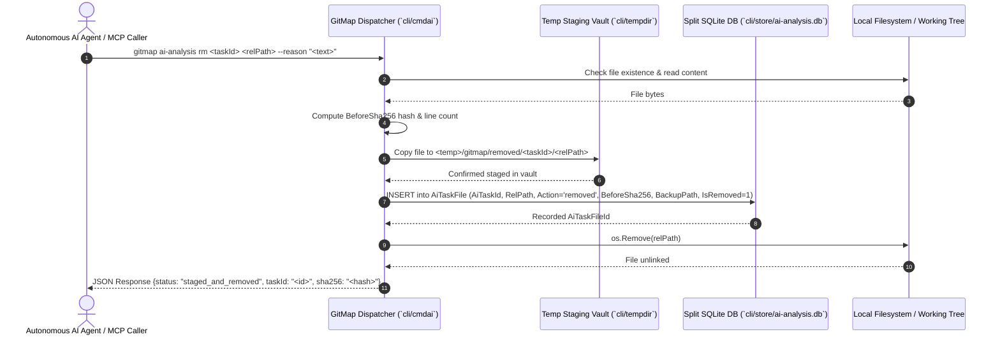
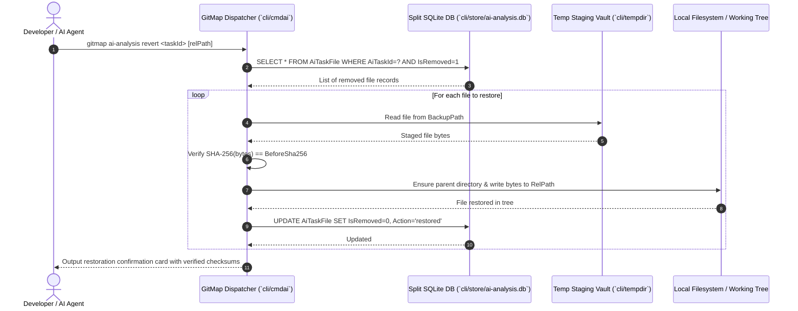
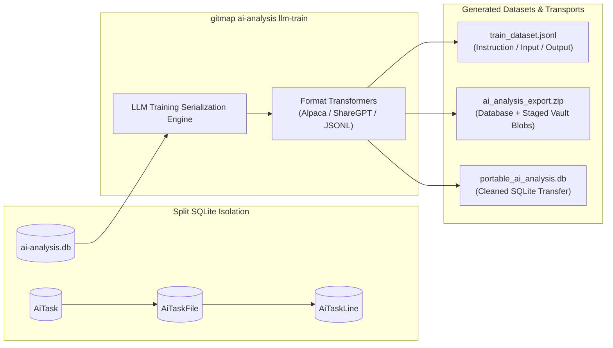

# 240-mcp-server-ai-analysis-agm-nodes-and-git-cache: AI MCP Server, AI Analysis Engine & Git Cache Architecture Specification

- **Spec ID:** `02-spec/21-app/240-mcp-server-ai-analysis-agm-nodes-and-git-cache/01-architecture-spec.md`
- **Status:** `APPROVED`
- **Version:** `1.0.0`
- **Subsystem:** AI Model Context Protocol (MCP) Server, AI Analysis Engine, Split SQLite Storage, Zero-Loss File Removal & Reversion, LLM Training Export, Minimal Root Help UX
- **Dependencies:** `cli/store`, `cli/tempdir`, `cli/cmd`, `cli/apperror`, `cli/termpad`, `cli/apppaths`, `cli/cmdai`
- **Version Baseline:** `v6.500.0`
- **Target Version:** `v6.501.0`

---

## 1. Executive Summary & Background

### 1.1 GitMap as an AI MCP Server & Autonomous Developer Companion
Modern software development increasingly relies on autonomous AI coding agents (such as Google Antigravity, Claude Desktop, Cursor, Cline, Windsurf, and custom LLM worker swarms). These agents require fast, deterministic, and high-fidelity interaction with local codebases. Standard developer tools present significant friction for automated agents:
1. Shell commands emit unstructured, decorative terminal output that requires brittle regex scraping.
2. File edits and deletions lack atomic staging, resulting in catastrophic unrecoverable state when an AI agent hallucinates or crashes midway through a refactoring loop.
3. Help screens dump hundreds of lines of ANSI text on simple invocations, blowing through LLM context windows and confusing automated tool callers.
4. Reasoning behind line-level mutations is lost immediately after commit, preventing retrospective AI auditing, fine-tuning dataset generation, and rule verification.

**GitMap** resolves these challenges by functioning simultaneously as a high-speed CLI developer companion for human operators and a native **Model Context Protocol (MCP) Server & Autonomous AI Companion**. GitMap provides:
- High-speed repository discovery, AST-aware file navigation, and indexed caching.
- Isolated Split SQLite persistence for AI task records, modified files, and line diffs.
- Defensive staging vaults that guarantee **zero data loss** during automated code restructuring and file unlinking.
- Deterministic extraction of fine-tuning datasets (`gitmap ai-analysis llm-train`) to train next-generation LLM agents directly on verified human-in-the-loop and autonomous refactoring decisions.
- A minimal, distraction-free root CLI help contract designed for both automated process detection and human clarity.

```
+----------------------------------------------------------------------------------------------------+
|                                    GITMAP AI SYSTEM TOPOLOGY                                       |
+----------------------------------------------------------------------------------------------------+
|                                                                                                    |
|   +--------------------------+                         +-----------------------------------+       |
|   |   Autonomous AI Agents   |                         |       Human CLI Operator          |       |
|   |  (Antigravity / Cursor / |                         |     (PowerShell / Bash / Zsh)     |       |
|   |   Claude / Cline / MCP)  |                         +-----------------+-----------------+       |
|   +------------+-------------+                                           |                         |
|                |                                                         |                         |
|   MCP JSON-RPC | [STDIN/STDOUT]                         Cobra CLI Dispatch| [Bare / Subcommands]    |
|                v                                                         v                         |
|   +----------------------------------------------------------------------------------------+       |
|   |                             GITMAP CORE DISPATCH & ROUTER                              |       |
|   |                                  (cli/cmd & cli/cmdai)                                 |       |
|   +----+--------------------------+-----------------------+--------------------------+-----+       |
|        |                          |                       |                          |             |
|        v                          v                       v                          v             |
|   [Minimal Root Help]     [MCP Protocol Engine]  [AI Analysis Engine]      [Zero-Loss Vault]       |
|   - Version Banner        - JSON-RPC 2.0         - Task Tracking           - SHA-256 Hashing       |
|   - Location Triplet      - Tool Discovery       - Line-Diff Audit         - Temp Staging          |
|   - Quick Guidance        - Resource Provider    - Rule Violation Map      - Atomic Reversion      |
|                                                           |                          |             |
|                                                           v                          v             |
|                                                  +-----------------+   +---------------------+     |
|                                                  | Split SQLite DB |   |   Filesystem Vault  |     |
|                                                  | ai-analysis.db  |   | <temp>/gitmap/      |     |
|                                                  | (WAL / Conns=1) |   |  removed/<taskId>/  |     |
|                                                  +--------+--------+   +---------------------+     |
|                                                           |                                        |
|                                                           v                                        |
|                                                  +----------------------------------+              |
|                                                  | LLM Training Exporter & Pruner   |              |
|                                                  | (JSONL / ZIP / Cross-OS Export)  |              |
|                                                  +----------------------------------+              |
+----------------------------------------------------------------------------------------------------+
```

---

## 2. Architectural Invariants (Non-Negotiable)

Every component of the AI Analysis subsystem, MCP server, and root CLI interface must strictly uphold five architectural invariants:

### 2.1 Invariant 1: Split SQLite Isolation (`ai-analysis.db`)
All AI execution tasks, file mutations, line-by-line diffs, and architectural justifications are isolated inside a dedicated Split SQLite database located at:
```text
.gitmap/data/ai-analysis/ai-analysis.db
```
- **Total Decoupling:** Under no circumstances may AI analysis records be written into `gitmap.db`, `installation.db`, or `repodb/pipeline.db`.
- **Concurrency & WAL Mode:** The database must run with Write-Ahead Logging (`PRAGMA journal_mode=WAL;`), synchronous normal (`PRAGMA synchronous=NORMAL;`), and single-connection serialization (`db.SetMaxOpenConns(1)`).
- **Graceful Scaffolding:** If `.gitmap/data/ai-analysis/` does not exist, the storage provider automatically constructs the directory hierarchy with mode `0755`.

### 2.2 Invariant 2: Zero-Loss File Removal Staging
Autonomous AI agents frequently prune, decompose, or delete obsolete files. To prevent accidental data loss:
- **Mandatory Pre-Deletion Staging:** Before any file is unlinked from the repository by the AI subsystem, it is copied into the OS temp directory staging vault:
  ```text
  <temp>/gitmap/removed/<taskId>/<relPath>
  ```
- **Cryptographic Checksumming:** A pre-deletion SHA-256 hash (`BeforeSha256`) is computed and recorded in `AiTaskFile`.
- **Instant Reversion Guarantee:** Any file deletion can be restored at any time via `gitmap ai-analysis revert <taskId> [relPath]`. Reversion re-verifies the stored checksum prior to copying the file back to the working tree.

### 2.3 Invariant 3: Strict Relative Path Hygiene
All database tables, JSON envelopes, telemetry payloads, and console output must strictly record and display **forward-slash normalized relative Git paths** (e.g., `02-spec/21-app/...`, `cli/store/...`, `cmd/...`).
- **No Absolute Path Leakage:** Absolute operating system paths (such as `C:\projects\repo\...` or `/home/user/...`) must never be stored in primary relational keys, output tables, or LLM training exports.
- **Cross-Platform Portability:** Databases exported from Windows must be seamlessly readable and restorable on Linux and macOS workstations. An optional `AbsPath` column in `AiTaskFile` is reserved strictly for ephemeral local process debugging and is never used as a lookup key.

### 2.4 Invariant 4: Minimal Root Help Invariant
Invoking bare `gitmap` (with zero arguments) must NEVER dump the complete command catalog into the terminal.
- **Bare Invocation (`gitmap`):** Outputs exclusively a three-part compact summary:
  1. **Version Block:** Compact brand & version banner.
  2. **Location Triplet:** The three canonical runtime paths: Executable Binary, Config File, and Database/Data Directory.
  3. **Short Footer:** A concise guidance hint directing users to `gitmap help` or `gitmap -h` for full documentation, accompanied by two quick-start examples (`gitmap scan`, `gitmap clone <url>`).
- **Full Catalog Reservation:** The complete categorized command catalog (Get Started, Repos, Release, Projects, Advanced, Fleet) is strictly reserved for explicit help flags (`gitmap help`, `gitmap -h`, `gitmap --help`).

### 2.5 Invariant 5: Deterministic AI Reasoning Traceability
Every mutation generated by an AI agent must be deterministically explainable:
- Every `AiTask` must record its high-level goal (`Goal`), architectural category (`Category`), and strategic reasoning (`Reasoning`).
- Every modified or deleted file (`AiTaskFile`) must record its specific rationale (`Reasoning`) and mutation action (`Action`).
- Every line diff (`AiTaskLine`) must record the violated rule (`RuleViolation`), diff classification (`DiffKind`), and surgical reason (`Reasoning`).

---

## 3. System Topology & Execution Workflows

### 3.1 AI Analysis & Safe File Removal Workflow



### 3.2 File Revert & Restoration Workflow



### 3.3 LLM Training Export & Dataset Serialization



---

## 4. Split SQLite Data Architecture (`ai-analysis.db`)

The storage engine implements GitMap's Split-DB conventions: singular PascalCase tables, primary key `{Table}Id`, positive affirmative booleans prefixed with `Is` or `Has`, standard documentation columns (`Description`, `Notes`, `Comments`), and Unix epoch timestamps in seconds.

### 4.1 SQL DDL Schema

```sql
-- ============================================================================
-- GitMap Split-DB: AI Analysis & MCP Server Engine
-- Path: .gitmap/data/ai-analysis/ai-analysis.db
-- ============================================================================

PRAGMA foreign_keys = ON;
PRAGMA journal_mode = WAL;
PRAGMA synchronous = NORMAL;

-- Table: AiTask
-- Represents an autonomous AI refactoring or analysis session
CREATE TABLE IF NOT EXISTS AiTask (
    AiTaskId        INTEGER PRIMARY KEY AUTOINCREMENT,
    TaskUuid        TEXT NOT NULL UNIQUE,
    Goal            TEXT NOT NULL,
    Status          TEXT NOT NULL DEFAULT 'pending', -- pending, running, completed, failed, reverted
    Category        TEXT NOT NULL DEFAULT 'refactor', -- refactor, audit, cleanup, test, doc
    Reasoning       TEXT NOT NULL,
    TotalFiles      INTEGER NOT NULL DEFAULT 0,
    TotalLines      INTEGER NOT NULL DEFAULT 0,
    IsActive        INTEGER NOT NULL DEFAULT 1,      -- 1 = active, 0 = archived/completed
    HasFailed       INTEGER NOT NULL DEFAULT 0,      -- 1 = failed, 0 = success
    Description     TEXT NOT NULL DEFAULT '',
    Notes           TEXT NOT NULL DEFAULT '',
    Comments        TEXT NOT NULL DEFAULT '',
    CreatedAt       INTEGER NOT NULL,                -- Unix epoch seconds
    CompletedAt     INTEGER NOT NULL DEFAULT 0
);

CREATE INDEX IF NOT EXISTS Idx_AiTask_TaskUuid ON AiTask(TaskUuid);
CREATE INDEX IF NOT EXISTS Idx_AiTask_Status ON AiTask(Status);
CREATE INDEX IF NOT EXISTS Idx_AiTask_IsActive ON AiTask(IsActive);

-- Table: AiTaskFile
-- Catalogs every file touched, modified, staged, or removed during an AI task
CREATE TABLE IF NOT EXISTS AiTaskFile (
    AiTaskFileId    INTEGER PRIMARY KEY AUTOINCREMENT,
    AiTaskId        INTEGER NOT NULL,
    RelPath         TEXT NOT NULL,                   -- Forward-slash relative path
    AbsPath         TEXT NOT NULL DEFAULT '',        -- Local debugging fallback only
    Action          TEXT NOT NULL,                   -- modified, created, removed, analyzed, restored
    BeforeSha256    TEXT NOT NULL DEFAULT '',        -- Pre-mutation hash
    AfterSha256     TEXT NOT NULL DEFAULT '',        -- Post-mutation hash
    BackupPath      TEXT NOT NULL DEFAULT '',        -- Location in <temp>/gitmap/removed/...
    LineCount       INTEGER NOT NULL DEFAULT 0,
    Reasoning       TEXT NOT NULL,                   -- Why this file was touched
    IsModified      INTEGER NOT NULL DEFAULT 0,      -- 1 = content modified
    IsRemoved       INTEGER NOT NULL DEFAULT 0,      -- 1 = removed from working tree
    Description     TEXT NOT NULL DEFAULT '',
    Notes           TEXT NOT NULL DEFAULT '',
    Comments        TEXT NOT NULL DEFAULT '',
    CreatedAt       INTEGER NOT NULL,
    UpdatedAt       INTEGER NOT NULL DEFAULT 0,
    FOREIGN KEY (AiTaskId) REFERENCES AiTask(AiTaskId) ON DELETE CASCADE
);

CREATE INDEX IF NOT EXISTS Idx_AiTaskFile_TaskId ON AiTaskFile(AiTaskId);
CREATE INDEX IF NOT EXISTS Idx_AiTaskFile_RelPath ON AiTaskFile(RelPath);
CREATE INDEX IF NOT EXISTS Idx_AiTaskFile_IsRemoved ON AiTaskFile(IsRemoved);

-- Table: AiTaskLine
-- Detailed diff ledger recording every line substitution, addition, or deletion
CREATE TABLE IF NOT EXISTS AiTaskLine (
    AiTaskLineId    INTEGER PRIMARY KEY AUTOINCREMENT,
    AiTaskFileId    INTEGER NOT NULL,
    LineNumber      INTEGER NOT NULL,                -- 1-indexed line position
    OriginalContent TEXT NOT NULL DEFAULT '',
    ProposedContent TEXT NOT NULL DEFAULT '',
    DiffKind        TEXT NOT NULL,                   -- insert, delete, replace
    RuleViolation   TEXT NOT NULL DEFAULT '',        -- e.g., "nested-if", "magic-string", "pointer-bloat"
    Reasoning       TEXT NOT NULL,                   -- Architectural explanation for this specific line
    IsApplied       INTEGER NOT NULL DEFAULT 0,      -- 1 = applied to working file, 0 = rejected
    Description     TEXT NOT NULL DEFAULT '',
    Notes           TEXT NOT NULL DEFAULT '',
    Comments        TEXT NOT NULL DEFAULT '',
    CreatedAt       INTEGER NOT NULL,
    FOREIGN KEY (AiTaskFileId) REFERENCES AiTaskFile(AiTaskFileId) ON DELETE CASCADE
);

CREATE INDEX IF NOT EXISTS Idx_AiTaskLine_FileId ON AiTaskLine(AiTaskFileId);
CREATE INDEX IF NOT EXISTS Idx_AiTaskLine_RuleViolation ON AiTaskLine(RuleViolation);
CREATE INDEX IF NOT EXISTS Idx_AiTaskLine_IsApplied ON AiTaskLine(IsApplied);
```

### 4.2 Go Struct Models (`cli/store`)

```go
package store

// AiTask models an autonomous AI execution session or refactoring operation.
type AiTask struct {
	AiTaskId    int64  `json:"aiTaskId"`
	TaskUuid    string `json:"taskUuid"`
	Goal        string `json:"goal"`
	Status      string `json:"status"` // "pending", "running", "completed", "failed", "reverted"
	Category    string `json:"category"` // "refactor", "audit", "cleanup", "test", "doc"
	Reasoning   string `json:"reasoning"`
	TotalFiles  int    `json:"totalFiles"`
	TotalLines  int    `json:"totalLines"`
	IsActive    bool   `json:"isActive"`
	HasFailed   bool   `json:"hasFailed"`
	Description string `json:"description"`
	Notes       string `json:"notes"`
	Comments    string `json:"comments"`
	CreatedAt   int64  `json:"createdAt"` // Unix epoch seconds
	CompletedAt int64  `json:"completedAt"`
}

// AiTaskFile catalogs a file investigated, modified, or safely removed.
type AiTaskFile struct {
	AiTaskFileId int64  `json:"aiTaskFileId"`
	AiTaskId     int64  `json:"aiTaskId"`
	RelPath      string `json:"relPath"` // Canonical forward-slash repo relative path
	AbsPath      string `json:"absPath"` // Ephemeral local debugging path only
	Action       string `json:"action"`  // "modified", "created", "removed", "analyzed", "restored"
	BeforeSha256 string `json:"beforeSha256"`
	AfterSha256  string `json:"afterSha256"`
	BackupPath   string `json:"backupPath"` // Path in temp staging vault
	LineCount    int    `json:"lineCount"`
	Reasoning    string `json:"reasoning"`
	IsModified   bool   `json:"isModified"`
	IsRemoved    bool   `json:"isRemoved"`
	Description  string `json:"description"`
	Notes        string `json:"notes"`
	Comments     string `json:"comments"`
	CreatedAt    int64  `json:"createdAt"`
	UpdatedAt    int64  `json:"updatedAt"`
}

// AiTaskLine catalogs line-level mutations with attached reasoning and rule citations.
type AiTaskLine struct {
	AiTaskLineId    int64  `json:"aiTaskLineId"`
	AiTaskFileId    int64  `json:"aiTaskFileId"`
	LineNumber      int    `json:"lineNumber"`
	OriginalContent string `json:"originalContent"`
	ProposedContent string `json:"proposedContent"`
	DiffKind        string `json:"diffKind"` // "insert", "delete", "replace"
	RuleViolation   string `json:"ruleViolation"` // e.g. "nested-if", "magic-string"
	Reasoning       string `json:"reasoning"`
	IsApplied       bool   `json:"isApplied"`
	Description     string `json:"description"`
	Notes           string `json:"notes"`
	Comments        string `json:"comments"`
	CreatedAt       int64  `json:"createdAt"`
}
```

---

## 5. Zero-Loss File Removal & Staging Subsystem

When an AI agent decides to delete obsolete code files, temporary artifacts, or duplicate libraries, GitMap intervenes through the **Zero-Loss File Removal Engine**.

### 5.1 Staging Vault Structure
Files slated for removal are never directly unlinked. Instead, they are moved to a temporary staging tree rooted in the operating system's designated temp directory:
```text
<os_temp_dir>/gitmap/removed/<taskId>/<relPath>
```
For example, deleting `cli/legacy_cache.go` under task `task-4982` stages the blob to:
```text
C:\Users\Admin\AppData\Local\Temp\gitmap\removed\task-4982\cli\legacy_cache.go (Windows)
/tmp/gitmap/removed/task-4982/cli/legacy_cache.go                              (Linux/macOS)
```

### 5.2 Cryptographic Validation Lifecycle
1. **Pre-Read:** The file content is read into memory.
2. **Hash Generation:** SHA-256 is calculated (`BeforeSha256 = hex(sha256(content))`).
3. **Vault Copy:** The file is copied to `<temp>/gitmap/removed/<taskId>/<relPath>`, preserving file mode permissions (`0644`).
4. **Vault Verification:** The staged file in the vault is re-read and its SHA-256 hash verified against `BeforeSha256`.
5. **Database Transaction:** An `AiTaskFile` record is committed with `Action = "removed"`, `BackupPath = "<staged_path>"`, `BeforeSha256 = "<hash>"`, and `IsRemoved = 1`.
6. **Physical Unlink:** `os.Remove(targetPath)` is executed. If unlinking fails, the DB record is flagged and an error returned without corrupting the state.

### 5.3 Revert Engine Workflow
When `gitmap ai-analysis revert <taskId> [relPath]` is invoked:
1. GitMap queries `AiTaskFile` for all records associated with `taskId` where `IsRemoved = 1` (optionally filtered by `relPath`).
2. For each record:
   - GitMap checks that `BackupPath` exists on disk.
   - Computes the SHA-256 of the backup file and confirms it matches `BeforeSha256`.
   - Creates any missing parent directories in the repository working tree.
   - Writes the file bytes back to `RelPath`.
   - Updates `AiTaskFile` setting `IsRemoved = 0` and `Action = "restored"`.
3. If the staging vault files have been wiped by the OS temp cleaner, the command returns a graceful advisory indicating the vault files are expired, preventing silent partial restoration.

---

## 6. LLM Training Dataset Generation, Pruning & Cross-System Transfer

### 6.1 `gitmap ai-analysis llm-train` Dataset Exporter
A core purpose of recording fine-grained line reasoning and rule violations is constructing fine-tuning datasets for specialized coding models.

The `gitmap ai-analysis llm-train` command scans `AiTask`, `AiTaskFile`, and `AiTaskLine` and emits training records formatted for standard instruction tuning:

```json
{
  "id": "gitmap-task-9021-line-42",
  "system": "You are an autonomous senior Go software engineer enforcing strict enterprise coding guidelines.",
  "instruction": "Refactor the following code to eliminate nested conditional branching and inverted boolean guards.",
  "input": "func ValidateToken(token string) bool {\n    if token != \"\" {\n        if len(token) > 10 {\n            return true\n        }\n    }\n    return false\n}",
  "reasoning": "Inverted condition with early exit eliminates nested indentation and adheres to guideline nested-if-and-guard-clauses.",
  "output": "func ValidateToken(token string) bool {\n    if token == \"\" || len(token) <= 10 {\n        return false\n    }\n    return true\n}",
  "rule_violation": "nested-if-and-guard-clauses",
  "file_path": "cli/auth/token.go"
}
```

#### Export Options
- `--out <path>`: Specifies destination file (defaults to `ai-analysis-dataset.jsonl`).
- `--format <alpaca|sharegpt|jsonl>`: Selects dataset schema format.
- `--category <cat>`: Filters by task category (`refactor`, `audit`, etc.).
- `--min-lines <n>`: Filters out trivial single-line whitespace changes.

### 6.2 `gitmap ai-analysis clear` Database Pruning
Over prolonged autonomous sessions, `ai-analysis.db` and the temp staging directory can accumulate substantial data.
- **Selective Retention:** `gitmap ai-analysis clear --days <N>` prunes tasks completed more than $N$ days ago.
- **Safety Vault Cleanup:** When a task is cleared from the database, its corresponding staging directory in `<temp>/gitmap/removed/<taskId>/` is deleted.
- **Dry-Run Mode:** `gitmap ai-analysis clear --dry-run` calculates and previews total records, files, and disk space to be recovered without modifying the database.

### 6.3 Cross-System Transfer Engine
To allow teams and distributed clusters to share AI analysis outcomes:
- **`gitmap ai-analysis export --format <json|zip|sqlite>`:**
  - `json`: Emits a normalized JSON document containing tasks, file records, and line diffs with relative paths.
  - `zip`: Archives the SQLite database alongside all active staged removal blobs into a portable zip bundle.
  - `sqlite`: Runs `VACUUM INTO 'portable_ai_analysis.db'`, stripping local host ephemeral paths.
- **`gitmap ai-analysis import <file>`:**
  - Ingests task records into the target system's local `.gitmap/data/ai-analysis/ai-analysis.db`, remapping primary keys while preserving `TaskUuid` uniqueness.

---

## 7. Minimal Root Help Invariant & CLI Interface Contract

### 7.1 Bare `gitmap` Output Specification
When executed with zero arguments (`len(os.Args) < 2`), GitMap strictly emits the **Compact Triplet**:

```text
GitMap v6.501.0 - Autonomous Developer Companion & AI MCP Server

Locations:
  Binary : /usr/local/bin/gitmap
  Config : ~/.gitmap/config.json
  Data   : ~/.gitmap/data/ai-analysis/ai-analysis.db

Quick Start:
  gitmap scan                  Discover and index all repositories
  gitmap clone <url>           Clone and register a git repository
  gitmap ai-analysis           Inspect autonomous AI tasks & staged files

For complete command catalog and options:
  Run 'gitmap help' or 'gitmap -h'
```

### 7.2 Full Catalog Reservation (`gitmap help` / `gitmap -h` / `gitmap --help`)
When `gitmap help` or `-h` is supplied, the complete rich categorized command catalog is rendered:
- Super Category 1: GET STARTED (Scan, Find, Navigation, Env, Templates)
- Super Category 2: WORK WITH REPOS (Clone, Git Operations, SSH Fleet)
- Super Category 3: RELEASE & HISTORY (SemVer Bump, History Purge & Undo, Changelog)
- Super Category 4: AI & MCP COMPANION (AI Analysis, Staged Removal, LLM Training Export)
- Super Category 5: PROJECTS & DATA (Split-DB Storage, Pipelines, Statistics)

### 7.3 `gitmap ai-analysis` Command Family Syntax

| Command | Arguments | Flags | Description |
| :--- | :--- | :--- | :--- |
| `gitmap ai-analysis list` | None | `--status`, `--json`, `--limit` | Lists active and completed AI tasks. |
| `gitmap ai-analysis inspect` | `<taskId>` | `--json`, `--diff` | Displays task details, modified files, and line diffs. |
| `gitmap ai-analysis rm` | `<taskId> <relPath...>` | `--reason`, `--json` | Safely stages file to temp vault and unlinks from tree. |
| `gitmap ai-analysis revert` | `<taskId> [relPath]` | `--force`, `--json` | Validates SHA-256 and restores staged file to working tree. |
| `gitmap ai-analysis llm-train` | None | `--out`, `--format`, `--min-lines` | Serializes tasks and reasoning into LLM fine-tuning JSONL. |
| `gitmap ai-analysis clear` | None | `--days`, `--force`, `--dry-run` | Prunes aged task records and deletes orphaned temp vaults. |
| `gitmap ai-analysis export` | None | `--out`, `--format` | Bundles database and staged files for cross-node transfer. |
| `gitmap ai-analysis import` | `<file>` | `--dry-run`, `--force` | Ingests external AI analysis export into local Split-DB. |

---

## 8. Quality Gates & Verification Matrix

The implementation is verified across six strict quality criteria:
1. **Split-DB Isolation:** Verified that `ai-analysis.db` is created exclusively under `.gitmap/data/ai-analysis/`, and no tables are injected into `gitmap.db`.
2. **Zero Data Loss Guarantee:** Verified that calling `gitmap ai-analysis rm` stages the file in temp directory with matching SHA-256, and `gitmap ai-analysis revert` restores the file bit-for-bit.
3. **Relative Path Enforcement:** Verified that `RelPath` in `AiTaskFile` never contains drive letters (`C:`, `D:`) or leading root slashes (`/`).
4. **Minimal Root Help Determinism:** Verified that bare `gitmap` emits fewer than 15 lines of output containing the version and location triplet, while `gitmap help` outputs the full catalog.
5. **LLM Dataset Integrity:** Verified that `gitmap ai-analysis llm-train` outputs valid JSONL containing required fields (`instruction`, `input`, `output`, `reasoning`, `rule_violation`).
6. **Cross-Platform Compatibility:** Paths and temp vaults operate identically under Windows and Linux.
